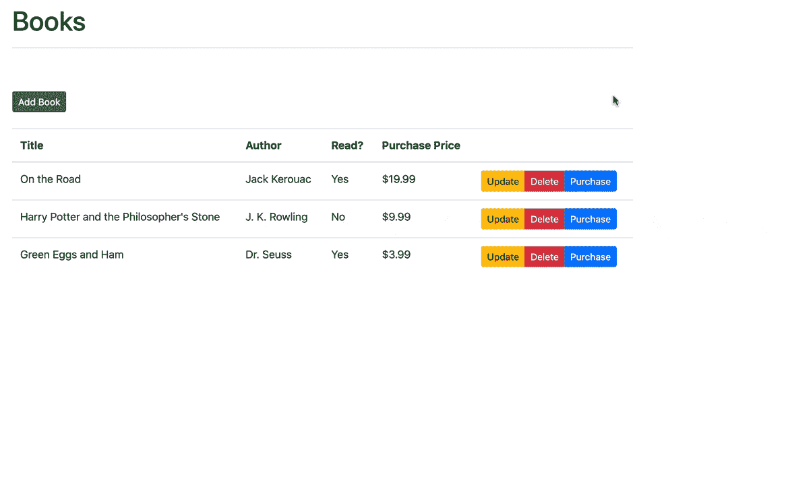
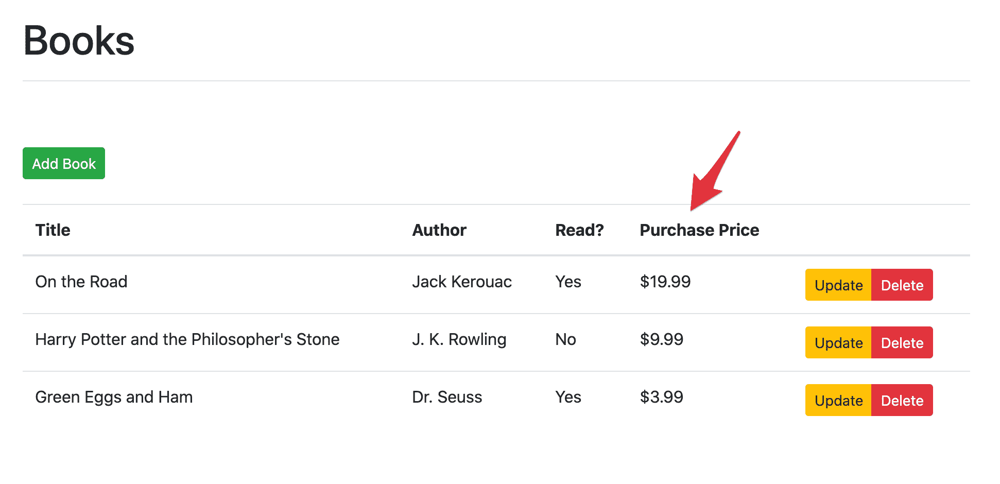
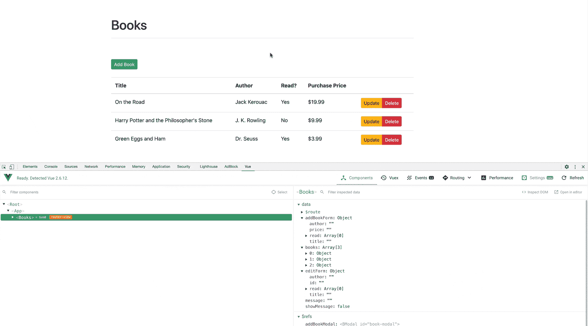
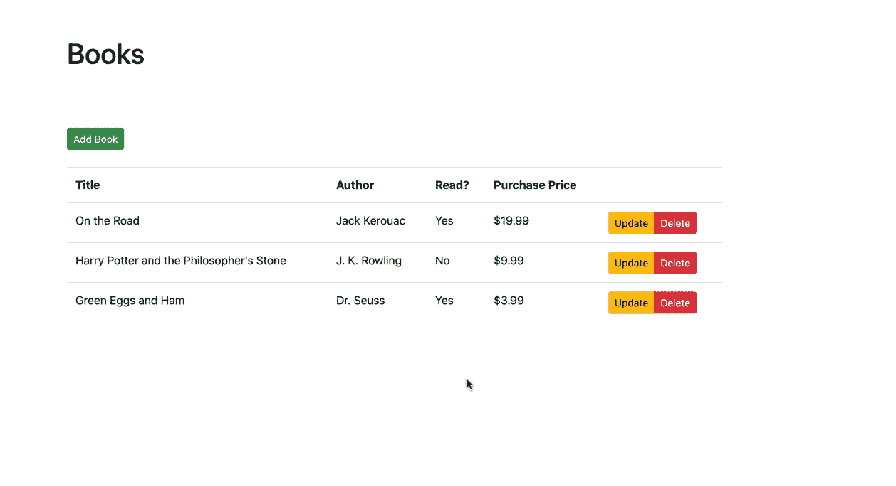
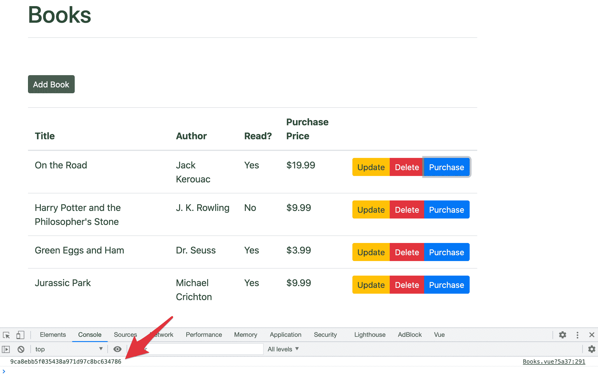
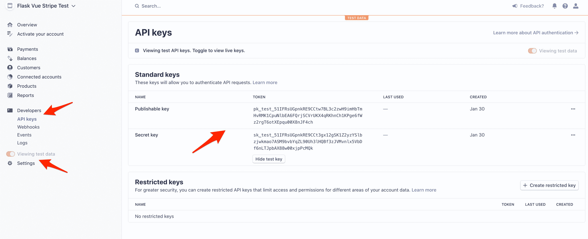
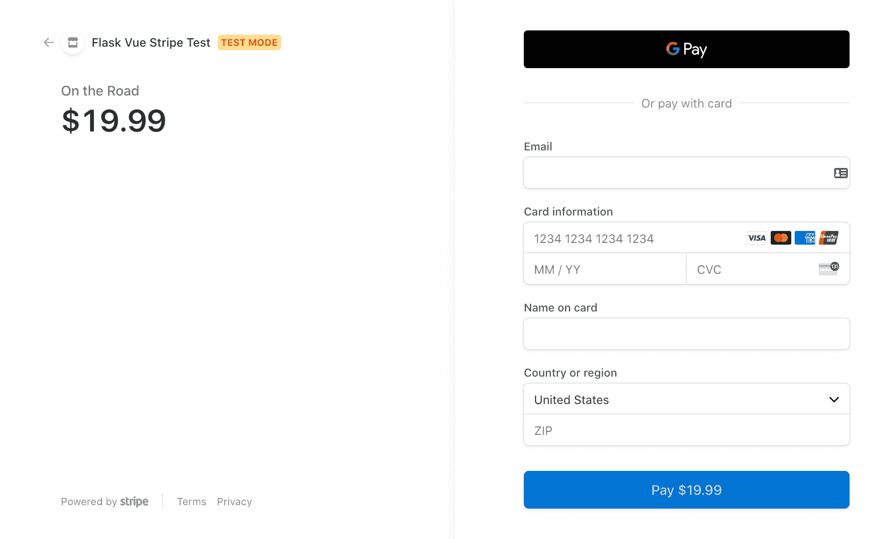
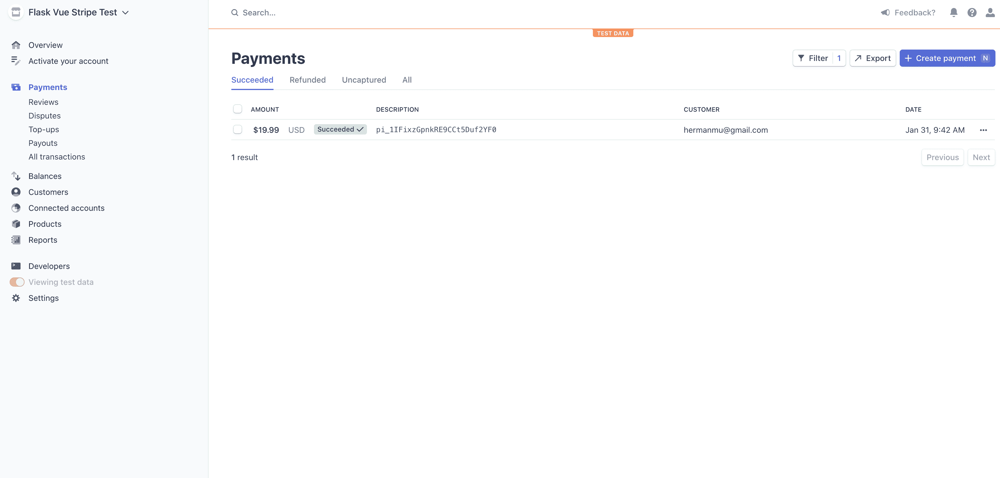

# 接受 Stripe、Vue.js 和 Flask 支付

> 原文：<https://testdriven.io/blog/accepting-payments-with-stripe-vuejs-and-flask/>

在本教程中，我们将使用 [Stripe](https://stripe.com/) (用于支付处理) [Vue.js](https://vuejs.org/) (客户端应用)和 [Flask](http://flask.pocoo.org/) (服务器端 API)开发一个销售图书的 web 应用。

> 这是一个中级教程。它假设你有 Vue 和 Flask 的基本工作知识。查看以下资源以了解更多信息:
> 
> 1.  Flask:Flask、测试驱动开发(TDD)和 JavaScript 简介
> 2.  [用 Flask 和 Vue.js 开发单页应用](/developing-a-single-page-app-with-flask-and-vuejs)
> 3.  [通过构建和部署 CRUD 应用程序学习 Vue](/courses/learn-vue/)

*最终应用*:



*主要依赖:*

*   视图 v2.6.11
*   CLI 视图 v4.5.11
*   节点 v15.7.0
*   国家预防机制 7.4.3 版
*   烧瓶 v1.1.2
*   python 3 . 9 . 1 版

## 目标

本教程结束时，您将能够:

1.  使用现有的 CRUD 应用，由 Vue 和 Flask 提供支持
2.  创建订单结帐 Vue 组件
3.  验证信用卡信息，并通过 Stripe Checkout 处理支付

## 项目设置

从 [flask-vue-crud](https://github.com/testdrivenio/flask-vue-crud) repo 中克隆基础 Flask 和 Vue 项目:

```py
`$ git clone https://github.com/testdrivenio/flask-vue-crud flask-vue-stripe
$ cd flask-vue-stripe` 
```

创建并激活虚拟环境，然后启动 Flask 应用程序:

```py
`$ cd server
$ python3.9 -m venv env
$ source env/bin/activate
(env)$

(env)$ pip install -r requirements.txt
(env)$ python app.py` 
```

> 上述用于创建和激活虚拟环境的命令可能会因您的环境和操作系统而异。

将您选择的浏览器指向[http://localhost:5000/ping](http://localhost:5000/ping)。您应该看到:

然后，安装依赖项并在不同的终端选项卡中运行 Vue 应用程序:

```py
`$ cd client
$ npm install
$ npm run serve` 
```

导航到 [http://localhost:8080](http://localhost:8080) 。确保基本 CRUD 功能按预期工作:


> 想学习如何构建这个项目吗？查看[用 Flask 和 Vue.js 开发单页应用](/developing-a-single-page-app-with-flask-and-vuejs)的博文。

## 我们在建造什么？

我们的目标是建立一个允许最终用户购买书籍的 web 应用程序。

客户端 Vue 应用程序将显示可供购买的书籍，并通过 [Stripe.js](https://stripe.com/docs/stripe-js) 和 [Stripe Checkout](https://stripe.com/payments/checkout) 将最终用户重定向到结帐表单。支付过程完成后，用户将被重定向到同样由 Vue 管理的成功或失败页面。

与此同时，Flask 应用程序使用 [Stripe Python 库](https://github.com/stripe/stripe-python)与 Stripe API 进行交互，以创建一个结帐会话。


> 像之前的教程一样，[用 Flask 和 Vue.js 开发单页应用程序](/developing-a-single-page-app-with-flask-and-vuejs)，我们将只处理应用程序中的快乐之路。通过加入适当的错误处理来检查你的理解。

## 书籍垃圾

首先，让我们在服务器端的现有图书列表中添加购买价格，并在客户端更新适当的 CRUD 函数——GET、POST 和 PUT。

### 得到

首先将`price`添加到 *server/app.py* 中`BOOKS`列表的每个字典中:

```py
`BOOKS = [
    {
        'id': uuid.uuid4().hex,
        'title': 'On the Road',
        'author': 'Jack Kerouac',
        'read': True,
        'price': '19.99'
    },
    {
        'id': uuid.uuid4().hex,
        'title': 'Harry Potter and the Philosopher\'s Stone',
        'author': 'J. K. Rowling',
        'read': False,
        'price': '9.99'
    },
    {
        'id': uuid.uuid4().hex,
        'title': 'Green Eggs and Ham',
        'author': 'Dr. Seuss',
        'read': True,
        'price': '3.99'
    }
]` 
```

然后，更新`Books`组件中的表，*client/src/components/books . vue*，以显示购买价格:

```py
`<table class="table table-hover">
  <thead>
    <tr>
      <th scope="col">Title</th>
      <th scope="col">Author</th>
      <th scope="col">Read?</th>
      <th scope="col">Purchase Price</th>
      <th></th>
    </tr>
  </thead>
  <tbody>
    <tr v-for="(book, index) in books" :key="index">
      <td>{{ book.title }}</td>
      <td>{{ book.author }}</td>
      <td>
        <span v-if="book.read">Yes</span>
        <span v-else>No</span>
      </td>
      <td>${{ book.price }}</td>
      <td>
        <div class="btn-group" role="group">
          <button type="button"
                  class="btn btn-warning btn-sm"
                  v-b-modal.book-update-modal
                  @click="editBook(book)">
              Update
          </button>
          <button type="button"
                  class="btn btn-danger btn-sm"
                  @click="onDeleteBook(book)">
              Delete
          </button>
        </div>
      </td>
    </tr>
  </tbody>
</table>` 
```

您现在应该看到:



### 邮政

在`addBookModal`中增加一个新的`b-form-group`，介于作者和读者`b-form-group`之间 s:

```py
`<b-form-group id="form-price-group"
              label="Purchase price:"
              label-for="form-price-input">
  <b-form-input id="form-price-input"
                type="number"
                step="0.01"
                v-model="addBookForm.price"
                required
                placeholder="Enter price">
  </b-form-input>
</b-form-group>` 
```

模式现在应该看起来像这样:

```py
`<!-- add book modal -->
<b-modal ref="addBookModal"
        id="book-modal"
        title="Add a new book"
        hide-footer>
  <b-form @submit="onSubmit" @reset="onReset" class="w-100">
    <b-form-group id="form-title-group"
                  label="Title:"
                  label-for="form-title-input">
        <b-form-input id="form-title-input"
                      type="text"
                      v-model="addBookForm.title"
                      required
                      placeholder="Enter title">
        </b-form-input>
    </b-form-group>
    <b-form-group id="form-author-group"
                  label="Author:"
                  label-for="form-author-input">
      <b-form-input id="form-author-input"
                    type="text"
                    v-model="addBookForm.author"
                    required
                    placeholder="Enter author">
      </b-form-input>
    </b-form-group>
    <b-form-group id="form-price-group"
                  label="Purchase price:"
                  label-for="form-price-input">
      <b-form-input id="form-price-input"
                    type="number"
                    step="0.01"
                    v-model="addBookForm.price"
                    required
                    placeholder="Enter price">
      </b-form-input>
    </b-form-group>
    <b-form-group id="form-read-group">
        <b-form-checkbox-group v-model="addBookForm.read" id="form-checks">
          <b-form-checkbox value="true">Read?</b-form-checkbox>
        </b-form-checkbox-group>
    </b-form-group>
    <b-button-group>
      <b-button type="submit" variant="primary">Submit</b-button>
      <b-button type="reset" variant="danger">Reset</b-button>
    </b-button-group>
  </b-form>
</b-modal>` 
```

然后，将`price`添加到状态:

```py
`addBookForm:  { title:  '', author:  '', read:  [], price:  '', },` 
```

状态现在被绑定到表单的输入值。想想这意味着什么。当状态被更新时，表单输入也将被更新，反之亦然。下面是一个使用 [vue-devtools](https://github.com/vuejs/vue-devtools) 浏览器扩展的例子:



将`price`添加到`onSubmit`方法中的`payload`中，如下所示:

```py
`onSubmit(evt)  { evt.preventDefault(); this.$refs.addBookModal.hide(); let  read  =  false; if  (this.addBookForm.read[0])  read  =  true; const  payload  =  { title:  this.addBookForm.title, author:  this.addBookForm.author, read,  // property shorthand price:  this.addBookForm.price, }; this.addBook(payload); this.initForm(); },` 
```

在最终用户提交表单或点击“重置”按钮后，更新`initForm`以清除值:

```py
`initForm()  { this.addBookForm.title  =  ''; this.addBookForm.author  =  ''; this.addBookForm.read  =  []; this.addBookForm.price  =  ''; this.editForm.id  =  ''; this.editForm.title  =  ''; this.editForm.author  =  ''; this.editForm.read  =  []; },` 
```

最后，更新 *server/app.py* 中的路线:

```py
`@app.route('/books', methods=['GET', 'POST'])
def all_books():
    response_object = {'status': 'success'}
    if request.method == 'POST':
        post_data = request.get_json()
        BOOKS.append({
            'id': uuid.uuid4().hex,
            'title': post_data.get('title'),
            'author': post_data.get('author'),
            'read': post_data.get('read'),
            'price': post_data.get('price')
        })
        response_object['message'] = 'Book added!'
    else:
        response_object['books'] = BOOKS
    return jsonify(response_object)` 
```

测试一下！



> 不要忘记处理客户端和服务器端的错误！

### 放

编辑一本书时，自己做同样的事情:

1.  向模式添加新的表单输入
2.  状态更新`editForm`
3.  在`onSubmitUpdate`方法中，将`price`添加到`payload`中
4.  更新`initForm`
5.  更新服务器端路由

> 需要帮助吗？再次回顾前一节。你也可以从 [flask-vue-stripe](https://github.com/testdrivenio/flask-vue-stripe) repo 中抓取最终代码。

## 购买按钮

在`Books`组件中添加一个“购买”按钮，就在“删除”按钮的下面:

```py
`<td>
  <div class="btn-group" role="group">
    <button type="button"
            class="btn btn-warning btn-sm"
            v-b-modal.book-update-modal
            @click="editBook(book)">
        Update
    </button>
    <button type="button"
            class="btn btn-danger btn-sm"
            @click="onDeleteBook(book)">
        Delete
    </button>
    <button type="button"
            class="btn btn-primary btn-sm"
            @click="purchaseBook(book.id)">
        Purchase
    </button>
  </div>
</td>` 
```

接下来，将`purchaseBook`添加到组件的`methods`中:

```py
`purchaseBook(bookId)  { console.log(bookId); },` 
```

测试一下:



## 条纹钥匙

注册一个 [Stripe](https://stripe.com) 账户，如果你还没有的话。

### 计算机网络服务器

安装条带 Python 库:

```py
`(env)$ pip install stripe==2.55.1` 
```

从 Stripe 仪表盘中抓取*测试模式* [API 键](https://stripe.com/docs/keys):



在运行服务器的终端窗口中将它们设置为环境变量:

```py
`(env)$ export STRIPE_PUBLISHABLE_KEY=<YOUR_STRIPE_PUBLISHABLE_KEY>
(env)$ export STRIPE_SECRET_KEY=<YOUR_STRIPE_SECRET_KEY>` 
```

将条带库导入到 *server/app.py* 中，并将密钥分配给`stripe.api_key`，以便在与 API 交互时自动使用它们:

```py
`import os
import uuid

import stripe
from flask import Flask, jsonify, request
from flask_cors import CORS

...

# configuration
DEBUG = True

# instantiate the app
app = Flask(__name__)
app.config.from_object(__name__)

# configure stripe
stripe_keys = {
    'secret_key': os.environ['STRIPE_SECRET_KEY'],
    'publishable_key': os.environ['STRIPE_PUBLISHABLE_KEY'],
}

stripe.api_key = stripe_keys['secret_key']

# enable CORS
CORS(app, resources={r'/*': {'origins': '*'}})

...

if __name__ == '__main__':
    app.run()` 
```

接下来，添加一个返回可发布密钥的新路由处理程序:

```py
`@app.route('/config')
def get_publishable_key():
    stripe_config = {'publicKey': stripe_keys['publishable_key']}
    return jsonify(stripe_config)` 
```

这将在客户端用于配置 Stripe.js 库。

### 客户

转向客户端，将 [Stripe.js](https://stripe.com/docs/js) 添加到 *client/public/index.html* :

```py
`<!DOCTYPE html>
<html lang="">
  <head>
    <meta charset="utf-8">
    <meta http-equiv="X-UA-Compatible" content="IE=edge">
    <meta name="viewport" content="width=device-width,initial-scale=1.0">
    <link rel="icon" href="<%= BASE_URL %>favicon.ico">
    <title><%= htmlWebpackPlugin.options.title %></title>
    <script src="https://js.stripe.com/v3/"></script>
  </head>
  <body>
    <noscript>
      <strong>We're sorry but <%= htmlWebpackPlugin.options.title %> doesn't work properly without JavaScript enabled. Please enable it to continue.</strong>
    </noscript>
    <div id="app"></div>
    <!-- built files will be auto injected -->
  </body>
</html>` 
```

接下来，向名为`getStripePublishableKey`的`Books`组件添加一个新方法:

```py
`getStripePublishableKey()  { fetch('http://localhost:5000/config') .then((result)  =>  result.json()) .then((data)  =>  { // Initialize Stripe.js this.stripe  =  Stripe(data.publicKey);  // eslint-disable-line no-undef }); },` 
```

在`created`钩子中调用这个方法:

```py
`created()  { this.getBooks(); this.getStripePublishableKey(); },` 
```

现在，在创建实例之后，将调用`http://localhost:5000/config`，它将使用 Stripe publish key 进行响应。然后，我们将使用这个键创建 Stripe.js 的新实例。

> 发货到生产？您将希望使用一个环境变量来动态设置基本的服务器端 URL(当前是`http://localhost:5000`)。查看[文档](https://vuejs-templates.github.io/webpack/env.html)了解更多信息。

将`stripe`添加到“状态:

```py
`data()  { return  { books:  [], addBookForm:  { title:  '', author:  '', read:  [], price:  '', }, message:  '', showMessage:  false, editForm:  { id:  '', title:  '', author:  '', read:  [], price:  '', }, stripe:  null, }; },` 
```

## 条带检验

接下来，我们需要在服务器端生成一个新的签出会话 ID。单击购买按钮后，一个 AJAX 请求将被发送到服务器以生成这个 ID。服务器将发送回 ID，用户将被重定向到收银台。

### 计算机网络服务器

添加以下路由处理程序:

```py
`@app.route('/create-checkout-session', methods=['POST'])
def create_checkout_session():
    domain_url = 'http://localhost:8080'

    try:
        data = json.loads(request.data)

        # get book
        book_to_purchase = ''
        for book in BOOKS:
            if book['id'] == data['book_id']:
                book_to_purchase = book

        # create new checkout session
        checkout_session = stripe.checkout.Session.create(
            success_url=domain_url +
            '/success?session_id={CHECKOUT_SESSION_ID}',
            cancel_url=domain_url + '/canceled',
            payment_method_types=['card'],
            mode='payment',
            line_items=[
                {
                    'name': book_to_purchase['title'],
                    'quantity': 1,
                    'currency': 'usd',
                    'amount': round(float(book_to_purchase['price']) * 100),
                }
            ]
        )

        return jsonify({'sessionId': checkout_session['id']})
    except Exception as e:
        return jsonify(error=str(e)), 403` 
```

在这里，我们-

1.  定义了一个`domain_url`，用于在购买完成后将用户重定向回客户端
2.  获得图书信息
3.  创建了签出会话
4.  在响应中发回了 ID

记下`success_url`和`cancel_url`。在成功支付或取消的情况下，用户将分别被重定向回这些 URL。我们将很快在客户端设置`/success`和`/cancelled`路线。

另外，你注意到我们通过`round(float(book_to_purchase['price']) * 100)`把浮点数转换成整数了吗？Stripe 只允许价格的整数值。对于生产代码，您可能希望将价格作为整数值存储在数据库中——例如，$3.99 应该存储为`399`。

将导入添加到顶部:

### 客户

在客户端，更新`purchaseBook`方法:

```py
`purchaseBook(bookId)  { // Get Checkout Session ID fetch('http://localhost:5000/create-checkout-session',  { method:  'POST', headers:  { 'Content-Type':  'application/json', }, body:  JSON.stringify({  book_id:  bookId  }), }) .then((result)  =>  result.json()) .then((data)  =>  { console.log(data); // Redirect to Stripe Checkout return  this.stripe.redirectToCheckout({  sessionId:  data.sessionId  }); }) .then((res)  =>  { console.log(res); }); },` 
```

这里，在解析了`result.json()`承诺之后，我们调用了 [redirectToCheckout](https://stripe.com/docs/js/checkout/redirect_to_checkout) 方法，该方法带有来自已解析承诺的结帐会话 ID。

让我们来测试一下。导航到 [http://localhost:8080](http://localhost:8080) 。单击其中一个购买按钮。您将被重定向到一个 Stripe Checkout 实例(一个 Stripe 托管页面，用于安全收集支付信息),其中包含基本产品信息:



您可以使用 Stripe 提供的几个[测试卡号](https://stripe.com/docs/testing#cards)中的一个来测试表单。还是用`4242 4242 4242 4242`吧。

*   电子邮件:有效的电子邮件
*   卡号:`4242 4242 4242 4242`
*   到期日:未来的任何日期
*   CVC:任何三个数字
*   名称:任何东西
*   邮政编码:任意五个数字

应该可以成功处理支付，但是重定向会失败，因为我们还没有设置`/success`路线。

您应该会在[条纹仪表盘](https://dashboard.stripe.com/)中看到购买信息:



## 重定向页面

最后，让我们设置用于处理成功支付或取消的路由和组件。

### 成功

当支付成功时，我们会将用户重定向到订单完成页面，感谢他们进行购买。

将名为 *OrderSuccess.vue* 的新组件文件添加到“client/src/components”中:

```py
`<template>
  <div class="container">
    <div class="row">
      <div class="col-sm-10">
        <h1>Thanks for purchasing!</h1>
        <hr><br>
        <router-link to="/" class="btn btn-primary btn-sm">Back Home</router-link>
      </div>
    </div>
  </div>
</template>` 
```

更新*客户端/src/路由器*中的路由器:

```py
`import  Vue  from  'vue'; import  Router  from  'vue-router'; import  Books  from  '../components/Books.vue'; import  OrderSuccess  from  '../components/OrderSuccess.vue'; import  Ping  from  '../components/Ping.vue'; Vue.use(Router); export  default  new  Router({ mode:  'history', base:  process.env.BASE_URL, routes:  [ { path:  '/', name:  'Books', component:  Books, }, { path:  '/ping', name:  'Ping', component:  Ping, }, { path:  '/success', name:  'OrderSuccess', component:  OrderSuccess, }, ], });` 
```


最后，您可以使用`session_id`查询参数显示关于购买的信息:

```py
`http://localhost:8080/success?session_id=cs_test_a1qw4pxWK9mF2SDvbiQXqg5quq4yZYUvjNkqPq1H3wbUclXOue0hES6lWl` 
```

您可以像这样访问它:

```py
`<script> export  default  { mounted()  { console.log(this.$route.query.session_id); }, }; </script>` 
```

从这里开始，您需要在服务器端设置一个路由处理器，通过`stripe.checkout.Session.retrieve(id)`查找会话信息。自己尝试一下。

### 取消

对于`/canceled`重定向，添加一个名为*client/src/components/order canceled . vue*的新组件:

```py
`<template>
  <div class="container">
    <div class="row">
      <div class="col-sm-10">
        <h1>Your payment was cancelled.</h1>
        <hr><br>
        <router-link to="/" class="btn btn-primary btn-sm">Back Home</router-link>
      </div>
    </div>
  </div>
</template>` 
```

然后，更新路由器:

```py
`import  Vue  from  'vue'; import  Router  from  'vue-router'; import  Books  from  '../components/Books.vue'; import  OrderCanceled  from  '../components/OrderCanceled.vue'; import  OrderSuccess  from  '../components/OrderSuccess.vue'; import  Ping  from  '../components/Ping.vue'; Vue.use(Router); export  default  new  Router({ mode:  'history', base:  process.env.BASE_URL, routes:  [ { path:  '/', name:  'Books', component:  Books, }, { path:  '/ping', name:  'Ping', component:  Ping, }, { path:  '/success', name:  'OrderSuccess', component:  OrderSuccess, }, { path:  '/canceled', name:  'OrderCanceled', component:  OrderCanceled, }, ], });` 
```

最后一次测试。

## 结论

就是这样！确保从头开始回顾目标。你可以在 GitHub 上的 [flask-vue-stripe](https://github.com/testdrivenio/flask-vue-stripe) repo 中找到最终代码。

想要更多吗？

1.  添加客户端和服务器端单元和集成测试。
2.  创建一个购物车，以便客户可以一次购买多本书。
3.  添加 Postgres 来存储书籍和订单。
4.  用 Docker 将 Vue 和 Flask(以及 Postgres，如果你添加的话)容器化，以简化开发工作流程。
5.  将图片添加到书籍中，并创建一个更强大的产品页面。
6.  捕获电子邮件并发送电子邮件确认(查看[使用 Flask、Redis Queue 和 Amazon SES 发送确认电子邮件](/sending-confirmation-emails-with-flask-rq-and-ses))。
7.  将客户端静态文件部署到 AWS S3，将服务器端应用程序部署到 EC2 实例。
8.  投产？思考更新条带键的最佳方式，以便它们可以根据环境动态变化。