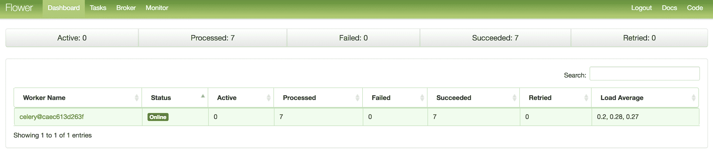
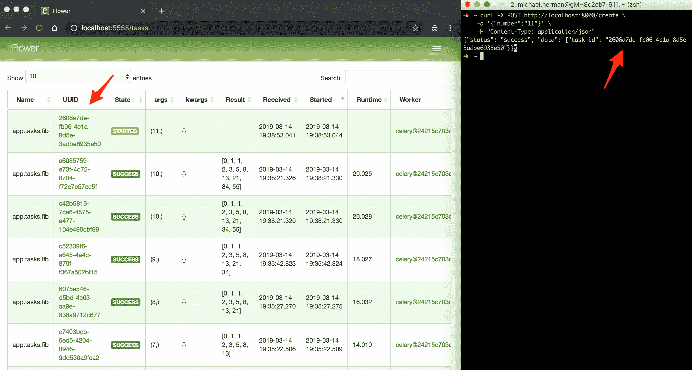
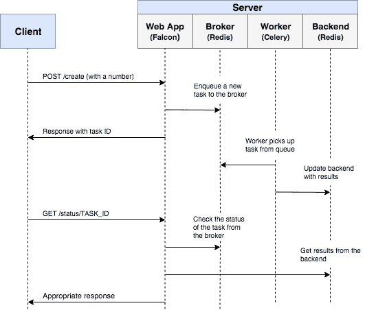
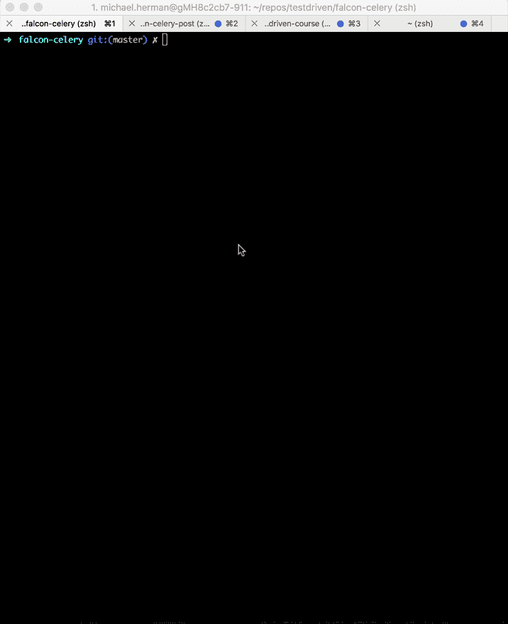

# 猎鹰和芹菜的异步任务

> 原文：<https://testdriven.io/blog/asynchronous-tasks-with-falcon-and-celery/>

异步任务用于将容易失败的密集、耗时的流程转移到后台，以便可以立即向客户端返回响应。

本教程着眼于如何将异步任务队列 [Celery](https://docs.celeryq.dev/) 集成到基于 Python 的 [Falcon](https://falconframework.org/) web 框架中。我们还将使用 Docker 和 Docker Compose 将所有内容联系在一起。最后，我们将看看如何用单元测试和集成测试来测试 Celery 任务。

## 学习目标

学完本教程后，您应该能够:

1.  将芹菜整合到猎鹰网络应用程序中。
2.  用码头工人把猎鹰、芹菜和红萝卜装进集装箱。
3.  使用单独的工作进程在后台执行任务。
4.  将芹菜日志保存到文件中。
5.  设置 [Flower](http://flower.readthedocs.io/) 来监控和管理芹菜作业和工人。
6.  用单元测试和集成测试来测试芹菜任务。

## 后台任务

同样，为了改善用户体验，长时间运行的流程应该在正常的 HTTP 请求/响应流程之外，在后台进程中运行。

示例:

1.  发送确认电子邮件
2.  刮擦和爬行
3.  分析数据
4.  图像处理
5.  制作每日报告
6.  运行机器学习模型

当你构建一个应用程序时，试着区分应该在请求/响应生命周期中运行的任务(比如 CRUD 操作)和应该在后台运行的任务。

## 猎鹰框架

Falcon 是一个微型 Python web 框架，非常适合创建后端 RESTful APIs。Falcon 感觉很像 Flask，但是在开发和[性能](https://falconframework.org/#sectionBenchmarks)方面都要快很多。

> Falcon 是一个极简主义的 WSGI 库，用于构建快速的 web APIs 和应用程序后端。我们喜欢将 Falcon 视为 web 框架的迪特·拉姆斯。
> 
> 当涉及到构建 HTTP APIs 时，其他框架会用大量的依赖性和不必要的抽象来拖累你。Falcon 以简洁的设计切入正题，它包含了 HTTP 和 REST 架构风格。

请务必查看官方[文档](https://falcon.readthedocs.io/en/stable/)了解更多信息。

## 项目设置

克隆基础项目:

```
`$ git clone https://github.com/testdrivenio/falcon-celery --branch base --single-branch
$ cd falcon-celery` 
```

快速浏览一下代码和项目结构，然后使用 Docker 启动应用程序:

```
`$ docker-compose up -d --build` 
```

构建和运行映像应该只需要一点时间。一旦完成，该应用程序应该在[http://localhost:8000/ping](http://localhost:8000/ping)上运行。

确保测试通过:

```
`$ docker-compose run web python test.py

.
----------------------------------------------------------------------
Ran 1 test in 0.001s

OK` 
```

## 芹菜

现在有趣的部分来了——添加[芹菜](https://docs.celeryq.dev/)！首先将芹菜和 Redis 添加到 *requirements.txt* 文件中:

```
`celery==5.2.7
falcon==3.1.0
gunicorn==20.1.0
redis==4.3.4` 
```

### 创建任务

向“项目/应用程序”目录添加一个名为 *tasks.py* 的新文件:

```
`# project/app/tasks.py

import os
from time import sleep

import celery

CELERY_BROKER = os.environ.get('CELERY_BROKER')
CELERY_BACKEND = os.environ.get('CELERY_BACKEND')

app = celery.Celery('tasks', broker=CELERY_BROKER, backend=CELERY_BACKEND)

@app.task
def fib(n):
    sleep(2)  # simulate slow computation
    if n < 0:
        return []
    elif n == 0:
        return [0]
    elif n == 1:
        return [0, 1]
    else:
        results = fib(n - 1)
        results.append(results[-1] + results[-2])
        return results` 
```

在这里，我们创建了一个新的芹菜实例，并定义了一个名为`fib`的新芹菜任务[T2，它根据给定的数字计算斐波那契数列。](https://docs.celeryq.dev/en/stable/userguide/tasks.html)

Celery 使用消息代理来促进 Celery worker 和 web 应用程序之间的通信。消息被添加到代理中，然后由工作人员进行处理。一旦完成，结果被添加到后端。

Redis 将被用作代理和后端。将 Redis 和芹菜[工人](https://docs.celeryq.dev/en/stable/userguide/workers.html)添加到 *docker-compose.yml* 文件中:

```
`version:  '3.8' services: web: build:  ./project image:  web container_name:  web ports: -  8000:8000 volumes: -  ./project:/usr/src/app command:  gunicorn -b 0.0.0.0:8000 app:app environment: -  CELERY_BROKER=redis://redis:6379/0 -  CELERY_BACKEND=redis://redis:6379/0 depends_on: -  redis celery: image:  web volumes: -  ./project:/usr/src/app command:  celery -A app.tasks worker --loglevel=info environment: -  CELERY_BROKER=redis://redis:6379/0 -  CELERY_BACKEND=redis://redis:6379/0 depends_on: -  web -  redis redis: image:  redis:7-alpine` 
```

添加一个新的路由处理程序，将`fib`任务启动到 *__init__。py* :

```
`class CreateTask(object):

    def on_post(self, req, resp):
        raw_json = req.stream.read()
        result = json.loads(raw_json)
        task = fib.delay(int(result['number']))
        resp.status = falcon.HTTP_200
        result = {
            'status': 'success',
            'data': {
                'task_id': task.id
            }
        }
        resp.text = json.dumps(result)` 
```

注册路线:

```
`app.add_route('/create', CreateTask())` 
```

导入任务:

```
`from app.tasks import fib` 
```

构建映像并旋转容器:

```
`$ docker-compose up -d --build` 
```

测试:

```
`$ curl -X POST http://localhost:8000/create \
    -d '{"number":"4"}' \
    -H "Content-Type: application/json"` 
```

您应该会看到类似这样的内容:

```
`{
  "status": "success",
  "data": {
    "task_id": "d935fa51-44ad-488f-b63d-6b0e178700a8"
  }
}` 
```

### 检查任务状态

接下来，添加一个新的路由处理程序来检查任务的状态:

```
`class CheckStatus(object):

    def on_get(self, req, resp, task_id):
        task_result = AsyncResult(task_id)
        result = {'status': task_result.status, 'result': task_result.result}
        resp.status = falcon.HTTP_200
        resp.text = json.dumps(result)` 
```

注册路线:

```
`app.add_route('/status/{task_id}', CheckStatus())` 
```

导入[异步结果](https://docs.celeryq.dev/en/stable/reference/celery.result.html):

```
`from celery.result import AsyncResult` 
```

更新容器:

```
`$ docker-compose up -d --build` 
```

触发新任务:

```
`$ curl -X POST http://localhost:8000/create \
    -d '{"number":"3"}' \
    -H "Content-Type: application/json"

{
  "status": "success",
  "data": {
    "task_id": "65a1c427-ee08-4fb1-9842-d0f90d081c54"
  }
}` 
```

然后，使用返回的`task_id`检查状态:

```
`$ curl http://localhost:8000/status/65a1c427-ee08-4fb1-9842-d0f90d081c54

{
  "status": "SUCCESS", "result": [0, 1, 1, 2]
}` 
```

### 日志

更新`celery`服务，以便将芹菜日志转储到一个日志文件:

```
`celery: image:  web volumes: -  ./project:/usr/src/app -  ./project/logs:/usr/src/app/logs  # add this line command:  celery -A app.tasks worker --loglevel=info  --logfile=logs/celery.log  # update this line environment: -  CELERY_BROKER=redis://redis:6379/0 -  CELERY_BACKEND=redis://redis:6379/0 depends_on: -  web -  redis` 
```

更新:

```
`$ docker-compose up -d --build` 
```

因为我们设置了一个卷，所以您应该在本地的 *logs/celery.log* 中看到日志文件:

```
`[2022-11-15  17:44:31,471:  INFO/MainProcess]  Connected  to  redis://redis:6379/0
[2022-11-15  17:44:31,476:  INFO/MainProcess]  mingle:  searching  for  neighbors [2022-11-15  17:44:32,488:  INFO/MainProcess]  mingle:  all  alone [2022-11-15  17:44:32,503:  INFO/MainProcess]  celery@80a00f0c917e  ready. [2022-11-15  17:44:32,569:  INFO/MainProcess]  Received  task:  app.tasks.fib[0b161c4d-5e1c-424a-ae9f-5c3e84de5043] [2022-11-15  17:44:32,593:  INFO/ForkPoolWorker-1]  Task  app.tasks.fib[0b161c4d-5e1c-424a-ae9f-5c3e84de5043]  succeeded  in  6.018030700040981s:  [0,  1,  1,  2]` 
```

## 花

[Flower](http://flower.readthedocs.io/) 是一个基于网络的芹菜实时监控工具。您可以监控当前正在运行的任务，增加或减少工作池，查看图表和一些统计数据，等等。

添加到 *requirements.txt:*

```
`celery==5.2.7
falcon==3.1.0
flower==1.2.0
gunicorn==20.1.0
redis==4.3.4` 
```

然后将服务添加到 *docker-compose.yml* :

```
`monitor: image:  web ports: -  5555:5555 command:  celery flower -A app.tasks --port=5555 --broker=redis://redis:6379/0 environment: -  CELERY_BROKER=redis://redis:6379/0 -  CELERY_BACKEND=redis://redis:6379/0 depends_on: -  web -  redis` 
```

测试一下:

```
`$ docker-compose up -d --build` 
```

导航到 [http://localhost:5555](http://localhost:5555) 查看仪表板。您应该看到一名员工准备就绪:



触发更多的任务:



## 流动

在编写任何测试之前，让我们后退一步，看看整个工作流程。

本质上，HTTP POST 请求命中了`/create`。在路由处理程序中，消息被添加到代理中，Celery worker 进程从队列中获取消息并处理任务。同时，web 应用程序继续正常执行和运行，向客户机发回一个带有任务 ID 的响应。然后，客户机可以用 HTTP GET 请求点击`/status/<TASK_ID>`端点来检查任务的状态。



## 试验

让我们从单元测试开始:

```
`class TestCeleryTasks(unittest.TestCase):

    def test_fib_task(self):
        self.assertEqual(tasks.fib.run(-1), [])
        self.assertEqual(tasks.fib.run(1), [0, 1])
        self.assertEqual(tasks.fib.run(3), [0, 1, 1, 2])
        self.assertEqual(tasks.fib.run(5), [0, 1, 1, 2, 3, 5])` 
```

将上面的测试用例添加到 *project/test.py* 中，然后更新导入:

```
`import unittest

from falcon import testing

from app import app, tasks` 
```

运行:

```
`$ docker-compose run web python test.py` 
```

应该需要大约 20 秒来运行:

```
`..
----------------------------------------------------------------------
Ran 2 tests in 20.038s

OK` 
```

值得注意的是，在上面的断言中，我们使用了`.run`方法(而不是`.delay`)来直接运行任务，而没有芹菜工人。

想模拟芹菜任务吗？

```
`class TestCeleryTasks(unittest.TestCase):

    # def test_fib_task(self):
    #     self.assertEqual(tasks.fib.run(-1), [])
    #     self.assertEqual(tasks.fib.run(1), [0, 1])
    #     self.assertEqual(tasks.fib.run(3), [0, 1, 1, 2])
    #     self.assertEqual(tasks.fib.run(5), [0, 1, 1, 2, 3, 5])

    @patch('app.tasks.fib')
    def test_mock_fib_task(self, mock_fib):
        mock_fib.run.return_value = []
        self.assertEqual(tasks.fib.run(-1), [])
        mock_fib.run.return_value = [0, 1]
        self.assertEqual(tasks.fib.run(1), [0, 1])
        mock_fib.run.return_value = [0, 1, 1, 2]
        self.assertEqual(tasks.fib.run(3), [0, 1, 1, 2])
        mock_fib.run.return_value = [0, 1, 1, 2, 3, 5]
        self.assertEqual(tasks.fib.run(5), [0, 1, 1, 2, 3, 5])` 
```

添加导入:

```
`from unittest.mock import patch` 
```

```
`$ docker-compose run web python test.py

..
----------------------------------------------------------------------
Ran 2 tests in 0.002s

OK` 
```

好多了！

您还可以通过运行以下脚本，从容器外部运行完整的集成测试:

```
`#!/bin/bash

# trigger jobs
test=`curl -X POST http://localhost:8000/create \
    -d '{"number":"2"}' \
    -H "Content-Type: application/json" \
    -s \
| jq -r '.data.task_id'`

# get status
check=`curl http://localhost:8000/status/${test} -s | jq -r '.status'`

while [ "$check" != "SUCCESS" ]
do
  check=`curl http://localhost:8000/status/${test} -s | jq -r '.status'`
  echo $(curl http://localhost:8000/status/${test} -s)
done` 
```



请记住，这与开发中使用的代理和后端是一样的。您可能想要实例化一个新的 Celery 应用程序来进行测试:

```
`app = celery.Celery('tests', broker=CELERY_BROKER, backend=CELERY_BACKEND)` 
```

## 后续步骤

寻找一些挑战？

1.  启动 [DigitalOcean](https://m.do.co/c/d8f211a4b4c2) 并使用 Docker Swarm 或 Kubernetes 将该应用程序部署到多个 droplets 上。
2.  使用 React、Angular、Vue 或普通 JavaScript 添加一个基本客户端。允许最终用户开始一项新任务。建立一个轮询机制来检查任务的状态。

从[回购](https://github.com/testdrivenio/falcon-celery)中抓取代码。