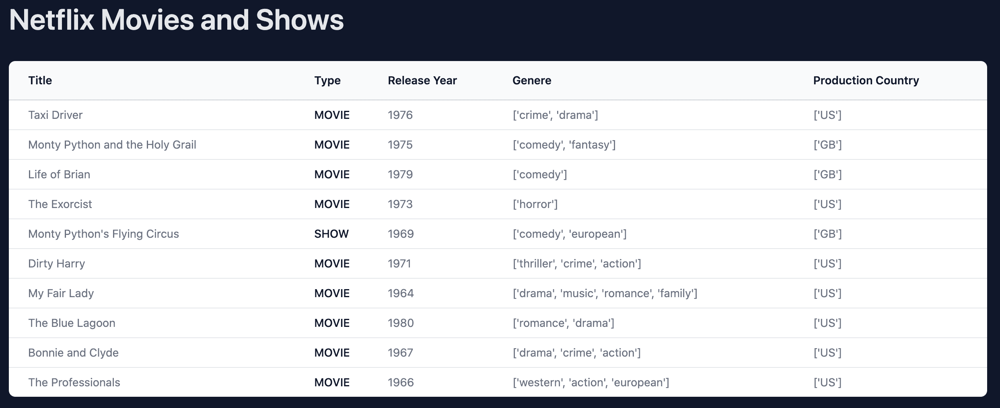

# 用 Python 和 Pyodide 构建单页面应用程序——第 1 部分

> 原文：<https://testdriven.io/blog/build-spa-with-python-part-1/>

> 如果你和一个人用他能理解的语言交谈，那会进入他的大脑。如果你用他自己的语言和他交谈，那会触及他的内心。
> 
> 纳尔逊·曼德拉

WebAssembly (WASM)为许多语言在不同的环境中使用打开了大门——比如浏览器、云、无服务器和区块链，仅举几个例子——这些语言以前不可能在这些环境中使用。例如，使用利用 WASM 的 [Pyodide](https://pyodide.org/) ，您可以在浏览器中运行 Python。你也可以使用像 [Wasmer](https://wasmer.io/) 这样的运行时将 Python 编译成 WebAssembly，将其容器化，然后在 edge、IoT、操作系统等不同的目的地运行容器。

在本教程中，您将使用 Python 和 Pyodide 构建一个单页面应用程序来操作 DOM 和管理状态。

--

**Python 单页面应用系列:**

1.  *第一部分*(本教程！):学习 Pyodide 的基础知识并创建基础应用程序
2.  *[第二部分](/blog/build-spa-with-python-part-2)* :用 Pandas 分析和操作数据，使用 web worker 加速应用程序
3.  *[第三部分](/blog/build-spa-with-python-part-3)* :创建 Python 包，添加附加特性，添加持久化数据层

## 目标

学完本教程后，您应该能够:

1.  使用 Pyodide 和 JavaScript 在两者之间共享和访问对象
2.  直接从 Python 代码操作 DOM
3.  在浏览器中运行 Python 强大的数据科学库
4.  创建一个单页面应用程序(SPA)应用程序，它从远程文件中获取数据，用 Pandas 处理数据，并在浏览器中呈现数据

## 浏览器中的 Python

*这是什么意思？*

在浏览器中运行 Python 意味着我们可以直接在客户端执行 Python 代码，而不需要在服务器上托管和执行代码。这是通过 [WebAssembly](/blog/python-webassembly/#webassembly) 实现的，它允许我们构建真正的“无服务器”应用。

为什么它很重要？为什么不用 JavaScript 呢？

在浏览器中运行 Python 的主要目标不是取代 JavaScript，而是将两种语言结合在一起，让每个社区都能使用彼此强大的工具和库。例如，在本教程中，我们将使用 Python 的 [Pandas](https://pandas.pydata.org/) 库和 JavaScript。

## 我们正在建造的东西

在本系列教程中，我们将构建一个无服务器的单页应用程序(SPA ),它获取[网飞电影并显示数据集](https://github.com/amirtds/kaggle-netflix-tv-shows-and-movies/blob/main/titles.csv),并使用 Pandas 来读取、整理、操作和分析数据。然后，结果显示在 DOM 上，供最终用户查看。

我们的最终项目是一个 SPA，显示电影和电视节目列表、推荐的电影和节目以及有趣的事实。最终用户将能够删除和过滤电影和节目。数据保存在 [PouchDB](https://pouchdb.com/) 中。

在这一部分，我们将重点关注:

1.  学习大熊猫的基本知识
2.  在 Python 和 JavaScript 之间共享对象和方法
3.  从 Python 代码操作 DOM
4.  构建基本的应用程序结构



您可以在这里找到您将在第一部分[中创建的应用程序的现场演示。](https://netflix-analysis-spa-part-1.onrender.com)

## 用 Python 操作 DOM

在我们开始构建应用程序之前，让我们快速看一下如何使用 Python 与 [DOM API](https://developer.mozilla.org/en-US/docs/Web/API/Document_Object_Model) 进行交互来直接操作它。

首先，创建一个名为*index.html*的新 HTML 文件:

```
`<!DOCTYPE html>
<html>
  <head>
    <script src="https://cdn.jsdelivr.net/pyodide/v0.20.0/full/pyodide.js"></script>
  </head>

  <body>
    <p id="title">My first Pyodide app</p>

    <script> async  function  main()  { let  pyodide  =  await  loadPyodide(); pyodide.runPython(`print('Hello world, from the browser!')`); }; main(); </script>
  </body>
</html>` 
```

在这里，我们从 CDN 加载了主要的 Pyodide 运行时以及 Pyodide 的内置[包](https://github.com/pyodide/pyodide/tree/0.20.0/packages)，并使用 [runPython](https://pyodide.org/en/stable/usage/api/js-api.html#pyodide.runPython) 方法运行了一个简单的 Python 脚本。

在浏览器中打开文件。然后，在浏览器的[开发者工具](https://developer.mozilla.org/en-US/docs/Learn/Common_questions/What_are_browser_developer_tools)的控制台中，您应该会看到:

```
`Loading distutils
Loaded distutils
Python initialization complete
Hello world, from the browser!` 
```

最后一行显示我们的 Python 代码是在浏览器中执行的。现在让我们看看如何访问 DOM。为此，我们可以导入 js 库来访问 JavaScript 范围。

像这样更新 HTML 文件:

```
`<!DOCTYPE html>
<html>
  <head>
    <script src="https://cdn.jsdelivr.net/pyodide/v0.20.0/full/pyodide.js"></script>
  </head>

  <body>
    <p id="title">My first Pyodide app</p>

    <script> async  function  main()  { let  pyodide  =  await  loadPyodide(); pyodide.runPython(`
 print('Hello world, from the browser!')

 import js
 js.document.title = "Hello from Python"
 `); }; main(); </script>
  </body>
</html>` 
```

因此，`js`表示全局对象`window`,它可以用来直接操作 DOM 和访问全局变量和函数。我们用它将浏览器/文档标题改为“来自 Python 的你好”。

刷新浏览器以确保其正常工作。

接下来，我们把段落内文从“我的第一个 Pyodide app”更新为“被 Python 取代”:

```
`<!DOCTYPE html>
<html>
  <head>
    <script src="https://cdn.jsdelivr.net/pyodide/v0.20.0/full/pyodide.js"></script>
  </head>

  <body>
    <p id="title">My first Pyodide app</p>

    <script> async  function  main()  { let  pyodide  =  await  loadPyodide(); pyodide.runPython(`
 print('Hello world, from the browser!')

 import js
 js.document.title = "Hello from Python"

 js.document.getElementById("title").innerText = "Replaced by Python"
 `); }; main(); </script>
  </body>
</html>` 
```

保存文件，并再次刷新页面。

## 类型翻译

Pyodide 的一个很棒的特性是你可以在 Python 和 JavaScript 之间传递对象。有两种翻译方法:

1.  [隐式转换](https://pyodide.org/en/stable/usage/type-conversions.html#implicit-conversions)转换两种语言中都存在的基本数据类型——例如，将 Python `str`转换为 JavaScript `String`。
2.  [代理对象](https://pyodide.org/en/stable/usage/type-conversions.html#proxying)转换语言之间不共享的对象/类型。

### 隐式转换

如前所述，基本数据类型将在 Python 和 JavaScript 之间直接转换，无需创建特殊对象。

| 计算机编程语言 | Java Script 语言 |
| --- | --- |
| `int` | `Number`或`BigInt` |
| `float` | `Number` |
| `str` | `String` |
| `bool` | `Boolean` |
| `None` | `undefined` |

| Java Script 语言 | 计算机编程语言 |
| --- | --- |
| `Number` | `int`或`float` |
| `BigInt` | `int` |
| `String` | `str` |
| `Boolean` | `bool` |
| `undefined` | `None` |
| `null` | `None` |

让我们看一个例子。

首先向`script`标签添加一个名为`name`的新变量:

```
`<script> var  name  =  "John Doe";  // NEW! async  function  main()  { let  pyodide  =  await  loadPyodide(); pyodide.runPython(`
 print('Hello world, from the browser!')

 import js
 js.document.title = "Hello from Python"

 js.document.getElementById("title").innerText = "Replaced by Python"
 `); }; main(); </script>` 
```

接下来，让我们看看使用 js 的类型和值:

```
`<script> var  name  =  "John Doe"; async  function  main()  { let  pyodide  =  await  loadPyodide(); pyodide.runPython(`
 print('Hello world, from the browser!')

 import js
 js.document.title = "Hello from Python"

 js.document.getElementById("title").innerText = "Replaced by Python"
 `); // NEW !! pyodide.runPython(`
 import js
 name = js.name
 print(name, type(name))
 `); }; main(); </script>` 
```

刷新浏览器。在控制台中，您应该会看到以下输出:

如您所见，我们可以直接访问这个变量的值，它从 JavaScript `String`转换为 Python `str`。

### 代理

正如您所看到的，基本类型可以直接转换成目标语言中的等价类型。另一方面，“非基本”类型需要转换成代理对象。有两种类型的代理对象:

1.  JSProxy 是一个代理，用于让 JavaScript 对象表现得像 Python 对象一样。换句话说，它允许您从 Python 代码中引用内存中的 JavaScript 对象。您可以使用 [to_py()](https://pyodide.org/en/stable/usage/api/python-api.html?#pyodide.JsProxy.to_py) 方法将代理转换为本地 Python 对象。
2.  PyProxy 是一个让 Python 对象表现得像 JavaScript 对象的代理，允许你从 JavaScript 代码中引用内存中的 Python 对象。您可以使用 [toJs()](https://pyodide.org/en/stable/usage/api/js-api.html#PyProxy.toJs) 方法将对象转换为本地 JavaScript 对象。

> 要将 Python 字典转换为 JavaScript 对象，请使用值为`Object.fromEntries`的`dict_converter`参数:
> 
> ```
> `dictionary_name.toJs({ dict_converter: Object.fromEntries })` 
> ```
> 
> 如果没有这个参数，`toJs()`将把字典转换成一个 JavaScript [Map](https://developer.mozilla.org/en-US/docs/Web/JavaScript/Reference/Global_Objects/Map) 对象。

#### JSProxy 示例

创建一个名为`products`的新变量:

```
`var  products  =  [{ id:  1, name:  "product 1", price:  100, },  { id:  2, name:  "Product 2", price:  300, }];` 
```

将其导入`runPython`并检查类型:

```
`pyodide.runPython(`
  import js
  print(type(js.products))
`);` 
```

完整的`script`标签:

```
`<script> var  name  =  "John Doe"; // NEW !! var  products  =  [{ id:  1, name:  "product 1", price:  100, },  { id:  2, name:  "Product 2", price:  300, }]; async  function  main()  { let  pyodide  =  await  loadPyodide(); pyodide.runPython(`
 print('Hello world, from the browser!')

 import js
 js.document.title = "Hello from Python"

 js.document.getElementById("title").innerText = "Replaced by Python"
 `); pyodide.runPython(`
 import js
 name = js.name
 print(name, type(name))
 `); // NEW !! pyodide.runPython(`
 import js
 print(type(js.products))
 `); }; main(); </script>` 
```

刷新页面后，您应该在控制台中看到结果是`<class 'pyodide.JsProxy'>`。通过这个代理，我们可以从 Python 代码中访问内存中的 JavaScript 对象。

像这样更新新添加的`pyodide.runPython`块:

```
`pyodide.runPython(`
  import js
  products = js.products
  products.append({
      "id": 3,
      "name": "Product 3",
      "price": 400,
  })
  for p in products:
      print(p)
`);` 
```

您应该会在浏览器中看到一个`AttributeError: append`错误，因为 JSProxy 对象没有一个`append`方法。

> 如果把`.append`改成`.push`会怎么样？

要操作此对象，可以使用`to_py()`方法将其转换为 Python 对象:

```
`pyodide.runPython(`
  import js
  products = js.products.to_py()
  products.append({
    "id": 3,
    "name": "Product 3",
    "price": 400,
  })
  for p in products:
      print(p)
`);` 
```

您现在应该看到:

```
`{'id': 1, 'name': 'product 1', 'price': 100}
{'id': 2, 'name': 'Product 2', 'price': 300}
{'id': 3, 'name': 'Product 3', 'price': 400}` 
```

#### phproxy 示例

像这样更新`script`标签:

```
`<script> async  function  main()  { let  pyodide  =  await  loadPyodide(); pyodide.runPython(`
 import js
 products = [
 {
 "id": 1,
 "name": "new name",
 "price": 100,
 "votes": 2
 },
 {
 "id": 2,
 "name": "new name",
 "price": 300,
 "votes": 2
 }
 ]
 `); let  products  =  pyodide.globals.get("products"); console.log(products.toJs({  dict_converter:  Object.fromEntries  })); }; main(); </script>` 
```

这里，我们访问了 Python 变量，然后通过`.toJs({ dict_converter: Object.fromEntries })`将它从 Python 字典转换成 JavaScript 对象。

刷新页面后，您应该会在控制台中看到以下输出:

```
`{id:  1,  name:  'new name',  price:  100,  votes:  2} {id:  2,  name:  'new name',  price:  300,  votes:  2}` 
```

有了这些，让我们把你新发现的 Pyodide 知识用于构建一个应用程序吧！

## 网飞数据集

我们将开发一个获取网飞数据集的无服务器 SPA 应用程序。然后，我们将使用 Pandas 来读取、整理、操作和分析数据。最后，我们将把结果传递给 DOM，以便向最终用户显示分析后的数据。

[数据集](https://github.com/amirtds/kaggle-netflix-tv-shows-and-movies)是一个 CSV，它包括以下几列:

| 名字 | 描述 |
| --- | --- |
| 身份证明 | [上的标题 ID just watch](https://www.justwatch.com/)。 |
| 标题 | 标题的名称。 |
| 展览型 | 电视节目或电影。 |
| 描述 | 简单描述一下。 |
| 发布年份 | 发行年份。 |
| 年龄证明 | 年龄证明。 |
| 运行时间 | 剧集(节目)或电影的长度。 |
| 体裁 | 流派列表。 |
| 生产国 | 出版这本书的国家名单。 |
| 季节 | 如果是一部剧的话有多少季。 |
| IMDB ID | [IMDB](https://www.imdb.com/) 上的标题 ID。 |
| IMDB 分数 | 在 IMDB 上评分。 |
| IMDB 投票 | IMDB 上的投票。 |
| imdb 流行度 | TMDB 的受欢迎程度。 |
| imdb 分数 | TMDB 得分。 |

## 安装 Pyodide 和 TailwindCSS

像这样更新你的*index.html*文件的内容:

```
`<!DOCTYPE html>
<html>
  <head>
    <script src="https://cdn.jsdelivr.net/pyodide/v0.20.0/full/pyodide.js"></script>
    <script src="https://cdn.tailwindcss.com"></script>
  </head>

  <body class="bg-slate-900">
    <div id="app" class="relative h-full max-w-7xl mx-auto my-16"></div>
    <script> </script>
  </body>
</html>` 
```

正如你所看到的，我们从 CDN 加载了 Pyodide 和 [Tailwind CSS](https://tailwindcss.com/) 进行造型。我们还定义了一个带有`app`的`id`的`<div>`元素来保存我们接下来要构建的应用组件。

## 创建应用程序组件

将以下 JavaScript 代码添加到`script`标签中:

```
`class  App  { state  =  { titles:[], } view()  { return  `<p class="text-slate-100">Hello, World!</p>` } render()  { app.innerHTML  =  this.view(); } }` 
```

这里，我们定义了一个名为`App`的对象。我们将它称为组件，因为它是一段独立的、可重用的代码。

组件`App`有一个保存数据的状态对象，以及两个嵌套的函数`view()`和`render()`。`render()`简单地将从`view()`输出的 HTML 代码附加到 DOM，用`app`的`id`附加到`div`。

让我们创建一个名为`appComponent`的`App`的新实例，并在其上调用`render()`。在`App`的`class`声明后添加以下代码:

```
`var  appComponent  =  new  App(); appComponent.render();` 
```

在浏览器中打开文件。你应该看到“你好，世界！”。

## 添加示例数据

接下来，让我们将示例电影添加到`state`中。在`script`标记中，就在调用`appComponent.render();`之前，用以下内容更新状态:

```
`appComponent.state.titles  =  [ { "id":  1, "title":  "The Shawshank Redemption", "release_year":  1994, "type":  "MOVIE", "genres":  [ "Crime", "Drama" ], "production_countries":  [ "USA" ], "imdb_score":  9.3, "imdb_votes":  93650, "tmdb_score":  9.3, }, { "id":  2, "title":  "The Godfather", "release_year":  1972, "type":  "MOVIE", "genres":  [ "Crime", "Drama" ], "production_countries":  [ "USA" ], "imdb_score":  9.2, "imdb_votes":  93650, "tmdb_score":  9.3, } ];` 
```

现在，我们可以通过更新我们的`App`类中的`view()`来构建一个表来显示数据，如下所示:

```
`view()  { return  (`
 <div class="px-4 sm:px-6 lg:px-8">
 <div class="sm:flex sm:items-center">
 <div class="sm:flex-auto">
 <h1 class="text-4xl font-semibold text-gray-200">Netflix Movies and Shows</h1>
 </div>
 </div>
 <!-- Start of Titles --!>
 <div class="mt-8 flex flex-col">
 <div class="-my-2 -mx-4 overflow-x-auto sm:-mx-6 lg:-mx-8">
 <div class="inline-block min-w-full py-2 align-middle md:px-6 lg:px-8">
 <div class="overflow-hidden shadow ring-1 ring-black ring-opacity-5 md:rounded-lg">
 <table class="min-w-full divide-y divide-gray-300">
 <thead class="bg-gray-50">
 <tr>
 <th scope="col" class="whitespace-nowrap py-3.5 pl-4 pr-3 text-left text-sm font-semibold text-gray-900 sm:pl-6">Title</th>
 <th scope="col" class="whitespace-nowrap px-2 py-3.5 text-left text-sm font-semibold text-gray-900">Type</th>
 <th scope="col" class="whitespace-nowrap px-2 py-3.5 text-left text-sm font-semibold text-gray-900">Release Year</th>
 <th scope="col" class="whitespace-nowrap px-2 py-3.5 text-left text-sm font-semibold text-gray-900">Genre</th>
 <th scope="col" class="whitespace-nowrap px-2 py-3.5 text-left text-sm font-semibold text-gray-900">Production Country</th>
 </tr>
 </thead>
 <tbody class="divide-y divide-gray-200 bg-white">
  ${this.state.titles.length  >  0  ?  this.state.titles.map(function  (title)  { return  (`
 <tr id=${title.id}>
 <td class="whitespace-nowrap py-2 pl-4 pr-3 text-sm text-gray-500 sm:pl-6">${title.title}</td>
 <td class="whitespace-nowrap px-2 py-2 text-sm font-medium text-gray-900">${title.type}</td>
 <td class="whitespace-nowrap px-2 py-2 text-sm text-gray-500">${title.release_year}</td>
 <td class="whitespace-nowrap px-2 py-2 text-sm text-gray-500">${title.genres}</td>
 <td class="whitespace-nowrap px-2 py-2 text-sm text-gray-500">${title.production_countries}</td>
 </tr>
 `) }).join('') : (` <tr> <td  class="whitespace-nowrap py-2 pl-4 pr-3 text-sm text-gray-500 sm:pl-6">Titles  are  loading...</td> <td  class="whitespace-nowrap px-2 py-2 text-sm font-medium text-gray-900">Titles  are  loading...</td> <td  class="whitespace-nowrap px-2 py-2 text-sm text-gray-500">Titles  are  loading...</td> <td  class="whitespace-nowrap px-2 py-2 text-sm text-gray-500">Titles  are  loading...</td> <td  class="whitespace-nowrap px-2 py-2 text-sm text-gray-500">Titles  are  loading...</td> </tr> `)
 }
 </tbody>
 </table>
 <div>
 </div>
 </div>
 </div>
 <!-- End of Titles --!>
 </div>
 `) }` 
```

所以，我们-

1.  添加了一个表格元素，包含标题、类型、发行年份、流派和生产国家的列。
2.  已检查`state.titles`数组长度，查看它是否包含任何标题。如果有标题，我们遍历它们并为每个标题创建一个表格行。如果没有，我们创建一个带有加载消息的表行。

在浏览器中刷新页面。

## 熊猫数据处理

### 安装熊猫

要在 Pyodide 中[加载 Python 包](https://pyodide.org/en/stable/usage/loading-packages.html)，可以在初始化 Pyodide 后立即使用 [loadPackage](https://pyodide.org/en/stable/usage/api/js-api.html?#pyodide.loadPackage) 函数。

例如:

```
`let  pyodide  =  await  loadPyodide(); await  pyodide.loadPackage("requests");` 
```

您可以使用列表加载多个包:

```
`await  pyodide.loadPackage(["requests",  "pandas",  "numpy"]);` 
```

回到您的 HTML 文件，在`appComponent.render();`之后添加一个`main`函数:

```
`async  function  main()  { let  pyodide  =  await  loadPyodide(); await  pyodide.loadPackage("pandas"); }` 
```

别忘了叫它:

在浏览器中刷新页面。您应该会在控制台中看到以下内容:

```
`Loading  pandas,  numpy,  python-dateutil,  six,  pytz,  setuptools,  pyparsing Loaded  python-dateutil,  six,  pytz,  pyparsing,  setuptools,  numpy,  pandas` 
```

于是，Pandas 和相关的子依赖项被加载到浏览器中！

### 读取和操作数据

在这一节中，我们将从互联网上获取一个 CSV 文件，将它读入一个 Pandas 数据帧，对它进行整理和操作，最后将它传递给 state。

Python 代码:

```
`import js
import pandas as pd
from pyodide.http import pyfetch

# 1\. fetching CSV from and write it to memory
response = await pyfetch("https://raw.githubusercontent.com/amirtds/kaggle-netflix-tv-shows-and-movies/main/titles.csv")
if response.status == 200:
    with open("titles.csv", "wb") as f:
        f.write(await response.bytes())

# 2\. load the csv file
all_titles = pd.read_csv("titles.csv")

# 3\. sanitize the data
# drop unnecessary columns
all_titles = all_titles.drop(
    columns=[
        "age_certification",
        "seasons",
        "imdb_id",
    ]
)
# drop rows with null values for important columns
sanitized_titles = all_titles.dropna(
    subset=[
        "id",
        "title",
        "release_year",
        "genres",
        "production_countries",
        "imdb_score",
        "imdb_votes",
        "tmdb_score",
        "tmdb_popularity",
    ]
)
# Convert the DataFrame to a JSON object. ('orient="records"' returns a list of objects)
titles_list = sanitized_titles.head(10).to_json(orient="records")

# 4\. set titles to first 10 titles to the state
js.window.appComponent.state.titles = titles_list
js.window.appComponent.render()` 
```

记下代码注释。

将此代码添加到`main`中的 [runPythonAsync](https://pyodide.org/en/stable/usage/faq.html#how-can-i-change-the-behavior-of-runpython-and-runpythonasync) 方法中:

```
`async  function  main()  { let  pyodide  =  await  loadPyodide(); await  pyodide.loadPackage("pandas"); await  pyodide.runPythonAsync(`
 // add the code here
 `); }` 
```

接下来，移除`appComponent.state.titles`。此外，我们需要在`view`方法中更改这一行:

```
`${this.state.titles.length  >  0  ?  this.state.titles.map(function  (title)  {` 
```

收件人:

```
`${this.state.titles.length  >  0  ?  JSON.parse(this.state.titles).map(function  (title)  {` 
```

为什么？

`titles_list` ( `titles_list = sanitized_titles.head(10).to_json(orient="records")`)是一个 JSON 字符串，所以为了迭代它，我们需要反序列化它。

在浏览器中刷新页面。您应该首先在表中看到一条加载消息。Pyodide 加载后，Pandas 导入，脚本执行完成后，您应该会看到完整的电影列表。

## 结论

我们在本教程中讨论了很多！我们了解了 Pyodide 如何让您在浏览器中运行 Python 代码，让您能够:

1.  直接在浏览器中加载和使用 Python 包。(我们用 Pandas 读取并分析了一个 CSV 文件。)
2.  从 Python 代码中访问和操作 DOM。(在我们的 Python 代码中导入 js 使我们能够访问 DOM。)
3.  在 Python 和 JavaScript 之间共享和访问对象和名称空间。(在我们的 Javascript 代码中，我们创建了一个可以在 Python 代码中访问的组件，以便管理它的状态和调用它的方法。)

你可以在这里找到这个教程[的源代码。](https://github.com/amirtds/netflix-analysis-spa/tree/part-1)

--

但是，我们仍然缺少一些东西，我们需要解决一些问题:

1.  首先，我们没有对导入的 CSV 文件做太多处理。Pandas 给了我们很大的能力来轻松地分析和操作数据。
2.  其次，Pyodide 可能需要一些时间来初始化和运行 Python 脚本。由于它当前运行在[主线程](https://developer.mozilla.org/en-US/docs/Glossary/Main_thread)中，它会使应用程序瘫痪，直到它运行完毕。我们应该把 Pyodide 和 Python 脚本转移到一个 [web worker](https://developer.mozilla.org/en-US/docs/Web/API/Web_Workers_API/Using_web_workers) 来防止这种情况。
3.  第三，我们还没有看到完全的 SPA 式行为。我们仍然需要更新组件以添加事件侦听器来响应用户操作。
4.  最后，Python 脚本部分在代码编辑器中没有突出显示语法。另外，它开始变得难以阅读。我们应该将这段代码移动到一个 Python 包中，并导入到 Pyodide 中。这将使维护和扩展变得更加容易。

我们将在接下来的教程中讨论这四件事！

--

**Python 单页面应用系列:**

1.  *第一部分*(本教程！):学习 Pyodide 的基础知识并创建基础应用程序
2.  *[第二部分](/blog/build-spa-with-python-part-2)* :用 Pandas 分析和操作数据，使用 web worker 加速应用程序
3.  *[第三部分](/blog/build-spa-with-python-part-3)* :创建 Python 包，添加附加特性，添加持久化数据层