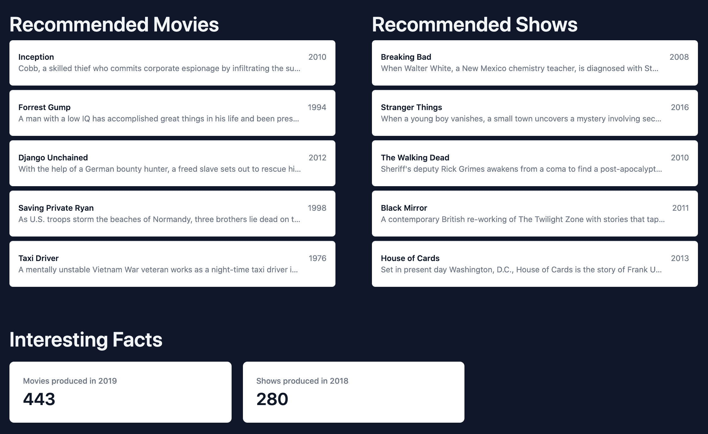

# 用 Python 和 Pyodide 构建单页面应用程序——第 2 部分

> 原文：<https://testdriven.io/blog/build-spa-with-python-part-2/>

在本系列的第一篇教程中，我们使用 Python 和 Pyodide 构建了一个单页面应用程序来加载 Pandas，获取网飞数据集，并对数据执行基本计算。我们还研究了如何使用 Pyodide 通过 Python 直接操作 DOM。在我们构建的应用程序中，我们将经过处理的网飞数据传递给一个 JavaScript 组件，并直接从 Python 代码中呈现出来。

正如在第一部分的结论中提到的，应用程序缺少一些特性，我们需要解决一些问题。在第二部分中，我们将:

1.  用熊猫更好地分析和处理数据
2.  使用 web worker 来加速应用程序

--

**Python 单页面应用系列:**

1.  *[第 1 部分](/blog/build-spa-with-python-part-1)* :学习 Pyodide 的基础知识，创建基础应用
2.  *第二部分*(本教程！):使用 Pandas 分析和操作数据，并使用 web worker 来加速应用程序
3.  *[第三部分](/blog/build-spa-with-python-part-3)* :创建 Python 包，添加附加特性，添加持久化数据层

## 目标

学完本教程后，您应该能够:

1.  使用 Pandas 的更多高级功能来分析和处理数据
2.  使用 web workers 改善用户体验和性能

## 我们正在建造的东西

首先，我们将通过使用一个 [web worker](https://developer.mozilla.org/en-US/docs/Web/API/Web_Workers_API/Using_web_workers) 来改善用户体验和应用程序性能。我们还将深入熊猫图书馆，分析和处理网飞数据，以便根据给定的标题创建推荐，并添加随机的电影和表演事实。



你可以在这里找到该应用[的现场演示。](https://netflix-analysis-spa-part-2.onrender.com)

## 用熊猫分析网飞数据集

在第一部分中，加载网飞 CSV 文件后，我们删除了一些不必要的列，并将结果作为 JSON 返回。如您所见，我们还没有对数据进行太多的分析或处理。我们现在就来看看。

如果你需要第一部分的代码，你可以在这里找到它。

### 创建推荐列表

[净化的数据帧](https://github.com/amirtds/netflix-analysis-spa/blob/part-1/index.html#L105)有以下几列:

*   身份证明（identification）
*   标题
*   发布年份
*   体裁
*   生产 _ 国家
*   imdb_score
*   imdb _ 投票
*   tmdb_score
*   tmdb _ 人气

让我们为使用熊猫的电影和节目创建一个推荐列表。为此，我们将向 DataFrame 添加一个名为`recommendation_score`的新列，其值是`imdb_votes`、`imdb_score`、`tmdb_score`和`tmdb_popularity`的加权和:

```py
`recommended_titles["recommendation_score"] = (
    sanitized_titles["imdb_votes"] * 0.3 +
    sanitized_titles["imdb_score"] * 0.3 +
    sanitized_titles["tmdb_score"] * 0.2 +
    sanitized_titles["tmdb_popularity"] * 0.2
)` 
```

在您选择的代码编辑器中打开*index.html*文件，并在`titles_list = sanitized_titles.head(10).to_json(orient="records")`后添加以下代码

```py
`# 4\. Create recommendation list for Shows and Movies
# 4.1 Copy the sanitized_titles to add new column to it
recommended_titles = sanitized_titles.copy()

# 4.2 Add new column to the sanitized_titles
recommended_titles["recommendation_score"] = (
    sanitized_titles["imdb_votes"] * 0.3 +
    sanitized_titles["imdb_score"] * 0.3 +
    sanitized_titles["tmdb_score"] * 0.2 +
    sanitized_titles["tmdb_popularity"] * 0.2
)
print(recommended_titles.head(5))` 
```

在浏览器中打开文件。然后，在你浏览器的[开发者工具](https://developer.mozilla.org/en-US/docs/Learn/Common_questions/What_are_browser_developer_tools)的控制台中，你应该会看到前五个标题。注意`recommendation_score`栏:

```py
 `id                            title  ... tmdb_score recommendation_score
 tm84618                      Taxi Driver  ...        8.2          238576.2524
tm127384  Monty Python and the Holy Grail  ...        7.8          159270.7632
 tm70993                    Life of Brian  ...        7.8          117733.1610
tm190788                     The Exorcist  ...        7.7          117605.6374
 ts22164     Monty Python's Flying Circus  ...        8.3           21875.3838` 
```

这样，让我们创建两个新的数据帧，一个用于电影，另一个用于节目，然后按`recommendation_score`降序排序:

```py
`recommended_movies = (
    recommended_titles.loc[recommended_titles["type"] == "MOVIE"]
    .sort_values(by="recommendation_score", ascending=False)
    .head(5)
    .to_json(orient="records")
)

recommended_shows = (
    recommended_titles.loc[recommended_titles["type"] == "SHOW"]
    .sort_values(by="recommendation_score", ascending=False)
    .head(5)
    .to_json(orient="records")
)` 
```

这里，我们使用了 [loc](https://pandas.pydata.org/docs/reference/api/pandas.DataFrame.loc.html) 和 [sort_values](https://pandas.pydata.org/docs/reference/api/pandas.DataFrame.sort_values.html) 方法，分别按照`type`列过滤标题和按照`recommendation_score`降序排序。

用这些新列表替换`print(recommended_titles.head(5))`:

```py
`# 4\. Create recommendation list for Shows and Movies
# 4.1 Copy the sanitized_titles to add new column to it
recommended_titles = sanitized_titles.copy()

# 4.2 Add new column to the sanitized_titles
recommended_titles["recommendation_score"] = (
    sanitized_titles["imdb_votes"] * 0.3 +
    sanitized_titles["imdb_score"] * 0.3 +
    sanitized_titles["tmdb_score"] * 0.2 +
    sanitized_titles["tmdb_popularity"] * 0.2
)
recommended_movies = (
    recommended_titles.loc[recommended_titles["type"] == "MOVIE"]
    .sort_values(by="recommendation_score", ascending=False)
    .head(5)
    .to_json(orient="records")
)
recommended_shows = (
    recommended_titles.loc[recommended_titles["type"] == "SHOW"]
    .sort_values(by="recommendation_score", ascending=False)
    .head(5)
    .to_json(orient="records")
)` 
```

要在我们的应用程序中使用这些列表，首先我们需要向`App`的状态添加新的键，以便能够保存和操作数据:

```py
`state  =  { titles:  [], recommendedMovies:  [], recommendedShows:  [], }` 
```

现在，为了更新状态，在`js.window.appComponent.state.titles = titles_list`之后添加以下内容:

```py
`js.window.appComponent.state.recommendedMovies = recommended_movies
js.window.appComponent.state.recommendedShows = recommended_shows` 
```

最后，为了向最终用户显示建议，将以下内容添加到`view()`，就在`<!-- End of Titles --!>`行的下面:

```py
`<!--  Start  of  Recommended  title  --!> <div  class="flex"> <!--  Start  of  Recommended  title  --!> <div  class="px-4 sm:px-6 lg:px-8 my-8 w-1/2"> <p  class="text-4xl font-semibold text-slate-100">Recommended  Movies</p> <ul  role="list"  class="divide-y divide-gray-200"> ${this.state.recommendedMovies.length  >  0  ?  JSON.parse(this.state.recommendedMovies).map(function  (movie)  { return  `
 <li class="relative bg-white py-5 px-4 hover:bg-gray-50 focus-within:ring-2 focus-within:ring-inset focus-within:ring-indigo-600 rounded-md my-2">
 <div class="flex justify-between space-x-3">
 <div class="min-w-0 flex-1">
 <p class="text-sm font-semibold text-gray-900 truncate">${movie.title}</p>
 <p class="text-sm text-gray-500 truncate">${movie.description}</p>
 </div>
 <time datetime="" class="flex-shrink-0 whitespace-nowrap text-sm text-gray-500">${movie.release_year}</time>
 </div>
 </li>
 ` }).join('')  :  `
 <li class="relative bg-white py-5 px-4 hover:bg-gray-50 focus-within:ring-2 focus-within:ring-inset focus-within:ring-indigo-600">
 <div class="flex justify-between space-x-3">
 <div class="min-w-0 flex-1">
 <p class="text-sm font-medium text-gray-900 truncate">Loading...</p>
 </div>
 </div>
 </li>
 </ul>
 ` } </div> <!--  End  of  Recommended  titles  --!> <!--  Start  of  Recommended  Shows  --!> <div  class="px-4 sm:px-6 lg:px-8 my-8 w-1/2"> <p  class="text-4xl font-semibold text-slate-100">Recommended  Shows</p> <ul  role="list"  class="divide-y divide-gray-200"> ${this.state.recommendedShows.length  >  0  ?  JSON.parse(this.state.recommendedShows).map(function  (show)  { return  `
 <li class="relative bg-white py-5 px-4 hover:bg-gray-50 focus-within:ring-2 focus-within:ring-inset focus-within:ring-indigo-600 rounded-md my-2">
 <div class="flex justify-between space-x-3">
 <div class="min-w-0 flex-1">
 <p class="text-sm font-semibold text-gray-900 truncate">${show.title}</p>
 <p class="text-sm text-gray-500 truncate">${show.description}</p>
 </div>
 <time datetime="" class="flex-shrink-0 whitespace-nowrap text-sm text-gray-500">${show.release_year}</time>
 </div>
 </li>
 ` }).join('')  :  `
 <li class="relative bg-white py-5 px-4 hover:bg-gray-50 focus-within:ring-2 focus-within:ring-inset focus-within:ring-indigo-600">
 <div class="flex justify-between space-x-3">
 <div class="min-w-0 flex-1">
 <p class="text-sm font-medium text-gray-900 truncate">Loading...</p>
 </div>
 </div>
 </li>
 </ul>
 `} </div> <!--  Start  of  Recommended  shows  --!> </div> <!--  End  of  Recommended  titles  --!>` 
```

回到您的浏览器，您现在应该可以看到推荐的电影和节目。

### 电影和表演事实

在本节中，我们将从 Python 代码开始查找制作最多电影和节目的年份:

```py
`# 5\. Movie and Show Facts

facts_movies = (
    sanitized_titles.loc[sanitized_titles["type"] == "MOVIE"]
    .groupby("release_year")
    .count()["id"]
    .sort_values(ascending=False)
    .head(1)
    .to_json(orient="table")
)

facts_shows = (
    sanitized_titles.loc[sanitized_titles["type"] == "SHOW"]
    .groupby("release_year")
    .count()["id"]
    .sort_values(ascending=False)
    .head(1)
    .to_json(orient="table")
)` 
```

这里，我们使用了:

1.  [groupby](https://pandas.pydata.org/docs/reference/api/pandas.DataFrame.groupby.html) 方法将标题按`release_year`分组。
2.  [count](https://pandas.pydata.org/docs/reference/api/pandas.DataFrame.count.html) 统计每年的冠军数量。
3.  [sort_values](https://pandas.pydata.org/docs/reference/api/pandas.DataFrame.sort_values.html) 按每年的书目数量降序排列书目。

将上面的代码添加到*index.html*文件中，就在推荐部分的下面。

再次更新`App`的状态:

```py
`state  =  { titles:  [], recommendedMovies:  [], recommendedShows:  [], factsMovies:  [], factsShows:  [], }` 
```

更新状态:

```py
`# 6\. set titles to first 10 titles to the state, update remaining state, and render
js.window.appComponent.state.titles = titles_list
js.window.appComponent.state.recommendedMovies = recommended_movies
js.window.appComponent.state.recommendedShows = recommended_shows
js.window.appComponent.state.factsMovies = facts_movies   # NEW
js.window.appComponent.state.factsShows = facts_shows     # NEW
js.window.appComponent.render()` 
```

通过在`<!-- End of Recommended Shows --!>`之后添加以下内容再次更新`view()`:

```py
`<!--  Start  of  Facts  --!> <div  class="px-4 sm:px-6 lg:px-8 my-8"> <div> <h3  class="text-4xl font-semibold text-slate-100">Interesting  Facts</h3> <dl  class="mt-5 grid grid-cols-1 gap-5 sm:grid-cols-3"> <div  class="px-4 py-5 bg-white shadow rounded-lg overflow-hidden sm:p-6"> ${this.state.factsMovies.length  >  0  ? `
 <dt class="text-sm font-medium text-gray-500 truncate">Movies produced in ${JSON.parse(this.state.factsMovies).data[0].release_year}</dt>
 <dd class="mt-1 text-3xl font-semibold text-gray-900">${JSON.parse(this.state.factsMovies).data[0].id}</dd>
 `  :  `
 Loading...
 `} </div> <div  class="px-4 py-5 bg-white shadow rounded-lg overflow-hidden sm:p-6"> ${this.state.factsShows.length  >  0  ? `
 <dt class="text-sm font-medium text-gray-500 truncate">Shows produced in ${JSON.parse(this.state.factsShows).data[0].release_year}</dt>
 <dd class="mt-1 text-3xl font-semibold text-gray-900">${JSON.parse(this.state.factsShows).data[0].id}</dd>
 `  :  `
 Loading...
 `} </div> </dl> </div> </div> <!--  End  of  Facts  --!>` 
```

在浏览器中重新加载*index.html*页面。您应该看到有趣的事实部分，其中显示了制作最多电影和节目的年份中制作的电影和节目的数量。

## 提高性能

当前实现的一个问题是，我们将昂贵的操作放在浏览器的主线程中。这样做的后果是，在 Pyodide 完成加载和执行代码之前，其他操作将被阻塞。这可能会对应用程序的性能和用户体验产生负面影响。

### 网络工作者

为了解决这个问题，我们可以使用 [web workers](https://developer.mozilla.org/en-US/docs/Web/API/Web_Workers_API/Using_web_workers) 将繁重的操作——在本例中是 Pyodide 和 Python 脚本——卸载到后台的一个独立线程，让浏览器的主线程继续运行其他操作，而不会变慢或被锁定。

网络工作者的主要组成部分是:

1.  Worker() 构造函数:创建一个 web worker 的新实例，我们可以将一个脚本传递给它，它将在一个单独的线程中运行
2.  [onmessage()](https://developer.mozilla.org/en-US/docs/Web/API/Worker/message_event) 事件:当 worker 收到另一个线程的消息时触发
3.  方法:向工作人员发送一条消息
4.  [terminate()](https://developer.mozilla.org/en-US/docs/Web/API/Worker/terminate) 方法:终止工人

让我们看一个简单的例子。

在项目的根目录下创建一个名为 *worker.js* 的新文件:

```py
`self.onmessage  =  function(message)  { console.log(message.data); }` 
```

这个文件包含了工人将要运行的代码。

在 index.html 的*中创建一个新的`script`标记，就在结束`body`标记之前:*

```py
`<script> const  worker  =  new  Worker("./worker.js"); worker.postMessage("Hello from the main thread!"); </script>` 
```

由于安全原因，web worker 文件不能使用`file://`协议从您的本地文件系统导入。我们需要运行一个本地 web 服务器来运行这个项目。在终端中，导航到项目的根目录。然后，运行 Python 的 [http 服务器](https://docs.python.org/3/library/http.server.html):

在服务器运行的情况下，在浏览器中导航至 [http://localhost:8000/](http://localhost:8000/) 。您应该在开发人员控制台中看到`Hello from the main thread!`。

### 将 Pyodide 移至网络工作者

我们在这一部分的目标是:

1.  在 web worker 中加载并初始化 Pyodide 及其包
2.  在 web worker 中运行我们的 Python 脚本，并将结果发送到主线程，以便进行渲染

首先，删除函数定义并调用*index.html*中的`main()`。然后，将 *worker.js* 中的所有代码替换为:

```py
`// load pyodide.js importScripts("https://cdn.jsdelivr.net/pyodide/v0.20.0/full/pyodide.js"); // Initialize pyodide and load Pandas async  function  initialize(){ self.pyodide  =  await  loadPyodide(); await  self.pyodide.loadPackage("pandas"); } let  initialized  =  initialize();` 
```

现在，将以下代码添加到 *worker.js* 文件中，以便在 worker 初始化时运行我们的脚本:

```py
`self.onmessage  =  async  function  (e)  { await  initialized; response  =  await  fetch( "https://raw.githubusercontent.com/amirtds/kaggle-netflix-tv-shows-and-movies/main/titles.csv" ); response.ok  &&  response.status  ===  200 ?  (titles  =  await  response.text()) :  (titles  =  ""); // define global variable called titles to make it accessible by Python self.pyodide.globals.set("titlesCSV",  titles); let  titlesList  =  await  self.pyodide.runPythonAsync(`
 import pandas as pd
 import io

 # 1\. create csv buffer to make it readable by pandas
 csv_buffer = io.StringIO(titlesCSV)
 # 2\. load the csv file
 all_titles = pd.read_csv(csv_buffer)

 # 3\. sanitize the data
 # drop unnecessary columns
 all_titles = all_titles.drop(
 columns=[
 "age_certification",
 "seasons",
 "imdb_id",
 ]
 )
 # drop rows with null values for important columns
 sanitized_titles = all_titles.dropna(
 subset=[
 "id",
 "title",
 "release_year",
 "genres",
 "production_countries",
 "imdb_score",
 "imdb_votes",
 "tmdb_score",
 "tmdb_popularity",
 ]
 )
 # Convert the DataFrame to a JSON object. ('orient="records"' returns a list of objects)
 titles_list = sanitized_titles.head(10).to_json(orient="records")
 titles_list
 `); let  recommendations  =  await  self.pyodide.runPythonAsync(`
 # Create recommendation list for Shows and Movies
 # 1\. Copy the sanitized_titles to add new column to it
 recommended_titles = sanitized_titles.copy()

 # 2\. Add new column to the sanitized_titles
 recommended_titles["recommendation_score"] = (
 sanitized_titles["imdb_votes"] * 0.3 +
 sanitized_titles["imdb_score"] * 0.3 +
 sanitized_titles["tmdb_score"] * 0.2 +
 sanitized_titles["tmdb_popularity"] * 0.2
 )
 # 3\. Create Recommended movies list
 recommended_movies = recommended_titles.loc[recommended_titles["type"] == "MOVIE"].sort_values(
 by="recommendation_score", ascending=False
 ).head(5).to_json(orient="records")
 # 4\. Create Recommended shows list
 recommended_shows = recommended_titles.loc[recommended_titles["type"] == "SHOW"].sort_values(
 by="recommendation_score", ascending=False
 ).head(5).to_json(orient="records")
 recommendations = {
 "movies": recommended_movies,
 "shows": recommended_shows
 }
 recommendations
 `); let  facts  =  await  self.pyodide.runPythonAsync(`
 # Create facts list for Movies and Shows
 facts_movies = sanitized_titles.loc[sanitized_titles["type"] == "MOVIE"].groupby("release_year").count()["id"].sort_values(ascending=False).head(1).to_json(orient="table")
 facts_shows = sanitized_titles.loc[sanitized_titles["type"] == "SHOW"].groupby("release_year").count()["id"].sort_values(ascending=False).head(1).to_json(orient="table")
 facts = {
 "movies": facts_movies,
 "shows": facts_shows
 }
 facts
 `); self.postMessage({ titles:  titlesList, recommendedMovies:  recommendations.toJs({ dict_converter:  Object.fromEntries, }).movies, recommendedShows:  recommendations.toJs({ dict_converter:  Object.fromEntries, }).shows, factsMovies:  facts.toJs({  dict_converter:  Object.fromEntries  }).movies, factsShows:  facts.toJs({  dict_converter:  Object.fromEntries  }).shows, }); };` 
```

这里，在分析了网飞数据之后，我们使用`postMessage`将结果提交给主线程。

接下来，在*index.html*文件的`const worker = new Worker("./worker.js");`之后，添加以下代码:

```py
`worker.postMessage("Running Pyodide"); worker.onmessage  =  function  (event)  { event.data.titles  !==  undefined  ?  appComponent.state.titles  =  event.data.titles  :  []; event.data.recommendedMovies  !==  undefined  ?  appComponent.state.recommendedMovies  =  event.data.recommendedMovies  :  []; event.data.recommendedShows  !==  undefined  ?  appComponent.state.recommendedShows  =  event.data.recommendedShows  :  []; event.data.factsMovies  !==  undefined  ?  appComponent.state.factsMovies  =  event.data.factsMovies  :  []; event.data.factsShows  !==  undefined  ?  appComponent.state.factsShows  =  event.data.factsShows  :  []; appComponent.render() }` 
```

停止并重启 Python HTTP 服务器。刷新浏览器。

您应该会看到与之前相同的结果，但是 Pyodide 的执行和 Python 代码被卸载到一个单独的线程。

## 结论

在本教程中，我们讲述了如何使用 Pandas 对我们的网飞标题 CSV 数据进行数据操作，以创建电影和节目的推荐分数和列表。我们还做了一些数据分析，以找出大多数电影和节目是在哪一年制作的。

我们还通过将 Pyodide 和 Python 代码的执行转移到一个 web worker 来提高我们的应用程序性能。

你可以在这里找到这个教程[的源代码。](https://github.com/amirtds/netflix-analysis-spa/tree/part-2)

在下一个教程中，我们将为我们的应用程序添加更多的 SPA 特性，比如删除和编辑电影和节目。我们还将添加一个持久性数据层，这样远程数据只需被提取一次。

--

**Python 单页面应用系列:**

1.  *[第 1 部分](/blog/build-spa-with-python-part-1)* :学习 Pyodide 的基础知识，创建基础应用
2.  *第二部分*(本教程！):使用 Pandas 分析和操作数据，并使用 web worker 来加速应用程序
3.  *[第三部分](/blog/build-spa-with-python-part-3)* :创建 Python 包，添加附加特性，添加持久化数据层