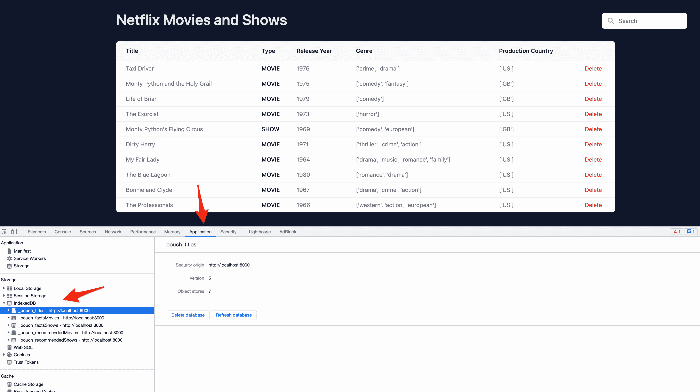

# 用 Python 和 Pyodide 构建单页面应用程序——第 3 部分

> 原文：<https://testdriven.io/blog/build-spa-with-python-part-3/>

在本系列的第二部分中，我们通过将 Pyodide 和 Python 代码执行卸载给 Web worker 来改善用户体验。我们还创建了一个关于熊猫的建议和事实的列表。

在这最后一部分中，我们将看看如何打包 Python 代码以使其更具可读性和可维护性，添加一个搜索栏和一个删除按钮，并使用 PouchDB 添加一个持久数据层。

--

**Python 单页面应用系列:**

1.  *[第 1 部分](/blog/build-spa-with-python-part-1)* :学习 Pyodide 的基础知识，创建基础应用
2.  *[第二部分](/blog/build-spa-with-python-part-2)* :用 Pandas 分析和操作数据，使用 web worker 加速应用程序
3.  *第三部分*(本教程！):创建一个 Python 包，添加附加功能，并添加一个持久数据层

## 目标

学完本教程后，您应该能够:

1.  打包您的 Python 代码，并将其导入 Pyodide
2.  使用 PouchDB 向应用程序添加数据层

## 我们正在建造的东西

首先，我们将把 Python 代码打包到一个单独的 Python 模块中。这将使我们的代码污染更少，可读性更好。我们将修改 web worker 以在 Pyodide 中导入 Python 文件。我们还将添加一个搜索栏和一个删除按钮。我们最后的任务是添加一个持久数据层来存储 PouchDB 数据库中的数据，这将使我们的应用程序在页面重新加载时更快。

你可以在这里找到该应用[的现场演示。](https://netflix-analysis-spa-part-3.onrender.com)

## 提高代码可维护性

至此，我们已经将 Python 代码直接添加到了`runPythonAsync`方法中。正如您可能已经知道的，这对于小代码片段来说是没问题的，但是随着代码的增长，它变得越来越难以维护和扩展。

为了改善现状，我们会-

1.  将 Python 代码分离到一个模块中。
2.  取 *worker.js* 中的 Python 模块代码，将结果写入浏览器的虚拟内存，导入包在 Pyodide 中使用。

### 打包 Python 代码

在项目的根目录下创建一个名为 *main.py* 的新文件:

```py
`import io

import pandas as pd

def analyze_titles(titlesCSV):
    # 1\. create csv buffer to make it readable by pandas
    csv_buffer = io.StringIO(titlesCSV)
    # 2\. load the csv file
    all_titles = pd.read_csv(csv_buffer)

    # 3\. sanitize the data
    # drop unnecessary columns
    all_titles = all_titles.drop(
        columns=[
            "age_certification",
            "seasons",
            "imdb_id",
        ]
    )
    # drop rows with null values for important columns
    sanitized_titles = all_titles.dropna(
        subset=[
            "id",
            "title",
            "release_year",
            "genres",
            "production_countries",
            "imdb_score",
            "imdb_votes",
            "tmdb_score",
            "tmdb_popularity",
        ]
    )
    # Convert the DataFrame to a JSON object. ('orient="records"' returns a list of objects)
    titles_list = sanitized_titles.head(10).to_json(orient="records")

    # 4\. Create recommendation list for Shows and Movies
    # 4.1 Copy the sanitized_titles to add new column to it
    recommended_titles = sanitized_titles.copy()

    # 4.2 Add new column to the sanitized_titles
    recommended_titles["recommendation_score"] = (
        sanitized_titles["imdb_votes"] * 0.3
        + sanitized_titles["imdb_score"] * 0.3
        + sanitized_titles["tmdb_score"] * 0.2
        + sanitized_titles["tmdb_popularity"] * 0.2
    )
    # 4.3 Create Recommended movies list
    recommended_movies = (
        recommended_titles.loc[recommended_titles["type"] == "MOVIE"]
        .sort_values(by="recommendation_score", ascending=False)
        .head(5)
        .to_json(orient="records")
    )
    # 4.4 Create Recommended shows list
    recommended_shows = (
        recommended_titles.loc[recommended_titles["type"] == "SHOW"]
        .sort_values(by="recommendation_score", ascending=False)
        .head(5)
        .to_json(orient="records")
    )
    recommendations = {"movies": recommended_movies, "shows": recommended_shows}

    # 5\. Create facts list for Movies and Shows
    facts_movies = (
        sanitized_titles.loc[sanitized_titles["type"] == "MOVIE"]
        .groupby("release_year")
        .count()["id"]
        .sort_values(ascending=False)
        .head(1)
        .to_json(orient="table")
    )
    facts_shows = (
        sanitized_titles.loc[sanitized_titles["type"] == "SHOW"]
        .groupby("release_year")
        .count()["id"]
        .sort_values(ascending=False)
        .head(1)
        .to_json(orient="table")
    )
    facts = {"movies": facts_movies, "shows": facts_shows}

    return titles_list, recommendations, facts` 
```

这里没什么新东西。请自行复习。

### 将 Python 文件传递给 Pyodide

接下来，我们需要对 *worker.js* 进行一些修改:

```py
`// load pyodide.js importScripts("https://cdn.jsdelivr.net/pyodide/v0.20.0/full/pyodide.js"); // Initialize pyodide and load Pandas async  function  initialize()  { self.pyodide  =  await  loadPyodide(); await  self.pyodide.loadPackage("pandas"); } let  initialized  =  initialize(); self.onmessage  =  async  function  (e)  { await  initialized; response  =  await  fetch( "https://raw.githubusercontent.com/amirtds/kaggle-netflix-tv-shows-and-movies/main/titles.csv" ); response.ok  &&  response.status  ===  200 ?  (titles  =  await  response.text()) :  (titles  =  ""); // fetch main.py, save it in browser memory await  self.pyodide.runPythonAsync(`
 from pyodide.http import pyfetch
 response = await pyfetch("main.py")
 with open("main.py", "wb") as f:
 f.write(await response.bytes())
 `) // Importing fetched py module pkg  =  pyodide.pyimport("main"); // Run the analyze_titles function from main.py and assign the result to a variable let  analyzedTitles  =  pkg.analyze_titles(titles); // convert the Proxy object to Javascript object analyzedTitles  =  analyzedTitles.toJs({ dict_converter:  Object.fromEntries, }); // Set variables to corresponding values from the analyzedTitles object let  titlesList  =  analyzedTitles[0]; let  recommendedMovies  =  analyzedTitles[1].movies let  recommendedShows  =  analyzedTitles[1].shows let  factsMovies  =  analyzedTitles[2].movies let  factsShows  =  analyzedTitles[2].shows self.postMessage({ titles:  titlesList, recommendedMovies:  recommendedMovies, recommendedShows:  recommendedShows, factsMovies:  factsMovies, factsShows:  factsShows, }); };` 
```

记下`runPythonAsync`方法中的 Python 代码。我们使用 [pyfetch](https://pyodide.org/en/stable/usage/api/python-api.html#pyodide.http.pyfetch) 获取本地 *main.py* 文件，并保存在浏览器的虚拟内存中以备后用。

在您的终端中运行 Python 的 [http 服务器](https://docs.python.org/3/library/http.server.html):

然后，在浏览器中导航到 [http://localhost:8000/](http://localhost:8000/) 。

您应该会看到和以前一样的结果，但是 Python 代码的执行现在封装在一个单独的模块中，使得代码更具可读性和可维护性。另外，您现在可以利用代码编辑器中的语法突出显示，并为其编写自动化测试。

## 水疗特色

随着应用程序性能的提高和代码被分离到一个模块中，让我们将注意力转回到特性开发上来。

在这一节中，我们将添加一个删除按钮和搜索功能，以根据名称过滤标题。

### 删除按钮

要添加删除功能，我们需要:

1.  在每个标题旁边的 DOM 中添加一个按钮
2.  设置一个事件侦听器，以便在单击按钮时触发删除
3.  创建一个函数来处理实际的删除

首先在*index.html*的表格标题中添加一个新列:

```py
`<thead class="bg-gray-50">
  <tr>
    <th scope="col" class="whitespace-nowrap py-3.5 pl-4 pr-3 text-left text-sm font-semibold text-gray-900 sm:pl-6">Title</th>
    <th scope="col" class="whitespace-nowrap px-2 py-3.5 text-left text-sm font-semibold text-gray-900">Type</th>
    <th scope="col" class="whitespace-nowrap px-2 py-3.5 text-left text-sm font-semibold text-gray-900">Release Year</th>
    <th scope="col" class="whitespace-nowrap px-2 py-3.5 text-left text-sm font-semibold text-gray-900">Genre</th>
    <th scope="col" class="whitespace-nowrap px-2 py-3.5 text-left text-sm font-semibold text-gray-900">Production Country</th>
     <!-- NEW -->
    <th scope="col" class="whitespace-nowrap px-2 py-3.5 text-left text-sm font-semibold text-gray-900"></th>
  </tr>
</thead>` 
```

接下来，对表体进行以下更改:

```py
`<tbody class="divide-y divide-gray-200 bg-white">
  ${this.state.titles.length > 0 ? JSON.parse(this.state.titles).map(function (title) {
    return (`
      <tr id=${title.id}>
        <td class="whitespace-nowrap py-2 pl-4 pr-3 text-sm text-gray-500 sm:pl-6">${title.title}</td>
        <td class="whitespace-nowrap px-2 py-2 text-sm font-medium text-gray-900">${title.type}</td>
        <td class="whitespace-nowrap px-2 py-2 text-sm text-gray-500">${title.release_year}</td>
        <td class="whitespace-nowrap px-2 py-2 text-sm text-gray-500">${title.genres}</td>
        <td class="whitespace-nowrap px-2 py-2 text-sm text-gray-500">${title.production_countries}</td>
        <!-- NEW -->
        <td class="whitespace-nowrap px-2 py-2 text-sm text-gray-500">
          <button id=${title.id} class="delete text-red-600 hover:text-red-900">Delete</button>
        </td>
      </tr>
    `)
  }).join('') : (`
    <tr>
      <td class="whitespace-nowrap py-2 pl-4 pr-3 text-sm text-gray-500 sm:pl-6">Titles are loading...</td>
      <td class="whitespace-nowrap px-2 py-2 text-sm font-medium text-gray-900">Titles are loading...</td>
      <td class="whitespace-nowrap px-2 py-2 text-sm text-gray-500">Titles are loading...</td>
      <td class="whitespace-nowrap px-2 py-2 text-sm text-gray-500">Titles are loading...</td>
      <td class="whitespace-nowrap px-2 py-2 text-sm text-gray-500">Titles are loading...</td>
       <!-- NEW -->
      <td class="whitespace-nowrap px-2 py-2 text-sm text-gray-500">Titles are loading...</td>
    </tr>
  `)
  }
</tbody>` 
```

在这里，我们添加了删除按钮，并在标题仍在加载时添加了额外的加载消息。

继续向前，向*index.html*中的`App`类添加两个新方法:

```py
`setupEvents()  { let  deleteButtons  =  document.querySelectorAll(".delete") .forEach((button)  =>  { button.addEventListener("click",  ()  =>  this.deleteTitle(button.id)) }) } deleteTitle(id)  { this.state.titles  =  JSON.stringify(JSON.parse(this.state.titles).filter(title  =>  title.id  !=  id)); this.render() }` 
```

注意事项:

1.  `setupEvents`用于将事件侦听器添加到删除按钮，以便当用户单击按钮时，调用`deleteTitle`方法。
2.  `deleteTitle`用于从列表中删除标题。

最后更新`render`调用`setupEvents`:

```py
`render()  { app.innerHTML  =  this.view(); this.setupEvents();  // NEW }` 
```

测试一下。

> 想挑战吗？删除标题后，尝试更新建议和事实。

### 搜索框

接下来，让我们添加一个搜索框来过滤电影，并按标题显示列表。

在*index.html*的开始`body`标签下添加搜索框的 HTML:

```py
`<!-- Start Search box -->
<div class="absolute top-1 right-0 mr-20 z-50">
  <div class="h-full max-w-7xl mt-16 px-4 sm:px-6 lg:px-8 flex flex-row-reverse">
    <label for="search" class="sr-only">Search</label>
    <div class="relative text-gray-400 focus-within:text-gray-600">
      <div class="pointer-events-none absolute inset-y-0 left-0 pl-3 flex items-center">
        <svg class="h-5 w-5" xmlns="http://www.w3.org/2000/svg" viewBox="0 0 20 20" fill="currentColor" aria-hidden="true">
          <path fill-rule="evenodd" d="M8 4a4 4 0 100 8 4 4 0 000-8zM2 8a6 6 0 1110.89 3.476l4.817 4.817a1 1 0 01-1.414 1.414l-4.816-4.816A6 6 0 012 8z" clip-rule="evenodd" />
        </svg>
      </div>
      <input id="search" class="block w-full bg-white py-2 pl-10 pr-3 border border-transparent rounded-md leading-5 text-gray-900 placeholder-gray-500 focus:outline-none focus:ring-2 focus:ring-offset-2 focus:ring-offset-indigo-600 focus:ring-white focus:border-white sm:text-sm" placeholder="Search" type="search" name="search" autofocus>
    </div>
  </div>
</div>
<!-- End Search box -->` 
```

接下来，给`App`的状态添加一个新值:

```py
`state  =  { titles:  [], recommendedMovies:  [], recommendedShows:  [], factsMovies:  [], factsShows:  [], filteredTitles:  [],  // NEW }` 
```

在`view`方法中，我们需要遍历`filteredTitles`状态，而不是遍历`titles`状态。

所以，改变:

```py
`${this.state.titles.length  >  0  ?  JSON.parse(this.state.titles).map(function  (title)  {` 
```

收件人:

```py
`${this.state.filteredTitles.length  >  0  ?  JSON.parse(this.state.filteredTitles).map(function  (title)  {` 
```

更新`deleteTitle`方法以使用`filteredTitles`状态而不是`titles`状态:

```py
`deleteTitle(id)  { this.state.filteredTitles  =  JSON.stringify( JSON.parse(this.state.filteredTitles).filter(function  (title)  { return  title.id  !==  id; }) ); this.render(); }` 
```

添加一个名为`searchTitle`的新方法来处理搜索逻辑:

```py
`searchTitle(name)  { this.state.filteredTitles  =  JSON.stringify( JSON.parse(this.state.titles).filter((title)  => title.title.toLowerCase().includes(name.toLowerCase()) ) ); this.render(); }` 
```

为搜索框的`setupEvents`添加一个新的事件监听器，以便当用户在搜索框中键入时调用`searchTitle`:

```py
`setupEvents()  { let  deleteButtons  =  document.querySelectorAll(".delete").forEach((button)  =>  { button.addEventListener("click",  ()  =>  this.deleteTitle(button.id)); }); let  searchBox  =  document .querySelector("#search") .addEventListener("keyup",  (e)  =>  { this.searchTitle(e.target.value); }); }` 
```

最后，将`filteredTitles`状态设置为`titles`状态，以便在`worker.onmessage`中使用一些初始值:

```py
`worker.onmessage  =  function  (event)  { event.data.titles  !==  undefined  ?  appComponent.state.titles  =  event.data.titles  :  []; event.data.recommendedMovies  !==  undefined  ?  appComponent.state.recommendedMovies  =  event.data.recommendedMovies  :  []; event.data.recommendedShows  !==  undefined  ?  appComponent.state.recommendedShows  =  event.data.recommendedShows  :  []; event.data.factsMovies  !==  undefined  ?  appComponent.state.factsMovies  =  event.data.factsMovies  :  []; event.data.factsShows  !==  undefined  ?  appComponent.state.factsShows  =  event.data.factsShows  :  []; // NEW event.data.titles  !==  undefined  ?  appComponent.state.filteredTitles  =  event.data.titles  :  []; appComponent.render() }` 
```

在浏览器中测试一下！

## 持久数据层

我们将添加的最后一个功能是保存数据的持久日期层，这样我们就不必在每次页面重新加载时远程获取 CSV 文件并分析和处理数据。当标题被删除时，我们也会保存结果。

对于持久性，我们将使用 [PouchDB](https://pouchdb.com/) 。

### PouchDB

PouchDB 一个为浏览器设计的开源数据库，允许你在浏览器中本地保存数据。因为所有数据都存储在 [IndexedDB](https://developer.mozilla.org/en-US/docs/Web/API/IndexedDB_API) 中，所以它为我们的应用程序带来了离线支持。所有现代浏览器都支持 T2。

### 设置

更新*index.html*文件的头，就在顺风 CSS 之后，安装::

```py
`<head>
  <script src="https://cdn.jsdelivr.net/pyodide/v0.20.0/full/pyodide.js"></script>
  <script src="https://cdn.tailwindcss.com"></script>
   <!-- NEW -->
  <script src="https://cdn.jsdelivr.net/npm/[[email protected]](/cdn-cgi/l/email-protection)/dist/pouchdb.min.js"></script>
</head>` 
```

现在，我们可以为标题、推荐和事实创建不同的数据库:

```py
`<head>
  <script src="https://cdn.jsdelivr.net/pyodide/v0.20.0/full/pyodide.js"></script>
  <script src="https://cdn.tailwindcss.com"></script>
  <script src="https://cdn.jsdelivr.net/npm/[[email protected]](/cdn-cgi/l/email-protection)/dist/pouchdb.min.js"></script>
  <!-- NEW -->
  <script> // Setup PouchDB databases var  titlesDB  =  new  PouchDB('titles'); var  recommendedMoviesDB  =  new  PouchDB('recommendedMovies'); var  recommendedShowsDB  =  new  PouchDB('recommendedShows'); var  factsMoviesDB  =  new  PouchDB('factsMovies'); var  factsShowsDB  =  new  PouchDB('factsShows'); var  remoteCouch  =  false; </script>
</head>` 
```

### 持久数据

为了避免在每次页面加载时执行大量的获取和操作数据的操作，我们可以简单地在初始页面加载时运行 *worker.js* 文件，将结果保存到 PouchDB 数据库，然后在后续页面加载时从数据库中获取数据。

在*index.html*中，更新最终的脚本标签，如下所示:

```py
`<script> titlesDB.info().then(function  (info)  { if  (info.doc_count  ==  0)  { const  worker  =  new  Worker("worker.js"); worker.postMessage("Running Pyodide"); worker.onmessage  =  function  (event)  { event.data.titles  !==  undefined ?  (appComponent.state.titles  =  event.data.titles) :  []; event.data.titles  !==  undefined ?  (appComponent.state.filteredTitles  =  event.data.titles) :  []; event.data.recommendedMovies  !==  undefined ?  (appComponent.state.recommendedMovies  =  event.data.recommendedMovies) :  []; event.data.recommendedShows  !==  undefined ?  (appComponent.state.recommendedShows  =  event.data.recommendedShows) :  []; event.data.factsMovies  !==  undefined ?  (appComponent.state.factsMovies  =  event.data.factsMovies) :  []; event.data.factsShows  !==  undefined ?  (appComponent.state.factsShows  =  event.data.factsShows) :  []; appComponent.render(); // Add titles to database appComponent.state.titles.length  >  0 ?  titlesDB .bulkDocs(JSON.parse(appComponent.state.titles)) .then(function  (result)  { // handle result }) .catch(function  (err)  { console.log("titles DB:",  err); }) :  console.log("No titles to add to database"); // Add recommended movies to database appComponent.state.recommendedMovies.length  >  0 ?  recommendedMoviesDB .bulkDocs(JSON.parse(appComponent.state.recommendedMovies)) .then(function  (result)  { // handle result }) .catch(function  (err)  { console.log("recommendedMovies DB:",  err); }) :  console.log("No recommended movies to add to database"); // Add recommended shows to database appComponent.state.recommendedShows.length  >  0 ?  recommendedShowsDB .bulkDocs(JSON.parse(appComponent.state.recommendedShows)) .then(function  (result)  { // handle result }) .catch(function  (err)  { console.log("recommendedShows DB:",  err); }) :  console.log("No recommended shows to add to database"); // Add facts movies to database appComponent.state.factsMovies.length  >  0 ?  factsMoviesDB .bulkDocs(JSON.parse(appComponent.state.factsMovies).data) .then(function  (result)  { // handle result }) .catch(function  (err)  { console.log("factsMovies DB:",  err); }) :  console.log("No facts movies to add to database"); // Add facts shows to database appComponent.state.factsShows.length  >  0 ?  factsShowsDB .bulkDocs(JSON.parse(appComponent.state.factsShows).data) .then(function  (result)  { // handle result }) .catch(function  (err)  { console.log("factsShows DB:",  err); }) :  console.log("No facts shows to add to database"); }; }  else  { console.log("Database already populated"); } }); </script>` 
```

这里，我们检查了标题数据库是否为空:

*   如果是，我们获取并保存数据
*   如果没有，我们只需在控制台上记录一条“数据库已经填充”的消息

继续在浏览器中测试。

在浏览器的[开发者工具](https://developer.mozilla.org/en-US/docs/Learn/Common_questions/What_are_browser_developer_tools)中，在“应用”选项卡的“IndexedDB”下，您应该会看到以下数据库:

1.  `_pouch_titles`
2.  `_pouch_factsMovies`
3.  `_pouch_factsShows`
4.  `_pouch_recommendedMovies`
5.  `_pouch_recommendedShows`



重新加载页面。会发生什么？什么都没有，除了唯一的控制台日志，对吗？我们仍然需要从本地数据库加载数据。为此，用以下内容更新`else`块:

```py
`// use database to populate app state // setting titles state titlesDB.allDocs({ include_docs:  true, descending:  true },  function(err,  doc)  { const  titles  =  doc.rows.map(function(row)  { return  row.doc }) appComponent.state.titles  =  JSON.stringify(titles); appComponent.state.filteredTitles  =  JSON.stringify(titles); appComponent.render() }); // setting recommended movies state recommendedMoviesDB.allDocs({ include_docs:  true, descending:  true },  function(err,  doc)  { const  recommendedMovies  =  doc.rows.map(function(row)  { return  row.doc }) appComponent.state.recommendedMovies  =  JSON.stringify(recommendedMovies); appComponent.render() }); // setting recommended shows state recommendedShowsDB.allDocs({ include_docs:  true, descending:  true },  function(err,  doc)  { const  recommendedShows  =  doc.rows.map(function(row)  { return  row.doc }) appComponent.state.recommendedShows  =  JSON.stringify(recommendedShows); appComponent.render() }); // setting facts movies state factsMoviesDB.allDocs({ include_docs:  true, descending:  true },  function(err,  doc)  { const  factsMovies  =  doc.rows.map(function(row)  { return  row.doc }) appComponent.state.factsMovies  =  JSON.stringify({ data:  factsMovies }); appComponent.render() }); // setting facts shows state factsShowsDB.allDocs({ include_docs:  true, descending:  true },  function(err,  doc)  { const  factsShows  =  doc.rows.map(function(row)  { return  row.doc }) appComponent.state.factsShows  =  JSON.stringify({ data:  factsShows }); appComponent.render() });` 
```

回到你的浏览器，让我们测试新的东西。删除“应用程序”选项卡的“索引数据库”部分中的所有数据库。重新加载页面。数据填充需要几秒钟时间。随后的重新加载应该只是瞬间加载。

### 处理删除

要在用户删除标题时正确删除标题，请更新`deleteTitle`，如下所示:

```py
`deleteTitle(id)  { const  title  =  JSON.parse(this.state.titles).find((title)  =>  title.id  ==  id); titlesDB.remove(title); this.state.titles  =  JSON.stringify( JSON.parse(this.state.titles).filter(function  (title)  { return  title.id  !==  id; }) ); this.state.filteredTitles  =  JSON.stringify( JSON.parse(this.state.filteredTitles).filter(function  (title)  { return  title.id  !==  id; }) ); this.render(); }` 
```

回到您的浏览器，测试删除。请通过重新加载页面来确保它持续存在。

## 结论

就是这样！

在本系列教程中，您学习了如何使用 Python 构建单页面应用程序。用 Pyodide 在浏览器中执行 Python 打开了许多以前不可能的新大门。例如，您:

1.  可以在浏览器中使用像熊猫这样强大的库
2.  使用 Python 可以直接访问所有 Web APIs
3.  甚至可以使用 Python 来操作 DOM

此外，您可以将 Python 与 JavaScript 结合使用，以最大限度地发挥这两种语言(及其丰富的库)的优势！

我们还看到了如何通过使用 web workers 在后台运行繁重的计算，从主线程中分离出来，从而提高应用程序的性能。通过将 Python 脚本移动到一个单独的模块中，我们减少了应用程序的污染，并且更易于维护和扩展。

我们通过使用 PouchDB 向我们的应用程序添加一个数据层来完成这个系列。该功能通过减少页面负载和引入离线功能改善了用户体验。

你可以在这里找到这个教程[的源代码。](https://github.com/amirtds/netflix-analysis-spa/tree/part-3)

我希望你喜欢这个系列。如果您有任何问题或意见，请随时联系我。干杯！

--

**Python 单页面应用系列:**

1.  *[第 1 部分](/blog/build-spa-with-python-part-1)* :学习 Pyodide 的基础知识，创建基础应用
2.  *[第二部分](/blog/build-spa-with-python-part-2)* :用 Pandas 分析和操作数据，使用 web worker 加速应用程序
3.  *第三部分*(本教程！):创建一个 Python 包，添加附加功能，并添加一个持久数据层