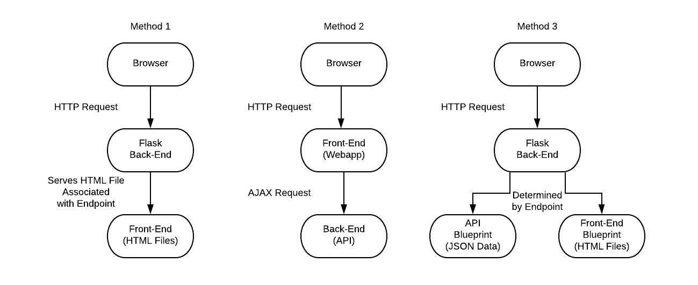
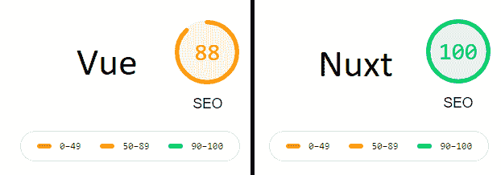

# 组合烧瓶和 Vue

> 原文：<https://testdriven.io/blog/combine-flask-vue/>

*如何将 Vue.js 与 Flask 结合起来？*

因此，您终于有了 Flask，并且对 JavaScript 并不陌生。你甚至开发了一些 web 应用程序，但是你开始意识到一些事情——你有很好的功能，但是你的 UX 有点乏味。你今天在很多热门网站和应用上看到的应用流程和无缝导航在哪里？如何实现这一目标？

随着你对网站和网络应用的投入越来越多，你可能会想给它们添加更多的客户端功能和反应。现代 web 开发通常通过使用前端框架来实现这一点，其中一个流行度迅速上升的框架是 [Vue](https://vuejs.org/) (也称为 Vue.js 或 VueJS)。

根据您的项目需求，有几种不同的方法来使用 Flask 和 Vue 构建 web 应用程序，并且每种方法都涉及不同级别的后端/前端分离。

在本文中，我们将看看结合 Flask 和 Vue 的三种不同方法:

1.  **Jinja 模板**:将 Vue 导入 Jinja 模板
2.  **单页应用**:构建一个单页应用(SPA)来完全分离 Flask 和 Vue
3.  **烧瓶蓝图**:从烧瓶蓝图中提供 Vue，使两者部分分离



我们将分析每种方法的优缺点，查看它们的最佳用例，并详细说明如何设置它们。

## Jinja 模板

无论您使用 React、Vue 还是 Angular，这都是过渡到使用前端框架的最简单方式。

在很多情况下，当你为你的 web 应用构建一个前端时，你是围绕着前端框架本身来设计的。然而，使用这种方法，重点仍然是您的后端 Flask 应用程序。如果需要的话，你仍然可以使用 Jinja 和服务器端模板，以及 Vue 的一些反应功能。

你可以通过[内容交付网络](https://en.wikipedia.org/wiki/Content_delivery_network) (CDN)或者通过你的应用程序自带的方式导入 Vue 库，同时像平常一样设置和路由 Flask。

### 赞成的意见

*   你可以按照自己的方式构建应用，而不是在 Vue 的基础上进行调整。
*   搜索引擎优化(SEO)不需要任何额外的配置。
*   您可以利用基于 cookie 的身份验证来代替基于令牌的身份验证。这往往更容易，因为您不需要处理前端和后端之间的异步通信。

### 骗局

*   你必须导入 Vue 并单独设置每个页面，如果你开始在越来越多的页面上添加 Vue，这可能会很困难。这可能还需要一些变通方法，因为这并不是真正想要使用 Flask 或 Vue 的方式。

### 最适合

*   小型 web 应用程序实际上使用一两个 HTML 页面(与拥有自己的动态路由的 SPA 相反——参见 [SPA](#single-page-application) 方法了解更多信息)。
*   将功能构建到现有的 web 应用程序中。
*   在不完全致力于前端框架的情况下，为应用程序增加一些反应性。
*   不需要通过 AJAX 频繁与后端通信的 Web 应用程序。

### 其他依赖项

这种方法只需要 Vue 库，可以通过 CDN 添加:

```
`<script src="https://cdn.jsdelivr.net/npm/vue/dist/vue.js"></script>` 
```

### 设置

在所有方法中，这种设置是最简单的。

创建一个文件夹来存放您的应用程序的所有代码。在该文件夹中，像平常一样创建一个 *app.py* 文件:

```
`from flask import Flask, render_template # These are all we need for our purposes

app = Flask(__name__)

@app.route("/")
def index():
    return render_template("index.html", **{"greeting": "Hello from Flask!"})` 
```

我们只需要从`flask`导入`Flask`和`render_template`。

当我们看如何在同一个文件中同时使用 Jinja 和 Vue 渲染变量时,`greeting`变量将会再次出现。

接下来，创建一个“模板”文件夹来保存我们的 HTML 文件。在这个文件夹中，创建一个*index.html*文件。在我们的 HTML 文件主体中，创建一个 id 为`vm`的容器 div。

> 值得注意的是，`vm`只是一个常见的命名标准。它代表[视图模型](https://012.vuejs.org/guide/#ViewModel)。你想叫它什么都可以；不需要是`vm`。

在`div`中，创建两个`p`标记作为 Flask 和 Vue 变量的占位符:

1.  其中一个`div`应该包含用大括号括起来的单词“greeting”:`{{ greeting }}`。
2.  另一个应该包含用括号括起来的“问候”:`[[ greeting ]]`。

如果不使用单独的分隔符，在默认设置下，Flask 会用您传递的任何变量替换这两个问候语(例如，“来自 Flask 的 Hello！”).

以下是我们目前掌握的情况:

```
`<body>
<!-- The id 'vm' is just for consistency - it can be anything you want -->
    <div id="vm">
        <p>{{ greeting }}</p>
        <p>[[ greeting ]]</p>
    </div>
</body>` 
```

在 body 标签结束之前，从官方 CDN 导入 Vue，同时导入一个脚本来保存我们的 JavaScript 代码:

```
`<body>
<!-- The id 'vm' is just for consistency - it can be anything you want -->
    <div id="vm">
        <p>{{ greeting }}</p>
        <p>[[ greeting ]]</p>
    </div>
    <script src="https://cdn.jsdelivr.net/npm/vue/dist/vue.js"></script>
    <script src="{{ url_for('static', filename='index.js') }}"></script>
</body>` 
```

向上导航一个目录，创建一个“静态”文件夹。在名为 *index.js* 的文件夹中添加一个新的 JavaScript 文件。

在这个文件中，创建 Vue 上下文，将我们实例的`el`设置为`'#vm'`，将默认分隔符从`'{{', '}}'`更改为`'[[', ']]'`:

```
`const  vm  =  new  Vue({  // Again, vm is our Vue instance's name for consistency. el:  '#vm', delimiters:  ['[[',  ']]'] })` 
```

> 实际上，我们可以使用任何想要的东西作为分隔符。事实上，如果你喜欢，你可以在 Flask 中[改变](https://flask.palletsprojects.com/en/2.0.x/api/#flask.Flask.jinja_options)你的 Jinja 模板的分隔符。

最后，添加一个键/值为`greeting: 'Hello, Vue!'`的数据元素:

```
`const  vm  =  new  Vue({  // Again, vm is our Vue instance's name for consistency. el:  '#vm', delimiters:  ['[[',  ']]'], data:  { greeting:  'Hello, Vue!' } })` 
```

现在我们完成了那个文件。最终的文件夹结构应该如下所示:

```
`├───app.py
├───static
│   └───index.js
└───templates
    └───index.html` 
```

现在你可以回到你的根项目文件夹，用`flask run`运行应用程序。在浏览器中导航到该站点。第一行和第二行应分别替换为 Flask 和 Vue:

```
`Hello from Flask!
Hello, Vue!` 
```

就是这样！您可以随意混合搭配 JSON 端点和 HTML 端点，但是要注意这可能会很快变得很难看。对于更易于管理的替代方法，参见[烧瓶蓝图](#flask-blueprint)方法。

对于每个额外的 HTML 页面，您必须要么导入相同的 JavaScript 文件并考虑可能不适用于它的变量和元素，要么为每个页面创建一个新的 Vue 对象。一个真正的 SPA 将是困难的，但不是不可能的——理论上你可以写一个小的 JavaScript 库，异步地获取 Flask 提供的 HTML 页面/元素。

> 实际上，我之前已经为此创建了自己的 JavaScript 库。这是一个大麻烦，老实说不值得，特别是考虑到 JavaScript 不会运行以这种方式导入的脚本标记，除非您自己构建功能。你也将重新发明轮子。
> 
> 如果你想看看我对这个方法的实现，你可以在 [GitHub](https://github.com/based-jace/load-script-async) 上找到它。该库获取一个给定的 HTML 块，并用它替换页面上指定的 HTML。如果给定的 HTML 不包含`<script>`元素(它使用 regex 进行检查)，它简单地使用`HTMLElement.innerHTML`来替换它。如果它包含`<script>`元素，它递归地添加节点，重新创建出现的任何`<script>`节点，允许您的 JavaScript 运行。
> 
> 将类似这样的东西与 History API 结合使用，可以帮助您构建一个文件非常小的小型 SPA。您甚至可以创建自己的服务器端呈现(SSR)功能，在页面加载时提供完整的 HTML 页面，然后通过 AJAX 请求提供部分页面。您可以在使用 Nuxt 方法的 [SPA 中了解有关 SSR 的更多信息。](#single-page-application-with-nuxt)

## 单页应用程序

如果你想构建一个具有无缝用户体验(UX)的完全动态的 web 应用，你可以将 Flask 后端与 Vue 前端完全分离。如果你不熟悉现代前端框架，这可能需要学习一种全新的 web 应用程序设计思维方式。

把你的应用开发成一个 SPA 可能会降低你的搜索引擎优化。在过去，这种打击会更加引人注目，但 Googlebot 如何索引网站的更新至少在某种程度上否定了这一点。然而，它可能仍然会对不显示 JavaScript 的非谷歌搜索引擎或那些过早抓取页面的搜索引擎产生更大的影响——如果你的网站得到了很好的优化，后一种情况应该不会发生。

> 关于现代水疗中 SEO 的更多信息，这篇文章展示了 Googlebot 如何索引 JavaScript 渲染的网站。此外，[这篇文章](https://www.smashingmagazine.com/2019/05/vue-js-seo-reactive-websites-search-engines-bots/)深入讨论了同样的事情，以及关于其他搜索引擎的 SEO 的其他有用提示。

通过这种方法，您将希望使用 [Vue CLI](https://cli.vuejs.org/) 工具生成一个完全独立的 Vue 应用程序。然后，Flask 将用于提供一个 JSON RESTful API，您的 Vue SPA 将通过 AJAX 与之通信。

### 赞成的意见

*   您的前端和后端将完全相互独立，因此您可以对其中一个进行更改，而不会影响另一个。
    *   这使得它们可以单独部署、开发和维护。
    *   如果您愿意，您甚至可以设置许多其他前端来与您的 Flask API 进行交互。
*   你的前端体验会流畅很多，更无缝。

### 骗局

*   还有更多的东西需要设置和学习。
*   部署困难。
*   如果没有进一步的干预，SEO 可能会受到影响(更多细节请参见带 Nuxt 方法的 [SPA)。](#single-page-application-with-nuxt)
*   身份验证要复杂得多，因为您必须不断地将您的身份验证令牌( [JWT](https://jwt.io/) 或[帕斯托](https://paseto.io/))传递到您的后端。

### 最适合

*   UX 比搜索引擎优化更重要的应用。
*   需要被多个前端访问的后端。

### 其他依赖项

*   节点/国家预防机制
*   CLI 视图
*   弗拉斯克-CORS

> 部署和容器化超出了本文的范围，但是将这种设置进行 Dockerize 以简化部署并不十分困难。

### 设置

因为我们完全将 Vue 从 Flask 中分离出来，所以这个方法需要更多的设置。我们需要在 Flask 中启用跨源资源共享(CORS ),因为我们的前端和后端将在不同的端口上提供服务。为了快速简单地完成这个，我们将使用 [Flask-CORS](https://flask-cors.readthedocs.io/) Python 包。

> 出于安全原因，现代 web 浏览器不允许客户端 JavaScript 访问来自不同于脚本来源的资源(如 JSON 数据),除非它们包含特定的响应头，让浏览器知道这是可以的。

如果你还没有安装弗拉斯克-CORS，用皮普安装。

让我们从我们的 Flask API 开始。

首先，创建一个文件夹来保存项目代码。在里面，创建一个名为“api”的文件夹。在文件夹中创建一个 *app.py* 文件。用你喜欢的文本编辑器打开文件。这次我们需要从`flask`导入`Flask`，从`flask_cors`导入`CORS`。因为我们使用`flask_cors`来实现跨源资源共享，所以用`CORS` : `CORS(app)`包装 app 对象(不设置新变量)。这就是我们所要做的，使 CORS 在我们所有的路线上的任何来源。

> 尽管这对于演示来说很好，但您可能不希望任何应用程序或网站都能访问您的 API。在这种情况下，您可以使用 kwarg‘origins’和 CORS 函数来添加一个可接受的原点列表，即`CORS(app, origins=["origin1", "origin2"])`
> 
> 关于跨源资源共享的更多信息，MDN 上有一些很棒的[文档](https://developer.mozilla.org/en-US/docs/Web/HTTP/CORS)。

最后，在`/greeting`创建一个问候路由，返回一个带有单个键/值的 JSON 对象:

```
`{"greeting": "Hello from Flask!"}` 
```

以下是您应该得到的结果:

```
`from flask import Flask
from flask_cors import CORS

app = Flask(__name__)
CORS(app)

@app.route("/greeting")
def greeting():
    return {"greeting": "Hello from Flask!"}` 
```

这就是我们需要用 Python 做的一切。

接下来，我们将设置我们的 Vue webapp。从终端打开项目的根文件夹。使用 Vue CLI 创建一个名为“web app”(`vue create webapp`)的 Vue 项目。您几乎可以使用任何您喜欢的选项，但是如果您在 TypeScript 中使用基于类的组件，语法看起来会有点不同。

当你的项目创建完成后，打开 *App.vue* 。

因为我们的目标只是看看 Vue 和 Flask 如何相互交互，所以在页面顶部，删除 id 为`app`的`div`中的所有元素。你应该只剩下:

```
`<template>
<div id="app">
</div>
</template>` 
```

在`#app`中，创建两个`p`元素:

1.  第一条的内容应该是`{{ greeting }}`。
2.  秒的内容应该是`{{ flaskGreeting }}`。

你最终的 HTML 应该是这样的:

```
`<template>
<div id="app">
    <p>{{ greeting }}</p>
    <p>{{ flaskGreeting }}</p>
</div>
</template>` 
```

在我们的`script`中，让我们添加逻辑来显示一个纯粹的客户端问候(`greeting`)和一个来自我们的 API 的问候(`flaskGreeting`)。

在 Vue 对象中(以`export default`开始)，创建一个`data`键。让它成为一个返回对象的函数。然后，在这个对象中，再创建两个键:`greeting`和`flaskGreeting`。`greeting`的值应该是`'Hello, Vue!'`，而`flaskGreeting`的值应该是空字符串。

以下是我们目前掌握的情况:

```
`export  default  { name:  'App', components:  { HelloWorld }, data:  function(){ return  { greeting:  'Hello, Vue!', flaskGreeting:  '' } } }` 
```

最后，让我们给我们的 Vue 对象一个`created`生命周期钩子。只有当 DOM 被加载并且我们的 Vue 对象被创建时，这个钩子才会运行。这允许我们使用`fetch` API 并与 Vue 交互，而没有任何冲突:

```
`export  default  { components:  { Logo }, data:  function(){ return  { greeting:  'Hello, Vue!', flaskGreeting:  '' } }, created:  async  function(){ const  gResponse  =  await  fetch("http://localhost:5000/greeting"); const  gObject  =  await  gResponse.json(); this.flaskGreeting  =  gObject.greeting; } }` 
```

查看代码，我们正在对 API 的“问候”端点(`http://localhost:5000/greeting`)进行响应，对该响应的异步`.json()`响应进行`await`，并将 Vue 对象的`flaskGreeting`变量设置为返回的 JSON 对象的`greeting`键的值。

> 对于那些不熟悉 JavaScript 相对较新的 [Fetch](https://developer.mozilla.org/en-US/docs/Web/API/Fetch_API/Using_Fetch) API 的人来说，它基本上是一个原生的 AXIOS 杀手(至少就客户端而言 Node 不支持它，但 [Deno](https://deno.land/) 会支持它)。此外，如果您喜欢一致性，您也可以查看[同构获取](https://www.npmjs.com/package/isomorphic-fetch)包，以便在服务器端使用获取。

我们结束了。因为我们的前端和后端是分开的，所以我们需要分别运行两个应用程序。

让我们在两个独立的终端窗口中打开项目的根文件夹。

首先，进入“api”目录，然后运行`flask run`。如果一切顺利，Flask API 应该正在运行。在第二个终端中，切换到“webapp”目录并运行`npm run serve`。

一旦 Vue 应用启动，您应该能够从`localhost:8080`访问它。如果一切正常，您应该会收到两次问候——一次是 Vue，另一次是 Flask API:

```
`Hello, Vue!
Hello from Flask!` 
```

最终的文件树应该是这样的:

```
`├───app.py
├───api
│   └───app.py
└───webapp
    ... {{ Vue project }}` 
```

## 使用 Nuxt 的单页应用程序

如果 SEO 对您来说像 UX 一样重要，那么您可能希望以某种格式实现服务器端呈现(SSR)。

SSR 使搜索引擎更容易导航和索引你的 Vue 应用，因为你将能够给他们一种不需要 JavaScript 生成的应用形式。它还可以让用户更快地与你的应用程序互动，因为你的大部分初始内容会在发送给他们之前呈现出来。换句话说，用户不必等待所有的内容都被异步加载。

> 具有服务器端渲染的单页应用程序也称为通用应用程序。

尽管可以手动实现 SSR，但在本文中我们将使用 [Nuxt](https://nuxtjs.org/) ;它大大简化了事情。

就像使用 [SPA](#single-page-application) 方法一样，你的前端和后端将完全分离；你将只是使用 Nuxt 而不是 Vue CLI。

### 赞成的意见

*   除了服务器端渲染之外， [SPA](#single-page-application) 方法的所有优点。

### 骗局

*   与 [SPA](#single-page-application) 方法一样难以设置。
*   从概念上讲，还有更多东西需要学习，因为 Nuxt 本质上只是 Vue 之上的另一层。

### 最适合

*   SEO 和 UX 一样重要的应用。

### 其他依赖项

1.  节点/国家预防机制
2.  Nuxt
3.  弗拉斯克-CORS

### 设置

这将非常类似于 [SPA](#single-page-application) 方法。事实上，烧瓶部分是完全相同的。继续这样做，直到创建了 Flask API。

一旦您的 API 完成，在您的终端中，打开您的项目的根文件夹并运行命令`npx create-nuxt-app webapp`。这将让您以交互方式生成一个新的 Nuxt 项目，而无需安装任何全局依赖项。

这里任何选项都可以。

一旦你的项目生成完成，进入你的新“webapp”文件夹。在“pages”文件夹中，在文本编辑器中打开 *index.vue* 。类似地，删除`div`中包含类`container`的所有内容。在`div`内部，创建两个变量相同的`p`标签:`{{ greeting }}`和`{{ flaskGreeting }}`。

它应该是这样的:

```
`<template>
<div class="container">
    <p>{{ greeting }}</p>
    <p>{{ flaskGreeting }}</p>
</div>
</template>` 
```

现在是我们的剧本:

*   添加一个`data`键，返回一个带有变量`greeting`和`flaskGreeting`的对象
*   添加一个`created`生命周期挂钩:
    *   `await` `fetch`从我们的 API 获取 JSON 问候(在端口 5000 上，除非您更改了它)
    *   `await``json()`方法从 API 的响应中异步获取 JSON 数据
    *   将 Vue 实例的`flaskGreeting`设置为响应的 JSON 对象中的`greeting`键

Vue 对象应该类似于:

```
`export  default  { components:  { Logo }, data:  function(){ return  { greeting:  'Hello, Vue!', flaskGreeting:  '' } }, created:  async  function(){ const  gResponse  =  await  fetch("http://localhost:5000/greeting"); const  gObject  =  await  gResponse.json(); this.flaskGreeting  =  gObject.greeting; } }` 
```

运行 Nuxt/Vue 应用程序和 Flask API 看起来也非常类似于 [SPA](#single-page-application) 方法。

打开两个终端窗口。在第一个内，切换到“api”并运行`flask run`命令。在第二秒钟内，切换到“webapp”并运行`npm run dev`,为您的 Nuxt 项目启动一个开发服务器。

Nuxt 应用程序启动后，您应该能够从`localhost:3000`访问它:

```
`Hello, Vue!
Hello from Flask!` 
```

> 在生产环境中，您可以运行`npm run build`然后运行`npm run start`来启动生产服务器。

我们最后的圣诞树:

```
`├───app.py
├───api
│   └───app.py
└───webapp
    ... {{ Nuxt project }}` 
```

### 奖金:Vue 与 Nuxt 搜索引擎优化比较

我在本文前面提到了 SEO 的好处，但是为了向您展示我的意思，我按原样运行了两个 web 应用程序，并获得了两个应用程序的 SEO 分数。

两个应用程序都没有改变，下面是我们得到的结果:



同样，你可以做一些事情来提高你的纯 Vue SEO 分数。Chrome 的开发工具中的 Lighthouse 提到了添加一个元描述，但在没有额外干预的情况下，Nuxt 给了我们一个完美的 SEO 分数。

此外，您实际上可以看到 Nuxt 的 SSR 和 vanilla Vue 的完全异步方法之间的区别。如果你同时运行这两个应用程序，导航到它们各自的原点，`localhost:8080`和`localhost:3000`，Vue 应用程序的初始问候会在你得到响应后几毫秒发生，而 Nuxt 的初始问候已经呈现。

有关 Nuxt 和 Vue 之间的差异的更多信息，您可以查看以下文章:

1.  [Nuxt.js over Vue.js:什么时候应该使用它，为什么](https://www.bornfight.com/blog/nuxt-js-over-vue-js-when-should-you-use-it-and-why/)
2.  [nuxt . js 如何解决 Vue.js 中的 SEO 问题](https://blog.logrocket.com/how-nuxt-js-solves-the-seo-problems-in-vue-js/)。

## 烧瓶蓝图

也许你已经开发了一个小 Flask 应用程序，你想开发一个 Vue 应用程序，更多的是作为一种手段，而不是作为主要事件。

示例:

1.  向你的雇主或客户演示功能的原型(你可以随时替换它，或者以后把它交给前端开发人员)。
2.  您只是不想处理部署完全分离的前端和后端时可能导致的潜在挫折。

在这种情况下，你可以通过保留你的 Flask 应用程序，但在它自己的 Flask 蓝图内构建 Vue 前端来折中。

这看起来很像 [Jinja 模板](#jinja-template)方法，但是代码会更有条理。

### 赞成的意见

*   如果没有必要，就不需要构建复杂的前端。
*   类似于 [Jinja 模板](#jinja-template)方法，增加了更好的代码组织的好处。
*   以后，您可以随时根据需要扩展前端和后端。

### 骗局

*   可能需要变通办法来实现完整的 SPA。
*   从一个单独的前端(比如一个移动应用)访问 API 可能会稍微麻烦一些，因为前端和后端并不是完全分开的。

### 最适合

*   功能比 UI 更重要的项目。
*   你正在一个已经存在的 Flask 应用上构建一个前端。
*   仅由几个 HTML 页面组成的小型 web 应用程序。

### 其他依赖项

类似于 [Jinja 模板](#jinja-template)方法，我们将使用 CDN 来拉入 Vue 库:

```
`<script src="https://cdn.jsdelivr.net/npm/vue/dist/vue.js"></script>` 
```

### 设置

像其他方法一样，创建一个新文件夹来存放您的代码。在其中，创建两个文件夹:“api”和“client”。直观地说，这些将分别包含我们的 API 和客户端(Vue)的蓝图。

让我们深入“api”文件夹。

创建一个名为 *api.py* 的文件。这将包含与我们的 API 相关的所有代码。此外，因为我们将把这个文件/文件夹作为一个模块来访问，所以创建一个 *__init__。py* 文件:

```
`from flask import Blueprint

api_bp = Blueprint('api_bp', __name__) # "API Blueprint"

@api_bp.route("/greeting") # Blueprints don't use the Flask "app" context. They use their own blueprint's
def greeting():
    return {'greeting': 'Hello from Flask!'}` 
```

`Blueprint`的第一个参数是 Flask 的路由系统。第二个，`__name__`，相当于 Flask app 的第一个参数(`Flask(__name__)`)。

这就是我们的 API 蓝图。

好吧。让我们深入到之前创建的“client”文件夹。这个比我们的 API 蓝图稍微复杂一点，但是不会比普通的 Flask 应用程序复杂。

同样，像一个普通的 Flask 应用程序一样，在这个文件夹中，创建一个“静态”文件夹和一个“模板”文件夹。创建一个名为 *client.py* 的文件，并在文本编辑器中打开它。

这一次，我们将向我们的`Blueprint`传递更多的参数，这样它就知道在哪里可以找到正确的静态文件和模板:

```
`client_bp = Blueprint('client_bp', __name__, # 'Client Blueprint'
    template_folder='templates', # Required for our purposes
    static_folder='static', # Again, this is required
    static_url_path='/client/static' # Flask will be confused if you don't do this
)` 
```

添加路线并提供*index.html*模板:

```
`from flask import Blueprint, render_template

client_bp = Blueprint("client_bp", __name__, # 'Client Blueprint'
    template_folder="templates", # Required for our purposes
    static_folder="static", # Again, this is required
    static_url_path="/client/static" # Flask will be confused if you don't do this
)

@client_bp.route("/")
def index():
    return render_template("index.html")` 
```

非常好。我们的客户端蓝图现在已经完成。退出文件，转到蓝图的“模板”文件夹。创建一个*index.html*文件:

```
`<body>
<!-- The id 'vm' is just for consistency - it can be anything you want -->
    <div id="vm" class="container">
        <p>[[ greeting ]]</p>
        <p>[[ flaskGreeting ]]</p>
    </div>
    <script src="https://cdn.jsdelivr.net/npm/[[email protected]](/cdn-cgi/l/email-protection)"></script>
    <script src="{{ url_for('client_bp.static', filename='index.js') }}"></script>
</body>` 
```

> 你有没有注意到我们用括号代替了大括号？这是因为我们需要更改分隔符，以防止 Flask 先捕获它们。

一旦准备好，`greeting`将由 Vue 呈现，而`flaskGreeting`将从我们异步请求的 Flask 响应中获取。

完成了。向“静态”文件夹添加一个名为 *index.js* 的新文件。创建一个名为`apiEndpoint`的变量，并将其设置为`api_v1`。如果我们以后决定改变我们的终点，这只会使一切变得更加枯燥:

```
`const  apiEndpoint  =  '/api_v1/';` 
```

> 我们还没有为我们的端点创建逻辑。那将在最后一步到来。

接下来，首先让 Vue 上下文看起来与 [Jinja 模板](#jinja-template)方法中的上下文相同:

```
`const  apiEndpoint  =  '/api_v1/'; const  vm  =  new  Vue({  // Again, vm is our Vue instance's name for consistency. el:  '#vm', delimiters:  ['[[',  ']]'], data:  { greeting:  'Hello, Vue!' } })` 
```

同样，我们创建了 Vue 上下文，将实例的`el`设置为`'#vm'`，将默认分隔符从`'{{', '}}'`更改为`'[[', ']]'`，并添加了一个键/值为`greeting`的数据元素:`'Hello, Vue!'`。

因为我们还将从 API 中提取一个问候语，所以创建一个名为`flaskGreeting`的数据占位符，其值为一个空字符串:

```
`const  apiEndpoint  =  '/api_v1/'; const  vm  =  new  Vue({ el:  '#vm', delimiters:  ['[[',  ']]'], data:  { greeting:  'Hello, Vue!', flaskGreeting:  '' } })` 
```

让我们给我们的 Vue 对象一个异步的`created`生命周期钩子:

```
`const  apiEndpoint  =  '/api_v1/'; const  vm  =  new  Vue({ el:  '#vm', delimiters:  ['[[',  ']]'], data:  { greeting:  'Hello, Vue!', flaskGreeting:  '' }, created:  async  function(){ const  gResponse  =  await  fetch(apiEndpoint  +  'greeting'); const  gObject  =  await  gResponse.json(); this.flaskGreeting  =  gObject.greeting; } })` 
```

看看代码，我们从 API 的“问候”端点(`/api_v1/greeting`)得到一个响应，`await`得到该响应的异步`.json()`响应，并将 Vue 对象的`flaskGreeting`变量设置为返回的 JSON 对象的`greeting`键的值。它基本上是方法 1 和方法 2 的 Vue 对象之间的混搭。

非常好。只剩下一件事要做:让我们通过添加一个 *app.py* 到项目根来把所有的东西放在一起。在文件中，将`flask`与蓝图一起导入:

```
`from flask import Flask
from api.api import api_bp
from client.client import client_bp` 
```

像平常一样创建一个 Flask 应用程序，并使用`app.register_blueprint()`注册蓝图:

```
`from flask import Flask
from api.api import api_bp
from client.client import client_bp

app = Flask(__name__)
app.register_blueprint(api_bp, url_prefix='/api_v1')
app.register_blueprint(client_bp)` 
```

最终文件树:

```
`├───app.py
├───api
│   └───__init__.py
│   └───api.py
└───client
    ├───__init__.py
    ├───static
    │   └───index.js
    └───templates
        └───index.html` 
```

就是这样！如果你用`flask run`运行你的新应用，你应该会收到两次问候——一次是 Vue 本身，另一次是 Flask API 的响应。

## 摘要

使用 Vue 和 Flask 构建 web 应用程序有许多不同的方式。这完全取决于你手头的情况。

要问的一些问题:

1.  SEO 有多重要？
2.  你的开发团队是什么样的？如果您没有开发运维团队，您是否希望承担额外的复杂性，分别部署前端和后端？
3.  你只是快速成型吗？

希望这篇文章能引导你走向正确的方向，让你知道如何组合 Vue 和 Flask 应用程序。

你可以从 GitHub 上的[combining-flask-with-vue](https://github.com/based-jace/combining-flask-with-vue)repo 中获取最终代码。