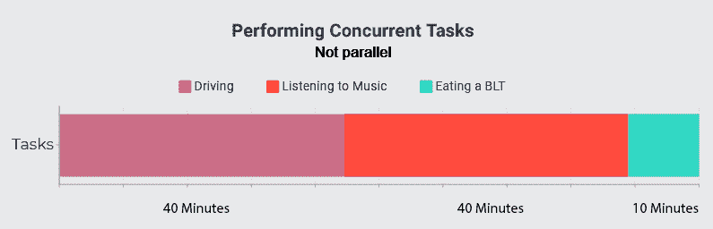

# 用并发、并行和异步加速 Python

> 原文：<https://testdriven.io/blog/concurrency-parallelism-asyncio/>

*什么是并发和并行，它们如何应用于 Python？*

您的应用程序运行缓慢有许多原因。有时这是由于糟糕的算法设计或者数据结构的错误选择。然而，有时这是由于我们无法控制的力量，例如硬件限制或网络的怪癖。这就是并发性和并行性适合的地方。它们允许你的程序一次做多件事，要么同时做，要么尽可能不浪费时间等待繁忙的任务。

无论您是处理外部 web 资源、读取和写入多个文件，还是需要使用不同参数多次使用计算密集型函数，本文都将帮助您最大限度地提高代码的效率和速度。

首先，我们将使用标准库(如线程、多处理和 asyncio)深入研究什么是并发和并行，以及它们如何适应 Python 领域。本文的最后一部分将比较 Python 对`async` / `await`的实现和其他语言是如何实现的。

你可以在 GitHub 上的[concurrency-parallelism-and-asyncio](https://github.com/based-jace/concurrency-parallelism-and-asyncio)repo 中找到本文的所有代码示例。

> 要完成本文中的示例，您应该已经知道如何处理 HTTP 请求。

## 目标

在本文结束时，您应该能够回答以下问题:

1.  什么是并发？
2.  什么是线程？
3.  当某个东西是非阻塞的时候是什么意思？
4.  什么是事件循环？
5.  什么是回调？
6.  为什么 asyncio 方法总是比线程方法快一点？
7.  什么时候应该使用线程，什么时候应该使用 asyncio？
8.  什么是并行？
9.  并发和并行有什么区别？
10.  有没有可能将 asyncio 和多处理结合起来？
11.  什么时候应该使用多处理而不是异步或线程？
12.  多处理、异步和并发之间有什么区别？
13.  如何用 pytest 测试 asyncio？

## 并发

*什么是并发？*

并发的一个有效定义是“能够同时执行多项任务”。不过这有点误导，因为任务可能会也可能不会在完全相同的时间执行。相反，一个进程可能会开始，然后一旦它在等待一个特定的指令完成，就切换到一个新的任务，只有当它不再等待时才返回。一旦一个任务完成，它再次切换到一个未完成的任务，直到它们都被执行。任务异步开始，异步执行，然后异步完成。



如果这让你感到困惑，让我们来打个比方:假设你想做一个 [BLT](https://en.wikipedia.org/wiki/BLT) 。首先，你要用中低火将培根放入锅中。**在熏肉烹饪的时候，你可以拿出你的西红柿和生菜，开始准备(清洗和切)它们。与此同时，你继续检查，偶尔翻转你的培根。**

此时，您已经开始了一项任务，然后同时开始并完成了另外两项任务，而此时您仍在等待第一项任务。

最终你把面包放进了烤面包机。在烤面包的时候，你继续检查你的熏肉。当一块块完成后，你把它们拿出来放在盘子里。一旦你的面包烤好了，你就把你选择的三明治涂在上面，然后你可以开始在你的西红柿，生菜上分层，然后，一旦它烤好了，你的培根。只有当所有的东西都做好，准备好，分层后，你才能把最后一片吐司放到你的三明治上，切片(可选)，然后吃。

因为它需要你同时执行多项任务，所以制作 BLT 本质上是一个并发的过程，即使你没有立刻将全部注意力放在每一项任务上。对于所有意图和目的，在下一节中，我们将把这种形式的并发称为“并发”我们将在本文后面区分它。

由于这个原因，并发性对于 I/O 密集型进程非常有用——包括等待 web 请求或文件读/写操作的任务。

在 Python 中，有几种不同的方法来实现并发性。我们首先要看的是线程库。

> 对于本节中的示例，我们将构建一个小的 Python 程序，该程序从 [Binary Jazz 的 Genrenator API](https://binaryjazz.us/genrenator-api/) 中随机抓取一个音乐流派五次，将该流派打印到屏幕上，并将每个流派放入自己的文件中。

要在 Python 中使用线程，您需要的唯一导入是`threading`，但是对于本例，我还导入了`urllib`来处理 HTTP 请求、`time`来确定函数完成需要多长时间，以及`json`来轻松转换从 Genrenator API 返回的 json 数据。

> 你可以在这里找到这个例子[的代码。](https://github.com/based-jace/concurrency-parallelism-and-asyncio/blob/master/code_examples/concurrency/threads.py)

让我们从一个简单的函数开始:

```py
`def write_genre(file_name):
    """
 Uses genrenator from binaryjazz.us to write a random genre to the
 name of the given file
 """

    req = Request("https://binaryjazz.us/wp-json/genrenator/v1/genre/", headers={"User-Agent": "Mozilla/5.0"})
    genre = json.load(urlopen(req))

    with open(file_name, "w") as new_file:
        print(f"Writing '{genre}' to '{file_name}'...")
        new_file.write(genre)` 
```

检查上面的代码，我们向 Genrenator API 发出请求，加载它的 JSON 响应(一种随机的音乐类型)，打印它，然后写入一个文件。

> 如果没有“用户代理”标题，您将收到一个 304。

我们真正感兴趣的是下一部分，实际的线程处理发生在这里:

```py
`threads = []

for i in range(5):
    thread = threading.Thread(
        target=write_genre,
        args=[f"./threading/new_file{i}.txt"]
    )
    thread.start()
    threads.append(thread)

for thread in threads:
    thread.join()` 
```

我们首先从一个列表开始。然后我们继续迭代五次，每次创建一个新线程。接下来，我们启动每个线程，将它添加到我们的“threads”列表中，然后最后一次迭代我们的列表以加入每个线程。

说明:用 Python 创建线程很容易。

要创建新线程，请使用`threading.Thread()`。您可以将 kwarg (keyword argument) `target`与您希望在该线程上运行的任何函数的值一起传递给它。但是只传入函数的名称，而不是它的值(就我们的目的而言，意味着`write_genre`而不是`write_genre()`)。要传递参数，请传入“kwargs”(它接受您的 kwargs 的 dict)或“args”(它接受包含您的 args 的 iterable 在本例中是一个列表)。

然而，创建线程不同于启动线程。要启动线程，请使用`{the name of your thread}.start()`。启动一个线程意味着“开始它的执行”

最后，当我们用`thread.join()`连接线程时，我们所做的就是确保线程在继续我们的代码之前已经完成。

## 线

但是到底什么是线呢？

线程是一种允许计算机将单个进程/程序分解成许多并行执行的轻量级程序的方式。有点令人困惑的是，Python 的标准线程实现将线程限制为一次只能执行一个，这是由于一种叫做[全局解释器锁](https://en.wikipedia.org/wiki/Global_interpreter_lock) (GIL)的东西。GIL 是必要的，因为 CPython(Python 的默认实现)的内存管理不是线程安全的。由于这个限制，Python 中的线程是并发的，而不是并行的。为了解决这个问题，Python 有一个独立的`multiprocessing`模块，它不受 GIL 的限制，可以旋转独立的进程，实现代码的并行执行。使用`multiprocessing`模块几乎等同于使用`threading`模块。

> 关于 Python 的 GIL 和线程安全的更多信息可以在[真实 Python](https://realpython.com/python-gil/) 和 Python 的[官方文档](https://docs.python.org/2.0/api/threads.html)中找到。

我们将很快更深入地了解 Python 中的多处理。

在我们展示非线程代码的潜在速度提升之前，我冒昧地创建了同一程序的非线程版本(同样，可在 [GitHub](https://github.com/based-jace/concurrency-parallelism-and-asyncio/blob/master/code_examples/concurrency/sync.py) 上获得)。它不是创建一个新线程并加入每一个线程，而是在一个迭代五次的 for 循环中调用`write_genre`。

为了比较速度基准，我还导入了`time`库来计时我们脚本的执行:

```py
`Starting...
Writing "binary indoremix" to "./sync/new_file0.txt"...
Writing "slavic aggro polka fusion" to "./sync/new_file1.txt"...
Writing "israeli new wave" to "./sync/new_file2.txt"...
Writing "byzantine motown" to "./sync/new_file3.txt"...
Writing "dutch hate industrialtune" to "./sync/new_file4.txt"...
Time to complete synchronous read/writes: 1.42 seconds` 
```

在运行脚本时，我们看到它花了我的电脑大约 1.49 秒(以及经典音乐流派，如“荷兰仇恨工业调”)。不算太坏。

现在让我们运行使用线程的版本:

```py
`Starting...
Writing "college k-dubstep" to "./threading/new_file2.txt"...
Writing "swiss dirt" to "./threading/new_file0.txt"...
Writing "bop idol alternative" to "./threading/new_file4.txt"...
Writing "ethertrio" to "./threading/new_file1.txt"...
Writing "beach aust shanty français" to "./threading/new_file3.txt"...
Time to complete threading read/writes: 0.77 seconds` 
```

第一件事可能会引起你的注意，那就是函数没有按顺序完成:2 - 0 - 4 - 1 - 3

这是因为线程的异步特性:当一个函数等待时，另一个函数开始，依此类推。因为我们能够在等待其他人完成任务的同时继续执行任务(由于网络或文件 I/O 操作)，所以您可能已经注意到我们将时间大约减少了一半:0.77 秒。尽管这在现在看起来并不多，但很容易想象构建一个需要向文件写入更多数据或与更复杂的 web 服务交互的 web 应用程序的真实情况。

*那么，如果线程如此伟大，我们为什么不在这里结束文章呢？*

因为有更好的方法来同时执行任务。

## Asyncio

让我们看一个使用 asyncio 的例子。对于这种方法，我们将使用`pip`安装 [aiohttp](https://docs.aiohttp.org/) 。这将允许我们使用即将介绍的`async` / `await`语法发出非阻塞请求并接收响应。它还有一个额外的好处，即转换 JSON 响应的函数不需要导入`json`库。我们还将安装并导入 [aiofiles](https://github.com/Tinche/aiofiles) ，它允许非阻塞文件操作。除了`aiohttp`和`aiofiles`，导入`asyncio`，自带 Python 标准库。

*“非阻塞”是指一个程序在等待时允许其他线程继续运行。这与“阻塞”代码相反，后者完全停止程序的执行。正常的同步 I/O 操作受到这种限制。*

> 你可以在这里找到这个例子[的代码。](https://github.com/based-jace/concurrency-parallelism-and-asyncio/blob/master/code_examples/concurrency/async.py)

导入就绪后，让我们看看 asyncio 示例中的异步版本的`write_genre`函数:

```py
`async def write_genre(file_name):
    """
 Uses genrenator from binaryjazz.us to write a random genre to the
 name of the given file
 """

    async with aiohttp.ClientSession() as session:
        async with session.get("https://binaryjazz.us/wp-json/genrenator/v1/genre/") as response:
            genre = await response.json()

    async with aiofiles.open(file_name, "w") as new_file:
        print(f'Writing "{genre}" to "{file_name}"...')
        await new_file.write(genre)` 
```

对于那些不熟悉其他现代语言中常见的`async` / `await`语法的人来说，`async`声明函数、`for`循环或`with`语句**必须**异步使用。要调用一个异步函数，你必须从另一个异步函数中使用`await`关键字，或者直接从事件循环中调用`create_task()`，这个事件循环可以从`asyncio.get_event_loop()`中获取——例如`loop = asyncio.get_event_loop()`。

此外:

1.  `async with`允许等待异步响应和文件操作。
2.  `async for`(此处未使用)迭代一个[异步流](https://stackoverflow.com/questions/56161595/how-to-use-async-for-in-python)。

### 事件循环

事件循环是异步编程固有的构造，允许异步执行任务。当你阅读这篇文章时，我可以有把握地假设你可能不太熟悉这个概念。然而，即使您从未编写过异步应用程序，您也会在每次使用计算机时体验到事件循环。无论您的计算机是在监听键盘输入，还是在玩在线多人游戏，或者在后台复制文件时浏览 Reddit，事件循环都是保持一切顺利高效工作的驱动力。从本质上来说，事件循环是一个等待触发器的过程，一旦这些触发器被满足，就执行特定的(编程的)动作。它们通常返回某种“promise”(JavaScript 语法)或“future”(Python 语法)来表示任务已经被添加。一旦任务完成，promise 或 future 返回一个从被调用的函数传回的值(假设函数确实返回值)。

执行一个函数来响应另一个函数的想法被称为“回调”

> 对于回调和事件的另一个例子，[这里有一个关于堆栈溢出的很好的答案](https://stackoverflow.com/questions/9596276/how-to-explain-callbacks-in-plain-english-how-are-they-different-from-calling-o/9652434#9652434)。

下面是我们函数的一个演练:

我们使用`async with`来异步打开我们的客户端会话。`aiohttp.ClientSession()`类允许我们发出 HTTP 请求，并在不阻止代码执行的情况下保持与源的连接。然后，我们向 Genrenator API 发出一个异步请求，并等待 JSON 响应(一个随机的音乐流派)。在下一行中，我们再次使用`async with`和`aiofiles`库来异步打开一个新文件来写入我们的新流派。我们打印流派，然后写入文件。

与常规的 Python 脚本不同，用 asyncio 编程使用某种“main”函数来强制执行*。

> *除非你在@asyncio.coroutine decorator 中使用不推荐使用的“yield”语法，[将在 Python 3.10](https://docs.python.org/3/library/asyncio-task.html) 中被移除。

这是因为为了使用“await”语法，您需要使用“async”关键字，而“await”语法是实际运行其他异步函数的唯一方法。

这是我们的主要功能:

```py
`async def main():
    tasks = []

    for i in range(5):
        tasks.append(write_genre(f"./async/new_file{i}.txt"))

    await asyncio.gather(*tasks)` 
```

如你所见，我们已经用“async”声明了它然后我们创建一个名为“tasks”的空列表来存放我们的异步任务(调用 Genrenator 和我们的文件 I/O)。我们将任务添加到列表中，但是它们还没有真正运行。在我们用`await asyncio.gather(*tasks)`安排好之前，这些电话实际上不会打出去。这将运行我们列表中的所有任务，并在继续程序的其余部分之前等待它们完成。最后，我们使用`asyncio.run(main())`来运行我们的“主”函数。`.run()`函数是我们程序的入口点，[，它应该*通常每个进程*只调用一次](https://docs.python.org/3/library/asyncio-task.html#running-an-asyncio-program) *。*

> 对于那些不熟悉的人来说，任务前面的`*`叫做“参数解包”。顾名思义，它将我们的列表分解成函数的一系列参数。在这种情况下，我们的函数是`asyncio.gather()`。

这就是我们需要做的。现在，运行我们的程序(其源代码包括同步和线程示例的相同计时功能)...

```py
`Writing "albuquerque fiddlehaus" to "./async/new_file1.txt"...
Writing "euroreggaebop" to "./async/new_file2.txt"...
Writing "shoedisco" to "./async/new_file0.txt"...
Writing "russiagaze" to "./async/new_file4.txt"...
Writing "alternative xylophone" to "./async/new_file3.txt"...
Time to complete asyncio read/writes: 0.71 seconds` 
```

...我们看到它甚至更快了。而且，一般来说，asyncio 方法总是比线程方法快一点。这是因为当我们使用“await”语法时，我们实际上是告诉我们的程序“稍等，我马上回来”，但是我们的程序跟踪我们完成我们正在做的事情需要多长时间。一旦我们完成了，我们的程序就会知道，并尽快恢复。Python 中的线程允许异步，但我们的程序理论上可能会跳过可能还没有准备好的不同线程，如果有线程准备好继续运行，就会浪费时间。

那么什么时候应该使用线程，什么时候应该使用 asyncio 呢？

当你写新代码时，使用 asyncio。如果您需要与较旧的库或不支持 asyncio 的库进行交互，那么使用线程可能会更好。

### 使用 pytest 测试 asyncio

事实证明，用 pytest 测试异步函数和测试同步函数一样简单。只需用`pip`安装 [pytest-asyncio](https://pypi.org/project/pytest-asyncio/) 包，用`async`关键字标记您的测试，并应用一个装饰器让`pytest`知道它是异步的:`@pytest.mark.asyncio`。让我们看一个例子。

首先，让我们在一个名为 *hello_asyncio.py* 的文件中编写一个任意的异步函数:

```py
`import asyncio

async def say_hello(name: str):
    """ Sleeps for two seconds, then prints 'Hello, {{ name }}!' """
    try:
        if type(name) != str:
            raise TypeError("'name' must be a string")
        if name == "":
            raise ValueError("'name' cannot be empty")
    except (TypeError, ValueError):
        raise

    print("Sleeping...")
    await asyncio.sleep(2)
    print(f"Hello, {name}!")` 
```

该函数采用单个字符串参数:`name`。在确保`name`是长度大于 1 的字符串后，我们的函数异步休眠两秒钟，然后将`"Hello, {name}!"`打印到控制台。

> `asyncio.sleep()`和`time.sleep()`的区别在于`asyncio.sleep()`是非阻塞的。

现在我们用 pytest 来测试一下。在与 *hello_asyncio.py 相同的目录中，*创建一个名为 *test_hello_asyncio.py，*的文件，然后在您喜欢的文本编辑器中打开它。

让我们从我们的进口开始:

```py
`import pytest # Note: pytest-asyncio does not require a separate import

from hello_asyncio import say_hello` 
```

然后，我们将创建一个具有适当输入的测试:

```py
`@pytest.mark.parametrize("name", [
    "Robert Paulson",
    "Seven of Nine",
    "x Æ a-12"
])
@pytest.mark.asyncio
async def test_say_hello(name):
    await say_hello(name)` 
```

需要注意的事项:

*   装饰器让 pytest 异步工作
*   我们的测试使用了`async`语法
*   我们正在调用我们的异步函数，就像我们在测试之外运行它一样

现在让我们用详细的`-v`选项运行我们的测试:

```py
`pytest -v
...
collected 3 items

test_hello_asyncio.py::test_say_hello[Robert Paulson] PASSED    [ 33%]
test_hello_asyncio.py::test_say_hello[Seven of Nine] PASSED     [ 66%]
test_hello_asyncio.py::test_say_hello[x \xc6 a-12] PASSED       [100%]` 
```

看起来不错。接下来，我们将编写几个带有错误输入的测试。回到 *test_hello_asyncio.py* 的内部，让我们创建一个名为`TestSayHelloThrowsExceptions`的类:

```py
`class TestSayHelloThrowsExceptions:
    @pytest.mark.parametrize("name", [
        "",
    ])
    @pytest.mark.asyncio
    async def test_say_hello_value_error(self, name):
        with pytest.raises(ValueError):
            await say_hello(name)

    @pytest.mark.parametrize("name", [
        19,
        {"name", "Diane"},
        []
    ])
    @pytest.mark.asyncio
    async def test_say_hello_type_error(self, name):
        with pytest.raises(TypeError):
            await say_hello(name)` 
```

同样，我们用`@pytest.mark.asyncio`修饰我们的测试，用`async`语法标记我们的测试，然后用`await`调用我们的函数。

再次运行测试:

```py
`pytest -v
...
collected 7 items

test_hello_asyncio.py::test_say_hello[Robert Paulson] PASSED                                    [ 14%]
test_hello_asyncio.py::test_say_hello[Seven of Nine] PASSED                                     [ 28%]
test_hello_asyncio.py::test_say_hello[x \xc6 a-12] PASSED                                       [ 42%]
test_hello_asyncio.py::TestSayHelloThrowsExceptions::test_say_hello_value_error[] PASSED        [ 57%]
test_hello_asyncio.py::TestSayHelloThrowsExceptions::test_say_hello_type_error[19] PASSED       [ 71%]
test_hello_asyncio.py::TestSayHelloThrowsExceptions::test_say_hello_type_error[name1] PASSED    [ 85%]
test_hello_asyncio.py::TestSayHelloThrowsExceptions::test_say_hello_type_error[name2] PASSED    [100%]` 
```

### 没有 pytest-asyncio

除了 pytest-asyncio，您还可以创建一个 pytest fixture 来产生一个 asyncio 事件循环:

```py
`import asyncio
import pytest

from hello_asyncio import say_hello

@pytest.fixture
def event_loop():
    loop = asyncio.get_event_loop()
    yield loop` 
```

然后，不使用`async` / `await`语法，而是像普通的同步测试一样创建测试:

```py
`@pytest.mark.parametrize("name", [
    "Robert Paulson",
    "Seven of Nine",
    "x Æ a-12"
])
def test_say_hello(event_loop, name):
    event_loop.run_until_complete(say_hello(name))

class TestSayHelloThrowsExceptions:
    @pytest.mark.parametrize("name", [
        "",
    ])
    def test_say_hello_value_error(self, event_loop, name):
        with pytest.raises(ValueError):
            event_loop.run_until_complete(say_hello(name))

    @pytest.mark.parametrize("name", [
        19,
        {"name", "Diane"},
        []
    ])
    def test_say_hello_type_error(self, event_loop, name):
        with pytest.raises(TypeError):
            event_loop.run_until_complete(say_hello(name))` 
```

> 如果你感兴趣，这里有一个关于 asyncio 测试的更高级的教程。

### 进一步阅读

如果你想了解更多关于 Python 的线程和异步实现的区别，这里有一篇来自 Medium 的[好文章。](https://medium.com/@nhumrich/asynchronous-python-45df84b82434)

对于 Python 中线程化的更好的例子和解释，这里有科里·斯查费的视频[，它更深入，包括使用`concurrent.futures`库。](https://www.youtube.com/watch?v=IEEhzQoKtQU)

最后，为了深入了解 asyncio 本身，这里有一篇来自 Real Python 的完全致力于此的文章。

*额外收获*:你可能会感兴趣的另一个库叫做 [Unsync](https://medium.com/@MattGosden/tutorial-using-pythons-unsync-library-to-make-an-asynchronous-trading-bot-9ee2ae881272) ，尤其是如果你想轻松地将你当前的同步代码转换成异步代码。要使用它，用 pip 安装这个库，用`from unsync import unsync`导入它，然后用`@unsync`修饰任何当前同步的函数，使它异步。为了等待它并得到它的返回值(你可以在任何地方做——不一定要在异步/非同步函数中),只需在函数调用后调用`.result()`。

## 平行

*什么是排比？*

并行性与并发性密切相关。事实上，并行性是并发性的一个子集:一个并发进程同时执行多个任务，不管它们是否被转移了全部注意力，而一个并行进程实际上是同时执行多个任务。一个很好的例子是一边开车，一边听音乐，同时吃我们在上一节做的三明治。


因为它们不需要太多的努力，你可以一次做完所有的事情，而不需要等待或转移你的注意力。

现在让我们看看如何用 Python 实现这一点。我们可以使用`multiprocessing`库，但是让我们使用`concurrent.futures`库——它消除了手动管理进程数量的需要。因为多处理的主要好处发生在您执行多个 cpu 密集型任务时，所以我们将计算 100 万(1000000)到 100 万 16 (1000016)的平方。

> 你可以在这里找到这个例子[的代码。](https://github.com/based-jace/concurrency-parallelism-and-asyncio/blob/master/code_examples/parallelism/multi.py)

我们唯一需要的导入是`concurrent.futures`:

```py
`import concurrent.futures
import time

if __name__ == "__main__":
    pow_list = [i for i in range(1000000, 1000016)]

    print("Starting...")
    start = time.time()

    with concurrent.futures.ProcessPoolExecutor() as executor:
        futures = [executor.submit(pow, i, i) for i in pow_list]

    for f in concurrent.futures.as_completed(futures):
        print("okay")

    end = time.time()
    print(f"Time to complete: {round(end - start, 2)}")` 
```

> 因为我是在 Windows 机器上开发，所以用的是`if __name__ == "main"`。这是必要的，因为 Windows 没有 Unix 系统固有的`fork`系统调用[。因为 Windows 没有这种能力，它求助于为每个试图导入主模块的进程启动一个新的解释器。如果主模块不存在，它会重新运行整个程序，导致递归混乱。](https://stackoverflow.com/questions/57535979/concurrent-future-fails-on-windows)

所以看看我们的主函数，我们使用 list comprehension 创建一个从 100 万到 100 万的列表，我们用 concurrent.futures 打开一个 ProcessPoolExecutor，我们使用 list comprehension 和`ProcessPoolExecutor().submit()`开始执行我们的进程，并将它们放入一个名为“futures”的列表中

> 如果我们想用线程代替，我们也可以用`ThreadPoolExecutor()`-concurrent。

这就是异步性的来源:“结果”列表实际上并不包含运行我们函数的结果。相反，它包含“未来”，类似于 JavaScript 的“承诺”概念。为了让我们的程序继续运行，我们取回这些代表一个值的占位符的期货。如果我们试图打印未来，取决于它是否运行完毕，我们将返回一个“未决”或“完成”的状态。一旦完成，我们可以使用`var.result()`获得返回值(假设有一个)。在这种情况下，我们的 var 将是“结果”

然后我们迭代我们的未来列表，但是不是打印我们的值，而是简单地打印出“好的”这仅仅是因为由此产生的计算量非常大。

和以前一样，我构建了一个同步完成这项工作的比较脚本。而且，就像之前一样，[你可以在 GitHub](https://github.com/based-jace/concurrency-parallelism-and-asyncio/blob/master/code_examples/parallelism/sync.py) 上找到。

运行我们的控制程序，其中也包括为我们的程序计时的功能，我们得到:

```py
`Starting...
okay
...
okay
Time to complete: 54.64` 
```

哇哦。54.64 秒是相当长的一段时间。让我们看看我们的多处理版本是否做得更好:

```py
`Starting...
okay
...
okay
Time to complete: 6.24` 
```

我们的时间已经*大大*减少了。我们现在是原来时间的九分之一。

*那么，如果我们改用线程技术会怎么样呢？*

我相信你能猜到——这不会比同步做快多少。事实上，它可能会更慢，因为它仍然需要一点时间和精力来旋转新的线程。但是不要相信我的话，下面是我们用`ThreadPoolExecutor()`替换`ProcessPoolExecutor()`时得到的结果:

```py
`Starting...
okay
...
okay
Time to complete: 53.83` 
```

正如我前面提到的，线程化允许您的应用在其他应用等待的时候专注于新的任务。在这种情况下，我们绝不会袖手旁观。另一方面，多处理会产生全新的服务，通常在独立的 CPU 内核上，准备好做你要求它做的任何事情，完全与你的脚本正在做的任何事情协同工作。这就是为什么多处理版本花费大约 1/9 的时间是有意义的——我的 CPU 有 8 个内核。

既然我们已经讨论了 Python 中的并发性和并行性，我们终于可以把这些术语说清楚了。如果您难以区分这两个术语，您可以放心而准确地将我们之前对“并行性”和“并发性”的定义分别理解为“并行并发性”和“非并行并发性”。

### 进一步阅读

Real Python 有一篇关于[并发与并行](https://realpython.com/python-concurrency/)的很棒的文章。

Engineer Man 有一个很好的[线程与多处理](https://www.youtube.com/watch?v=ecKWiaHCEKs)的视频对比。

科里·斯查费也有一个很好的多处理视频，和他的线程视频一样。

如果你只看一个视频，那就看雷蒙德·赫廷格的这个[精彩演讲。他出色地解释了多处理、线程和异步之间的区别。](https://www.youtube.com/watch?time_continue=1&v=9zinZmE3Ogk&feature=emb_logo)

## 将异步与多处理相结合

*如果我需要将许多 I/O 操作与繁重的计算结合起来怎么办？*

我们也能做到。假设您需要从 100 个网页中搜集一条特定的信息，然后您需要将这条信息保存在一个文件中以备后用。我们可以通过让每个进程抓取页面的一小部分来将计算能力分散到计算机的每个内核上。

对于这个脚本，让我们安装[美汤](https://www.crummy.com/software/BeautifulSoup/bs4/doc/)来帮助我们轻松地刮我们的页面:`pip install beautifulsoup4`。这次我们实际上有相当多的进口货。它们在这里，这就是我们使用它们的原因:

```py
`import asyncio                         # Gives us async/await
import concurrent.futures              # Allows creating new processes
import time
from math import floor                 # Helps divide up our requests evenly across our CPU cores
from multiprocessing import cpu_count  # Returns our number of CPU cores

import aiofiles                        # For asynchronously performing file I/O operations
import aiohttp                         # For asynchronously making HTTP requests
from bs4 import BeautifulSoup          # For easy webpage scraping` 
```

> 你可以在这里找到这个例子[的代码。](https://github.com/based-jace/concurrency-parallelism-and-asyncio/blob/master/code_examples/asyncio_and_multiprocessing/asyncio_with_multiprocessing.py)

首先，我们将创建一个异步函数，向 Wikipedia 发出请求以获取随机页面。我们将使用`BeautifulSoup`抓取每一页的标题，然后将它附加到一个给定的文件中；我们将用制表符分隔每个标题。该函数将接受两个参数:

1.  num_pages -请求和抓取标题的页数
2.  output _ file——将标题附加到的文件

```py
`async def get_and_scrape_pages(num_pages: int, output_file: str):
    """
 Makes {{ num_pages }} requests to Wikipedia to receive {{ num_pages }} random
 articles, then scrapes each page for its title and appends it to {{ output_file }},
 separating each title with a tab: "\\t"

 #### Arguments
 ---
 num_pages: int -
 Number of random Wikipedia pages to request and scrape

 output_file: str -
 File to append titles to
 """
    async with \
    aiohttp.ClientSession() as client, \
    aiofiles.open(output_file, "a+", encoding="utf-8") as f:

        for _ in range(num_pages):
            async with client.get("https://en.wikipedia.org/wiki/Special:Random") as response:
                if response.status > 399:
                    # I was getting a 429 Too Many Requests at a higher volume of requests
                    response.raise_for_status()

                page = await response.text()
                soup = BeautifulSoup(page, features="html.parser")
                title = soup.find("h1").text

                await f.write(title + "\t")

        await f.write("\n")` 
```

我们都在异步打开一个 aiohttp `ClientSession`和我们的输出文件。模式`a+`意味着追加到文件中，如果文件不存在，就创建它。将我们的字符串编码为 utf-8 可以确保我们的标题包含国际字符时不会出错。如果我们得到一个错误响应，我们将引发它而不是继续(在高请求量时，我得到一个 429 太多请求)。我们异步地从响应中获取文本，然后解析标题，异步地将它附加到我们的文件中。在我们添加了所有标题之后，我们添加了新的一行:" \n "。

我们的下一个函数是我们将从每个新进程开始的函数，它允许异步运行它:

```py
`def start_scraping(num_pages: int, output_file: str, i: int):
    """ Starts an async process for requesting and scraping Wikipedia pages """
    print(f"Process {i} starting...")
    asyncio.run(get_and_scrape_pages(num_pages, output_file))
    print(f"Process {i} finished.")` 
```

现在我们的主要功能。让我们从一些常量(以及我们的函数声明)开始:

```py
`def main():
    NUM_PAGES = 100 # Number of pages to scrape altogether
    NUM_CORES = cpu_count() # Our number of CPU cores (including logical cores)
    OUTPUT_FILE = "./wiki_titles.tsv" # File to append our scraped titles to

    PAGES_PER_CORE = floor(NUM_PAGES / NUM_CORES)
    PAGES_FOR_FINAL_CORE = PAGES_PER_CORE + NUM_PAGES % PAGES_PER_CORE # For our final core` 
```

现在的逻辑是:

```py
 `futures = []

    with concurrent.futures.ProcessPoolExecutor(NUM_CORES) as executor:
        for i in range(NUM_CORES - 1):
            new_future = executor.submit(
                start_scraping, # Function to perform
                # v Arguments v
                num_pages=PAGES_PER_CORE,
                output_file=OUTPUT_FILE,
                i=i
            )
            futures.append(new_future)

        futures.append(
            executor.submit(
                start_scraping,
                PAGES_FOR_FINAL_CORE, OUTPUT_FILE, NUM_CORES-1
            )
        )

    concurrent.futures.wait(futures)` 
```

我们创建一个数组来存储我们的未来，然后我们创建一个`ProcessPoolExecutor`，设置它的`max_workers`等于我们的核心数。我们在等于内核数减 1 的范围内迭代，用我们的`start_scraping`函数运行一个新进程。然后我们把它添加到我们的未来列表中。我们的最终内核可能会有额外的工作要做，因为它将抓取与其他内核相同数量的页面，但还会抓取与我们将要抓取的页面总数除以 cpu 内核总数所得的余数相同数量的页面。

确保实际运行您的主要功能:

```py
`if __name__ == "__main__":
    start = time.time()
    main()
    print(f"Time to complete: {round(time.time() - start, 2)} seconds.")` 
```

在我的 8 核 CPU 上运行程序后(以及基准测试代码):

这个版本( [asyncio 多处理](https://github.com/based-jace/concurrency-parallelism-and-asyncio/blob/master/code_examples/asyncio_and_multiprocessing/asyncio_with_multiprocessing.py)):

```py
`Time to complete: 5.65 seconds.` 
```

[仅多重处理](https://github.com/based-jace/concurrency-parallelism-and-asyncio/blob/master/code_examples/asyncio_and_multiprocessing/multiprocessing_only.py):

```py
`Time to complete: 8.87 seconds.` 
```

[仅 asyncio】:](https://github.com/based-jace/concurrency-parallelism-and-asyncio/blob/master/code_examples/asyncio_and_multiprocessing/asyncio_only.py)

```py
`Time to complete: 47.92 seconds.` 
```

[完全同步](https://github.com/based-jace/concurrency-parallelism-and-asyncio/blob/master/code_examples/asyncio_and_multiprocessing/sync.py):

```py
`Time to complete: 88.86 seconds.` 
```

事实上，我很惊讶地发现，asyncio 的多处理性能比单纯的多处理性能提升得并没有我想象的那么大。

## 回顾:何时使用多处理，何时使用异步或线程

1.  当你需要做许多繁重的计算时，使用多重处理，你可以把它们分开。
2.  在执行 I/O 操作时使用异步或线程——与外部资源通信或读写文件。
3.  多处理和 asyncio 可以一起使用，但是一个好的经验法则是在线程化/使用 asyncio 之前分叉一个进程，而不是相反——与进程相比，线程相对便宜。

## 其他语言的异步/等待

`async` / `await`和类似的语法也存在于其他语言中，在其中一些语言中，它的实现可能会有很大的不同。

### 。NET: F#到 C

第一种使用`async`语法的编程语言(早在 2007 年)是微软的 F#。然而，它并不完全使用`await`来等待函数调用，而是使用特定的语法，如`let!`和`do!`以及`System`模块中包含的专有`Async`函数。

> 你可以在微软的 F#文档中找到更多关于异步编程的内容。

他们的 C#团队随后建立了这个概念，这就是我们现在熟悉的`async` / `await`关键词的由来:

```py
`using  System; // Allows the "Task" return type
using  System.Threading.Tasks; public  class  Program { // Declare an async function with "async"
  private  static  async  Task<string>  ReturnHello() { return  "hello world"; } // Main can be async -- no problem
  public  static  async  Task  Main() { // await an async string
  string  result  =  await  ReturnHello(); // Print the string we got asynchronously
  Console.WriteLine(result); } }` 
```

*[运行它。网虫](https://dotnetfiddle.net/N9rO8Y)*

我们确保我们是`using System.Threading.Tasks`,因为它包括了`Task`类型，并且，一般来说，等待的异步函数需要`Task`类型。C#最酷的一点是，只需用`async`声明主函数，就可以让它异步，而且不会有任何问题。

> 如果你有兴趣了解更多关于 C#中的`async` / `await`，[微软的 C#文档](https://docs.microsoft.com/en-us/dotnet/csharp/programming-guide/concepts/async/)有一个很好的页面。

### Java Script 语言

在 ES6 中首次引入的`async` / `await`语法本质上是对 JavaScript 承诺的抽象(类似于 Python 期货)。然而，与 Python 不同的是，只要你不等待，你就可以正常地调用一个异步函数，而不需要像 Python 的`asyncio.start()`那样的特定函数:

```py
`// Declare a function with async async  function  returnHello(){ return  "hello world"; } async  function  printSomething(){ // await an async string const  result  =  await  returnHello(); // print the string we got asynchronously console.log(result); } // Run our async code printSomething();` 
```

*[在 JSFiddle 上运行](https://jsfiddle.net/kyamcp1o/1/)*

> 关于 JavaScript 中 [`async` / `await`的更多信息，请参见 MDN。](https://developer.mozilla.org/en-US/docs/Learn/JavaScript/Asynchronous/Async_await)

### 锈

Rust 现在也允许使用`async` / `await`语法，它的工作方式类似于 Python、C#和 JavaScript:

```py
`// Allows blocking synchronous code to run async code
use  futures::executor::block_on; // Declare an async function with "async"
async  fn return_hello()  -> String { "hello world".to_string() } // Code that awaits must also be declared with "async"
async  fn print_something(){ // await an async String
  let  result: String =  return_hello().await; // Print the string we got asynchronously
  println!("{0}",  result); } fn main()  { // Block the current synchronous execution to run our async code
  block_on(print_something()); }` 
```

*[锈弹上跑](https://play.rust-lang.org/?version=stable&mode=debug&edition=2018&code=%2F%2F%20Allows%20blocking%20synchronous%20code%20to%20run%20async%20code%0Ause%20futures%3A%3Aexecutor%3A%3Ablock_on%3B%0A%0A%2F%2F%20Declare%20an%20async%20function%20with%20%22async%22%0Aasync%20fn%20return_hello()%20-%3E%20String%20%7B%0A%20%20%20%20%22hello%20world%22.to_string()%0A%7D%0A%0A%2F%2F%20Code%20that%20awaits%20must%20also%20be%20declared%20with%20%22async%22%0Aasync%20fn%20print_something()%7B%0A%20%20%20%20%2F%2F%20await%20an%20async%20String%0A%20%20%20%20let%20result%3A%20String%20%3D%20return_hello().await%3B%0A%0A%20%20%20%20%2F%2F%20Print%20the%20string%20we%20got%20asynchronously%20%0A%20%20%20%20println!(%22%7B0%7D%22%2C%20result)%3B%20%0A%7D%0A%0Afn%20main()%20%7B%0A%20%20%20%20%2F%2F%20Block%20the%20current%20synchronous%20execution%20to%20run%20our%20async%20code%0A%20%20%20%20block_on(print_something())%3B%20%0A%7D)*

为了使用异步函数，我们必须首先将`futures = "0.3"`添加到我们的 *Cargo.toml* 中。然后我们导入带有`use futures::executor::block_on` - `block_on`的`block_on`函数，这是从我们的同步`main`函数运行我们的异步函数所必需的。

> 你可以在 Rust 文档中找到 Rust 中 [`async` / `await`的更多信息。](https://rust-lang.github.io/async-book/01_getting_started/01_chapter.html)

### 去

Go 使用了“goroutines”和“channels”，而不是我们之前讨论过的所有语言固有的传统语法`async` / `await`您可以将通道想象成类似于 Python 的未来。在 Go 中，你通常发送一个通道作为函数的参数，然后使用`go`并发运行函数。每当你需要确保函数已经完成时，你使用`<-`语法，你可以认为这是更常见的`await`语法。如果您的 goroutine(您正在异步运行的函数)有一个返回值，就可以这样获取它。

```py
`package  main import  "fmt" // "chan" makes the return value a string channel instead of a string func  returnHello(result  chan  string){ // Gives our channel a value result  <-  "hello world" } func  main()  { // Creates a string channel result  :=  make(chan  string) // Starts execution of our goroutine go  returnHello(result) // Awaits and prints our string fmt.Println(<-  result) }` 
```

*[在围棋运动场跑起来](https://play.golang.org/p/4hkgIunl2-E)*

> 有关 Go 中并发性的更多信息，请参阅 Caleb Doxsey 的[a Introduction to Programming in Go](https://www.golang-book.com/books/intro/10)。

### 红宝石

与 Python 类似，Ruby 也有全局解释器锁限制。它所没有的是语言内置的并发性。然而，在 Ruby 中有一个社区创建的 gem 允许并发，你可以在 GitHub 上找到它的[源代码。](https://github.com/ruby-concurrency/concurrent-ruby)

### Java 语言(一种计算机语言，尤用于创建网站)

像 Ruby 一样，Java 没有内置的`async` / `await`语法，但是它有使用`java.util.concurrent`模块的并发能力。然而，[电子艺界写了一个异步库](https://github.com/electronicarts/ea-async)，允许使用`await`作为方法。它与 Python/C#/JavaScript/Rust 并不完全相同，但是如果您是一名 Java 开发人员并且对这种功能感兴趣，那么它是值得研究的。

### C++

虽然 C++也没有`async` / `await`语法，但是它有能力使用`futures`模块使用期货来并发运行代码:

```py
`#include  <iostream> #include  <string> // Necessary for futures
#include  <future> // No async declaration needed
std::string  return_hello()  { return  "hello world"; } int  main  () { // Declares a string future
  std::future<std::string>  fut  =  std::async(return_hello); // Awaits the result of the future
  std::string  result  =  fut.get(); // Prints the string we got asynchronously
  std::cout  <<  result  <<  '\n'; }` 
```

*[在 C++ Shell 上运行它](http://www.cpp.sh/)*

没有必要用任何关键字来声明一个函数来表示它是否能够或者应该异步运行。相反，你可以在需要的时候用`std::future<{{ function return type }}>`声明你的初始未来，并将其设置为等于`std::async()`，包括你想要异步执行的函数名以及它所带的任何参数——例如`std::async(do_something, 1, 2, "string")`。为了等待未来的值，对它使用`.get()`语法。

> 你可以在 cplusplus.com 上找到 C++ 中关于 [async 的文档。](https://www.cplusplus.com/reference/future/async/)

## 摘要

无论您正在处理异步网络或文件操作，还是正在执行大量复杂的计算，都有几种不同的方法可以最大化代码的效率。

如果你正在使用 Python，你可以使用`asyncio`或`threading`来充分利用 I/O 操作或用于 CPU 密集型代码的`multiprocessing`模块。

> 还要记住，`concurrent.futures`模块可以用来代替`threading`或`multiprocessing`。

如果你使用的是另一种编程语言，很可能也有一个`async` / `await`的实现。

> 想看更多并行、并发和异步的例子吗？查看 Python 中的[并行性、并发性和异步性——示例](/blog/python-concurrency-parallelism/)文章。