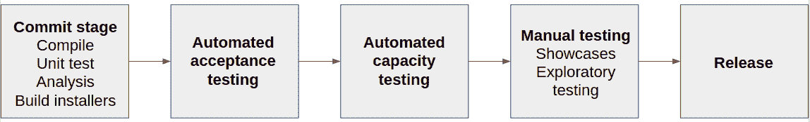

# 敏捷世界中的持续交付

> 原文：<https://testdriven.io/blog/continuous-delivery/>

> 作为软件专业人员，我们面临的最重要的问题是:如果有人想到了一个好主意，我们如何尽快将它交付给用户？

那是 2010 年。这就是 Jez Humble 和 David Farley 如何打开他们的书[连续交付](https://www.amazon.com/Continuous-Delivery-Deployment-Automation-Addison-Wesley/dp/0321601912)。事情会很快改变。连续交付是可测量和可演示的，组织进行了彻底的改变来采用这种新的方法。

在本文中，我们将看看什么是持续交付，为什么它是一个竞争优势，以及这个过程是什么样子的。

## 目标

1.  描述什么是连续交付以及这个过程是什么样子的
2.  确定当不使用连续交付时，组织在部署期间面临一些反模式
3.  解释构成可靠持续交付流程基础的两大支柱
4.  描述持续交付的关键原则

## 什么是持续交付？

[连续交付](https://martinfowler.com/bliki/ContinuousDelivery.html) (CD)是将软件从开发阶段可靠、安全、尽可能快地交付到用户手中的过程。对于软件，我指的是从源代码到配置、数据和环境的一切。

CD 的重点是部署管道，它包括应用程序的构建、部署、测试和发布过程中的所有步骤。每一步都必须自动化。通过这样做，构建、部署、测试和发布的过程对于组织中的每个人来说都是可见和清晰的，增强了开发人员之间支持和协作的 T2 文化。以自动化的方式测试每一个变化将会为开发人员产生**快速反馈**，这样他们就可以在所需努力最少的时候立即识别并解决问题。CD 使团队能够在他们需要的时候部署和发布他们的软件，并且没有部署的痛苦。

如果你正确地实现了 CD，你可以通过按一个按钮或者运行一个命令来发布你的软件。不幸的是，在许多组织中，这是不正确的，发布日通常是痛苦的一天(或更久)。在组织中可以发现一些常见的反模式:

1.  **手动部署软件**。软件发布往往是一个漫长的手工过程，需要由一个工程师团队来执行。在这个过程中，很多事情都会出错；而且，如果一个步骤执行得不完美，将会导致整个过程失败。当*有很多*文档需要遵循来准备一个发布，需要一个手动测试来确保一切正常工作，和/或整个发布过程花费超过几分钟时，您通常可以识别出这个反模式。这个反模式可能会产生许多问题。部署过程不可重复且不可靠，无法测试，并且容易出错。文档的大小会随着时间的推移而增加，难以维护，并且会变得过时。但最关键的是，测试你的部署过程的唯一方法就是去做，这本身就很危险。
2.  **只有在整个开发周期完成后，软件才能部署到类似生产的环境中**。这通常发生在有两个团队时:一个开发团队和一个运营团队。有了这个反模式，即使软件从未在生产环境中测试过，部署文档从未测试过，操作人员在发布日第一次看到软件，软件也被认为是完成了。生产中的第一次部署总是最麻烦的。此外，开发人员做出的假设可能是错误的，而且这么长的发布周期没有机会修正它们。这种场景以几十封邮件、罚单和“这是别人的责任”结束。
3.  **手动管理生产环境的配置**。当以下任一条件成立时，就会出现此反模式:
    *   生产环境中需要的更改是手动完成的，并且有更改记录
    *   准备生产环境需要大量时间
    *   不可能回滚到以前的版本。

您在您公司的常规发布过程中认识到这些反模式吗？在这种情况下，您需要让每个人都注意到这一点，并在您转向更敏捷的环境时开始解决每个反模式。

软件部署过程必须完全自动化，由每个人使用，并且用于每个部署。这将确保部署脚本将被反复测试，并在发布日可靠地工作。

生产环境的部署应该集成到开发工作流中，使用[持续集成](https://www.martinfowler.com/articles/continuousIntegration.html) (CI)作为测试软件和部署的方法。这种纪律确保了当你准备好发布你的软件时，它将很少或没有风险地发生，因为它已经被一遍又一遍地测试了。

配置必须作为代码进行管理。您环境的每个方面(特别是操作系统配置、虚拟机配置、第三方元素、基础架构配置和您的应用程序堆栈)都必须签入版本控制。您应该能够以自动化的方式重新创建您的环境。

## 持续交付基础

速度是关键，因为不交付软件是有成本的。你错过了一个机会，因为你只有在释放后才能开始学习。在你的客户开始使用它之前，你设计的那个奇特的功能是没有价值的。你越快得到反馈，你的客户就能越快验证你的软件。减少反馈回路是**第一个 pilar** 。

第二个支柱是质量。我们希望交付高质量的软件。如果您有一个手动测试套件，甚至在运行之前需要五分钟来设置和配置，这是一个明显的信号，表明有什么地方出错了。

要实现这两大支柱，你需要自动化和频率。如果构建、部署、测试和发布过程不是自动化的，那么它是不可重复的。每次经历的过程都会不一样。手动步骤容易出错，难以记录，并且一旦完成就无法复查。如果你不自动化，你将永远无法控制发布过程。发布软件不应该是一门艺术，而应该是一个枯燥单调的工程过程。如果你的发布是频繁的，它们之间的差别将会很小。这将有助于极大地降低与发布本身相关的风险，并且更容易回滚。频繁发布可以提供更快的反馈，而反馈对于良好的 CD 流程至关重要。

## 反馈程序

对可执行代码、配置、主机环境和/或数据的每一个改变都必须触发反馈过程。因此，这些组件中的每一个都必须保持在版本控制之下，每一个变化都必须进行测试。

当对源代码进行更改时，必须以自动化的方式构建和测试生成的二进制文件。这种实践被称为持续集成。

如果您的环境发生变化，必须将差异作为配置信息捕获，并且应该测试配置中的任何变化。这同样适用于部署应用程序的环境。此外，如果数据的结构发生变化，必须测试这种变化。

反馈过程是怎样的？它包括尽可能以完全自动化的方式测试每一个变化。实际上，这意味着代码库中的每一个变化:

*   源代码的构建必须成功
*   单元测试必须通过
*   必须满足代码质量要求
*   软件验收测试必须通过
*   软件的非功能测试必须通过(安全性测试，可用性测试，等等。)

自动化是快速反馈的关键。依赖于人的手动流程容易出错，而且耗时较长。此外，他们是无聊和重复的。通过自动化，我们可以把人们从有趣的事情中解放出来，把重复留给机器。

我们可以将 CD 管道设置为两个测试阶段:

1.  第一个将非常快，它可能不会覆盖整个代码库，但会处理关键路径，以便如果任何测试失败，我们的应用程序将永远不会发布。它可以在中性环境中运行。
2.  另一方面，第二阶段可能会慢一些，即使有些测试失败了，我们也可能想发布。它应该在类似生产的环境中运行。

这种设置将确保资源优化:第一阶段可以在廉价的硬件上运行，如果失败，进程将停止；第二阶段将在要求更高的硬件上运行，但可以并行化。

参与软件交付的每个人都应该参与到反馈过程中，他们应该每天一起工作来改进软件交付。这种迭代过程对于快速提高发布软件的质量是必不可少的。

## 关键原则

在这一点上，你可能对裁谈会的哲学有了一个概念，它可以用一系列原则来概括。

### 为发布软件创建一个可重复的、可靠的过程

发布软件应该很容易，因为你已经对过程的每一步都测试过几次了。可重复性和可靠性来自自动化和版本控制的使用，这将使发布软件像按一个按钮一样容易。

### 几乎一切自动化

当然，有些事情是无法自动化的。向用户演示软件是无法自动化的。出于合规目的的批准无法自动化。你还想起什么了吗？

许多团队没有自动化他们的发布，因为这看起来是一项巨大的工作；相反，他们依赖手动步骤。努力是巨大的，但是值得的，当你执行第 10 个版本的时候，它会得到回报(可能甚至在第 5 个版本之后，但是你得到了要点)。

### 让一切都在版本控制中

构建、部署、测试和发布应用程序所需的一切都应该在版本控制之下。一个新的团队成员应该能够签出您的存储库，运行一个命令来构建，并部署整个项目。

### 如果疼，那就更频繁地做，并把疼痛提前

集成通常是一件痛苦的事，所以你应该多做一些。测试和发布是痛苦的。甚至[创建新文档也很困难](/blog/documenting-python/)。你应该建立一种哲学，在这个过程中，痛苦的事情要尽早去做。

### 将质量建立在

您越早发现缺陷，修复它们的成本就越低。这意味着测试不是在开发之后开始的，也不仅仅是团队的责任。像[测试驱动开发](https://testdriven.io/test-driven-development/)这样的方法可以帮助实现这个原则。

### 完成意味着释放

你有“完成了”的用户故事和其他“完成了”的用户故事吗？“完成”的定义必须清晰，它理想地意味着发布到产品中。这可能并不总是可行的，所以我们可以使用下面的 done 定义:当一个特性在类似生产的环境中被成功测试时，它就完成了。你可以想象要“完成”一个功能不是一个人的工作，而是一个团队的努力。还要记住，没有什么比“90%”更好的了，因为现实地估计剩余的百分比是不可能的。

### 每个人都对交付过程负责

对于小型创业公司，这很容易实现，但在较大的组织中，这可能需要大量的工作。有时现实是各部门在“筒仓”中工作，因此他们最终会因为 bug 而互相指责。这是 DevOps 运动的支柱之一。

### 持续改进

在您的生产应用程序的第一个版本发布之后，随着更多版本的发布，您的过程得到改进是非常重要的。这可以通过组织中的每个人参加回顾会议来收集想法并付诸行动来实现。

## 持续交付的影响

已经进行了几项研究来评估组织中连续交付的影响。

DevOps 报告称[实践 CD 的团队在新工作上花费的时间比不实践 CD 的团队多 44%。](https://services.google.com/fh/files/misc/state-of-devops-2017.pdf)

2013 年，Nicole Forsgren、Jez Humble 和 Gene Kim 开始了一次公司间的旅行，以了解软件交付的过程和性能。结果发表在[加速](https://www.amazon.com/Accelerate-Software-Performing-Technology-Organizations/dp/1942788339)书上。

他们试图评估和衡量以下能力:

*   对应用程序代码、系统配置、应用程序配置和构建配置脚本使用版本控制
*   可靠、易于修复、定期运行的全面测试自动化
*   部署自动化
*   连续累计
*   安全性的左移:在软件交付过程中引入安全性——以及安全性团队——而不是作为下游阶段
*   使用[基于主干的开发](https://www.atlassian.com/continuous-delivery/continuous-integration/trunk-based-development),而不是长期特性分支
*   有效的测试数据管理

结果很惊人。综合起来看，这些能力对软件交付性能有很大的积极影响。它们有助于减少部署痛苦和团队倦怠。此外，在 CD 方面做得好的团队也更加认同他们工作的组织。

他们想回答的另一个关键问题是:CD 能提高质量吗？特别地，他们关注于:应用程序的质量，如那些工作在其上的人所感知的，花费在返工上的时间，以及花费在最终用户所识别的缺陷上的时间。分析发现，应用上述关键点的团队与高软件交付绩效相关联。这样的团队在返工上花费的时间也最少。

## 持续交付是什么样子的

这是一个部署管道的示例:

它始于开发人员将代码提交到版本控制系统和持续集成系统中，触发管道新实例的执行。

流水线的第一步被称为**提交阶段**。这个阶段的目标是消除不适合生产的构建，并尽快提供反馈，因为我们希望在明显有问题的版本上投入最少的时间。我们还需要防止上下文切换。因此，提交新代码的开发人员在进入下一个任务之前会等待结果。理想情况下，我们希望我们的开发人员等待所有测试通过，以便他们可以立即修复任何问题。实际上，这对于整个管道来说并不实际，但是可以在提交阶段实现，因此一旦提交阶段完成，开发人员就可以自由地转移到下一个任务。

在这个阶段，我们想要做几件事情:构建代码、运行单元测试、在工件存储库中创建和存储二进制文件以备后用，以及执行代码分析。

如果第一阶段成功完成，就意味着单元测试通过了。请记住，单元测试只是测试开发人员对问题解决方案的观点。从用户的角度来看，它们并没有真正涵盖应用程序是否做了它应该做的事情。如果我们想测试我们的应用程序是否为我们的用户提供了价值，我们需要另一种形式的测试。这些测试构成了第二阶段:自动化验收测试阶段。

这个阶段可以被分成不同的测试套件并被并行化。它还作为一个回归测试套件，验证新的变更没有将错误引入到现有的行为中。在执行验收测试时，考虑您的应用程序将在生产中遇到的环境是很重要的。

一旦自动化验收测试阶段完成，我们就有了一个成功的发布候选。在这一点上，管道分支支持**容量测试、探索性测试、可用性测试，以及对各种环境的独立部署**。在这一阶段可以自动化操作，以确保生产的自动化部署，但对于许多组织来说，在发布之前某种形式的**手动测试**是可取的，它可以在这一阶段完成，因此人们将决定是否应该提升发布候选。

## 实用的建议

根据您的软件交付过程的当前状态，您现在可能会感到有点不知所措，但是我想分享一些实用的建议，我希望当您开始您的 CD 之旅时，这些建议会对您有用。

### 一步一步来

实施 CD 流程不是一日之功。这需要时间和奉献，需要对你的日常工作流程做很多改变，所以我的建议是:一次专注于一件事。

您应该从首先实现持续集成开始。仅此一项就能极大地提高生产力，并提高项目的质量。

### 提供可操作的错误消息

当一个发布被拒绝时，错误消息必须清楚地解释出了什么问题以及如何解决这个问题。例如，避免类似“单元测试失败”的错误消息，而是提供失败测试的名称和日志消息的链接。

### 测量和使用数据

您的部署管道可以提供大量您应该测量的数据。记录从提交到发布的周期时间以及每个阶段花费的时间。这将有助于评估流程的状态并识别瓶颈。

### 包括展开破碎玻璃

有时可能需要绕过部署管道。例如，一个改变可能花费了太长的时间或者卡在了你的管道中。绕过管道级的碎玻璃机制可以让工程师快速解决停机问题。

## 结论

总结最大的收获:

*   你的目标是为你的用户提供价值
*   发布过程应该是快速的，并提供持续的反馈
*   发布软件不应该是一门艺术，而是一个枯燥单调的工程过程
*   如果不是自动化的，你就无法控制它
*   发现问题后立即解决
*   持续交付的第一步是持续集成

你的发布过程是什么样的？在推特上给我打电话，让我知道。干杯！