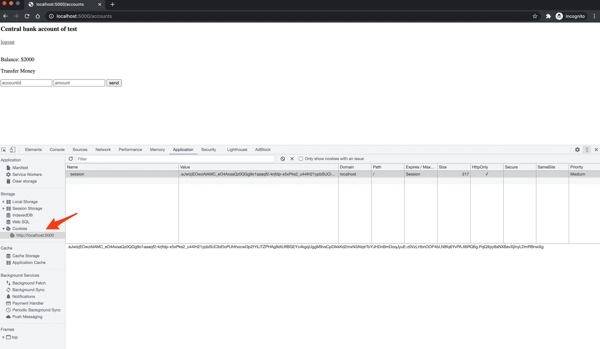
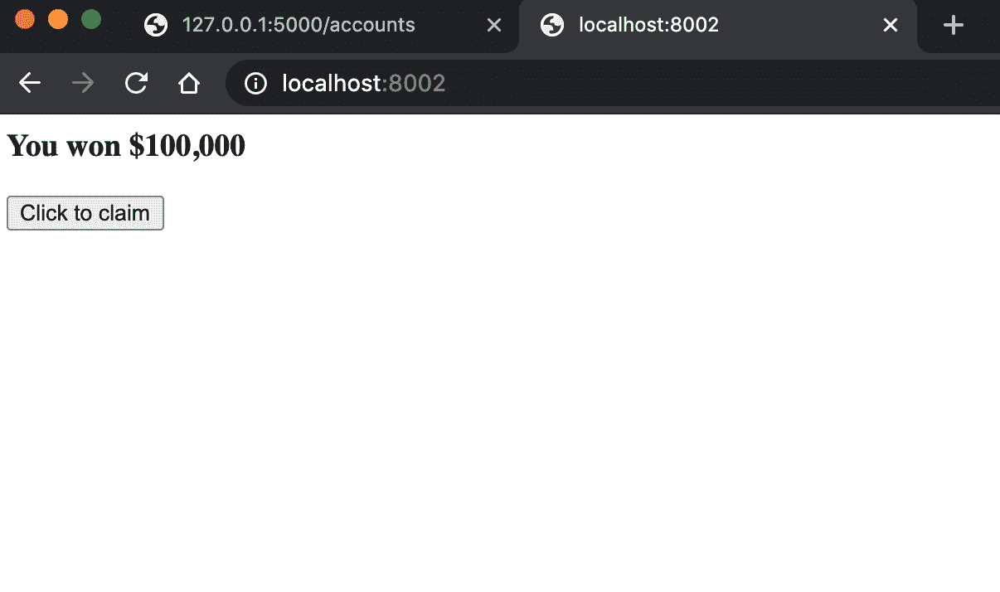
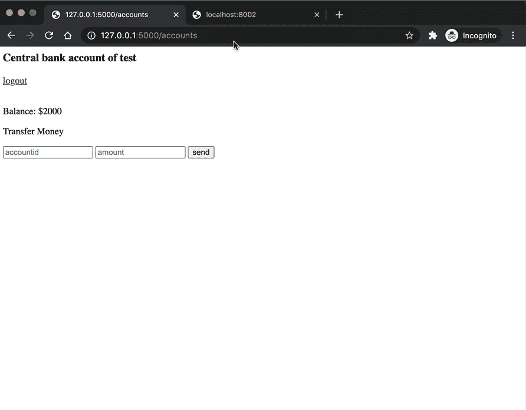
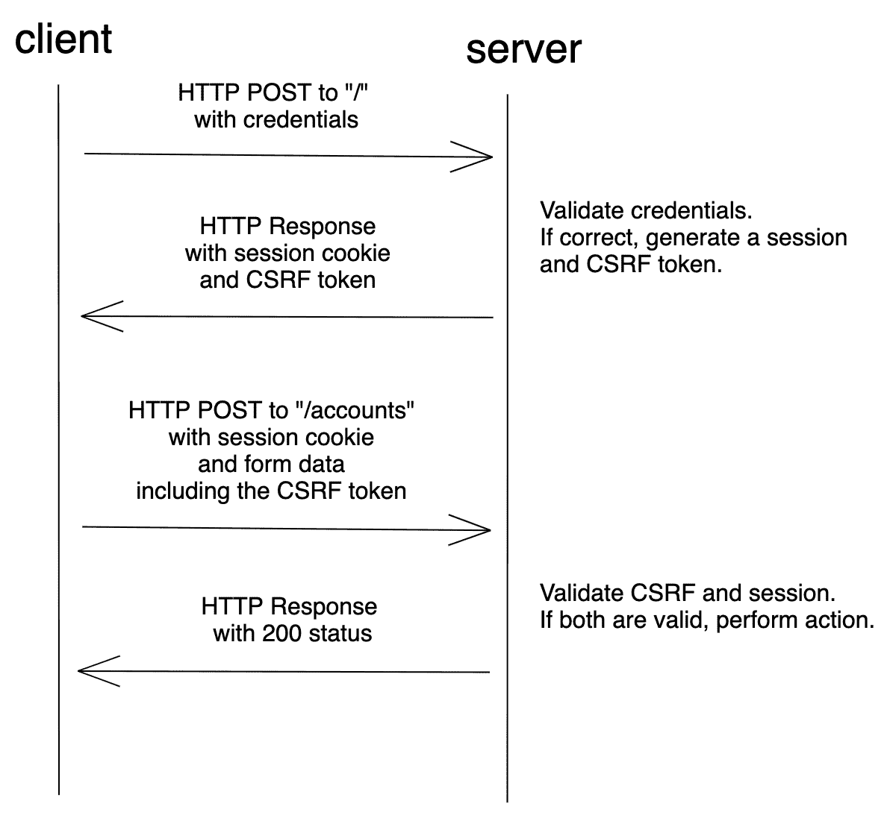
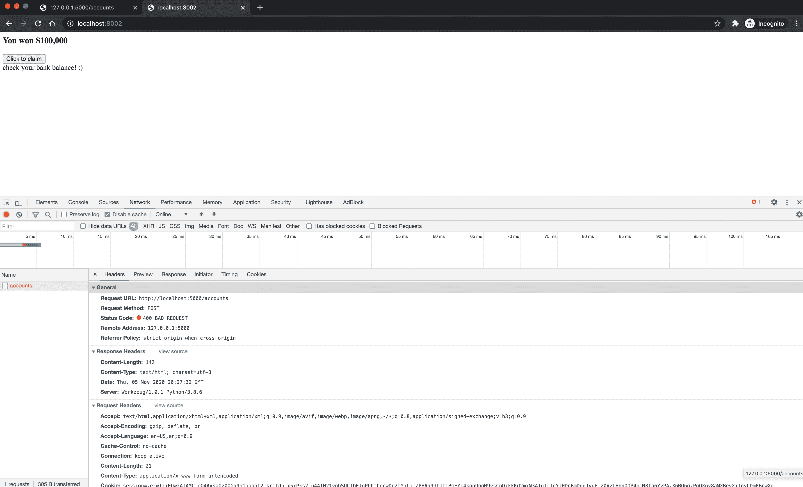
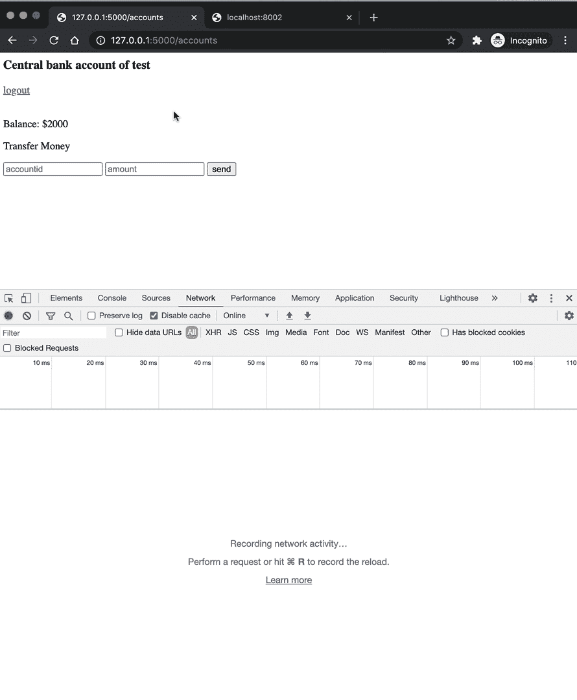

# 烧瓶中的 CSRF 保护

> 原文：<https://testdriven.io/blog/csrf-flask/>

这篇文章着眼于如何防止烧瓶中的 [CSRF](https://en.wikipedia.org/wiki/Cross-site_request_forgery) 攻击。在这个过程中，我们将看看 CSRF 是什么，一个 CSRF 攻击的例子，以及如何通过 Flask-WTF 防范 CSRF。

## 什么是 CSRF？

CSRF 代表跨站点请求伪造，是一种针对 web 应用程序的攻击，攻击者试图欺骗经过身份验证的用户执行恶意操作。大多数 CSRF 攻击的目标是使用基于 cookie 的身份验证的 web 应用程序，因为 web 浏览器在每个请求中都包含与特定域相关联的所有 cookie。因此，当恶意请求来自同一个浏览器时，攻击者可以很容易地利用存储的 cookies。

这种攻击通常是通过诱骗用户点击按钮或提交表单来实现的。例如，假设您的银行 web 应用程序容易受到 CSRF 攻击。攻击者可以创建一个包含以下形式的银行网站的克隆:

```
`<form action="https://centralbank.com/api/account" method="POST">
  <input type="hidden" name="transaction" value="transfer">
  <input type="hidden" name="amount" value="100">
  <input type="hidden" name="account" value="999">
  <input type="submit" value="Check your statement now">
</form>` 
```

然后，攻击者向您发送一封看似来自您的银行(cemtralbenk.com 而非 centralbank.com)的电子邮件，表明您的银行对账单已经可以查看了。单击电子邮件中的链接后，您会被带到带有表单的恶意网站。你点击按钮检查你的陈述。然后，浏览器将自动发送身份验证 cookie 和 POST 请求。由于您已经过身份验证，攻击者将能够执行您被允许执行的任何操作。在这种情况下，100 美元从您的帐户转移到帐号 999。

想想你每天收到的垃圾邮件。其中有多少包含隐藏的 CSRF 攻击？

## 烧瓶示例

接下来，让我们看一个容易受到 CSRF 攻击的 Flask 应用程序的例子。同样，我们将使用银行网站场景。

该应用程序具有以下功能:

*   创建用户会话的登录表单
*   显示帐户余额和转帐表单的帐户页面
*   注销按钮以清除会话

它使用 [Flask-Login](https://flask-login.readthedocs.io/en/latest/) 来处理 auth 和管理用户会话。

你可以从 [csrf-example](https://github.com/testdrivenio/csrf-example) repo 的[csrf-flask-insecurity](https://github.com/testdrivenio/csrf-example/tree/csrf-flask-insecure)分支中克隆这个应用。按照自述文件上的说明安装依赖项，并在 [http://localhost:5000](http://localhost:5000) 上运行应用程序:

确保您可以使用以下身份登录:

*   用户名:`test`
*   密码:`test`

登录后，您将被重定向到[http://localhost:5000/accounts](http://localhost:5000/accounts)。记下会话 cookie:



浏览器将随每个后续请求一起向`localhost:5000`域发送 cookie。记下与 *app.py* 中的账户页面相关联的路线:

```
`@app.route("/accounts", methods=["GET", "POST"])
@login_required
def accounts():
    user = get_user(current_user.id)

    if request.method == "POST":
        amount = int(request.form.get("amount"))
        account = int(request.form.get("account"))

        transfer_to = get_user(account)

        if amount <= user["balance"] and transfer_to:
            user["balance"] -= amount
            transfer_to["balance"] += amount

    return render_template(
        "accounts.html",
        balance=user["balance"],
        username=user["username"],
    )` 
```

这里没有什么太复杂的:在 POST 请求中，从用户的余额中减去提供的金额，并添加到与提供的帐号相关联的余额中。当用户通过身份验证时，银行服务器基本上信任来自浏览器的请求。由于这个路由处理程序无法抵御 CSRF 攻击，攻击者可以利用这种信任，诱使某人在不知情的情况下在银行服务器上执行操作。这正是 *hacker/index.html* 页面所做的:

```
`<form hidden id="hack" target="csrf-frame" action="http://localhost:5000/accounts" method="POST" autocomplete="off">
    <input type="number" name="amount" value="2000">
</form>
<iframe hidden name="csrf-frame"></iframe>

<h3>You won $100,000</h3>
<button onClick="hack();" id="button">Click to claim</button>
<br>
<div id="warning"></div>

<script> function  hack()  { document.getElementById("hack").submit(); document.getElementById("warning").innerHTML="check your bank balance!"; } </script>` 
```

您可以在 [http://localhost:8002](http://localhost:8002) 上提供此页面，方法是导航到项目目录，并在新的终端窗口中运行以下命令:

```
`$ python -m http.server --directory hacker 8002` 
```



除了糟糕的设计，在普通人看来，没有什么值得怀疑的。但在幕后，有一个隐藏的表单在后台执行，从用户的帐户中删除所有的钱。

攻击者可以通过电子邮件发送该页面的链接，伪装成某种奖品。现在，在打开页面并点击“点击认领”按钮后，一个 POST 请求被发送到[http://localhost:5000/accounts](http://localhost:5000/accounts)，该请求利用了银行和 web 浏览器之间建立的信任。



## 如何预防 CSRF？

通过使用 CSRF 令牌——一个随机的、不可猜测的字符串——来验证请求来源，可以防止 CSRF 攻击。对于具有副作用的不安全请求，如 HTTP POST 表单提交，您必须提供有效的 CSRF 令牌，以便服务器可以验证请求的来源以获得 CSRF 保护。

### CSRF 令牌工作流



1.  客户端发送一个 POST 请求，其中包含要进行身份验证的凭据。
2.  如果凭据正确，服务器将生成一个会话和 CSRF 令牌。
3.  请求被发送回客户端，会话存储在 cookie 中，而令牌呈现在隐藏的表单字段中。
4.  客户端将会话 cookie 和 CSRF 令牌包含在表单提交中。
5.  服务器验证会话和 CSRF 令牌，并接受或拒绝请求。

现在让我们看看如何使用 [Flask-WTF](https://flask-wtf.readthedocs.io/) 扩展在我们的示例应用程序中实现 CSRF 保护。

从安装依赖项开始:

接下来，在 *app.py* 中全局注册 [CSRFProtect](https://flask-wtf.readthedocs.io/csrf.html#csrf-protection) :

```
`from flask import Flask, Response, abort, redirect, render_template, request, url_for
from flask_login import (
    LoginManager,
    UserMixin,
    current_user,
    login_required,
    login_user,
    logout_user,
)
from flask_wtf.csrf import CSRFProtect

app = Flask(__name__)
app.config.update(
    DEBUG=True,
    SECRET_KEY="secret_sauce",
)

login_manager = LoginManager()
login_manager.init_app(app)

csrf = CSRFProtect()
csrf.init_app(app)

...` 
```

现在，默认情况下，所有 POST、PUT、PATCH 和 DELETE 方法都受到保护，不会被 CSRF 攻击。请注意这一点。永远不要通过 GET 请求产生副作用，比如改变数据库中的数据。

接下来，将带有 CSRF 令牌的隐藏输入字段添加到表单中。

*模板/索引. html* :

```
`<form action='/' method='POST' autocomplete="off">
    <input type='text' name='username' id='email' placeholder='username'/>
    <input type='password' name='password' id='password' placeholder='password'/>
    <input type='submit' name='submit' value='login'/>
    <input type="hidden" name="csrf_token" value="{{ csrf_token() }}">
</form>` 
```

*模板/账户. html* :

```
`<h3>Central bank account of {{username}}</h3> <a href="/logout">logout</a>

<br><br>
<p>Balance: ${{balance}}</p>
<form action="/accounts" method="POST" autocomplete="off">
    <p>Transfer Money</p>
    <input type="text" name="account" placeholder="accountid">
    <input type="number" name="amount" placeholder="amount">
    <input type="submit" value="send">
    <input type="hidden" name="csrf_token" value="{{ csrf_token() }}">
</form>` 
```

就是这样。这能帮你搞定 CSRF。现在，让我们看看这是否能阻止攻击。再次运行两台服务器。登录银行 app，然后尝试“点击认领”按钮。您应该会看到一个 400 错误:



如果在 *hacker/index.html* 中的表单中添加相同的隐藏字段会怎么样？

```
`<form hidden id="hack" target="csrf-frame" action="http://localhost:5000/accounts" method="POST" autocomplete="off">
    <input type="number" name="amount" value="2000">
    <input type="number" name="account" value="2">
    <input type="hidden" name="csrf_token" value="123">
</form>` 
```

它仍然应该失败，并显示 400。我们成功阻止了 CSRF 的袭击。



## CORS 和 JSON APIs

对于 JSON APIs，拥有一个正确配置的[跨源资源共享](https://en.wikipedia.org/wiki/Cross-origin_resource_sharing) (CORS)策略是很重要的，但是它本身并不能防止 CSRF 攻击。事实上，如果 CORS 配置不正确，它会使您更容易受到 CSRF 的攻击。

对于[预检请求](https://developer.mozilla.org/en-US/docs/Glossary/Preflight_request) CORS 策略定义了谁可以和不可以访问特定资源。当使用 [XMLHttpRequest](https://developer.mozilla.org/en-US/docs/Web/API/XMLHttpRequest) 或 [Fetch](https://developer.mozilla.org/en-US/docs/Web/API/Fetch_API) 时，此类请求由浏览器触发。

> 当触发预检请求时，浏览器向服务器发送请求，询问 CORS 策略(允许的来源、允许的请求类型等)。).然后，浏览器根据原始请求检查响应。如果请求不符合要求，浏览器将拒绝它。

同时，简单的请求，比如来自基于浏览器的表单提交的 POST 请求，不会触发预检请求，因此 CORS 策略无关紧要。

因此，如果您有 JSON API，限制允许的来源或完全消除 CORS 是防止不必要请求的一个好方法。在那种情况下，你不需要使用 CSRF 代币。如果你对原产地有更开放的 CORS 政策，使用 CSRF 代币是个好主意。

## 结论

我们已经看到了攻击者如何在用户不知情的情况下伪造请求并执行操作。随着浏览器变得越来越安全，JSON APIs 被越来越多地使用，幸运的是 CSRF 变得越来越不令人担心。也就是说，对于像表单中的 POST 请求这样的简单请求，确保处理此类请求的路由处理程序的安全是至关重要的，尤其是当 Flask-WTF 使得抵御 CSRF 攻击变得如此容易时。