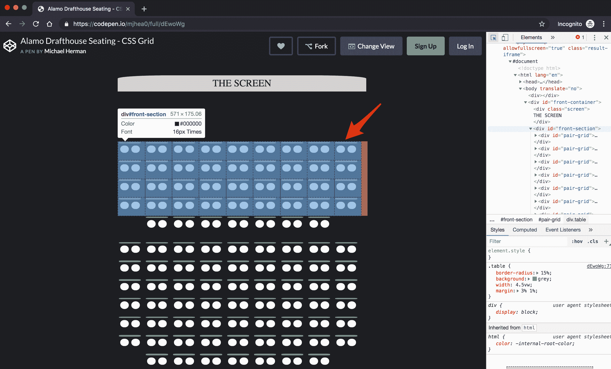
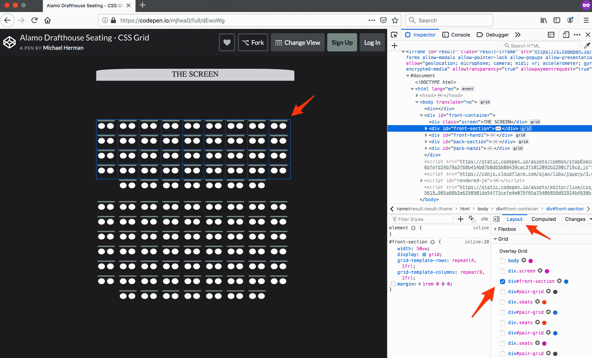

# CSS 网格:没有废话布局

> 原文：<https://testdriven.io/blog/css-grid/>

本文的目的是揭示 CSS 网格背后的力量。您将学习如何通过实用的、基于示例的方法创建基于网格的布局。

## 观众

这是面向前端开发人员的初级到中级教程，了解以下内容:

1.  基本 CSS
2.  流行的 CSS 布局方法和解决方案
3.  其他 CSS 布局方法的缺陷

## 目标

本教程结束时，您将能够:

1.  解释常见的 CSS 布局方法和解决方案
2.  描述 CSS 网格如何工作，以及它与其他 CSS 布局方法的比较
3.  通过示例确定用于使 CSS 网格更加强大的概念和属性
4.  为二维布局实现 CSS 网格

## CSS 网格和其他布局方法

通过接触其他布局方法，我们可以深入了解为什么网格获得了如此大的吸引力，如何以及何时使用它，以及它如何增强跨设备的用户体验。

以下是创建和操作网页/应用程序布局的所有方法的简要总结。

| 方法 | 描述 |
| --- | --- |
| 正常流量 | 浏览器通常如何处理布局(无 CSS) |
| 显示属性 | 该属性的值用于创建应用程序布局:`inline`、`block`、`flex`、`grid` |
| flex box(flex box)的缩写形式 | 包含行和列的一维布局 |
| 格子 | 具有行和列以及显式放置的项目的二维布局 |
| 漂浮物 | 更改浮动项和后面的块元素的行为 |
| 配置 | 将元素从正常流程移动到特定位置:`absolute`、`fixed`、`relative` |
| 表格布局 | CSS 中的 HTML 表格标记 |
| 多列布局 | 很像报纸上的多栏文章 |

显然，这里的主要焦点是 CSS Grid，但是重要的是要注意，对于特定的情况，这些方法中的许多都工作得很好——并且在一起工作得很好。Grid 半最近得到了一些惊人的[浏览器兼容性](https://caniuse.com/#search=css%20grid)更新。随着这种采用，开发人员有机会利用被忽略的 CSS 特性，如`calc()`和`minmax()`方法，以及`fr`度量。我们稍后会谈到这些

首先，让我们快速浏览一下 CSS 网格生态系统。

## CSS 网格基础

要使用 CSS 网格，必须将`display`的 CSS 样式属性设置为`grid`。这用于管理 2D 中带有行和列的布局。它可以嵌套在任何其他`display`属性的上面或下面。它非常动态和强大，尤其是当应用程序的布局很复杂的时候。

## 关键词

能够理解组成 CSS 网格环境的组件将确保从概念到完成实现复杂布局时阻力最小。使用 CSS Grid 有很多方法可以达到同样的效果，所以理解生态系统、概念和定义它们的关键字将会让你在使用 CSS Grid 时有更好的决策和更多的自由。

> 当你刚刚熟悉网格的时候，你可能很难想象它。弄清楚浏览器的隐式网格算法相对于你的显式风格在做什么可能会造成很多混乱。精确定位已定义的区域、操作内容，或者了解哪些轨迹和细胞正在做什么、在哪里以及为什么做，可能会让人不知所措。此外，我们正在创建一个在不知道合适的工具的情况下很难看到或检查的系统。在处理我的“网格中心之旅”时，浏览器开发工具让我认识到理解上面列出的关键词的重要性。

让我们从回顾以下关键词开始。

1.  **网格容器**
2.  **网格轨迹**
3.  **网格线**
4.  **网格单元**
5.  **网格项**
6.  **网格区域**
7.  **栅格间隙**

这些关键字将帮助我们理解在实现特定的网格属性时实际发生了什么。在我们理解了核心概念之后，我们将在下一节中讨论具体的属性和值。

每个项目后面的 CodePen 链接不仅仅显示代码和结果输出——代码输出中还显示了解释，以帮助更好地理解概念。请随意使用本文中链接的任何示例。

### 网格容器

一个**网格容器**是一个 HTML 元素，其 CSS 属性 display 的值被设置为 grid。所有的*直接*子元素都将应用来自其父容器的 CSS 网格布局规则。如果它们不是直接的，父容器要么不知道，不关心，要么已经抛弃了它们的子容器(它们不知道)。通过将 display 设置为 grid，您可以选择对您的直接子元素进行微观管理。你必须明确每个元素来操作布局样式。这使得网格是隐式的。让我们确定一些关键字，然后我们将明确我们的父容器，让它做所有的委托。

见 [CodePen](https://codepen.io) 上 Michael Herman ( [@mjhea0](https://codepen.io/mjhea0) )的笔 [yWQZJV](https://codepen.io/mjhea0/pen/yWQZJV/) 。

[CodePen 链接](https://codepen.io/mjhea0/pen/yWQZJV)

### 网格线

行和列的结构是由分割线引导的。那些线被称为**网格线**，它们组成了**网格轨迹**。了解这一点很重要，因为您可以明确地告诉父节点特定子节点的开始和结束位置。这里有一个双关语。同样，**网格线**从左到右，从上到下排序，从 1 开始，而不是 0。垂直和水平行组有单独的数字行，因此行从顶部的数字 1 开始，列从左侧的数字 1 开始。两列两行的网格系统会给你三条垂直线和三条水平线。从上到下，第 1、2 和 3 行，分别从左到右，第 1、2 和 3 行。

见 [CodePen](https://codepen.io) 上 Michael Herman ( [@mjhea0](https://codepen.io/mjhea0) )的笔 [YbRBJo](https://codepen.io/mjhea0/pen/YbRBJo/) 。

[CodePen 链接](https://codepen.io/mjhea0/pen/YbRBJo)

### 网格轨迹

这是两条**网格线**之间的空间，由明确的网格属性定义。本质上，整行或整列。要显式显示父元素，请在**网格容器**元素上使用以`grid-template-_____`或简写`grid`开头的属性。**网格轨迹**让父母可以很容易地给孩子分配方向**网格项目**——例如，在哪里以及如何行动。

见 [CodePen](https://codepen.io) 上 Michael Herman ( [@mjhea0](https://codepen.io/mjhea0) )的笔 [GawemN](https://codepen.io/mjhea0/pen/GawemN/) 。

[CodePen 链接](https://codepen.io/mjhea0/pen/GawemN)

### 网格单元

网格的最小单位。当你建立你的行和/或列时，由这些**网格轨迹**和**网格线**创建的矩形创建一个**网格单元**。我们将用下面的**网格项目**来演示这一点。

### 网格项目

一个**网格容器**的每个*直接*子节点是一个**网格项目**。它们总是被显式或隐式地放置在**网格单元**中。项目可以是一个或多个，也可以是一个容器，它自己的子容器应用了一组不同的网格规则。

> 如果行和/或列不是由父元素建立的，那么子元素就由 Al - aka 叔叔自动放置算法来操作。呀

见 [CodePen](https://codepen.io) 上 Michael Herman ( [@mjhea0](https://codepen.io/mjhea0) )的笔 [joQRjP](https://codepen.io/mjhea0/pen/joQRjP/) 。

[CodePen 链接](https://codepen.io/mjhea0/pen/joQRjP)

### 网格间隙

一个**网格间隙**是放置在两个**网格单元**之间的空间。在某些浏览器中，`gap`属性或`grid-gap`是`grid-row-gap`和`grid-column-gap`属性的简称。任何东西都不能放入带网格的缝隙中。我们将用下面的**网格区域**来演示这一点。

### 网格区域

我的最爱！**网格区域**是一个或多个**网格单元**，它们组成了父**网格容器**中的一个矩形区域。它们允许您使用文本来命名和组织**网格容器**中的**网格项目**。通过在指定的**网格项目**或**网格子项目**上应用`grid-area: <name here>`属性来实现这一点。您可以用文本命名每个**网格项目**，然后在父**网格容器**中按照您想要的方式排列它们。至于在父属性上设置的属性`grid-template-areas`的值，每个引用的*集*计为一行。在每个报价集中，列名以空格分隔。您可以在列名之间使用所有需要的空格，使它看起来更好。如果你想要一个空白或未命名的空间，使用句号，`.`。你也可以想拥有多少就拥有多少，正如你将在下面的演示中看到的。

> 此示例还显示了嵌套网格。

见 [CodePen](https://codepen.io) 上 Michael Herman ( [@mjhea0](https://codepen.io/mjhea0) )的笔 [NVEVod](https://codepen.io/mjhea0/pen/NVEVod/) 。

[CodePen 链接](https://codepen.io/mjhea0/pen/NVEVod)

接下来，我们将更深入地研究属性和值。最后，我们将展示一些有趣而复杂的例子。但首先，给你个提示。

**铬**:

你可以在 Chrome 的 [DevTools](https://developers.google.com/web/tools/chrome-devtools/) 中使用检查器模式来检查网格布局。要打开检查器模式，只需按下 CMD+SHIFT+C (Mac)或 CTRL+SHIFT+C (Windows 和 Linux)，这是一个打开或关闭浏览器 DOM 检查器工具的快捷键。

这对 CSS Grid 很有帮助，因为当你悬停在一个网格容器上时，你会看到它的结构。这包括组成列和行的轨道和单元格，以及边距、填充和间隙。您还可以在 DevTools 中操纵 CSS 来测试变更，而无需提交。这是学习 CSS 网格工作原理的好地方。

**火狐**:

想要顶级的检查员体验吗？火狐的[开发者工具](https://developer.mozilla.org/en-US/docs/Tools)有一个[网格检查器](https://developer.mozilla.org/en-US/docs/Tools/Page_Inspector/How_to/Examine_grid_layouts)功能，这是目前远远优于任何其他浏览器的。[布局](https://developer.mozilla.org/en-US/docs/Tools/Page_Inspector/How_to/Examine_grid_layouts#The_Layout_view_Grid_section)部分列出了 DOM 中显示的所有网格容器。它允许您选择一个、两个或所有容器，并在浏览器中切换网格线、编号、网格区域和名称。

要了解更多信息，请查看以下资源:

1.  [Firefox dev tools:CSS 网格布局介绍](https://mozilladevelopers.github.io/playground/css-grid/03-firefox-devtools)
2.  [CSS 网格:开发工具](https://www.youtube.com/watch?v=yznVkCuohGg)(视频)

## 属性和值

我们将简要介绍两组属性，后面是将与这些属性一起使用的值和函数。

下面的属性是操纵网格布局的最常见和最实用的方法。它们非常强大并且易于实现。使用下面的第三个属性——`grid`简写——很好，但是我相信你会为将来的自己和开发人员牺牲一点可读性。如果你是网格一族的新手，就从前两个开始。你可以使用任何尺寸值/单位度量来使它们*明确*。我们很快会看一些好的。

> 提示:您可以将该属性设置为`none`来让浏览器隐式地完成这项工作，或者覆盖来自竞争媒体查询的值。

1.  `grid-template-columns`定义网格容器中列的大小和数量。
2.  `grid-template-rows`定义网格容器的大小和行数。
3.  `grid`或`grid-template`(取决于浏览器)是上述两者的简称。`grid: < grid-template-rows > / < grid-template-columns >`。

现在举个例子，看起来应该很熟悉。

见 [CodePen](https://codepen.io) 上 Michael Herman ( [@mjhea0](https://codepen.io/mjhea0) )的笔 [YbRBJo](https://codepen.io/mjhea0/pen/YbRBJo/) 。

[CodePen 链接](https://codepen.io/mjhea0/pen/YbRBJo)

接下来，让我们看看一些属性，这些属性允许**网格线**作为你的布局指南。

利用以下属性是通过创建**网格区域** ( *未命名*)来定制您的**网格容器**外观的好方法。该样式将应用于**网格项目**本身，即**网格容器**的子项目。它们模仿上面“网格区域”一节中提到的`grid-template-areas`，只是语法不同。如果你刚刚开始创建**网格区域**这是一个很好的起点。`grid-template-areas`语法可能很漂亮优雅，但是对于第一次使用的人来说可能会有点快。很了解**网格线**？这些是你的财产。

### 网格-列-开始

1.  识别**网格项目**(**网格容器**的子节点)相对于其相关**网格线**(y 轴)的起始位置。
2.  应该应用于**网格容器**的子元素。
3.  定义一个**网格区域**(跨越一个**网格单元**的区域)。
4.  `1`是网格容器的左边缘。

### 网格-列-结束

1.  确定**网格项目**相对于其相关**网格线**的结束位置。
2.  应该应用于**网格容器**的子元素。
3.  定义一个**网格区域**。

### 网格-行-开始

1.  识别**网格项目**相对于其相关**网格线** (x 轴)的起始位置。
2.  应应用于**网格容器**的子元素，值为整数。
3.  `1`是网格容器的顶部。
4.  定义一个**网格区域**。

### 网格-行尾

1.  确定**网格项目**相对于其相关**网格线**的结束位置。
2.  应应用于**网格容器**的子元素，值为整数。
3.  定义一个**网格区域**。

见 [CodePen](https://codepen.io) 上 Michael Herman ( [@mjhea0](https://codepen.io/mjhea0) )的笔 [YbRBJo](https://codepen.io/mjhea0/pen/YbRBJo/) 。

[CodePen 链接](https://codepen.io/mjhea0/pen/YbRBJo)

现在，让我们看看一些有用的度量单位和 CSS 函数。

以下是非常有用的值，可以使 power CSS 网格及其属性更加动态和宽容。以下函数可以单独使用，也可以作为多值接受属性中的一个或多个值使用。

### 度量单位

**rem** (“根 em”的简称)

这个测量很棒！在用户通过将浏览器字体设置得更大来应用辅助功能的屏幕上，这是非常宽容的。这个度量单位基于*根元素的*字体大小创建长度和大小。

**fr** (“分数”的简称)

这定义了一个**网格容器**中可用的空间单位。它允许你用简单的分数来划分容器中的可用空间。分数有助于避免使用`66.66%`这样的值。应用于`grid-template-rows`和/或`grid-template-columns`时最有用。

`fr`可单独使用或组合使用:

*   `grid-template-columns: 1fr;`等于整个容器到一列。就当是 1/1 吧。
*   `grid-template-columns: 1fr 1fr;`将把容器分成两个均匀间隔的列。想想 1/2。如果你把所有的值加起来，你得到的是分母，实际值可以看作是分子。
*   `grid-template-columns: 1fr 3fr;`将把容器分成四个部分:第一列是 1 个部分，第二列是剩余的 3 个部分。
*   `grid-template-columns: 1fr 1fr 1fr;`将把容器分成三个均匀间隔的列。参见[网格线](https://codepen.io/mjhea0/pen/YbRBJo)码笔示例。

### CSS 函数

**最小最大值**

是一个非常有用的 CSS 函数，它接受两个参数:首先是最小值，然后是最大值。它对宽度和高度最有用，但它定义了任何尺寸范围。它可用于简单的媒体查询，用作参数的单位可具有混合测量值，如`minmax(1fr, 25%)`、`minmax(auto, 25%)`和`minmax(10rem, max-content)`。

见 [CodePen](https://codepen.io) 上 Michael Herman ( [@mjhea0](https://codepen.io/mjhea0) )的笔 [RmEwKa](https://codepen.io/mjhea0/pen/RmEwKa/) 。

[CodePen 链接](https://codepen.io/mjhea0/pen/RmEwKa)

**重复**

`repeat()`是一个速记功能，允许您重复给定的测量单位。它可以单独使用，也可以与其他大小声明一起使用。它还可以有多个空格分隔的第二个参数——换句话说，就是*而不是逗号分隔的*——并将连续重复该组值。

见 [CodePen](https://codepen.io) 上 Michael Herman ( [@mjhea0](https://codepen.io/mjhea0) )的笔 [VOqwye](https://codepen.io/mjhea0/pen/VOqwye/) 。

[CodePen 链接](https://codepen.io/mjhea0/pen/VOqwye)

**calc**

`calc()`计算指定等式的值。这个很厉害。事实上，几乎不可能找到一种更有效的方法来进行这些计算，尤其是对于混合单元。它使用加法、减法、乘法和除法。如果有必要，您也可以嵌套`calc()`函数。如果用于字体大小，最好指定一个单位作为相对长度单位，如`rem`或`vw`。目前，没有预处理器能够像本地`calc()`一样运行，因为它发生在渲染时。

见 [CodePen](https://codepen.io) 上 Michael Herman ( [@mjhea0](https://codepen.io/mjhea0) )的笔 [xNmbrR](https://codepen.io/mjhea0/pen/xNmbrR/) 。

[CodePen 链接](https://codepen.io/mjhea0/pen/xNmbrR)

最后，让我们看一个示例 CodePen 项目，它使用了上面所有的属性和值。有很多事情在进行，所以可以玩玩值和属性。检查你的理解。黑客快乐！

> 不要担心这个代码笔中的 JavaScript 部分。它用于使`rem`单元匹配 CodePen 显示的根元素，而不是浏览器的根元素。

见 [CodePen](https://codepen.io) 上 Michael Herman ( [@mjhea0](https://codepen.io/mjhea0) )的笔 [oRJgpe](https://codepen.io/mjhea0/pen/oRJgpe/) 。

[CodePen 链接](https://codepen.io/mjhea0/pen/oRJgpe?editors=1100#0)

## CSS 网格示例

这里有一些例子，我希望能帮助你理解 CSS 网格的概念，并理解它所产生的力量。

#### 示例 1:“空白电视-无连接”

网格容器**非常强大，但是想想看，在网格容器**的`position`设置为`absolute`的情况下，你可以在网格上做的所有事情。下面的代码笔展示了`grid-template-area`、`grid-template-rows`和`grid-template-columns`属性以及`fr`和`repeat`属性的例子。它使用了两个层叠在一起的网格容器。一个容器有一个`absolute`的位置，将它放在主容器的顶部。

参见 [CodePen](https://codepen.io) 上 Michael Herman ( [@mjhea0](https://codepen.io/mjhea0) )的 Pen [TV 无信号屏幕- CSS 网格](https://codepen.io/mjhea0/pen/LoMVNm/)。

[CodePen 链接](https://codepen.io/mjhea0/pen/LoMVNm)

#### 示例 2:“Alamo draft house-座位表”

你去过[阿拉莫制图室](https://drafthouse.com/)吗？这是一个电影院。太棒了。无论如何，如果你在网上预订，有一个漂亮的小座位表可供选择。以下示例模拟了这种布局。它使用多个嵌套网格和网格线将最后一行居中移动。JavaScript 部分中有一些 jQuery 只是克隆了每个部分的座位，但这只是将我们从非常混乱的 HTML 部分中拯救出来。

见 [CodePen](https://codepen.io) 上 Michael Herman ( [@mjhea0](https://codepen.io/mjhea0) )的笔[Alamo draft house Seating-CSS Grid](https://codepen.io/mjhea0/pen/dEwoWg/)。

[CodePen 链接](https://codepen.io/mjhea0/pen/dEwoWg?editors=1100#0)

#### 示例 3:“应用程序布局响应”

这个例子是一个带有嵌套网格的基本 web 应用程序布局。它包括标题、导航、正文和页脚。主内容区是可滚动的，也有带图片的文章，使用了`float`。

有两个断点可以改变网格布局。有`grid-template-areas`、`grid-template-rows`、`grid-template-columns`、`grid`、`gap`等例子。

见 [CodePen](https://codepen.io) 上 Michael Herman ( [@mjhea0](https://codepen.io/mjhea0) )的笔 [ZNVGja](https://codepen.io/mjhea0/pen/ZNVGja/) 。

[CodePen 链接](https://codepen.io/mjhea0/pen/ZNVGja)

## 结论

CSS 网格牛逼又强大。能够控制行和列给你带来二维空间是非常棒的。这是一个不可思议的工具，但是当你着手一个正在进行的项目时，你应该有一整套的技巧。Grid 与上面的属性和值结合在一起，将使您在创建设计模板或模型时更加轻松。我发现自己甚至在使用包含布局助手(如 Bootstrap)的 CSS 框架时也在使用网格，并且发现它更容易、更快、更灵活。去看看 CodePen，搜索 CSS Gird，看看有哪些很酷的项目可以借鉴！