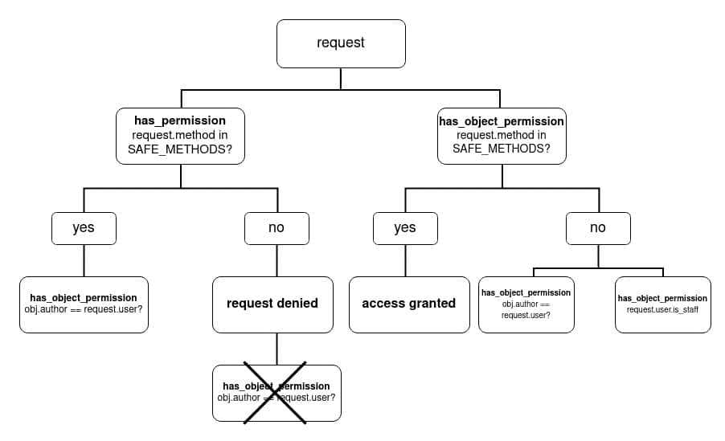
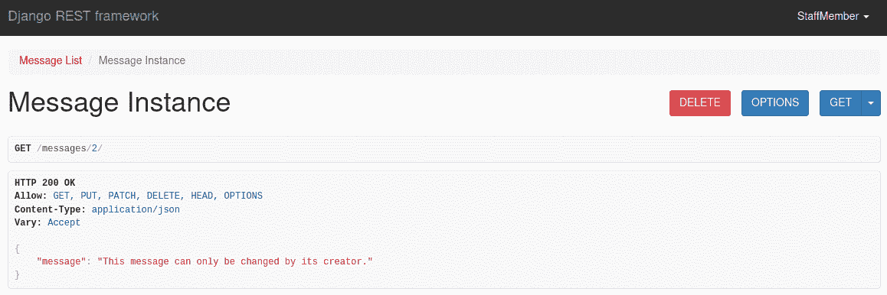
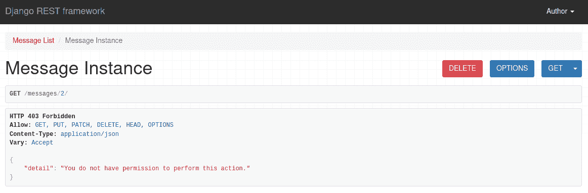
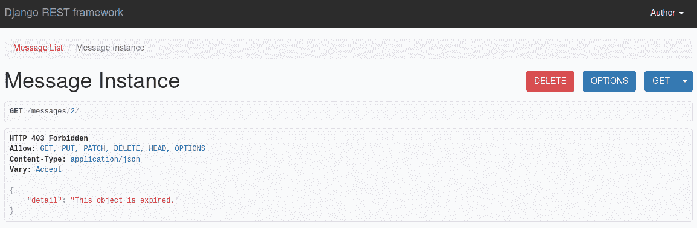

# Django REST 框架中的自定义权限类

> 原文：<https://testdriven.io/blog/custom-permission-classes-drf/>

本文着眼于如何在 Django REST 框架(DRF)中构建自定义权限类。

--

**Django REST 框架权限系列:**

1.  [Django REST 框架中的权限](/blog/drf-permissions)
2.  [Django REST 框架中内置的权限类](/blog/built-in-permission-classes-drf)
3.  [Django REST 框架中的自定义权限类](/blog/custom-permission-classes-drf)(本文！)

## 目标

完成本文后，您应该能够:

1.  创建自定义权限类
2.  解释在您的自定义权限类中何时使用`has_permission`和`has_object_permission`
3.  当权限被拒绝时返回自定义错误消息
4.  使用 and、OR 和 NOT 运算符组合和排除权限类

## 自定义权限类

如果您的应用程序有一些特殊要求，而[内置权限类](https://www.django-rest-framework.org/api-guide/permissions/#api-reference)不能满足这些要求，那么是时候开始构建您自己的自定义权限了。

创建自定义权限允许您根据用户是否经过身份验证、请求方法、用户所属的组、对象属性、IP 地址...或者它们的任意组合。

所有权限类，无论是自定义的还是内置的，都是从`BasePermission`类扩展而来的:

```py
`class BasePermission(metaclass=BasePermissionMetaclass):
    """
 A base class from which all permission classes should inherit.
 """

    def has_permission(self, request, view):
        """
 Return `True` if permission is granted, `False` otherwise.
 """
        return True

    def has_object_permission(self, request, view, obj):
        """
 Return `True` if permission is granted, `False` otherwise.
 """
        return True` 
```

`BasePermission`有两个方法，`has_permission`和`has_object_permission`，它们都返回`True`。权限类覆盖这些方法中的一个或两个，以有条件地返回 T4。如果不覆盖这些方法，它们将总是返回`True`，授予无限制的访问权限。

> 关于`has_permission`与`has_object_permission`的更多信息，请务必阅读本系列的第一篇文章，Django REST 框架中的[权限](/blog/drf-permissions)。

按照惯例，您应该将自定义权限放在一个 *permissions.py* 文件中。这只是一个约定，所以如果您需要以不同的方式组织权限，您不必这样做。

与内置权限一样，如果视图中使用的任何权限类从`has_permission`或`has_object_permission`返回`False`，则会引发`PermissionDenied`异常。若要更改与异常关联的错误信息，可以直接在自定义权限类上设置消息属性。

至此，让我们来看一些例子。

## 自定义权限示例

### 用户属性

您可能希望根据不同用户的属性为他们授予不同级别的访问权限，例如，他们是对象的创建者还是员工？

假设您不希望员工能够编辑对象。这种情况下的自定义权限类可能是这样的:

```py
`# permissions.py

from rest_framework import permissions

class AuthorAllStaffAllButEditOrReadOnly(permissions.BasePermission):

    edit_methods = ("PUT", "PATCH")

    def has_permission(self, request, view):
        if request.user.is_authenticated:
            return True

    def has_object_permission(self, request, view, obj):
        if request.user.is_superuser:
            return True

        if request.method in permissions.SAFE_METHODS:
            return True

        if obj.author == request.user:
            return True

        if request.user.is_staff and request.method not in self.edit_methods:
            return True

        return False` 
```

这里，`AuthorAllStaffAllButEditOrReadOnly`类扩展了`BasePermission`并覆盖了`has_permission`和`has_object_permission`。

**拥有 _ 权限**:

在`has_permission`中，只检查一件事:用户是否被认证。如果不是，则引发`NotAuthenticated`异常并拒绝访问。

**拥有 _ 对象 _ 权限**:

因为您不应该限制超级用户的访问，所以第一个检查- `request.user.is_superuser` -授予超级用户访问权限。

接下来，我们检查请求方法是否是“安全”的方法之一- `request.method in permissions.SAFE_METHODS`。安全方法在[rest _ framework/permissions . py](https://github.com/encode/django-rest-framework/blob/3.12.4/rest_framework/permissions.py#L8)中定义:

```py
`SAFE_METHODS = ('GET', 'HEAD', 'OPTIONS')` 
```

这些方法对对象没有影响；他们只能读它。

乍一看，`SAFE_METHODS`检查似乎应该在`has_permission`方法中。如果你只是检查请求方法，那么它就应该在那里。但是在这种情况下，不会执行其他检查:



因为我们想在方法是安全方法之一时授予访问权限**或**当用户是对象的作者**或**当用户是职员时，我们需要在相同的级别上检查它。换句话说，由于我们无法在`has_permission`级别检查所有者，所以我们需要在`has_object_permission`级别检查所有内容。

最后一种可能性是用户是职员:除了我们定义为`edit_methods`的方法之外，他们可以使用所有的方法。

最后，转回类名:`AuthorAllStaffAllButEditOrReadOnly`。您应该总是尝试尽可能多地命名权限类。

> 请记住，对于列表视图(无论从哪个视图扩展)或者当请求方法为`POST`时，永远不会执行`has_object_permission`(因为对象尚不存在)。

使用自定义权限类的方式与使用内置权限类的方式相同:

```py
`# views.py

from rest_framework import viewsets

from .models import Message
from .permissions import AuthorAllStaffAllButEditOrReadOnly
from .serializers import MessageSerializer

class MessageViewSet(viewsets.ModelViewSet):

    permission_classes = [AuthorAllStaffAllButEditOrReadOnly] # Custom permission class used

    queryset = Message.objects.all()
    serializer_class = MessageSerializer

    def perform_create(self, serializer):
        serializer.save(author=self.request.user)` 
```

对象的作者对其具有完全访问权限。同时，员工可以删除对象，但不能编辑它:



经过身份验证的用户可以查看该对象，但不能编辑或删除它:


### 对象属性

虽然我们在前面的例子中简单地提到了对象的属性，但是重点更多地放在了用户的属性上(例如，对象的作者)。在这个例子中，我们将关注对象的属性。

一个或多个对象属性如何影响权限？

1.  与前面的示例一样，您可以将访问权限仅限于对象的所有者。您还可以限制对所有者所属群组的访问。
2.  对象可能有过期日期，因此您可以将对早于 *n* 的对象的访问权限仅限于某些用户。
3.  您可以将 DELETE 实现为一个标志(这样它就不会真正从数据库中删除)。然后，您可以禁止访问带有删除标志的对象。

假设您希望限制除超级用户之外的所有人对超过 10 分钟的对象的访问:

```py
`# permissions.py

from datetime import datetime, timedelta

from django.utils import timezone
from rest_framework import permissions

class ExpiredObjectSuperuserOnly(permissions.BasePermission):

    def object_expired(self, obj):
        expired_on = timezone.make_aware(datetime.now() - timedelta(minutes=10))
        return obj.created < expired_on

    def has_object_permission(self, request, view, obj):

        if self.object_expired(obj) and not request.user.is_superuser:
            return False
        else:
            return True` 
```

在这个权限类中，`has_permission`方法没有被覆盖——所以它总是返回`True`。

因为唯一重要的属性是对象的创建时间，所以检查发生在`has_object_permission`(因为我们在`has_permission`中不能访问对象的属性)。

因此，如果用户想要访问过期的对象，就会引发异常`PermissionDenied`:



同样，和前面的例子一样，我们可以检查用户是否是`has_permission`中的超级用户，但是如果他们不是，那么对象的属性永远不会被检查。

记下错误消息。信息量不大。用户不知道为什么他们的访问被拒绝。我们可以通过向权限类添加一个`message`属性来创建一个定制的错误消息:

```py
`class ExpiredObjectSuperuserOnly(permissions.BasePermission):

    message = "This object is expired." # custom error message

    def object_expired(self, obj):
        expired_on = timezone.make_aware(datetime.now() - timedelta(minutes=10))
        return obj.created < expired_on

    def has_object_permission(self, request, view, obj):

        if self.object_expired(obj) and not request.user.is_superuser:
            return False
        else:
            return True` 
```

现在，用户清楚地看到了权限被拒绝的原因:



## 组合和排除权限类

通常，当使用多个权限类时，可以在视图中定义它们，如下所示:

```py
`permission_classes = [IsAuthenticated, IsStaff, SomeCustomPermissionClass]` 
```

这种方法将它们结合在一起，这样只有当所有的类都返回`True`时才授予许可。

从 DRF 版本 [3.9.0](https://www.django-rest-framework.org/community/release-notes/#390) 开始，您还可以使用 AND ( `&`)或 OR ( `|`)逻辑操作符来组合多个类。另外，从 [3.9.2](https://www.django-rest-framework.org/community/release-notes/#392) 开始，支持 NOT ( `~`)运算符。

> 这些运算符不限于自定义权限类。它们也可以和内置的一起使用。

您可以创建更简单的类并将它们与前面提到的操作符结合起来，而不是创建许多彼此相似的复杂权限类。

例如，您可能对不同的组组合拥有不同的权限。假设您想要以下权限:

1.  A 组或 B 组的权限
2.  B 组或 C 组的权限
3.  B 和 C 成员的权限
4.  除 A 以外的所有组的权限

虽然四个许可类看起来不多，但这不会扩展得很好。如果你有八个不同的组- A，B，C，D，E，F，G，会怎么样？它会迅速膨胀到一个无法理解和维持的程度。

您可以简化它，并通过首先为组 A、B 和 c 创建权限类，将它们与操作符结合起来。

1.  `permission_classes = [PermGroupA | PermGroupB]`
2.  `permission_classes = [PermGroupB | PermGroupC]`
3.  `permission_classes = [PermGroupB & PermGroupC]`
4.  `permission_classes = [~PermGroupA]`

> 当涉及到 OR ( `|`)时，事情会变得稍微复杂一些。错误经常会被忽略。更多信息，请查看关于[权限的讨论:允许权限被组合](https://github.com/encode/django-rest-framework/pull/5753)拉请求。

### 逻辑积算符

并且是权限类的默认行为，通过使用`,`实现:

```py
`permission_classes = [IsAuthenticated, IsStaff, SomeCustomPermissionClass]` 
```

也可以用`&`写:

```py
`permission_classes = [IsAuthenticated & IsStaff & SomeCustomPermissionClass]` 
```

### OR 运算符

使用 OR ( `|`)，当任何权限类返回`True`时，该权限被授予。您可以使用 OR 运算符提供多种可能性，让用户获得权限。

让我们看一个例子，对象的所有者或职员都可以编辑或删除对象。

我们需要两节课:

1.  `IsStaff`返回`True`如果用户`is_staff`
2.  如果用户与`obj.author`相同，则`IsOwner`返回`True`

代码:

```py
`class IsStaff(permissions.BasePermission):

    def has_permission(self, request, view):
        if request.user.is_staff:
            return True
        return False

    def has_object_permission(self, request, view, obj):
        if request.user.is_staff:
            return True
        return False

class IsOwner(permissions.BasePermission):

    def has_permission(self, request, view):
        if request.user.is_authenticated:
            return True
        return False

    def has_object_permission(self, request, view, obj):
        if obj.author == request.user:
            return True
        return False` 
```

这里有相当多的冗余，但这是必要的。

为什么？

1.  用于覆盖列表视图

    同样，列表视图不检查`has_object_permission`。然而，每个创建的权限都需要是独立的**。您不应该创建需要与另一个权限类组合来覆盖列表视图的权限类。`IsOwner`限制对`has_permission`中认证用户的访问——因此，如果`IsOwner`是唯一使用的类，对 API 的访问仍然是受控的。**

***   默认情况下，这两种方法都返回`True`

    当使用 OR 时，如果不提供`has_object_permission`方法，用户将可以访问对象，尽管他们不应该这样做。

    > 注意事项:
    > 
    > *   如果您省略了`IsOwner`类中的`has_permission`，任何人都可以看到或创建列表。
    >     
    >     
    > *   如果在`IsStaff`上省略`has_object_permission`，用`or`与`IsOwner`组合，则二者必有一个返回`True`。这样，既不是所有者也不是员工的注册用户就可以更改内容。** 

 **现在，当我们很好地设计了权限类后，就很容易将它们组合起来:

```py
`from rest_framework import viewsets

from .models import Message
from .permissions import IsStaff, IsOwner
from .serializers import MessageSerializer

class MessageViewSet(viewsets.ModelViewSet):

    permission_classes = [IsStaff | IsOwner] # or operator used

    queryset = Message.objects.all()
    serializer_class = MessageSerializer` 
```

在这里，我们允许员工或对象的所有者更改或删除它。

`IsOwner`对列表视图的唯一要求是用户被认证。这意味着不是职员的认证用户将能够创建对象。

### “非”算符

NOT 运算符导致与定义的权限类完全相反的结果。换句话说，除了来自权限类的用户之外，权限被授予所有的用户。

假设您有三组用户:

1.  技术
2.  管理
3.  资产

这些组中的每一个都应该能够访问只属于他们特定组的 API 端点。

下面是一个权限类，它只授予财务组成员访问权限:

```py
`class IsFinancesMember(permissions.BasePermission):

    def has_permission(self, request, view):
        if request.user.groups.filter(name="Finances").exists():
            return True` 
```

现在，假设您有一个新视图，它是为不属于财务组的所有用户准备的。您可以使用 NOT 运算符来实现这一点:

```py
`from rest_framework import viewsets

from .models import Message
from .permissions import IsFinancesMember
from .serializers import MessageSerializer

class MessageViewSet(viewsets.ModelViewSet):

    permission_classes = [~IsFinancesMember] # using not operator

    queryset = Message.objects.all()
    serializer_class = MessageSerializer` 
```

因此，只有财务组的成员不能访问。

> 小心点！如果您只使用 NOT 操作符，**其他所有人**都将被允许访问，**包括未认证的**用户！如果这不是您想要做的，您可以通过添加另一个类来解决这个问题，如下所示:
> 
> ```py
> permission_classes = [~IsFinancesMember & IsAuthenticated] 
> ```

### 圆括号

在`permission_classes`中，你也可以使用圆括号(`()`)来控制哪个表达式先被解析。

快速示例:

```py
`class MessageViewSet(viewsets.ModelViewSet):

    permission_classes = [(IsFinancesMember | IsTechMember) & IsOwner] # using parentheses

    queryset = Message.objects.all()
    serializer_class = MessageSerializer` 
```

在本例中，`(IsFinancesMember | IsTechMember)`将首先被解析。然后，其结果将与`& IsOwner`一起使用，例如`ResultsFromFinancesOrTech & IsOwner`。这意味着技术组或财务组的成员以及对象的所有者将被授予访问权限。

## 结论

尽管有各种各样的内置权限类，但有些情况下它们不符合您的需要。这时自定义权限类就派上了用场。

对于自定义权限类，您必须重写以下一种或两种方法:

*   `has_permission`
*   `has_object_permission`

如果在`has_permission`方法中没有授予权限，那么在`has_object_permission`中写什么都不重要——权限被拒绝。如果你不覆盖它们中的一个(或两个)，你需要考虑到默认情况下，方法将总是返回`True`。

您可以使用 and、OR 和 NOT 运算符组合和排除权限类。您甚至可以用括号决定权限解析的顺序。

--

**Django REST 框架权限系列:**

1.  [Django REST 框架中的权限](/blog/drf-permissions)
2.  [Django REST 框架中内置的权限类](/blog/built-in-permission-classes-drf)
3.  [Django REST 框架中的自定义权限类](/blog/custom-permission-classes-drf)(本文！)**