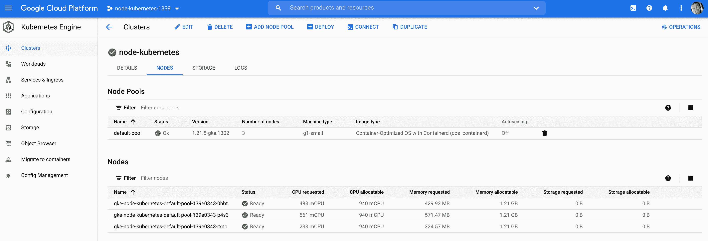
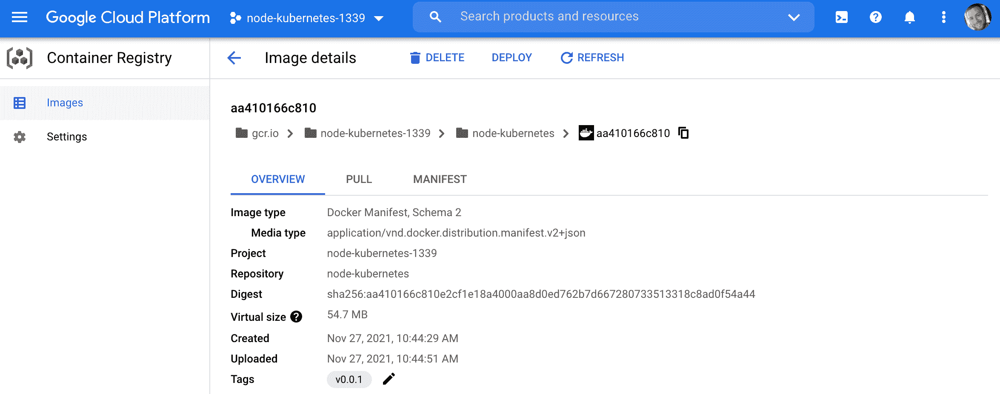
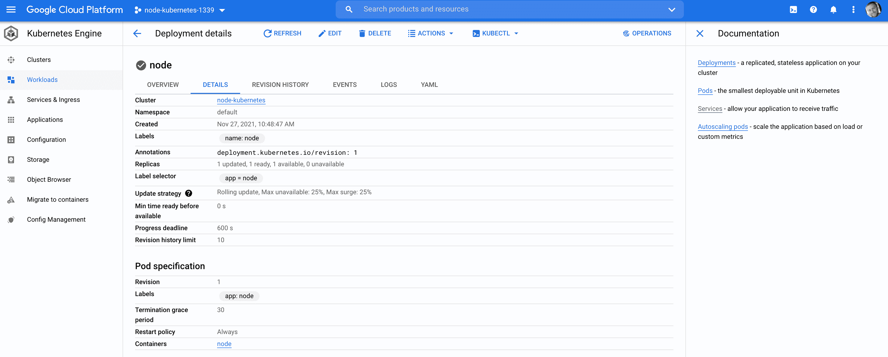
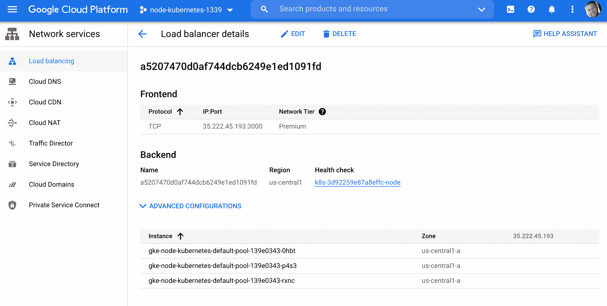
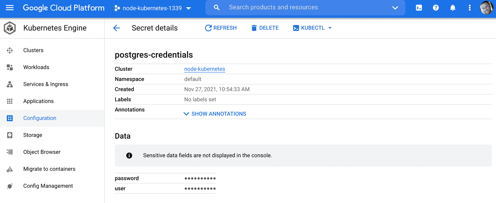
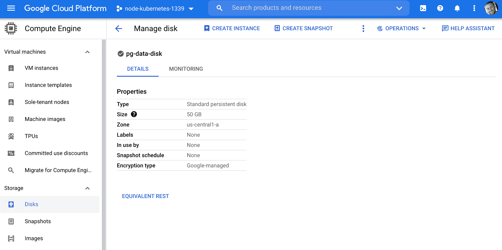
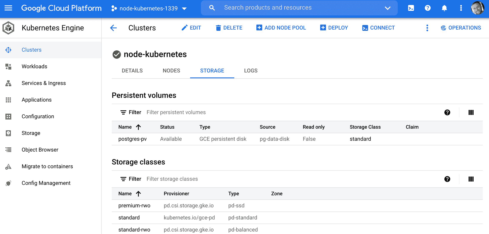
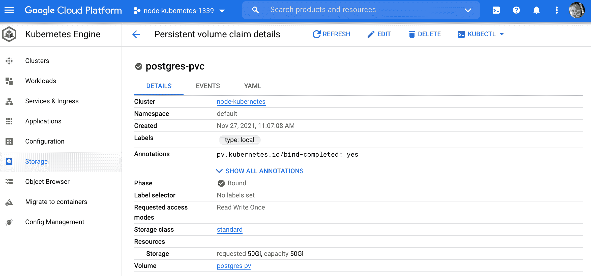
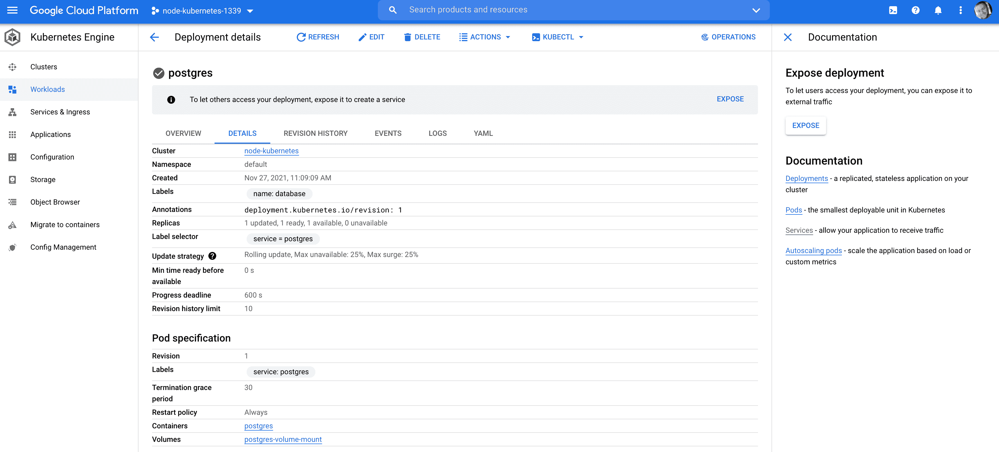
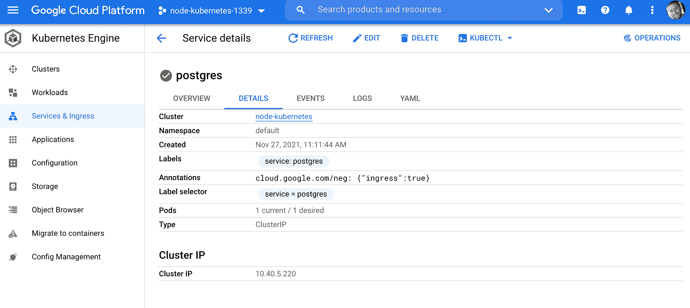

# 使用 Kubernetes 将节点应用部署到 Google Cloud

> 原文：<https://testdriven.io/blog/deploying-a-node-app-to-google-cloud-with-kubernetes/>

让我们看看如何在谷歌 Kubernetes 引擎 (GKE)上将节点/快速微服务(以及 Postgres)部署到 Kubernetes 集群。

*依赖关系:*

*   文档版本 20.10.10
*   Kubectl v1.20.8
*   谷歌云 SDK v365.0.1

> 本文假设您对 Docker 有基本的了解，并且对微服务有一个总体的了解。查看包含 Docker、Flask 和 React 课程包的[微服务，了解更多信息。](/bundle/microservices-with-docker-flask-and-react/)

## 目标

学完本教程后，您应该能够:

1.  解释什么是容器编排，以及为什么需要使用编排工具
2.  讨论与 Docker Swarm 和 AWS 弹性容器服务(ECS)等其他编排工具相比，使用 Kubernetes 的利弊
3.  解释以下 Kubernetes 原语:节点、Pod、服务、标签、部署、入口和卷
4.  使用 Docker Compose 在本地构建基于节点的微服务
5.  配置一个 Kubernetes 集群在谷歌云平台(GCP)上运行
6.  设置一个卷来保存 Kubernetes 集群中的 Postgres 数据
7.  使用 Kubernetes 的秘密来管理敏感信息
8.  在 Kubernetes 上运行 Node 和 Postgres
9.  通过负载平衡器向外部用户公开节点 API

## 什么是容器编排？

当您从在单台机器上部署容器转移到在多台机器上部署容器时，您将需要一个编排工具来管理(并自动化)容器在整个系统中的安排、协调和可用性。

编排工具有助于:

1.  跨服务器容器通信
2.  水平缩放
3.  服务发现
4.  负载平衡
5.  安全性/TLS
6.  零停机部署
7.  卷回
8.  记录
9.  监视

这就是 Kubernetes 与其他一些编排工具的契合之处，比如 T2、Docker Swarm、T4、ECS、Mesos 和 Nomad。

你应该用哪一个？

*   如果您需要管理大型、复杂的集群，请使用 Kubernetes
*   如果您刚刚起步和/或需要管理中小型集群，请使用 *Docker Swarm*
*   如果您已经在使用一些 AWS 服务，请使用 *ECS*

| 工具 | 赞成的意见 | 骗局 |
| --- | --- | --- |
| 库伯内特斯 | 大型社区，灵活，大多数功能，时尚 | 复杂的设置、高学习曲线、hip |
| 码头工人群 | 易于设置，非常适合小型集群 | 受 Docker API 的限制 |
| 精英公司 | 全面管理的服务，与 AWS 集成 | 供应商锁定 |

市场上还有许多由 Kubernetes 管理的服务:

1.  [谷歌 Kubernetes 引擎](https://cloud.google.com/kubernetes-engine/) (GKE)
2.  [弹性集装箱服务](https://aws.amazon.com/eks/) (EKS)
3.  Azure Kubernetes 服务公司

> 更多信息，请查看[选择正确的容器化和集群管理工具](https://blog.kublr.com/choosing-the-right-containerization-and-cluster-management-tool-fdfcec5700df)博文。

## 不可思议的概念

在开始之前，让我们先来看看一些您必须使用的来自 [Kubernetes API](https://kubernetes.io/docs/concepts/overview/kubernetes-api/) 的基本构件:

1.  一个 **[节点](https://kubernetes.io/docs/concepts/architecture/nodes/)** 是一个用于运行 Kubernetes 的工作机。每个节点都由 Kubernetes 主节点管理。
2.  一个 **[Pod](https://kubernetes.io/docs/concepts/workloads/pods/pod/)** 是在一个节点上运行的一组逻辑紧密耦合的应用程序容器。Pod 中的容器部署在一起并共享资源(如数据量和网络地址)。多个单元可以在一个节点上运行。
3.  一个 **[服务](https://kubernetes.io/docs/concepts/services-networking/service/)** 是执行类似功能的一组逻辑单元。它支持负载平衡和服务发现。它是豆荚上的一个抽象层；豆荚是短暂的，而服务是持久的。
4.  **[部署](https://kubernetes.io/docs/concepts/workloads/controllers/deployment/)** 用于描述 Kubernetes 的期望状态。它们规定了如何创建、部署和复制 pod。
5.  **[标签](https://kubernetes.io/docs/concepts/overview/working-with-objects/labels/)** 是附属于资源(如 pod)的键/值对，用于组织相关资源。你可以把它们想象成 CSS 选择器。例如:
    *   *环境* - `dev`，`test`，`prod`
    *   *App 版本* - `beta`，`1.2.1`
    *   *类型* - `client`，`server`，`db`
6.  **[Ingress](https://kubernetes.io/docs/concepts/services-networking/ingress/)** 是一组路由规则，用于根据请求主机或路径控制外部对服务的访问。
7.  **[卷](https://kubernetes.io/docs/concepts/storage/volumes/)** 用于保存容器寿命之外的数据。它们对于像 Redis 和 Postgres 这样的有状态应用程序尤其重要。
    *   一个 *[持久卷](https://kubernetes.io/docs/concepts/storage/persistent-volumes/)* 定义一个独立于正常 Pod 生命周期的存储卷。它是在它所在的特定舱之外被管理的。
    *   *[持久卷声明](https://kubernetes.io/docs/concepts/storage/persistent-volumes/#persistentvolumeclaims)* 是用户使用持久卷的请求。

> 更多信息，请查看[学习 Kubernetes 基础知识](https://kubernetes.io/docs/tutorials/kubernetes-basics/)教程。

## 项目设置

从从[https://github.com/testdrivenio/node-kubernetes](https://github.com/testdrivenio/node-kubernetes)回购克隆应用程序开始:

```
`$ git clone https://github.com/testdrivenio/node-kubernetes
$ cd node-kubernetes` 
```

构建映像并旋转容器:

```
`$ docker-compose up -d --build` 
```

应用迁移并为数据库设定种子:

```
`$ docker-compose exec web knex migrate:latest
$ docker-compose exec web knex seed:run` 
```

测试以下端点...

获取所有待办事项:

```
`$ curl http://localhost:3000/todos

[
  {
    "id": 1,
    "title": "Do something",
    "completed": false
  },
  {
    "id": 2,
    "title": "Do something else",
    "completed": false
  }
]` 
```

添加新的待办事项:

```
`$ curl -d '{"title":"something exciting", "completed":"false"}' \
    -H "Content-Type: application/json" -X POST http://localhost:3000/todos

"Todo added!"` 
```

获取一个待办事项:

```
`$ curl http://localhost:3000/todos/3

[
  {
    "id": 3,
    "title": "something exciting",
    "completed": false
  }
]` 
```

更新待办事项:

```
`$ curl -d '{"title":"something exciting", "completed":"true"}' \
    -H "Content-Type: application/json" -X PUT http://localhost:3000/todos/3

"Todo updated!"` 
```

删除待办事项:

```
`$ curl -X DELETE http://localhost:3000/todos/3` 
```

在继续之前，快速浏览一下代码:

```
`├── .dockerignore
├── .gitignore
├── Dockerfile
├── README.md
├── docker-compose.yml
├── knexfile.js
├── kubernetes
│   ├── node-deployment-updated.yaml
│   ├── node-deployment.yaml
│   ├── node-service.yaml
│   ├── postgres-deployment.yaml
│   ├── postgres-service.yaml
│   ├── secret.yaml
│   ├── volume-claim.yaml
│   └── volume.yaml
├── package-lock.json
├── package.json
└── src
    ├── db
    │   ├── knex.js
    │   ├── migrations
    │   │   └── 20181009160908_todos.js
    │   └── seeds
    │       └── todos.js
    └── server.js` 
```

## Google 云设置

在这一部分，我们将-

1.  配置[谷歌云 SDK](https://cloud.google.com/sdk) 。
2.  安装 [kubectl](https://kubernetes.io/docs/reference/kubectl/overview/) ，这是一个 CLI 工具，用于针对 Kubernetes 集群运行命令。
3.  创建一个 GCP 项目。

> 在开始之前，你需要一个[谷歌云平台](https://cloud.google.com/) (GCP)账户。如果你是 GCP 的新用户，谷歌提供了一个价值 300 美元的[免费试用](https://cloud.google.com/free/)。

从安装[谷歌云 SDK](https://cloud.google.com/sdk) 开始。

> 如果你在 Mac 上，我们建议安装带有[自制软件](https://brew.sh/)的 SDK:
> 
> ```
> $ brew update
> $ brew install google-cloud-sdk --cask 
> ```

测试:

```
`$ gcloud --version

Google Cloud SDK 365.0.1
bq 2.0.71
core 2021.11.19
gsutil 5.5` 
```

安装后，运行`gcloud init`来配置 SDK，以便它可以访问您的 GCP 凭证。你还需要选择一个现有的 GCP 项目或者[创建](https://cloud.google.com/resource-manager/docs/creating-managing-projects#creating_a_project)一个新的项目。

设置项目:

```
`$ gcloud config set project <PROJECT_ID>` 
```

最后，安装`kubectl`:

```
`$ gcloud components install kubectl` 
```

## 不可思议的群集

接下来，我们在 [Kubernetes 引擎](https://console.cloud.google.com/kubernetes)上创建一个集群:

```
`$ gcloud container clusters create node-kubernetes \
    --num-nodes=3 --zone us-central1-a --machine-type g1-small` 
```

这将在具有`g1-small` [机器](https://cloud.google.com/compute/docs/machine-types)的`us-central1-a` [区域](https://cloud.google.com/compute/docs/regions-zones/)中创建一个名为`node-kubernetes`的三节点集群。旋转起来需要几分钟。

```
`$ kubectl get nodes

NAME                                             STATUS   ROLES    AGE   VERSION
gke-node-kubernetes-default-pool-139e0343-0hbt   Ready    <none>   75s   v1.21.5-gke.1302
gke-node-kubernetes-default-pool-139e0343-p4s3   Ready    <none>   75s   v1.21.5-gke.1302
gke-node-kubernetes-default-pool-139e0343-rxnc   Ready    <none>   75s   v1.21.5-gke.1302` 
```



将`kubectl`客户端连接到集群:

```
`$ gcloud container clusters get-credentials node-kubernetes --zone us-central1-a

Fetching cluster endpoint and auth data.
kubeconfig entry generated for node-kubernetes.` 
```

> 有关 Kubernetes 引擎的帮助，请查看官方[文档](https://cloud.google.com/kubernetes-engine/docs/)。

## 坞站注册表

使用`gcr.io/<PROJECT_ID>/<IMAGE_NAME>:<TAG>` Docker 标签格式，为节点 API 构建本地 Docker 映像，然后将其推送到[容器注册表](https://cloud.google.com/container-registry/):

```
`$ gcloud auth configure-docker
$ docker build -t gcr.io/<PROJECT_ID>/node-kubernetes:v0.0.1 .
$ docker push gcr.io/<PROJECT_ID>/node-kubernetes:v0.0.1` 
```

> 确保用项目的 ID 替换`<PROJECT_ID>`。



## 节点设置

这样，我们现在可以通过创建[部署](https://kubernetes.io/docs/concepts/workloads/controllers/deployment/)在 [pod](https://kubernetes.io/docs/concepts/workloads/pods/pod-overview/) 上运行映像。

*kubernetes/node-deployment . YAML*:

```
`apiVersion:  apps/v1 kind:  Deployment metadata: name:  node labels: name:  node spec: replicas:  1 selector: matchLabels: app:  node template: metadata: labels: app:  node spec: containers: -  name:  node image:  gcr.io/<PROJECT_ID>/node-kubernetes:v0.0.1 env: -  name:  NODE_ENV value:  "development" -  name:  PORT value:  "3000" restartPolicy:  Always` 
```

> 同样，一定要用项目的 ID 替换`<PROJECT_ID>`。

这里发生了什么事？

1.  `metadata`
    *   `name`字段定义了部署名称- `node`
    *   `labels`为部署定义标签- `name: node`
2.  `spec`
    *   `replicas`定义要运行的 pod 数量- `1`
    *   `selector`指定窗格的标签(必须与`.spec.template.metadata.labels`匹配)
    *   `template`
        *   `metadata`
            *   `labels`指出哪些标签应该分配给 pod - `app: node`
        *   `spec`
            *   `containers`定义与每个 pod 相关的容器
            *   `restartPolicy`定义了[重启策略](https://kubernetes.io/docs/concepts/workloads/pods/pod-lifecycle/) - `Always`

因此，这将通过我们刚刚上传的`gcr.io/<PROJECT_ID>/node-kubernetes:v0.0.1`图像旋转一个名为`node`的 pod。

创建:

```
`$ kubectl create -f ./kubernetes/node-deployment.yaml` 
```

验证:

```
`$ kubectl get deployments

NAME   READY   UP-TO-DATE   AVAILABLE   AGE
node   1/1     1            1           32s

$ kubectl get pods

NAME                    READY   STATUS    RESTARTS   AGE
node-59646c8856-72blj   1/1     Running   0          18s` 
```

您可以通过`kubectl logs <POD_NAME>`查看容器日志:

```
`$ kubectl logs node-6fbfd984d-7pg92

> start
> nodemon src/server.js

[nodemon] 2.0.15
[nodemon] to restart at any time, enter `rs`
[nodemon] watching path(s): *.*
[nodemon] watching extensions: js,mjs,json
[nodemon] starting `node src/server.js`
Listening on port: 3000` 
```

您也可以从 Google Cloud 控制台查看这些资源:



为了从外部访问您的 API，让我们通过一个[服务](https://kubernetes.io/docs/concepts/services-networking/service/)创建一个负载平衡器。

*库柏/节点服务。yaml* :

```
`apiVersion:  v1 kind:  Service metadata: name:  node labels: service:  node spec: selector: app:  node type:  LoadBalancer ports: -  port:  3000` 
```

这将创建一个名为`node`的 serviced，它将找到任何带有标签`node`的 pod，并将端口暴露给外界。

创建:

```
`$ kubectl create -f ./kubernetes/node-service.yaml` 
```

这将在 Google Cloud 上创建一个新的[负载平衡器](https://cloud.google.com/load-balancing/):



获取外部 IP:

```
`$ kubectl get service node

NAME   TYPE           CLUSTER-IP     EXTERNAL-IP     PORT(S)          AGE
node   LoadBalancer   10.40.10.162   35.222.45.193   3000:31315/TCP   78s` 
```

测试一下:

1.  [http://EXTERNAL_IP:3000](http://EXTERNAL_IP:3000)
2.  [http://EXTERNAL _ IP:3000/todos](http://EXTERNAL_IP:3000/todos)

当您点击第二个端点时，您应该会看到`"Something went wrong."`，因为数据库还没有设置。

## 秘密

[秘密](https://kubernetes.io/docs/concepts/configuration/secret/)用于管理敏感信息，如密码、API 令牌和 SSH 密钥。我们将利用一个秘密来存储我们的 Postgres 数据库凭证。

*立方/秘密。yaml* :

```
`apiVersion:  v1 kind:  Secret metadata: name:  postgres-credentials type:  Opaque data: user:  c2FtcGxl password:  cGxlYXNlY2hhbmdlbWU=` 
```

用户和密码字段是 base64 编码的字符串:

```
`$ echo -n "pleasechangeme" | base64
cGxlYXNlY2hhbmdlbWU=

$ echo -n "sample" | base64
c2FtcGxl` 
```

创造秘密:

```
`$ kubectl apply -f ./kubernetes/secret.yaml` 
```

验证:

```
`$ kubectl describe secret postgres-credentials

Name:         postgres-credentials
Namespace:    default
Labels:       <none>
Annotations:  <none>

Type:  Opaque

Data
====
password:  14 bytes
user:      6 bytes` 
```



## 卷

由于容器是短暂的，我们需要配置一个卷，通过一个 [PersistentVolume](https://kubernetes.io/docs/concepts/storage/persistent-volumes/#persistent-volumes) 和一个 [PersistentVolumeClaim](https://kubernetes.io/docs/concepts/storage/persistent-volumes/#persistentvolumeclaims) 来存储 pod 外部的 Postgres 数据。如果没有卷，当 pod 关闭时，您将会丢失数据。

创建一个[持久磁盘](https://cloud.google.com/persistent-disk/):

```
`$ gcloud compute disks create pg-data-disk --size 50GB --zone us-central1-a` 
```



立方/体积。yaml :

```
`apiVersion:  v1 kind:  PersistentVolume metadata: name:  postgres-pv labels: name:  postgres-pv spec: capacity: storage:  50Gi storageClassName:  standard accessModes: -  ReadWriteOnce gcePersistentDisk: pdName:  pg-data-disk fsType:  ext4` 
```

该配置将创建一个 50gb 的 PersistentVolume，其访问模式为 [ReadWriteOnce](https://kubernetes.io/docs/concepts/storage/persistent-volumes/#access-modes) ，这意味着该卷可以由单个节点以读写方式装载。

创建卷:

```
`$ kubectl apply -f ./kubernetes/volume.yaml` 
```

检查状态:

```
`$ kubectl get pv

NAME         CAPACITY  ACCESS MODES  RECLAIM POLICY  STATUS     CLAIM  STORAGECLASS  REASON  AGE
postgres-pv  50Gi      RWO           Retain          Available         standard              6s` 
```



*立方/体积索赔. yaml* :

```
`apiVersion:  v1 kind:  PersistentVolumeClaim metadata: name:  postgres-pvc labels: type:  local spec: accessModes: -  ReadWriteOnce resources: requests: storage:  50Gi volumeName:  postgres-pv` 
```

这将在 PersistentVolume(我们刚刚创建的)上创建一个声明，Postgres pod 将能够使用该声明来连接一个卷。

创建:

```
`$ kubectl apply -f ./kubernetes/volume-claim.yaml` 
```

查看:

```
`$ kubectl get pvc

NAME           STATUS   VOLUME        CAPACITY   ACCESS MODES   STORAGECLASS   AGE
postgres-pvc   Bound    postgres-pv   50Gi       RWO            standard       6s` 
```



## Postgres 设置

随着数据库凭证和卷的建立，我们现在可以配置 Postgres 数据库本身。

*库柏人/研究生部署。yaml* :

```
`apiVersion:  apps/v1 kind:  Deployment metadata: name:  postgres labels: name:  database spec: replicas:  1 selector: matchLabels: service:  postgres template: metadata: labels: service:  postgres spec: containers: -  name:  postgres image:  postgres:14-alpine volumeMounts: -  name:  postgres-volume-mount mountPath:  /var/lib/postgresql/data subPath:  postgres env: -  name:  POSTGRES_USER valueFrom: secretKeyRef: name:  postgres-credentials key:  user -  name:  POSTGRES_PASSWORD valueFrom: secretKeyRef: name:  postgres-credentials key:  password restartPolicy:  Always volumes: -  name:  postgres-volume-mount persistentVolumeClaim: claimName:  postgres-pvc` 
```

在这里，除了通过`postgres:14-alpine`映像构建一个新的 pod，这个配置还将 PersistentVolumeClaim 从`volumes`部分安装到在`volumeMounts`部分定义的“/var/lib/postgresql/data”目录中。

> 查看[这个](https://stackoverflow.com/questions/51168558/how-to-mount-a-postgresql-volume-using-aws-ebs-in-kubernete/51174380)堆栈溢出问题，了解为什么我们在卷挂载中包含了一个[子路径](https://kubernetes.io/docs/concepts/storage/volumes/#using-subpath)的更多信息。

创建:

```
`$ kubectl create -f ./kubernetes/postgres-deployment.yaml` 
```

验证:

```
`$ kubectl get pods

NAME                        READY   STATUS    RESTARTS   AGE
node-59646c8856-72blj       1/1     Running   0          20m
postgres-64d485d86b-vtrlh   1/1     Running   0          25s` 
```



创建`todos`数据库:

```
`$ kubectl exec <POD_NAME> --stdin --tty -- createdb -U sample todos` 
```

*立方/研究生服务。yaml* :

```
`apiVersion:  v1 kind:  Service metadata: name:  postgres labels: service:  postgres spec: selector: service:  postgres type:  ClusterIP ports: -  port:  5432` 
```

这将创建一个 [ClusterIP](https://kubernetes.io/docs/concepts/services-networking/service/#publishing-services-service-types) 服务，以便其他 pods 可以连接到它。它不会在群集外部提供。

创建服务:

```
`$ kubectl create -f ./kubernetes/postgres-service.yaml` 
```



## 更新节点部署

接下来，将数据库凭据添加到节点部署中:

*kubernetes/node-deployment-updated . YAML*:

```
`apiVersion:  apps/v1 kind:  Deployment metadata: name:  node labels: name:  node spec: replicas:  1 selector: matchLabels: app:  node template: metadata: labels: app:  node spec: containers: -  name:  node image:  gcr.io/<PROJECT_ID>/node-kubernetes:v0.0.1  # update env: -  name:  NODE_ENV value:  "development" -  name:  PORT value:  "3000" -  name:  POSTGRES_USER valueFrom: secretKeyRef: name:  postgres-credentials key:  user -  name:  POSTGRES_PASSWORD valueFrom: secretKeyRef: name:  postgres-credentials key:  password restartPolicy:  Always` 
```

创建:

```
`$ kubectl delete -f ./kubernetes/node-deployment.yaml
$ kubectl create -f ./kubernetes/node-deployment-updated.yaml` 
```

验证:

```
`$ kubectl get pods

NAME                        READY   STATUS    RESTARTS   AGE
node-64c45d449b-9m7pf       1/1     Running   0          9s
postgres-64d485d86b-vtrlh   1/1     Running   0          4m7s` 
```

使用节点窗格更新数据库:

```
`$ kubectl exec <POD_NAME> knex migrate:latest
$ kubectl exec <POD_NAME> knex seed:run` 
```

再次测试:

1.  [http://EXTERNAL_IP:3000](http://EXTERNAL_IP:3000)
2.  [http://EXTERNAL _ IP:3000/todos](http://EXTERNAL_IP:3000/todos)

您现在应该可以看到 todos:

```
`[
  {
    "id": 1,
    "title": "Do something",
    "completed": false
  },
  {
    "id": 2,
    "title": "Do something else",
    "completed": false
  }
]` 
```

## 结论

在这篇文章中，我们看了如何和 GKE 一起在 Kubernetes 上运行基于节点的微服务。现在，您应该对 Kubernetes 的工作原理有了基本的了解，并且能够将运行有应用程序的集群部署到 Google Cloud。

完成后，确保关闭资源(集群、永久磁盘、容器注册表上的映像),以避免产生不必要的费用:

```
`$ kubectl delete -f ./kubernetes/node-service.yaml
$ kubectl delete -f ./kubernetes/node-deployment-updated.yaml

$ kubectl delete -f ./kubernetes/secret.yaml

$ kubectl delete -f ./kubernetes/volume-claim.yaml
$ kubectl delete -f ./kubernetes/volume.yaml

$ kubectl delete -f ./kubernetes/postgres-deployment.yaml
$ kubectl delete -f ./kubernetes/postgres-service.yaml

$ gcloud container clusters delete node-kubernetes --zone us-central1-a
$ gcloud compute disks delete pg-data-disk --zone us-central1-a
$ gcloud container images delete gcr.io/<PROJECT_ID>/node-kubernetes:v0.0.1` 
```

其他资源:

1.  [学习立方基础](https://kubernetes.io/docs/tutorials/kubernetes-basics/)
2.  [配置最佳实践](https://kubernetes.io/docs/concepts/configuration/overview/)
3.  [在 Kubernetes 上运行烧瓶](/blog/running-flask-on-kubernetes)

你可以在 GitHub 上的[节点-kubernetes](https://github.com/testdrivenio/node-kubernetes) repo 中找到代码。