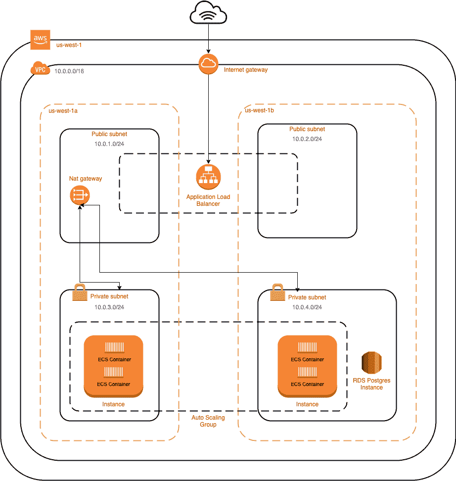

# 使用 Terraform 将 Django 部署到 AWS ECS

> 原文：<https://testdriven.io/blog/deploying-django-to-ecs-with-terraform/>

在本教程中，我们将了解如何使用 [Terraform](https://www.terraform.io) 将 Django 应用程序部署到 AWS ECS。

*依赖关系*:

1.  Django v3.2.9
2.  文档版本 20.10.10
3.  python 3 . 9 . 0 版
4.  Terraform v1.0.11

## 目标

本教程结束时，您将能够:

1.  解释什么是 Terraform，以及如何使用它编写代码形式的基础设施
2.  利用 ECR Docker 图像注册表存储图像
3.  创建启动 ECS 群集所需的地形配置
4.  通过 Terraform 提升 AWS 基础设施
5.  将 Django 应用程序部署到由 ECS 集群管理的 EC2 实例集群中
6.  使用 Boto3 更新 ECS 服务
7.  为数据持久性配置 AWS RDS
8.  为 AWS 负载平衡器创建 HTTPS 监听器

## 将（行星）地球化（以适合人类居住）

[Terraform](https://www.terraform.io) 是一个[基础设施 as code](https://en.wikipedia.org/wiki/Infrastructure_as_code) (IaC)工具，用于通过代码构建、更改和版本化基础设施。它使用高级声明式[配置语言](https://www.terraform.io/docs/configuration/index.html)，让您描述运行应用程序所需的云或本地基础设施的状态。可以把它看作是您的基础设施的唯一来源，它使安全有效地创建、更新和删除资源变得容易。在描述了基础设施的最终状态后，Terraform 会生成一个计划，然后执行它——例如，提供和启动必要的基础设施。

> 如果你是 Terraform 的新手，请阅读 Terraform 简介文章和 T2 入门指南。
> 
> 继续之前，请确保您安装了 Terraform:
> 
> ```py
> `$ terraform -v
> 
> Terraform v1.0.11
> on darwin_amd64` 
> ```

在本教程中，我们将使用 Terraform 开发将 Django 应用程序部署到 ECS 所需的高级配置文件。配置完成后，我们将运行一个命令来设置以下 AWS 基础设施:

*   网络:
    *   VPC
    *   公共和私有子网
    *   路由表
    *   互联网网关
    *   密钥对
*   安全组
*   负载平衡器、侦听器和目标组
*   IAM 角色和策略
*   ECS:
    *   任务定义(有多个容器)
    *   串
    *   服务
*   启动配置和自动缩放组
*   无线电数据系统
*   健康检查和日志

> 亚马逊的[弹性容器服务](https://aws.amazon.com/ecs/) (ECS)是一个完全托管的容器编排平台，用于管理和运行 EC2 实例集群上的容器化应用。
> 
> 如果您不熟悉 ECS，建议首先在 web 控制台中进行试验。让 ECS 为您创建这些内容，而不是手动配置所有底层网络资源、IAM 角色和策略以及日志。您只需要设置 ECS、负载平衡器、监听器、目标组和 RDS。一旦你觉得舒服了，就把基础设施作为编码工具，比如 Terraform。

架构图:



## 项目设置

让我们从建立一个快速的 Django 项目开始。

创建一个新的项目目录和一个新的 Django 项目:

```py
`$ mkdir django-ecs-terraform && cd django-ecs-terraform
$ mkdir app && cd app
$ python3.10 -m venv env
$ source env/bin/activate

(env)$ pip install django==3.2.9
(env)$ django-admin startproject hello_django .
(env)$ python manage.py migrate
(env)$ python manage.py runserver` 
```

导航到 [http://localhost:8000/](http://localhost:8000/) 查看 Django 欢迎屏幕。完成后关闭服务器，然后退出虚拟环境。继续并删除它。我们现在有了一个简单的 Django 项目。

添加一个 *requirements.txt* 文件:

```py
`Django==3.2.9
gunicorn==20.1.0` 
```

同样添加一个 *Dockerfile* :

```py
`# pull official base image
FROM  python:3.9.0-slim-buster

# set work directory
WORKDIR  /usr/src/app

# set environment variables
ENV  PYTHONDONTWRITEBYTECODE 1
ENV  PYTHONUNBUFFERED 1

# install dependencies
RUN  pip install --upgrade pip
COPY  ./requirements.txt .
RUN  pip install -r requirements.txt

# copy project
COPY  . .` 
```

出于测试目的，将`DEBUG`设置为`True`，并允许 *settings.py* 文件中的所有主机:

```py
`DEBUG = True

ALLOWED_HOSTS = ['*']` 
```

接下来，构建并标记图像，并旋转一个新的容器:

```py
`$ docker build -t django-ecs .

$ docker run \
    -p 8007:8000 \
    --name django-test \
    django-ecs \
    gunicorn hello_django.wsgi:application --bind 0.0.0.0:8000` 
```

确保您可以在 [http://localhost:8007/](http://localhost:8007/) 再次查看欢迎屏幕。

完成后，停止并移除容器:

```py
`$ docker stop django-test
$ docker rm django-test` 
```

加一个*。gitignore* 文件到项目根目录:

```py
`__pycache__ .DS_Store *.sqlite3` 
```

您的项目结构现在应该如下所示:

```py
`├── .gitignore
└── app
    ├── Dockerfile
    ├── hello_django
    │   ├── __init__.py
    │   ├── asgi.py
    │   ├── settings.py
    │   ├── urls.py
    │   └── wsgi.py
    ├── manage.py
    └── requirements.txt` 
```

> 要更详细地了解如何将 Django 应用程序容器化，请查看使用 Postgres、Gunicorn 和 Nginx 的博客文章。

## electroniccashregister 电子现金出纳机

在进入 Terraform 之前，让我们将 Docker 映像推送到一个私有的 Docker 映像注册表[Elastic Container Registry](https://aws.amazon.com/ecr/)(ECR)。

导航到 [ECR 控制台](http://console.aws.amazon.com/ecr)，添加一个名为“django-app”的新存储库。保持标签的可变性。关于这方面的更多内容，请查看[图像标签可变性](https://docs.aws.amazon.com/AmazonECR/latest/userguide/image-tag-mutability.html)指南。

回到您的终端，再次构建并标记图像:

```py
`$ docker build -t <AWS_ACCOUNT_ID>.dkr.ecr.us-west-1.amazonaws.com/django-app:latest .` 
```

> 确保用您的 AWS 帐户 ID 替换`<AWS_ACCOUNT_ID>`。
> 
> 我们将在整个课程中使用`us-west-1`区域。如果你愿意，请随意更改。

验证 Docker CLI 以使用 ECR 注册表:

```py
`$ aws ecr get-login --region us-west-1 --no-include-email` 
```

该命令将提供一个身份验证令牌。复制并粘贴整个`docker login`命令进行验证。

推送图像:

```py
`$ docker push <AWS_ACCOUNT_ID>.dkr.ecr.us-west-1.amazonaws.com/django-app:latest` 
```

## 地形设置

将“terraform”文件夹添加到项目的根目录。我们将把每个 Terraform 配置文件添加到这个文件夹中。

接下来，向“terraform”添加一个名为 *01_provider.tf* 的新文件:

```py
`provider "aws" {
  region = var.region
}` 
```

这里，我们定义了 [AWS](https://registry.terraform.io/providers/hashicorp/aws/latest/docs) 提供者。你需要提供你的 AWS 证书以便[验证](https://registry.terraform.io/providers/hashicorp/aws/latest/docs#authentication)。将它们定义为环境变量:

```py
`$ export AWS_ACCESS_KEY_ID="YOUR_AWS_ACCESS_KEY_ID"
$ export AWS_SECRET_ACCESS_KEY="YOUR_AWS_SECRET_ACCESS_KEY"` 
```

我们为`region`使用了一个字符串插值，它将从 *variables.tf* 文件中读入。继续将该文件添加到“terraform”文件夹中，并向其中添加以下变量:

```py
`# core

variable "region" {
  description = "The AWS region to create resources in."
  default     = "us-west-1"
}` 
```

> 在学习本教程的过程中，您可以根据自己的具体需求随意更新变量。

运行`terraform init`创建一个新的 Terraform 工作目录并下载 AWS 提供程序。

这样我们就可以开始定义 AWS 基础设施的每一部分。

## AWS 资源

接下来，让我们配置以下 AWS 资源:

*   网络:
    *   VPC
    *   公共和私有子网
    *   路由表
    *   互联网网关
    *   密钥对
*   安全组
*   负载平衡器、侦听器和目标组
*   IAM 角色和策略
*   ECS:
    *   任务定义(有多个容器)
    *   串
    *   服务
*   启动配置和自动缩放组
*   健康检查和日志

> 您可以在 GitHub 上的[django-ECS-Terraform](https://github.com/testdrivenio/django-ecs-terraform)repo 中找到每个 terra form 配置文件。

### 网络资源

让我们在名为 *02_network.tf* 的新文件中定义我们的网络资源:

```py
`# Production VPC
resource "aws_vpc" "production-vpc" {
  cidr_block           = "10.0.0.0/16"
  enable_dns_support   = true
  enable_dns_hostnames = true
}

# Public subnets
resource "aws_subnet" "public-subnet-1" {
  cidr_block        = var.public_subnet_1_cidr
  vpc_id            = aws_vpc.production-vpc.id
  availability_zone = var.availability_zones[0]
}
resource "aws_subnet" "public-subnet-2" {
  cidr_block        = var.public_subnet_2_cidr
  vpc_id            = aws_vpc.production-vpc.id
  availability_zone = var.availability_zones[1]
}

# Private subnets
resource "aws_subnet" "private-subnet-1" {
  cidr_block        = var.private_subnet_1_cidr
  vpc_id            = aws_vpc.production-vpc.id
  availability_zone = var.availability_zones[0]
}
resource "aws_subnet" "private-subnet-2" {
  cidr_block        = var.private_subnet_2_cidr
  vpc_id            = aws_vpc.production-vpc.id
  availability_zone = var.availability_zones[1]
}

# Route tables for the subnets
resource "aws_route_table" "public-route-table" {
  vpc_id = aws_vpc.production-vpc.id
}
resource "aws_route_table" "private-route-table" {
  vpc_id = aws_vpc.production-vpc.id
}

# Associate the newly created route tables to the subnets
resource "aws_route_table_association" "public-route-1-association" {
  route_table_id = aws_route_table.public-route-table.id
  subnet_id      = aws_subnet.public-subnet-1.id
}
resource "aws_route_table_association" "public-route-2-association" {
  route_table_id = aws_route_table.public-route-table.id
  subnet_id      = aws_subnet.public-subnet-2.id
}
resource "aws_route_table_association" "private-route-1-association" {
  route_table_id = aws_route_table.private-route-table.id
  subnet_id      = aws_subnet.private-subnet-1.id
}
resource "aws_route_table_association" "private-route-2-association" {
  route_table_id = aws_route_table.private-route-table.id
  subnet_id      = aws_subnet.private-subnet-2.id
}

# Elastic IP
resource "aws_eip" "elastic-ip-for-nat-gw" {
  vpc                       = true
  associate_with_private_ip = "10.0.0.5"
  depends_on                = [aws_internet_gateway.production-igw]
}

# NAT gateway
resource "aws_nat_gateway" "nat-gw" {
  allocation_id = aws_eip.elastic-ip-for-nat-gw.id
  subnet_id     = aws_subnet.public-subnet-1.id
  depends_on    = [aws_eip.elastic-ip-for-nat-gw]
}
resource "aws_route" "nat-gw-route" {
  route_table_id         = aws_route_table.private-route-table.id
  nat_gateway_id         = aws_nat_gateway.nat-gw.id
  destination_cidr_block = "0.0.0.0/0"
}

# Internet Gateway for the public subnet
resource "aws_internet_gateway" "production-igw" {
  vpc_id = aws_vpc.production-vpc.id
}

# Route the public subnet traffic through the Internet Gateway
resource "aws_route" "public-internet-igw-route" {
  route_table_id         = aws_route_table.public-route-table.id
  gateway_id             = aws_internet_gateway.production-igw.id
  destination_cidr_block = "0.0.0.0/0"
}` 
```

这里，我们定义了以下资源:

1.  [虚拟私有云](https://aws.amazon.com/vpc/) (VPC)
2.  [公共和私有子网](https://docs.aws.amazon.com/vpc/latest/userguide/VPC_Subnets.html)
3.  [路由表](https://docs.aws.amazon.com/vpc/latest/userguide/VPC_Route_Tables.html)
4.  [互联网网关](https://docs.aws.amazon.com/vpc/latest/userguide/VPC_Internet_Gateway.html)

还添加以下变量:

```py
`# networking

variable "public_subnet_1_cidr" {
  description = "CIDR Block for Public Subnet 1"
  default     = "10.0.1.0/24"
}
variable "public_subnet_2_cidr" {
  description = "CIDR Block for Public Subnet 2"
  default     = "10.0.2.0/24"
}
variable "private_subnet_1_cidr" {
  description = "CIDR Block for Private Subnet 1"
  default     = "10.0.3.0/24"
}
variable "private_subnet_2_cidr" {
  description = "CIDR Block for Private Subnet 2"
  default     = "10.0.4.0/24"
}
variable "availability_zones" {
  description = "Availability zones"
  type        = list(string)
  default     = ["us-west-1b", "us-west-1c"]
}` 
```

运行`terraform plan`生成并显示基于已定义配置的执行计划。

### 安全组

接下来，为了保护 Django 应用程序和 ECS 集群，让我们在一个名为 *03_securitygroups.tf* 的新文件中配置[安全组](https://docs.aws.amazon.com/vpc/latest/userguide/VPC_SecurityGroups.html):

```py
`# ALB Security Group (Traffic Internet -> ALB)
resource "aws_security_group" "load-balancer" {
  name        = "load_balancer_security_group"
  description = "Controls access to the ALB"
  vpc_id      = aws_vpc.production-vpc.id

  ingress {
    from_port   = 80
    to_port     = 80
    protocol    = "tcp"
    cidr_blocks = ["0.0.0.0/0"]
  }

  ingress {
    from_port   = 443
    to_port     = 443
    protocol    = "tcp"
    cidr_blocks = ["0.0.0.0/0"]
  }

  egress {
    from_port   = 0
    to_port     = 0
    protocol    = "-1"
    cidr_blocks = ["0.0.0.0/0"]
  }
}

# ECS Security group (traffic ALB -> ECS, ssh -> ECS)
resource "aws_security_group" "ecs" {
  name        = "ecs_security_group"
  description = "Allows inbound access from the ALB only"
  vpc_id      = aws_vpc.production-vpc.id

  ingress {
    from_port       = 0
    to_port         = 0
    protocol        = "-1"
    security_groups = [aws_security_group.load-balancer.id]
  }

  ingress {
    from_port   = 22
    to_port     = 22
    protocol    = "tcp"
    cidr_blocks = ["0.0.0.0/0"]
  }

  egress {
    from_port   = 0
    to_port     = 0
    protocol    = "-1"
    cidr_blocks = ["0.0.0.0/0"]
  }
}` 
```

注意与端口 22 的 ECS 集群相关联的安全组上的[入站规则](https://docs.aws.amazon.com/vpc/latest/userguide/VPC_SecurityGroups.html#SecurityGroupRules)。这样我们就可以 SSH 到 EC2 实例中运行初始数据库迁移并添加一个超级用户。

### 负载平衡

接下来，让我们配置一个[应用负载平衡器](https://docs.aws.amazon.com/elasticloadbalancing/latest/application/introduction.html) (ALB)以及适当的[目标组](https://docs.aws.amazon.com/elasticloadbalancing/latest/application/load-balancer-target-groups.html)和[监听器](https://docs.aws.amazon.com/elasticloadbalancing/latest/application/load-balancer-listeners.html)。

04 _ load balancer . TF:

```py
`# Production Load Balancer
resource "aws_lb" "production" {
  name               = "${var.ecs_cluster_name}-alb"
  load_balancer_type = "application"
  internal           = false
  security_groups    = [aws_security_group.load-balancer.id]
  subnets            = [aws_subnet.public-subnet-1.id, aws_subnet.public-subnet-2.id]
}

# Target group
resource "aws_alb_target_group" "default-target-group" {
  name     = "${var.ecs_cluster_name}-tg"
  port     = 80
  protocol = "HTTP"
  vpc_id   = aws_vpc.production-vpc.id

  health_check {
    path                = var.health_check_path
    port                = "traffic-port"
    healthy_threshold   = 5
    unhealthy_threshold = 2
    timeout             = 2
    interval            = 5
    matcher             = "200"
  }
}

# Listener (redirects traffic from the load balancer to the target group)
resource "aws_alb_listener" "ecs-alb-http-listener" {
  load_balancer_arn = aws_lb.production.id
  port              = "80"
  protocol          = "HTTP"
  depends_on        = [aws_alb_target_group.default-target-group]

  default_action {
    type             = "forward"
    target_group_arn = aws_alb_target_group.default-target-group.arn
  }
}` 
```

添加所需的变量:

```py
`# load balancer

variable "health_check_path" {
  description = "Health check path for the default target group"
  default     = "/ping/"
}

# ecs

variable "ecs_cluster_name" {
  description = "Name of the ECS cluster"
  default     = "production"
}` 
```

因此，我们配置了负载平衡器和监听器来监听端口 80 上的 HTTP 请求。这是暂时的。在我们验证我们的基础设施和应用程序设置正确后，我们将更新负载平衡器，以侦听端口 443 上的 HTTPS 请求。

记下运行状况检查的路径 URL:`/ping/`。

### IAM 角色

*05_iam.tf* :

```py
`resource "aws_iam_role" "ecs-host-role" {
  name               = "ecs_host_role_prod"
  assume_role_policy = file("policies/ecs-role.json")
}

resource "aws_iam_role_policy" "ecs-instance-role-policy" {
  name   = "ecs_instance_role_policy"
  policy = file("policies/ecs-instance-role-policy.json")
  role   = aws_iam_role.ecs-host-role.id
}

resource "aws_iam_role" "ecs-service-role" {
  name               = "ecs_service_role_prod"
  assume_role_policy = file("policies/ecs-role.json")
}

resource "aws_iam_role_policy" "ecs-service-role-policy" {
  name   = "ecs_service_role_policy"
  policy = file("policies/ecs-service-role-policy.json")
  role   = aws_iam_role.ecs-service-role.id
}

resource "aws_iam_instance_profile" "ecs" {
  name = "ecs_instance_profile_prod"
  path = "/"
  role = aws_iam_role.ecs-host-role.name
}` 
```

在“terraform”中添加一个名为“policies”的新文件夹。然后，添加以下[角色](https://docs.aws.amazon.com/IAM/latest/UserGuide/id_roles.html)和[策略](https://docs.aws.amazon.com/IAM/latest/UserGuide/access_policies.html)定义:

*ecs-role.json* :

```py
`{ "Version":  "2008-10-17", "Statement":  [ { "Action":  "sts:AssumeRole", "Principal":  { "Service":  [ "ecs.amazonaws.com", "ec2.amazonaws.com" ] }, "Effect":  "Allow" } ] }` 
```

*ECS-instance-role-policy . JSON*:

```py
`{ "Version":  "2012-10-17", "Statement":  [ { "Effect":  "Allow", "Action":  [ "ecs:*", "ec2:*", "elasticloadbalancing:*", "ecr:*", "cloudwatch:*", "s3:*", "rds:*", "logs:*" ], "Resource":  "*" } ] }` 
```

*ECS-service-role-policy . JSON*:

```py
`{ "Version":  "2012-10-17", "Statement":  [ { "Effect":  "Allow", "Action":  [ "elasticloadbalancing:Describe*", "elasticloadbalancing:DeregisterInstancesFromLoadBalancer", "elasticloadbalancing:RegisterInstancesWithLoadBalancer", "ec2:Describe*", "ec2:AuthorizeSecurityGroupIngress", "elasticloadbalancing:RegisterTargets", "elasticloadbalancing:DeregisterTargets" ], "Resource":  [ "*" ] } ] }` 
```

### 日志

*06_logs.tf* :

```py
`resource "aws_cloudwatch_log_group" "django-log-group" {
  name              = "/ecs/django-app"
  retention_in_days = var.log_retention_in_days
}

resource "aws_cloudwatch_log_stream" "django-log-stream" {
  name           = "django-app-log-stream"
  log_group_name = aws_cloudwatch_log_group.django-log-group.name
}` 
```

添加变量:

```py
`# logs

variable "log_retention_in_days" {
  default = 30
}` 
```

### 密钥对

07 _ key pair . TF:

```py
`resource "aws_key_pair" "production" {
  key_name   = "${var.ecs_cluster_name}_key_pair"
  public_key = file(var.ssh_pubkey_file)
}` 
```

变量:

```py
`# key pair

variable "ssh_pubkey_file" {
  description = "Path to an SSH public key"
  default     = "~/.ssh/id_rsa.pub"
}` 
```

### 精英公司

现在，我们可以配置我们的 [ECS](https://aws.amazon.com/ecs/) 集群了。

*08_ecs.tf* :

```py
`resource "aws_ecs_cluster" "production" {
  name = "${var.ecs_cluster_name}-cluster"
}

resource "aws_launch_configuration" "ecs" {
  name                        = "${var.ecs_cluster_name}-cluster"
  image_id                    = lookup(var.amis, var.region)
  instance_type               = var.instance_type
  security_groups             = [aws_security_group.ecs.id]
  iam_instance_profile        = aws_iam_instance_profile.ecs.name
  key_name                    = aws_key_pair.production.key_name
  associate_public_ip_address = true
  user_data                   = "#!/bin/bash\necho ECS_CLUSTER='${var.ecs_cluster_name}-cluster' > /etc/ecs/ecs.config"
}

data "template_file" "app" {
  template = file("templates/django_app.json.tpl")

  vars = {
    docker_image_url_django = var.docker_image_url_django
    region                  = var.region
  }
}

resource "aws_ecs_task_definition" "app" {
  family                = "django-app"
  container_definitions = data.template_file.app.rendered
}

resource "aws_ecs_service" "production" {
  name            = "${var.ecs_cluster_name}-service"
  cluster         = aws_ecs_cluster.production.id
  task_definition = aws_ecs_task_definition.app.arn
  iam_role        = aws_iam_role.ecs-service-role.arn
  desired_count   = var.app_count
  depends_on      = [aws_alb_listener.ecs-alb-http-listener, aws_iam_role_policy.ecs-service-role-policy]

  load_balancer {
    target_group_arn = aws_alb_target_group.default-target-group.arn
    container_name   = "django-app"
    container_port   = 8000
  }
}` 
```

看一下`aws_launch_configuration`中的`user_data`字段。简而言之， [user_data](https://docs.aws.amazon.com/AWSEC2/latest/UserGuide/user-data.html) 是一个在启动新的 EC2 实例时运行的脚本。为了让 ECS 集群发现新的 EC2 实例，需要将集群名称添加到实例内的 */etc/ecs/ecs.config* 配置文件中的`ECS_CLUSTER`环境变量中。换句话说，以下脚本将在引导新实例时运行，从而允许群集发现该实例:

```py
`#!/bin/bash

echo ECS_CLUSTER='production-cluster' > /etc/ecs/ecs.config` 
```

> 有关这个发现过程的更多信息，请查看 [Amazon ECS 容器代理配置](https://docs.aws.amazon.com/AmazonECS/latest/developerguide/ecs-agent-config.html)指南。

在“terraform”文件夹中添加一个“templates”文件夹，然后添加一个名为 *django_app.json.tpl* 的新模板文件:

```py
`[ { "name":  "django-app", "image":  "${docker_image_url_django}", "essential":  true, "cpu":  10, "memory":  512, "links":  [], "portMappings":  [ { "containerPort":  8000, "hostPort":  0, "protocol":  "tcp" } ], "command":  ["gunicorn",  "-w",  "3",  "-b",  ":8000",  "hello_django.wsgi:application"], "environment":  [], "logConfiguration":  { "logDriver":  "awslogs", "options":  { "awslogs-group":  "/ecs/django-app", "awslogs-region":  "${region}", "awslogs-stream-prefix":  "django-app-log-stream" } } } ]` 
```

这里，我们定义了与 Django 应用程序相关联的[容器定义](https://docs.aws.amazon.com/AmazonECS/latest/APIReference/API_ContainerDefinition.html)。

还添加以下变量:

```py
`# ecs

variable "ecs_cluster_name" {
  description = "Name of the ECS cluster"
  default     = "production"
}
variable "amis" {
  description = "Which AMI to spawn."
  default = {
    us-west-1 = "ami-0bd3976c0dbacc605"
  }
}
variable "instance_type" {
  default = "t2.micro"
}
variable "docker_image_url_django" {
  description = "Docker image to run in the ECS cluster"
  default     = "<AWS_ACCOUNT_ID>.dkr.ecr.us-west-1.amazonaws.com/django-app:latest"
}
variable "app_count" {
  description = "Number of Docker containers to run"
  default     = 2
}` 
```

> 同样，确保用您的 AWS 帐户 ID 替换`<AWS_ACCOUNT_ID>`。
> 
> 参考 [Linux Amazon ECS 优化的 ami](https://docs.aws.amazon.com/AmazonECS/latest/developerguide/ecs-optimized_AMI.html#ecs-optimized-ami-linux)指南，找到预装 Docker 的 ami 列表。

因为我们添加了[模板](https://registry.terraform.io/providers/hashicorp/template/latest/docs)提供程序，所以再次运行`terraform init`来下载新的提供程序。

### 自动缩放

*09_auto_scaling.tf* :

```py
`resource "aws_autoscaling_group" "ecs-cluster" {
  name                 = "${var.ecs_cluster_name}_auto_scaling_group"
  min_size             = var.autoscale_min
  max_size             = var.autoscale_max
  desired_capacity     = var.autoscale_desired
  health_check_type    = "EC2"
  launch_configuration = aws_launch_configuration.ecs.name
  vpc_zone_identifier  = [aws_subnet.private-subnet-1.id, aws_subnet.private-subnet-2.id]
}` 
```

新变量:

```py
`# auto scaling

variable "autoscale_min" {
  description = "Minimum autoscale (number of EC2)"
  default     = "1"
}
variable "autoscale_max" {
  description = "Maximum autoscale (number of EC2)"
  default     = "10"
}
variable "autoscale_desired" {
  description = "Desired autoscale (number of EC2)"
  default     = "4"
}` 
```

### 试验

*outputs.tf* :

```py
`output "alb_hostname" {
  value = aws_lb.production.dns_name
}` 
```

这里，我们配置了一个 *outputs.tf* 文件以及一个名为`alb_hostname`的[输出值](https://www.terraform.io/language/values/outputs)。在我们执行 Terraform 计划之后，为了启动 AWS 基础设施，负载平衡器的 DNS 名称将被输出到终端。

准备好了吗？！？查看然后执行计划:

```py
`$ terraform plan

$ terraform apply` 
```

您应该看到运行状况检查失败，并显示 404:

```py
`service production-service (instance i-013f1192da079b0bf) (port 49153)
is unhealthy in target-group production-tg due to
(reason Health checks failed with these codes: [404])` 
```

这是意料之中的，因为我们还没有在应用程序中设置/ping/ handler。

## 姜戈健康检查

将以下中间件添加到*app/hello _ django/middleware . py*:

```py
`from django.http import HttpResponse
from django.utils.deprecation import MiddlewareMixin

class HealthCheckMiddleware(MiddlewareMixin):
    def process_request(self, request):
        if request.META['PATH_INFO'] == '/ping/':
            return HttpResponse('pong!')` 
```

将类添加到 *settings.py* 中的中间件配置中:

```py
`MIDDLEWARE = [
    'hello_django.middleware.HealthCheckMiddleware',  # new
    'django.middleware.security.SecurityMiddleware',
    'django.contrib.sessions.middleware.SessionMiddleware',
    'django.middleware.common.CommonMiddleware',
    'django.middleware.csrf.CsrfViewMiddleware',
    'django.contrib.auth.middleware.AuthenticationMiddleware',
    'django.contrib.messages.middleware.MessageMiddleware',
    'django.middleware.clickjacking.XFrameOptionsMiddleware',
]` 
```

这个中间件用于在检查`ALLOWED_HOSTS`之前处理对/ping/ URL 的请求。为什么这是必要的？

健康检查请求来自 EC2 实例。由于我们事先不知道私有 IP，这将确保/ping/ route 总是返回一个成功的响应，即使在我们限制`ALLOWED_HOSTS`之后。

> 值得注意的是，您可以将 Nginx 放在 Gunicorn 前面，并在 Nginx 配置中处理健康检查，如下所示:
> 
> ```py
> location /ping/ {
>  access_log off;
>  return 200;
> } 
> ```

要进行本地测试，构建新的映像，然后启动容器:

```py
`$ docker build -t django-ecs .

$ docker run \
    -p 8007:8000 \
    --name django-test \
    django-ecs \
    gunicorn hello_django.wsgi:application --bind 0.0.0.0:8000` 
```

确保[http://localhost:8007/ping/](http://localhost:8007/ping/)按预期工作:

完成后，停止并移除容器:

```py
`$ docker stop django-test
$ docker rm django-test` 
```

接下来，更新 ECR:

```py
`$ docker build -t <AWS_ACCOUNT_ID>.dkr.ecr.us-west-1.amazonaws.com/django-app:latest .
$ docker push <AWS_ACCOUNT_ID>.dkr.ecr.us-west-1.amazonaws.com/django-app:latest` 
```

让我们添加一个快速脚本来更新任务定义和服务，以便新任务使用我们刚刚推送的新映像。

在项目根目录下创建一个“部署”文件夹。然后，将一个 *update-ecs.py* 文件添加到新创建的文件夹中:

```py
`import boto3
import click

def get_current_task_definition(client, cluster, service):
    response = client.describe_services(cluster=cluster, services=[service])
    current_task_arn = response["services"][0]["taskDefinition"]

    response = client.describe_task_definition(taskDefinition=current_task_arn)
    return response

@click.command()
@click.option("--cluster", help="Name of the ECS cluster", required=True)
@click.option("--service", help="Name of the ECS service", required=True)
def deploy(cluster, service):
    client = boto3.client("ecs")

    response = get_current_task_definition(client, cluster, service)
    container_definition = response["taskDefinition"]["containerDefinitions"][0].copy()

    response = client.register_task_definition(
        family=response["taskDefinition"]["family"],
        volumes=response["taskDefinition"]["volumes"],
        containerDefinitions=[container_definition],
    )
    new_task_arn = response["taskDefinition"]["taskDefinitionArn"]

    response = client.update_service(
        cluster=cluster, service=service, taskDefinition=new_task_arn,
    )

if __name__ == "__main__":
    deploy()` 
```

因此，该脚本将创建任务定义的新修订版，然后更新服务，使其使用修订后的任务定义。

创建并激活新的虚拟环境。然后，安装 [Boto3](https://github.com/boto/boto3) 和[点击](https://click.palletsprojects.com/):

```py
`$ pip install boto3 click` 
```

添加您的 AWS 凭据以及默认区域:

```py
`$ export AWS_ACCESS_KEY_ID="YOUR_AWS_ACCESS_KEY_ID"
$ export AWS_SECRET_ACCESS_KEY="YOUR_AWS_SECRET_ACCESS_KEY"
$ export AWS_DEFAULT_REGION="us-west-1"` 
```

像这样运行脚本:

```py
`$ python update-ecs.py --cluster=production-cluster --service=production-service` 
```

服务应该根据修改后的任务定义启动两个新任务，并将它们注册到相关的目标组。这一次健康检查应该会通过。现在，您应该能够使用输出到终端的 DNS 主机名来查看您的应用程序了:

```py
`Outputs:

alb_hostname = production-alb-1008464563.us-west-1.elb.amazonaws.com` 
```

## 无线电数据系统

接下来，让我们配置 [RDS](https://aws.amazon.com/rds/) ，这样我们就可以将 Postgres 用于我们的生产数据库。

向 *03_securitygroups.tf* 添加一个新的安全组，以确保只有来自 ECS 实例的流量可以与数据库对话:

```py
`# RDS Security Group (traffic ECS -> RDS)
resource "aws_security_group" "rds" {
  name        = "rds-security-group"
  description = "Allows inbound access from ECS only"
  vpc_id      = aws_vpc.production-vpc.id

  ingress {
    protocol        = "tcp"
    from_port       = "5432"
    to_port         = "5432"
    security_groups = [aws_security_group.ecs.id]
  }

  egress {
    protocol    = "-1"
    from_port   = 0
    to_port     = 0
    cidr_blocks = ["0.0.0.0/0"]
  }
}` 
```

接下来，添加一个名为 *10_rds.tf* 的新文件，用于设置数据库本身:

```py
`resource "aws_db_subnet_group" "production" {
  name       = "main"
  subnet_ids = [aws_subnet.private-subnet-1.id, aws_subnet.private-subnet-2.id]
}

resource "aws_db_instance" "production" {
  identifier              = "production"
  name                    = var.rds_db_name
  username                = var.rds_username
  password                = var.rds_password
  port                    = "5432"
  engine                  = "postgres"
  engine_version          = "12.3"
  instance_class          = var.rds_instance_class
  allocated_storage       = "20"
  storage_encrypted       = false
  vpc_security_group_ids  = [aws_security_group.rds.id]
  db_subnet_group_name    = aws_db_subnet_group.production.name
  multi_az                = false
  storage_type            = "gp2"
  publicly_accessible     = false
  backup_retention_period = 7
  skip_final_snapshot     = true
}` 
```

变量:

```py
`# rds

variable "rds_db_name" {
  description = "RDS database name"
  default     = "mydb"
}
variable "rds_username" {
  description = "RDS database username"
  default     = "foo"
}
variable "rds_password" {
  description = "RDS database password"
}
variable "rds_instance_class" {
  description = "RDS instance type"
  default     = "db.t2.micro"
}` 
```

请注意，我们保留了密码的默认值。稍后会有更多的介绍。

因为我们需要知道 Django 应用程序中实例的地址，所以在 *08_ecs.tf* 的`aws_ecs_task_definition`中添加一个`depends_on`参数:

```py
`resource "aws_ecs_task_definition" "app" {
  family                = "django-app"
  container_definitions = data.template_file.app.rendered
  depends_on            = [aws_db_instance.production]
}` 
```

接下来，我们需要更新 *settings.py* 中的`DATABASES`配置:

```py
`if 'RDS_DB_NAME' in os.environ:
    DATABASES = {
        'default': {
            'ENGINE': 'django.db.backends.postgresql_psycopg2',
            'NAME': os.environ['RDS_DB_NAME'],
            'USER': os.environ['RDS_USERNAME'],
            'PASSWORD': os.environ['RDS_PASSWORD'],
            'HOST': os.environ['RDS_HOSTNAME'],
            'PORT': os.environ['RDS_PORT'],
        }
    }
else:
    DATABASES = {
        'default': {
            'ENGINE': 'django.db.backends.sqlite3',
            'NAME': os.path.join(BASE_DIR, 'db.sqlite3'),
        }
    }` 
```

添加导入:

更新 *django_app.json.tpl* 模板中的`environment`部分:

```py
`"environment":  [ { "name":  "RDS_DB_NAME", "value":  "${rds_db_name}" }, { "name":  "RDS_USERNAME", "value":  "${rds_username}" }, { "name":  "RDS_PASSWORD", "value":  "${rds_password}" }, { "name":  "RDS_HOSTNAME", "value":  "${rds_hostname}" }, { "name":  "RDS_PORT", "value":  "5432" } ],` 
```

更新 *08_ecs.tf* 中传递给模板的变量:

```py
`data "template_file" "app" {
  template = file("templates/django_app.json.tpl")

  vars = {
    docker_image_url_django = var.docker_image_url_django
    region                  = var.region
    rds_db_name             = var.rds_db_name
    rds_username            = var.rds_username
    rds_password            = var.rds_password
    rds_hostname            = aws_db_instance.production.address
  }
}` 
```

将 [Psycopg2](https://www.psycopg.org/) 添加到需求文件中:

```py
`Django==3.2.9
gunicorn==20.1.0
psycopg2-binary==2.9.2` 
```

更新 docker 文件以安装 Psycopg2 所需的相应软件包:

```py
`# pull official base image
FROM  python:3.9.0-slim-buster

# set work directory
WORKDIR  /usr/src/app

# set environment variables
ENV  PYTHONDONTWRITEBYTECODE 1
ENV  PYTHONUNBUFFERED 1

# install psycopg2 dependencies
RUN  apt-get update \
  && apt-get -y install gcc postgresql \
  && apt-get clean

# install dependencies
RUN  pip install --upgrade pip
COPY  ./requirements.txt .
RUN  pip install -r requirements.txt

# copy project
COPY  . .` 
```

好吧。构建 Docker 映像并将其推送到 ECR。然后，要更新 ECS 任务定义、创建 RDS 资源并更新服务，请运行:

因为我们没有设置默认密码，所以会提示您输入一个密码:

```py
`var.rds_password
  RDS database password

  Enter a value:` 
```

不必每次都传递一个值，您可以像这样设置一个[环境变量](https://www.terraform.io/docs/commands/environment-variables.html#tf_var_name):

```py
`$ export TF_VAR_rds_password=foobarbaz

$ terraform apply` 
```

请记住，这种使用环境变量的方法将敏感变量排除在*之外。tf* 文件，但它们仍然以纯文本形式存储在 *terraform.tfstate* 文件中。因此，一定要将这个文件置于版本控制之外。因为如果你团队中的其他人需要访问它，将它置于版本控制之外是行不通的，所以要么加密秘密，要么使用像[金库](https://www.vaultproject.io/)或 [AWS 秘密管理器](https://aws.amazon.com/secrets-manager/)这样的秘密存储。

在新任务注册到目标组之后，SSH 进入一个 EC2 实例，其中一个任务正在运行:

通过`docker ps`获取容器 ID，并使用它来应用迁移:

```py
`$ docker exec -it <container-id> python manage.py migrate

# docker exec -it 73284cda8a87 python manage.py migrate` 
```

您可能还想创建一个超级用户。完成后，退出 SSH 会话。如果您不再需要 SSH 访问，您可能需要从 ECS 安全组中删除以下入站规则:

```py
`ingress {
  from_port   = 22
  to_port     = 22
  protocol    = "tcp"
  cidr_blocks = ["0.0.0.0/0"]
}` 
```

## 域和 SSL 证书

假设您已经从 [AWS 证书管理器](https://aws.amazon.com/certificate-manager/)生成并验证了一个新的 SSL 证书，将证书的 ARN 添加到您的变量中:

```py
`# domain

variable "certificate_arn" {
  description = "AWS Certificate Manager ARN for validated domain"
  default     = "ADD YOUR ARN HERE"
}` 
```

在 *04_loadbalancer.tf* 中更新与负载平衡器关联的默认监听器，以便它监听端口 443 上的 HTTPS 请求(与端口 80 上的 HTTP 相反):

```py
`# Listener (redirects traffic from the load balancer to the target group)
resource "aws_alb_listener" "ecs-alb-http-listener" {
  load_balancer_arn = aws_lb.production.id
  port              = "443"
  protocol          = "HTTPS"
  ssl_policy        = "ELBSecurityPolicy-2016-08"
  certificate_arn   = var.certificate_arn
  depends_on        = [aws_alb_target_group.default-target-group]

  default_action {
    type             = "forward"
    target_group_arn = aws_alb_target_group.default-target-group.arn
  }
}` 
```

应用更改:

确保使用 CNAME 记录将您的域指向负载平衡器。确保您可以查看您的应用程序。

## Nginx

接下来，让我们将 Nginx 添加到组合中，以适当地处理对静态文件的请求。

在项目根目录中，创建以下文件和文件夹:

```py
`└── nginx
    ├── Dockerfile
    └── nginx.conf` 
```

*Dockerfile* :

```py
`FROM  nginx:1.19.0-alpine

RUN  rm /etc/nginx/conf.d/default.conf
COPY  nginx.conf /etc/nginx/conf.d
EXPOSE  80` 
```

*engine . conf*:

```py
`upstream  hello_django  { server  django-app:8000; } server  { listen  80; location  /  { proxy_pass  http://hello_django; proxy_set_header  X-Forwarded-For  $proxy_add_x_forwarded_for; proxy_set_header  Host  $host; proxy_redirect  off; } }` 
```

这里，我们设置了一个位置块，将所有流量路由到 Django 应用程序。在下一节中，我们将为静态文件设置一个新的位置块。

在 ECR 中创建一个名为“nginx”的新 repo，然后构建并推送新映像:

```py
`$ docker build -t <AWS_ACCOUNT_ID>.dkr.ecr.us-west-1.amazonaws.com/nginx:latest .
$ docker push <AWS_ACCOUNT_ID>.dkr.ecr.us-west-1.amazonaws.com/nginx:latest` 
```

将以下变量添加到变量文件的 ECS 部分:

```py
`variable "docker_image_url_nginx" {
  description = "Docker image to run in the ECS cluster"
  default     = "<AWS_ACCOUNT_ID>.dkr.ecr.us-west-1.amazonaws.com/nginx:latest"
}` 
```

将新的容器定义添加到 *django_app.json.tpl* 模板:

```py
`[ { "name":  "django-app", "image":  "${docker_image_url_django}", "essential":  true, "cpu":  10, "memory":  512, "links":  [], "portMappings":  [ { "containerPort":  8000, "hostPort":  0, "protocol":  "tcp" } ], "command":  ["gunicorn",  "-w",  "3",  "-b",  ":8000",  "hello_django.wsgi:application"], "environment":  [ { "name":  "RDS_DB_NAME", "value":  "${rds_db_name}" }, { "name":  "RDS_USERNAME", "value":  "${rds_username}" }, { "name":  "RDS_PASSWORD", "value":  "${rds_password}" }, { "name":  "RDS_HOSTNAME", "value":  "${rds_hostname}" }, { "name":  "RDS_PORT", "value":  "5432" } ], "logConfiguration":  { "logDriver":  "awslogs", "options":  { "awslogs-group":  "/ecs/django-app", "awslogs-region":  "${region}", "awslogs-stream-prefix":  "django-app-log-stream" } } }, { "name":  "nginx", "image":  "${docker_image_url_nginx}", "essential":  true, "cpu":  10, "memory":  128, "links":  ["django-app"], "portMappings":  [ { "containerPort":  80, "hostPort":  0, "protocol":  "tcp" } ], "logConfiguration":  { "logDriver":  "awslogs", "options":  { "awslogs-group":  "/ecs/nginx", "awslogs-region":  "${region}", "awslogs-stream-prefix":  "nginx-log-stream" } } } ]` 
```

将变量传递给 *08_ecs.tf* 中的模板:

```py
`data "template_file" "app" {
  template = file("templates/django_app.json.tpl")

  vars = {
    docker_image_url_django = var.docker_image_url_django
    docker_image_url_nginx  = var.docker_image_url_nginx
    region                  = var.region
    rds_db_name             = var.rds_db_name
    rds_username            = var.rds_username
    rds_password            = var.rds_password
    rds_hostname            = aws_db_instance.production.address
  }
}` 
```

将新日志添加到 *06_logs.tf* :

```py
`resource "aws_cloudwatch_log_group" "nginx-log-group" {
  name              = "/ecs/nginx"
  retention_in_days = var.log_retention_in_days
}

resource "aws_cloudwatch_log_stream" "nginx-log-stream" {
  name           = "nginx-log-stream"
  log_group_name = aws_cloudwatch_log_group.nginx-log-group.name
}` 
```

更新服务，使其指向`nginx`容器，而不是`django-app`:

```py
`resource "aws_ecs_service" "production" {
  name            = "${var.ecs_cluster_name}-service"
  cluster         = aws_ecs_cluster.production.id
  task_definition = aws_ecs_task_definition.app.arn
  iam_role        = aws_iam_role.ecs-service-role.arn
  desired_count   = var.app_count
  depends_on      = [aws_alb_listener.ecs-alb-http-listener, aws_iam_role_policy.ecs-service-role-policy]

  load_balancer {
    target_group_arn = aws_alb_target_group.default-target-group.arn
    container_name   = "nginx"
    container_port   = 80
  }
}` 
```

应用更改:

确保仍可从浏览器访问该应用程序。

现在我们正在处理两个容器，让我们更新 deploy 函数来处理 *update-ecs.py* 中的多个容器定义:

```py
`@click.command()
@click.option("--cluster", help="Name of the ECS cluster", required=True)
@click.option("--service", help="Name of the ECS service", required=True)
def deploy(cluster, service):
    client = boto3.client("ecs")

    container_definitions = []
    response = get_current_task_definition(client, cluster, service)
    for container_definition in response["taskDefinition"]["containerDefinitions"]:
        new_def = container_definition.copy()
        container_definitions.append(new_def)

    response = client.register_task_definition(
        family=response["taskDefinition"]["family"],
        volumes=response["taskDefinition"]["volumes"],
        containerDefinitions=container_definitions,
    )
    new_task_arn = response["taskDefinition"]["taskDefinitionArn"]

    response = client.update_service(
        cluster=cluster, service=service, taskDefinition=new_task_arn,
    )` 
```

## 静态文件

在你的 *settings.py* 文件中设置`STATIC_ROOT`:

```py
`STATIC_URL = '/staticfiles/'
STATIC_ROOT = os.path.join(BASE_DIR, 'staticfiles')` 
```

此外，关闭调试模式:

更新 Dockerfile，以便它在最后运行`collectstatic`命令:

```py
`# pull official base image
FROM  python:3.9.0-slim-buster

# set work directory
WORKDIR  /usr/src/app

# set environment variables
ENV  PYTHONDONTWRITEBYTECODE 1
ENV  PYTHONUNBUFFERED 1

# install psycopg2 dependencies
RUN  apt-get update \
  && apt-get -y install gcc postgresql \
  && apt-get clean

# install dependencies
RUN  pip install --upgrade pip
COPY  ./requirements.txt .
RUN  pip install -r requirements.txt

# copy project
COPY  . .

# collect static files
RUN  python manage.py collectstatic --no-input` 
```

接下来，让我们将一个共享卷添加到任务定义中，并更新 Nginx conf 文件。

将新的位置块添加到 *nginx.conf* :

```py
`upstream  hello_django  { server  django-app:8000; } server  { listen  80; location  /staticfiles/  { alias  /usr/src/app/staticfiles/; } location  /  { proxy_pass  http://hello_django; proxy_set_header  X-Forwarded-For  $proxy_add_x_forwarded_for; proxy_set_header  Host  $host; proxy_redirect  off; } }` 
```

将卷添加到 *08_ecs.tf* 中的`aws_ecs_task_definition`:

```py
`resource "aws_ecs_task_definition" "app" {
  family                = "django-app"
  container_definitions = data.template_file.app.rendered
  depends_on            = [aws_db_instance.production]

  volume {
    name      = "static_volume"
    host_path = "/usr/src/app/staticfiles/"
  }
}` 
```

将卷添加到 *django_app.json.tpl* 模板中的容器定义中:

```py
`[ { "name":  "django-app", "image":  "${docker_image_url_django}", "essential":  true, "cpu":  10, "memory":  512, "links":  [], "portMappings":  [ { "containerPort":  8000, "hostPort":  0, "protocol":  "tcp" } ], "command":  ["gunicorn",  "-w",  "3",  "-b",  ":8000",  "hello_django.wsgi:application"], "environment":  [ { "name":  "RDS_DB_NAME", "value":  "${rds_db_name}" }, { "name":  "RDS_USERNAME", "value":  "${rds_username}" }, { "name":  "RDS_PASSWORD", "value":  "${rds_password}" }, { "name":  "RDS_HOSTNAME", "value":  "${rds_hostname}" }, { "name":  "RDS_PORT", "value":  "5432" } ], "mountPoints":  [ { "containerPath":  "/usr/src/app/staticfiles", "sourceVolume":  "static_volume" } ], "logConfiguration":  { "logDriver":  "awslogs", "options":  { "awslogs-group":  "/ecs/django-app", "awslogs-region":  "${region}", "awslogs-stream-prefix":  "django-app-log-stream" } } }, { "name":  "nginx", "image":  "${docker_image_url_nginx}", "essential":  true, "cpu":  10, "memory":  128, "links":  ["django-app"], "portMappings":  [ { "containerPort":  80, "hostPort":  0, "protocol":  "tcp" } ], "mountPoints":  [ { "containerPath":  "/usr/src/app/staticfiles", "sourceVolume":  "static_volume" } ], "logConfiguration":  { "logDriver":  "awslogs", "options":  { "awslogs-group":  "/ecs/nginx", "awslogs-region":  "${region}", "awslogs-stream-prefix":  "nginx-log-stream" } } } ]` 
```

现在，每个容器将共享一个名为“staticfiles”的目录。

构建新图像，并将其上传至 ECR:

```py
`$ docker build -t <AWS_ACCOUNT_ID>.dkr.ecr.us-west-1.amazonaws.com/django-app:latest .
$ docker push <AWS_ACCOUNT_ID>.dkr.ecr.us-west-1.amazonaws.com/django-app:latest

$ docker build -t <AWS_ACCOUNT_ID>.dkr.ecr.us-west-1.amazonaws.com/nginx:latest .
$ docker push <AWS_ACCOUNT_ID>.dkr.ecr.us-west-1.amazonaws.com/nginx:latest` 
```

应用更改:

静态文件现在应该可以正确加载了。

## 允许的主机

最后，让我们锁定我们的生产应用程序:

```py
`ALLOWED_HOSTS = os.getenv('ALLOWED_HOSTS', '').split()` 
```

将`ALLOWED_HOSTS`环境变量添加到容器定义中:

```py
`"environment":  [ { "name":  "RDS_DB_NAME", "value":  "${rds_db_name}" }, { "name":  "RDS_USERNAME", "value":  "${rds_username}" }, { "name":  "RDS_PASSWORD", "value":  "${rds_password}" }, { "name":  "RDS_HOSTNAME", "value":  "${rds_hostname}" }, { "name":  "RDS_PORT", "value":  "5432" }, { "name":  "ALLOWED_HOSTS", "value":  "${allowed_hosts}" } ],` 
```

将变量传递给 *08_ecs.tf* 中的模板:

```py
`data "template_file" "app" {
  template = file("templates/django_app.json.tpl")

  vars = {
    docker_image_url_django = var.docker_image_url_django
    docker_image_url_nginx  = var.docker_image_url_nginx
    region                  = var.region
    rds_db_name             = var.rds_db_name
    rds_username            = var.rds_username
    rds_password            = var.rds_password
    rds_hostname            = aws_db_instance.production.address
    allowed_hosts           = var.allowed_hosts
  }
}` 
```

将变量添加到变量文件的 ECS 部分，确保添加您的域名:

```py
`variable "allowed_hosts" {
  description = "Domain name for allowed hosts"
  default     = "YOUR DOMAIN NAME"
}` 
```

建立新的图像并将其提交给 ECR:

```py
`$ docker build -t <AWS_ACCOUNT_ID>.dkr.ecr.us-west-1.amazonaws.com/django-app:latest .
$ docker push <AWS_ACCOUNT_ID>.dkr.ecr.us-west-1.amazonaws.com/django-app:latest` 
```

应用:

最后一次测试。

完成后立即关闭基础架构:

## 结论

本教程介绍了如何使用 Terraform 来构建在 ECS 上运行 Django 应用程序所需的 AWS 基础设施。

虽然初始配置很复杂，但具有复杂基础设施需求的大型团队将从 Terraform 中受益。它为您的基础设施提供了一个可读的、集中的事实来源，这将导致更快的反馈周期。

后续步骤:

1.  为容器的伸缩配置 CloudWatch 警报。
2.  [在亚马逊 S3 上存储用户上传的文件](/blog/storing-django-static-and-media-files-on-amazon-s3/)
3.  [建立多阶段 Docker 构建，并在 Docker 容器中使用非根用户](/blog/dockerizing-django-with-postgres-gunicorn-and-nginx/#production-dockerfile)
4.  不要将端口 80 上的流量路由到 Nginx，而是为端口 443 添加一个监听器。
5.  浏览整个 [Django 部署清单](https://docs.djangoproject.com/en/3.2/howto/deployment/checklist/)。
6.  如果您计划托管多个应用程序，您可能希望将跨应用程序共享的任何“公共”资源移动到单独的 Terraform 堆栈，以便如果您定期进行修改，您的核心 AWS 服务不会不受影响。
7.  看一看 [ECS Fargate](https://aws.amazon.com/fargate/) 。这可以简化您的基础架构，因为您不必管理实际的集群。

你可以在 django-ecs-terraform repo 中找到最终代码。