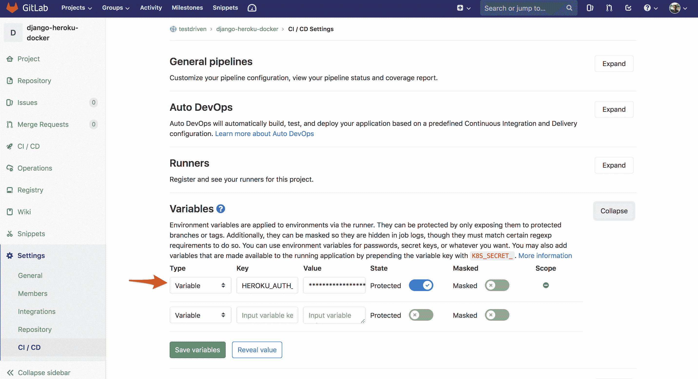

# 与 Docker 一起将 Django 部署到 Heroku

> 原文：<https://testdriven.io/blog/deploying-django-to-heroku-with-docker/>

本文着眼于如何通过 Heroku 容器运行时使用 Docker 将 Django 应用程序部署到 Heroku。

## 目标

本教程结束时，您将能够:

1.  解释为什么你可能想使用 Heroku 的容器运行时来运行一个应用程序
2.  Dockerize 一个 Django 应用
3.  在 Heroku 上的 Docker 容器中部署并运行 Django 应用程序
4.  配置 GitLab CI 以将 Docker 映像部署到 Heroku
5.  使用 WhiteNoise 管理静态资产
6.  配置 Postgres 在 Heroku 上运行
7.  创建使用多级 Docker 版本的生产 Docker 文件
8.  使用 Heroku 容器注册表并构建清单，以便将 Docker 部署到 Heroku

## Heroku 容器运行时

除了传统的 [Git plus slug 编译器部署](https://devcenter.heroku.com/categories/deploying-with-git) ( `git push heroku master`)，Heroku 还通过 Heroku 容器运行时支持[基于 Docker 的部署](https://devcenter.heroku.com/categories/deploying-with-docker)。

> 容器运行时是管理和运行容器的程序。如果您想更深入地了解容器运行时，请查看[低级 Linux 容器运行时的历史](https://opensource.com/article/18/1/history-low-level-container-runtimes)。

### 基于 Docker 的部署

与传统方法相比，基于 Docker 的部署有许多优势:

1.  **没有内存块限制** : Heroku 允许传统的基于 Git 的部署使用[最大 500MB](https://devcenter.heroku.com/articles/slug-compiler#slug-size) 的内存块大小。另一方面，基于 Docker 的部署没有这个限制。
2.  对操作系统的完全控制:你可以完全控制操作系统，并且可以用 Docker 安装任何你想安装的软件包，而不是被 Heroku [buildpacks](https://devcenter.heroku.com/articles/stack-packages) 安装的软件包所限制。
3.  更强的开发/生产对等性:基于 Docker 的构建在开发和生产之间具有更强的对等性，因为底层环境是相同的。
4.  **更少的供应商锁定**:最后，Docker 让用户更容易切换到不同的云托管提供商，如 AWS 或 GCP。

一般来说，基于 Docker 的部署为您提供了更大的灵活性和对部署环境的控制。您可以在所需的环境中部署所需的应用程序。也就是说，你现在负责安全更新。对于传统的基于 Git 的部署，Heroku 负责这一点。他们将相关的安全更新应用到他们的[堆栈](https://devcenter.heroku.com/articles/stack)中，并根据需要将您的应用迁移到新的堆栈中。请记住这一点。

目前有两种方式将 Docker 的应用部署到 Heroku:

1.  [容器注册表](https://devcenter.heroku.com/articles/container-registry-and-runtime):将预构建的 Docker 映像部署到 Heroku
2.  构建清单:给定一个 Docker 文件，Heroku 构建并部署 Docker 映像

这两者之间的主要区别在于，使用后一种方法——例如，通过构建清单——您可以访问[管道](https://devcenter.heroku.com/articles/pipelines)、[评审](https://devcenter.heroku.com/articles/github-integration-review-apps)和[发布](https://devcenter.heroku.com/articles/release-phase)特性。因此，如果你正在将一个应用从基于 Git 的部署转换到 Docker，并且正在使用这些特性，那么你应该使用构建清单的方法。

请放心，我们将在本文中研究这两种方法。

在这两种情况下，你仍然可以访问 Heroku [CLI](https://devcenter.heroku.com/articles/heroku-cli) ，所有强大的[插件](https://elements.heroku.com/addons)，以及[仪表盘](https://devcenter.heroku.com/articles/heroku-dashboard)。换句话说，所有这些特性都与容器运行时一起工作。

| 部署类型 | 部署机制 | 安全更新(谁负责) | 进入管道，审查，放行 | 访问 CLI、插件和仪表板 | 段塞尺寸限制 |
| --- | --- | --- | --- | --- | --- |
| Git + Slug 编译器 | Git Push | Heroku | 是 | 是 | 是 |
| Docker +容器运行时 | 码头推送 | 你们 | 不 | 是 | 不 |
| Docker +构建清单 | Git Push | 你们 | 是 | 是 | 不 |

请记住，基于 Docker 的部署受到与基于 Git 的部署相同的限制。例如，不支持持久卷，因为文件系统是短暂的，而 web 进程仅支持 HTTP(S)请求。有关这方面的更多信息，请查看 [Dockerfile 命令和运行时](https://devcenter.heroku.com/articles/container-registry-and-runtime#dockerfile-commands-and-runtime)。

### 坞站与 Heroku 概念

| 码头工人 | Heroku |
| --- | --- |
| Dockerfile | 构建包 |
| 图像 | 鼻涕虫 |
| 容器 | 绝妙的 |

## 项目设置

创建一个项目目录，创建并激活一个新的虚拟环境，并安装 Django:

```py
`$ mkdir django-heroku-docker
$ cd django-heroku-docker

$ python3.10 -m venv env
$ source env/bin/activate

(env)$ pip install django==3.2.9` 
```

> 你可以随意把 virtualenv 和 Pip 换成诗歌[或](https://python-poetry.org) [Pipenv](https://github.com/pypa/pipenv) 。更多信息，请查看[现代 Python 环境](/blog/python-environments/)。

接下来，创建一个新的 Django 项目，应用迁移，并运行服务器:

```py
`(env)$ django-admin startproject hello_django .
(env)$ python manage.py migrate
(env)$ python manage.py runserver` 
```

导航到 [http://localhost:8000/](http://localhost:8000/) 查看 Django 欢迎屏幕。完成后，关闭服务器并退出虚拟环境。

## 码头工人

将 Dockerfile 文件添加到项目根目录:

```py
`# pull official base image
FROM  python:3.10-alpine

# set work directory
WORKDIR  /app

# set environment variables
ENV  PYTHONDONTWRITEBYTECODE 1
ENV  PYTHONUNBUFFERED 1
ENV  DEBUG 0

# install psycopg2
RUN  apk update \
    && apk add --virtual build-essential gcc python3-dev musl-dev \
    && apk add postgresql-dev \
    && pip install psycopg2

# install dependencies
COPY  ./requirements.txt .
RUN  pip install -r requirements.txt

# copy project
COPY  . .

# add and run as non-root user
RUN  adduser -D myuser
USER  myuser

# run gunicorn
CMD  gunicorn hello_django.wsgi:application --bind 0.0.0.0:$PORT` 
```

这里，我们从 Python 3.10 的一个基于 Alpine 的 [Docker 镜像](https://hub.docker.com/_/python/)开始。然后，我们设置一个工作目录和两个环境变量:

1.  `PYTHONDONTWRITEBYTECODE`:防止 Python 将 pyc 文件写入光盘
2.  `PYTHONUNBUFFERED`:防止 Python 缓冲 stdout 和 stderr

接下来，我们安装了系统级的依赖项和 Python 包，复制了项目文件，创建并切换到非根用户(这是 Heroku 推荐的[，并使用](https://devcenter.heroku.com/articles/container-registry-and-runtime#run-the-image-as-a-non-root-user) [CMD](https://docs.docker.com/engine/reference/builder/#cmd) 在容器运行时加速时运行 [Gunicorn](https://gunicorn.org/) 。注意`$PORT`变量。本质上，任何在容器运行时上运行的 web 服务器都必须在`$PORT`环境变量中监听 HTTP 流量，该变量由 [Heroku 在运行时](https://help.heroku.com/PPBPA231/how-do-i-use-the-port-environment-variable-in-container-based-apps)设置。

创建一个 *requirements.txt* 文件:

```py
`Django==3.2.9
gunicorn==20.1.0` 
```

然后加一个*。dockerignore* 文件:

```py
`__pycache__
*.pyc
env/
db.sqlite3` 
```

更新 *settings.py* 中的`SECRET_KEY`、`DEBUG`和`ALLOWED_HOSTS`变量:

```py
`SECRET_KEY = os.environ.get('SECRET_KEY', default='foo')

DEBUG = int(os.environ.get('DEBUG', default=0))

ALLOWED_HOSTS = ['localhost', '127.0.0.1']` 
```

不要忘记重要的一点:

要进行本地测试，构建映像并运行容器，确保传入适当的环境变量:

```py
`$ docker build -t web:latest .
$ docker run -d --name django-heroku -e "PORT=8765" -e "DEBUG=1" -p 8007:8765 web:latest` 
```

确保应用程序正在浏览器中的 [http://localhost:8007/](http://localhost:8007/) 上运行。完成后，停止并移除正在运行的容器:

```py
`$ docker stop django-heroku
$ docker rm django-heroku` 
```

添加 a *。git ignore〔t1〕:*

```py
`__pycache__
*.pyc
env/
db.sqlite3` 
```

接下来，让我们创建一个快速 Django 视图，以便在调试模式关闭时轻松测试应用程序。

在“hello_django”目录中添加一个 *views.py* 文件:

```py
`from django.http import JsonResponse

def ping(request):
    data = {'ping': 'pong!'}
    return JsonResponse(data)` 
```

接下来，更新 *urls.py* :

```py
`from django.contrib import admin
from django.urls import path

from .views import ping

urlpatterns = [
    path('admin/', admin.site.urls),
    path('ping/', ping, name="ping"),
]` 
```

在调试模式关闭的情况下再次测试:

```py
`$ docker build -t web:latest .
$ docker run -d --name django-heroku -e "PORT=8765" -e "DEBUG=0" -p 8007:8765 web:latest` 
```

验证[http://localhost:8007/ping/](http://localhost:8007/ping/)是否按预期工作:

完成后，停止并移除正在运行的容器:

```py
`$ docker stop django-heroku
$ docker rm django-heroku` 
```

## 白噪声

如果您想使用[whiten noise](http://whitenoise.evans.io)来管理您的静态资产，首先将该包添加到 *requirements.txt* 文件中:

```py
`Django==3.2.9
gunicorn==20.1.0
whitenoise==5.3.0` 
```

像这样更新 *settings.py* 中的中间件:

```py
`MIDDLEWARE = [
    'django.middleware.security.SecurityMiddleware',
    'whitenoise.middleware.WhiteNoiseMiddleware',  # new
    'django.contrib.sessions.middleware.SessionMiddleware',
    'django.middleware.common.CommonMiddleware',
    'django.middleware.csrf.CsrfViewMiddleware',
    'django.contrib.auth.middleware.AuthenticationMiddleware',
    'django.contrib.messages.middleware.MessageMiddleware',
    'django.middleware.clickjacking.XFrameOptionsMiddleware',
]` 
```

然后用`STATIC_ROOT`配置静态文件的处理:

```py
`STATIC_ROOT = BASE_DIR / 'staticfiles'` 
```

最后，添加压缩和缓存支持:

```py
`STATICFILES_STORAGE = 'whitenoise.storage.CompressedManifestStaticFilesStorage'` 
```

将`collectstatic`命令添加到 Dockerfile 文件:

```py
`# pull official base image
FROM  python:3.10-alpine

# set work directory
WORKDIR  /app

# set environment variables
ENV  PYTHONDONTWRITEBYTECODE 1
ENV  PYTHONUNBUFFERED 1
ENV  DEBUG 0

# install psycopg2
RUN  apk update \
    && apk add --virtual build-essential gcc python3-dev musl-dev \
    && apk add postgresql-dev \
    && pip install psycopg2

# install dependencies
COPY  ./requirements.txt .
RUN  pip install -r requirements.txt

# copy project
COPY  . .

# collect static files
RUN  python manage.py collectstatic --noinput

# add and run as non-root user
RUN  adduser -D myuser
USER  myuser

# run gunicorn
CMD  gunicorn hello_django.wsgi:application --bind 0.0.0.0:$PORT` 
```

要进行测试，构建新的映像并旋转新的容器:

```py
`$ docker build -t web:latest .
$ docker run -d --name django-heroku -e "PORT=8765" -e "DEBUG=1" -p 8007:8765 web:latest` 
```

运行以下命令时，您应该能够查看静态文件:

```py
`$ docker exec django-heroku ls /app/staticfiles
$ docker exec django-heroku ls /app/staticfiles/admin` 
```

停止，然后再次移除运行中的容器:

```py
`$ docker stop django-heroku
$ docker rm django-heroku` 
```

## Postgres

为了启动并运行 Postgres，我们将使用 [dj_database_url](https://pypi.org/project/dj-database-url/) 包，根据`DATABASE_URL`环境变量为 Django 设置生成适当的数据库配置字典。

将依赖项添加到需求文件中:

```py
`Django==3.2.9
dj-database-url==0.5.0
gunicorn==20.1.0
whitenoise==5.3.0` 
```

然后，如果`DATABASE_URL`存在，对设置进行以下更改以更新数据库配置:

```py
`DATABASES = {
    'default': {
        'ENGINE': 'django.db.backends.sqlite3',
        'NAME': BASE_DIR / 'db.sqlite3',
    }
}

DATABASE_URL = os.environ.get('DATABASE_URL')
db_from_env = dj_database_url.config(default=DATABASE_URL, conn_max_age=500, ssl_require=True)
DATABASES['default'].update(db_from_env)` 
```

因此，如果`DATABASE_URL`不存在，仍然会使用 SQLite。

将导入也添加到顶部:

我们将在 Heroku 上建立一个 Postgres 数据库后对此进行测试。

## Heroku 设置

注册 Heroku 账号(如果你还没有)，然后安装 [Heroku CLI](https://devcenter.heroku.com/articles/heroku-cli) (如果你还没有)。

创建新应用程序:

```py
`$ heroku create
Creating app... done, ⬢ limitless-atoll-51647
https://limitless-atoll-51647.herokuapp.com/ | https://git.heroku.com/limitless-atoll-51647.git` 
```

添加`SECRET_KEY`环境变量:

```py
`$ heroku config:set SECRET_KEY=SOME_SECRET_VALUE -a limitless-atoll-51647` 
```

> 将`SOME_SECRET_VALUE`改为至少 50 个字符的随机生成的字符串。

将上述 Heroku 网址添加到 *hello_django/settings.py* 中的`ALLOWED_HOSTS`列表中，如下所示:

```py
`ALLOWED_HOSTS = ['localhost', '127.0.0.1', 'limitless-atoll-51647.herokuapp.com']` 
```

> 确保将上述每个命令中的`limitless-atoll-51647`替换为您的应用程序名称。

## Heroku Docker 部署

此时，我们已经准备好开始将 Docker 映像部署到 Heroku。你决定要采取哪种方法了吗？

1.  [容器注册表](https://devcenter.heroku.com/articles/container-registry-and-runtime):将预构建的 Docker 映像部署到 Heroku
2.  构建清单:给定一个 Docker 文件，Heroku 构建并部署 Docker 映像

不确定？两个都试试！

### 方法 1:容器注册

> 如果您使用构建清单方法，请跳过这一节。

同样，使用这种方法，您可以将预构建的 Docker 映像部署到 Heroku。

登录到 [Heroku 容器注册表](https://devcenter.heroku.com/articles/container-registry-and-runtime)，向 Heroku 表明我们想要使用容器运行时:

重新构建 Docker 映像，并用以下格式对其进行标记:

```py
`registry.heroku.com/<app>/<process-type>` 
```

确保将`<app>`替换为您刚刚创建的 Heroku 应用程序的名称，将`<process-type>`替换为`web`，因为这将用于 [web 流程](https://devcenter.heroku.com/articles/procfile#the-web-process-type)。

例如:

```py
`$ docker build -t registry.heroku.com/limitless-atoll-51647/web .` 
```

将图像推送到注册表:

```py
`$ docker push registry.heroku.com/limitless-atoll-51647/web` 
```

发布图像:

```py
`$ heroku container:release -a limitless-atoll-51647 web` 
```

这将运行容器。您应该可以在[https://APP _ name . heroku APP . com](https://APP_NAME.herokuapp.com)查看应用程序。它应该会返回 404。

> 尝试运行`heroku open -a limitless-atoll-51647`在默认浏览器中打开应用程序。

验证[https://APP _ name . heroku APP . com/ping](https://APP_NAME.herokuapp.com/ping)是否工作正常:

您还应该能够查看静态文件:

```py
`$ heroku run ls /app/staticfiles -a limitless-atoll-51647
$ heroku run ls /app/staticfiles/admin -a limitless-atoll-51647` 
```

> 确保将上述每个命令中的`limitless-atoll-51647`替换为您的应用程序名称。

完成后，跳到“Postgres 测试”部分。

### 方法 2:构建清单

> 如果您正在使用容器注册方法，请跳过这一节。

同样，使用[构建清单](https://devcenter.heroku.com/articles/build-docker-images-heroku-yml)方法，您可以让 Heroku 基于 *heroku.yml* 清单文件构建和部署 Docker 映像。

将应用程序的[堆栈](https://devcenter.heroku.com/articles/stack)设置为容器:

```py
`$ heroku stack:set container -a limitless-atoll-51647` 
```

将一个 *heroku.yml* 文件添加到项目根目录:

```py
`build: docker: web:  Dockerfile` 
```

在这里，我们只是告诉 Heroku 使用哪个 Dockerfile 来构建图像。

除了`build`，您还可以定义以下阶段:

*   `setup`用于定义 Heroku 插件和配置变量，以便在应用供应期间创建。
*   `release`用于定义您希望在发布期间执行的任务。
*   `run`用于定义为 web 和 worker 进程运行哪些命令。

请务必查看 Heroku 文档以了解关于这四个阶段的更多信息。

> 值得注意的是，`gunicorn hello_django.wsgi:application --bind 0.0.0.0:$PORT`命令可以从 docker 文件中删除，并添加到`run`阶段下的 *heroku.yml* 文件中:
> 
> ```py
> `build:
>   docker:
>     web: Dockerfile
> run:
>   web: gunicorn hello_django.wsgi:application --bind 0.0.0.0:$PORT` 
> ```

> 另外，一定要将“collectstatic”命令放在 docker 文件中。不要移到`release`阶段。关于这方面的更多信息，请查看[这个堆栈溢出问题](https://stackoverflow.com/questions/59719175/where-to-run-collectstatic-when-deploying-django-app-to-heroku-using-docker)。

接下来，从 beta CLI 通道安装`heroku-manifest`插件:

```py
`$ heroku update beta
$ heroku plugins:install @heroku-cli/plugin-manifest` 
```

这样，初始化一个 Git repo 并创建一个提交。

然后，添加 Heroku 遥控器:

```py
`$ heroku git:remote -a limitless-atoll-51647` 
```

将代码推送到 Heroku 以构建映像并运行容器:

您应该可以在[https://APP _ name . heroku APP . com](https://APP_NAME.herokuapp.com)查看应用程序。它应该会返回 404。

> 尝试运行`heroku open -a limitless-atoll-51647`在默认浏览器中打开应用程序。

验证[https://APP _ name . heroku APP . com/ping](https://APP_NAME.herokuapp.com/ping)是否工作正常:

您还应该能够查看静态文件:

```py
`$ heroku run ls /app/staticfiles -a limitless-atoll-51647
$ heroku run ls /app/staticfiles/admin -a limitless-atoll-51647` 
```

> 确保将上述每个命令中的`limitless-atoll-51647`替换为您的应用程序名称。

### Postgres 测验

创建数据库:

```py
`$ heroku addons:create heroku-postgresql:hobby-dev -a limitless-atoll-51647` 
```

> 该命令自动为容器设置`DATABASE_URL`环境变量。

数据库启动后，运行迁移:

```py
`$ heroku run python manage.py makemigrations -a limitless-atoll-51647
$ heroku run python manage.py migrate -a limitless-atoll-51647` 
```

然后，跳转到 psql 来查看新创建的表:

```py
`$ heroku pg:psql -a limitless-atoll-51647

# \dt
                      List of relations
 Schema |            Name            | Type  |     Owner
--------+----------------------------+-------+----------------
 public | auth_group                 | table | siodzhzzcvnwwp
 public | auth_group_permissions     | table | siodzhzzcvnwwp
 public | auth_permission            | table | siodzhzzcvnwwp
 public | auth_user                  | table | siodzhzzcvnwwp
 public | auth_user_groups           | table | siodzhzzcvnwwp
 public | auth_user_user_permissions | table | siodzhzzcvnwwp
 public | django_admin_log           | table | siodzhzzcvnwwp
 public | django_content_type        | table | siodzhzzcvnwwp
 public | django_migrations          | table | siodzhzzcvnwwp
 public | django_session             | table | siodzhzzcvnwwp
(10 rows)

# \q` 
```

> 同样，确保将上述每个命令中的`limitless-atoll-51647`替换为 Heroku 应用的名称。

## GitLab CI

[注册](https://gitlab.com/users/sign_up)一个 GitLab 账号(如果需要的话)，然后[创建一个新项目](https://docs.gitlab.com/ee/user/project/working_with_projects.html#create-a-project)(再次，如果需要的话)。

取回您的 [Heroku 认证令牌](https://devcenter.heroku.com/articles/authentication):

然后，在项目的 CI/CD 设置中将令牌保存为一个名为`HEROKU_AUTH_TOKEN`的新变量:Settings > CI / CD > Variables。



接下来，我们需要添加一个名为*的 GitLab CI/CD 配置文件。gitlab-ci.yml* 到项目根。该文件的内容将根据所使用的方法而有所不同。

### 方法 1:容器注册

> 如果您使用构建清单方法，请跳过这一节。

*。gitlab-ci.yml* :

```py
`image:  docker:stable services: -  docker:dind variables: DOCKER_DRIVER:  overlay2 HEROKU_APP_NAME:  <APP_NAME> HEROKU_REGISTRY_IMAGE:  registry.heroku.com/${HEROKU_APP_NAME}/web stages: -  build_and_deploy build_and_deploy: stage:  build_and_deploy script: -  apk add --no-cache curl -  docker login -u _ -p $HEROKU_AUTH_TOKEN registry.heroku.com -  docker pull $HEROKU_REGISTRY_IMAGE || true -  docker build --cache-from $HEROKU_REGISTRY_IMAGE --tag $HEROKU_REGISTRY_IMAGE --file ./Dockerfile "." -  docker push $HEROKU_REGISTRY_IMAGE -  chmod +x ./release.sh -  ./release.sh` 
```

*release.sh* :

```py
`#!/bin/sh

IMAGE_ID=$(docker inspect ${HEROKU_REGISTRY_IMAGE} --format={{.Id}})
PAYLOAD='{"updates": [{"type": "web", "docker_image": "'"$IMAGE_ID"'"}]}'

curl -n -X PATCH https://api.heroku.com/apps/$HEROKU_APP_NAME/formation \
  -d "${PAYLOAD}" \
  -H "Content-Type: application/json" \
  -H "Accept: application/vnd.heroku+json; version=3.docker-releases" \
  -H "Authorization: Bearer ${HEROKU_AUTH_TOKEN}"` 
```

在这里，我们定义了单个`build_and_deploy` [阶段](https://docs.gitlab.com/ee/ci/yaml/#stages)，在这里我们:

1.  安装卷曲
2.  登录 Heroku 容器注册表
3.  提取之前推送的图像(如果存在)
4.  构建并标记新图像
5.  将图像上传到注册表
6.  使用 *release.sh* 脚本中的映像 ID，通过 [Heroku API](https://devcenter.heroku.com/articles/container-registry-and-runtime#api) 创建一个新版本

> 确保将`<APP_NAME>`替换为 Heroku 应用的名称。

这样，初始化 Git repo，提交，添加 GitLab remote，将您的代码推送到 GitLab 以触发新的[管道](https://docs.gitlab.com/ee/ci/pipelines/)。这将作为单个作业运行`build_and_deploy`阶段。一旦完成，Heroku 上将自动创建一个新版本。

### 方法 2:构建清单

> 如果您正在使用容器注册方法，请跳过这一节。

*。gitlab-ci.yml* :

```py
`variables: HEROKU_APP_NAME:  <APP_NAME> stages: -  deploy deploy: stage:  deploy script: -  apt-get update -qy -  apt-get install -y ruby-dev -  gem install dpl -  dpl --provider=heroku --app=$HEROKU_APP_NAME --api-key=$HEROKU_AUTH_TOKEN` 
```

在这里，我们定义了单个`deploy` [阶段](https://docs.gitlab.com/ee/ci/yaml/#stages)，在这里我们:

1.  安装 Ruby 和一个名为 [dpl](https://github.com/travis-ci/dpl) 的 gem
2.  用 dpl 将代码部署到 Heroku

> 确保将`<APP_NAME>`替换为 Heroku 应用的名称。

提交，添加 GitLab remote，并将您的代码推送到 GitLab，以触发新的[管道](https://docs.gitlab.com/ee/ci/pipelines/)。这将作为单个作业运行`deploy`阶段。一旦完成，代码应该被部署到 Heroku。

## 高级 CI

除了构建 Docker 映像和在 GitLab CI 上创建一个版本，我们还可以运行 Django 测试、 [Flake8](http://flake8.pycqa.org) 、 [Black](https://black.readthedocs.io) 和 [isort](https://github.com/timothycrosley/isort) 。

同样，这将取决于您使用的方法。

### 方法 1:容器注册

> 如果您使用构建清单方法，请跳过这一节。

更新*。gitlab-ci.yml* 像这样:

```py
`stages: -  build -  test -  deploy variables: IMAGE:  ${CI_REGISTRY}/${CI_PROJECT_NAMESPACE}/${CI_PROJECT_NAME} build: stage:  build image:  docker:stable services: -  docker:dind variables: DOCKER_DRIVER:  overlay2 script: -  docker login -u $CI_REGISTRY_USER -p $CI_JOB_TOKEN $CI_REGISTRY -  docker pull $IMAGE:latest || true -  docker build --cache-from $IMAGE:latest --tag $IMAGE:latest --file ./Dockerfile "." -  docker push $IMAGE:latest test: stage:  test image:  $IMAGE:latest services: -  postgres:latest variables: POSTGRES_DB:  test POSTGRES_USER:  runner POSTGRES_PASSWORD:  "" DATABASE_URL:  postgresql://[[email protected]](/cdn-cgi/l/email-protection):5432/test script: -  python manage.py test -  flake8 hello_django --max-line-length=100 -  black hello_django --check -  isort hello_django --check --profile black deploy: stage:  deploy image:  docker:stable services: -  docker:dind variables: DOCKER_DRIVER:  overlay2 HEROKU_APP_NAME:  <APP_NAME> HEROKU_REGISTRY_IMAGE:  registry.heroku.com/${HEROKU_APP_NAME}/web script: -  apk add --no-cache curl -  docker login -u _ -p $HEROKU_AUTH_TOKEN registry.heroku.com -  docker pull $HEROKU_REGISTRY_IMAGE || true -  docker build --cache-from $HEROKU_REGISTRY_IMAGE --tag $HEROKU_REGISTRY_IMAGE --file ./Dockerfile "." -  docker push $HEROKU_REGISTRY_IMAGE -  chmod +x ./release.sh -  ./release.sh` 
```

> 确保将`<APP_NAME>`替换为 Heroku 应用的名称。

所以，我们现在有三个阶段:`build`、`test`和`deploy`。

在`build`阶段，我们:

1.  登录到 [GitLab 容器注册表](https://docs.gitlab.com/ee/user/packages/container_registry/)
2.  提取之前推送的图像(如果存在)
3.  构建并标记新图像
4.  将图像上传到 GitLab 容器注册表

然后，在`test`阶段，我们配置 [Postgres](https://docs.gitlab.com/ee/ci/services/postgres.html) ，设置`DATABASE_URL`环境变量，然后使用前一阶段构建的映像运行 Django 测试、Flake8、Black 和 isort。

在`deploy`阶段，我们:

1.  安装卷曲
2.  登录 Heroku 容器注册表
3.  提取之前推送的图像(如果存在)
4.  构建并标记新图像
5.  将图像上传到注册表
6.  使用 *release.sh* 脚本中的映像 ID，通过 [Heroku API](https://devcenter.heroku.com/articles/container-registry-and-runtime#api) 创建一个新版本

将新的依赖项添加到需求文件中:

```py
`# prod
Django==3.2.9
dj-database-url==0.5.0
gunicorn==20.1.0
whitenoise==5.3.0

# dev and test
black==21.11b1
flake8==4.0.1
isort==5.10.1` 
```

在推进到 GitLab 之前，在本地运行 Django 测试:

```py
`$ source env/bin/activate
(env)$ pip install -r requirements.txt
(env)$ python manage.py test

System check identified no issues (0 silenced).

----------------------------------------------------------------------
Ran 0 tests in 0.000s

OK` 
```

确保 Flake8 通过，然后根据 Black 和 isort 的建议更新源代码:

```py
`(env)$ flake8 hello_django --max-line-length=100
(env)$ black hello_django
(env)$ isort hello_django --profile black` 
```

再次提交和推送代码。确保所有阶段都通过。

### 方法 2:构建清单

> 如果您正在使用容器注册方法，请跳过这一节。

更新*。gitlab-ci.yml* 像这样:

```py
`stages: -  build -  test -  deploy variables: IMAGE:  ${CI_REGISTRY}/${CI_PROJECT_NAMESPACE}/${CI_PROJECT_NAME} build: stage:  build image:  docker:stable services: -  docker:dind variables: DOCKER_DRIVER:  overlay2 script: -  docker login -u $CI_REGISTRY_USER -p $CI_JOB_TOKEN $CI_REGISTRY -  docker pull $IMAGE:latest || true -  docker build --cache-from $IMAGE:latest --tag $IMAGE:latest --file ./Dockerfile "." -  docker push $IMAGE:latest test: stage:  test image:  $IMAGE:latest services: -  postgres:latest variables: POSTGRES_DB:  test POSTGRES_USER:  runner POSTGRES_PASSWORD:  "" DATABASE_URL:  postgresql://[[email protected]](/cdn-cgi/l/email-protection):5432/test script: -  python manage.py test -  flake8 hello_django --max-line-length=100 -  black hello_django --check -  isort hello_django --check --profile black deploy: stage:  deploy variables: HEROKU_APP_NAME:  <APP_NAME> script: -  apt-get update -qy -  apt-get install -y ruby-dev -  gem install dpl -  dpl --provider=heroku --app=$HEROKU_APP_NAME --api-key=$HEROKU_AUTH_TOKEN` 
```

> 确保将`<APP_NAME>`替换为 Heroku 应用的名称。

所以，我们现在有三个阶段:`build`、`test`和`deploy`。

在`build`阶段，我们:

1.  登录到 [GitLab 容器注册表](https://docs.gitlab.com/ee/user/packages/container_registry/)
2.  提取之前推送的图像(如果存在)
3.  构建并标记新图像
4.  将图像上传到 GitLab 容器注册表

然后，在`test`阶段，我们配置 [Postgres](https://docs.gitlab.com/ee/ci/services/postgres.html) ，设置`DATABASE_URL`环境变量，然后使用前一阶段构建的映像运行 Django 测试、Flake8、Black 和 isort。

在`deploy`阶段，我们:

1.  安装 Ruby 和一个名为 [dpl](https://github.com/travis-ci/dpl) 的 gem
2.  用 dpl 将代码部署到 Heroku

将新的依赖项添加到需求文件中:

```py
`# prod
Django==3.2.9
dj-database-url==0.5.0
gunicorn==20.1.0
whitenoise==5.3.0

# dev and test
black==21.11b1
flake8==4.0.1
isort==5.10.1` 
```

在推进到 GitLab 之前，在本地运行 Django 测试:

```py
`$ source env/bin/activate
(env)$ pip install -r requirements.txt
(env)$ python manage.py test

System check identified no issues (0 silenced).

----------------------------------------------------------------------
Ran 0 tests in 0.000s

OK` 
```

确保 Flake8 通过，然后根据 Black 和 isort 的建议更新源代码:

```py
`(env)$ flake8 hello_django --max-line-length=100
(env)$ black hello_django
(env)$ isort hello_django --profile black` 
```

再次提交和推送代码。确保所有阶段都通过。

## 多级码头建造

最后，像这样更新 Dockerfile 以使用[多阶段构建](https://docs.docker.com/develop/develop-images/multistage-build/)来减小最终的图像大小:

```py
`FROM  python:3.10-alpine  AS  build-python
RUN  apk update && apk add --virtual build-essential gcc python3-dev musl-dev postgresql-dev
RUN  python -m venv /opt/venv
ENV  PATH="/opt/venv/bin:$PATH"
COPY  ./requirements.txt .
RUN  pip install -r requirements.txt

FROM  python:3.10-alpine
ENV  PYTHONDONTWRITEBYTECODE 1
ENV  PYTHONUNBUFFERED 1
ENV  DEBUG 0
ENV  PATH="/opt/venv/bin:$PATH"
COPY  --from=build-python /opt/venv /opt/venv
RUN  apk update && apk add --virtual build-deps gcc python3-dev musl-dev postgresql-dev
RUN  pip install psycopg2-binary
WORKDIR  /app
COPY  . .
RUN  python manage.py collectstatic --noinput
RUN  adduser -D myuser
USER  myuser
CMD  gunicorn hello_django.wsgi:application --bind 0.0.0.0:$PORT` 
```

接下来，我们需要更新 GitLab 配置，以利用 Docker 层缓存。

### 方法 1:容器注册

> 如果您使用构建清单方法，请跳过这一节。

*。gitlab-ci.yml* :

```py
`stages: -  build -  test -  deploy variables: IMAGE:  ${CI_REGISTRY}/${CI_PROJECT_NAMESPACE}/${CI_PROJECT_NAME} HEROKU_APP_NAME:  <APP_NAME> HEROKU_REGISTRY_IMAGE:  registry.heroku.com/${HEROKU_APP_NAME}/web build: stage:  build image:  docker:stable services: -  docker:dind variables: DOCKER_DRIVER:  overlay2 script: -  docker login -u $CI_REGISTRY_USER -p $CI_JOB_TOKEN $CI_REGISTRY -  docker pull $IMAGE:build-python || true -  docker pull $IMAGE:production || true -  docker build --target build-python --cache-from $IMAGE:build-python --tag $IMAGE:build-python --file ./Dockerfile "." -  docker build --cache-from $IMAGE:production --tag $IMAGE:production --tag $HEROKU_REGISTRY_IMAGE --file ./Dockerfile "." -  docker push $IMAGE:build-python -  docker push $IMAGE:production test: stage:  test image:  $IMAGE:production services: -  postgres:latest variables: POSTGRES_DB:  test POSTGRES_USER:  runner POSTGRES_PASSWORD:  "" DATABASE_URL:  postgresql://[[email protected]](/cdn-cgi/l/email-protection):5432/test script: -  python manage.py test -  flake8 hello_django --max-line-length=100 -  black hello_django --check -  isort hello_django --check --profile black deploy: stage:  deploy image:  docker:stable services: -  docker:dind variables: DOCKER_DRIVER:  overlay2 script: -  apk add --no-cache curl -  docker login -u $CI_REGISTRY_USER -p $CI_JOB_TOKEN $CI_REGISTRY -  docker pull $IMAGE:build-python || true -  docker pull $IMAGE:production || true -  docker build --target build-python --cache-from $IMAGE:build-python --tag $IMAGE:build-python --file ./Dockerfile "." -  docker build --cache-from $IMAGE:production --tag $IMAGE:production --tag $HEROKU_REGISTRY_IMAGE --file ./Dockerfile "." -  docker push $IMAGE:build-python -  docker push $IMAGE:production -  docker login -u _ -p $HEROKU_AUTH_TOKEN registry.heroku.com -  docker push $HEROKU_REGISTRY_IMAGE -  chmod +x ./release.sh -  ./release.sh` 
```

> 确保将`<APP_NAME>`替换为 Heroku 应用的名称。

自己回顾一下变化。然后，最后一次测试它。

> 有关这种缓存模式的更多信息，请查看文章[使用 Docker 缓存加快 CI 构建速度](/blog/faster-ci-builds-with-docker-cache)中的“多阶段”部分。

### 方法 2:构建清单

> 如果您正在使用容器注册方法，请跳过这一节。

*。gitlab-ci.yml* :

```py
`stages: -  build -  test -  deploy variables: IMAGE:  ${CI_REGISTRY}/${CI_PROJECT_NAMESPACE}/${CI_PROJECT_NAME} HEROKU_APP_NAME:  <APP_NAME> build: stage:  build image:  docker:stable services: -  docker:dind variables: DOCKER_DRIVER:  overlay2 script: -  docker login -u $CI_REGISTRY_USER -p $CI_JOB_TOKEN $CI_REGISTRY -  docker pull $IMAGE:build-python || true -  docker pull $IMAGE:production || true -  docker build --target build-python --cache-from $IMAGE:build-python --tag $IMAGE:build-python --file ./Dockerfile "." -  docker build --cache-from $IMAGE:production --tag $IMAGE:production --file ./Dockerfile "." -  docker push $IMAGE:build-python -  docker push $IMAGE:production test: stage:  test image:  $IMAGE:production services: -  postgres:latest variables: POSTGRES_DB:  test POSTGRES_USER:  runner POSTGRES_PASSWORD:  "" DATABASE_URL:  postgresql://[[email protected]](/cdn-cgi/l/email-protection):5432/test script: -  python manage.py test -  flake8 hello_django --max-line-length=100 -  black hello_django --check -  isort hello_django --check --profile black deploy: stage:  deploy script: -  apt-get update -qy -  apt-get install -y ruby-dev -  gem install dpl -  dpl --provider=heroku --app=$HEROKU_APP_NAME --api-key=$HEROKU_AUTH_TOKEN` 
```

> 确保将`<APP_NAME>`替换为 Heroku 应用的名称。

自己回顾一下变化。然后，最后一次测试它。

> 有关这种缓存模式的更多信息，请查看文章[使用 Docker 缓存加快 CI 构建速度](/blog/faster-ci-builds-with-docker-cache)中的“多阶段”部分。

## 结论

在本文中，我们介绍了两种使用 Docker 将 Django 应用程序部署到 Heroku 的方法——容器注册和构建清单。

那么，什么时候应该考虑使用 Heroku 容器运行时而不是传统的 Git 和 slug 编译器来进行部署呢？

当您需要对生产部署环境进行更多控制时。

示例:

1.  您的应用程序和依赖项超过了 500MB 的最大 slug 限制。
2.  您的应用程序需要常规 Heroku 构建包没有安装的包。
3.  您希望更好地保证您的应用程序在开发中的行为与在生产中的行为相同。
4.  你真的真的很喜欢和 Docker 一起工作。

--

您可以在 GitLab 的以下存储库中找到代码:

1.  集装箱登记方法- [django-heroku-docker](https://gitlab.com/testdriven/django-heroku-docker)
2.  构建清单 Aproach-[django-heroku-docker-build-Manifest](https://gitlab.com/testdriven/django-heroku-docker-build-manifest)

最好！