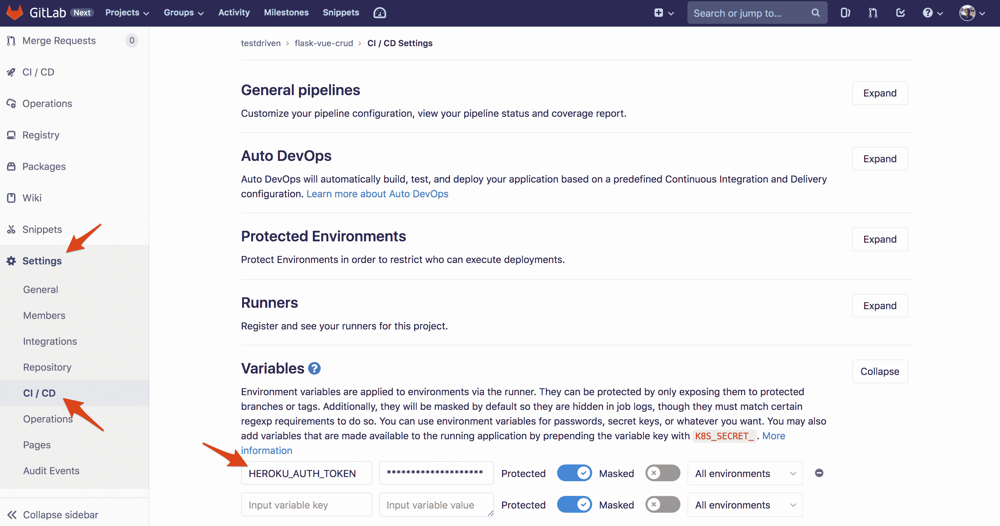

# 使用 Docker 和 Gitlab CI 将 Flask 和 Vue 应用程序部署到 Heroku

> 原文：<https://testdriven.io/blog/deploying-flask-to-heroku-with-docker-and-gitlab/>

这篇文章着眼于如何封装一个由 Flask 和 Vue 支持的全栈 web 应用，并使用 Gitlab CI 将其部署到 Heroku。

> 这是一个中级教程。它假设你有 Vue、Flask 和 Docker 的基本工作知识。查看以下资源以了解更多信息:
> 
> 1.  Flask:Flask、测试驱动开发(TDD)和 JavaScript 简介
> 2.  [用 Flask 和 Vue.js 开发单页应用](/developing-a-single-page-app-with-flask-and-vuejs)
> 3.  [通过构建和部署 CRUD 应用程序学习 Vue](/courses/learn-vue/)
> 4.  [Docker 入门](https://docs.docker.com/engine/getstarted/)

## 目标

本教程结束时，您将能够:

1.  使用多级构建，用单个 Dockerfile 将烧瓶和 Vue 容器化
2.  使用 Docker 将应用程序部署到 Heroku
3.  配置 GitLab CI 以将 Docker 映像部署到 Heroku

## 项目设置

如果你想继续，从 GitHub 克隆出 [flask-vue-crud](https://github.com/testdrivenio/flask-vue-crud) repo，创建并激活一个虚拟环境，然后启动 flask 应用程序:

```py
`$ git clone https://github.com/testdrivenio/flask-vue-crud
$ cd flask-vue-crud
$ cd server
$ python3.9 -m venv env
$ source env/bin/activate
(env)$

(env)$ pip install -r requirements.txt
(env)$ python app.py` 
```

> 上述用于创建和激活虚拟环境的命令可能会因您的环境和操作系统而异。

将您选择的浏览器指向[http://localhost:5000/ping](http://localhost:5000/ping)。您应该看到:

然后，安装依赖项并在不同的终端选项卡中运行 Vue 应用程序:

```py
`$ cd client
$ npm install
$ npm run serve` 
```

导航到 [http://localhost:8080](http://localhost:8080) 。确保基本的 CRUD 功能按预期工作，然后关闭两个应用程序:


> 想学习如何构建这个项目吗？查看[用 Flask 和 Vue.js 开发单页应用](/developing-a-single-page-app-with-flask-and-vuejs)的博文。

## 码头工人

先说 Docker。

将以下 Dockerfile 文件添加到项目根目录。

```py
`# build
FROM  node:15.7.0-alpine3.10  as  build-vue
WORKDIR  /app
ENV  PATH /app/node_modules/.bin:$PATH
COPY  ./client/package*.json ./
RUN  npm install
COPY  ./client .
RUN  npm run build

# production
FROM  nginx:stable-alpine  as  production
WORKDIR  /app
RUN  apk update && apk add --no-cache python3 && \
    python3 -m ensurepip && \
    rm -r /usr/lib/python*/ensurepip && \
    pip3 install --upgrade pip setuptools && \
    if [ ! -e /usr/bin/pip ]; then ln -s pip3 /usr/bin/pip ; fi && \
    if [[ ! -e /usr/bin/python ]]; then ln -sf /usr/bin/python3 /usr/bin/python; fi && \
    rm -r /root/.cache
RUN  apk update && apk add postgresql-dev gcc python3-dev musl-dev
COPY  --from=build-vue /app/dist /usr/share/nginx/html
COPY  ./nginx/default.conf /etc/nginx/conf.d/default.conf
COPY  ./server/requirements.txt .
RUN  pip install -r requirements.txt
RUN  pip install gunicorn
COPY  ./server .
CMD  gunicorn -b 0.0.0.0:5000 app:app --daemon && \
      sed -i -e 's/$PORT/'"$PORT"'/g' /etc/nginx/conf.d/default.conf && \
      nginx -g 'daemon off;'` 
```

这里发生了什么事？

1.  我们使用了[多阶段构建](https://docs.docker.com/develop/develop-images/multistage-build/)来缩小最终的图像尺寸。本质上，`build-vue`是一个临时映像，用于生成 Vue 应用程序的生产版本。然后，生产静态文件被复制到`production`映像，而`build-vue`映像被丢弃。
2.  `production`镜像通过安装 Python，从`build-vue`镜像复制静态文件，复制我们的 nginx 配置，安装需求，运行 [Gunicorn](https://gunicorn.org/) 和 [Nginx](https://www.nginx.com) 来扩展 [nginx:stable-alpine](https://hub.docker.com/_/nginx/) 镜像。
3.  记下`sed -i -e 's/$PORT/'"$PORT"'/g' /etc/nginx/conf.d/default.conf`命令。这里，我们用 Heroku 提供的环境变量`PORT` [替换`default.conf`文件中的`$PORT`。](https://devcenter.heroku.com/articles/dynos#web-dynos)

接下来，向项目根目录添加一个名为“nginx”的新文件夹，然后向该文件夹添加一个名为 *default.conf* 的新配置文件:

```py
`server  { listen  $PORT; root  /usr/share/nginx/html; index  index.html  index.html; location  /  { try_files  $uri  /index.html  =404; } location  /ping  { proxy_pass  http://127.0.0.1:5000; proxy_http_version  1.1; proxy_redirect  default; proxy_set_header  Upgrade  $http_upgrade; proxy_set_header  Connection  "upgrade"; proxy_set_header  Host  $host; proxy_set_header  X-Real-IP  $remote_addr; proxy_set_header  X-Forwarded-For  $proxy_add_x_forwarded_for; proxy_set_header  X-Forwarded-Host  $server_name; } location  /books  { proxy_pass  http://127.0.0.1:5000; proxy_http_version  1.1; proxy_redirect  default; proxy_set_header  Upgrade  $http_upgrade; proxy_set_header  Connection  "upgrade"; proxy_set_header  Host  $host; proxy_set_header  X-Real-IP  $remote_addr; proxy_set_header  X-Forwarded-For  $proxy_add_x_forwarded_for; proxy_set_header  X-Forwarded-Host  $server_name; } }` 
```

要进行本地测试，首先删除*client/src/components/books . vue*和*client/src/components/ping . vue*中的`http://localhost:5000`的所有实例。例如，`Books`组件中的`getBooks`方法现在应该是这样的:

```py
`getBooks()  { const  path  =  '/books'; axios.get(path) .then((res)  =>  { this.books  =  res.data.books; }) .catch((error)  =>  { // eslint-disable-next-line console.error(error); }); },` 
```

接下来，构建映像并在[分离模式](https://docs.docker.com/engine/reference/run/#detached--d)下运行容器:

```py
`$ docker build -t web:latest .
$ docker run -d --name flask-vue -e "PORT=8765" -p 8007:8765 web:latest` 
```

注意我们是如何传入一个名为`PORT`的环境变量的。如果一切顺利，那么我们应该在运行容器中的 *default.conf* 文件中看到这个变量:

```py
`$ docker exec flask-vue cat ../etc/nginx/conf.d/default.conf` 
```

确保 Nginx 正在监听端口 8765: `listen 8765;`。此外，确保该应用程序正在浏览器中的 [http://localhost:8007](http://localhost:8007) 上运行。完成后，停止并移除正在运行的容器:

```py
`$ docker stop flask-vue
$ docker rm flask-vue` 
```

## Heroku

注册一个 Heroku 账号(如果你还没有的话)，然后安装 [Heroku CLI](https://devcenter.heroku.com/articles/heroku-cli) (如果你还没有的话)。

创建新应用程序:

```py
`$ heroku create
Creating app... done, ⬢ lit-savannah-00898
https://lit-savannah-00898.herokuapp.com/ | https://git.heroku.com/lit-savannah-00898.git` 
```

登录到 [Heroku 容器注册表](https://devcenter.heroku.com/articles/container-registry-and-runtime):

重建图像，并使用以下格式对其进行标记:

```py
`registry.heroku.com/<app>/<process-type>` 
```

确保将`<app>`替换为您刚刚创建的 Heroku 应用的名称，将`<process-type>`替换为`web`，因为这将是一个 [web dyno](https://www.heroku.com/dynos) 。

例如:

```py
`$ docker build -t registry.heroku.com/lit-savannah-00898/web .` 
```

将图像推送到注册表:

```py
`$ docker push registry.heroku.com/lit-savannah-00898/web` 
```

发布图像:

```py
`$ heroku container:release --app lit-savannah-00898 web` 
```

> 确保将上述每个命令中的`lit-savannah-00898`替换为您的应用程序名称。

这将运行容器。您应该可以在[https://APP _ name . heroku APP . com](https://APP_NAME.herokuapp.com)查看应用程序。

## GitLab CI

[注册](https://gitlab.com/users/sign_up)一个 GitLab 账号(如果需要的话)，然后[创建一个新项目](https://docs.gitlab.com/ee/user/project/working_with_projects.html#create-a-project)(再次，如果需要的话)。

取回您的 [Heroku 认证令牌](https://devcenter.heroku.com/articles/authentication):

然后，在项目的 CI/CD 设置中将令牌保存为一个名为`HEROKU_AUTH_TOKEN`的新变量:Settings > CI / CD > Variables。



接下来，添加一个名为*的 GitLab CI/CD 配置文件。gitlab-ci.yml* 到项目根:

```py
`image:  docker:stable services: -  docker:dind variables: DOCKER_DRIVER:  overlay HEROKU_APP_NAME:  <APP_NAME> HEROKU_REGISTRY_IMAGE:  registry.heroku.com/${HEROKU_APP_NAME}/web stages: -  build docker-build: stage:  build script: -  apk add --no-cache curl -  docker build --tag $HEROKU_REGISTRY_IMAGE --file ./Dockerfile "." -  docker login -u _ -p $HEROKU_AUTH_TOKEN registry.heroku.com -  docker push $HEROKU_REGISTRY_IMAGE -  chmod +x ./release.sh -  ./release.sh` 
```

*release.sh* :

```py
`#!/bin/sh

IMAGE_ID=$(docker inspect ${HEROKU_REGISTRY_IMAGE} --format={{.Id}})
PAYLOAD='{"updates": [{"type": "web", "docker_image": "'"$IMAGE_ID"'"}]}'

curl -n -X PATCH https://api.heroku.com/apps/$HEROKU_APP_NAME/formation \
  -d "${PAYLOAD}" \
  -H "Content-Type: application/json" \
  -H "Accept: application/vnd.heroku+json; version=3.docker-releases" \
  -H "Authorization: Bearer ${HEROKU_AUTH_TOKEN}"` 
```

在这里，我们定义了单个`build` [阶段](https://docs.gitlab.com/ee/ci/yaml/#stages)，在这里我们:

1.  安装卷曲
2.  构建并标记新图像
3.  登录 Heroku 容器注册表
4.  将图像上传到注册表
5.  使用 *release.sh* 脚本中的映像 ID，通过 [Heroku API](https://devcenter.heroku.com/articles/container-registry-and-runtime#api) 创建一个新版本

> 确保将`<APP_NAME>`替换为 Heroku 应用的名称。

这样，提交并把你的修改推送到 GitLab 来触发一个新的[管道](https://docs.gitlab.com/ee/ci/pipelines/)。这将作为单个作业运行`build`阶段。一旦完成，Heroku 上将自动创建一个新版本。

最后，更新配置脚本以利用 Docker 层缓存:

```py
`image:  docker:stable services: -  docker:dind variables: DOCKER_DRIVER:  overlay HEROKU_APP_NAME:  <APP_NAME> CACHE_IMAGE:  ${CI_REGISTRY}/${CI_PROJECT_NAMESPACE}/${CI_PROJECT_NAME} HEROKU_REGISTRY_IMAGE:  registry.heroku.com/${HEROKU_APP_NAME}/web stages: -  build docker-build: stage:  build script: -  apk add --no-cache curl -  docker login -u $CI_REGISTRY_USER -p $CI_JOB_TOKEN $CI_REGISTRY -  docker pull $CACHE_IMAGE:build-vue || true -  docker pull $CACHE_IMAGE:production || true -  docker build --target build-vue --cache-from $CACHE_IMAGE:build-vue --tag $CACHE_IMAGE:build-vue --file ./Dockerfile "." -  docker build --cache-from $CACHE_IMAGE:production --tag $CACHE_IMAGE:production --tag $HEROKU_REGISTRY_IMAGE --file ./Dockerfile "." -  docker push $CACHE_IMAGE:build-vue -  docker push $CACHE_IMAGE:production -  docker login -u _ -p $HEROKU_AUTH_TOKEN registry.heroku.com -  docker push $HEROKU_REGISTRY_IMAGE -  chmod +x ./release.sh -  ./release.sh` 
```

现在，安装 cURL 后，我们:

1.  登录到 [GitLab 容器注册表](https://docs.gitlab.com/ee/user/packages/container_registry/)
2.  提取之前推送的图像(如果它们存在)
3.  构建并标记新图像(包括`build-vue`和`production`)
4.  将图像上传到 GitLab 容器注册表
5.  登录 Heroku 容器注册表
6.  将`production`图像上传到注册表
7.  使用 *release.sh* 脚本中的映像 ID，通过 [Heroku API](https://devcenter.heroku.com/articles/container-registry-and-runtime#api) 创建一个新版本

> 有关这种缓存模式的更多信息，请查看[用 Docker 缓存加快 CI 构建的文章](/blog/faster-ci-builds-with-docker-cache)中的“多阶段”部分。

对一个 Vue 组件进行快速更改。提交您的代码，并再次将其推送到 GitLab。您的应用程序应该自动部署到 Heroku！