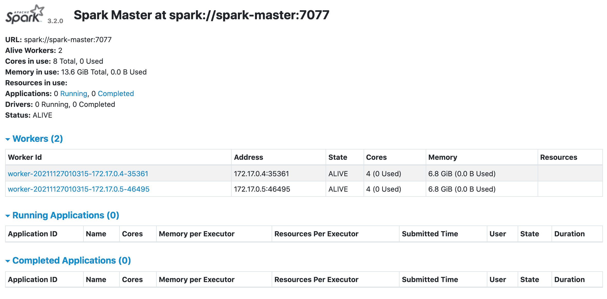

# 在 Kubernetes 上部署 Spark

> 原文：<https://testdriven.io/blog/deploying-spark-on-kubernetes/>

这篇文章详细介绍了如何在 Kubernetes 集群上部署 Spark。

*依赖关系:*

*   文档版本 20.10.10
*   Minikube v1.24.0
*   spark 3 . 2 . 0 版
*   Hadoop 版本 3.3.1

## 迷你库贝

Minikube 是一个用于在本地运行单节点 Kubernetes 集群的工具。

遵循官方的[安装 Minikube](https://kubernetes.io/docs/tasks/tools/install-minikube/) 指南，将其与[虚拟机管理程序](https://kubernetes.io/docs/tasks/tools/install-minikube/#install-a-hypervisor)(如 [VirtualBox](https://www.virtualbox.org/wiki/Downloads) 或 [HyperKit](https://github.com/moby/hyperkit) )一起安装，以管理虚拟机，并与 [Kubectl](https://kubernetes.io/docs/tasks/tools/install-kubectl/) 一起安装，以在 Kubernetes 上部署和管理应用。

默认情况下，Minikube 虚拟机配置为使用 1GB 内存和 2 个 CPU 内核。这对于 Spark 作业来说是不够的，所以一定要在你的 Docker [客户端](https://docs.docker.com/docker-for-mac/#advanced)(对于 HyperKit)或者直接在 VirtualBox 中增加内存。然后，当您启动 Minikube 时，将内存和 CPU 选项传递给它:

```py
`$ minikube start --vm-driver=hyperkit --memory 8192 --cpus 4

or

$ minikube start --memory 8192 --cpus 4` 
```

## 码头工人

接下来，让我们为 Spark [3.2.0](https://spark.apache.org/releases/spark-release-3-2-0.html) 构建一个定制的 Docker 映像，它是为 Spark [单机模式](https://spark.apache.org/docs/3.2.0/spark-standalone.html)设计的。

*Dockerfile* :

```py
`# base image
FROM  openjdk:11

# define spark and hadoop versions
ENV  SPARK_VERSION=3.2.0
ENV  HADOOP_VERSION=3.3.1

# download and install hadoop
RUN  mkdir -p /opt && \
    cd /opt && \
    curl http://archive.apache.org/dist/hadoop/common/hadoop-${HADOOP_VERSION}/hadoop-${HADOOP_VERSION}.tar.gz | \
        tar -zx hadoop-${HADOOP_VERSION}/lib/native && \
    ln -s hadoop-${HADOOP_VERSION} hadoop && \
    echo Hadoop ${HADOOP_VERSION} native libraries installed in /opt/hadoop/lib/native

# download and install spark
RUN  mkdir -p /opt && \
    cd /opt && \
    curl http://archive.apache.org/dist/spark/spark-${SPARK_VERSION}/spark-${SPARK_VERSION}-bin-hadoop2.7.tgz | \
        tar -zx && \
    ln -s spark-${SPARK_VERSION}-bin-hadoop2.7 spark && \
    echo Spark ${SPARK_VERSION} installed in /opt

# add scripts and update spark default config
ADD  common.sh spark-master spark-worker /
ADD  spark-defaults.conf /opt/spark/conf/spark-defaults.conf
ENV  PATH $PATH:/opt/spark/bin` 
```

你可以在 GitHub 的 [spark-kubernetes](https://github.com/testdrivenio/spark-kubernetes) repo 中找到上面的 *Dockerfile* 以及 Spark 配置文件和脚本。

建立形象:

```py
`$ eval $(minikube docker-env)
$ docker build -f docker/Dockerfile -t spark-hadoop:3.2.0 ./docker` 
```

> 如果你不想花时间在本地构建映像，请随意使用我从[Docker Hub](https://hub.docker.com/):[mj hea 0/Spark-Hadoop:3 . 2 . 0](https://hub.docker.com/r/mjhea0/spark-hadoop/tags)中预先构建的 Spark 映像。

查看:

```py
`$ docker image ls spark-hadoop

REPOSITORY          TAG                 IMAGE ID            CREATED             SIZE
spark-hadoop        3.2.0               8f3ccdadd795        11 minutes ago      1.12GB` 
```

## 火花大师

*spark-master-deployment . YAML*:

```py
`kind:  Deployment apiVersion:  apps/v1 metadata: name:  spark-master spec: replicas:  1 selector: matchLabels: component:  spark-master template: metadata: labels: component:  spark-master spec: containers: -  name:  spark-master image:  spark-hadoop:3.2.0 command:  ["/spark-master"] ports: -  containerPort:  7077 -  containerPort:  8080 resources: requests: cpu:  100m` 
```

*spark-master-service . YAML*:

```py
`kind:  Service apiVersion:  v1 metadata: name:  spark-master spec: ports: -  name:  webui port:  8080 targetPort:  8080 -  name:  spark port:  7077 targetPort:  7077 selector: component:  spark-master` 
```

创建 Spark 主部署并启动服务:

```py
`$ kubectl create -f ./kubernetes/spark-master-deployment.yaml
$ kubectl create -f ./kubernetes/spark-master-service.yaml` 
```

验证:

```py
`$ kubectl get deployments

NAME           READY   UP-TO-DATE   AVAILABLE   AGE
spark-master   1/1     1            1           2m55s

$ kubectl get pods

NAME                          READY   STATUS    RESTARTS   AGE
spark-master-dbc47bc9-tlgfs   1/1     Running   0          3m8s` 
```

## 星火工人

spark-worker-deployment . YAML:

```py
`kind:  Deployment apiVersion:  apps/v1 metadata: name:  spark-worker spec: replicas:  2 selector: matchLabels: component:  spark-worker template: metadata: labels: component:  spark-worker spec: containers: -  name:  spark-worker image:  spark-hadoop:3.2.0 command:  ["/spark-worker"] ports: -  containerPort:  8081 resources: requests: cpu:  100m` 
```

创建 Spark worker 部署:

```py
`$ kubectl create -f ./kubernetes/spark-worker-deployment.yaml` 
```

验证:

```py
`$ kubectl get deployments

NAME           READY   UP-TO-DATE   AVAILABLE   AGE
spark-master   1/1     1            1           6m35s
spark-worker   2/2     2            2           7s

$ kubectl get pods

NAME                            READY   STATUS    RESTARTS   AGE
spark-master-dbc47bc9-tlgfs     1/1     Running   0          6m53s
spark-worker-795dc47587-fjkjt   1/1     Running   0          25s
spark-worker-795dc47587-g9n64   1/1     Running   0          25s` 
```

## 进入

你有没有注意到我们在 8080 端口暴露了 Spark web UI？为了在集群外部访问它，让我们配置一个[入口](https://kubernetes.io/docs/concepts/services-networking/ingress/)对象。

*minikube-ingress.yaml* :

```py
`apiVersion:  networking.k8s.io/v1 kind:  Ingress metadata: name:  minikube-ingress annotations: spec: rules: -  host:  spark-kubernetes http: paths: -  pathType:  Prefix path:  / backend: service: name:  spark-master port: number:  8080` 
```

启用入口[插件](https://github.com/kubernetes/minikube/tree/master/deploy/addons/ingress):

```py
`$ minikube addons enable ingress` 
```

创建入口对象:

```py
`$ kubectl apply -f ./kubernetes/minikube-ingress.yaml` 
```

接下来，您需要更新您的 */etc/hosts* 文件，以便将请求从我们定义的主机`spark-kubernetes`路由到 Minikube 实例。

将条目添加到/etc/hosts:

```py
`$ echo "$(minikube ip) spark-kubernetes" | sudo tee -a /etc/hosts` 
```

在浏览器中进行测试，网址为 [http://spark-kubernetes/](http://spark-kubernetes/) :



## 试验

要进行测试，从主容器运行 PySpark shell:

```py
`$ kubectl get pods -o wide

NAME                            READY   STATUS    RESTARTS   AGE     IP           NODE       NOMINATED NODE   READINESS GATES
spark-master-dbc47bc9-t6v84     1/1     Running   0          7m35s   172.17.0.6   minikube   <none>           <none>
spark-worker-795dc47587-5ch8f   1/1     Running   0          7m24s   172.17.0.9   minikube   <none>           <none>
spark-worker-795dc47587-fvcf6   1/1     Running   0          7m24s   172.17.0.7   minikube   <none>           <none>

$ kubectl exec spark-master-dbc47bc9-t6v84 -it -- \
    pyspark --conf spark.driver.bindAddress=172.17.0.6 --conf spark.driver.host=172.17.0.6` 
```

然后在 PySpark 提示符出现后运行以下代码:

```py
`words = 'the quick brown fox jumps over the\
 lazy dog the quick brown fox jumps over the lazy dog'
sc = SparkContext.getOrCreate()
seq = words.split()
data = sc.parallelize(seq)
counts = data.map(lambda word: (word, 1)).reduceByKey(lambda a, b: a + b).collect()
dict(counts)
sc.stop()` 
```

您应该看到:

```py
`{'brown': 2, 'lazy': 2, 'over': 2, 'fox': 2, 'dog': 2, 'quick': 2, 'the': 4, 'jumps': 2}` 
```

就是这样！

* * *

你可以在 GitHub 的 [spark-kubernetes](https://github.com/testdrivenio/spark-kubernetes) repo 中找到这些脚本。干杯！