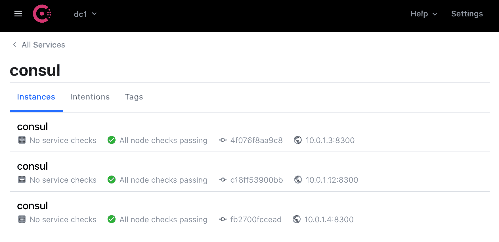
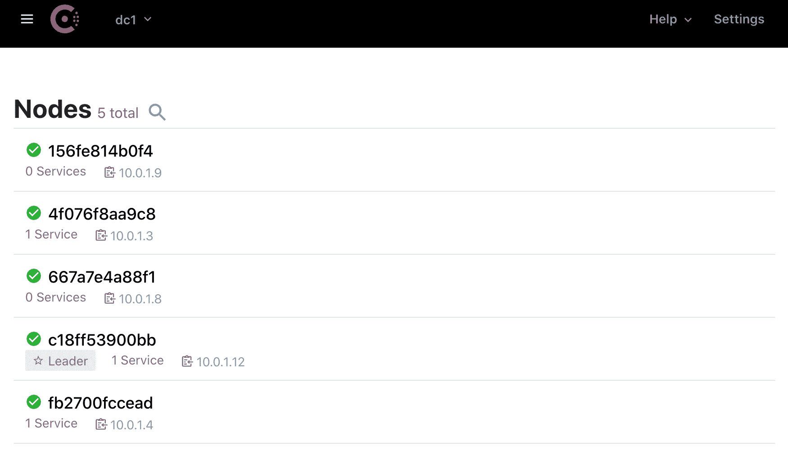
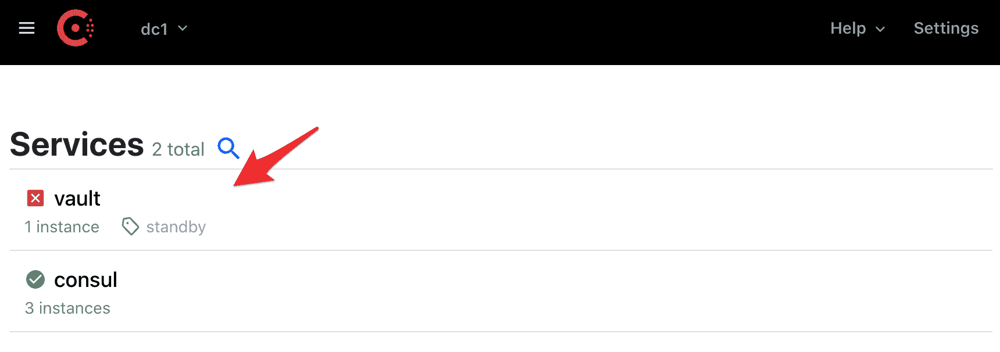

# 部署保险库和领事

> 原文：<https://testdriven.io/blog/deploying-vault-and-consul/>

我们来看看如何用 Docker Swarm 部署 Hashicorp 的[金库](https://www.vaultproject.io/)和[领事](https://www.consul.io/)到[数字海洋](https://m.do.co/c/d8f211a4b4c2)。

> 本教程假设您具备使用 Vault 和 Consul 管理机密的基本工作知识。更多信息请参考[保管库管理机密和咨询](/managing-secrets-with-vault-and-consul)教程。

完成后，您将能够:

1.  使用 Docker 机器在 DigitalOcean 上配置主机
2.  配置一个 Docker 群集群在数字海洋上运行
3.  在码头群上运行金库和领事

*主要依赖:*

*   文档 v20.10.8
*   坞站-复合 v1.29.2
*   对接机 v0.16.2
*   保险库版本 1.8.3
*   领事 v1.10.3

## 领事

创建新的项目目录:

```
`$ mkdir vault-consul-swarm && cd vault-consul-swarm` 
```

然后，将一个 *docker-compose.yml* 文件添加到项目根:

```
`version:  "3.8" services: server-bootstrap: image:  consul:1.10.3 ports: -  8500:8500 command:  "agent  -server  -bootstrap-expect  3  -ui  -client  0.0.0.0  -bind  '{{  GetInterfaceIP  \"eth0\"  }}'" server: image:  consul:1.10.3 command:  "agent  -server  -retry-join  server-bootstrap  -client  0.0.0.0  -bind  '{{  GetInterfaceIP  \"eth0\"  }}'" deploy: replicas:  2 depends_on: -  server-bootstrap client: image:  consul:1.10.3 command:  "agent  -retry-join  server-bootstrap  -client  0.0.0.0  -bind  '{{  GetInterfaceIP  \"eth0\"  }}'" deploy: replicas:  2 depends_on: -  server-bootstrap networks: default: external:  true name:  core` 
```

这种配置应该看起来很熟悉。

1.  参考 Docker Swarm 博客文章[运行 Flask 的](/running-flask-on-docker-swarm)[合成文件](/running-flask-on-docker-swarm#compose-file)部分，了解更多关于使用 Docker Swarm 模式合成文件的信息。
2.  查看 [Consul 和 Docker](https://hub.docker.com/_/consul) 指南，了解上述 Consul 配置的信息。

## 码头工人群

注册一个[数字海洋](https://m.do.co/c/d8f211a4b4c2)账户(如果你还没有的话)，然后[生成](https://www.digitalocean.com/docs/apis-clis/api/)一个访问令牌，这样你就可以访问数字海洋 API 了。

将令牌添加到您的环境中:

```
`$ export DIGITAL_OCEAN_ACCESS_TOKEN=[your_digital_ocean_token]` 
```

旋转三个液滴:

```
`$ for i in 1 2 3; do
    docker-machine create \
      --driver digitalocean \
      --digitalocean-region "nyc1" \
      --digitalocean-image=debian-10-x64 \
      --engine-install-url "https://releases.rancher.com/install-docker/19.03.9.sh" \
      --digitalocean-access-token $DIGITAL_OCEAN_ACCESS_TOKEN \
      node-$i;
done` 
```

在第一个节点`node-1`上初始化[群模式](https://docs.docker.com/engine/swarm/):

```
`$ docker-machine ssh node-1 -- docker swarm init --advertise-addr $(docker-machine ip node-1)` 
```

使用上一个命令输出中的 join 令牌将剩余的两个节点作为 workers 添加到群中:

```
`$ for i in 2 3; do
    docker-machine ssh node-$i -- docker swarm join --token YOUR_JOIN_TOKEN HOST:PORT;
done` 
```

例如:

```
`for i in 2 3; do
    docker-machine ssh node-$i -- docker swarm join --token SWMTKN-1-18xrfgcgq7k6krqr7tvav3ydx5c5104y662lzh4pyct2t0ror3-e3ed1ggivhf8z15i40z6x55g5 67.205.165.166:2377;
done` 
```

您应该看到:

```
`This node joined a swarm as a worker.
This node joined a swarm as a worker.` 
```

将 Docker 守护进程指向`node-1`，创建一个可连接的[覆盖网络](https://docs.docker.com/network/network-tutorial-overlay/)(称为`core`)，并部署堆栈:

```
`$ eval $(docker-machine env node-1)
$ docker network create -d overlay --attachable core
$ docker stack deploy --compose-file=docker-compose.yml secrets` 
```

列出堆栈中的服务:

```
`$ docker stack ps -f "desired-state=running" secrets` 
```

您应该会看到类似如下的内容:

```
`ID             NAME                         IMAGE          NODE     DESIRED STATE   CURRENT STATE
b5f5eycrhf3o   secrets_client.1             consul:1.10.3   node-1   Running         Running 7 seconds ago
zs7a5t8khcew   secrets_server.1             consul:1.10.3   node-2   Running         Running 9 seconds ago
qnhtlan6m0sp   secrets_server-bootstrap.1   consul:1.10.3   node-1   Running         Running 7 seconds ago
u61eycesmsl7   secrets_client.2             consul:1.10.3   node-2   Running         Running 9 seconds ago
vgpql8lfy5fi   secrets_server.2             consul:1.10.3   node-3   Running         Running 9 seconds ago` 
```

抓取与`node-1`关联的 IP:

```
`$ docker-machine ip node-1` 
```

然后，在[http://YOUR _ MACHINE _ IP:8500/UI](http://YOUR_MACHINE_IP:8500/ui)的浏览器中测试 Consul UI。应该有三个正在运行的服务和五个节点。





## 跳跃

将`vault`服务添加到 *docker-compose.yml* :

```
`vault: image:  vault:1.8.3 deploy: replicas:  1 ports: -  8200:8200 environment: -  VAULT_ADDR=http://127.0.0.1:8200 -  VAULT_LOCAL_CONFIG={"backend":{"consul":{"address":"http://server-bootstrap:8500","path":"vault/"}},"listener":{"tcp":{"address":"0.0.0.0:8200","tls_disable":1}},"ui":true, "disable_mlock":true} command:  server depends_on: -  consul` 
```

记下`VAULT_LOCAL_CONFIG`环境变量:

```
`{ "backend":  { "consul":  { "address":  "http://server-bootstrap:8500", "path":  "vault/" } }, "listener":  { "tcp":  { "address":  "0.0.0.0:8200", "tls_disable":  1 } }, "ui":  true, "disable_mlock":  true }` 
```

查看[领事后端](/managing-secrets-with-vault-and-consul#consul-backend)部分，从[用 Vault 和领事](/managing-secrets-with-vault-and-consul)管理秘密的博文中获取更多信息。此外，对于生产环境，不建议将 [disable_mlock](https://www.vaultproject.io/docs/configuration#disable_mlock) 设置为`true`；但是，由于`--cap-add`在 Docker 群组模式下不可用，因此必须将其启用。有关详细信息，请参见以下 GitHub 问题:

1.  [- cap-add=IPC_LOCK 在 docker 群中不可用](https://github.com/hashicorp/docker-vault/issues/89)
2.  [从 Swarmmode - cap-add 中丢失](https://github.com/moby/moby/issues/25885)

## 试验

重新部署堆栈:

```
`$ docker stack deploy --compose-file=docker-compose.yml secrets` 
```

等待几秒钟，让服务开始运转，然后检查状态:

```
`$ docker stack ps -f "desired-state=running" secrets` 
```

同样，您应该看到类似于以下内容的内容:

```
`ID             NAME                         IMAGE           NODE      DESIRED STATE   CURRENT STATE
xtfsetfrbrs7   secrets_client.1             consul:1.10.3   node-3    Running         Running 19 minutes ago
ydqxexgiyzb2   secrets_client.2             consul:1.10.3   node-1    Running         Running 19 minutes ago
izlku3y6j8rp   secrets_server-bootstrap.1   consul:1.10.3   node-2    Running         Running 19 minutes ago
zqpkcrhrix2x   secrets_server.1             consul:1.10.3   node-1    Running         Running 19 minutes ago
kmlxuhxw1akv   secrets_server.2             consul:1.10.3   node-2    Running         Running 19 minutes ago
wfmscoj53m39   secrets_vault.1              vault:1.8.3     node-3    Running         Running about a minute ago` 
```

接下来，确保 Vault 列在 Consul UI 的“服务”部分:



现在，您应该能够通过 CLI、HTTP API 和 UI 与 Vault 进行交互。从初始化和解封保险库开始。然后，登录并创建一个新的秘密。

完成后删除节点:

```
`$ docker-machine rm node-1 node-2 node-3 -y` 
```

## 自动化脚本

最后，让我们创建一个快速脚本来自动化部署过程:

1.  用 Docker 机器提供三个数字海洋液滴
2.  配置 Docker 群组模式
3.  向群集添加节点
4.  部署堆栈

将名为 *deploy.sh* 的新文件添加到项目根目录:

```
`#!/bin/bash

echo "Spinning up three droplets..."

for i in 1 2 3; do
  docker-machine create \
    --driver digitalocean \
    --digitalocean-region "nyc1" \
    --digitalocean-image=debian-10-x64 \
    --engine-install-url "https://releases.rancher.com/install-docker/19.03.9.sh" \
    --digitalocean-access-token $DIGITAL_OCEAN_ACCESS_TOKEN \
    node-$i;
done

echo "Initializing Swarm mode..."

docker-machine ssh node-1 -- docker swarm init --advertise-addr $(docker-machine ip node-1)

echo "Adding the nodes to the Swarm..."

TOKEN=`docker-machine ssh node-1 docker swarm join-token worker | grep token | awk '{ print $5 }'`

for i in 2 3; do
  docker-machine ssh node-$i \
    -- docker swarm join --token ${TOKEN} $(docker-machine ip node-1):2377;
done

echo "Creating networking..."

eval $(docker-machine env node-1)
docker network create -d overlay --attachable core

echo "Deploying the stack..."

docker stack deploy --compose-file=docker-compose.yml secrets` 
```

试试吧！

完成后将水滴带下来:

```
`$ docker-machine rm node-1 node-2 node-3 -y` 
```

* * *

代码可以在 [vault-consul-swarm](https://github.com/testdrivenio/vault-consul-swarm) repo 中找到。干杯！