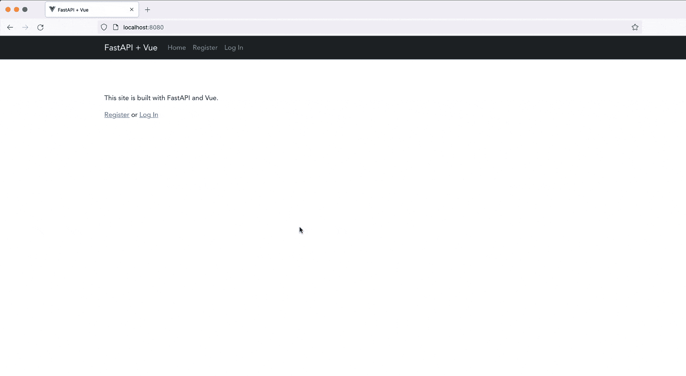
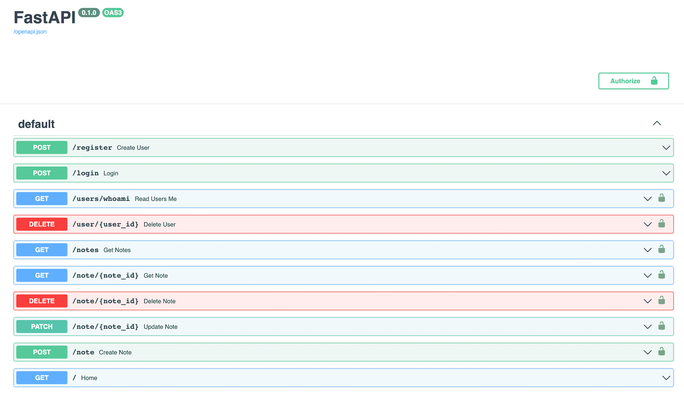
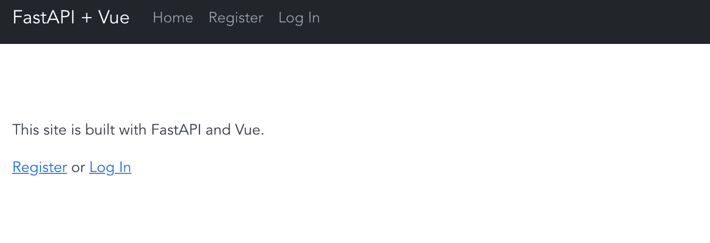
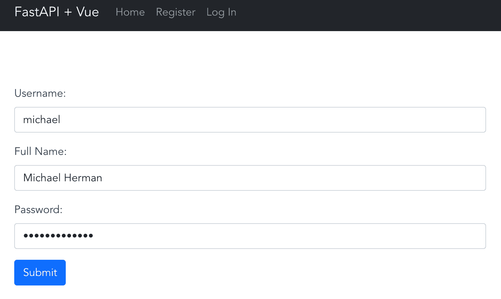
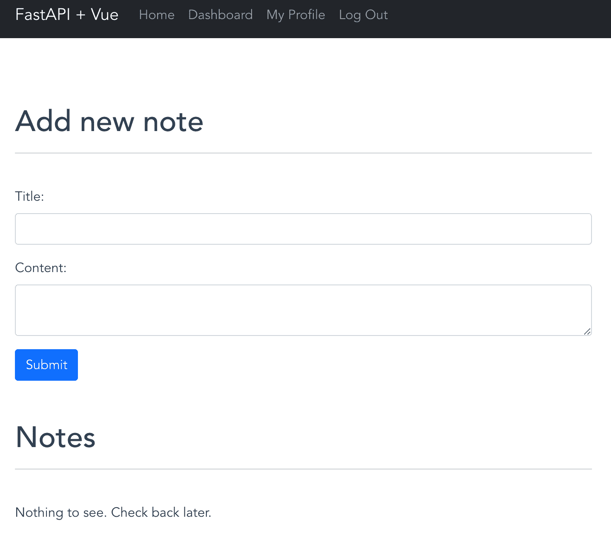
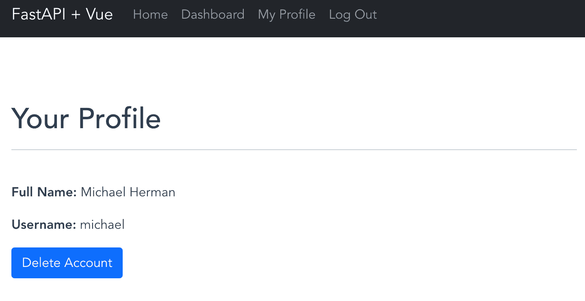
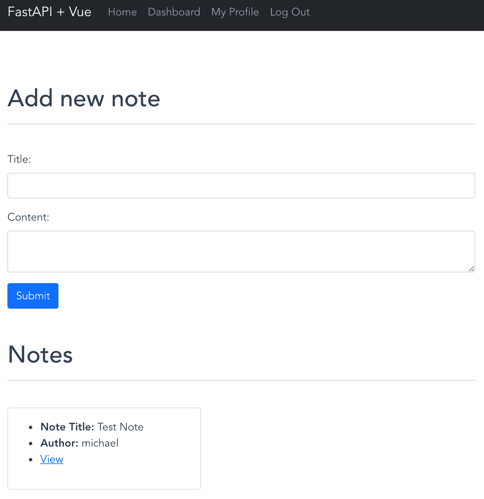
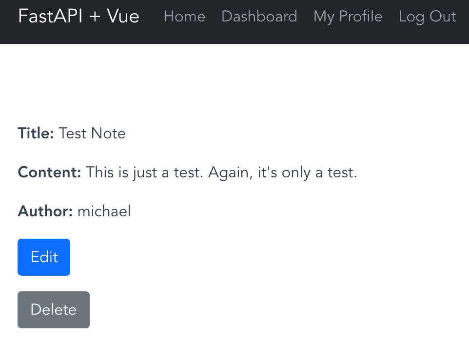

# 用 FastAPI 和 Vue.js 开发单页应用

> 原文：<https://testdriven.io/blog/developing-a-single-page-app-with-fastapi-and-vuejs/>

以下是如何使用 FastAPI、Vue、Docker 和 Postgres 构建和封装一个基本 CRUD 应用程序的分步演练。我们将从后端开始，开发一个由 Python、FastAPI 和 Docker 支持的 RESTful API，然后转移到前端。我们还将连接基于令牌的身份验证。

*最终应用*:



*主要依赖:*

*   视图 v3.2.45
*   CLI 视图 v5.0.8
*   节点 v18.12.1
*   npm v8.19.2
*   FastAPI v0.88.0
*   python 3 . 11 . 1 版

> 这是一个中级教程，重点是分别用 FastAPI 和 Vue 开发后端和前端 app。除了应用程序本身，您还可以添加身份验证，并将它们集成在一起。假设您有使用 FastAPI、Vue 和 Docker 的经验。请参见 [FastAPI 和 Vue](/blog/developing-a-single-page-app-with-fastapi-and-vuejs/#fastapi-and-vue) 部分，了解学习上述工具和技术的推荐资源。

## 目标

本教程结束时，您将能够:

1.  解释什么是 FastAPI
2.  解释什么是 Vue，以及它与其他 UI 库和前端框架(如 React 和 Angular)相比如何
3.  用 FastAPI 开发 RESTful API
4.  使用 Vue CLI 搭建 Vue 项目
5.  在浏览器中创建和渲染 Vue 组件
6.  使用 Vue 组件创建单页面应用程序(SPA)
7.  将 Vue 应用程序连接到 FastAPI 后端
8.  使用引导程序设计 Vue 组件
9.  使用 Vue 路由器创建路线并渲染组件
10.  使用基于令牌的身份验证管理用户身份验证

## FastAPI 和视图

让我们快速看一下每个框架。

### 什么是 FastAPI？

FastAPI 是一个包含电池的现代 Python web 框架，非常适合构建 RESTful APIs。它可以处理同步和异步请求，并内置了对数据验证、JSON 序列化、认证和授权以及 [OpenAPI](https://swagger.io/docs/specification/about/) 文档的支持。

亮点:

1.  受 Flask 的启发，它有一种轻量级微框架的感觉，支持类似 Flask 的 route decorators。
2.  它利用 Python 类型提示进行参数声明，支持数据验证(通过 [pydantic](https://pydantic-docs.helpmanual.io/) )和 OpenAPI/Swagger 文档。
3.  它建立在 [Starlette](https://www.starlette.io/) 之上，支持异步 API 的开发。
4.  已经[快](https://www.techempower.com/benchmarks/#section=data-r21&hw=ph&test=query&l=zijzen-7)了。由于 async 比传统的同步线程模型更有效，所以在性能方面它可以与 Node 和 Go 竞争。
5.  因为它基于并完全兼容 OpenAPI 和 JSON Schema，所以它支持许多强大的工具，比如 Swagger UI。
6.  它有惊人的[文档](https://fastapi.tiangolo.com/)。

**第一次用 FastAPI？**查看以下资源:

1.  [使用 FastAPI 和 Pytest 开发和测试异步 API](/blog/fastapi-crud/)
2.  [用 FastAPI 和 Docker 进行测试驱动开发](/courses/tdd-fastapi/)

### Vue 是什么？

Vue 是一个开源的 JavaScript 框架，用于构建用户界面。它采用了 React 和 Angular 的一些最佳实践。也就是说，与 React 和 Angular 相比，它要平易近人得多，因此初学者可以快速上手并运行。它也同样强大，因此它提供了创建现代前端应用程序所需的所有功能。

有关 Vue 的更多信息，以及使用它与 React 和 Angular 相比的优缺点，请查看以下文章:

1.  [Vue:与其他框架的比较](https://vuejs.org/v2/guide/comparison.html)
2.  [通过构建和部署 CRUD 应用程序学习 Vue](/courses/learn-vue/)
3.  [反应 vs 角度 vs Vue.js](https://medium.com/techmagic/reactjs-vs-angular5-vs-vue-js-what-to-choose-in-2018-b91e028fa91d)

**第一次用 Vue？**

1.  花点时间通读官方 Vue 指南中的[介绍](https://vuejs.org/guide/introduction.html)。
2.  查看 [Learn Vue，构建并部署 CRUD App](/courses/learn-vue/) 课程。

## 我们在建造什么？

我们的目标是为两种资源——用户和 notes——设计一个后端 RESTful API，由 Python 和 FastAPI 提供支持。API 本身应该遵循 RESTful 设计原则，使用基本的 HTTP 动词:GET、POST、PUT 和 DELETE。

我们还将使用 Vue 设置一个前端应用程序，与后端 API 进行交互:


核心功能:

1.  经过身份验证的用户将能够查看、添加、更新和删除注释
2.  经过身份验证的用户也可以查看他们的用户信息并删除他们自己

> 本教程主要是讨论快乐之路。对于读者来说，处理不愉快/异常路径是一个单独的练习。检查您的理解，并为前端和后端添加适当的错误处理。

## FastAPI Setup

首先创建一个名为“fastapi-vue”的新项目文件夹，并添加以下文件和文件夹:

```
`fastapi-vue
├── docker-compose.yml
└── services
    └── backend
        ├── Dockerfile
        ├── requirements.txt
        └── src
            └── main.py` 
```

> 以下命令将创建项目结构:
> 
> ```
> `$ mkdir fastapi-vue && \
>   cd fastapi-vue && \
>   mkdir -p services/backend/src && \
>   touch docker-compose.yml services/backend/Dockerfile && \
>   touch services/backend/requirements.txt services/backend/src/main.py` 
> ```

接下来，将以下代码添加到*服务/后端/Dockerfile* 中:

```
`FROM  python:3.11-buster

RUN  mkdir app
WORKDIR  /app

ENV  PATH="${PATH}:/root/.local/bin"
ENV  PYTHONPATH=.

COPY  requirements.txt .
RUN  pip install --upgrade pip
RUN  pip install -r requirements.txt

COPY  src/ .` 
```

将以下依赖项添加到*服务/后端/需求. txt* 文件中:

```
`fastapi==0.88.0
uvicorn==0.20.0` 
```

更新坞站-复合. yml 如:

```
`version:  '3.8' services: backend: build:  ./services/backend ports: -  5000:5000 volumes: -  ./services/backend:/app command:  uvicorn src.main:app --reload --host 0.0.0.0 --port 5000` 
```

在我们构建映像之前，让我们添加一个到*services/back end/src/main . py*的测试路径，这样我们就可以快速测试应用是否构建成功:

```
`from fastapi import FastAPI

app = FastAPI()

@app.get("/")
def home():
    return "Hello, World!"` 
```

在您的终端中构建映像:

```
`$ docker-compose up -d --build` 
```

完成后，在您选择的浏览器中导航至 [http://127.0.0.1:5000/](http://127.0.0.1:5000/) 。您应该看到:

可以在[http://localhost:5000/docs](http://localhost:5000/docs)查看 Swagger UI。

接下来，添加[中间件](https://fastapi.tiangolo.com/tutorial/cors/#use-corsmiddleware):

```
`from fastapi import FastAPI
from fastapi.middleware.cors import CORSMiddleware  # NEW

app = FastAPI()

# NEW
app.add_middleware(
    CORSMiddleware,
    allow_origins=["http://localhost:8080"],
    allow_credentials=True,
    allow_methods=["*"],
    allow_headers=["*"],
)

@app.get("/")
def home():
    return "Hello, World!"` 
```

`CORSMiddleware`需要发出[跨来源](https://en.wikipedia.org/wiki/Cross-origin_resource_sharing)请求——即来自不同协议、IP 地址、域名或端口的请求。这是必要的，因为前端将在`http://localhost:8080`运行。

## 视图设置

从我们的前端开始，我们将使用 [Vue CLI](https://cli.vuejs.org/) 搭建一个项目。

确保您使用的是 Vue CLI 的版本 [5.0.8](https://www.npmjs.com/package/@vue/cli/v/5.0.8) :

接下来，从“fastapi-vue/services”文件夹中，搭建出一个新的 vue 项目:

选择`Default ([Vue 3] babel, eslint)`。

脚手架搭好之后，添加[路由器](https://router.vuejs.org/)(对[历史模式](https://router.vuejs.org/guide/essentials/history-mode.html)说是)，并安装所需的依赖项:

我们将很快讨论这些依赖项。

要在本地提供 Vue 应用程序，请运行:

导航至 [http://localhost:8080/](http://localhost:8080/) 查看您的应用。

关掉服务器。

接下来，在*services/frontend/src/main . js*中连接 Axios 和 Bootstrap 的依赖关系:

```
`import  'bootstrap/dist/css/bootstrap.css'; import  {  createApp  }  from  "vue"; import  axios  from  'axios'; import  App  from  './App.vue'; import  router  from  './router'; const  app  =  createApp(App); axios.defaults.withCredentials  =  true; axios.defaults.baseURL  =  'http://localhost:5000/';  // the FastAPI backend app.use(router); app.mount("#app");` 
```

向“服务/前端”添加一个 *Dockerfile* :

```
`FROM  node:lts-alpine

WORKDIR  /app

ENV  PATH /app/node_modules/.bin:$PATH

RUN  npm install @vue/[[email protected]](/cdn-cgi/l/email-protection) -g

COPY  package.json .
COPY  package-lock.json .
RUN  npm install

CMD  ["npm",  "run",  "serve"]` 
```

增加 a 服务至*码头-化合物. yml* :

```
`version:  '3.8' services: backend: build:  ./services/backend ports: -  5000:5000 volumes: -  ./services/backend:/app command:  uvicorn src.main:app --reload --host 0.0.0.0 --port 5000 frontend: build:  ./services/frontend volumes: -  './services/frontend:/app' -  '/app/node_modules' ports: -  8080:8080` 
```

构建新映像并旋转容器:

```
`$ docker-compose up -d --build` 
```

确保 [http://localhost:8080/](http://localhost:8080/) 仍然工作。

接下来，更新*services/frontend/src/components/hello world . vue*如下:

```
`<template>
  <div>
    <p>{{ msg }}</p>
  </div>
</template>

<script> import  axios  from  'axios'; export  default  { name:  'Ping', data()  { return  { msg:  '', }; }, methods:  { getMessage()  { axios.get('/') .then((res)  =>  { this.msg  =  res.data; }) .catch((error)  =>  { console.error(error); }); }, }, created()  { this.getMessage(); }, }; </script>` 
```

[Axios](https://axios-http.com/) ，这是一个 HTTP 客户端，用于向后端发送 AJAX 请求。在上面的组件中，我们从后端的响应中更新了`msg`的值。

最后，在*services/frontend/src/app . vue*中，移除导航以及相关的样式:

```
`<template>
  <div id="app">
    <router-view/>
  </div>
</template>

<style> #app  { font-family:  Avenir,  Helvetica,  Arial,  sans-serif; -webkit-font-smoothing:  antialiased; -moz-osx-font-smoothing:  grayscale; text-align:  center; color:  #2c3e50; } </style>` 
```

现在，您应该会在浏览器的[中看到`Hello, World!`。](http://localhost:8080/)

您的完整项目结构现在应该如下所示:

```
`├── docker-compose.yml
└── services
    ├── backend
    │   ├── Dockerfile
    │   ├── requirements.txt
    │   └── src
    │       └── main.py
    └── frontend
        ├── .gitignore
        ├── Dockerfile
        ├── README.md
        ├── babel.config.js
        ├── jsconfig.json
        ├── package-lock.json
        ├── package.json
        ├── public
        │   ├── favicon.ico
        │   └── index.html
        ├── src
        │   ├── App.vue
        │   ├── assets
        │   │   └── logo.png
        │   ├── components
        │   │   └── HelloWorld.vue
        │   ├── main.js
        │   ├── router
        │   │   └── index.js
        │   └── views
        │       ├── AboutView.vue
        │       └── HomeView.vue
        └── vue.config.js` 
```

## 模型和迁移

我们将使用 [Tortoise](https://tortoise-orm.readthedocs.io/) 来管理 ORM(对象关系映射器),使用 [Aerich](https://github.com/tortoise/aerich) 来管理数据库迁移。

更新后端依赖关系:

```
`aerich==0.7.1
asyncpg==0.27.0
fastapi==0.88.0
tortoise-orm==0.19.2
uvicorn==0.20.0` 
```

首先，让我们为 Postgres 添加一个新服务到 *docker-compose.yml* :

```
`version:  '3.8' services: backend: build:  ./services/backend ports: -  5000:5000 environment: -  DATABASE_URL=postgres://hello_fastapi:[[email protected]](/cdn-cgi/l/email-protection):5432/hello_fastapi_dev volumes: -  ./services/backend:/app command:  uvicorn src.main:app --reload --host 0.0.0.0 --port 5000 depends_on: -  db frontend: build:  ./services/frontend volumes: -  './services/frontend:/app' -  '/app/node_modules' ports: -  8080:8080 db: image:  postgres:15.1 expose: -  5432 environment: -  POSTGRES_USER=hello_fastapi -  POSTGRES_PASSWORD=hello_fastapi -  POSTGRES_DB=hello_fastapi_dev volumes: -  postgres_data:/var/lib/postgresql/data/ volumes: postgres_data:` 
```

注意`db`中的环境变量以及`backend`服务中新的`DATABASE_URL`环境变量。

接下来，在“services/backend/src”文件夹中创建一个名为“database”的文件夹，并向其中添加一个名为 *models.py* 的新文件:

```
`from tortoise import fields, models

class Users(models.Model):
    id = fields.IntField(pk=True)
    username = fields.CharField(max_length=20, unique=True)
    full_name = fields.CharField(max_length=50, null=True)
    password = fields.CharField(max_length=128, null=True)
    created_at = fields.DatetimeField(auto_now_add=True)
    modified_at = fields.DatetimeField(auto_now=True)

class Notes(models.Model):
    id = fields.IntField(pk=True)
    title = fields.CharField(max_length=225)
    content = fields.TextField()
    author = fields.ForeignKeyField("models.Users", related_name="note")
    created_at = fields.DatetimeField(auto_now_add=True)
    modified_at = fields.DatetimeField(auto_now=True)

    def __str__(self):
        return f"{self.title}, {self.author_id} on {self.created_at}"` 
```

`Users`和`Notes`类将在我们的数据库中创建两个新表。请注意，`author`列与用户相关联，创建了一个一对多的关系(一个用户可以有多个注释)。

在“services/backend/src/database”文件夹中创建一个 *config.py* 文件:

```
`import os

TORTOISE_ORM = {
    "connections": {"default": os.environ.get("DATABASE_URL")},
    "apps": {
        "models": {
            "models": [
                "src.database.models", "aerich.models"
            ],
            "default_connection": "default"
        }
    }
}` 
```

这里，我们为 Tortoise 和 Aerich 指定了配置。

简而言之，我们:

1.  通过`DATABASE_URL`环境变量定义数据库连接
2.  注册我们的模型，`src.database.models`(用户和注释)和`aerich.models`(迁移元数据)

将一个 *register.py* 文件添加到“服务/后端/src/数据库”中:

```
`from typing import Optional

from tortoise import Tortoise

def register_tortoise(
    app,
    config: Optional[dict] = None,
    generate_schemas: bool = False,
) -> None:
    @app.on_event("startup")
    async def init_orm():
        await Tortoise.init(config=config)
        if generate_schemas:
            await Tortoise.generate_schemas()

    @app.on_event("shutdown")
    async def close_orm():
        await Tortoise.close_connections()` 
```

`register_tortoise`是一个将用于配置我们的应用程序和 Tortoise 模型的函数。它接受我们的应用程序、一个配置字典和一个`generate_schema`布尔值。

该函数将在 *main.py* 中用我们的配置字典调用:

```
`from fastapi import FastAPI
from fastapi.middleware.cors import CORSMiddleware

from src.database.register import register_tortoise  # NEW
from src.database.config import TORTOISE_ORM         # NEW

app = FastAPI()

app.add_middleware(
    CORSMiddleware,
    allow_origins=["*"],
    allow_credentials=True,
    allow_methods=["*"],
    allow_headers=["*"],
)

# NEW
register_tortoise(app, config=TORTOISE_ORM, generate_schemas=False)

@app.get("/")
def home():
    return "Hello, World!"` 
```

构建新映像并旋转容器:

```
`$ docker-compose up -d --build` 
```

容器启动并运行后，运行:

```
`$ docker-compose exec backend aerich init -t src.database.config.TORTOISE_ORM
Success create migrate location ./migrations
Success write config to pyproject.toml

$ docker-compose exec backend aerich init-db
Success create app migrate location migrations/models
Success generate schema for app "models"` 
```

第一个命令告诉 Aerich 配置字典在哪里，用于初始化模型和数据库之间的连接。这创建了一个*服务/后端/pyproject.toml* [配置文件](https://github.com/tortoise/aerich#initialization)和一个“服务/后端/迁移”文件夹。

接下来，我们在“服务/后端/迁移/模型”中为我们的三个模型——用户、notes 和 aerich——生成了一个迁移文件。这些也应用于数据库。

让我们将 *pyproject.toml* 文件和“migrations”文件夹复制到容器中。为此，更新 *Dockerfile* ，如下所示:

```
`FROM  python:3.11-buster

RUN  mkdir app
WORKDIR  /app

ENV  PATH="${PATH}:/root/.local/bin"
ENV  PYTHONPATH=.

COPY  requirements.txt .
RUN  pip install --upgrade pip
RUN  pip install -r requirements.txt

# for migrations
COPY  migrations .
COPY  pyproject.toml .

COPY  src/ .` 
```

更新:

```
`$ docker-compose up -d --build` 
```

现在，当您对模型进行更改时，您可以运行以下命令来更新数据库:

```
`$ docker-compose exec backend aerich migrate
$ docker-compose exec backend aerich upgrade` 
```

## CRUD 操作

现在让我们连接基本的 CRUD 操作:创建、读取、更新和删除。

首先，因为我们需要定义模式来序列化和反序列化我们的数据，所以在“services/backend/src”中创建两个文件夹，分别称为“crud”和“schemas”。

为了确保我们的序列化程序能够读取模型之间的关系，我们需要初始化 *main.py* 文件中的模型:

```
`from fastapi import FastAPI
from fastapi.middleware.cors import CORSMiddleware
from tortoise import Tortoise  # NEW

from src.database.register import register_tortoise
from src.database.config import TORTOISE_ORM

# enable schemas to read relationship between models
Tortoise.init_models(["src.database.models"], "models")  # NEW

app = FastAPI()

app.add_middleware(
    CORSMiddleware,
    allow_origins=["http://localhost:8080"],
    allow_credentials=True,
    allow_methods=["*"],
    allow_headers=["*"],
)

register_tortoise(app, config=TORTOISE_ORM, generate_schemas=False)

@app.get("/")
def home():
    return "Hello, World!"` 
```

现在，对任何对象的查询都可以从相关表中获取数据。

接下来，在“schemas”文件夹中，添加两个名为 *users.py* 和 *notes.py* 的文件。

*服务/后端/src/模式/用户. py* :

```
`from tortoise.contrib.pydantic import pydantic_model_creator

from src.database.models import Users

UserInSchema = pydantic_model_creator(
    Users, name="UserIn", exclude_readonly=True
)
UserOutSchema = pydantic_model_creator(
    Users, name="UserOut", exclude=["password", "created_at", "modified_at"]
)
UserDatabaseSchema = pydantic_model_creator(
    Users, name="User", exclude=["created_at", "modified_at"]
)` 
```

[pydantic_model_creator](https://github.com/tortoise/tortoise-orm/blob/0.19.2/tortoise/contrib/pydantic/creator.py#L117) 是一个乌龟助手，它允许我们从乌龟模型中创建 [pydantic 模型](https://pydantic-docs.helpmanual.io/usage/models/)，我们将用它来创建和检索数据库记录。它接受`Users`模型和一个`name`。还可以`exclude`具体栏目。

架构:

1.  `UserInSchema`用于创建新用户。
2.  `UserOutSchema`用于检索将在应用程序外*使用的用户信息，用于返回给最终用户。*
3.  `UserDatabaseSchema`用于检索在应用程序中使用的*用户信息，用于验证用户。*

*服务/后端/src/schemas/notes.py* :

```
`from typing import Optional

from pydantic import BaseModel
from tortoise.contrib.pydantic import pydantic_model_creator

from src.database.models import Notes

NoteInSchema = pydantic_model_creator(
    Notes, name="NoteIn", exclude=["author_id"], exclude_readonly=True)
NoteOutSchema = pydantic_model_creator(
    Notes, name="Note", exclude =[
      "modified_at", "author.password", "author.created_at", "author.modified_at"
    ]
)

class UpdateNote(BaseModel):
    title: Optional[str]
    content: Optional[str]` 
```

架构:

1.  `NoteInSchema`用于创建新的便笺。
2.  `NoteOutSchema`用于检索笔记。
3.  `UpdateNote`用于更新笔记。

接下来，将 *users.py* 和 *notes.py* 文件添加到“服务/后端/src/crud”文件夹中。

*服务/后端/src/crud/users.py* :

```
`from fastapi import HTTPException
from passlib.context import CryptContext
from tortoise.exceptions import DoesNotExist, IntegrityError

from src.database.models import Users
from src.schemas.users import UserOutSchema

pwd_context = CryptContext(schemes=["bcrypt"], deprecated="auto")

async def create_user(user) -> UserOutSchema:
    user.password = pwd_context.encrypt(user.password)

    try:
        user_obj = await Users.create(**user.dict(exclude_unset=True))
    except IntegrityError:
        raise HTTPException(status_code=401, detail=f"Sorry, that username already exists.")

    return await UserOutSchema.from_tortoise_orm(user_obj)

async def delete_user(user_id, current_user):
    try:
        db_user = await UserOutSchema.from_queryset_single(Users.get(id=user_id))
    except DoesNotExist:
        raise HTTPException(status_code=404, detail=f"User {user_id} not found")

    if db_user.id == current_user.id:
        deleted_count = await Users.filter(id=user_id).delete()
        if not deleted_count:
            raise HTTPException(status_code=404, detail=f"User {user_id} not found")
        return f"Deleted user {user_id}"

    raise HTTPException(status_code=403, detail=f"Not authorized to delete")` 
```

这里，我们定义了用于创建和删除用户的助手函数:

1.  `create_user`接收一个用户，加密`user.password`，然后将该用户添加到数据库中。
2.  `delete_user`从数据库中删除用户。它还通过确保请求由当前经过身份验证的用户发起来保护用户。

将所需的依赖项添加到*services/back end/requirements . txt*:

```
`aerich==0.7.1
asyncpg==0.27.0
bcrypt==4.0.1
passlib==1.7.4
fastapi==0.88.0
tortoise-orm==0.19.2
uvicorn==0.20.0` 
```

*服务/后端/src/crud/notes.py* :

```
`from fastapi import HTTPException
from tortoise.exceptions import DoesNotExist

from src.database.models import Notes
from src.schemas.notes import NoteOutSchema

async def get_notes():
    return await NoteOutSchema.from_queryset(Notes.all())

async def get_note(note_id) -> NoteOutSchema:
    return await NoteOutSchema.from_queryset_single(Notes.get(id=note_id))

async def create_note(note, current_user) -> NoteOutSchema:
    note_dict = note.dict(exclude_unset=True)
    note_dict["author_id"] = current_user.id
    note_obj = await Notes.create(**note_dict)
    return await NoteOutSchema.from_tortoise_orm(note_obj)

async def update_note(note_id, note, current_user) -> NoteOutSchema:
    try:
        db_note = await NoteOutSchema.from_queryset_single(Notes.get(id=note_id))
    except DoesNotExist:
        raise HTTPException(status_code=404, detail=f"Note {note_id} not found")

    if db_note.author.id == current_user.id:
        await Notes.filter(id=note_id).update(**note.dict(exclude_unset=True))
        return await NoteOutSchema.from_queryset_single(Notes.get(id=note_id))

    raise HTTPException(status_code=403, detail=f"Not authorized to update")

async def delete_note(note_id, current_user):
    try:
        db_note = await NoteOutSchema.from_queryset_single(Notes.get(id=note_id))
    except DoesNotExist:
        raise HTTPException(status_code=404, detail=f"Note {note_id} not found")

    if db_note.author.id == current_user.id:
        deleted_count = await Notes.filter(id=note_id).delete()
        if not deleted_count:
            raise HTTPException(status_code=404, detail=f"Note {note_id} not found")
        return f"Deleted note {note_id}"

    raise HTTPException(status_code=403, detail=f"Not authorized to delete")` 
```

在这里，我们创建了助手函数来实现 notes 资源的所有 CRUD 操作。记下`update_note`和`delete_note`助手。我们添加了一个检查来确保请求来自笔记作者。

您的文件夹结构现在应该如下所示:

```
`├── docker-compose.yml
└── services
    ├── backend
    │   ├── Dockerfile
    │   ├── migrations
    │   │   └── models
    │   │       └── 0_20221212182213_init.py
    │   ├── pyproject.toml
    │   ├── requirements.txt
    │   └── src
    │       ├── crud
    │       │   ├── notes.py
    │       │   └── users.py
    │       ├── database
    │       │   ├── config.py
    │       │   ├── models.py
    │       │   └── register.py
    │       ├── main.py
    │       └── schemas
    │           ├── notes.py
    │           └── users.py
    └── frontend
        ├── .gitignore
        ├── Dockerfile
        ├── README.md
        ├── babel.config.js
        ├── jsconfig.json
        ├── package-lock.json
        ├── package.json
        ├── public
        │   ├── favicon.ico
        │   └── index.html
        ├── src
        │   ├── App.vue
        │   ├── assets
        │   │   └── logo.png
        │   ├── components
        │   │   └── HelloWorld.vue
        │   ├── main.js
        │   ├── router
        │   │   └── index.js
        │   └── views
        │       ├── AboutView.vue
        │       └── HomeView.vue
        └── vue.config.js` 
```

> 这是一个停下来的好时机，回顾一下到目前为止你已经完成了什么，并连接 [pytest](https://docs.pytest.org/) 来测试 CRUD 助手。需要帮助吗？回顾[用 FastAPI 和 Pytest 开发和测试异步 API](/blog/fastapi-crud/)。

## JWT 认证

在添加路由处理程序之前，让我们连接身份验证来保护特定的路由。

首先，我们需要在“services/backend/src/schemas”文件夹中名为 *token.py* 的新文件中创建一些 pydantic 模型:

```
`from typing import Optional

from pydantic import BaseModel

class TokenData(BaseModel):
    username: Optional[str] = None

class Status(BaseModel):
    message: str` 
```

我们定义了两种模式:

1.  `TokenData`用于确保令牌中的用户名是一个字符串。
2.  `Status`用于向最终用户发回状态消息。

在“服务/后端/src”文件夹中创建另一个名为“auth”的文件夹。然后，向其中添加两个新文件，分别名为 *jwthandler.py* 和 *users.py* 。

*services/back end/src/auth/jwthandler . py*:

```
`import os
from datetime import datetime, timedelta
from typing import Optional

from fastapi import Depends, HTTPException, Request
from fastapi.openapi.models import OAuthFlows as OAuthFlowsModel
from fastapi.security import OAuth2
from fastapi.security.utils import get_authorization_scheme_param
from jose import JWTError, jwt
from tortoise.exceptions import DoesNotExist

from src.schemas.token import TokenData
from src.schemas.users import UserOutSchema
from src.database.models import Users

SECRET_KEY = os.environ.get("SECRET_KEY")
ALGORITHM = "HS256"
ACCESS_TOKEN_EXPIRE_MINUTES = 30

class OAuth2PasswordBearerCookie(OAuth2):
    def __init__(
        self,
        token_url: str,
        scheme_name: str = None,
        scopes: dict = None,
        auto_error: bool = True,
    ):
        if not scopes:
            scopes = {}
        flows = OAuthFlowsModel(password={"tokenUrl": token_url, "scopes": scopes})
        super().__init__(flows=flows, scheme_name=scheme_name, auto_error=auto_error)

    async def __call__(self, request: Request) -> Optional[str]:
        authorization: str = request.cookies.get("Authorization")
        scheme, param = get_authorization_scheme_param(authorization)

        if not authorization or scheme.lower() != "bearer":
            if self.auto_error:
                raise HTTPException(
                    status_code=401,
                    detail="Not authenticated",
                    headers={"WWW-Authenticate": "Bearer"},
                )
            else:
                return None

        return param

security = OAuth2PasswordBearerCookie(token_url="/login")

def create_access_token(data: dict, expires_delta: Optional[timedelta] = None):
    to_encode = data.copy()

    if expires_delta:
        expire = datetime.utcnow() + expires_delta
    else:
        expire = datetime.utcnow() + timedelta(minutes=15)

    to_encode.update({"exp": expire})
    encoded_jwt = jwt.encode(to_encode, SECRET_KEY, algorithm=ALGORITHM)

    return encoded_jwt

async def get_current_user(token: str = Depends(security)):
    credentials_exception = HTTPException(
        status_code=401,
        detail="Could not validate credentials",
        headers={"WWW-Authenticate": "Bearer"},
    )

    try:
        payload = jwt.decode(token, SECRET_KEY, algorithms=[ALGORITHM])
        username: str = payload.get("sub")
        if username is None:
            raise credentials_exception
        token_data = TokenData(username=username)
    except JWTError:
        raise credentials_exception

    try:
        user = await UserOutSchema.from_queryset_single(
            Users.get(username=token_data.username)
        )
    except DoesNotExist:
        raise credentials_exception

    return user` 
```

注意事项:

1.  `OAuth2PasswordBearerCookie`是一个继承自`OAuth2`类的类，用于读取受保护路由的请求报头中发送的 cookie。它确保 cookie 存在，然后从 cookie 中返回令牌。
2.  `create_access_token`函数接收用户的用户名，用到期时间对其进行编码，并从中生成一个令牌。
3.  `get_current_user`解码令牌并验证用户。

[python-jose](https://python-jose.readthedocs.io/) 用于对 [JWT 令牌](https://jwt.io/)进行编码和解码。将包添加到需求文件中:

```
`aerich==0.7.1
asyncpg==0.27.0
bcrypt==4.0.1
passlib==1.7.4
fastapi==0.88.0
python-jose==3.3.0
tortoise-orm==0.19.2
uvicorn==0.20.0` 
```

将`SECRET_KEY`环境变量添加到 *docker-compose.yml* :

```
`version:  '3.8' services: backend: build:  ./services/backend ports: -  5000:5000 environment: -  DATABASE_URL=postgres://hello_fastapi:[[email protected]](/cdn-cgi/l/email-protection):5432/hello_fastapi_dev -  SECRET_KEY=09d25e094faa6ca2556c818166b7a9563b93f7099f6f0f4caa6cf63b88e8d3e7 volumes: -  ./services/backend:/app command:  uvicorn src.main:app --reload --host 0.0.0.0 --port 5000 depends_on: -  db frontend: build:  ./services/frontend volumes: -  './services/frontend:/app' -  '/app/node_modules' ports: -  8080:8080 db: image:  postgres:15.1 expose: -  5432 environment: -  POSTGRES_USER=hello_fastapi -  POSTGRES_PASSWORD=hello_fastapi -  POSTGRES_DB=hello_fastapi_dev volumes: -  postgres_data:/var/lib/postgresql/data/ volumes: postgres_data:` 
```

*服务/后端/src/auth/users.py* :

```
`from fastapi import HTTPException, Depends, status
from fastapi.security import OAuth2PasswordRequestForm
from passlib.context import CryptContext
from tortoise.exceptions import DoesNotExist

from src.database.models import Users
from src.schemas.users import UserDatabaseSchema

pwd_context = CryptContext(schemes=["bcrypt"], deprecated="auto")

def verify_password(plain_password, hashed_password):
    return pwd_context.verify(plain_password, hashed_password)

def get_password_hash(password):
    return pwd_context.hash(password)

async def get_user(username: str):
    return await UserDatabaseSchema.from_queryset_single(Users.get(username=username))

async def validate_user(user: OAuth2PasswordRequestForm = Depends()):
    try:
        db_user = await get_user(user.username)
    except DoesNotExist:
        raise HTTPException(
            status_code=status.HTTP_401_UNAUTHORIZED,
            detail="Incorrect username or password",
        )

    if not verify_password(user.password, db_user.password):
        raise HTTPException(
            status_code=status.HTTP_401_UNAUTHORIZED,
            detail="Incorrect username or password",
        )

    return db_user` 
```

注意事项:

*   `validate_user`用于验证用户登录时的身份。如果用户名或密码不正确，它会向用户抛出一个`401_UNAUTHORIZED`错误。

最后，让我们更新 CRUD 助手，以便它们使用`Status` pydantic 模型:

```
`class Status(BaseModel):
    message: str` 
```

*服务/后端/src/crud/users.py* :

```
`from fastapi import HTTPException
from passlib.context import CryptContext
from tortoise.exceptions import DoesNotExist, IntegrityError

from src.database.models import Users
from src.schemas.token import Status  # NEW
from src.schemas.users import UserOutSchema

pwd_context = CryptContext(schemes=["bcrypt"], deprecated="auto")

async def create_user(user) -> UserOutSchema:
    user.password = pwd_context.encrypt(user.password)

    try:
        user_obj = await Users.create(**user.dict(exclude_unset=True))
    except IntegrityError:
        raise HTTPException(status_code=401, detail=f"Sorry, that username already exists.")

    return await UserOutSchema.from_tortoise_orm(user_obj)

async def delete_user(user_id, current_user) -> Status:  # UPDATED
    try:
        db_user = await UserOutSchema.from_queryset_single(Users.get(id=user_id))
    except DoesNotExist:
        raise HTTPException(status_code=404, detail=f"User {user_id} not found")

    if db_user.id == current_user.id:
        deleted_count = await Users.filter(id=user_id).delete()
        if not deleted_count:
            raise HTTPException(status_code=404, detail=f"User {user_id} not found")
        return Status(message=f"Deleted user {user_id}")  # UPDATED

    raise HTTPException(status_code=403, detail=f"Not authorized to delete")` 
```

*服务/后端/src/crud/notes.py* :

```
`from fastapi import HTTPException
from tortoise.exceptions import DoesNotExist

from src.database.models import Notes
from src.schemas.notes import NoteOutSchema
from src.schemas.token import Status  # NEW

async def get_notes():
    return await NoteOutSchema.from_queryset(Notes.all())

async def get_note(note_id) -> NoteOutSchema:
    return await NoteOutSchema.from_queryset_single(Notes.get(id=note_id))

async def create_note(note, current_user) -> NoteOutSchema:
    note_dict = note.dict(exclude_unset=True)
    note_dict["author_id"] = current_user.id
    note_obj = await Notes.create(**note_dict)
    return await NoteOutSchema.from_tortoise_orm(note_obj)

async def update_note(note_id, note, current_user) -> NoteOutSchema:
    try:
        db_note = await NoteOutSchema.from_queryset_single(Notes.get(id=note_id))
    except DoesNotExist:
        raise HTTPException(status_code=404, detail=f"Note {note_id} not found")

    if db_note.author.id == current_user.id:
        await Notes.filter(id=note_id).update(**note.dict(exclude_unset=True))
        return await NoteOutSchema.from_queryset_single(Notes.get(id=note_id))

    raise HTTPException(status_code=403, detail=f"Not authorized to update")

async def delete_note(note_id, current_user) -> Status:  # UPDATED
    try:
        db_note = await NoteOutSchema.from_queryset_single(Notes.get(id=note_id))
    except DoesNotExist:
        raise HTTPException(status_code=404, detail=f"Note {note_id} not found")

    if db_note.author.id == current_user.id:
        deleted_count = await Notes.filter(id=note_id).delete()
        if not deleted_count:
            raise HTTPException(status_code=404, detail=f"Note {note_id} not found")
        return Status(message=f"Deleted note {note_id}")  # UPDATED

    raise HTTPException(status_code=403, detail=f"Not authorized to delete")` 
```

## 按指定路线发送

随着 pydantic 模型、CRUD 助手和 JWT 认证的建立，我们现在可以用路由处理程序将所有东西粘在一起。

在我们的“src”文件夹中创建一个“routes”文件夹，并添加两个文件， *users.py* 和 *notes.py* 。

*users.py* :

```
`from datetime import timedelta

from fastapi import APIRouter, Depends, HTTPException, status
from fastapi.encoders import jsonable_encoder
from fastapi.responses import JSONResponse
from fastapi.security import OAuth2PasswordRequestForm

from tortoise.contrib.fastapi import HTTPNotFoundError

import src.crud.users as crud
from src.auth.users import validate_user
from src.schemas.token import Status
from src.schemas.users import UserInSchema, UserOutSchema

from src.auth.jwthandler import (
    create_access_token,
    get_current_user,
    ACCESS_TOKEN_EXPIRE_MINUTES,
)

router = APIRouter()

@router.post("/register", response_model=UserOutSchema)
async def create_user(user: UserInSchema) -> UserOutSchema:
    return await crud.create_user(user)

@router.post("/login")
async def login(user: OAuth2PasswordRequestForm = Depends()):
    user = await validate_user(user)

    if not user:
        raise HTTPException(
            status_code=status.HTTP_401_UNAUTHORIZED,
            detail="Incorrect username or password",
            headers={"WWW-Authenticate": "Bearer"},
        )

    access_token_expires = timedelta(minutes=ACCESS_TOKEN_EXPIRE_MINUTES)
    access_token = create_access_token(
        data={"sub": user.username}, expires_delta=access_token_expires
    )
    token = jsonable_encoder(access_token)
    content = {"message": "You've successfully logged in. Welcome back!"}
    response = JSONResponse(content=content)
    response.set_cookie(
        "Authorization",
        value=f"Bearer {token}",
        httponly=True,
        max_age=1800,
        expires=1800,
        samesite="Lax",
        secure=False,
    )

    return response

@router.get(
    "/users/whoami", response_model=UserOutSchema, dependencies=[Depends(get_current_user)]
)
async def read_users_me(current_user: UserOutSchema = Depends(get_current_user)):
    return current_user

@router.delete(
    "/user/{user_id}",
    response_model=Status,
    responses={404: {"model": HTTPNotFoundError}},
    dependencies=[Depends(get_current_user)],
)
async def delete_user(
    user_id: int, current_user: UserOutSchema = Depends(get_current_user)
) -> Status:
    return await crud.delete_user(user_id, current_user)` 
```

这里发生了什么事？

1.  `get_current_user`隶属于`read_users_me`和`delete_user`以保护航线。除非用户以`current_user`身份登录，否则他们将无法访问它们。
2.  `/register`利用`crud.create_user`助手创建一个新用户并将其添加到数据库中。
3.  `/login`通过来自`OAuth2PasswordRequestForm`的包含用户名和密码的表单数据接收用户。然后，它调用用户的`validate_user`函数，或者在`None`时抛出异常。从`create_access_token`函数生成一个访问令牌，然后作为 cookie 附加到响应头。
4.  `/users/whoami`接收`get_current_user`并返回结果作为响应。
5.  `/user/{user_id}`是一个动态路由，它接收`user_id`并将其与来自`current_user`的结果一起发送给`crud.delete_user`助手。

`OAuth2PasswordRequestForm`需要 [Python-Multipart](http://andrew-d.github.io/python-multipart/) 。添加到*services/back end/requirements . txt*:

```
`aerich==0.7.1
asyncpg==0.27.0
bcrypt==4.0.1
passlib==1.7.4
fastapi==0.88.0
python-jose==3.3.0
python-multipart==0.0.5
tortoise-orm==0.19.2
uvicorn==0.20.0` 
```

在用户成功认证后，通过响应头中的 [Set-cookie](https://developer.mozilla.org/en-US/docs/Web/HTTP/Headers/Set-Cookie) 发送回一个 Cookie。当用户发出后续请求时，它被附加到请求头。

注意到:

```
`response.set_cookie(
    "Authorization",
    value=f"Bearer {token}",
    httponly=True,
    max_age=1800,
    expires=1800,
    samesite="Lax",
    secure=False,
)` 
```

注意事项:

1.  cookie 的名称是`Authorization`，值是`Bearer {token}`，而`token`是实际的令牌。它在 1800 秒(30 分钟)后过期。
2.  [为了安全起见，httponly](https://developer.mozilla.org/en-US/docs/Web/HTTP/Cookies) 被设置为`True`，这样客户端脚本将无法访问 cookie。这有助于防止[跨站脚本](https://owasp.org/www-community/attacks/xss/) (XSS)攻击。
3.  当 [samesite](https://developer.mozilla.org/en-US/docs/Web/HTTP/Headers/Set-Cookie/SameSite) 设置为`Lax`时，浏览器只在*一些* HTTP 请求上发送 cookies。这有助于防止[跨站点请求伪造](https://owasp.org/www-community/attacks/csrf) (CSRF)攻击。
4.  最后，`secure`被设置为`False`,因为我们将在本地测试，没有 HTTPS。确保在生产中将此设置为`True`。

*notes.py* :

```
`from typing import List

from fastapi import APIRouter, Depends, HTTPException
from tortoise.contrib.fastapi import HTTPNotFoundError
from tortoise.exceptions import DoesNotExist

import src.crud.notes as crud
from src.auth.jwthandler import get_current_user
from src.schemas.notes import NoteOutSchema, NoteInSchema, UpdateNote
from src.schemas.token import Status
from src.schemas.users import UserOutSchema

router = APIRouter()

@router.get(
    "/notes",
    response_model=List[NoteOutSchema],
    dependencies=[Depends(get_current_user)],
)
async def get_notes():
    return await crud.get_notes()

@router.get(
    "/note/{note_id}",
    response_model=NoteOutSchema,
    dependencies=[Depends(get_current_user)],
)
async def get_note(note_id: int) -> NoteOutSchema:
    try:
        return await crud.get_note(note_id)
    except DoesNotExist:
        raise HTTPException(
            status_code=404,
            detail="Note does not exist",
        )

@router.post(
    "/notes", response_model=NoteOutSchema, dependencies=[Depends(get_current_user)]
)
async def create_note(
    note: NoteInSchema, current_user: UserOutSchema = Depends(get_current_user)
) -> NoteOutSchema:
    return await crud.create_note(note, current_user)

@router.patch(
    "/note/{note_id}",
    dependencies=[Depends(get_current_user)],
    response_model=NoteOutSchema,
    responses={404: {"model": HTTPNotFoundError}},
)
async def update_note(
    note_id: int,
    note: UpdateNote,
    current_user: UserOutSchema = Depends(get_current_user),
) -> NoteOutSchema:
    return await crud.update_note(note_id, note, current_user)

@router.delete(
    "/note/{note_id}",
    response_model=Status,
    responses={404: {"model": HTTPNotFoundError}},
    dependencies=[Depends(get_current_user)],
)
async def delete_note(
    note_id: int, current_user: UserOutSchema = Depends(get_current_user)
):
    return await crud.delete_note(note_id, current_user)` 
```

自己复习一下这个。

最后，我们需要在 *main.py* 中连接我们的路线:

```
`from fastapi import FastAPI
from fastapi.middleware.cors import CORSMiddleware
from tortoise import Tortoise

from src.database.register import register_tortoise
from src.database.config import TORTOISE_ORM

# enable schemas to read relationship between models
Tortoise.init_models(["src.database.models"], "models")

"""
import 'from src.routes import users, notes' must be after 'Tortoise.init_models'
why?
https://stackoverflow.com/questions/65531387/tortoise-orm-for-python-no-returns-relations-of-entities-pyndantic-fastapi
"""
from src.routes import users, notes

app = FastAPI()

app.add_middleware(
    CORSMiddleware,
    allow_origins=["http://localhost:8080"],
    allow_credentials=True,
    allow_methods=["*"],
    allow_headers=["*"],
)
app.include_router(users.router)
app.include_router(notes.router)

register_tortoise(app, config=TORTOISE_ORM, generate_schemas=False)

@app.get("/")
def home():
    return "Hello, World!"` 
```

更新映像以安装新的依赖项:

```
`$ docker-compose up -d --build` 
```

导航到[http://localhost:5000/docs](http://localhost:5000/docs)查看 Swagger UI:



现在，您可以手动测试每条路线。

你应该测试什么？

| 途径 | 方法 | 快乐之路 | 不愉快的道路 |
| --- | --- | --- | --- |
| /注册 | 邮政 | 您可以注册新用户 | 重复的用户名，缺少用户名或密码字段 |
| /登录 | 邮政 | 您可以让用户登录 | 用户名或密码不正确 |
| /用户/whoami | 得到 | 验证后返回用户信息 | 没有`Authorization` cookie 或令牌无效 |
| /user/{user_id} | 删除 | 您可以在鉴定后删除用户，并且您正在尝试删除当前用户 | 找不到用户，用户存在但无权删除 |
| /备注 | 得到 | 通过验证后，您可以获得所有笔记 | 未认证 |
| /备注 | 邮政 | 经过验证后，您可以添加注释 | 未认证 |
| /note/{note_id} | 得到 | 当经过验证并且它存在时，您可以获得该便笺 | 未验证，已验证，但便条不存在 |
| /note/{note_id} | 删除 | 当通过身份验证、注释存在并且当前用户创建了注释时，您可以删除注释 | 未验证，已验证但笔记不存在，不存在但未授权删除 |
| /note/{note_id} | 修补 | 当经过身份验证、注释存在且当前用户创建了注释时，您可以更新注释 | 未验证，已验证，但注释不存在，不存在但未授权更新 |

> 这需要大量繁琐的手工测试。用 pytest 添加自动化测试是一个好主意。再次回顾[使用 FastAPI 和 Pytest](/blog/fastapi-crud/) 开发和测试异步 API，以获得这方面的帮助。

说到这里，让我们把注意力转向前端。

## 武契特

[Vuex](https://vuex.vuejs.org/) 是 Vue 的状态管理模式和库。它全局管理状态。在 Vuex 中，[突变](https://vuex.vuejs.org/guide/mutations.html)，由[动作](https://vuex.vuejs.org/guide/actions.html)调用，用于改变状态。

在“服务/前端/src”中添加一个名为“store”的新文件夹。在“存储”中，添加以下文件和文件夹:

```
`services/frontend/src/store
├── index.js
└── modules
    ├── notes.js
    └── users.js` 
```

*服务/前端/src/商店/索引. js* :

```
`import  {  createStore  }  from  "vuex"; import  notes  from  './modules/notes'; import  users  from  './modules/users'; export  default  createStore({ modules:  { notes, users, } });` 
```

这里，我们用两个模块创建了一个新的 Vuex 商店， *notes.js* 和 *users.js* 。

*服务/前端/src/商店/模块/notes.js* :

```
`import  axios  from  'axios'; const  state  =  { notes:  null, note:  null }; const  getters  =  { stateNotes:  state  =>  state.notes, stateNote:  state  =>  state.note, }; const  actions  =  { async  createNote({dispatch},  note)  { await  axios.post('notes',  note); await  dispatch('getNotes'); }, async  getNotes({commit})  { let  {data}  =  await  axios.get('notes'); commit('setNotes',  data); }, async  viewNote({commit},  id)  { let  {data}  =  await  axios.get(`note/${id}`); commit('setNote',  data); }, // eslint-disable-next-line no-empty-pattern async  updateNote({},  note)  { await  axios.patch(`note/${note.id}`,  note.form); }, // eslint-disable-next-line no-empty-pattern async  deleteNote({},  id)  { await  axios.delete(`note/${id}`); } }; const  mutations  =  { setNotes(state,  notes){ state.notes  =  notes; }, setNote(state,  note){ state.note  =  note; }, }; export  default  { state, getters, actions, mutations };` 
```

注意事项:

1.  `state`-`note`和`notes`都默认为`null`。它们将分别被更新为一个对象和一个对象数组。
2.  `getters` -检索`state.note`和`state.notes`的值。
3.  `actions` -每个动作都通过 Axios 进行 HTTP 调用，然后其中一些动作会产生副作用——例如，调用相关的突变来更新状态或不同的动作。
4.  `mutations` -两者都对状态进行更改，从而更新`state.note`和`state.notes`。

*服务/前端/src/商店/模块/用户. js* :

```
`import  axios  from  'axios'; const  state  =  { user:  null, }; const  getters  =  { isAuthenticated:  state  =>  !!state.user, stateUser:  state  =>  state.user, }; const  actions  =  { async  register({dispatch},  form)  { await  axios.post('register',  form); let  UserForm  =  new  FormData(); UserForm.append('username',  form.username); UserForm.append('password',  form.password); await  dispatch('logIn',  UserForm); }, async  logIn({dispatch},  user)  { await  axios.post('login',  user); await  dispatch('viewMe'); }, async  viewMe({commit})  { let  {data}  =  await  axios.get('users/whoami'); await  commit('setUser',  data); }, // eslint-disable-next-line no-empty-pattern async  deleteUser({},  id)  { await  axios.delete(`user/${id}`); }, async  logOut({commit})  { let  user  =  null; commit('logout',  user); } }; const  mutations  =  { setUser(state,  username)  { state.user  =  username; }, logout(state,  user){ state.user  =  user; }, }; export  default  { state, getters, actions, mutations };` 
```

注意事项:

1.  `isAuthenticated` -如果`state.user`不是`null`，则返回`true`，否则返回`false`。
2.  `stateUser` -返回`state.user`的值。
3.  `register`——向我们在后端创建的`/register`端点发送一个 POST 请求，创建一个 [FormData](https://developer.mozilla.org/en-US/docs/Web/API/FormData) 实例，并将其分派给`logIn`动作，让注册用户登录。

最后，将存储连接到*services/frontend/src/main . js*中的根实例:

```
`import  'bootstrap/dist/css/bootstrap.css'; import  {  createApp  }  from  "vue"; import  axios  from  'axios'; import  App  from  './App.vue'; import  router  from  './router'; import  store  from  './store';  // New const  app  =  createApp(App); axios.defaults.withCredentials  =  true; axios.defaults.baseURL  =  'http://localhost:5000/';  // the FastAPI backend app.use(router); app.use(store);  // New app.mount("#app");` 
```

## 零部件、视图和管线

接下来，我们将开始添加组件和视图。

### 成分

#### 导航条

*服务/前端/src/组件/NavBar.vue* :

```
`<template>
  <header>
    <nav class="navbar navbar-expand-md navbar-dark bg-dark">
      <div class="container">
        <a class="navbar-brand" href="/">FastAPI + Vue</a>
        <button class="navbar-toggler" type="button" data-bs-toggle="collapse" data-bs-target="#navbarCollapse" aria-controls="navbarCollapse" aria-expanded="false" aria-label="Toggle navigation">
          <span class="navbar-toggler-icon"></span>
        </button>
        <div class="collapse navbar-collapse" id="navbarCollapse">
          <ul v-if="isLoggedIn" class="navbar-nav me-auto mb-2 mb-md-0">
            <li class="nav-item">
              <router-link class="nav-link" to="/">Home</router-link>
            </li>
            <li class="nav-item">
              <router-link class="nav-link" to="/dashboard">Dashboard</router-link>
            </li>
            <li class="nav-item">
              <router-link class="nav-link" to="/profile">My Profile</router-link>
            </li>
            <li class="nav-item">
              <a class="nav-link" @click="logout">Log Out</a>
            </li>
          </ul>
          <ul v-else class="navbar-nav me-auto mb-2 mb-md-0">
            <li class="nav-item">
              <router-link class="nav-link" to="/">Home</router-link>
            </li>
            <li class="nav-item">
              <router-link class="nav-link" to="/register">Register</router-link>
            </li>
            <li class="nav-item">
              <router-link class="nav-link" to="/login">Log In</router-link>
            </li>
          </ul>
        </div>
      </div>
    </nav>
  </header>
</template>

<script> import  {  defineComponent  }  from  'vue'; export  default  defineComponent({ name:  'NavBar', computed:  { isLoggedIn:  function()  { return  this.$store.getters.isAuthenticated; } }, methods:  { async  logout  ()  { await  this.$store.dispatch('logOut'); this.$router.push('/login'); } }, }); </script>

<style scoped> a  { cursor:  pointer; } </style>` 
```

`NavBar`用于导航到应用程序中的其他页面。`isLoggedIn`属性用于检查用户是否从商店登录。如果他们已登录，他们可以访问仪表板和简档，包括注销链接。

`logout`函数分派`logOut`动作并将用户重定向到`/login`路线。

#### 应用

接下来，让我们将`NavBar`组件添加到主`App`组件中。

*服务/前端/src/app . view*:

```
`<template>
  <div id="app">
    <NavBar />
    <div class="main container">
      <router-view/>
    </div>
  </div>
</template>

<script> // @ is an alias to /src import  NavBar  from  '@/components/NavBar.vue' export  default  { components:  { NavBar } } </script>

<style> #app  { font-family:  Avenir,  Helvetica,  Arial,  sans-serif; -webkit-font-smoothing:  antialiased; -moz-osx-font-smoothing:  grayscale; color:  #2c3e50; } .main  { padding-top:  5em; } </style>` 
```

您现在应该可以在 [http://localhost:8080/](http://localhost:8080/) 看到新的导航栏。

### 视图

#### 主页

*services/frontend/src/views/home view . vue*:

```
`<template>
  <section>
    <p>This site is built with FastAPI and Vue.</p>

    <div v-if="isLoggedIn" id="logout">
      <p id="logout">Click <a href="/dashboard">here</a> to view all notes.</p>
    </div>
    <p v-else>
      <span><a href="/register">Register</a></span>
      <span> or </span>
      <span><a href="/login">Log In</a></span>
    </p>
  </section>
</template>
<script> import  {  defineComponent  }  from  'vue'; export  default  defineComponent({ name:  'HomeView', computed  :  { isLoggedIn:  function()  { return  this.$store.getters.isAuthenticated; } }, }); </script>` 
```

在这里，根据`isLoggedIn`属性的值，向最终用户显示所有注释的链接或注册/登录的链接。

接下来，将视图连接到我们在*services/frontend/src/router/index . js*中的路由:

```
`import  {  createRouter,  createWebHistory  }  from  'vue-router' import  HomeView  from  '@/views/HomeView.vue'; const  routes  =  [ { path:  '/', name:  "Home", component:  HomeView, } ] const  router  =  createRouter({ history:  createWebHistory(process.env.BASE_URL), routes }) export  default  router` 
```

导航到 [http://localhost:8080/](http://localhost:8080/) 。您应该看到:



#### 注册

*服务/前端/src/views/RegisterView.vue* :

```
`<template>
  <section>
    <form @submit.prevent="submit">
      <div class="mb-3">
        <label for="username" class="form-label">Username:</label>
        <input type="text" name="username" v-model="user.username" class="form-control" />
      </div>
      <div class="mb-3">
        <label for="full_name" class="form-label">Full Name:</label>
        <input type="text" name="full_name" v-model="user.full_name" class="form-control" />
      </div>
      <div class="mb-3">
        <label for="password" class="form-label">Password:</label>
        <input type="password" name="password" v-model="user.password" class="form-control" />
      </div>
      <button type="submit" class="btn btn-primary">Submit</button>
    </form>
  </section>
</template>

<script> import  {  defineComponent  }  from  'vue'; import  {  mapActions  }  from  'vuex'; export  default  defineComponent({ name:  'Register', data()  { return  { user:  { username:  '', full_name:  '', password:  '', }, }; }, methods:  { ...mapActions(['register']), async  submit()  { try  { await  this.register(this.user); this.$router.push('/dashboard'); }  catch  (error)  { throw  'Username already exists. Please try again.'; } }, }, }); </script>` 
```

表单接受用户名、全名和密码，所有这些都是`user`对象的属性。通过 [mapActions](https://vuex.vuejs.org/api/#mapactions) 将`Register`动作映射(导入)到组件中。然后，`this.Register`被调用并传递给`user`对象。如果结果是成功的，用户将被重定向到`/dashboard`。

更新路由器:

```
`import  {  createRouter,  createWebHistory  }  from  'vue-router' import  HomeView  from  '@/views/HomeView.vue'; import  RegisterView  from  '@/views/RegisterView.vue'; const  routes  =  [ { path:  '/', name:  "Home", component:  HomeView, }, { path:  '/register', name:  'Register', component:  RegisterView, }, ] const  router  =  createRouter({ history:  createWebHistory(process.env.BASE_URL), routes }) export  default  router` 
```

测试[http://localhost:8080/register](http://localhost:8080/register)，确保可以注册新用户。



#### 注册

*services/frontend/src/views/loginvue . vue*:

```
`<template>
  <section>
    <form @submit.prevent="submit">
      <div class="mb-3">
        <label for="username" class="form-label">Username:</label>
        <input type="text" name="username" v-model="form.username" class="form-control" />
      </div>
      <div class="mb-3">
        <label for="password" class="form-label">Password:</label>
        <input type="password" name="password" v-model="form.password" class="form-control" />
      </div>
      <button type="submit" class="btn btn-primary">Submit</button>
    </form>
  </section>
</template>

<script> import  {  defineComponent  }  from  'vue'; import  {  mapActions  }  from  'vuex'; export  default  defineComponent({ name:  'Login', data()  { return  { form:  { username:  '', password:'', } }; }, methods:  { ...mapActions(['logIn']), async  submit()  { const  User  =  new  FormData(); User.append('username',  this.form.username); User.append('password',  this.form.password); await  this.logIn(User); this.$router.push('/dashboard'); } } }); </script>` 
```

在提交时，调用`logIn`动作。如果成功，用户将被重定向到`/dashboard`。

更新路由器:

```
`import  {  createRouter,  createWebHistory  }  from  'vue-router' import  HomeView  from  '@/views/HomeView.vue'; import  RegisterView  from  '@/views/RegisterView.vue'; import  LoginView  from  '@/views/LoginView.vue'; const  routes  =  [ { path:  '/', name:  "Home", component:  HomeView, }, { path:  '/register', name:  'Register', component:  RegisterView, }, { path:  '/login', name:  'Login', component:  LoginView, }, ] const  router  =  createRouter({ history:  createWebHistory(process.env.BASE_URL), routes }) export  default  router` 
```

测试[http://localhost:8080/log in](http://localhost:8080/login)，确保可以让注册用户登录。

#### 仪表盘

*services/frontend/src/views/dashboard view . vue*:

```
`<template>
  <div>
    <section>
      <h1>Add new note</h1>
      <hr/><br/>

      <form @submit.prevent="submit">
        <div class="mb-3">
          <label for="title" class="form-label">Title:</label>
          <input type="text" name="title" v-model="form.title" class="form-control" />
        </div>
        <div class="mb-3">
          <label for="content" class="form-label">Content:</label>
          <textarea
            name="content"
            v-model="form.content"
            class="form-control"
          ></textarea>
        </div>
        <button type="submit" class="btn btn-primary">Submit</button>
      </form>
    </section>

    <br/><br/>

    <section>
      <h1>Notes</h1>
      <hr/><br/>

      <div v-if="notes.length">
        <div v-for="note in notes" :key="note.id" class="notes">
          <div class="card" style="width: 18rem;">
            <div class="card-body">
              <ul>
                <li><strong>Note Title:</strong> {{ note.title }}</li>
                <li><strong>Author:</strong> {{ note.author.username }}</li>
                <li><router-link :to="{name: 'Note', params:{id: note.id}}">View</router-link></li>
              </ul>
            </div>
          </div>
          <br/>
        </div>
      </div>

      <div v-else>
        <p>Nothing to see. Check back later.</p>
      </div>
    </section>
  </div>
</template>

<script> import  {  defineComponent  }  from  'vue'; import  {  mapGetters,  mapActions  }  from  'vuex'; export  default  defineComponent({ name:  'Dashboard', data()  { return  { form:  { title:  '', content:  '', }, }; }, created:  function()  { return  this.$store.dispatch('getNotes'); }, computed:  { ...mapGetters({  notes:  'stateNotes'}), }, methods:  { ...mapActions(['createNote']), async  submit()  { await  this.createNote(this.form); }, }, }); </script>` 
```

仪表板显示来自 API 的所有注释，还允许用户创建新注释。注意到:

```
`<router-link :to="{name: 'Note', params:{id: note.id}}">View</router-link>` 
```

我们将很快在这里配置路由和视图，但要注意的关键是，路由接收注释 ID，并将用户发送到相应的路由——例如，`note/1`、`note/2`、`note/10`、`note/101`等等。

在创建组件的过程中调用`created`函数，该函数与组件[生命周期](https://vuejs.org/guide/essentials/lifecycle.html)挂钩。在其中，我们称映射的`getNotes`动作。

路由器:

```
`import  {  createRouter,  createWebHistory  }  from  'vue-router' import  HomeView  from  '@/views/HomeView.vue'; import  RegisterView  from  '@/views/RegisterView.vue'; import  LoginView  from  '@/views/LoginView.vue'; import  DashboardView  from  '@/views/DashboardView.vue'; const  routes  =  [ { path:  '/', name:  "Home", component:  HomeView, }, { path:  '/register', name:  'Register', component:  RegisterView, }, { path:  '/login', name:  'Login', component:  LoginView, }, { path:  '/dashboard', name:  'Dashboard', component:  DashboardView, meta:  {  requiresAuth:  true  }, }, ] const  router  =  createRouter({ history:  createWebHistory(process.env.BASE_URL), routes }) export  default  router` 
```

确保在您注册或登录后，您会被重定向到仪表板，并且它现在会正确显示:



#### 轮廓

*服务/前端/src/视图/ProfileView.vue* :

```
`<template>
  <section>
    <h1>Your Profile</h1>
    <hr/><br/>
    <div>
      <p><strong>Full Name:</strong> <span>{{ user.full_name }}</span></p>
      <p><strong>Username:</strong> <span>{{ user.username }}</span></p>
      <p><button @click="deleteAccount()" class="btn btn-primary">Delete Account</button></p>
    </div>
  </section>
</template>

<script> import  {  defineComponent  }  from  'vue'; import  {  mapGetters,  mapActions  }  from  'vuex'; export  default  defineComponent({ name:  'Profile', created:  function()  { return  this.$store.dispatch('viewMe'); }, computed:  { ...mapGetters({user:  'stateUser'  }), }, methods:  { ...mapActions(['deleteUser']), async  deleteAccount()  { try  { await  this.deleteUser(this.user.id); await  this.$store.dispatch('logOut'); this.$router.push('/'); }  catch  (error)  { console.error(error); } } }, }); </script>` 
```

“删除帐户”按钮调用`deleteUser`，它将`user.id`发送给`deleteUser`动作，注销用户，然后将用户重定向回主页。

路由器:

```
`import  {  createRouter,  createWebHistory  }  from  'vue-router' import  HomeView  from  '@/views/HomeView.vue'; import  RegisterView  from  '@/views/RegisterView.vue'; import  LoginView  from  '@/views/LoginView.vue'; import  DashboardView  from  '@/views/DashboardView.vue'; import  ProfileView  from  '@/views/ProfileView.vue'; const  routes  =  [ { path:  '/', name:  "Home", component:  HomeView, }, { path:  '/register', name:  'Register', component:  RegisterView, }, { path:  '/login', name:  'Login', component:  LoginView, }, { path:  '/dashboard', name:  'Dashboard', component:  DashboardView, meta:  {  requiresAuth:  true  }, }, { path:  '/profile', name:  'Profile', component:  ProfileView, meta:  {  requiresAuth:  true  }, }, ] const  router  =  createRouter({ history:  createWebHistory(process.env.BASE_URL), routes }) export  default  router` 
```

确保您可以在[http://localhost:8080/profile](http://localhost:8080/profile)查看您的个人资料。也测试一下删除功能。



#### 注意

*服务/前端/src/views/NoteView.vue* :

```
`<template>
  <div v-if="note">
    <p><strong>Title:</strong> {{ note.title }}</p>
    <p><strong>Content:</strong> {{ note.content }}</p>
    <p><strong>Author:</strong> {{ note.author.username }}</p>

    <div v-if="user.id === note.author.id">
      <p><router-link :to="{name: 'EditNote', params:{id: note.id}}" class="btn btn-primary">Edit</router-link></p>
      <p><button @click="removeNote()" class="btn btn-secondary">Delete</button></p>
    </div>
  </div>
</template>

<script> import  {  defineComponent  }  from  'vue'; import  {  mapGetters,  mapActions  }  from  'vuex'; export  default  defineComponent({ name:  'Note', props:  ['id'], async  created()  { try  { await  this.viewNote(this.id); }  catch  (error)  { console.error(error); this.$router.push('/dashboard'); } }, computed:  { ...mapGetters({  note:  'stateNote',  user:  'stateUser'}), }, methods:  { ...mapActions(['viewNote',  'deleteNote']), async  removeNote()  { try  { await  this.deleteNote(this.id); this.$router.push('/dashboard'); }  catch  (error)  { console.error(error); } } }, }); </script>` 
```

该视图加载从路由中作为属性传递给它的任何注释 ID 的注释细节。

在创建的生命周期挂钩中，我们从商店的`props`向`viewNote`动作传递了`id`。`stateUser`和`stateNote`通过[映射器](https://vuex.vuejs.org/api/#mapgetters)映射到组件中，分别为`user`和`note`。“Delete”按钮触发了`deleteNote`方法，该方法依次调用`deleteNote`动作并将用户重定向回`/dashboard`路线。

只有当`note.author`与登录用户相同时，我们才使用 if 语句来显示“编辑”和“删除”按钮。

路由器:

```
`import  {  createRouter,  createWebHistory  }  from  'vue-router' import  HomeView  from  '@/views/HomeView.vue'; import  RegisterView  from  '@/views/RegisterView.vue'; import  LoginView  from  '@/views/LoginView.vue'; import  DashboardView  from  '@/views/DashboardView.vue'; import  ProfileView  from  '@/views/ProfileView.vue'; import  NoteView  from  '@/views/NoteView.vue'; const  routes  =  [ { path:  '/', name:  "Home", component:  HomeView, }, { path:  '/register', name:  'Register', component:  RegisterView, }, { path:  '/login', name:  'Login', component:  LoginView, }, { path:  '/dashboard', name:  'Dashboard', component:  DashboardView, meta:  {  requiresAuth:  true  }, }, { path:  '/profile', name:  'Profile', component:  ProfileView, meta:  {  requiresAuth:  true  }, }, { path:  '/note/:id', name:  'Note', component:  NoteView, meta:  {  requiresAuth:  true  }, props:  true, }, ] const  router  =  createRouter({ history:  createWebHistory(process.env.BASE_URL), routes }) export  default  router` 
```

因为这个路由是动态的，所以我们将`props`设置为`true`,以便将注释 ID 作为一个属性从 URL 传递给视图。

#### EditNote

*services/frontend/src/views/editnoteview . vue*:

```
`<template>
  <section>
    <h1>Edit note</h1>
    <hr/><br/>

    <form @submit.prevent="submit">
      <div class="mb-3">
        <label for="title" class="form-label">Title:</label>
        <input type="text" name="title" v-model="form.title" class="form-control" />
      </div>
      <div class="mb-3">
        <label for="content" class="form-label">Content:</label>
        <textarea
          name="content"
          v-model="form.content"
          class="form-control"
        ></textarea>
      </div>
      <button type="submit" class="btn btn-primary">Submit</button>
    </form>
  </section>
</template>

<script> import  {  defineComponent  }  from  'vue'; import  {  mapGetters,  mapActions  }  from  'vuex'; export  default  defineComponent({ name:  'EditNote', props:  ['id'], data()  { return  { form:  { title:  '', content:  '', }, }; }, created:  function()  { this.GetNote(); }, computed:  { ...mapGetters({  note:  'stateNote'  }), }, methods:  { ...mapActions(['updateNote',  'viewNote']), async  submit()  { try  { let  note  =  { id:  this.id, form:  this.form, }; await  this.updateNote(note); this.$router.push({name:  'Note',  params:{id:  this.note.id}}); }  catch  (error)  { console.log(error); } }, async  GetNote()  { try  { await  this.viewNote(this.id); this.form.title  =  this.note.title; this.form.content  =  this.note.content; }  catch  (error)  { console.error(error); this.$router.push('/dashboard'); } } }, }); </script>` 
```

该视图显示一个预加载的表单，其中包含注释标题和内容，供作者编辑和更新。类似于`Note`视图，注释的`id`作为道具从路由器对象传递到页面。

`getNote`方法用于加载带有注释信息的表单。它将`id`传递给`viewNote`动作，并使用`note` getter 值来填充表单。当创建组件时，调用`getNote`函数。

路由器:

```
`import  {  createRouter,  createWebHistory  }  from  'vue-router' import  HomeView  from  '@/views/HomeView.vue'; import  RegisterView  from  '@/views/RegisterView.vue'; import  LoginView  from  '@/views/LoginView.vue'; import  DashboardView  from  '@/views/DashboardView.vue'; import  ProfileView  from  '@/views/ProfileView.vue'; import  NoteView  from  '@/views/NoteView.vue'; import  EditNoteView  from  '@/views/EditNoteView.vue'; const  routes  =  [ { path:  '/', name:  "Home", component:  HomeView, }, { path:  '/register', name:  'Register', component:  RegisterView, }, { path:  '/login', name:  'Login', component:  LoginView, }, { path:  '/dashboard', name:  'Dashboard', component:  DashboardView, meta:  {  requiresAuth:  true  }, }, { path:  '/profile', name:  'Profile', component:  ProfileView, meta:  {  requiresAuth:  true  }, }, { path:  '/note/:id', name:  'Note', component:  NoteView, meta:  {  requiresAuth:  true  }, props:  true, }, { path:  '/editnote/:id', name:  'EditNote', component:  EditNoteView, meta:  {  requiresAuth:  true  }, props:  true, }, ] const  router  =  createRouter({ history:  createWebHistory(process.env.BASE_URL), routes }) export  default  router` 
```

从仪表板中，添加新注释:



然后，单击链接查看新的便笺。确保“编辑”和“删除”按钮仅在登录用户是便笺创建者时显示:



此外，在继续之前，请确保您还可以编辑和删除注释。

## 未授权用户和过期令牌

### 未经授权的用户

您是否注意到有些路线附带了`meta: {requiresAuth: true},`？未经验证的用户不应该访问这些路由。

例如，如果您在未通过身份验证的情况下导航到[http://localhost:8080/profile](http://localhost:8080/profile)，会发生什么？您应该能够查看页面，但没有数据加载，对不对？让我们改变一下，让用户被重定向到`/login`路线。

所以，为了防止未经授权的访问，让我们给*services/frontend/src/router/index . js*添加一个[导航守卫](https://router.vuejs.org/guide/advanced/navigation-guards.html):

```
`import  {  createRouter,  createWebHistory  }  from  'vue-router' import  HomeView  from  '@/views/HomeView.vue'; import  RegisterView  from  '@/views/RegisterView.vue'; import  LoginView  from  '@/views/LoginView.vue'; import  DashboardView  from  '@/views/DashboardView.vue'; import  ProfileView  from  '@/views/ProfileView.vue'; import  NoteView  from  '@/views/NoteView.vue'; import  EditNoteView  from  '@/views/EditNoteView.vue'; import  store  from  '@/store';  // NEW const  routes  =  [ ... ] const  router  =  createRouter({ history:  createWebHistory(process.env.BASE_URL), routes }) // NEW router.beforeEach((to,  _,  next)  =>  { if  (to.matched.some(record  =>  record.meta.requiresAuth))  { if  (store.getters.isAuthenticated)  { next(); return; } next('/login'); }  else  { next(); } }); export  default  router` 
```

注销。然后，再次测试[http://localhost:8080/profile](http://localhost:8080/profile)。您应该被重新引导回`/login`路线。

### 过期令牌

请记住，令牌会在三十分钟后过期:

```
`ACCESS_TOKEN_EXPIRE_MINUTES = 30` 
```

发生这种情况时，用户应该被注销并重定向到登录页面。为了处理这个问题，让我们给*服务/前端/src/main.js* 添加一个 Axios [拦截器](https://axios-http.com/docs/interceptors):

```
`import  'bootstrap/dist/css/bootstrap.css'; import  {  createApp  }  from  "vue"; import  axios  from  'axios'; import  App  from  './App.vue'; import  router  from  './router'; import  store  from  './store'; const  app  =  createApp(App); axios.defaults.withCredentials  =  true; axios.defaults.baseURL  =  'http://localhost:5000/';  // the FastAPI backend // NEW axios.interceptors.response.use(undefined,  function  (error)  { if  (error)  { const  originalRequest  =  error.config; if  (error.response.status  ===  401  &&  !originalRequest._retry)  { originalRequest._retry  =  true; store.dispatch('logOut'); return  router.push('/login') } } }); app.use(router); app.use(store); app.mount("#app");` 
```

如果你想测试，把`ACCESS_TOKEN_EXPIRE_MINUTES = 30`改成类似`ACCESS_TOKEN_EXPIRE_MINUTES = 1`的。请记住，饼干本身仍可持续 30 分钟。是令牌过期了。

## 结论

本教程涵盖了使用 Vue 和 FastAPI 设置 CRUD 应用程序的基础知识。除了这些应用程序，您还使用 Docker 来简化开发和添加身份验证。

从头开始回顾目标并应对下面的每个挑战，检查您的理解情况。

你可以在 GitHub 上的 [fastapi-vue](https://github.com/testdrivenio/fastapi-vue) repo 中找到源代码。干杯！

--

> **寻找更多？**
> 
> 1.  测试所有的东西。别黑了。开始确保您的应用程序按预期工作。需要帮助吗？查看以下资源:
> 2.  添加[警报](https://getbootstrap.com/docs/5.1/components/alerts/)以向最终用户显示正确的成功和错误消息。查看来自[用 Flask 和 Vue.js 开发单页应用](/blog/developing-a-single-page-app-with-flask-and-vuejs)的[警报组件](https://testdriven.io/blog/developing-a-single-page-app-with-flask-and-vuejs/#alert-component)部分，了解更多关于用 Bootstrap 和 Vue 设置警报的信息。
> 3.  向后端添加一个新的端点，当用户注销时会调用这个端点来更新 cookie [，就像这样](https://stackoverflow.com/a/5285982/1799408)。