# 用 Flask 和 Vue.js 开发单页应用

> 原文：<https://testdriven.io/blog/developing-a-single-page-app-with-flask-and-vuejs/>

以下是如何使用 Vue 和 Flask 设置基本 CRUD 应用程序的分步演练。我们首先用 Vue CLI 搭建一个新的 Vue 应用程序，然后通过 Python 和 Flask 支持的后端 RESTful API 执行基本的 CRUD 操作。

*最终应用*:

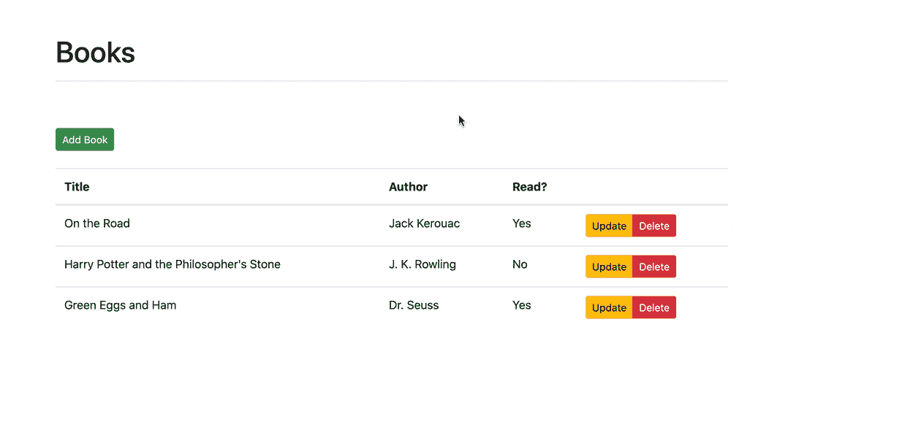

*主要依赖:*

*   视图 v2.6.11
*   CLI 视图 v4.5.11
*   节点 v15.7.0
*   国家预防机制 7.4.3 版
*   烧瓶 v1.1.2
*   python 3 . 9 . 1 版

## 目标

本教程结束时，您将能够:

1.  解释什么是烧瓶
2.  解释什么是 Vue，以及它与其他 UI 库和前端框架(如 React 和 Angular)相比如何
3.  使用 Vue CLI 搭建 Vue 项目
4.  在浏览器中创建和渲染 Vue 组件
5.  使用 Vue 组件创建单页面应用程序(SPA)
6.  将 Vue 应用程序连接到 Flask 后端
7.  用 Flask 开发 RESTful API
8.  使用引导程序设计 Vue 组件
9.  使用 Vue 路由器创建路线并渲染组件

## 烧瓶和 Vue

让我们快速看一下每个框架。

### 烧瓶是什么？

Flask 是一个简单而强大的 Python 微型 web 框架，非常适合构建 RESTful APIs。像 [Sinatra](http://sinatrarb.com/) (Ruby)和 [Express](https://expressjs.com/) (Node)一样，它是最小和灵活的，所以你可以从小处着手，根据需要构建一个更复杂的应用。

第一次用烧瓶？查看以下两个资源:

1.  [flask TDD](https://github.com/mjhea0/flaskr-tdd)
2.  [用 Python 和 Flask 开发 Web 应用](/courses/learn-flask/)

### Vue 是什么？

Vue 是一个开源的 JavaScript 框架，用于构建用户界面。它采用了 React 和 Angular 的一些最佳实践。也就是说，与 React 和 Angular 相比，它要平易近人得多，因此初学者可以快速上手并运行。它也同样强大，因此它提供了创建现代前端应用程序所需的所有功能。

有关 Vue 的更多信息，以及使用它与 React 和 Angular 相比的优缺点，请查看参考资料:

1.  [Vue:与其他框架的比较](https://vuejs.org/v2/guide/comparison.html)
2.  [通过构建和部署 CRUD 应用程序学习 Vue](/courses/learn-vue/)
3.  [反应 vs 角度 vs Vue.js](https://medium.com/techmagic/reactjs-vs-angular5-vs-vue-js-what-to-choose-in-2018-b91e028fa91d)

第一次和 Vue 在一起？花点时间通读官方 Vue 指南中的[介绍](https://vuejs.org/v2/guide/index.html)。

## 烧瓶设置

首先创建一个新的项目目录:

```
`$ mkdir flask-vue-crud
$ cd flask-vue-crud` 
```

在“flask-vue-crud”中，创建一个名为“server”的新目录。然后，在“服务器”目录中创建并激活虚拟环境:

```
`$ python3.9 -m venv env
$ source env/bin/activate
(env)$` 
```

> 根据您的环境，上述命令可能会有所不同。

将烧瓶连同[烧瓶-CORS](http://flask-cors.readthedocs.io/) 延长件一起安装；

```
`(env)$ pip install Flask==1.1.2 Flask-Cors==3.0.10` 
```

向新创建的“服务器”目录添加一个 *app.py* 文件:

```
`from flask import Flask, jsonify
from flask_cors import CORS

# configuration
DEBUG = True

# instantiate the app
app = Flask(__name__)
app.config.from_object(__name__)

# enable CORS
CORS(app, resources={r'/*': {'origins': '*'}})

# sanity check route
@app.route('/ping', methods=['GET'])
def ping_pong():
    return jsonify('pong!')

if __name__ == '__main__':
    app.run()` 
```

我们为什么需要弗拉斯克-CORS？为了进行跨来源请求——例如，来自不同协议、IP 地址、域名或端口的请求——您需要启用[跨来源资源共享](https://en.wikipedia.org/wiki/Cross-origin_resource_sharing) (CORS)。弗拉斯克-CORS 公司为我们处理此事。

> 值得注意的是，上面的设置允许来自*任何*域、协议或端口的*所有*路由上的跨来源请求。在生产环境中，您应该*仅*允许来自托管前端应用程序的域的跨来源请求。参考[烧瓶-CORS 文档](http://flask-cors.readthedocs.io/)了解更多信息。

运行应用程序:

要进行测试，将您的浏览器指向[http://localhost:5000/ping](http://localhost:5000/ping)。您应该看到:

回到终端，按 Ctrl+C 终止服务器，然后导航回项目根目录。现在，让我们把注意力转向前端，设置 Vue。

## 视图设置

我们将使用强大的 [Vue CLI](https://cli.vuejs.org/) 来生成定制的项目样板文件。

全局安装:

> 第一次用 npm？查看关于 npm 的官方[指南。](https://docs.npmjs.com/about-npm/)

然后，在“flask-vue-crud”中，运行以下命令来初始化一个名为`client`的新 vue 项目:

这需要你回答几个关于这个项目的问题。

```
`Vue CLI v4.5.11
? Please pick a preset: (Use arrow keys)
❯ Default ([Vue 2] babel, eslint)
  Default (Vue 3 Preview) ([Vue 3] babel, eslint)
  Manually select features` 
```

使用向下箭头键选中“手动选择功能”，然后按 enter 键。接下来，您需要选择想要安装的功能。对于本教程，选择“选择 Vue 版本”、“Babel”、“Router”和“Linter / Formatter”，如下所示:

```
`Vue CLI v4.5.11
? Please pick a preset: Manually select features
? Check the features needed for your project:
❯◉ Choose Vue version
 ◉ Babel
 ◯ TypeScript
 ◯ Progressive Web App (PWA) Support
 ◉ Router
 ◯ Vuex
 ◯ CSS Pre-processors
 ◉ Linter / Formatter
 ◯ Unit Testing
 ◯ E2E Testing` 
```

按回车键。

为 Vue 版本选择“2.x”。对路由器使用历史模式。为 linter 选择“ESLint + Airbnb 配置”和“保存时 Lint”。最后，选择“In package.json”选项，以便将配置放在 *package.json* 文件中，而不是单独的配置文件中。

您应该会看到类似如下的内容:

```
`Vue CLI v4.5.11
? Please pick a preset: Manually select features
? Check the features needed for your project: Choose Vue version, Babel, Router, Linter
? Choose a version of Vue.js that you want to start the project with 2.x
? Use history mode for router? (Requires proper server setup for index fallback in production) Yes
? Pick a linter / formatter config: Airbnb
? Pick additional lint features: Lint on save
? Where do you prefer placing config for Babel, ESLint, etc.? In package.json
? Save this as a preset for future projects? (y/N) No` 
```

再次按 enter 配置项目结构并安装依赖项。

快速查看一下生成的项目结构。这看起来似乎很多，但是我们将*只*处理“src”文件夹中的文件和文件夹，以及在“public”文件夹中找到的*index.html*文件。

index.html 文件是我们的 Vue 应用程序的起点。

```
`<!DOCTYPE html>
<html lang="">
  <head>
    <meta charset="utf-8">
    <meta http-equiv="X-UA-Compatible" content="IE=edge">
    <meta name="viewport" content="width=device-width,initial-scale=1.0">
    <link rel="icon" href="<%= BASE_URL %>favicon.ico">
    <title><%= htmlWebpackPlugin.options.title %></title>
  </head>
  <body>
    <noscript>
      <strong>We're sorry but <%= htmlWebpackPlugin.options.title %> doesn't work properly without JavaScript enabled. Please enable it to continue.</strong>
    </noscript>
    <div id="app"></div>
    <!-- built files will be auto injected -->
  </body>
</html>` 
```

注意带有`app`的`id`的`<div>`元素。这是一个占位符，Vue 将使用它来附加生成的 HTML 和 CSS 以生成 UI。

请注意“src”文件夹中的文件夹:

```
`client/src
├── App.vue
├── assets
│   └── logo.png
├── components
│   └── HelloWorld.vue
├── main.js
├── router
│   └── index.js
└── views
    ├── About.vue
    └── Home.vue` 
```

情绪完全失控

| 名字 | 目的 |
| --- | --- |
| *main.js* | app 入口点，它加载并初始化 Vue 以及根组件 |
| *app . view* | 根组件，这是渲染所有其他组件的起点 |
| "组件" | 存储 UI 组件的位置 |
| *路由器/index.js* | 其中定义了 URL 并将其映射到组件 |
| "观点" | 其中存储了与路由器相关联的 UI 组件 |
| "资产" | 存储静态资产(如图像和字体)的地方 |

查看*client/src/components/hello world . vue*文件。这是一个[单文件](https://vuejs.org/v2/guide/single-file-components.html)组件，它被分成三个不同的部分:

1.  *模板*:针对特定于组件的 HTML
2.  *脚本*:组件逻辑通过 JavaScript 实现
3.  *样式*:针对 CSS 样式

启动开发服务器:

```
`$ cd client
$ npm run serve` 
```

在您选择的浏览器中导航到 [http://localhost:8080](http://localhost:8080) 。您应该看到以下内容:

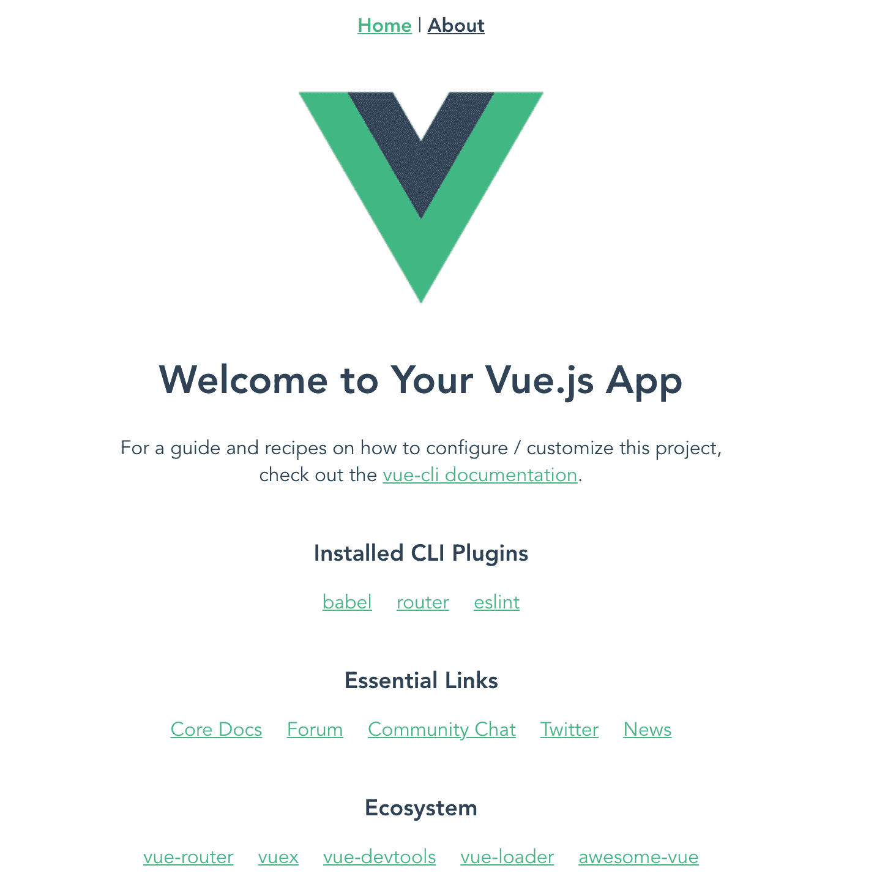

为了简单起见，删除“client/src/views”文件夹。然后，在“client/src/components”文件夹中添加一个名为 *Ping.vue* 的新组件:

```
`<template>
  <div>
    <p>{{ msg }}</p>
  </div>
</template>

<script> export  default  { name:  'Ping', data()  { return  { msg:  'Hello!', }; }, }; </script>` 
```

更新*client/src/router/index . js*，将“/ping”映射到`Ping`组件，如下所示:

```
`import  Vue  from  'vue'; import  Router  from  'vue-router'; import  Ping  from  '../components/Ping.vue'; Vue.use(Router); export  default  new  Router({ mode:  'history', base:  process.env.BASE_URL, routes:  [ { path:  '/ping', name:  'Ping', component:  Ping, }, ], });` 
```

最后，在 *client/src/App.vue* 中，移除导航和样式:

```
`<template>
  <div id="app">
    <router-view/>
  </div>
</template>` 
```

你现在应该在浏览器的[中看到`Hello!`http://localhost:8080/ping](http://localhost:8080/ping)。

为了连接客户端 Vue 应用程序和后端 Flask 应用程序，我们可以使用 [axios](https://github.com/axios/axios) 库来发送 AJAX 请求。

从安装开始:

在 *Ping.vue* 中更新组件的`script`部分，如下所示:

```
`<script> import  axios  from  'axios'; export  default  { name:  'Ping', data()  { return  { msg:  '', }; }, methods:  { getMessage()  { const  path  =  'http://localhost:5000/ping'; axios.get(path) .then((res)  =>  { this.msg  =  res.data; }) .catch((error)  =>  { // eslint-disable-next-line console.error(error); }); }, }, created()  { this.getMessage(); }, }; </script>` 
```

在新的终端窗口启动 Flask 应用程序。您应该会在浏览器中看到`pong!`。本质上，当一个响应从后端返回时，我们将响应对象中的`msg`设置为`data`的值。

## 自举设置

接下来，让我们将 Bootstrap(一个流行的 CSS 框架)添加到应用程序中，这样我们就可以快速添加一些样式。

安装:

> 忽略`jquery`和`popper.js`的警告。不要将这两者添加到项目中。稍后将详细介绍。

将引导样式导入到 *client/src/main.js* :

```
`import  Vue  from  'vue'; import  App  from  './App.vue'; import  router  from  './router'; import  'bootstrap/dist/css/bootstrap.css'; Vue.config.productionTip  =  false; new  Vue({ router, render:  (h)  =>  h(App), }).$mount('#app');` 
```

更新 *client/src/App.vue* 中的`style`部分:

```
`<style> #app  { margin-top:  60px } </style>` 
```

使用`Ping`组件中的[按钮](https://getbootstrap.com/docs/4.6/components/buttons/)和[容器](https://getbootstrap.com/docs/4.6/layout/overview/#containers)确保自举正确连接；

```
`<template>
  <div class="container">
    <button type="button" class="btn btn-primary">{{ msg }}</button>
  </div>
</template>` 
```

运行开发服务器:

您应该看到:

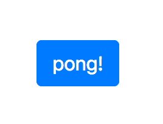

接下来，在名为 *Books.vue* 的新文件中添加一个名为`Books`的新组件:

```
`<template>
  <div class="container">
    <p>books</p>
  </div>
</template>` 
```

更新路由器:

```
`import  Vue  from  'vue'; import  Router  from  'vue-router'; import  Books  from  '../components/Books.vue'; import  Ping  from  '../components/Ping.vue'; Vue.use(Router); export  default  new  Router({ mode:  'history', base:  process.env.BASE_URL, routes:  [ { path:  '/', name:  'Books', component:  Books, }, { path:  '/ping', name:  'Ping', component:  Ping, }, ], });` 
```

测试:

1.  [http://localhost:8080](http://localhost:8080)
2.  [http://localhost:8080/ping](http://localhost:8080/ping)

最后，让我们向`Books`组件添加一个快速的、引导样式的表格:

```
`<template>
  <div class="container">
    <div class="row">
      <div class="col-sm-10">
        <h1>Books</h1>
        <hr><br><br>
        <button type="button" class="btn btn-success btn-sm">Add Book</button>
        <br><br>
        <table class="table table-hover">
          <thead>
            <tr>
              <th scope="col">Title</th>
              <th scope="col">Author</th>
              <th scope="col">Read?</th>
              <th></th>
            </tr>
          </thead>
          <tbody>
            <tr>
              <td>foo</td>
              <td>bar</td>
              <td>foobar</td>
              <td>
                <div class="btn-group" role="group">
                  <button type="button" class="btn btn-warning btn-sm">Update</button>
                  <button type="button" class="btn btn-danger btn-sm">Delete</button>
                </div>
              </td>
            </tr>
          </tbody>
        </table>
      </div>
    </div>
  </div>
</template>` 
```

您现在应该看到:

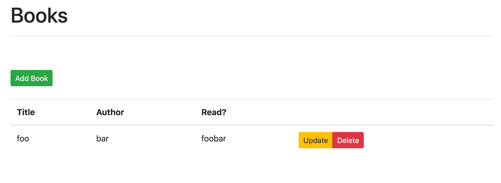

现在我们可以开始构建 CRUD 应用程序的功能了。

## 我们在建造什么？

我们的目标是为一个单一的资源书籍设计一个后端 RESTful API，由 Python 和 Flask 提供支持。API 本身应该遵循 RESTful 设计原则，使用基本的 HTTP 动词:GET、POST、PUT 和 DELETE。

我们还将设置一个使用 Vue 的前端应用程序，它使用后端 API:


> 本教程只讨论快乐之路。处理错误是一个单独的练习。检查您的理解，并在前端和后端添加适当的错误处理。

## 获取路线

### 计算机网络服务器

将图书列表添加到 *server/app.py* :

```
`BOOKS = [
    {
        'title': 'On the Road',
        'author': 'Jack Kerouac',
        'read': True
    },
    {
        'title': 'Harry Potter and the Philosopher\'s Stone',
        'author': 'J. K. Rowling',
        'read': False
    },
    {
        'title': 'Green Eggs and Ham',
        'author': 'Dr. Seuss',
        'read': True
    }
]` 
```

添加路由处理程序:

```
`@app.route('/books', methods=['GET'])
def all_books():
    return jsonify({
        'status': 'success',
        'books': BOOKS
    })` 
```

运行 Flask 应用程序，如果它还没有运行的话，然后在[http://localhost:5000/books](http://localhost:5000/books)上手动测试路线。

> 寻找额外的挑战？为此编写一个自动化测试。查看[这个](https://github.com/mjhea0/flaskr-tdd)资源，了解更多关于测试 Flask 应用的信息。

### 客户

更新组件:

```
`<template>
  <div class="container">
    <div class="row">
      <div class="col-sm-10">
        <h1>Books</h1>
        <hr><br><br>
        <button type="button" class="btn btn-success btn-sm">Add Book</button>
        <br><br>
        <table class="table table-hover">
          <thead>
            <tr>
              <th scope="col">Title</th>
              <th scope="col">Author</th>
              <th scope="col">Read?</th>
              <th></th>
            </tr>
          </thead>
          <tbody>
            <tr v-for="(book, index) in books" :key="index">
              <td>{{ book.title }}</td>
              <td>{{ book.author }}</td>
              <td>
                <span v-if="book.read">Yes</span>
                <span v-else>No</span>
              </td>
              <td>
                <div class="btn-group" role="group">
                  <button type="button" class="btn btn-warning btn-sm">Update</button>
                  <button type="button" class="btn btn-danger btn-sm">Delete</button>
                </div>
              </td>
            </tr>
          </tbody>
        </table>
      </div>
    </div>
  </div>
</template>

<script> import  axios  from  'axios'; export  default  { data()  { return  { books:  [], }; }, methods:  { getBooks()  { const  path  =  'http://localhost:5000/books'; axios.get(path) .then((res)  =>  { this.books  =  res.data.books; }) .catch((error)  =>  { // eslint-disable-next-line console.error(error); }); }, }, created()  { this.getBooks(); }, }; </script>` 
```

组件初始化后，通过[创建的](https://vuejs.org/v2/api/#created)生命周期钩子调用`getBooks()`方法，从我们刚刚设置的后端端点获取书籍。

> 查看[实例生命周期挂钩](https://vuejs.org/v2/guide/instance.html#Instance-Lifecycle-Hooks)以获得更多关于组件生命周期和可用方法的信息。

在模板中，我们通过 [v-for](https://vuejs.org/v2/guide/list.html) 指令遍历图书列表，在每次迭代中创建一个新的表行。索引值被用作[键](https://vuejs.org/v2/guide/list.html#key)。最后， [v-if](https://vuejs.org/v2/guide/conditional.html#v-if) 用于渲染`Yes`或`No`，表示用户是否读过这本书。

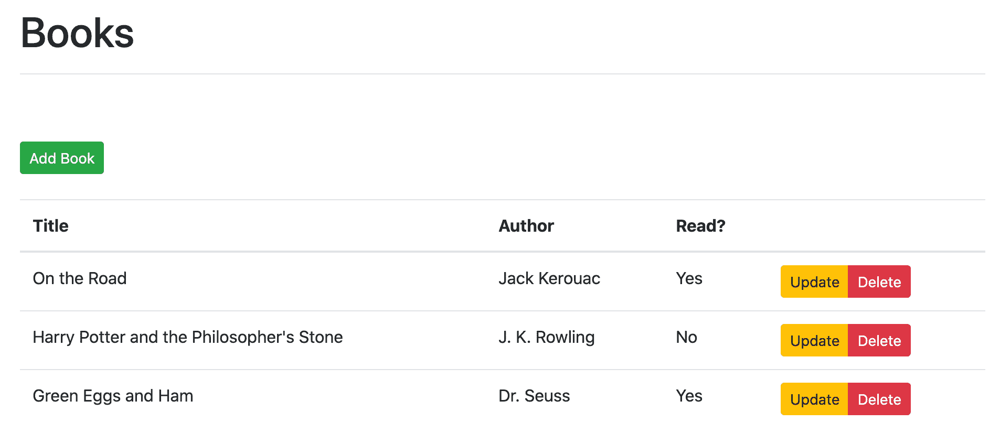

## 引导程序视图

在下一节中，我们将使用一个模态来添加一本新书。我们将为此添加 [Bootstrap Vue](https://bootstrap-vue.js.org/) 库，它提供了一组 Vue 组件，使用基于 Bootstrap 的 HTML 和 CSS。

> 为什么选择 Bootstrap Vue？Bootstrap 的[模态](https://getbootstrap.com/docs/4.1/components/modal/)组件使用 [jQuery](https://jquery.com/) ，你应该避免在同一个项目中与 Vue 一起使用，因为 Vue 使用[虚拟 Dom](https://vuejs.org/v2/guide/render-function.html#Nodes-Trees-and-the-Virtual-DOM) 来更新 Dom。换句话说，如果您确实使用 jQuery 来操作 DOM，Vue 不会知道。至少，如果你绝对需要使用 jQuery，不要在同一个 DOM 元素上同时使用 Vue 和 jQuery。

安装:

启用 *client/src/main.js* 中的 Bootstrap Vue 库:

```
`import  BootstrapVue  from  'bootstrap-vue'; import  Vue  from  'vue'; import  App  from  './App.vue'; import  router  from  './router'; import  'bootstrap/dist/css/bootstrap.css'; Vue.use(BootstrapVue); Vue.config.productionTip  =  false; new  Vue({ router, render:  (h)  =>  h(App), }).$mount('#app');` 
```

## 邮寄路线

### 计算机网络服务器

更新现有的路由处理程序，以处理添加新书的 POST 请求:

```
`@app.route('/books', methods=['GET', 'POST'])
def all_books():
    response_object = {'status': 'success'}
    if request.method == 'POST':
        post_data = request.get_json()
        BOOKS.append({
            'title': post_data.get('title'),
            'author': post_data.get('author'),
            'read': post_data.get('read')
        })
        response_object['message'] = 'Book added!'
    else:
        response_object['books'] = BOOKS
    return jsonify(response_object)` 
```

更新导入:

```
`from flask import Flask, jsonify, request` 
```

当 Flask 服务器运行时，您可以在新的终端选项卡中测试 POST 路由:

```
`$ curl -X POST http://localhost:5000/books -d \
  '{"title": "1Q84", "author": "Haruki Murakami", "read": "true"}' \
  -H 'Content-Type: application/json'` 
```

您应该看到:

```
`{
  "message": "Book added!",
  "status": "success"
}` 
```

您还应该在来自[http://localhost:5000/books](http://localhost:5000/books)端点的响应中看到这本新书。

> 标题已经存在怎么办？或者一个书名有多个作者怎么办？通过处理这些案例来检查你的理解。此外，当`title`、`author`和/或`read`丢失时，如何处理无效的有效载荷？

### 客户

在客户端，现在让我们添加一个用于向`Books`组件添加新书的模型，从 HTML:

```
`<b-modal ref="addBookModal"
         id="book-modal"
         title="Add a new book"
         hide-footer>
  <b-form @submit="onSubmit" @reset="onReset" class="w-100">
  <b-form-group id="form-title-group"
                label="Title:"
                label-for="form-title-input">
      <b-form-input id="form-title-input"
                    type="text"
                    v-model="addBookForm.title"
                    required
                    placeholder="Enter title">
      </b-form-input>
    </b-form-group>
    <b-form-group id="form-author-group"
                  label="Author:"
                  label-for="form-author-input">
        <b-form-input id="form-author-input"
                      type="text"
                      v-model="addBookForm.author"
                      required
                      placeholder="Enter author">
        </b-form-input>
      </b-form-group>
    <b-form-group id="form-read-group">
      <b-form-checkbox-group v-model="addBookForm.read" id="form-checks">
        <b-form-checkbox value="true">Read?</b-form-checkbox>
      </b-form-checkbox-group>
    </b-form-group>
    <b-button type="submit" variant="primary">Submit</b-button>
    <b-button type="reset" variant="danger">Reset</b-button>
  </b-form>
</b-modal>` 
```

在结束的`div`标签前添加这个。快速浏览一下代码。`v-model`是用于[将](https://vuejs.org/v2/guide/forms.html)输入值绑定回状态的指令。您将很快看到这一点。

> `hide-footer`是做什么的？在 Bootstrap Vue [docs](https://bootstrap-vue.org/docs/components/modal/) 中自己回顾一下。

更新`script`部分:

```
`<script> import  axios  from  'axios'; export  default  { data()  { return  { books:  [], addBookForm:  { title:  '', author:  '', read:  [], }, }; }, methods:  { getBooks()  { const  path  =  'http://localhost:5000/books'; axios.get(path) .then((res)  =>  { this.books  =  res.data.books; }) .catch((error)  =>  { // eslint-disable-next-line console.error(error); }); }, addBook(payload)  { const  path  =  'http://localhost:5000/books'; axios.post(path,  payload) .then(()  =>  { this.getBooks(); }) .catch((error)  =>  { // eslint-disable-next-line console.log(error); this.getBooks(); }); }, initForm()  { this.addBookForm.title  =  ''; this.addBookForm.author  =  ''; this.addBookForm.read  =  []; }, onSubmit(evt)  { evt.preventDefault(); this.$refs.addBookModal.hide(); let  read  =  false; if  (this.addBookForm.read[0])  read  =  true; const  payload  =  { title:  this.addBookForm.title, author:  this.addBookForm.author, read,  // property shorthand }; this.addBook(payload); this.initForm(); }, onReset(evt)  { evt.preventDefault(); this.$refs.addBookModal.hide(); this.initForm(); }, }, created()  { this.getBooks(); }, }; </script>` 
```

这里发生了什么事？

1.  `addBookForm`是否通过`v-model`将[绑定到](https://vuejs.org/v2/guide/forms.html#Basic-Usage)表单输入。换句话说，当一个被更新时，另一个也会被更新。这叫做双向绑定。请花点时间阅读一下[这里](https://stackoverflow.com/questions/13504906/what-is-two-way-binding)。想想这件事的后果。你认为这使国家管理更容易还是更难？React 和 Angular 如何处理这个问题？在我看来，双向绑定(以及可变性)使得 Vue 比 React 更容易接近。
2.  当用户成功提交表单时，触发`onSubmit`。在提交时，我们阻止正常的浏览器行为(`evt.preventDefault()`)，关闭模态(`this.$refs.addBookModal.hide()`)，触发`addBook`方法，并清除表单(`initForm()`)。
3.  `addBook`向`/books`发送 POST 请求以添加新书。

根据需要参考 Vue [文档](https://vuejs.org/v2/guide/)，自行检查其余的变更。

> 您能想到客户端或服务器上的任何潜在错误吗？自己处理这些以改善用户体验。

最后，更新模板中的“Add Book”按钮，以便在单击按钮时显示模式:

```
`<button type="button" class="btn btn-success btn-sm" v-b-modal.book-modal>Add Book</button>` 
```

该组件现在应该如下所示:

```
`<template>
  <div class="container">
    <div class="row">
      <div class="col-sm-10">
        <h1>Books</h1>
        <hr><br><br>
        <button type="button" class="btn btn-success btn-sm" v-b-modal.book-modal>Add Book</button>
        <br><br>
        <table class="table table-hover">
          <thead>
            <tr>
              <th scope="col">Title</th>
              <th scope="col">Author</th>
              <th scope="col">Read?</th>
              <th></th>
            </tr>
          </thead>
          <tbody>
            <tr v-for="(book, index) in books" :key="index">
              <td>{{ book.title }}</td>
              <td>{{ book.author }}</td>
              <td>
                <span v-if="book.read">Yes</span>
                <span v-else>No</span>
              </td>
              <td>
                <div class="btn-group" role="group">
                  <button type="button" class="btn btn-warning btn-sm">Update</button>
                  <button type="button" class="btn btn-danger btn-sm">Delete</button>
                </div>
              </td>
            </tr>
          </tbody>
        </table>
      </div>
    </div>
    <b-modal ref="addBookModal"
            id="book-modal"
            title="Add a new book"
            hide-footer>
      <b-form @submit="onSubmit" @reset="onReset" class="w-100">
      <b-form-group id="form-title-group"
                    label="Title:"
                    label-for="form-title-input">
          <b-form-input id="form-title-input"
                        type="text"
                        v-model="addBookForm.title"
                        required
                        placeholder="Enter title">
          </b-form-input>
        </b-form-group>
        <b-form-group id="form-author-group"
                      label="Author:"
                      label-for="form-author-input">
            <b-form-input id="form-author-input"
                          type="text"
                          v-model="addBookForm.author"
                          required
                          placeholder="Enter author">
            </b-form-input>
          </b-form-group>
        <b-form-group id="form-read-group">
          <b-form-checkbox-group v-model="addBookForm.read" id="form-checks">
            <b-form-checkbox value="true">Read?</b-form-checkbox>
          </b-form-checkbox-group>
        </b-form-group>
        <b-button-group>
          <b-button type="submit" variant="primary">Submit</b-button>
          <b-button type="reset" variant="danger">Reset</b-button>
        </b-button-group>
      </b-form>
    </b-modal>
  </div>
</template>

<script> import  axios  from  'axios'; export  default  { data()  { return  { books:  [], addBookForm:  { title:  '', author:  '', read:  [], }, }; }, methods:  { getBooks()  { const  path  =  'http://localhost:5000/books'; axios.get(path) .then((res)  =>  { this.books  =  res.data.books; }) .catch((error)  =>  { // eslint-disable-next-line console.error(error); }); }, addBook(payload)  { const  path  =  'http://localhost:5000/books'; axios.post(path,  payload) .then(()  =>  { this.getBooks(); }) .catch((error)  =>  { // eslint-disable-next-line console.log(error); this.getBooks(); }); }, initForm()  { this.addBookForm.title  =  ''; this.addBookForm.author  =  ''; this.addBookForm.read  =  []; }, onSubmit(evt)  { evt.preventDefault(); this.$refs.addBookModal.hide(); let  read  =  false; if  (this.addBookForm.read[0])  read  =  true; const  payload  =  { title:  this.addBookForm.title, author:  this.addBookForm.author, read,  // property shorthand }; this.addBook(payload); this.initForm(); }, onReset(evt)  { evt.preventDefault(); this.$refs.addBookModal.hide(); this.initForm(); }, }, created()  { this.getBooks(); }, }; </script>` 
```

测试一下！尝试添加一本书:

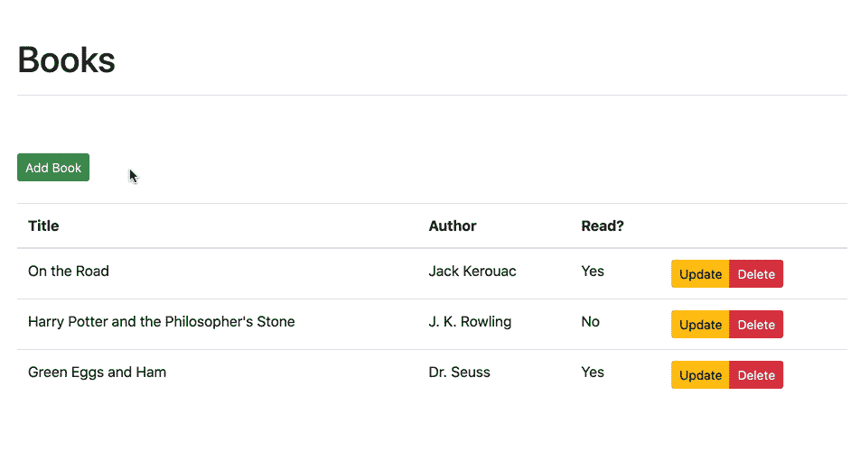

## 警报组件

接下来，让我们添加一个 [Alert](https://bootstrap-vue.org/docs/components/alert/) 组件，在添加新书后向最终用户显示一条消息。我们将为此创建一个新组件，因为您可能会在许多组件中使用该功能。

将名为 *Alert.vue* 的新文件添加到“客户端/src/组件”中:

```
`<template>
  <p>It works!</p>
</template>` 
```

然后，将其导入到`Books`组件的`script`部分，并注册该组件:

```
`<script> import  axios  from  'axios'; import  Alert  from  './Alert.vue'; ... export  default  { data()  { return  { books:  [], addBookForm:  { title:  '', author:  '', read:  [], }, }; }, components:  { alert:  Alert, }, ... }; </script>` 
```

现在，我们可以在`template`部分引用新组件:

```
`<template>
  <b-container>
    <b-row>
      <b-col col sm="10">
        <h1>Books</h1>
        <hr><br><br>
        <alert></alert>
        <button type="button" class="btn btn-success btn-sm" v-b-modal.book-modal>Add Book</button>

        ...

      </b-col>
    </b-row>
  </b-container>
</template>` 
```

刷新浏览器。您现在应该看到:

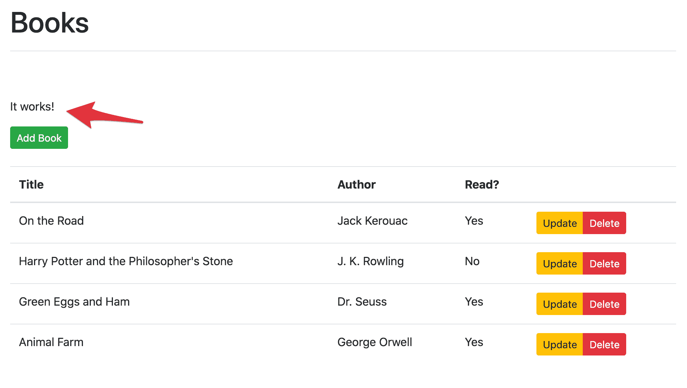

> 查看官方 Vue 文档中的 [Composing with Components](https://vuejs.org/v2/guide/index.html#Composing-with-Components) 以获得更多关于在其他组件中使用组件的信息。

接下来，让我们添加实际的 [b-alert](https://bootstrap-vue.org/docs/components/alert/) 组件*client/src/components/alert . vue*:

```
`<template>
  <div>
    <b-alert variant="success" show>{{ message }}</b-alert>
    <br>
  </div>
</template>

<script> export  default  { props:  ['message'], }; </script>` 
```

注意`script`部分的[道具](https://vuejs.org/v2/guide/components-props.html)选项。我们可以像这样从父组件(`Books`)向下传递消息:

```
`<alert message="hi"></alert>` 
```

试试这个:

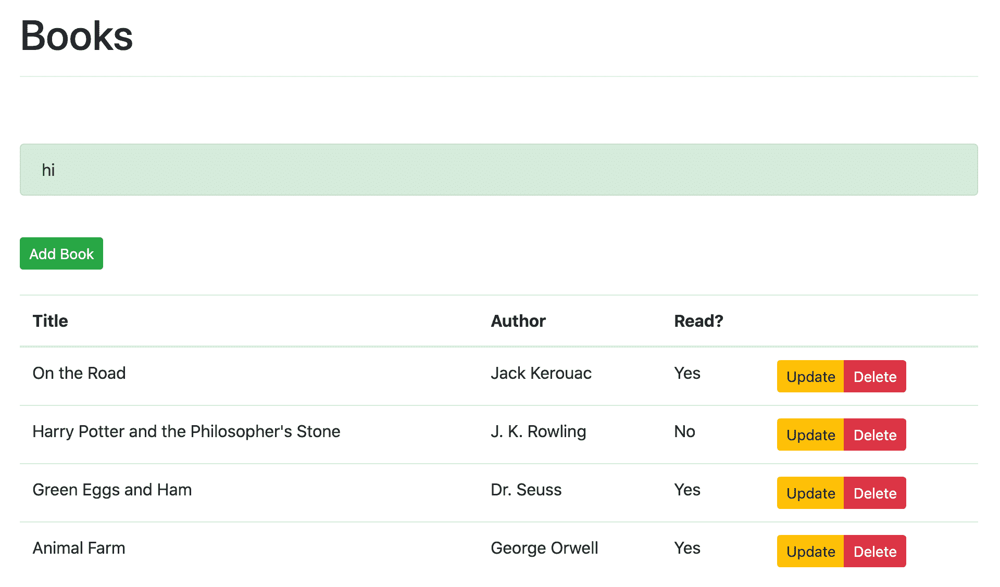

> 查看[文档](https://vuejs.org/v2/guide/components.html#Passing-Data-to-Child-Components-with-Props)了解更多关于道具的信息。

为了使其动态，以便传递自定义消息，在 *Books.vue* 中使用一个[绑定表达式](https://vuejs.org/v2/guide/syntax.html#v-bind-Shorthand):

```
`<alert :message="message"></alert>` 
```

将`message`添加到`data`选项中，同样在*书籍中。vue* 中:

```
`data()  { return  { books:  [], addBookForm:  { title:  '', author:  '', read:  [], }, message:  '', }; },` 
```

然后，在`addBook`内，更新消息:

```
`addBook(payload)  { const  path  =  'http://localhost:5000/books'; axios.post(path,  payload) .then(()  =>  { this.getBooks(); this.message  =  'Book added!'; }) .catch((error)  =>  { // eslint-disable-next-line console.log(error); this.getBooks(); }); },` 
```

最后，添加一个`v-if`，这样只有当`showMessage`为真时才会显示警告:

```
`<alert :message=message v-if="showMessage"></alert>` 
```

将`showMessage`添加到`data`中:

```
`data()  { return  { books:  [], addBookForm:  { title:  '', author:  '', read:  [], }, message:  '', showMessage:  false, }; },` 
```

再次更新`addBook`，将`showMessage`设置为`true`:

```
`addBook(payload)  { const  path  =  'http://localhost:5000/books'; axios.post(path,  payload) .then(()  =>  { this.getBooks(); this.message  =  'Book added!'; this.showMessage  =  true; }) .catch((error)  =>  { // eslint-disable-next-line console.log(error); this.getBooks(); }); },` 
```

测试一下！

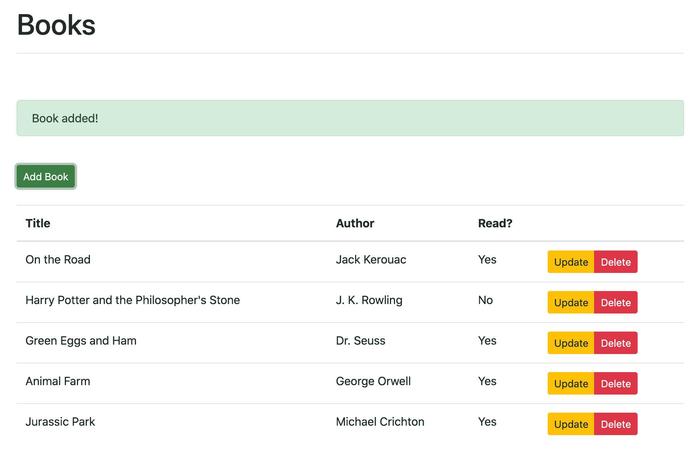

> 挑战:
> 
> 1.  想想`showMessage`应该设置在哪里`false`。更新您的代码。
> 2.  尝试使用警报组件来显示错误。
> 3.  将警报重构为[可解除](https://bootstrap-vue.org/docs/components/alert/#dismissible-alerts)。

## 放置路线

### 计算机网络服务器

对于更新，我们将需要使用一个唯一的标识符，因为我们不能依赖标题是唯一的。我们可以使用来自 Python [标准库](https://docs.python.org/3/library/uuid.html)的`uuid`。

更新 *server/app.py* 中的`BOOKS`:

```
`BOOKS = [
    {
        'id': uuid.uuid4().hex,
        'title': 'On the Road',
        'author': 'Jack Kerouac',
        'read': True
    },
    {
        'id': uuid.uuid4().hex,
        'title': 'Harry Potter and the Philosopher\'s Stone',
        'author': 'J. K. Rowling',
        'read': False
    },
    {
        'id': uuid.uuid4().hex,
        'title': 'Green Eggs and Ham',
        'author': 'Dr. Seuss',
        'read': True
    }
]` 
```

不要忘记重要的一点:

添加新书时，重构`all_books`以考虑唯一 id:

```
`@app.route('/books', methods=['GET', 'POST'])
def all_books():
    response_object = {'status': 'success'}
    if request.method == 'POST':
        post_data = request.get_json()
        BOOKS.append({
            'id': uuid.uuid4().hex,
            'title': post_data.get('title'),
            'author': post_data.get('author'),
            'read': post_data.get('read')
        })
        response_object['message'] = 'Book added!'
    else:
        response_object['books'] = BOOKS
    return jsonify(response_object)` 
```

添加新的路由处理程序:

```
`@app.route('/books/<book_id>', methods=['PUT'])
def single_book(book_id):
    response_object = {'status': 'success'}
    if request.method == 'PUT':
        post_data = request.get_json()
        remove_book(book_id)
        BOOKS.append({
            'id': uuid.uuid4().hex,
            'title': post_data.get('title'),
            'author': post_data.get('author'),
            'read': post_data.get('read')
        })
        response_object['message'] = 'Book updated!'
    return jsonify(response_object)` 
```

添加助手:

```
`def remove_book(book_id):
    for book in BOOKS:
        if book['id'] == book_id:
            BOOKS.remove(book)
            return True
    return False` 
```

> 花点时间想想你会如何处理一个不存在的`id`的情况。有效载荷不正确怎么办？在 helper 中重构 for 循环，使它更 Pythonic 化。

### 客户

步骤:

1.  添加模态和形式
2.  处理更新按钮单击
3.  连接 AJAX 请求
4.  警告用户
5.  处理取消按钮单击

#### (1)添加情态和形式

首先，在模板中添加一个新的模态，就在第一个模态的下面:

```
`<b-modal ref="editBookModal"
         id="book-update-modal"
         title="Update"
         hide-footer>
  <b-form @submit="onSubmitUpdate" @reset="onResetUpdate" class="w-100">
  <b-form-group id="form-title-edit-group"
                label="Title:"
                label-for="form-title-edit-input">
      <b-form-input id="form-title-edit-input"
                    type="text"
                    v-model="editForm.title"
                    required
                    placeholder="Enter title">
      </b-form-input>
    </b-form-group>
    <b-form-group id="form-author-edit-group"
                  label="Author:"
                  label-for="form-author-edit-input">
        <b-form-input id="form-author-edit-input"
                      type="text"
                      v-model="editForm.author"
                      required
                      placeholder="Enter author">
        </b-form-input>
      </b-form-group>
    <b-form-group id="form-read-edit-group">
      <b-form-checkbox-group v-model="editForm.read" id="form-checks">
        <b-form-checkbox value="true">Read?</b-form-checkbox>
      </b-form-checkbox-group>
    </b-form-group>
    <b-button-group>
      <b-button type="submit" variant="primary">Update</b-button>
      <b-button type="reset" variant="danger">Cancel</b-button>
    </b-button-group>
  </b-form>
</b-modal>` 
```

将表单状态添加到`script`部分的`data`部分:

```
`editForm:  { id:  '', title:  '', author:  '', read:  [], },` 
```

> 挑战:不要使用新的模式，尝试使用相同的模式来处理 POST 和 PUT 请求。

#### (2)点击处理更新按钮

更新表格中的“更新”按钮:

```
`<button
        type="button"
        class="btn btn-warning btn-sm"
        v-b-modal.book-update-modal
        @click="editBook(book)">
    Update
</button>` 
```

添加一个新方法来更新`editForm`中的值:

```
`editBook(book)  { this.editForm  =  book; },` 
```

然后，添加一个方法来处理表单提交:

```
`onSubmitUpdate(evt)  { evt.preventDefault(); this.$refs.editBookModal.hide(); let  read  =  false; if  (this.editForm.read[0])  read  =  true; const  payload  =  { title:  this.editForm.title, author:  this.editForm.author, read, }; this.updateBook(payload,  this.editForm.id); },` 
```

#### (3)连接 AJAX 请求

```
`updateBook(payload,  bookID)  { const  path  =  `http://localhost:5000/books/${bookID}`; axios.put(path,  payload) .then(()  =>  { this.getBooks(); }) .catch((error)  =>  { // eslint-disable-next-line console.error(error); this.getBooks(); }); },` 
```

#### (4)提醒用户

更新`updateBook`:

```
`updateBook(payload,  bookID)  { const  path  =  `http://localhost:5000/books/${bookID}`; axios.put(path,  payload) .then(()  =>  { this.getBooks(); this.message  =  'Book updated!'; this.showMessage  =  true; }) .catch((error)  =>  { // eslint-disable-next-line console.error(error); this.getBooks(); }); },` 
```

#### (5)点击手柄取消按钮

添加方法:

```
`onResetUpdate(evt)  { evt.preventDefault(); this.$refs.editBookModal.hide(); this.initForm(); this.getBooks();  // why? },` 
```

更新`initForm`:

```
`initForm()  { this.addBookForm.title  =  ''; this.addBookForm.author  =  ''; this.addBookForm.read  =  []; this.editForm.id  =  ''; this.editForm.title  =  ''; this.editForm.author  =  ''; this.editForm.read  =  []; },` 
```

请确保在继续之前检查代码。完成后，测试应用程序。确保单击按钮时显示模式，并且正确填充输入值。

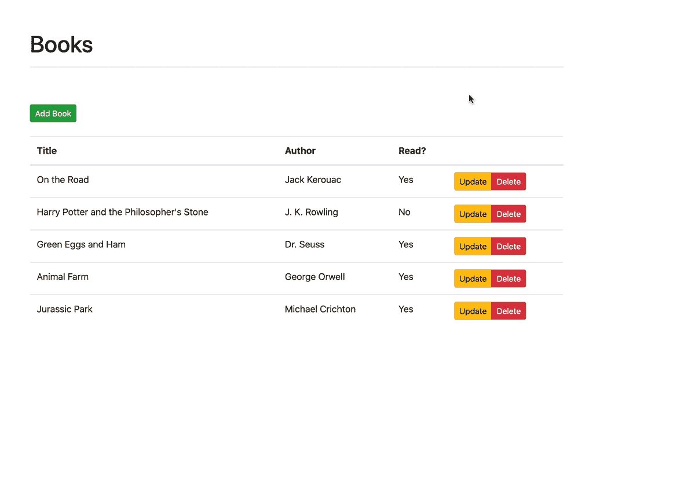

## 删除路线

### 计算机网络服务器

更新路由处理程序:

```
`@app.route('/books/<book_id>', methods=['PUT', 'DELETE'])
def single_book(book_id):
    response_object = {'status': 'success'}
    if request.method == 'PUT':
        post_data = request.get_json()
        remove_book(book_id)
        BOOKS.append({
            'id': uuid.uuid4().hex,
            'title': post_data.get('title'),
            'author': post_data.get('author'),
            'read': post_data.get('read')
        })
        response_object['message'] = 'Book updated!'
    if request.method == 'DELETE':
        remove_book(book_id)
        response_object['message'] = 'Book removed!'
    return jsonify(response_object)` 
```

### 客户

像这样更新“删除”按钮:

```
`<button
        type="button"
        class="btn btn-danger btn-sm"
        @click="onDeleteBook(book)">
    Delete
</button>` 
```

添加方法来处理按钮点击，然后删除书:

```
`removeBook(bookID)  { const  path  =  `http://localhost:5000/books/${bookID}`; axios.delete(path) .then(()  =>  { this.getBooks(); this.message  =  'Book removed!'; this.showMessage  =  true; }) .catch((error)  =>  { // eslint-disable-next-line console.error(error); this.getBooks(); }); }, onDeleteBook(book)  { this.removeBook(book.id); },` 
```

现在，当用户单击删除按钮时，`onDeleteBook`方法被触发，这又触发了`removeBook`方法。该方法将删除请求发送到后端。当响应返回时，显示警告信息并运行`getBooks`。

> 挑战:
> 
> 1.  添加一个确认警告，而不是单击按钮删除。
> 2.  显示一条信息，比如“没有书！请加一个。”，没有书的时候。

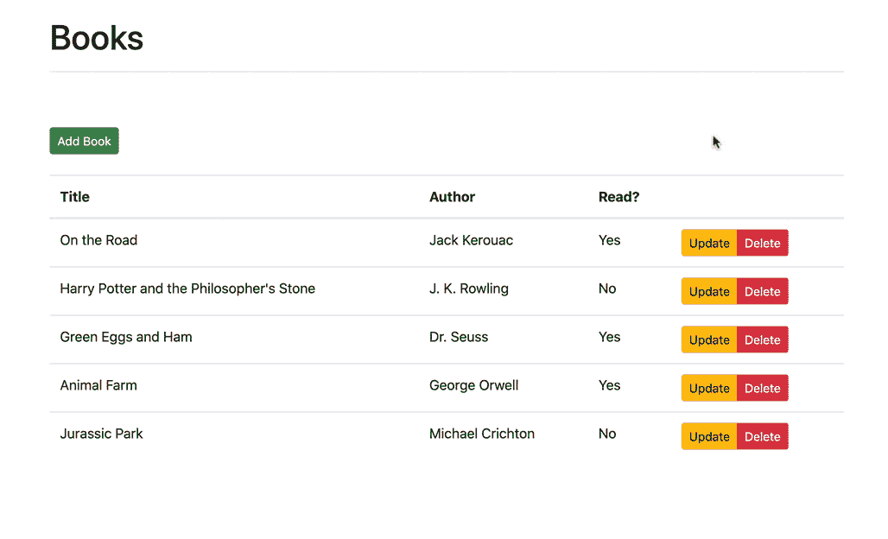

## 结论

这篇文章讲述了用 Vue 和 Flask 设置 CRUD 应用程序的基础知识。

通过回顾这篇文章开头的目标和经历每个挑战来检查你的理解。

你可以在 [flask-vue-crud](https://github.com/testdrivenio/flask-vue-crud) repo 中找到源代码。感谢阅读。

> **寻找更多？**
> 
> 1.  查看[用 Stripe、Vue.js 和 Flask](https://testdriven.io/blog/accepting-payments-with-stripe-vuejs-and-flask) 接受付款的博文，该博文从本文停止的地方开始。
> 2.  想了解如何将此应用部署到 Heroku？查看[使用 Docker 和 Gitlab CI](https://testdriven.io/blog/deploying-flask-to-heroku-with-docker-and-gitlab) 将 Flask 和 Vue 应用程序部署到 Heroku。