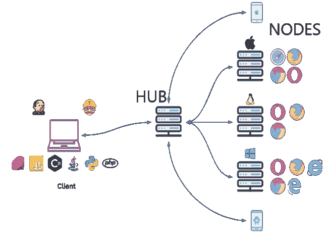
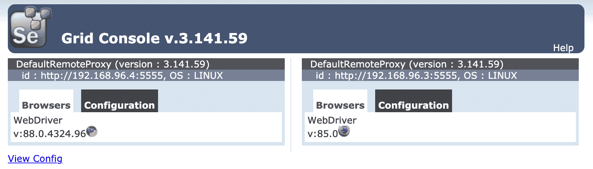
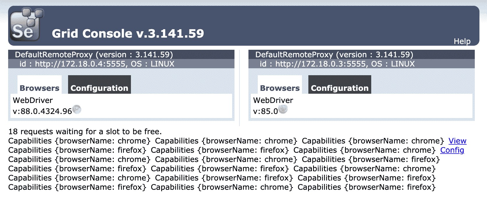
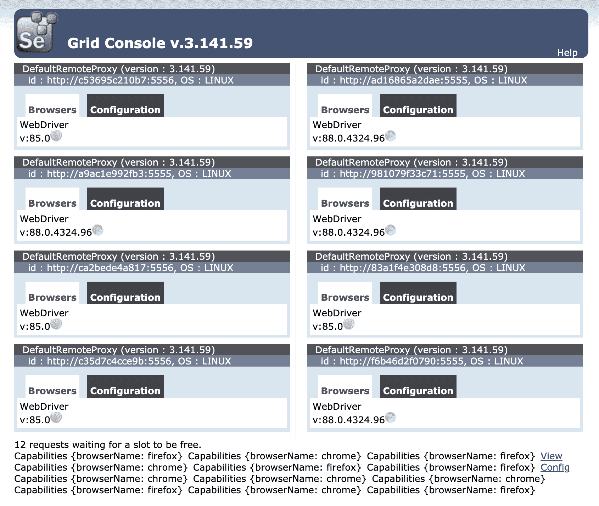

# 使用 Selenium Grid 和 Docker 进行分布式测试

> 原文：<https://testdriven.io/blog/distributed-testing-with-selenium-grid/>

对于希望实现频繁交付方法(比如持续集成和交付)或者总体上加速开发周期的软件开发团队来说，减少测试执行时间是关键。在频繁构建和测试是常态的环境中，开发人员根本无法承受连续几个小时等待测试完成。将测试分布在许多机器上是这个问题的一个解决方案。

本文着眼于如何使用 [Selenium Grid](https://www.selenium.dev/documentation/en/grid/) 和 [Docker Swarm](https://docs.docker.com/engine/swarm/) 将自动化测试分布到多个机器上。

我们还将了解如何在多种浏览器上运行测试，并自动配置和取消配置机器以降低成本。

## 目标

完成本教程后，您将能够:

1.  用 Docker 将硒网格装箱
2.  在 Selenium Grid 上运行自动化测试
3.  描述分布式计算和并行计算的区别
4.  通过 Docker Compose 和 Machine 将 Selenium 网格部署到数字海洋
5.  自动供应和取消供应数字海洋上的资源

## 项目设置

让我们从 Python 中的基本 Selenium 测试开始:

```py
`import time
import unittest

from selenium import webdriver
from selenium.webdriver.common.keys import Keys

class HackerNewsSearchTest(unittest.TestCase):

    def setUp(self):
        self.browser = webdriver.Chrome()

    def test_hackernews_search_for_testdrivenio(self):
        browser = self.browser
        browser.get('https://news.ycombinator.com')
        search_box = browser.find_element_by_name('q')
        search_box.send_keys('testdriven.io')
        search_box.send_keys(Keys.RETURN)
        time.sleep(3)  # simulate long running test
        self.assertIn('testdriven.io', browser.page_source)

    def test_hackernews_search_for_selenium(self):
        browser = self.browser
        browser.get('https://news.ycombinator.com')
        search_box = browser.find_element_by_name('q')
        search_box.send_keys('selenium')
        search_box.send_keys(Keys.RETURN)
        time.sleep(3)  # simulate long running test
        self.assertIn('selenium', browser.page_source)

    def test_hackernews_search_for_testdriven(self):
        browser = self.browser
        browser.get('https://news.ycombinator.com')
        search_box = browser.find_element_by_name('q')
        search_box.send_keys('testdriven')
        search_box.send_keys(Keys.RETURN)
        time.sleep(3)  # simulate long running test
        self.assertIn('testdriven', browser.page_source)

    def test_hackernews_search_with_no_results(self):
        browser = self.browser
        browser.get('https://news.ycombinator.com')
        search_box = browser.find_element_by_name('q')
        search_box.send_keys('?*^^%')
        search_box.send_keys(Keys.RETURN)
        time.sleep(3)  # simulate long running test
        self.assertNotIn('<em>', browser.page_source)

    def tearDown(self):
        self.browser.quit()  # quit vs close?

if __name__ == '__main__':
    unittest.main()` 
```

跟着一起走？

1.  创建新的项目目录。
2.  将上述代码保存在一个名为 *test.py* 的新文件中。
3.  创建并激活虚拟环境。
4.  装硒:`pip install selenium==3.141.0`。
5.  全局安装 [ChromeDriver](https://sites.google.com/a/chromium.org/ChromeDriver/) 。(我们正在使用版本 [88.0.4324.96](https://chromedriver.storage.googleapis.com/index.html?path=88.0.4324.96/) 。)
6.  确保它工作:`python test.py`。

在这个测试中，我们导航到`https://news.ycombinator.com`，执行四次搜索，然后断言搜索结果页面被适当地呈现。没什么特别的，但是足够用了。请随意使用你自己的硒测试来代替这个测试。

*执行时间*:约 25 秒

```py
`$ python test.py

....
----------------------------------------------------------------------
Ran 4 tests in 24.533s

OK` 
```

## 硒栅

说到分布式测试， [Selenium Grid](https://www.selenium.dev/documentation/en/grid/) 是最强大和最流行的开源工具之一。有了它，我们可以将测试负载分散到多台机器上，并跨浏览器运行它们。

假设你有一套 90 个测试，在你的笔记本电脑上针对一个版本的 Chrome 运行。也许运行这些测试需要六分钟。使用 Selenium Grid，您可以旋转三台不同的机器来运行它们，这将减少(大约)三分之一的测试执行时间。您也可以在不同的浏览器和平台上运行相同的测试。因此，您不仅节省了时间，而且还有助于确保您的 web 应用程序在不同的浏览器和环境中呈现时表现和外观都是一样的。

Selenium Grid 使用客户机-服务器模型，包括一个中心和多个节点(运行测试的浏览器)。



例如，您可以将三个节点连接到集线器，每个节点运行不同的浏览器。然后，当您使用特定的远程 WebDriver 运行您的测试时，WebDriver 请求被发送到中心 hub，它搜索与指定标准匹配的可用节点(例如，像浏览器版本)。一旦找到一个节点，就发送脚本并运行测试。

我们可以使用来自 [Selenium Docker](https://github.com/SeleniumHQ/docker-selenium) 的官方映像来启动一个中心和几个节点，而不是处理手动配置和安装 Selenium Grid 的麻烦。

要启动并运行，请将以下代码添加到项目根目录下名为 *docker-compose.yml* 的新文件中:

```py
`version:  '3.8' services: hub: image:  selenium/hub:3.141.59 ports: -  4444:4444 chrome: image:  selenium/node-chrome:3.141.59 depends_on: -  hub environment: -  HUB_HOST=hub firefox: image:  selenium/node-firefox:3.141.59 depends_on: -  hub environment: -  HUB_HOST=hub` 
```

我们使用了`3.141.59`标签，它与以下版本的 Selenium、WebDriver、Chrome 和 Firefox 相关联:

```py
`Selenium:  3.141.59 Chrome:  88.0.4324.96 ChromeDriver:  88.0.4324.96 Firefox:  85.0 GeckoDriver:  0.29.0` 
```

> 如果你想使用不同版本的 Chrome 或 Firefox，请参考[发布版](https://github.com/SeleniumHQ/docker-selenium/releases)页面

提取并运行图像:

> 本指南使用 Docker 版本 18.09.2。

完成后，打开浏览器并导航到 Selenium Grid 控制台(http://localhost:4444/Grid/console),确保一切正常:



通过更新`setUp`方法在测试文件中配置远程驱动程序:

```py
`def setUp(self):
    caps = {'browserName': os.getenv('BROWSER', 'chrome')}
    self.browser = webdriver.Remote(
        command_executor='http://localhost:4444/wd/hub',
        desired_capabilities=caps
    )` 
```

确保也添加导入:

通过 Chrome 节点上的 Selenium Grid 运行测试:

```py
`$ export BROWSER=chrome && python test.py

....
----------------------------------------------------------------------
Ran 4 tests in 21.054s

OK` 
```

也试试 Firefox:

```py
`$ export BROWSER=firefox && python test.py

....
----------------------------------------------------------------------
Ran 4 tests in 25.058s

OK` 
```

为了模拟更长的测试运行，让我们连续运行 20 次相同的测试——10 次在 Chrome 上，10 次在 Firefox 上。

将名为 *sequential_test_run.py* 的新文件添加到项目根:

```py
`from subprocess import check_call

for counter in range(10):
    chrome_cmd = 'export BROWSER=chrome && python test.py'
    firefox_cmd = 'export BROWSER=firefox && python test.py'
    check_call(chrome_cmd, shell=True)
    check_call(firefox_cmd, shell=True)` 
```

运行测试:

```py
`$ python sequential_test_run.py` 
```

*执行时间*:约 8 分钟

## 分布式与并行

这很好，但是测试仍然没有并行运行。

> 这可能会引起混淆，因为“并行”和“分布式”经常被测试人员和开发人员互换使用。查看[分布式与并行计算](https://cs.stackexchange.com/questions/1580/distributed-vs-parallel-computing)了解更多信息。

到目前为止，我们只处理了在多台机器上分发测试，这是由 Selenium Grid 处理的。测试运行器或框架，如 [pytest](https://docs.pytest.org) 或 [nose](http://nose.readthedocs.io/) ，负责并行运行测试。为了简单起见，我们将使用子流程模块，而不是完整的框架。值得注意的是，如果你正在使用 pytest 或 nose，请分别查看 [pytest-xdist](https://pypi.python.org/pypi/pytest-xdist) 插件或使用 nose 的[并行测试指南以获得并行执行的帮助。](http://nose.readthedocs.io/en/latest/doc_tests/test_multiprocess/multiprocess.html)

## 并行运行

将名为 *parallel_test_run.py* 的新文件添加到项目根:

```py
`from subprocess import Popen

processes = []

for counter in range(10):
    chrome_cmd = 'export BROWSER=chrome && python test.py'
    firefox_cmd = 'export BROWSER=firefox && python test.py'
    processes.append(Popen(chrome_cmd, shell=True))
    processes.append(Popen(firefox_cmd, shell=True))

for counter in range(10):
    processes[counter].wait()` 
```

这将同时运行测试文件二十次，每次都使用单独的进程。

```py
`$ python parallel_test_run.py` 
```

*执行时间*:约 4 分钟

这将花费不到四分钟的时间来运行，与顺序运行所有二十个测试相比，将执行时间减少了一半。我们可以通过注册更多的节点来进一步加快速度。

## 数字海洋

让我们旋转一个数字海洋液滴，这样我们就有更多的核心来工作。

如果你还没有账户，先从[注册](https://m.do.co/c/d8f211a4b4c2)开始，然后[生成](https://docs.digitalocean.com/reference/api/create-personal-access-token/)一个访问令牌，这样我们就可以使用[数字海洋 API](https://developers.digitalocean.com/documentation/v2/) 。

将令牌添加到您的环境中:

```py
`$ export DIGITAL_OCEAN_ACCESS_TOKEN=[your_digital_ocean_token]` 
```

使用 Docker Machine 供应新的 droplet:

```py
`$ docker-machine create \
    --driver digitalocean \
    --digitalocean-access-token $DIGITAL_OCEAN_ACCESS_TOKEN \
    --engine-install-url "https://releases.rancher.com/install-docker/19.03.9.sh" \
    selenium-grid;` 
```

> 需要`--engine-install-url`，因为在撰写本文时，Docker v20.10.0 [无法与 Docker Machine](https://github.com/docker/machine/issues/4858) 一起使用。

完成后，将 Docker 守护进程指向该机器，并将其设置为活动机器:

```py
`$ docker-machine env selenium-grid
$ eval $(docker-machine env selenium-grid)` 
```

旋转 droplet 上的三个容器——中心和两个节点:

抓取水滴的 IP:

```py
`$ docker-machine ip selenium-grid` 
```

确保 Selenium Grid 在[http://YOUR _ IP:4444/Grid/console](http://localhost:4444/grid/console)启动并运行，然后更新测试文件中的 IP 地址:

```py
`command_executor='http://YOUR_IP:4444/wd/hub',` 
```

再次并行运行测试:

```py
`$ python parallel_test_run.py` 
```

刷新网格控制台。两个测试应该正在运行，而剩余的 18 个测试正在排队:



同样，这应该需要大约四分钟来运行。

## 码头工人群体模式

继续前进，我们应该旋转更多的节点来运行测试。然而，由于 droplet 上的资源有限，让我们添加一些 droplet 供节点驻留。这就是 Docker Swarm 发挥作用的地方。

为了创建 Swarm 集群，让我们从头开始，首先旋转旧的液滴:

```py
`$ docker-machine rm selenium-grid` 
```

然后，旋转五个新的液滴:

```py
`$ for i in 1 2 3 4 5; do
    docker-machine create \
      --driver digitalocean \
      --digitalocean-access-token $DIGITAL_OCEAN_ACCESS_TOKEN \
      --engine-install-url "https://releases.rancher.com/install-docker/19.03.9.sh" \
      node-$i;
done` 
```

在`node-1`初始化[群模式](https://docs.docker.com/engine/swarm/):

```py
`$ docker-machine ssh node-1 -- docker swarm init --advertise-addr $(docker-machine ip node-1)` 
```

您应该会看到类似如下的内容:

```py
`Swarm initialized: current node (ae0iz7lqwz6g9p0oso4f5g6sd) is now a manager.

To add a worker to this swarm, run the following command:

    docker swarm join --token SWMTKN-1-54ca6zbkpya4mw15mctnmnkp7uzqmtcj8hm354ym2qqr8n5iyq-2v63f4ztawazzzitiibgpnh39 134.209.115.249:2377

To add a manager to this swarm, run 'docker swarm join-token manager' and follow the instructions.` 
```

请注意 join 命令，因为它包含一个令牌，我们需要这个令牌来将节点 workers 添加到群中。

> 如果忘记了，随时可以跑`docker-machine ssh node-1 -- docker swarm join-token worker`。

将剩余的四个节点作为[工人](https://docs.docker.com/engine/swarm/how-swarm-mode-works/nodes/)添加到群中:

```py
`$ for i in 2 3 4 5; do
    docker-machine ssh node-$i \
      -- docker swarm join --token YOUR_JOIN_TOKEN;
done` 
```

更新 *docker-compose.yml* 文件，以 Swarm 模式部署 Selenium 网格:

```py
`version:  '3.8' services: hub: image:  selenium/hub:3.141.59 ports: -  4444:4444 deploy: mode:  replicated replicas:  1 placement: constraints: -  node.role == worker chrome: image:  selenium/node-chrome:3.141.59 volumes: -  /dev/urandom:/dev/random depends_on: -  hub environment: -  HUB_PORT_4444_TCP_ADDR=hub -  HUB_PORT_4444_TCP_PORT=4444 -  NODE_MAX_SESSION=1 entrypoint:  bash -c 'SE_OPTS="-host $$HOSTNAME -port 5555" /opt/bin/entry_point.sh' ports: -  5555:5555 deploy: replicas:  1 placement: constraints: -  node.role == worker firefox: image:  selenium/node-firefox:3.141.59 volumes: -  /dev/urandom:/dev/random depends_on: -  hub environment: -  HUB_PORT_4444_TCP_ADDR=hub -  HUB_PORT_4444_TCP_PORT=4444 -  NODE_MAX_SESSION=1 entrypoint:  bash -c 'SE_OPTS="-host $$HOSTNAME -port 5556" /opt/bin/entry_point.sh' ports: -  5556:5556 deploy: replicas:  1 placement: constraints: -  node.role == worker` 
```

主要变化:

1.  *布局约束*:我们设置了`node.role == worker`的[布局约束](https://docs.docker.com/engine/swarm/services/#placement-constraints)，这样所有的任务都将在 worker 节点上运行。通常最好让管理器节点远离 CPU 和/或内存密集型任务。
2.  *Entrypoint* :这里，我们更新了 *entry_point.sh* [脚本](https://github.com/SeleniumHQ/docker-selenium/blob/3.10.0-argon/NodeBase/entry_point.sh)中的`SE_OPTS`中的主机集，这样运行在不同主机上的节点将能够成功链接回 hub。

这样，将 Docker 守护进程指向`node-1`并部署堆栈:

```py
`$ eval $(docker-machine env node-1)
$ docker stack deploy --compose-file=docker-compose.yml selenium` 
```

再添加几个节点:

```py
`$ docker service scale selenium_chrome=4 selenium_firefox=4` 
```

查看堆栈:

```py
`$ docker stack ps selenium` 
```

您应该会看到类似这样的内容:

```py
`ID             NAME                 IMAGE                            NODE      DESIRED STATE   CURRENT STATE
99filw99x8bc   selenium_chrome.1    selenium/node-chrome:3.141.59    node-3    Running         Running 41 seconds ago
9ff9cwx1dmqw   selenium_chrome.2    selenium/node-chrome:3.141.59    node-4    Running         Running about a minute ago
ige7rlnj1e03   selenium_chrome.3    selenium/node-chrome:3.141.59    node-5    Running         Running 59 seconds ago
ewsg5mxiy9eg   selenium_chrome.4    selenium/node-chrome:3.141.59    node-2    Running         Running 56 seconds ago
y3ud4iojz8u0   selenium_firefox.1   selenium/node-firefox:3.141.59   node-4    Running         Running about a minute ago
bvpizrfdhlq0   selenium_firefox.2   selenium/node-firefox:3.141.59   node-5    Running         Running about a minute ago
0jdw3sr7ld62   selenium_firefox.3   selenium/node-firefox:3.141.59   node-3    Running         Running 50 seconds ago
4esw9a2wvcf3   selenium_firefox.4   selenium/node-firefox:3.141.59   node-2    Running         Running about a minute ago
3dd04mt1t7n8   selenium_hub.1       selenium/hub:3.141.59            node-5    Running         Running about a minute ago` 
```

然后，获取运行集线器的节点的名称和 IP 地址，并将其设置为环境变量:

```py
`$ NODE=$(docker service ps --format "{{.Node}}" selenium_hub)
$ export NODE_HUB_ADDRESS=$(docker-machine ip $NODE)` 
```

再次更新`setUp`方法:

```py
`def setUp(self):
    caps = {'browserName': os.getenv('BROWSER', 'chrome')}
    address = os.getenv('NODE_HUB_ADDRESS')
    self.browser = webdriver.Remote(
        command_executor=f'http://{address}:4444/wd/hub',
        desired_capabilities=caps
    )` 
```

测试！

```py
`$ python parallel_test_run.py` 
```



*执行时间*:约 1.5 分钟

去除水滴:

```py
`$ docker-machine rm node-1 node-2 node-3 node-4 node-5 -y` 
```

概括地说，为了创建一个群体，我们:

1.  旋转出新的水滴
2.  在其中一个液滴上初始化群体模式(本例中为`node-1`)
3.  将节点作为工人添加到群体中

## 自动化脚本

因为让 droplet 闲置，等待客户端运行测试是不划算的，所以我们应该在测试运行之前自动供应 droplet，然后在运行之后取消供应。

让我们编写一个脚本:

*   用 Docker 机器提供液滴
*   配置 Docker 群组模式
*   向群集添加节点
*   部署硒网格
*   运行测试
*   旋转水滴

*create.sh* :

```py
`#!/bin/bash

echo "Spinning up five droplets..."

for i in 1 2 3 4 5; do
  docker-machine create \
    --driver digitalocean \
    --digitalocean-access-token $DIGITAL_OCEAN_ACCESS_TOKEN \
    --engine-install-url "https://releases.rancher.com/install-docker/19.03.9.sh" \
    node-$i;
done

echo "Initializing Swarm mode..."

docker-machine ssh node-1 -- docker swarm init --advertise-addr $(docker-machine ip node-1)

docker-machine ssh node-1 -- docker node update --availability drain node-1

echo "Adding the nodes to the Swarm..."

TOKEN=`docker-machine ssh node-1 docker swarm join-token worker | grep token | awk '{ print $5 }'`

docker-machine ssh node-2 "docker swarm join --token ${TOKEN}  $(docker-machine ip node-1):2377"
docker-machine ssh node-3 "docker swarm join --token ${TOKEN}  $(docker-machine ip node-1):2377"
docker-machine ssh node-4 "docker swarm join --token ${TOKEN}  $(docker-machine ip node-1):2377"
docker-machine ssh node-5 "docker swarm join --token ${TOKEN}  $(docker-machine ip node-1):2377"

echo "Deploying Selenium Grid to http://$(docker-machine ip node-1):4444..."

eval $(docker-machine env node-1)
docker stack deploy --compose-file=docker-compose.yml selenium
docker service scale selenium_chrome=2 selenium_firefox=2` 
```

*destroy.sh* :

```py
`#!/bin/bash

docker-machine rm node-1 node-2 node-3 node-4 node-5 -y` 
```

测试！

```py
`$ sh create.sh

$ eval $(docker-machine env node-1)
$ NODE=$(docker service ps --format "{{.Node}}" selenium_hub)
$ export NODE_HUB_ADDRESS=$(docker-machine ip $NODE)

$ python parallel_test_run.py

$ sh destroy.sh` 
```

## 结论

本文研究了如何使用 Docker 和 Docker Swarm 配置 Selenium Grid，以便在多台机器上分布测试。

完整的代码可以在[selenium-grid-docker-swarm-test](https://github.com/testdrivenio/selenium-grid-docker-swarm-test)库中找到。

寻找一些挑战？

1.  通过在不同的 Selenium 网格节点上并行运行所有测试方法，尝试进一步减少测试执行时间。
2.  在 Travis 或 Jenkins(或其他 CI 工具)上配置测试的运行，使它们成为持续集成过程的一部分。