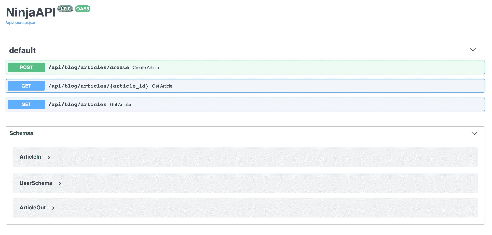
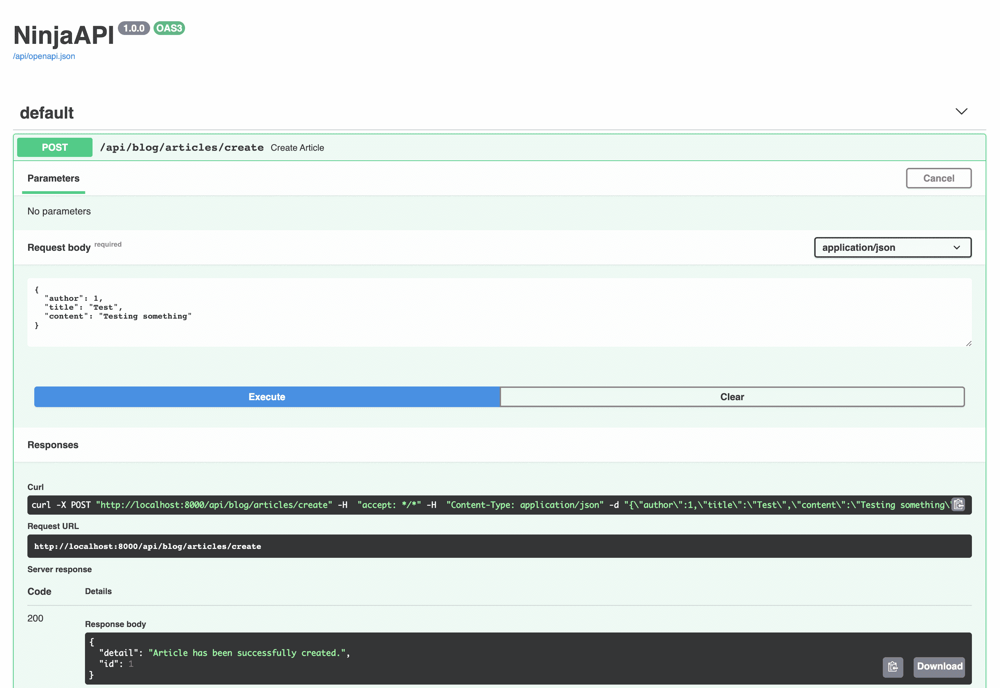

# 姜戈和迂腐

> 原文：<https://testdriven.io/blog/django-and-pydantic/>

在本文中，我们将看看如何使用 [Pydantic-Django](https://github.com/jordaneremieff/pydantic-django) 和 [Django Ninja](https://github.com/vitalik/django-ninja) 包将 [Pydantic](https://pydantic-docs.helpmanual.io/) 与 [Django](https://www.djangoproject.com/) 应用程序集成。

## Pydantic

Pydantic 是一个基于 Python 类型提示的用于数据验证和设置管理的 Python 包。它在运行时强制执行类型提示，提供用户友好的错误，允许自定义数据类型，并且与许多流行的 ide 配合良好。它非常快，也很容易使用！

让我们看一个例子:

```
`from pydantic import BaseModel

class Song(BaseModel):
    id: int
    name: str` 
```

这里，我们定义了一个具有两个属性的`Song`模型，这两个属性都是必需的:

1.  `id`是一个整数
2.  `name`是字符串

然后在初始化时进行验证:

```
`>>> song = Song(id=1, name='I can almost see you')
>> song.name
'I can almost see you'

>> Song(id='1')
pydantic.error_wrappers.ValidationError: 1 validation error for Song
name
  field required (type=value_error.missing)

>>> Song(id='foo', name='I can almost see you')
pydantic.error_wrappers.ValidationError: 1 validation error for Song
id
  value is not a valid integer (type=type_error.integer)` 
```

> 要了解更多关于 Pydantic 的信息，请务必阅读官方文档中的[概述](https://pydantic-docs.helpmanual.io/)页面。

## Pydantic 和 Django

当与 Django 结合使用时，我们可以使用 Pydantic 来确保在我们的应用程序中只使用与定义的[模式](https://pydantic-docs.helpmanual.io/usage/schema/)相匹配的数据。因此，我们将定义验证请求和响应的模式，当验证错误发生时，我们将简单地返回一条用户友好的错误消息。

虽然您可以在没有任何第三方包的情况下将 Pydantic 与 Django 集成在一起，但是我们将利用以下包来简化这个过程:

1.  [Pydantic-Django](https://github.com/jordaneremieff/pydantic-django) -为验证模型数据添加 Pydantic 支持
2.  Django Ninja——除了 Pydantic，这个包还提供了许多额外的功能，比如自动生成的 API 文档(通过 [OpenAPI](https://swagger.io/specification/) 和 [JSON 模式](https://json-schema.org/))、序列化和 API 版本控制

> 《姜戈忍者》受到了 [FastAPI](https://fastapi.tiangolo.com/) 的极大启发[。如果您喜欢 FastAPI，但仍然想利用 Django 提供的大部分功能，请查看一下。](https://django-ninja.rest-framework.com/motivation/)

## Pydantic-Django

现在您已经对 Pydantic 有了一个基本的概念，让我们看一个实际的例子。我们将使用 Django 和 Pydantic-Django 创建一个简单的 RESTful API，它允许我们获取、列出和创建文章。

### 基本设置

首先建立一个新的 Django 项目:

```
`$ mkdir django-with-pydantic && cd django-with-pydantic
$ python3.9 -m venv env
$ source env/bin/activate

(env)$ pip install django==3.1.5
(env)$ django-admin.py startproject core .` 
```

之后，创建一个名为`blog`的新应用:

```
`(env)$ python manage.py startapp blog` 
```

在`INSTALLED_APPS`下的 *core/settings.py* 中注册 app:

```
`# core/settings.py

INSTALLED_APPS = [
    'django.contrib.admin',
    'django.contrib.auth',
    'django.contrib.contenttypes',
    'django.contrib.sessions',
    'django.contrib.messages',
    'django.contrib.staticfiles',
    'blog.apps.BlogConfig', # new
]` 
```

### 创建数据库模型

接下来，让我们创建一个`Article`模型。

将以下内容添加到 *blog/models.py* :

```
`# blog/models.py

from django.contrib.auth.models import User
from django.db import models

class Article(models.Model):
    author = models.ForeignKey(to=User, on_delete=models.CASCADE)
    created = models.DateTimeField(auto_now_add=True)
    title = models.CharField(max_length=512, unique=True)
    content = models.TextField()

    def __str__(self):
        return f'{self.author.username}: {self.title}'` 
```

创建然后应用迁移:

```
`(env)$ python manage.py makemigrations
(env)$ python manage.py migrate` 
```

在 *blog/admin.py* 中注册模型，这样就可以从 Django 管理面板访问它:

```
`# blog/admin.py

from django.contrib import admin

from blog.models import Article

admin.site.register(Article)` 
```

### 安装 Pydantic-Django 并创建模式

安装 Pydantic 和 Pydantic-Django:

```
`(env)$ pip install pydantic==1.7.3 pydantic-django==0.0.7` 
```

现在，我们可以定义一个模式，它将用于-

1.  验证来自请求负载的字段，然后使用数据创建新的模型对象
2.  检索和验证响应对象的模型对象

创建一个名为 *blog/schemas.py* 的新文件:

```
`# blog/schemas.py

from pydantic_django import ModelSchema

from blog.models import Article

class ArticleSchema(ModelSchema):
    class Config:
        model = Article` 
```

这是最简单的可能模式，它来自我们的模型。

> Django 模型需要在模式之前加载*，因此模式必须位于一个单独的文件中，以避免模型加载错误。*

使用模式，您还可以通过将`exclude`或`include`传递给`Config`来定义特定模型中应该包含和不应该包含哪些字段。例如，排除`author`:

```
`class ArticleSchema(ModelSchema):
    class Config:
        model = Article
        exclude = ['author']

# or

class ArticleSchema(ModelSchema):
    class Config:
        model = Article
        include = ['created', 'title', 'content']` 
```

您还可以通过更改模式中的字段来使用模式覆盖 Django 模型属性。例如:

```
`class ArticleSchema(ModelSchema):
    title: Optional[str]

    class Config:
        model = Article` 
```

### 视图和 URL

接下来，让我们设置以下端点:

1.  `/blog/articles/create/`创建新文章
2.  获取一篇文章
3.  `/blog/articles/`列出所有文章

将以下视图添加到 *blog/views.py* :

```
`# blog/views.py

import json

from django.contrib.auth.models import User
from django.http import JsonResponse
from django.views.decorators.csrf import csrf_exempt
from django.views.decorators.http import require_http_methods

from blog.models import Article
from blog.schemas import ArticleSchema

@csrf_exempt  # testing purposes; you should always pass your CSRF token with your POST requests (+ authentication)
@require_http_methods('POST')
def create_article(request):
    try:
        json_data = json.loads(request.body)

        # fetch the user and pass it to schema
        author = User.objects.get(id=json_data['author'])
        schema = ArticleSchema.create(
            author=author,
            title=json_data['title'],
            content=json_data['content']
        )
        return JsonResponse({
            'article': schema.dict()
        })
    except User.DoesNotExist:
        return JsonResponse({'detail': 'Cannot find a user with this id.'}, status=404)

def get_article(request, article_id):
    try:
        article = Article.objects.get(id=article_id)
        schema = ArticleSchema.from_django(article)
        return JsonResponse({
            'article': schema.dict()
        })
    except Article.DoesNotExist:
        return JsonResponse({'detail': 'Cannot find an article with this id.'}, status=404)

def get_all_articles(request):
    articles = Article.objects.all()
    data = []

    for article in articles:
        schema = ArticleSchema.from_django(article)
        data.append(schema.dict())

    return JsonResponse({
        'articles': data
    })` 
```

注意我们使用模式的领域，`ArticleSchema`:

1.  `ArticleSchema.create()`创建一个新的`Article`对象
2.  `schema.dict()`返回我们传递给`JsonResponse`的字段和值的字典
3.  `ArticleSchema.from_django()`从一个`Article`对象生成一个模式

> 记住:`create()`和`from_django()`也将根据模式验证数据。

在“博客”中添加一个 *urls.py* 文件，并定义以下 URL:

```
`# blog/urls.py

from django.urls import path

from blog import views

urlpatterns = [
    path('articles/create/', views.create_article),
    path('articles/<str:article_id>/', views.get_article),
    path('articles/', views.get_all_articles),
]` 
```

现在，让我们将我们的应用程序 URL 注册到基础项目:

```
`# core/urls.py

from django.contrib import admin
from django.shortcuts import render
from django.urls import path, include  # new import

urlpatterns = [
    path('admin/', admin.site.urls),
    path('blog/', include('blog.urls')),  # new
]` 
```

### 健全性检查

要进行测试，首先创建一个超级用户:

```
`(env)$ python manage.py createsuperuser` 
```

然后，运行开发服务器:

```
`(env)$ python manage.py runserver` 
```

在新的终端窗口中，用 cURL 添加新文章:

```
`$ curl --header "Content-Type: application/json" --request POST \
  --data '{"author":"1","title":"Something Interesting", "content":"Really interesting."}' \
  http://localhost:8000/blog/articles/create/` 
```

您应该会看到类似这样的内容:

```
`{
    "article": {
        "id": 1,
        "author": 1,
        "created": "2021-02-01T20:01:35.904Z",
        "title": "Something Interesting",
        "content": "Really interesting."
    }
}` 
```

然后，您应该能够在[http://127 . 0 . 0 . 1:8000/blog/articles/1/](http://127.0.0.1:8000/blog/articles/1/)和[http://127 . 0 . 0 . 1:8000/blog/articles/](http://127.0.0.1:8000/blog/articles/)查看文章。

### 响应模式

想要从所有文章的回复中删除`created`字段吗？

向 *blog/schemas.py* 添加新模式:

```
`class ArticleResponseSchema(ModelSchema):
    class Config:
        model = Article
        exclude = ['created']` 
```

然后，更新视图:

```
`def get_all_articles(request):
    articles = Article.objects.all()
    data = []

    for article in articles:
        schema = ArticleResponseSchema.from_django(article)
        data.append(schema.dict())

    return JsonResponse({
        'articles': data
    })` 
```

不要忘记在进口:

```
`from blog.schemas import ArticleSchema, ArticleResponseSchema` 
```

在[http://127 . 0 . 0 . 1:8000/blog/articles/](http://127.0.0.1:8000/blog/articles/)测试一下。

## 姜戈忍者

Django Ninja 是一个使用 Django 和基于 Python 的类型提示构建 API 的工具。如上所述，它带有许多[的强大功能](https://django-ninja.rest-framework.com/motivation/#main-features)。是“学的快，码的快，跑的快”。

### 基本设置

创建新的 Django 项目:

```
`$ mkdir django-with-ninja && cd django-with-ninja
$ python3.9 -m venv env
$ source env/bin/activate

(env)$ pip install django==3.1.5
(env)$ django-admin.py startproject core .` 
```

创建一个名为`blog`的新应用:

```
`(env)$ python manage.py startapp blog` 
```

在`INSTALLED_APPS`下的 *core/settings.py* 中注册 app:

```
`# core/settings.py

INSTALLED_APPS = [
    'django.contrib.admin',
    'django.contrib.auth',
    'django.contrib.contenttypes',
    'django.contrib.sessions',
    'django.contrib.messages',
    'django.contrib.staticfiles',
    'blog.apps.BlogConfig', # new
]` 
```

### 创建数据库模型

接下来，向 *blog/models.py* 添加一个`Article`模型:

```
`# blog/models.py

from django.contrib.auth.models import User
from django.db import models

class Article(models.Model):
    author = models.ForeignKey(to=User, on_delete=models.CASCADE)
    created = models.DateTimeField(auto_now_add=True)
    title = models.CharField(max_length=512, unique=True)
    content = models.TextField()

    def __str__(self):
        return f'{self.author.username}: {self.title}'` 
```

创建和应用迁移:

```
`(env)$ python manage.py makemigrations
(env)$ python manage.py migrate` 
```

在 *blog/admin.py* 中注册模型:

```
`# blog/admin.py

from django.contrib import admin
from blog.models import Article

admin.site.register(Article)` 
```

### 安装 Django Ninja 并创建模式

安装:

```
`(env)$ pip install django-ninja==0.10.1` 
```

与 Pydantic-Django 一样，您需要创建模式来验证您的请求和响应。也就是说，从 Django 模型自动生成模式看起来会在某个时候到来。

> 有关自动模式生成支持的更多信息，请查看 Django 模型中的[模式。](https://django-ninja.rest-framework.com/guides/response/django-pydantic/)

将以下内容添加到 *blog/schemas.py* :

```
`from datetime import datetime

from ninja import Schema

class UserSchema(Schema):
    id: int
    username: str

class ArticleIn(Schema):
    author: int
    title: str
    content: str

class ArticleOut(Schema):
    id: int
    author: UserSchema
    created: datetime
    title: str
    content: str` 
```

这里，我们创建了三种不同的模式:

1.  `UserSchema`验证 Django 用户模型的数据，并将数据转换成 Django 用户模型的数据
2.  `ArticleIn`验证和反序列化传递给创建文章的 API 的数据
3.  `ArticleOut`验证并序列化来自`Article`模型的数据

Django Ninja 有一个[路由器](https://django-ninja.rest-framework.com/guides/routers/)的概念，用于将一个 API 拆分成多个模块。

创建一个 *blog/api.py* 文件:

```
`# blog/api.py

from typing import List

from django.contrib.auth.models import User
from django.shortcuts import get_object_or_404
from ninja import Router

from blog.models import Article
from blog.schemas import ArticleOut, ArticleIn

router = Router()

@router.post('/articles/create')
def create_article(request, payload: ArticleIn):
    data = payload.dict()
    try:
        author = User.objects.get(id=data['author'])
        del data['author']
        article = Article.objects.create(author=author, **data)
        return {
            'detail': 'Article has been successfully created.',
            'id': article.id,
        }
    except User.DoesNotExist:
        return {'detail': 'The specific user cannot be found.'}

@router.get('/articles/{article_id}', response=ArticleOut)
def get_article(request, article_id: int):
    article = get_object_or_404(Article, id=article_id)
    return article

@router.get('/articles', response=List[ArticleOut])
def get_articles(request):
    articles = Article.objects.all()
    return articles` 
```

这里，我们创建了三个函数作为我们的视图。Django Ninja 使用 HTTP 操作装饰器来定义 URL 结构、[路径参数](https://django-ninja.rest-framework.com/guides/input/path-params/)，以及可选的[请求](https://django-ninja.rest-framework.com/guides/input/body/)和[响应](https://django-ninja.rest-framework.com/guides/response/)模式。

注意事项:

1.  `get_article`使用`ArticleOut`作为其响应模式。`ArticleOut`将自动用于验证和序列化模型中的数据。
2.  在`get_articles`中，Django 查询集——例如`articles = Article.objects.all()`——将通过`List[ArticleOut]`进行正确验证。

### 注册 API 端点

我们要做的最后一件事是创建一个新的`NinjaAPI`实例，并在 *core/urls.py* 中注册我们的 API 路由器:

```
`# core/urls.py

from django.contrib import admin
from django.urls import path
from ninja import NinjaAPI
from blog.api import router as blog_router

api = NinjaAPI()
api.add_router('/blog/', blog_router)

urlpatterns = [
    path('admin/', admin.site.urls),
    path('api/', api.urls),
]` 
```

这样，Django Ninja 将自动创建以下端点:

1.  `/blog/articles/create/`创建新文章
2.  获取一篇文章
3.  `/blog/articles/`列出所有文章

### 健全性检查

创建超级用户，然后运行开发服务器:

```
`(env)$ python manage.py createsuperuser
(env)$ python manage.py runserver` 
```

导航到[http://localhost:8000/api/docs](http://localhost:8000/api/docs)查看自动生成的交互式 API 文档:



在这里，您可以看到注册的端点并与之交互。

尝试添加新文章:



自己尝试其余的端点。

## 结论

在本文中，我们首先看了什么是 Pydantic，然后看了如何使用 Pydantic-Django 和 Django Ninja 将其与 Django 应用程序集成。

这两个包目前都在积极开发中。请记住，虽然这两个包都不成熟，但 Pydantic-Django 仍处于试验阶段(截至本文撰写之时)，所以请谨慎使用。

您可以在 GitHub 上获得完整代码:

1.  [django-with-pydantic](https://github.com/duplxey/django-with-pydantic)
2.  [姜戈和忍者](https://github.com/duplxey/django-with-ninja)