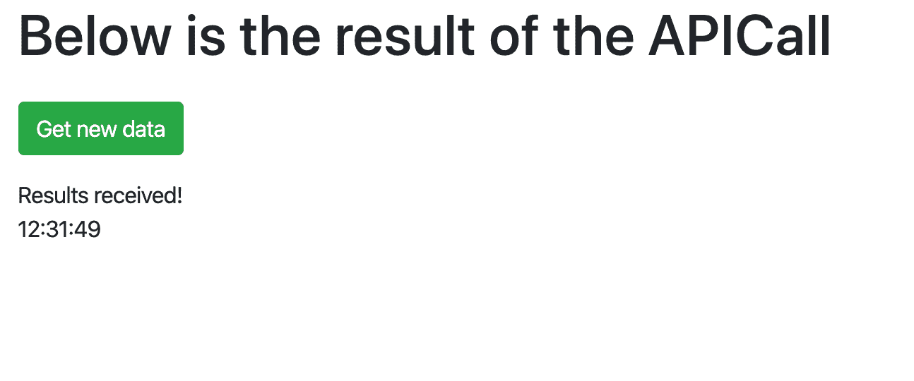
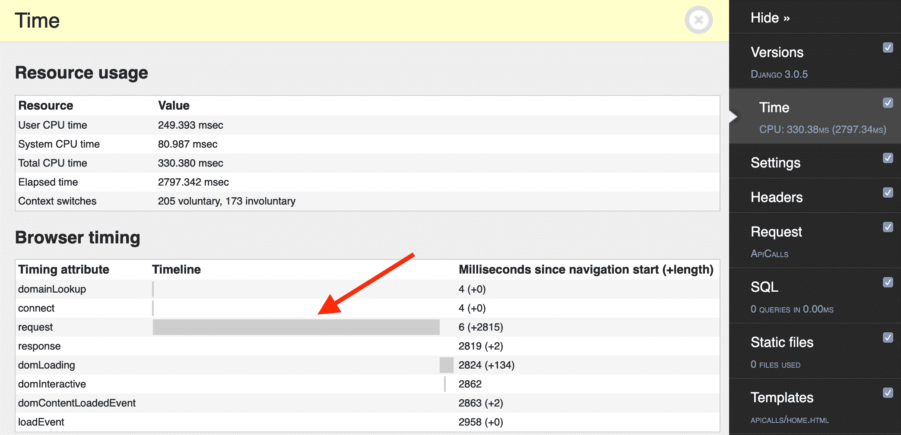
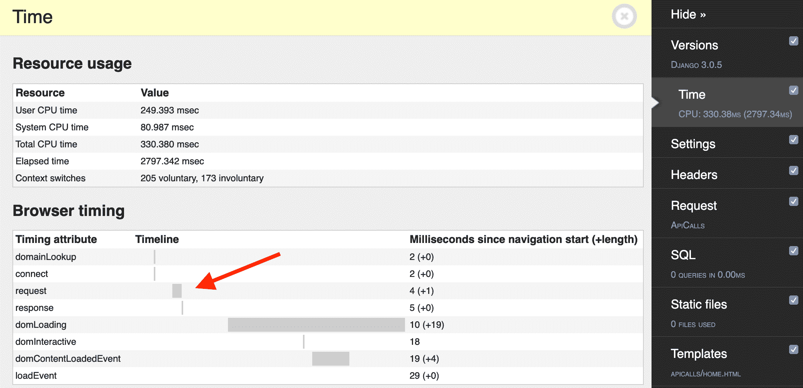
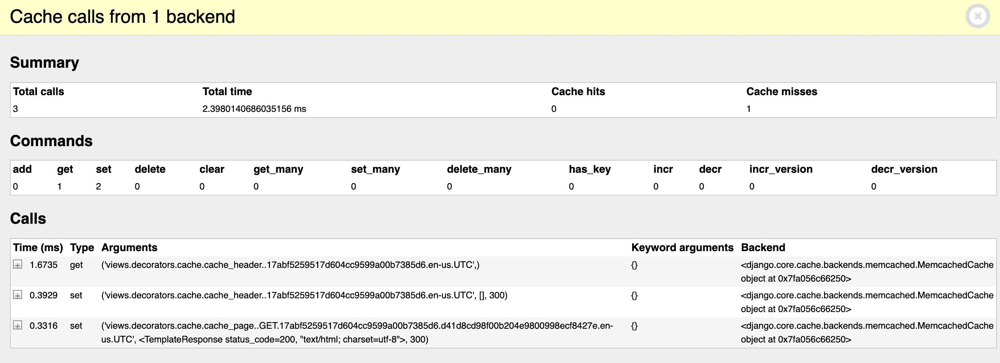

# Django 的缓存

> 原文：<https://testdriven.io/blog/django-caching/>

缓存通常是提升应用程序性能的最有效方式。

对于动态网站，在呈现模板时，您通常需要从各种来源(比如数据库、文件系统和第三方 API 等)收集数据，处理数据，并在将数据提供给客户端之前对其应用业务逻辑。最终用户将会注意到由于网络延迟造成的任何延迟。

例如，假设您必须对外部 API 进行 HTTP 调用，以获取呈现模板所需的数据。即使在完美的条件下，这也会增加渲染时间，从而增加整体加载时间。如果 API 下降或者你受到速率限制怎么办？无论哪种方式，如果数据很少更新，最好实现一种缓存机制，以避免对每个客户端请求都进行 HTTP 调用。

本文首先从整体上回顾 Django 的缓存框架，然后一步一步地详细说明如何缓存 Django 视图，来研究如何做到这一点。

*依赖关系:*

1.  Django v3.2.5
2.  django-redis v5.0.0 版
3.  python 3 . 9 . 6 版
4.  pymemcache 3 . 5 . 0 版
5.  请求版本 2.26.0

--

**Django 缓存文章:**

1.  [Django 中的缓存](/blog/django-caching/)(本文！)
2.  [Django 中的低级缓存 API](/blog/django-low-level-cache/)

## 目标

学完本教程后，您应该能够:

1.  解释为什么您可能想要缓存 Django 视图
2.  描述 Django 可用于缓存的内置选项
3.  用缰绳遮住决哥的视线
4.  使用 Apache Bench 对 Django 应用程序进行负载测试
5.  用 Memcached 缓存 Django 视图

## Django 缓存类型

Django 附带了几个内置缓存后端，以及对自定义后端的支持。

内置选项包括:

1.  Memcached : [Memcached](https://memcached.org/) 是一个基于内存的键值存储，用于存储小块数据。它支持跨多个服务器的分布式缓存。
2.  **数据库**:这里，缓存碎片存储在一个数据库中。为此，可以用 Django 的一个管理命令创建一个表。这不是性能最好的缓存类型，但它对于存储复杂的数据库查询很有用。
3.  **文件系统**:缓存保存在文件系统上，每个缓存值保存在单独的文件中。这是所有缓存类型中最慢的，但是在生产环境中最容易设置。
4.  **本地内存**:本地内存缓存，最适合您的本地开发或测试环境。虽然它几乎和 Memcached 一样快，但它不能扩展到单个服务器之外，所以它不适合用作任何使用多个 web 服务器的应用程序的数据缓存。
5.  **Dummy** :一个“虚拟”缓存，它实际上不缓存任何东西，但仍然实现缓存接口。当你不想要缓存，但又不想改变你的代码的时候，这意味着在开发或测试中使用它。

## Django 缓存级别

Django 中的缓存可以在不同的层次上实现(或者站点的不同部分)。您可以缓存整个站点或不同粒度级别的特定部分(按粒度降序排列):

### 每个站点的缓存

这是在 Django 中实现缓存的最简单的方法。要做到这一点，您只需将两个中间件类添加到您的 *settings.py* 文件中:

```
`MIDDLEWARE = [
    'django.middleware.cache.UpdateCacheMiddleware',     # NEW
    'django.middleware.common.CommonMiddleware',
    'django.middleware.cache.FetchFromCacheMiddleware',  # NEW
]` 
```

> 中间件的顺序在这里很重要。`UpdateCacheMiddleware`必须在`FetchFromCacheMiddleware`之前。更多信息请看 Django 文档中中间件的[订单。](https://docs.djangoproject.com/en/3.2/topics/cache/#order-of-middleware)

然后，您需要添加以下设置:

```
`CACHE_MIDDLEWARE_ALIAS = 'default'  # which cache alias to use
CACHE_MIDDLEWARE_SECONDS = '600'    # number of seconds to cache a page for (TTL)
CACHE_MIDDLEWARE_KEY_PREFIX = ''    # should be used if the cache is shared across multiple sites that use the same Django instance` 
```

虽然如果您的站点只有很少或没有动态内容，缓存整个站点可能是一个不错的选择，但它可能不适合用于具有基于内存的缓存后端的大型站点，因为 RAM 非常昂贵。

### 每视图缓存

您可以缓存特定的视图，而不是将宝贵的内存空间浪费在缓存从快速变化的 API 获取数据的静态页面或动态页面上。这是我们将在本文中使用的方法。当你打算在 Django 应用中实现缓存时，这也是你应该开始考虑的缓存级别。

您可以使用 [cache_page](https://docs.djangoproject.com/en/3.2/topics/cache/#django.views.decorators.cache.cache_page) 装饰器直接在视图函数上或者在`URLConf`内的路径中实现这种类型的缓存:

```
`from django.views.decorators.cache import cache_page

@cache_page(60 * 15)
def your_view(request):
    ...

# or

from django.views.decorators.cache import cache_page

urlpatterns = [
    path('object/<int:object_id>/', cache_page(60 * 15)(your_view)),
]` 
```

缓存本身是基于 URL 的，所以对`object/1`和`object/2`的请求将被分别缓存。

值得注意的是，直接在视图上实现缓存使得在某些情况下禁用缓存更加困难。例如，如果您希望允许某些用户在没有缓存的情况下访问视图，该怎么办？通过`URLConf`启用缓存提供了将不同的 URL 关联到不使用缓存的视图的机会:

```
`from django.views.decorators.cache import cache_page

urlpatterns = [
    path('object/<int:object_id>/', your_view),
    path('object/cache/<int:object_id>/', cache_page(60 * 15)(your_view)),
]` 
```

### 模板片段缓存

如果您的模板包含根据数据经常变化的部分，您可能希望将它们从缓存中删除。

例如，您可能在模板的某个区域的导航栏中使用经过身份验证的用户的电子邮件。如果你有成千上万的用户，那么这个片段将在内存中被复制成千上万次，每个用户一个。这就是模板片段缓存发挥作用的地方，它允许您指定要缓存的模板的特定区域。

要缓存对象列表:

```
`


  <ul>
    
      <li>{{ object.title }}</li>
    
  </ul>
` 
```

这里，``为我们提供了对`cache`模板标签的访问，该标签期望以秒为单位的缓存超时(`500`)以及缓存片段的名称(`object_list`)。

### 低级高速缓存 API

如果前面的选项不能提供足够的粒度，您可以使用低级 API 通过缓存键管理缓存中的单个对象。

例如:

```
`from django.core.cache import cache

def get_context_data(self, **kwargs):
    context = super().get_context_data(**kwargs)

    objects = cache.get('objects')

    if objects is None:
        objects = Objects.all()
        cache.set('objects', objects)

    context['objects'] = objects

    return context` 
```

在本例中，当在数据库中添加、更改或删除对象时，您会希望使缓存失效(或删除)。管理这种情况的一种方法是通过数据库信号:

```
`from django.core.cache import cache
from django.db.models.signals import post_delete, post_save
from django.dispatch import receiver

@receiver(post_delete, sender=Object)
def object_post_delete_handler(sender, **kwargs):
     cache.delete('objects')

@receiver(post_save, sender=Object)
def object_post_save_handler(sender, **kwargs):
    cache.delete('objects')` 
```

> 有关使用数据库信号使缓存无效的更多信息，请查看 Django 文章中的[低级缓存 API。](/blog/django-low-level-cache/)

至此，让我们来看一些例子。

## 项目设置

从 [cache-django-view](https://github.com/testdrivenio/cache-django-view) repo 中克隆基础项目，然后检查基础分支:

```
`$ git clone https://github.com/testdrivenio/cache-django-view.git --branch base --single-branch
$ cd cache-django-view` 
```

创建(并激活)虚拟环境，并满足以下要求:

```
`$ python3.9 -m venv venv
$ source venv/bin/activate
(venv)$ pip install -r requirements.txt` 
```

应用 Django 迁移，然后启动服务器:

```
`(venv)$ python manage.py migrate
(venv)$ python manage.py runserver` 
```

在您选择的浏览器中导航到 [http://127.0.0.1:8000](http://127.0.0.1:8000) 以确保一切按预期运行。

您应该看到:



记下你的终端。您应该看到请求的总执行时间:

该指标来自 *core/middleware.py* :

```
`import logging
import time

def metric_middleware(get_response):
    def middleware(request):
        # Get beginning stats
        start_time = time.perf_counter()

        # Process the request
        response = get_response(request)

        # Get ending stats
        end_time = time.perf_counter()

        # Calculate stats
        total_time = end_time - start_time

        # Log the results
        logger = logging.getLogger('debug')
        logger.info(f'Total time: {(total_time):.2f}s')
        print(f'Total time: {(total_time):.2f}s')

        return response

    return middleware` 
```

快速浏览一下 *apicalls/views.py* 中的视图:

```
`import datetime

import requests
from django.views.generic import TemplateView

BASE_URL = 'https://httpbin.org/'

class ApiCalls(TemplateView):
    template_name = 'apicalls/home.html'

    def get_context_data(self, **kwargs):
        context = super().get_context_data(**kwargs)
        response = requests.get(f'{BASE_URL}/delay/2')
        response.raise_for_status()
        context['content'] = 'Results received!'
        context['current_time'] = datetime.datetime.now()
        return context` 
```

这个视图通过`requests`向[httpbin.org](https://httpbin.org)发出一个 HTTP 调用。为了模拟一个长请求，来自 API 的响应被延迟了两秒钟。因此， [http://127.0.0.1:8000](http://127.0.0.1:8000) 不仅要花两秒钟来呈现初始请求，还要呈现每个后续请求。虽然在最初的请求中，两秒钟的负载是可以接受的，但是对于后续的请求来说，这是完全不可接受的，因为数据是不变的。让我们通过使用 Django 的每视图缓存级别缓存整个视图来解决这个问题。

工作流程:

1.  在初始请求中对 httpbin.org 进行完整的 HTTP 调用
2.  缓存视图
3.  随后的请求将从缓存中提取，绕过 HTTP 调用
4.  一段时间(TTL)后使缓存失效

## 基线性能基准

在添加缓存之前，让我们使用 [Apache Bench](https://httpd.apache.org/docs/2.4/programs/ab.html) 快速运行一个负载测试以获得一个基准基线，从而大致了解我们的应用程序每秒可以处理多少请求。

> Apache Bench 预装在 Mac 上。
> 
> 如果您使用的是 Linux 系统，那么很可能它已经安装好并准备好运行了。如果没有，可以通过 APT ( `apt-get install apache2-utils`)或者 YUM ( `yum install httpd-tools`)安装。
> 
> Windows 用户需要下载并解压 Apache 二进制文件。

将 [Gunicorn](https://gunicorn.org/) 添加到需求文件中:

终止 Django dev 服务器并安装 Gunicorn:

```
`(venv)$ pip install -r requirements.txt` 
```

接下来，用 Gunicorn(和四个[工人](https://docs.gunicorn.org/en/stable/run.html#commonly-used-arguments))提供 Django 应用程序，如下所示:

```
`(venv)$ gunicorn core.wsgi:application -w 4` 
```

在新的终端窗口中，运行 Apache Bench:

```
`$ ab -n 100 -c 10 http://127.0.0.1:8000/` 
```

这将模拟 10 个并发线程上的 100 个连接。一共有 100 个请求，每次 10 个。

记录每秒的请求数:

```
`Requests per second:    1.69 [#/sec] (mean)` 
```

> 请记住，Django 调试工具栏会增加一些开销。一般来说，标杆管理很难做到完全正确。重要的是一致性。选择一个关注的指标，并在每个测试中使用相同的环境。

关闭 Gunicorn 服务器，重新启动 Django dev 服务器:

```
`(venv)$ python manage.py runserver` 
```

至此，让我们看看如何缓存视图。

## 缓存视图

首先用`@cache_page`装饰器装饰`ApiCalls`视图，如下所示:

```
`import datetime

import requests
from django.utils.decorators import method_decorator # NEW
from django.views.decorators.cache import cache_page # NEW
from django.views.generic import TemplateView

BASE_URL = 'https://httpbin.org/'

@method_decorator(cache_page(60 * 5), name='dispatch') # NEW
class ApiCalls(TemplateView):
    template_name = 'apicalls/home.html'

    def get_context_data(self, **kwargs):
        context = super().get_context_data(**kwargs)
        response = requests.get(f'{BASE_URL}/delay/2')
        response.raise_for_status()
        context['content'] = 'Results received!'
        context['current_time'] = datetime.datetime.now()
        return context` 
```

因为我们使用的是基于类的视图，所以我们不能直接在类上放置装饰器，所以我们使用了一个`method_decorator`并为 name 参数指定了`dispatch`(作为要装饰的方法)。

本例中的缓存设置了五分钟的超时(或 TTL)。

或者，您可以在设置中这样设置:

```
`# Cache time to live is 5 minutes
CACHE_TTL = 60 * 5` 
```

然后，回到视图中:

```
`import datetime

import requests
from django.conf import settings
from django.core.cache.backends.base import DEFAULT_TIMEOUT
from django.utils.decorators import method_decorator
from django.views.decorators.cache import cache_page
from django.views.generic import TemplateView

BASE_URL = 'https://httpbin.org/'
CACHE_TTL = getattr(settings, 'CACHE_TTL', DEFAULT_TIMEOUT)

@method_decorator(cache_page(CACHE_TTL), name='dispatch')
class ApiCalls(TemplateView):
    template_name = 'apicalls/home.html'

    def get_context_data(self, **kwargs):
        context = super().get_context_data(**kwargs)
        response = requests.get(f'{BASE_URL}/delay/2')
        response.raise_for_status()
        context['content'] = 'Results received!'
        context['current_time'] = datetime.datetime.now()
        return context` 
```

接下来，让我们添加一个缓存后端。

### 里兹 vs Memcached

[Memcached](https://memcached.org/) 和 [Redis](https://redis.io/) 是内存中的键值数据存储。它们易于使用，并针对高性能查找进行了优化。您可能看不出两者在性能或内存使用方面有什么不同。也就是说，Memcached 的配置稍微容易一些，因为它是为简单易用而设计的。另一方面，Redis 有更丰富的特性集，因此除了缓存之外，它还有更广泛的使用案例。例如，它通常用于存储用户会话或作为发布/订阅系统中的消息代理。由于它的灵活性，除非您已经投资了 Memcached，否则 Redis 是更好的解决方案。

> 有关这方面的更多信息，请查看[这个](https://stackoverflow.com/a/11257333/1799408)堆栈溢出答案。

接下来，选择您的数据存储，让我们看看如何缓存视图。

## 备选案文 1:与 Django 重新谈判

[下载](https://redis.io/download)并安装 Redis。

> 如果你用的是 Mac，我们建议用[家酿](https://brew.sh/)安装 Redis:

安装完成后，在新的终端窗口[中启动 Redis 服务器](https://redis.io/topics/quickstart#starting-redis)并确保它运行在默认端口 6379 上。当我们告诉 Django 如何与 Redis 通信时，端口号将非常重要。

对于 Django 使用 Redis 作为缓存后端，我们首先需要安装 [django-redis](https://github.com/jazzband/django-redis) 。

将其添加到 *requirements.txt* 文件中:

安装:

```
`(venv)$ pip install -r requirements.txt` 
```

接下来，将自定义后端添加到 *settings.py* 文件中:

```
`CACHES = {
    'default': {
        'BACKEND': 'django_redis.cache.RedisCache',
        'LOCATION': 'redis://127.0.0.1:6379/1',
        'OPTIONS': {
            'CLIENT_CLASS': 'django_redis.client.DefaultClient',
        }
    }
}` 
```

现在，当您再次运行服务器时，Redis 将被用作缓存后端:

```
`(venv)$ python manage.py runserver` 
```

服务器启动并运行后，导航到 [http://127.0.0.1:8000](http://127.0.0.1:8000) 。

第一个请求仍然需要大约两秒钟。刷新页面。页面应该几乎瞬间加载。看看你终端的加载时间。它应该接近于零:

想知道 Redis 内部的缓存数据是什么样的吗？

在新的终端窗口中以交互模式运行 Redis CLI:

您应该看到:

运行`ping`以确保一切正常工作:

```
`127.0.0.1:6379> ping
PONG` 
```

返回到设置文件。我们使用 Redis 数据库 1 号:`'LOCATION': 'redis://127.0.0.1:6379/1',`。因此，运行`select 1`来选择数据库，然后运行`keys *`来查看所有键:

```
`127.0.0.1:6379> select 1
OK

127.0.0.1:6379[1]> keys *
1) ":1:views.decorators.cache.cache_header..17abf5259517d604cc9599a00b7385d6.en-us.UTC"
2) ":1:views.decorators.cache.cache_page..GET.17abf5259517d604cc9599a00b7385d6.d41d8cd98f00b204e9800998ecf8427e.en-us.UTC"` 
```

我们可以看到 Django 放入了一个 header 键和一个`cache_page`键。

要查看实际缓存的数据，运行`get`命令，将键作为参数:

```
`127.0.0.1:6379[1]> get ":1:views.decorators.cache.cache_page..GET.17abf5259517d604cc9599a00b7385d6.d41d8cd98f00b204e9800998ecf8427e.en-us.UTC"` 
```

您应该会看到类似以下内容:

```
`"\x80\x05\x95D\x04\x00\x00\x00\x00\x00\x00\x8c\x18django.template.response\x94\x8c\x10TemplateResponse
\x94\x93\x94)\x81\x94}\x94(\x8c\x05using\x94N\x8c\b_headers\x94}\x94(\x8c\x0ccontent-type\x94\x8c\
x0cContent-Type\x94\x8c\x18text/html; charset=utf-8\x94\x86\x94\x8c\aexpires\x94\x8c\aExpires\x94\x8c\x1d
Fri, 01 May 2020 13:36:59 GMT\x94\x86\x94\x8c\rcache-control\x94\x8c\rCache-Control\x94\x8c\x0
bmax-age=300\x94\x86\x94u\x8c\x11_resource_closers\x94]\x94\x8c\x0e_handler_class\x94N\x8c\acookies
\x94\x8c\x0chttp.cookies\x94\x8c\x0cSimpleCookie\x94\x93\x94)\x81\x94\x8c\x06closed\x94\x89\x8c
\x0e_reason_phrase\x94N\x8c\b_charset\x94N\x8c\n_container\x94]\x94B\xaf\x02\x00\x00
<!DOCTYPE html>\n<html lang=\"en\">\n<head>\n    <meta charset=\"UTF-8\">\n    <title>Home</title>\n
<link rel=\"stylesheet\" href=\"https://stackpath.bootstrapcdn.com/bootstrap/4.4.1/css/bootstrap.min.css\
"\n          integrity=\"sha384-Vkoo8x4CGsO3+Hhxv8T/Q5PaXtkKtu6ug5TOeNV6gBiFeWPGFN9MuhOf23Q9Ifjh\"
crossorigin=\"anonymous\">\n\n</head>\n<body>\n<div class=\"container\">\n    <div class=\"pt-3\">\n
<h1>Below is the result of the APICall</h1>\n    </div>\n    <div class=\"pt-3 pb-3\">\n
<a href=\"/\">\n            <button type=\"button\" class=\"btn btn-success\">\n
Get new data\n            </button>\n        </a>\n    </div>\n    Results received!<br>\n
13:31:59\n</div>\n</body>\n</html>\x94a\x8c\x0c_is_rendered\x94\x88ub."` 
```

完成后，退出交互式 CLI:

跳到“性能测试”部分。

## 选项 2:用 Django 实现 Memcached

首先将 [pymemcache](https://pymemcache.readthedocs.io/) 添加到 *requirements.txt* 文件中:

安装依赖项:

```
`(venv)$ pip install -r requirements.txt` 
```

接下来，我们需要更新 *core/settings.py* 中的设置，以启用 Memcached 后端:

```
`CACHES = {
    'default': {
        'BACKEND': 'django.core.cache.backends.memcached.PyMemcacheCache',
        'LOCATION': '127.0.0.1:11211',
    }
}` 
```

在这里，我们添加了 [PyMemcacheCache](https://docs.djangoproject.com/en/3.2/topics/cache/#memcached) 后端，并指出 Memcached 应该在本地机器的 localhost (127.0.0.1)端口 11211 上运行，这是 Memcached 的默认端口。

接下来，我们需要安装并运行 Memcached 守护进程。最简单的安装方法是通过软件包管理器，如 APT、YUM、Homebrew 或 Chocolatey，具体取决于您的操作系统:

```
`# linux
$ apt-get install memcached
$ yum install memcached

# mac
$ brew install memcached

# windows
$ choco install memcached` 
```

然后，在端口 11211 上的另一个终端中运行它:

```
`$ memcached -p 11211

# test: telnet localhost 11211` 
```

> 有关 Memcached 安装和配置的更多信息，请查看官方的 [wiki](https://github.com/memcached/memcached/wiki) 。

再次在我们的浏览器中导航至 [http://127.0.0.1:8000](http://127.0.0.1:8000) 。第一个请求仍然需要整整两秒钟，但是所有后续请求都将利用缓存。因此，如果你刷新或按下“获取新数据按钮”，页面应该几乎立即加载。

你的终端的执行时间是怎样的？

## 性能测试

如果我们在 Django Debug Toolbar 中查看加载第一个请求和第二个(缓存的)请求所用的时间，它将类似于:





同样在调试工具栏中，您可以看到缓存操作:



再次旋转 Gunicorn 并重新运行性能测试:

```
`$ ab -n 100 -c 10 http://127.0.0.1:8000/` 
```

每秒有哪些新请求？我机器上大概是 36！

## 结论

在本文中，我们研究了 Django 中不同的内置缓存选项以及不同级别的可用缓存。我们还详细介绍了如何使用 Django 的每视图缓存和 Memcached 以及 Redis 来缓存视图。

您可以在 [cache-django-view](https://github.com/testdrivenio/cache-django-view) repo 中找到 Memcached 和 Redis 这两个选项的最终代码。

--

一般来说，当由于数据库查询或 HTTP 调用的网络延迟而导致页面呈现缓慢时，您会希望使用缓存。

从这里开始，强烈推荐使用带有 Redis 和`Per-view`类型自定义 Django 缓存后端。如果您需要更多的粒度和控制，因为不是模板上的所有数据对所有用户都是相同的，或者部分数据频繁更改，那么就跳到模板片段缓存或低级缓存 API。

--

**Django 缓存文章:**

1.  [Django 中的缓存](/blog/django-caching/)(本文！)
2.  [Django 中的低级缓存 API](/blog/django-low-level-cache/)