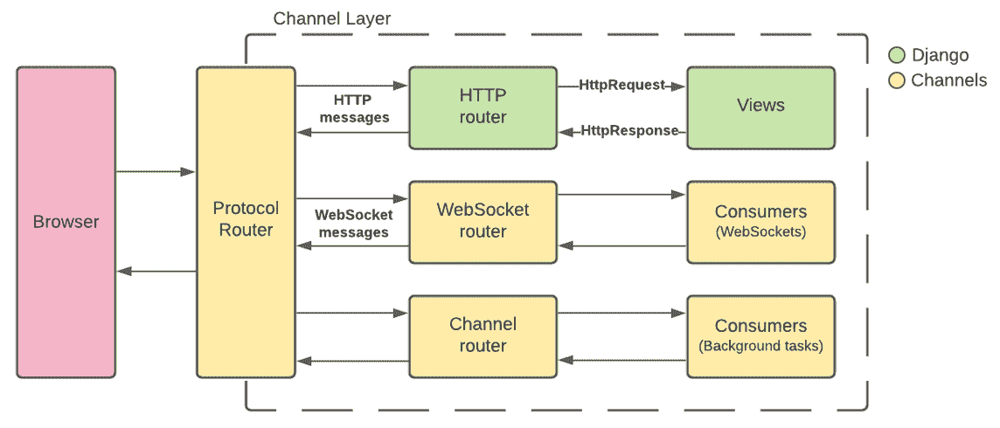
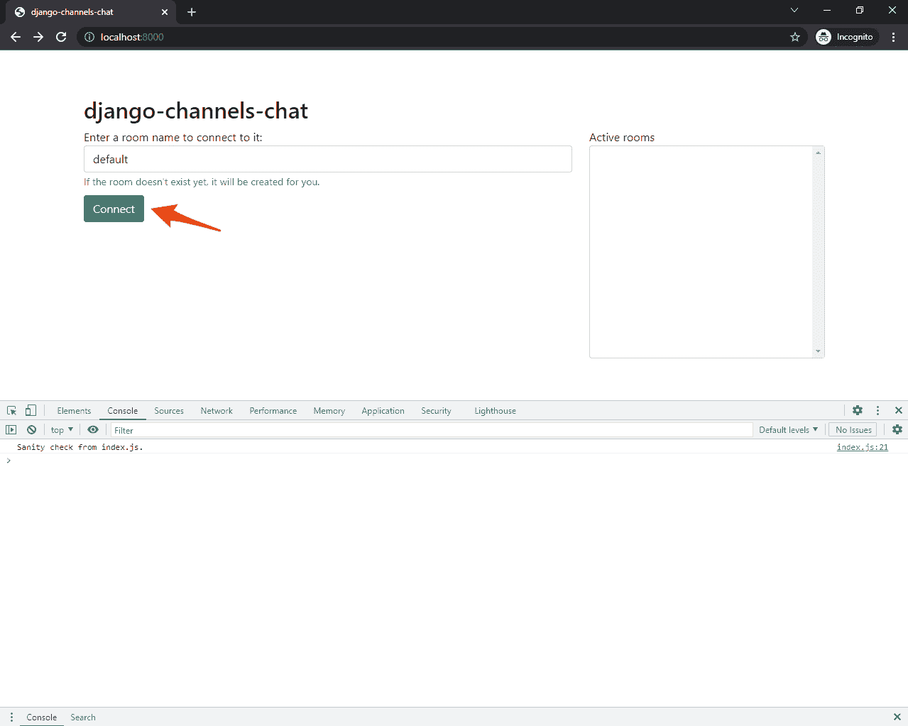
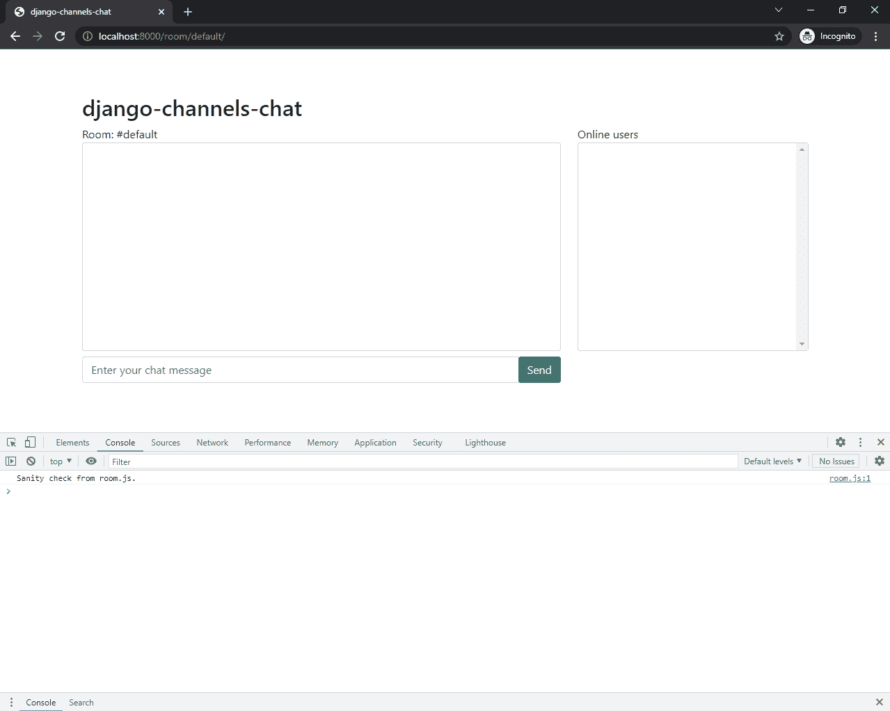
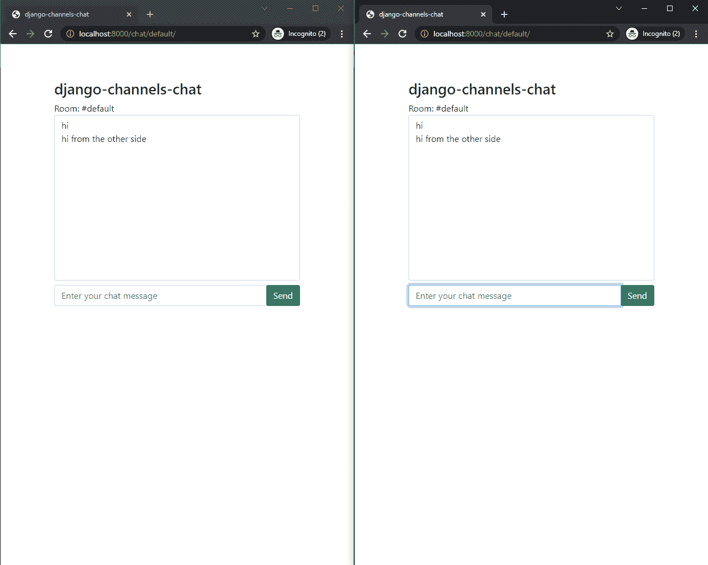
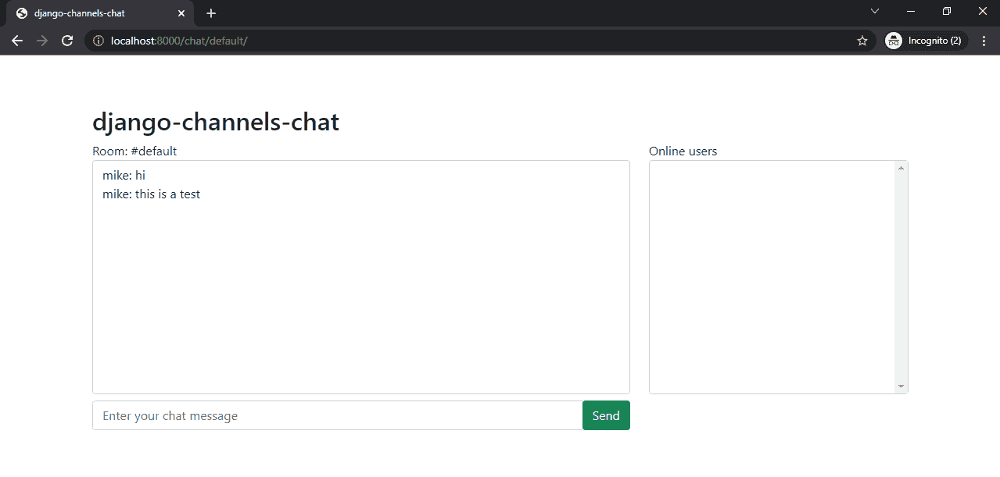
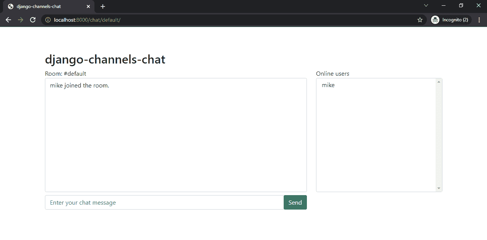
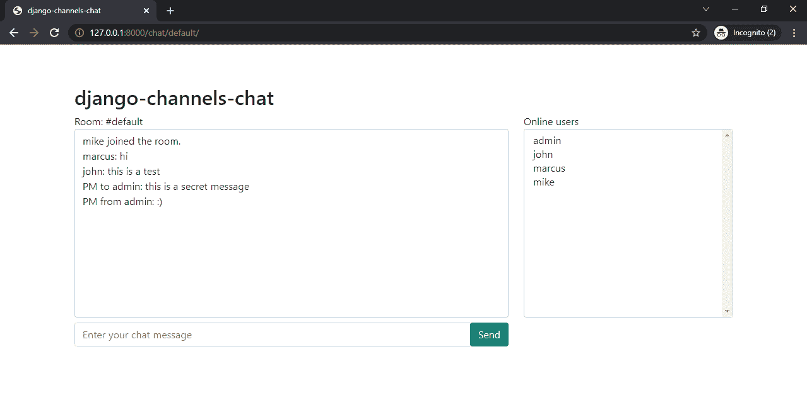

# Django 频道简介

> 原文：<https://testdriven.io/blog/django-channels/>

在本教程中，我们将使用 [Django 通道](https://channels.readthedocs.io/en/stable/)构建一个实时聊天应用程序，重点关注如何将 Django 与 Django 通道集成。

> **为什么是另一款聊天应用？**嗯，聊天 app 是最容易展现渠道力量的方式。也就是说，本教程通过实现多种请求类型、消息/聊天室持久性和私有(一对一)消息传递超越了基础知识。完成教程后，您将能够构建实时应用程序。

## 什么是 Django 频道？

Django Channels (或者仅仅是 Channels)扩展了 [Django](https://www.djangoproject.com/) 的内置功能，允许 Django 项目不仅处理 HTTP，还处理需要长时间运行连接的协议，例如 WebSockets、MQTT (IoT)、聊天机器人、无线电和其他实时应用程序。除此之外，它还支持 Django 的许多核心特性，比如身份验证和会话。

基本的通道设置如下所示:



> 要了解更多关于渠道的信息，请查看来自[官方文档](https://channels.readthedocs.io/)的[简介](https://channels.readthedocs.io/en/stable/introduction.html)指南。

## 同步与异步

由于 Channels 和 Django 之间的差异，我们必须频繁地在同步和异步代码执行之间切换。例如，Django 数据库需要使用同步代码访问，而 Channels 通道层需要使用异步代码访问。

在这两者之间切换最简单的方法是使用内置的 Django [asgiref](https://github.com/django/asgiref) ( `asgrief.sync`)函数:

1.  `sync_to_async` -获取一个同步函数并返回一个包装它的异步函数
2.  `async_to_sync` -获取异步函数并返回同步函数

> 现在还不要担心这个，我们将在教程的后面展示一个实际的例子。

## 项目设置

同样，我们将构建一个聊天应用程序。该应用程序将有多个房间，Django 认证的用户可以聊天。每个房间都有一个当前连接用户的列表。我们还将实现私有的一对一消息传递。

### Django 项目设置

首先创建一个新目录，并建立一个新的 Django 项目:

```
`$ mkdir django-channels-example && cd django-channels-example
$ python3.9 -m venv env
$ source env/bin/activate

(env)$ pip install django==4.0
(env)$ django-admin startproject core .` 
```

之后，创建一个名为`chat`的新 Django 应用程序:

```
`(env)$ python manage.py startapp chat` 
```

在`INSTALLED_APPS`下的 *core/settings.py* 中注册 app:

```
`# core/settings.py

INSTALLED_APPS = [
    'django.contrib.admin',
    'django.contrib.auth',
    'django.contrib.contenttypes',
    'django.contrib.sessions',
    'django.contrib.messages',
    'django.contrib.staticfiles',
    'chat.apps.ChatConfig',  # new
]` 
```

### 创建数据库模型

接下来，让我们在 *chat/models.py* 中创建两个 Django 模型`Room`和`Message`:

```
`# chat/models.py

from django.contrib.auth.models import User
from django.db import models

class Room(models.Model):
    name = models.CharField(max_length=128)
    online = models.ManyToManyField(to=User, blank=True)

    def get_online_count(self):
        return self.online.count()

    def join(self, user):
        self.online.add(user)
        self.save()

    def leave(self, user):
        self.online.remove(user)
        self.save()

    def __str__(self):
        return f'{self.name} ({self.get_online_count()})'

class Message(models.Model):
    user = models.ForeignKey(to=User, on_delete=models.CASCADE)
    room = models.ForeignKey(to=Room, on_delete=models.CASCADE)
    content = models.CharField(max_length=512)
    timestamp = models.DateTimeField(auto_now_add=True)

    def __str__(self):
        return f'{self.user.username}: {self.content} [{self.timestamp}]'` 
```

注意事项:

1.  `Room`代表聊天室。它包含一个`online`字段，用于跟踪用户何时连接和断开聊天室。
2.  `Message`代表发送到聊天室的消息。我们将使用这个模型来存储聊天中发送的所有消息。

运行`makemigrations`和`migrate`命令来同步数据库:

```
`(env)$ python manage.py makemigrations
(env)$ python manage.py migrate` 
```

在 *chat/admin.py* 中注册模型，以便可以从 Django 管理面板访问它们:

```
`# chat/admin.py

from django.contrib import admin

from chat.models import Room, Message

admin.site.register(Room)
admin.site.register(Message)` 
```

### 视图和 URL

web 应用程序将有以下两个 URL:

1.  `/chat/` -聊天室选择器
2.  `/chat/<ROOM_NAME>/` -聊天室

将以下视图添加到 *chat/views.py* 中:

```
`# chat/views.py

from django.shortcuts import render

from chat.models import Room

def index_view(request):
    return render(request, 'index.html', {
        'rooms': Room.objects.all(),
    })

def room_view(request, room_name):
    chat_room, created = Room.objects.get_or_create(name=room_name)
    return render(request, 'room.html', {
        'room': chat_room,
    })` 
```

在`chat`应用内创建一个 *urls.py* 文件:

```
`# chat/urls.py

from django.urls import path

from . import views

urlpatterns = [
    path('', views.index_view, name='chat-index'),
    path('<str:room_name>/', views.room_view, name='chat-room'),
]` 
```

用`chat`应用程序更新项目级的 *urls.py* 文件:

```
`# core/urls.py

from django.contrib import admin
from django.urls import path, include

urlpatterns = [
    path('chat/', include('chat.urls')),  # new
    path('admin/', admin.site.urls),
]` 
```

### 模板和静态文件

在“聊天”中名为“模板”的新文件夹中创建一个*index.html*文件:

```
`<!-- chat/templates/index.html -->



<!DOCTYPE html>
<html lang="en">
    <head>
        <title>django-channels-chat</title>
        <link rel="stylesheet" href="https://cdn.jsdelivr.net/npm/[[email protected]](/cdn-cgi/l/email-protection)/dist/css/bootstrap.min.css">
        <script src="https://cdn.jsdelivr.net/npm/[[email protected]](/cdn-cgi/l/email-protection)/dist/js/bootstrap.min.js"></script>
        <style> #roomSelect  { height:  300px; } </style>
    </head>
    <body>
        <div class="container mt-3 p-5">
            <h2>django-channels-chat</h2>
            <div class="row">
                <div class="col-12 col-md-8">
                    <div class="mb-2">
                        <label for="roomInput">Enter a room name to connect to it:</label>
                        <input type="text" class="form-control" id="roomInput" placeholder="Room name">
                        <small id="roomInputHelp" class="form-text text-muted">If the room doesn't exist yet, it will be created for you.</small>
                    </div>
                    <button type="button" id="roomConnect" class="btn btn-success">Connect</button>
                </div>
                <div class="col-12 col-md-4">
                    <label for="roomSelect">Active rooms</label>
                    <select multiple class="form-control" id="roomSelect">
                        
                            <option>{{ room }}</option>
                        
                    </select>
                </div>
            </div>
        </div>
        <script src=""></script>
    </body>
</html>` 
```

接下来，在同一个文件夹中添加*room.html*:

```
`<!-- chat/templates/room.html -->



<!DOCTYPE html>
<html lang="en">
    <head>
        <title>django-channels-chat</title>
        <link rel="stylesheet" href="https://cdn.jsdelivr.net/npm/[[email protected]](/cdn-cgi/l/email-protection)/dist/css/bootstrap.min.css">
        <script src="https://cdn.jsdelivr.net/npm/[[email protected]](/cdn-cgi/l/email-protection)/dist/js/bootstrap.min.js"></script>
        <style> #chatLog  { height:  300px; background-color:  #FFFFFF; resize:  none; } #onlineUsersSelector  { height:  300px; } </style>
    </head>
    <body>
        <div class="container mt-3 p-5">
            <h2>django-channels-chat</h2>
            <div class="row">
                <div class="col-12 col-md-8">
                    <div class="mb-2">
                        <label for="chatLog">Room: #{{ room.name }}</label>
                        <textarea class="form-control" id="chatLog" readonly></textarea>
                    </div>
                    <div class="input-group">
                        <input type="text" class="form-control" id="chatMessageInput" placeholder="Enter your chat message">
                        <div class="input-group-append">
                            <button class="btn btn-success" id="chatMessageSend" type="button">Send</button>
                        </div>
                    </div>
                </div>
                <div class="col-12 col-md-4">
                    <label for="onlineUsers">Online users</label>
                    <select multiple class="form-control" id="onlineUsersSelector">
                    </select>
                </div>
            </div>
            {{ room.name|json_script:"roomName" }}
        </div>
        <script src=""></script>
    </body>
</html>` 
```

为了使我们的代码更具可读性，我们将 JavaScript 代码包含在单独的文件中——分别是 *index.js* 和 *room.js* 。因为我们无法在 JavaScript 中访问 Django 上下文，所以我们可以使用 [json_script](https://docs.djangoproject.com/en/4.0/ref/templates/builtins/#json-script) 模板标签来存储`room.name`，然后在 JavaScript 文件中获取它。

在“聊天”里面，创建一个名为“静态”的文件夹。然后，在“静态”内部，创建一个 *index.js* 和一个 *room.js* 文件。

*index.js* :

```
`// chat/static/index.js console.log("Sanity check from index.js."); // focus 'roomInput' when user opens the page document.querySelector("#roomInput").focus(); // submit if the user presses the enter key document.querySelector("#roomInput").onkeyup  =  function(e)  { if  (e.keyCode  ===  13)  {  // enter key document.querySelector("#roomConnect").click(); } }; // redirect to '/room/<roomInput>/' document.querySelector("#roomConnect").onclick  =  function()  { let  roomName  =  document.querySelector("#roomInput").value; window.location.pathname  =  "chat/"  +  roomName  +  "/"; } // redirect to '/room/<roomSelect>/' document.querySelector("#roomSelect").onchange  =  function()  { let  roomName  =  document.querySelector("#roomSelect").value.split(" (")[0]; window.location.pathname  =  "chat/"  +  roomName  +  "/"; }` 
```

*room.js* :

```
`// chat/static/room.js console.log("Sanity check from room.js."); const  roomName  =  JSON.parse(document.getElementById('roomName').textContent); let  chatLog  =  document.querySelector("#chatLog"); let  chatMessageInput  =  document.querySelector("#chatMessageInput"); let  chatMessageSend  =  document.querySelector("#chatMessageSend"); let  onlineUsersSelector  =  document.querySelector("#onlineUsersSelector"); // adds a new option to 'onlineUsersSelector' function  onlineUsersSelectorAdd(value)  { if  (document.querySelector("option[value='"  +  value  +  "']"))  return; let  newOption  =  document.createElement("option"); newOption.value  =  value; newOption.innerHTML  =  value; onlineUsersSelector.appendChild(newOption); } // removes an option from 'onlineUsersSelector' function  onlineUsersSelectorRemove(value)  { let  oldOption  =  document.querySelector("option[value='"  +  value  +  "']"); if  (oldOption  !==  null)  oldOption.remove(); } // focus 'chatMessageInput' when user opens the page chatMessageInput.focus(); // submit if the user presses the enter key chatMessageInput.onkeyup  =  function(e)  { if  (e.keyCode  ===  13)  {  // enter key chatMessageSend.click(); } }; // clear the 'chatMessageInput' and forward the message chatMessageSend.onclick  =  function()  { if  (chatMessageInput.value.length  ===  0)  return; // TODO: forward the message to the WebSocket chatMessageInput.value  =  ""; };` 
```

您最终的“聊天”应用程序目录结构应该如下所示:

```
`chat
├── __init__.py
├── admin.py
├── apps.py
├── migrations
│   ├── 0001_initial.py
│   ├── __init__.py
├── models.py
├── static
│   ├── index.js
│   └── room.js
├── templates
│   ├── index.html
│   └── room.html
├── tests.py
├── urls.py
└── views.py` 
```

### 测试

有了基本的项目设置，让我们在浏览器中进行测试。

启动 Django 开发服务器:

```
`(env)$ python manage.py runserver` 
```

导航到[http://localhost:8000/chat/](http://localhost:8000/chat/)。您将看到房间选择器:



要确保静态文件配置正确，请打开“开发人员控制台”。您应该看到健全性检查:

```
`Sanity check from index.js.` 
```

接下来，在“房间名称”文本输入中输入一些内容，然后按回车键。您将被重定向到房间:



> 这些只是静态模板。我们稍后将为聊天和在线用户实现该功能。

## 添加频道

接下来，让我们连接 Django 频道。

首先安装软件包:

```
`(env)$ pip install channels==3.0.4` 
```

然后，将`channels`添加到 *core/settings.py* 内的`INSTALLED_APPS`中:

```
`# core/settings.py

INSTALLED_APPS = [
    'django.contrib.admin',
    'django.contrib.auth',
    'django.contrib.contenttypes',
    'django.contrib.sessions',
    'django.contrib.messages',
    'django.contrib.staticfiles',
    'chat.apps.ChatConfig',
    'channels',  # new
]` 
```

因为我们将使用 WebSockets 而不是 HTTP 从客户端到服务器进行通信，所以我们需要用 *core/asgi.py* 中的 [ProtocolTypeRouter](https://channels.readthedocs.io/en/latest/topics/routing.html#protocoltyperouter) 包装我们的 ASGI 配置:

```
`# core/asgi.py

import os

from channels.routing import ProtocolTypeRouter
from django.core.asgi import get_asgi_application

os.environ.setdefault('DJANGO_SETTINGS_MODULE', 'core.settings')

application = ProtocolTypeRouter({
  'http': get_asgi_application(),
})` 
```

该路由器将根据使用的协议将流量路由到 web 应用程序的不同部分。

> Django 版本<= 2.2 don't have built-in ASGI support. In order to get 【 running with older Django versions please refer to the [官方安装指南](https://channels.readthedocs.io/en/stable/installation.html)。

接下来，我们需要让 Django 知道我们的 ASGI 应用程序的位置。将以下内容添加到您的 *core/settings.py* 文件中，就在`WSGI_APPLICATION`设置的下面:

```
`# core/settings.py

WSGI_APPLICATION = 'core.wsgi.application'
ASGI_APPLICATION = 'core.asgi.application'  # new` 
```

当您现在运行开发服务器时，您将看到 Channels 正在被使用:

```
`Starting ASGI/Channels version 3.0.4 development server at http://127.0.0.1:8000/` 
```

### 添加通道层

一个[通道层](https://channels.readthedocs.io/en/stable/topics/channel_layers.html)是一种通信系统，它允许我们的应用程序的多个部分交换消息，而不需要在数据库中穿梭所有的消息或事件。

我们需要一个通道层来让消费者(我们将在下一步中实现)能够相互交谈。

虽然我们可以使用 [InMemoryChannelLayer](https://channels.readthedocs.io/en/stable/topics/channel_layers.html#in-memory-channel-layer) 层，因为我们处于开发模式，但我们将使用一个生产就绪层， [RedisChannelLayer](https://channels.readthedocs.io/en/stable/topics/channel_layers.html#redis-channel-layer) 。

由于这一层需要 [Redis](https://redis.io/) ，运行下面的命令让它启动并运行 [Docker](https://www.docker.com/) :

```
`(env)$ docker run -p 6379:6379 -d redis:5` 
```

该命令下载映像并在端口`6379`上启动 Redis Docker 容器。

> 如果不想用 Docker，可以直接从[官网](https://redis.io/download)下载 Redis。

要从 Django 连接到 Redis，我们需要安装一个名为 [channels_redis](https://github.com/django/channels_redis) 的附加包:

```
`(env)$ pip install channels_redis==3.3.1` 
```

之后，在 *core/settings.py* 中配置图层如下:

```
`# core/settings.py

CHANNEL_LAYERS = {
    'default': {
        'BACKEND': 'channels_redis.core.RedisChannelLayer',
        'CONFIG': {
            "hosts": [('127.0.0.1', 6379)],
        },
    },
}` 
```

这里，我们让 channels_redis 知道 redis 服务器的位置。

要测试一切是否按预期运行，请打开 Django shell:

```
`(env)$ python manage.py shell` 
```

然后运行:

```
`>>> import channels.layers
>>> channel_layer = channels.layers.get_channel_layer()
>>>
>>> from asgiref.sync import async_to_sync
>>> async_to_sync(channel_layer.send)('test_channel', {'type': 'hello'})
>>> async_to_sync(channel_layer.receive)('test_channel')
{'type': 'hello'}` 
```

这里，我们使用 *core/settings.py* 中定义的设置连接到通道层。然后，我们使用`channel_layer.send`向`test_channel`组发送消息，使用`channel_layer.receive`读取发送给同一个组的所有消息。

> 注意，我们在`async_to_sync`中包装了所有的函数调用，因为通道层是异步的。

输入`quit()`退出外壳。

### 添加频道消费者

一个[消费者](https://channels.readthedocs.io/en/stable/topics/consumers.html)是渠道代码的基本单位。它们是由事件驱动的小型 ASGI 应用程序。它们类似于 Django 的观点。然而，与 Django 视图不同，消费者在默认情况下是长期运行的。一个 Django 项目可以有多个消费者，这些消费者使用通道路由进行组合(我们将在下一节中讨论)。

每个使用者都有自己的作用域，它是关于单个传入连接的一组细节。它们包含协议类型、路径、报头、路由参数、用户代理等数据。

在“聊天”中创建一个名为 *consumers.py* 的新文件:

```
`# chat/consumers.py

import json

from asgiref.sync import async_to_sync
from channels.generic.websocket import WebsocketConsumer

from .models import Room

class ChatConsumer(WebsocketConsumer):

    def __init__(self, *args, **kwargs):
        super().__init__(args, kwargs)
        self.room_name = None
        self.room_group_name = None
        self.room = None

    def connect(self):
        self.room_name = self.scope['url_route']['kwargs']['room_name']
        self.room_group_name = f'chat_{self.room_name}'
        self.room = Room.objects.get(name=self.room_name)

        # connection has to be accepted
        self.accept()

        # join the room group
        async_to_sync(self.channel_layer.group_add)(
            self.room_group_name,
            self.channel_name,
        )

    def disconnect(self, close_code):
        async_to_sync(self.channel_layer.group_discard)(
            self.room_group_name,
            self.channel_name,
        )

    def receive(self, text_data=None, bytes_data=None):
        text_data_json = json.loads(text_data)
        message = text_data_json['message']

        # send chat message event to the room
        async_to_sync(self.channel_layer.group_send)(
            self.room_group_name,
            {
                'type': 'chat_message',
                'message': message,
            }
        )

    def chat_message(self, event):
        self.send(text_data=json.dumps(event))` 
```

这里，我们创建了一个`ChatConsumer`，它继承了 [WebsocketConsumer](https://channels.readthedocs.io/en/latest/topics/consumers.html#websocketconsumer) 。`WebsocketConsumer`提供了三种方法，`connect()`、`disconnect()`、`receive()`:

1.  在`connect()`内部，我们调用了`accept()`来接受连接。之后，我们将用户添加到通道层组。
2.  在`disconnect()`中，我们从频道层组中移除了用户。
3.  在`receive()`中，我们将数据解析为 JSON 并提取出`message`。然后，我们使用`group_send`将`message`转发给`chat_message`。

> 当使用通道层的`group_send`时，您的消费者必须为您使用的每个 JSON 消息`type`准备一个方法。在我们的情况下，`type`等于`chat_message`。因此，我们添加了一个叫做`chat_message`的方法。
> 
> 如果你在你的消息类型中使用点，当寻找一个方法时，通道会自动将它们转换成下划线——例如，`chat.message`会变成`chat_message`。

由于`WebsocketConsumer`是一个同步消费者，我们在处理通道层时必须调用`async_to_sync`。我们决定使用同步消费者，因为聊天应用程序与 Django 紧密相连(默认情况下是同步的)。换句话说，我们不会因为使用异步消费者而获得性能提升。

> 默认情况下，您应该使用同步消费者。此外，只有在你完全确定你正在做的事情将从异步处理中受益(例如，可以并行完成的长时间运行的任务)并且你只使用异步本地库的情况下，才使用异步消费者。

### 添加通道路由

Channels 提供了不同的[路由](https://channels.readthedocs.io/en/stable/topics/routing.html)类，允许我们组合和堆叠消费者。它们类似于 Django 的 URL。

向“聊天”添加一个 *routing.py* 文件:

```
`# chat/routing.py

from django.urls import re_path

from . import consumers

websocket_urlpatterns = [
    re_path(r'ws/chat/(?P<room_name>\w+)/$', consumers.ChatConsumer.as_asgi()),
]` 
```

在 *core/asgi.py* 中注册 *routing.py* 文件:

```
`# core/asgi.py

import os

from channels.routing import ProtocolTypeRouter, URLRouter
from django.core.asgi import get_asgi_application

import chat.routing

os.environ.setdefault('DJANGO_SETTINGS_MODULE', 'core.settings')

application = ProtocolTypeRouter({
  'http': get_asgi_application(),
  'websocket': URLRouter(
      chat.routing.websocket_urlpatterns
    ),
})` 
```

### WebSockets(前端)

为了从前端与通道通信，我们将使用 [WebSocket API](https://developer.mozilla.org/en-US/docs/Web/API/WebSocket) 。

WebSockets 非常容易使用。首先，您需要通过提供一个`url`来建立连接，然后您可以监听以下事件:

1.  `onopen` -当 WebSocket 连接建立时调用
2.  `onclose` -当 WebSocket 连接被破坏时调用
3.  `onmessage` -当 WebSocket 收到消息时调用
4.  `onerror` -当 WebSocket 遇到错误时调用

要将 WebSockets 集成到应用程序中，请将以下内容添加到 *room.js* 的底部:

```
`// chat/static/room.js let  chatSocket  =  null; function  connect()  { chatSocket  =  new  WebSocket("ws://"  +  window.location.host  +  "/ws/chat/"  +  roomName  +  "/"); chatSocket.onopen  =  function(e)  { console.log("Successfully connected to the WebSocket."); } chatSocket.onclose  =  function(e)  { console.log("WebSocket connection closed unexpectedly. Trying to reconnect in 2s..."); setTimeout(function()  { console.log("Reconnecting..."); connect(); },  2000); }; chatSocket.onmessage  =  function(e)  { const  data  =  JSON.parse(e.data); console.log(data); switch  (data.type)  { case  "chat_message": chatLog.value  +=  data.message  +  "\n"; break; default: console.error("Unknown message type!"); break; } // scroll 'chatLog' to the bottom chatLog.scrollTop  =  chatLog.scrollHeight; }; chatSocket.onerror  =  function(err)  { console.log("WebSocket encountered an error: "  +  err.message); console.log("Closing the socket."); chatSocket.close(); } } connect();` 
```

建立 WebSocket 连接后，在`onmessage`事件中，我们根据`data.type`确定消息类型。请注意我们如何将 WebSocket 包装在`connect()`方法中，以便在连接断开时能够重新建立连接。

最后，将`chatMessageSend.onclickForm`中的 TODO 更改为以下内容:

```
`// chat/static/room.js chatSocket.send(JSON.stringify({ "message":  chatMessageInput.value, }));` 
```

完整的处理程序现在应该如下所示:

```
`// chat/static/room.js chatMessageSend.onclick  =  function()  { if  (chatMessageInput.value.length  ===  0)  return; chatSocket.send(JSON.stringify({ "message":  chatMessageInput.value, })); chatMessageInput.value  =  ""; };` 
```

聊天的第一个版本完成了。

要进行测试，请运行开发服务器。然后，打开两个私人/匿名浏览器窗口，并在每个窗口中导航到[http://localhost:8000/chat/default/](http://localhost:8000/chat/default/)。您应该能够发送一条消息:



基本功能到此为止。接下来，我们来看看身份认证。

## 证明

### 后端

Channels 附带了一个用于 Django 会话和名为`AuthMiddlewareStack`的[认证](https://channels.readthedocs.io/en/latest/topics/authentication.html)管理的内置类。

要使用它，我们唯一要做的就是把`URLRouter`包在 *core/asgi.py* 里面，就像这样:

```
`# core/asgi.py

import os

from channels.auth import AuthMiddlewareStack  # new import
from channels.routing import ProtocolTypeRouter, URLRouter
from django.core.asgi import get_asgi_application

import chat.routing

os.environ.setdefault('DJANGO_SETTINGS_MODULE', 'core.settings')

application = ProtocolTypeRouter({
  'http': get_asgi_application(),
  'websocket': AuthMiddlewareStack(  # new
        URLRouter(
            chat.routing.websocket_urlpatterns
        )
    ),  # new
})` 
```

现在，只要经过身份验证的客户端加入，用户对象就会被添加到该范围。可以这样访问它:

```
`user = self.scope['user']` 
```

> 如果您想使用前端 JavaScript 框架(如 Angular、React 或 Vue)运行通道，您必须使用不同的认证系统(例如令牌认证)。如果您想了解如何对通道使用令牌认证，请查看以下课程:
> 
> 1.  [利用 Django 频道和 Angular 开发实时打车应用](/courses/real-time-app-with-django-channels-and-angular/)
> 2.  [使用 Django Channels 和 React 开发实时打车应用](/courses/taxi-react/)

让我们修改`ChatConsumer`来阻止未通过身份验证的用户说话，并在消息中显示用户的用户名。

将 *chat/consumers.py* 更改如下:

```
`# chat/consumers.py

import json

from asgiref.sync import async_to_sync
from channels.generic.websocket import WebsocketConsumer

from .models import Room, Message  # new import

class ChatConsumer(WebsocketConsumer):

    def __init__(self, *args, **kwargs):
        super().__init__(args, kwargs)
        self.room_name = None
        self.room_group_name = None
        self.room = None
        self.user = None  # new

    def connect(self):
        self.room_name = self.scope['url_route']['kwargs']['room_name']
        self.room_group_name = f'chat_{self.room_name}'
        self.room = Room.objects.get(name=self.room_name)
        self.user = self.scope['user']  # new

        # connection has to be accepted
        self.accept()

        # join the room group
        async_to_sync(self.channel_layer.group_add)(
            self.room_group_name,
            self.channel_name,
        )

    def disconnect(self, close_code):
        async_to_sync(self.channel_layer.group_discard)(
            self.room_group_name,
            self.channel_name,
        )

    def receive(self, text_data=None, bytes_data=None):
        text_data_json = json.loads(text_data)
        message = text_data_json['message']

        if not self.user.is_authenticated:  # new
            return                          # new

        # send chat message event to the room
        async_to_sync(self.channel_layer.group_send)(
            self.room_group_name,
            {
                'type': 'chat_message',
                'user': self.user.username,  # new
                'message': message,
            }
        )
        Message.objects.create(user=self.user, room=self.room, content=message)  # new

    def chat_message(self, event):
        self.send(text_data=json.dumps(event))` 
```

### 前端

接下来，让我们修改 *room.js* 来显示用户的用户名。在`chatSocket.onMessage`中，添加以下内容:

```
`// chat/static/room.js chatSocket.onmessage  =  function(e)  { const  data  =  JSON.parse(e.data); console.log(data); switch  (data.type)  { case  "chat_message": chatLog.value  +=  data.user  +  ": "  +  data.message  +  "\n";  // new break; default: console.error("Unknown message type!"); break; } // scroll 'chatLog' to the bottom chatLog.scrollTop  =  chatLog.scrollHeight; };` 
```

### 测试

创建一个超级用户，用于测试:

```
`(env)$ python manage.py createsuperuser` 
```

运行服务器:

```
`(env)$ python manage.py runserver` 
```

打开浏览器，使用 Django admin 登录到[http://localhost:8000/admin](http://localhost:8000/admin)。

然后导航到[http://localhost:8000/chat/default](http://localhost:8000/chat/default)。测试一下！



注销 Django 管理员。导航到[http://localhost:8000/chat/default](http://localhost:8000/chat/default)。尝试发布消息时会发生什么？

## 用户消息

接下来，我们将添加以下三种消息类型:

1.  `user_list` -发送给新加入的用户(`data.users` =在线用户列表)
2.  `user_join` -当用户加入聊天室时发送
3.  `user_leave` -当用户离开聊天室时发送

### 后端

在`ChatConsumer`中的`connect`方法的末尾添加:

```
`# chat/consumers.py

def connect(self):
    # ...

    # send the user list to the newly joined user
    self.send(json.dumps({
        'type': 'user_list',
        'users': [user.username for user in self.room.online.all()],
    }))

    if self.user.is_authenticated:
        # send the join event to the room
        async_to_sync(self.channel_layer.group_send)(
            self.room_group_name,
            {
                'type': 'user_join',
                'user': self.user.username,
            }
        )
        self.room.online.add(self.user)` 
```

在`ChatConsumer`中的`disconnect`方法的末尾添加:

```
`# chat/consumers.py

def disconnect(self, close_code):
    # ...

    if self.user.is_authenticated:
        # send the leave event to the room
        async_to_sync(self.channel_layer.group_send)(
            self.room_group_name,
            {
                'type': 'user_leave',
                'user': self.user.username,
            }
        )
        self.room.online.remove(self.user)` 
```

因为我们添加了新的消息类型，所以我们还需要添加通道层的方法。在 *chat/consumers.py* 末尾添加:

```
`# chat/consumers.py

def user_join(self, event):
    self.send(text_data=json.dumps(event))

def user_leave(self, event):
    self.send(text_data=json.dumps(event))` 
```

你的 *consumers.py* 在这一步之后应该是这样的: [consumers.py](https://gist.github.com/duplxey/095d2abd25cef0b58c4aa724bab6fb70) 。

### 前端

为了处理来自前端的消息，将以下情况添加到`chatSocket.onmessage`处理程序中的 switch 语句中:

```
`// chat/static/room.js switch  (data.type)  { // ... case  "user_list": for  (let  i  =  0;  i  <  data.users.length;  i++)  { onlineUsersSelectorAdd(data.users[i]); } break; case  "user_join": chatLog.value  +=  data.user  +  " joined the room.\n"; onlineUsersSelectorAdd(data.user); break; case  "user_leave": chatLog.value  +=  data.user  +  " left the room.\n"; onlineUsersSelectorRemove(data.user); break; // ...` 
```

#### 测试

再次运行服务器，登录，访问[http://localhost:8000/chat/default](http://localhost:8000/chat/default)。



您现在应该能够看到加入和离开消息。用户列表也应该被填充。

## 私人信息

Channels 包不允许直接过滤，所以没有从一个客户端向另一个客户端发送消息的内置方法。通过频道，您可以将消息发送给:

1.  消费者的客户端(`self.send`)
2.  一个通道层组(`self.channel_layer.group_send`)

因此，为了实现私有消息传递，我们将:

1.  每当客户端加入时，创建一个名为`inbox_%USERNAME%`的新组。
2.  将客户添加到他们自己的收件箱组(`inbox_%USERNAME%`)。
3.  当客户端断开连接时，将其从收件箱群组(`inbox_%USERNAME%`)中移除。

一旦实现，每个客户将有自己的私人邮件收件箱。然后，其他客户端可以向`inbox_%TARGET_USERNAME%`发送私人消息。

### 后端

修改 *chat/consumers.py* 。

```
`# chat/consumers.py

class ChatConsumer(WebsocketConsumer):

    def __init__(self, *args, **kwargs):
        # ...
        self.user_inbox = None  # new

    def connect(self):
        # ...
        self.user_inbox = f'inbox_{self.user.username}'  # new

        # accept the incoming connection
        self.accept()

        # ...

        if self.user.is_authenticated:
            # -------------------- new --------------------
            # create a user inbox for private messages
            async_to_sync(self.channel_layer.group_add)(
                self.user_inbox,
                self.channel_name,
            )
            # ---------------- end of new ----------------
            # ...

    def disconnect(self, close_code):
        # ...

        if self.user.is_authenticated:
            # -------------------- new --------------------
            # delete the user inbox for private messages
            async_to_sync(self.channel_layer.group_discard)(
                self.user_inbox,
                self.channel_name,
            )
            # ---------------- end of new ----------------
            # ...` 
```

所以，我们:

1.  将`user_inbox`添加到`ChatConsumer`并在`connect()`上初始化。
2.  连接时将用户添加到`user_inbox`组。
3.  当用户断开连接时，将用户从`user_inbox`组中移除。

接下来，修改`receive()`来处理私有消息:

```
`# chat/consumers.py

def receive(self, text_data=None, bytes_data=None):
    text_data_json = json.loads(text_data)
    message = text_data_json['message']

    if not self.user.is_authenticated:
        return

    # -------------------- new --------------------
    if message.startswith('/pm '):
        split = message.split(' ', 2)
        target = split[1]
        target_msg = split[2]

        # send private message to the target
        async_to_sync(self.channel_layer.group_send)(
            f'inbox_{target}',
            {
                'type': 'private_message',
                'user': self.user.username,
                'message': target_msg,
            }
        )
        # send private message delivered to the user
        self.send(json.dumps({
            'type': 'private_message_delivered',
            'target': target,
            'message': target_msg,
        }))
        return
    # ---------------- end of new ----------------

    # send chat message event to the room
    async_to_sync(self.channel_layer.group_send)(
        self.room_group_name,
        {
            'type': 'chat_message',
            'user': self.user.username,
            'message': message,
        }
    )
    Message.objects.create(user=self.user, room=self.room, content=message)` 
```

在 *chat/consumers.py* 的末尾增加以下方法:

```
`# chat/consumers.py

def private_message(self, event):
    self.send(text_data=json.dumps(event))

def private_message_delivered(self, event):
    self.send(text_data=json.dumps(event))` 
```

你最终的 *chat/consumers.py* 文件应该等于这个: [consumers.py](https://gist.github.com/duplxey/3efe783a9c4b7c12e9211c07063a3492)

### 前端

为了在前端处理私有消息，在`switch(data.type)`语句中添加`private_message`和`private_message_delivered`案例:

```
`// chat/static/room.js switch  (data.type)  { // ... case  "private_message": chatLog.value  +=  "PM from "  +  data.user  +  ": "  +  data.message  +  "\n"; break; case  "private_message_delivered": chatLog.value  +=  "PM to "  +  data.target  +  ": "  +  data.message  +  "\n"; break; // ... }` 
```

为了使聊天更加方便，我们可以在用户点击`onlineUsersSelector`中的一个在线用户时，将消息输入改为`pm %USERNAME%`。将以下处理程序添加到底部:

```
`// chat/static/room.js onlineUsersSelector.onchange  =  function()  { chatMessageInput.value  =  "/pm "  +  onlineUsersSelector.value  +  " "; onlineUsersSelector.value  =  null; chatMessageInput.focus(); };` 
```

### 测试

就是这样！chap 应用程序现已完成。让我们最后一次测试一下。

创建两个超级用户进行测试，然后运行服务器。

打开两个不同的私人/匿名浏览器，在[http://localhost:8000/admin](http://localhost:8000/admin)同时登录。

然后在两个浏览器中导航到[http://localhost:8000/chat/default](http://localhost:8000/chat/default)。单击其中一个已连接的用户，向他们发送私人消息:



## 结论

在本教程中，我们学习了如何在 Django 中使用通道。您了解了同步和异步代码执行之间的差异，以及以下通道的概念:

1.  顾客
2.  通道层
3.  按指定路线发送

最后，我们用 WebSockets 将所有东西捆绑在一起，构建了一个聊天应用程序。

我们的聊天远非完美。如果你想实践你所学的，你可以通过以下方法来提高它:

1.  添加管理员专用聊天室。
2.  当用户加入聊天室时，向用户发送最后十条消息。
3.  允许用户编辑和删除消息。
4.  添加“{user}”是键入“功能。
5.  添加消息反应。

> 这些想法从最容易实现到最难实现进行排序。

您可以从 GitHub 上的 [django-channels-example](https://github.com/testdrivenio/django-channels-example) 存储库中获取代码。