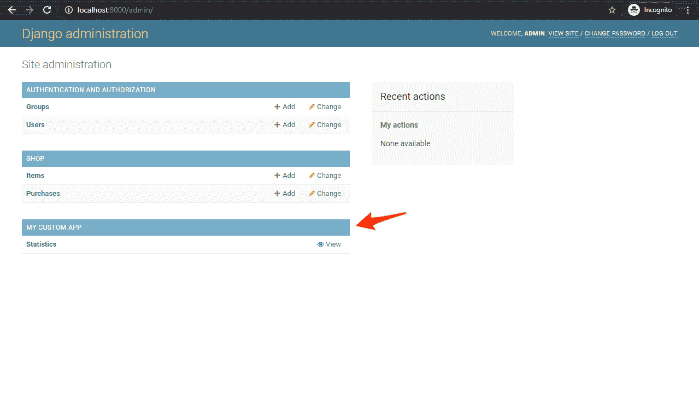
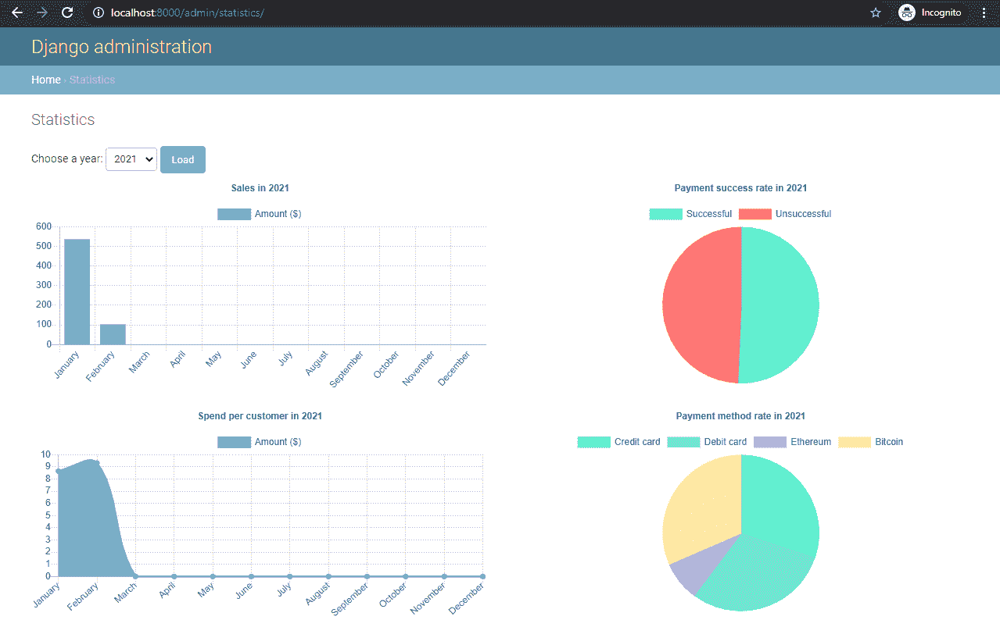
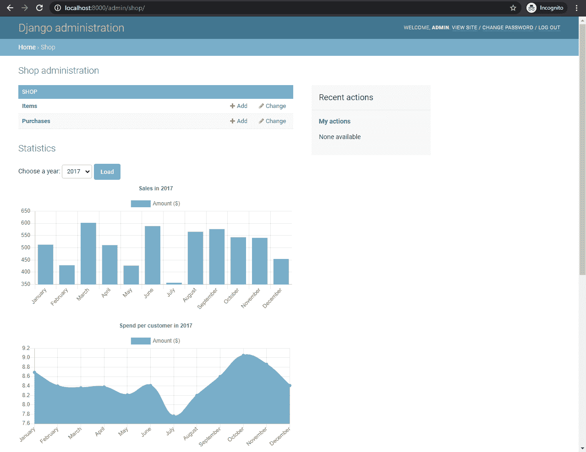

# 使用 Chart.js 向 Django 添加图表

> 原文：<https://testdriven.io/blog/django-charts/>

在本教程中，我们将看看如何使用 [Chart.js](https://www.chartjs.org/) 向 Django 添加交互式图表。我们将使用 Django 来建模和准备数据，然后使用 AJAX 从模板中异步获取数据。最后，我们将看看如何创建新的 Django 管理视图并扩展现有的管理模板，以便向 Django 管理添加自定义图表。

## 什么是 Chart.js？

[Chart.js](https://www.chartjs.org/) 是一个用于数据可视化的开源 JavaScript 库。它支持八种不同的图表类型:条形图、折线图、面积图、饼图、气泡图、雷达图、极坐标图和散点图。它灵活且高度可定制。它支持动画。最棒的是，它很容易使用。

首先，您只需要在 HTML 文件中包含 Chart.js 脚本和一个`<canvas>`节点:

```
`<script src="https://cdn.jsdelivr.net/npm/[[email protected]](/cdn-cgi/l/email-protection)"></script>

<canvas id="chart" width="500" height="500"></canvas>` 
```

然后，您可以像这样创建一个图表:

```
`let  ctx  =  document.getElementById("chart").getContext("2d"); let  chart  =  new  Chart(ctx,  { type:  "bar", data:  { labels:  ["2020/Q1",  "2020/Q2",  "2020/Q3",  "2020/Q4"], datasets:  [ { label:  "Gross volume ($)", backgroundColor:  "#79AEC8", borderColor:  "#417690", data:  [26900,  28700,  27300,  29200] } ] }, options:  { title:  { text:  "Gross Volume in 2020", display:  true } } });` 
```

此代码创建了以下图表:

见 [CodePen](https://codepen.io) 上 Michael Herman ( [@mjhea0](https://codepen.io/mjhea0) )的笔 [wvogmJy](https://codepen.io/mjhea0/pen/wvogmJy/) 。

[CodePen 链接](https://codepen.io/mjhea0/pen/wvogmJy)

> 要了解更多关于 Chart.js 的信息，请查看官方文档。

至此，我们来看看如何用 Chart.js 向 Django 添加图表。

## 项目设置

让我们创建一个简单的商店应用程序。我们将使用 Django 管理命令生成样本数据，然后用 Chart.js 将其可视化。

> 喜欢不同的 JavaScript 图表库，如 [D3.js](https://d3js.org/) 或 [Chartist](https://gionkunz.github.io/chartist-js/) ？您可以使用相同的方法将图表添加到 Django 和 Django admin 中。您只需要调整 JSON 端点中数据的格式。

工作流程:

1.  使用 Django ORM 查询获取数据
2.  格式化数据并通过受保护的端点返回
3.  使用 AJAX 从模板中请求数据
4.  初始化 Chart.js 并加载数据

首先创建一个新目录，并建立一个新的 Django 项目:

```
`$ mkdir django-interactive-charts && cd django-interactive-charts
$ python3.9 -m venv env
$ source env/bin/activate

(env)$ pip install django==3.1.6
(env)$ django-admin.py startproject core .` 
```

之后，创建一个名为`shop`的新应用:

```
`(env)$ python manage.py startapp shop` 
```

在`INSTALLED_APPS`下的 *core/settings.py* 中注册 app:

```
`# core/settings.py

INSTALLED_APPS = [
    'django.contrib.admin',
    'django.contrib.auth',
    'django.contrib.contenttypes',
    'django.contrib.sessions',
    'django.contrib.messages',
    'django.contrib.staticfiles',
    'shop.apps.ShopConfig', # new
]` 
```

### 创建数据库模型

接下来，创建`Item`和`Purchase`模型:

```
`# shop/models.py

from django.db import models

class Item(models.Model):
    name = models.CharField(max_length=255)
    description = models.TextField(null=True)
    price = models.FloatField(default=0)

    def __str__(self):
        return f'{self.name} (${self.price})'

class Purchase(models.Model):
    customer_full_name = models.CharField(max_length=64)
    item = models.ForeignKey(to=Item, on_delete=models.CASCADE)
    PAYMENT_METHODS = [
        ('CC', 'Credit card'),
        ('DC', 'Debit card'),
        ('ET', 'Ethereum'),
        ('BC', 'Bitcoin'),
    ]
    payment_method = models.CharField(max_length=2, default='CC', choices=PAYMENT_METHODS)
    time = models.DateTimeField(auto_now_add=True)
    successful = models.BooleanField(default=False)

    class Meta:
        ordering = ['-time']

    def __str__(self):
        return f'{self.customer_full_name}, {self.payment_method} ({self.item.name})'` 
```

1.  `Item`代表我们店里的一件商品
2.  `Purchase`代表购买(与`Item`相关联)

进行迁移，然后应用它们:

```
`(env)$ python manage.py makemigrations
(env)$ python manage.py migrate` 
```

在 *shop/admin.py* 中注册模型:

```
`# shop/admin.py

from django.contrib import admin

from shop.models import Item, Purchase

admin.site.register(Item)
admin.site.register(Purchase)` 
```

### 填充数据库

在创建任何图表之前，我们需要一些数据来处理。我创建了一个简单的命令，可以用来填充数据库。

在“商店”中创建一个名为“管理”的新文件夹，然后在该文件夹中创建另一个名为“命令”的文件夹。在“commands”文件夹中，创建一个名为 *populate_db.py* 的新文件。

```
`management
└── commands
    └── populate_db.py` 
```

*populate_db.py* :

```
`# shop/management/commands/populate_db.py

import random
from datetime import datetime, timedelta

import pytz
from django.core.management.base import BaseCommand

from shop.models import Item, Purchase

class Command(BaseCommand):
    help = 'Populates the database with random generated data.'

    def add_arguments(self, parser):
        parser.add_argument('--amount', type=int, help='The number of purchases that should be created.')

    def handle(self, *args, **options):
        names = ['James', 'John', 'Robert', 'Michael', 'William', 'David', 'Richard', 'Joseph', 'Thomas', 'Charles']
        surname = ['Smith', 'Jones', 'Taylor', 'Brown', 'Williams', 'Wilson', 'Johnson', 'Davies', 'Patel', 'Wright']
        items = [
            Item.objects.get_or_create(name='Socks', price=6.5), Item.objects.get_or_create(name='Pants', price=12),
            Item.objects.get_or_create(name='T-Shirt', price=8), Item.objects.get_or_create(name='Boots', price=9),
            Item.objects.get_or_create(name='Sweater', price=3), Item.objects.get_or_create(name='Underwear', price=9),
            Item.objects.get_or_create(name='Leggings', price=7), Item.objects.get_or_create(name='Cap', price=5),
        ]
        amount = options['amount'] if options['amount'] else 2500
        for i in range(0, amount):
            dt = pytz.utc.localize(datetime.now() - timedelta(days=random.randint(0, 1825)))
            purchase = Purchase.objects.create(
                customer_full_name=random.choice(names) + ' ' + random.choice(surname),
                item=random.choice(items)[0],
                payment_method=random.choice(Purchase.PAYMENT_METHODS)[0],
                successful=True if random.randint(1, 2) == 1 else False,
            )
            purchase.time = dt
            purchase.save()

        self.stdout.write(self.style.SUCCESS('Successfully populated the database.'))` 
```

运行以下命令来填充数据库:

```
`(env)$ python manage.py populate_db --amount 1000` 
```

如果一切顺利，您应该会在控制台上看到一条`Successfully populated the database.`消息。

这给数据库增加了 8 个项目和 1，000 次购买。

## 准备和提供数据

我们的应用将有以下端点:

1.  列出我们有记录的所有年份
2.  `chart/sales/<YEAR>/`按年提取月度总量数据
3.  `chart/spend-per-customer/<YEAR>/`按年度提取每位客户的月支出
4.  `chart/payment-success/YEAR/`取年度支付成功数据
5.  `chart/payment-method/YEAR/`获取年度支付方式数据(信用卡、借记卡、以太坊、比特币)

在添加视图之前，让我们创建几个实用函数，这将使创建图表变得更加容易。在项目根目录中添加一个名为“utils”的新文件夹。然后，向该文件夹添加一个名为 *charts.py* 的新文件:

```
`# util/charts.py

months = [
    'January', 'February', 'March', 'April',
    'May', 'June', 'July', 'August',
    'September', 'October', 'November', 'December'
]
colorPalette = ['#55efc4', '#81ecec', '#a29bfe', '#ffeaa7', '#fab1a0', '#ff7675', '#fd79a8']
colorPrimary, colorSuccess, colorDanger = '#79aec8', colorPalette[0], colorPalette[5]

def get_year_dict():
    year_dict = dict()

    for month in months:
        year_dict[month] = 0

    return year_dict

def generate_color_palette(amount):
    palette = []

    i = 0
    while i < len(colorPalette) and len(palette) < amount:
        palette.append(colorPalette[i])
        i += 1
        if i == len(colorPalette) and len(palette) < amount:
            i = 0

    return palette` 
```

因此，我们定义了图表颜色，并创建了以下两种方法:

1.  创建一个月和值的字典，我们将用它来添加月数据。
2.  `generate_color_palette(amount)`生成一个重复的调色板，我们将把它传递给我们的图表。

### 视图

创建视图:

```
`# shop/views.py

from django.contrib.admin.views.decorators import staff_member_required
from django.db.models import Count, F, Sum, Avg
from django.db.models.functions import ExtractYear, ExtractMonth
from django.http import JsonResponse

from shop.models import Purchase
from utils.charts import months, colorPrimary, colorSuccess, colorDanger, generate_color_palette, get_year_dict

@staff_member_required
def get_filter_options(request):
    grouped_purchases = Purchase.objects.annotate(year=ExtractYear('time')).values('year').order_by('-year').distinct()
    options = [purchase['year'] for purchase in grouped_purchases]

    return JsonResponse({
        'options': options,
    })

@staff_member_required
def get_sales_chart(request, year):
    purchases = Purchase.objects.filter(time__year=year)
    grouped_purchases = purchases.annotate(price=F('item__price')).annotate(month=ExtractMonth('time'))\
        .values('month').annotate(average=Sum('item__price')).values('month', 'average').order_by('month')

    sales_dict = get_year_dict()

    for group in grouped_purchases:
        sales_dict[months[group['month']-1]] = round(group['average'], 2)

    return JsonResponse({
        'title': f'Sales in {year}',
        'data': {
            'labels': list(sales_dict.keys()),
            'datasets': [{
                'label': 'Amount ($)',
                'backgroundColor': colorPrimary,
                'borderColor': colorPrimary,
                'data': list(sales_dict.values()),
            }]
        },
    })

@staff_member_required
def spend_per_customer_chart(request, year):
    purchases = Purchase.objects.filter(time__year=year)
    grouped_purchases = purchases.annotate(price=F('item__price')).annotate(month=ExtractMonth('time'))\
        .values('month').annotate(average=Avg('item__price')).values('month', 'average').order_by('month')

    spend_per_customer_dict = get_year_dict()

    for group in grouped_purchases:
        spend_per_customer_dict[months[group['month']-1]] = round(group['average'], 2)

    return JsonResponse({
        'title': f'Spend per customer in {year}',
        'data': {
            'labels': list(spend_per_customer_dict.keys()),
            'datasets': [{
                'label': 'Amount ($)',
                'backgroundColor': colorPrimary,
                'borderColor': colorPrimary,
                'data': list(spend_per_customer_dict.values()),
            }]
        },
    })

@staff_member_required
def payment_success_chart(request, year):
    purchases = Purchase.objects.filter(time__year=year)

    return JsonResponse({
        'title': f'Payment success rate in {year}',
        'data': {
            'labels': ['Successful', 'Unsuccessful'],
            'datasets': [{
                'label': 'Amount ($)',
                'backgroundColor': [colorSuccess, colorDanger],
                'borderColor': [colorSuccess, colorDanger],
                'data': [
                    purchases.filter(successful=True).count(),
                    purchases.filter(successful=False).count(),
                ],
            }]
        },
    })

@staff_member_required
def payment_method_chart(request, year):
    purchases = Purchase.objects.filter(time__year=year)
    grouped_purchases = purchases.values('payment_method').annotate(count=Count('id'))\
        .values('payment_method', 'count').order_by('payment_method')

    payment_method_dict = dict()

    for payment_method in Purchase.PAYMENT_METHODS:
        payment_method_dict[payment_method[1]] = 0

    for group in grouped_purchases:
        payment_method_dict[dict(Purchase.PAYMENT_METHODS)[group['payment_method']]] = group['count']

    return JsonResponse({
        'title': f'Payment method rate in {year}',
        'data': {
            'labels': list(payment_method_dict.keys()),
            'datasets': [{
                'label': 'Amount ($)',
                'backgroundColor': generate_color_palette(len(payment_method_dict)),
                'borderColor': generate_color_palette(len(payment_method_dict)),
                'data': list(payment_method_dict.values()),
            }]
        },
    })` 
```

注意事项:

1.  获取所有的购买，按年份分组，从时间字段中提取年份，并在列表中返回它们。
2.  获取所有购买(在特定年份)及其价格，按月分组，并计算每月价格总和。
3.  获取所有购买(在特定年份)及其价格，按月分组，并计算月平均价格。
4.  `payment_success_chart()`统计特定年份中成功和不成功的采购。
5.  获取所有购买(在特定年份)，按付款方式分组，计算购买数量，并在字典中返回。

> 注意，每个视图都有一个 [@staff_member_required](https://docs.djangoproject.com/en/3.1/ref/contrib/admin/#the-staff-member-required-decorator) 装饰器。

### 资源定位符

创建以下应用程序级别的 URL:

```
`# shop/urls.py

from django.urls import path

from . import views

urlpatterns = [
    path('chart/filter-options/', views.get_filter_options, name='chart-filter-options'),
    path('chart/sales/<int:year>/', views.get_sales_chart, name='chart-sales'),
    path('chart/spend-per-customer/<int:year>/', views.spend_per_customer_chart, name='chart-spend-per-customer'),
    path('chart/payment-success/<int:year>/', views.payment_success_chart, name='chart-payment-success'),
    path('chart/payment-method/<int:year>/', views.payment_method_chart, name='chart-payment-method'),
]` 
```

然后，将应用程序 URL 连接到项目 URL:

```
`# core/urls.py

from django.contrib import admin
from django.urls import path, include

urlpatterns = [
    path('admin/', admin.site.urls),
    path('shop/', include('shop.urls')),  # new
]` 
```

### 测试

现在我们已经注册了 URL，让我们测试一下端点，看看是否一切正常。

创建超级用户，然后运行开发服务器:

```
`(env)$ python manage.py createsuperuser
(env)$ python manage.py runserver` 
```

然后，在您选择的浏览器中，导航到[http://localhost:8000/shop/chart/filter-options/](http://localhost:8000/shop/chart/filter-options/)。您应该会看到类似这样的内容:

```
`{ "options":[ 2021, 2020, 2019, 2018, 2017, 2016 ] }` 
```

要查看 2020 年的月度销售数据，请导航至[http://localhost:8000/shop/chart/sales/2020/](http://localhost:8000/shop/chart/sales/2020/):

```
`{ "title":"Sales in 2020", "data":{ "labels":[ "January", "February", "March", "April", "May", "June", "July", "August", "September", "October", "November", "December" ], "datasets":[ { "label":"Amount ($)", "backgroundColor":"#79aec8", "borderColor":"#79aec8", "data":[ 137.0, 88.0, 187.5, 156.0, 70.5, 133.0, 142.0, 176.0, 155.5, 104.0, 125.5, 97.0 ] } ] } }` 
```

## 使用 Chart.js 创建图表

继续，让我们连接 Chart.js。

在“商店”中添加一个“模板”文件夹。然后，添加一个名为*statistics.html*的新文件:

```
`<!-- shop/templates/statistics.html -->

<!DOCTYPE html>
<html lang="en">
  <head>
    <title>Statistics</title>
    <script src="https://cdn.jsdelivr.net/npm/[[email protected]](/cdn-cgi/l/email-protection)"></script>
    <script src="https://code.jquery.com/jquery-3.5.1.min.js" crossorigin="anonymous"></script>
    <link rel="stylesheet" href="https://cdn.jsdelivr.net/npm/[[email protected]](/cdn-cgi/l/email-protection)/dist/bootstrap-grid.min.css">
  </head>
  <body>
    <div class="container">
      <form id="filterForm">
        <label for="year">Choose a year:</label>
        <select name="year" id="year"></select>
        <input type="submit" value="Load" name="_load">
      </form>
      <div class="row">
        <div class="col-6">
          <canvas id="salesChart"></canvas>
        </div>
        <div class="col-6">
          <canvas id="paymentSuccessChart"></canvas>
        </div>
        <div class="col-6">
          <canvas id="spendPerCustomerChart"></canvas>
        </div>
        <div class="col-6">
          <canvas id="paymentMethodChart"></canvas>
        </div>
      </div>
      <script> let  salesCtx  =  document.getElementById("salesChart").getContext("2d"); let  salesChart  =  new  Chart(salesCtx,  { type:  "bar", options:  { responsive:  true, } }); let  spendPerCustomerCtx  =  document.getElementById("spendPerCustomerChart").getContext("2d"); let  spendPerCustomerChart  =  new  Chart(spendPerCustomerCtx,  { type:  "line", options:  { responsive:  true, } }); let  paymentSuccessCtx  =  document.getElementById("paymentSuccessChart").getContext("2d"); let  paymentSuccessChart  =  new  Chart(paymentSuccessCtx,  { type:  "pie", options:  { responsive:  true, layout:  { padding:  { left:  0, right:  0, top:  0, bottom:  25 } } } }); let  paymentMethodCtx  =  document.getElementById("paymentMethodChart").getContext("2d"); let  paymentMethodChart  =  new  Chart(paymentMethodCtx,  { type:  "pie", options:  { responsive:  true, layout:  { padding:  { left:  0, right:  0, top:  0, bottom:  25 } } } }); </script>
    </div>
  </body>
</html>` 
```

这段代码创建了 Chart.js 用来初始化的 HTML 画布。我们还将`responsive`传递给每个图表的选项，以便它根据窗口大小进行调整。

将以下脚本添加到 HTML 文件中:

```
`<script> $(document).ready(function()  { $.ajax({ url:  "/shop/chart/filter-options/", type:  "GET", dataType:  "json", success:  (jsonResponse)  =>  { // Load all the options jsonResponse.options.forEach(option  =>  { $("#year").append(new  Option(option,  option)); }); // Load data for the first option loadAllCharts($("#year").children().first().val()); }, error:  ()  =>  console.log("Failed to fetch chart filter options!") }); }); $("#filterForm").on("submit",  (event)  =>  { event.preventDefault(); const  year  =  $("#year").val(); loadAllCharts(year) }); function  loadChart(chart,  endpoint)  { $.ajax({ url:  endpoint, type:  "GET", dataType:  "json", success:  (jsonResponse)  =>  { // Extract data from the response const  title  =  jsonResponse.title; const  labels  =  jsonResponse.data.labels; const  datasets  =  jsonResponse.data.datasets; // Reset the current chart chart.data.datasets  =  []; chart.data.labels  =  []; // Load new data into the chart chart.options.title.text  =  title; chart.options.title.display  =  true; chart.data.labels  =  labels; datasets.forEach(dataset  =>  { chart.data.datasets.push(dataset); }); chart.update(); }, error:  ()  =>  console.log("Failed to fetch chart data from "  +  endpoint  +  "!") }); } function  loadAllCharts(year)  { loadChart(salesChart,  `/shop/chart/sales/${year}/`); loadChart(spendPerCustomerChart,  `/shop/chart/spend-per-customer/${year}/`); loadChart(paymentSuccessChart,  `/shop/chart/payment-success/${year}/`); loadChart(paymentMethodChart,  `/shop/chart/payment-method/${year}/`); } </script>` 
```

当页面加载时，这个脚本向`/chart/filter-options/`发送一个 AJAX 请求，获取所有有效年份，并将它们加载到表单中。

1.  `loadChart`将 Django 端点的图表数据加载到图表中
2.  `loadAllCharts`加载所有图表

> 注意，为了简单起见，我们使用 jQuery 来处理 AJAX 请求。请随意使用[获取 API](https://developer.mozilla.org/en-US/docs/Web/API/Fetch_API/Using_Fetch) 来代替。

Inside *shop/views.py* 创建一个新视图:

```
`@staff_member_required
def statistics_view(request):
    return render(request, 'statistics.html', {})` 
```

不要忘记重要的一点:

```
`from django.shortcuts import render` 
```

为视图分配 URL:

```
`# shop/urls.py

from django.urls import path

from . import views

urlpatterns = [
    path('statistics/', views.statistics_view, name='shop-statistics'),  # new
    path('chart/filter-options/', views.get_filter_options, name='chart-filter-options'),
    path('chart/sales/<int:year>/', views.get_sales_chart, name='chart-sales'),
    path('chart/spend-per-customer/<int:year>/', views.spend_per_customer_chart, name='chart-spend-per-customer'),
    path('chart/payment-success/<int:year>/', views.payment_success_chart, name='chart-payment-success'),
    path('chart/payment-method/<int:year>/', views.payment_method_chart, name='chart-payment-method'),
]` 
```

您的图表现在可以在以下位置访问:[http://localhost:8000/shop/statistics/](http://localhost:8000/shop/statistics/)。

## 向 Django 管理添加图表

关于将图表集成到 Django admin 中，我们可以:

1.  创建一个新的 Django 管理视图
2.  扩展现有管理模板
3.  使用第三方包(即 [django-admin-tools](https://github.com/django-admin-tools/django-admin-tools) )

### 创建一个新的 Django 管理视图

创建一个新的 Django 管理视图是最干净和最直接的方法。在这种方法中，我们将创建一个新的[管理站点](https://docs.djangoproject.com/en/3.1/ref/contrib/admin/#django.contrib.admin.AdminSite)，并在 *settings.py* 文件中对其进行更改。

首先，在“商店/模板”中，添加一个“管理”文件夹。给它添加一个*statistics.html*模板:

```
`<!-- shop/templates/admin/statistics.html -->



<script src="https://cdn.jsdelivr.net/npm/[[email protected]](/cdn-cgi/l/email-protection)"></script>
<script src="https://code.jquery.com/jquery-3.5.1.min.js" crossorigin="anonymous"></script>
<link rel="stylesheet" href="https://cdn.jsdelivr.net/npm/[[email protected]](/cdn-cgi/l/email-protection)/dist/bootstrap-grid.min.css">
<form id="filterForm">
  <label for="year">Choose a year:</label>
  <select name="year" id="year"></select>
  <input type="submit" value="Load" name="_load">
</form>
<script> $(document).ready(function()  { $.ajax({ url:  "/shop/chart/filter-options/", type:  "GET", dataType:  "json", success:  (jsonResponse)  =>  { // Load all the options jsonResponse.options.forEach(option  =>  { $("#year").append(new  Option(option,  option)); }); // Load data for the first option loadAllCharts($("#year").children().first().val()); }, error:  ()  =>  console.log("Failed to fetch chart filter options!") }); }); $("#filterForm").on("submit",  (event)  =>  { event.preventDefault(); const  year  =  $("#year").val(); loadAllCharts(year); }); function  loadChart(chart,  endpoint)  { $.ajax({ url:  endpoint, type:  "GET", dataType:  "json", success:  (jsonResponse)  =>  { // Extract data from the response const  title  =  jsonResponse.title; const  labels  =  jsonResponse.data.labels; const  datasets  =  jsonResponse.data.datasets; // Reset the current chart chart.data.datasets  =  []; chart.data.labels  =  []; // Load new data into the chart chart.options.title.text  =  title; chart.options.title.display  =  true; chart.data.labels  =  labels; datasets.forEach(dataset  =>  { chart.data.datasets.push(dataset); }); chart.update(); }, error:  ()  =>  console.log("Failed to fetch chart data from "  +  endpoint  +  "!") }); } function  loadAllCharts(year)  { loadChart(salesChart,  `/shop/chart/sales/${year}/`); loadChart(spendPerCustomerChart,  `/shop/chart/spend-per-customer/${year}/`); loadChart(paymentSuccessChart,  `/shop/chart/payment-success/${year}/`); loadChart(paymentMethodChart,  `/shop/chart/payment-method/${year}/`); } </script>
<div class="row">
  <div class="col-6">
    <canvas id="salesChart"></canvas>
  </div>
  <div class="col-6">
    <canvas id="paymentSuccessChart"></canvas>
  </div>
  <div class="col-6">
    <canvas id="spendPerCustomerChart"></canvas>
  </div>
  <div class="col-6">
    <canvas id="paymentMethodChart"></canvas>
  </div>
</div>
<script> let  salesCtx  =  document.getElementById("salesChart").getContext("2d"); let  salesChart  =  new  Chart(salesCtx,  { type:  "bar", options:  { responsive:  true, } }); let  spendPerCustomerCtx  =  document.getElementById("spendPerCustomerChart").getContext("2d"); let  spendPerCustomerChart  =  new  Chart(spendPerCustomerCtx,  { type:  "line", options:  { responsive:  true, } }); let  paymentSuccessCtx  =  document.getElementById("paymentSuccessChart").getContext("2d"); let  paymentSuccessChart  =  new  Chart(paymentSuccessCtx,  { type:  "pie", options:  { responsive:  true, layout:  { padding:  { left:  0, right:  0, top:  0, bottom:  25 } } } }); let  paymentMethodCtx  =  document.getElementById("paymentMethodChart").getContext("2d"); let  paymentMethodChart  =  new  Chart(paymentMethodCtx,  { type:  "pie", options:  { responsive:  true, layout:  { padding:  { left:  0, right:  0, top:  0, bottom:  25 } } } }); </script>
` 
```

接下来，创建一个 *core/admin.py* 文件:

```
`# core/admin.py

from django.contrib import admin
from django.contrib.admin.views.decorators import staff_member_required
from django.shortcuts import render
from django.urls import path

@staff_member_required
def admin_statistics_view(request):
    return render(request, 'admin/statistics.html', {
        'title': 'Statistics'
    })

class CustomAdminSite(admin.AdminSite):
    def get_app_list(self, request):
        app_list = super().get_app_list(request)
        app_list += [
            {
                'name': 'My Custom App',
                'app_label': 'my_custom_app',
                'models': [
                    {
                        'name': 'Statistics',
                        'object_name': 'statistics',
                        'admin_url': '/admin/statistics',
                        'view_only': True,
                    }
                ],
            }
        ]
        return app_list

    def get_urls(self):
        urls = super().get_urls()
        urls += [
            path('statistics/', admin_statistics_view, name='admin-statistics'),
        ]
        return urls` 
```

在这里，我们创建了一个名为`admin_statistics_view`的人员保护视图。然后，我们创建了一个新的`AdminSite`并覆盖了`get_app_list`来添加我们自己的定制应用程序。我们为我们的应用程序提供了一个名为`Statistics`的人工视图模型。最后，我们覆盖了`get_urls`，并为我们的新视图分配了一个 URL。

在 *core/apps.py* 里面创建一个`AdminConfig`:

```
`# core/apps.py

from django.contrib.admin.apps import AdminConfig

class CustomAdminConfig(AdminConfig):
    default_site = 'core.admin.CustomAdminSite'` 
```

这里，我们创建了一个新的`AdminConfig`，它加载我们的`CustomAdminSite`而不是 Django 的默认`CustomAdminSite`。

在 *core/settings.py* 中用新的替换默认的`AdminConfig`:

```
`INSTALLED_APPS = [
    'core.apps.CustomAdminConfig',  # replaced
    'django.contrib.auth',
    'django.contrib.contenttypes',
    'django.contrib.sessions',
    'django.contrib.messages',
    'django.contrib.staticfiles',
    'shop.apps.ShopConfig',
]` 
```

导航到[http://localhost:8000/admin/](http://localhost:8000/admin/)查看新的 Django 管理视图。

最终结果:



点击“查看”查看图表:



### 扩展现有管理模板

您可以随时扩展管理模板并覆盖您想要的部分。

例如，如果您想在商店模型下放置图表，您可以通过覆盖 [app_index.html](https://docs.djangoproject.com/en/3.1/ref/contrib/admin/#templates-which-may-be-overridden-per-app-or-model) 模板来实现。在“商店/模板/管理/商店”中添加一个新的 *app_index.html* 文件，然后在这里添加找到的 HTML。

最终结果:



## 结论

在本文中，您学习了如何使用 Django 提供数据，然后使用 Chart.js 可视化数据。

从 GitHub 上的[django-interactive-charts](https://github.com/duplxey/django-interactive-charts)repo 中获取代码。