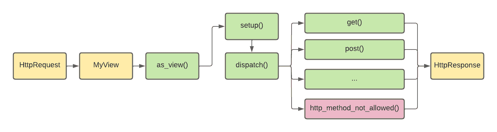
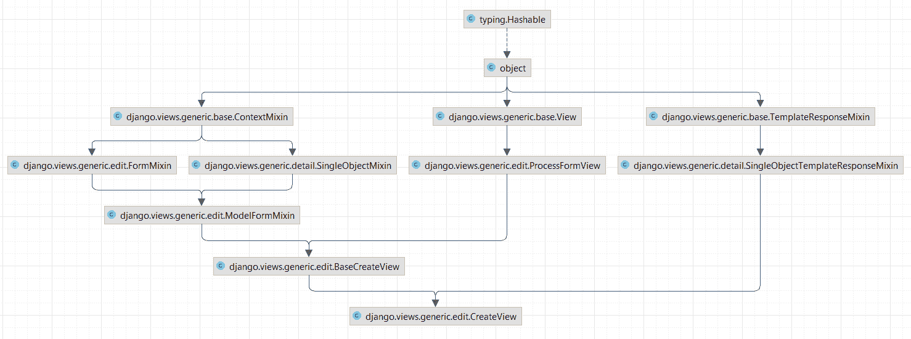
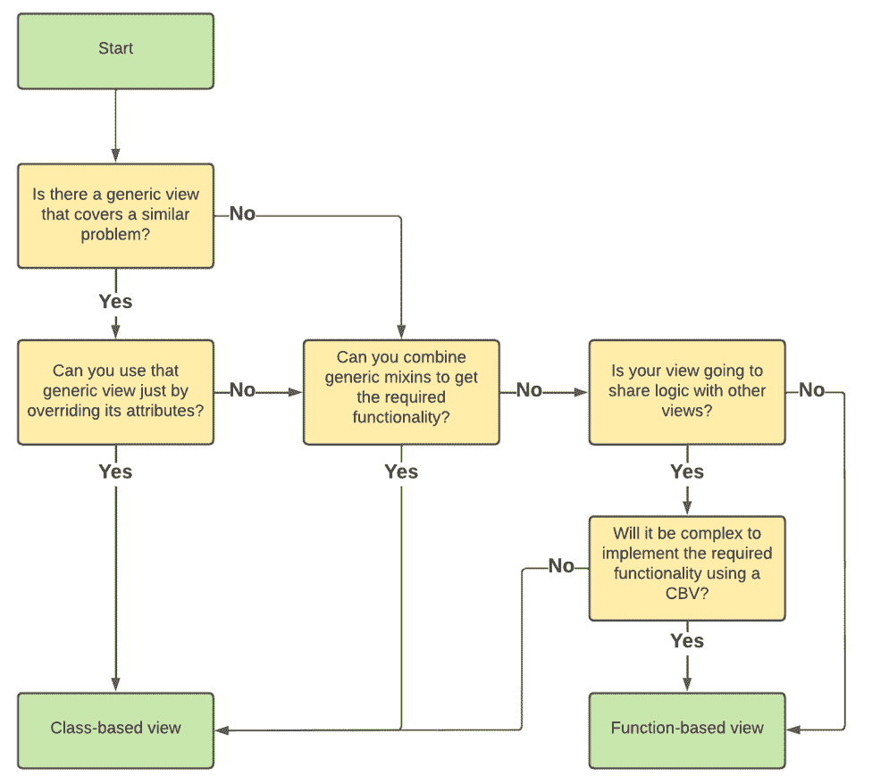

# Django 中基于类和基于函数的视图

> 原文：<https://testdriven.io/blog/django-class-based-vs-function-based-views/>

在这篇文章中，我们将看看 Django 的基于类的观点(CBV)和基于函数的观点(FBV)之间的区别。我们将比较和对比每种方法的优缺点(以及 Django 内置的基于类的通用视图)。最后，你应该很好地理解什么时候使用一个而不是另一个。

## 介绍

Django(以及其他任何 web 框架)的主要用途之一是响应 HTTP 请求提供 HTTP 响应。Django 允许我们使用所谓的视图来做到这一点。视图只是一个接受请求并返回响应的可调用对象。

Django 最初只支持基于函数的视图(fbv)，但它们很难扩展，没有利用[面向对象编程](https://en.wikipedia.org/wiki/Object-oriented_programming) (OOP)原则，也没有[干](https://en.wikipedia.org/wiki/Don%27t_repeat_yourself)。这就是为什么 Django 开发人员决定增加对基于类的视图(cbv)的支持。cbv 利用 OOP 原则，这允许我们使用继承，重用代码，并且通常编写更好更干净的代码。

> 我们需要记住，cbv 不是为了取代 fbv 而设计的。用 fbv 可以实现的任何事情，用 cbv 也可以实现。它们各有利弊。

最后，Django 提供预制或通用的 cbv，为常见问题提供解决方案。它们具有程序员友好的名称，并为显示数据、编辑数据和处理基于日期的数据等问题提供解决方案。它们可以单独使用，也可以在自定义视图中继承。

让我们看看不同的视图类型，并了解什么时候适合使用哪种视图。

## 基于功能的视图(fbv)

从本质上来说，[fbv](https://docs.djangoproject.com/en/4.0/topics/http/views/)只是函数。它们易于阅读和操作，因为你可以清楚地看到发生了什么。由于其简单性，它们非常适合 Django 初学者。所以，如果你刚开始用 Django，建议在潜入 CBVs 之前先对 FBVs 有一些工作知识。

### 利弊

**优点**

*   显式代码流(您可以完全控制发生的事情)
*   易于实施
*   容易理解
*   非常适合独特的视图逻辑
*   易于与装饰者整合

**缺点**

*   大量重复的(样板)代码
*   通过条件分支处理 HTTP 方法
*   不要利用 OOP
*   更难维护

### 快速示例

FBV 的一个例子是这样的:

```
`from django.shortcuts import render, redirect
from django.views import View

def task_create_view(request):
    if request.method == 'POST':
        form = TaskForm(data=request.POST)
        if form.is_valid():
            form.save()
            return HttpResponseRedirect(reverse('task-list'))

    return render(request, 'todo/task_create.html', {
        'form': TaskForm(),
    })` 
```

这个视图接收一个`request`，执行一些逻辑，然后返回一个`HttpResponse`。只要看看代码，我们就可以看到第一个缺点:条件分支。对于每个 HTTP 方法，我们必须创建一个单独的分支。这会增加代码的复杂性，并导致[意大利面条代码](https://en.wikipedia.org/wiki/Spaghetti_code)。

fbv 的下一个缺点是它们的扩展性不好。随着您的代码库变得越来越大，您会注意到许多重复的(样板)代码用于处理模型(尤其是 CRUD 操作)。试着想象一下创建文章的视图与上面的例子有多大的不同...他们会非常相似。

为了使用 fbv，我们必须将它们注册在 *urls.py* 中，如下所示:

```
`urlpatterns = [
    path('create/', task_create_view, name='task-create'),
]` 
```

当您处理高度定制的视图逻辑时，应该选择 fbv。换句话说，对于不与其他视图共享很多代码的视图来说，fbv 是一个很好的用例。使用 FBVs 的几个真实例子是:统计视图、图表视图和密码重置视图。

### 待办事项应用程序(使用 FBVs)

让我们来看看如何只使用 fbv 编写一个允许 CRUD 操作的简单 todo 应用程序。

首先，我们将初始化我们的项目，定义我们的模型，创建 HTML 模板，然后开始处理 *views.py* 。我们可能会得到这样的结果:

```
`# todo/views.py

from django.shortcuts import render, get_object_or_404, redirect

from .forms import TaskForm, ConfirmForm
from .models import Task

def task_list_view(request):
    return render(request, 'todo/task_list.html', {
        'tasks': Task.objects.all(),
    })

def task_create_view(request):
    if request.method == 'POST':
        form = TaskForm(data=request.POST)
        if form.is_valid():
            form.save()
            return HttpResponseRedirect(reverse('task-list'))

    return render(request, 'todo/task_create.html', {
        'form': TaskForm(),
    })

def task_detail_view(request, pk):
    task = get_object_or_404(Task, pk=pk)
    return render(request, 'todo/task_detail.html', {
        'task': task,
    })

def task_update_view(request, pk):
    task = get_object_or_404(Task, pk=pk)

    if request.method == 'POST':
        form = TaskForm(instance=task, data=request.POST)
        if form.is_valid():
            form.save()
            return HttpResponseRedirect(reverse('task-detail', args={pk: pk}))

    return render(request, 'todo/task_update.html', {
        'task': task,
        'form': TaskForm(instance=task),
    })

def task_delete_view(request, pk):
    task = get_object_or_404(Task, pk=pk)

    if request.method == 'POST':
        form = ConfirmForm(data=request.POST)
        if form.is_valid():
            task.delete()
            return HttpResponseRedirect(reverse('task-list'))

    return render(request, 'todo/task_delete.html', {
        'task': task,
        'form': ConfirmForm(),
    })` 
```

> 你可以在 [GitHub](https://github.com/testdrivenio/django-cbv-fbv/tree/main/fbv) 上获得完整的源代码。

我们最终得到了简单明了的视图逻辑。你不能对这段代码做太多改进。

## 基于类的视图(cbv)

在 [Django 1.3](https://docs.djangoproject.com/en/4.0/releases/1.3/) 中引入的基于类的视图，提供了一种替代的方式来实现视图作为 Python 对象而不是函数。它们允许我们使用 OOP 原则(最重要的是继承)。我们可以使用 cbv 来概括部分代码，并将它们提取为超类视图。

> cbv 还允许您使用 Django 内置的基于类的通用视图和[混合视图](https://docs.djangoproject.com/en/4.0/topics/class-based-views/mixins/)，我们将在下一节中对此进行介绍。

### 利弊

**优点**

*   是可扩展的
*   他们利用了 OOP 概念(最重要的是继承)
*   非常适合编写 CRUD 视图
*   更干净和可重用的代码
*   Django 内置的通用 CBVs
*   它们类似于 [Django REST 框架视图](/blog/drf-views-part-1/)

**缺点**

*   隐式代码流(许多事情发生在后台)
*   使用许多混音，这可能会令人困惑
*   更复杂，更难掌握
*   装饰者需要额外的导入或代码覆盖

> 更多信息，请回顾一下在 Django/Python 中使用基于类的视图的利弊？

### 快速示例

让我们把之前的 FBV 例子改写成 CBV:

```
`from django.shortcuts import render, redirect
from django.views import View

class TaskCreateView(View):

    def get(self, request, *args, **kwargs):
        return render(request, 'todo/task_create.html', {
            'form': TaskForm(),
        })

    def post(self, request, *args, **kwargs):
        form = TaskForm(data=request.POST)
        if form.is_valid():
            task = form.save()
            return redirect('task-detail', pk=task.pk)

        return self.get(request)` 
```

我们可以看到，这个例子与 FBV 的方法没有太大的不同。逻辑大致相同。主要区别是代码组织。这里，每个 HTTP 方法都用一个单独的方法来处理，而不是条件分支。在 CBVs 中可以使用以下方法:`get`、`post`、`put`、`patch`、`delete`、`head`、`options`、`trace`。

这种方法的另一个好处是没有定义的 HTTP 方法会自动返回一个`405 Method Not Allowed`响应。

> 当使用 FBVs 时，你可以使用[允许的 HTTP 方法装饰器](https://docs.djangoproject.com/en/4.0/topics/http/decorators/#allowed-http-methods)，比如`@require_http_methods`，来实现同样的事情。

因为 Django 的 URL 解析器需要一个可调用的函数，所以在 *urls.py* 中注册它们时，我们需要调用 [as_view()](https://docs.djangoproject.com/en/4.0/ref/class-based-views/base/#django.views.generic.base.View.as_view) :

```
`urlpatterns = [
    path('create/', TaskCreateView.as_view(), name='task-create'),
]` 
```

### 代码流

CBVs 的代码流稍微复杂一些，因为一些事情发生在后台。如果我们扩展基本[视图](https://docs.djangoproject.com/en/4.0/ref/class-based-views/base/#view)类，将执行以下代码步骤:

1.  Django URL dispatcher 将一个`HttpRequest`路由到`MyView`。
2.  Django URL 调度程序在`MyView`上调用`as_view()`。
3.  `as_view()`调用`setup()`和`dispatch()`。
4.  `dispatch()`触发特定 HTTP 方法的方法或`http_method_not_allowed()`。
5.  返回一个`HttpResponse`。



### 待办事项应用程序(使用 CBVs)

现在，让我们重写 todo 应用程序，只使用 CBVs:

```
`# todo/views.py

from django.shortcuts import render, get_object_or_404, redirect
from django.views import View

from .forms import TaskForm, ConfirmForm
from .models import Task

class TaskListView(View):

    def get(self, request, *args, **kwargs):
        return render(request, 'todo/task_list.html', {
            'tasks': Task.objects.all(),
        })

class TaskCreateView(View):

    def get(self, request, *args, **kwargs):
        return render(request, 'todo/task_create.html', {
            'form': TaskForm(),
        })

    def post(self, request, *args, **kwargs):
        form = TaskForm(data=request.POST)
        if form.is_valid():
            task = form.save()
            return redirect('task-detail', pk=task.pk)

        return self.get(request)

class TaskDetailView(View):

    def get(self, request, pk, *args, **kwargs):
        task = get_object_or_404(Task, pk=pk)

        return render(request, 'todo/task_detail.html', {
            'task': task,
        })

class TaskUpdateView(View):

    def get(self, request, pk, *args, **kwargs):
        task = get_object_or_404(Task, pk=pk)
        return render(request, 'todo/task_update.html', {
            'task': task,
            'form': TaskForm(instance=task),
        })

    def post(self, request, pk, *args, **kwargs):
        task = get_object_or_404(Task, pk=pk)
        form = TaskForm(instance=task, data=request.POST)
        if form.is_valid():
            form.save()
            return redirect('task-detail', pk=task.pk)

        return self.get(request, pk)

class TaskDeleteView(View):

    def get(self, request, pk, *args, **kwargs):
        task = get_object_or_404(Task, pk=pk)
        return render(request, 'todo/task_confirm_delete.html', {
            'task': task,
            'form': ConfirmForm(),
        })

    def post(self, request, pk, *args, **kwargs):
        task = get_object_or_404(Task, pk=pk)
        form = ConfirmForm(data=request.POST)
        if form.is_valid():
            task.delete()
            return redirect('task-list')

        return self.get(request, pk)` 
```

另外，我们不要忘记让我们的 *urls.py* 调用`as_view()`:

```
`# todo/urls.py

from django.urls import path

from .views import TaskListView, TaskDetailView, TaskCreateView, TaskUpdateView, TaskDeleteView

urlpatterns = [
    path('', TaskListView.as_view(), name='task-list'),
    path('create/', TaskCreateView.as_view(), name='task-create'),
    path('<int:pk>/', TaskDetailView.as_view(), name='task-detail'),
    path('update/<int:pk>/', TaskUpdateView.as_view(), name='task-update'),
    path('delete/<int:pk>/', TaskDeleteView.as_view(), name='task-delete'),
]` 
```

> 你可以在 [GitHub](https://github.com/testdrivenio/django-cbv-fbv/tree/main/cbv) 上获得完整的源代码。

为了更简洁的代码，我们牺牲了几行代码。我们不再使用条件分支。例如，如果我们看一下`TaskCreateView`和`TaskUpdateView`，我们可以看到它们几乎是一样的。我们可以通过将公共逻辑提取到父类中来进一步改进这段代码。此外，我们可以提取视图逻辑，并将其用于其他模型的视图。

## Django 的基于类的通用视图

如果您遵循上一节提到的所有重构建议，您最终会得到一个模仿 Django 的一些通用的基于类的视图。Django 的[通用 cbv](https://docs.djangoproject.com/en/4.0/topics/class-based-views/generic-display/)非常适合解决常见问题，如检索、创建、修改和删除对象，以及分页和归档视图。它们也加快了开发过程。

### 快速示例

让我们看一个例子:

```
`from django.views.generic import CreateView

class TaskCreateView(CreateView):
    model = Task
    context_object_name = 'task'
    fields = ('name', 'description', 'is_done')
    template_name = 'todo/task_create.html'` 
```

我们创建了一个名为`TaskCreateView`的类，并继承了`CreateView`。通过这样做，我们获得了很多功能，几乎没有代码。现在我们只需要设置以下属性:

1.  定义视图使用的 Django 模型。
2.  Django 使用`fields`来创建表单(或者，我们可以提供`form_class`)。
3.  `template_name`定义使用哪个模板(默认为`/<app_name>/<model_name>_form.html`)。
4.  `context_object_name`定义将模型实例传递给模板的上下文键(默认为`object`)。
5.  `success_url`定义用户成功时被重定向到哪里(或者，您可以在您的模型中设置`get_absolute_url`)。

> 有关通用 cbv 的更多信息，请参考[官方文档](https://docs.djangoproject.com/en/4.0/topics/class-based-views/generic-display/)。

正如您可能已经猜到的那样，通用 cbv 的幕后还会有更多的奇迹发生。即使对于有经验的 Django 开发人员来说，它们也会令人困惑。一旦你掌握了它们的窍门，你可能会觉得自己像个巫师。

对于执行常见任务(例如 CRUD 操作)的视图，应该使用通用 cbv。如果你的视图需要做 CBVs 没有涵盖的事情，使用 mixins 或者基于函数的视图。

### 姜戈内置的 CBV 类型

在撰写本文时，Django 提供了大量的通用 cbv，我们可以将其分为三类:

> 我们将在这里看看如何使用它们的实际例子。

### 查看混音

每个通用视图用来解决一个问题(例如，显示信息，创建/更新某些东西)。如果您的视图需要做更多的事情，您可以使用 mixins 创建您的视图。Mixins 是提供独立功能的类，它们可以组合起来解决几乎任何问题。

> 你也可以选择一个通用的 CBV 作为基础，然后包括额外的混音。

甚至 Django 的通用 cbv 也是由 mixins 组成的。让我们看一下`CreateView`图:



我们可以看到它利用了许多混合，比如`ContextMixin`、`SingleObjectMixin`和`FormMixin`。它们有程序员友好的名字，所以根据它们的名字，你应该对它们的功能有一个大致的了解。

> Mixins 需要花很多时间来掌握，而且经常会令人困惑。如果你刚刚开始使用 mixin，我建议你从阅读[使用基于类视图的 mixin](https://docs.djangoproject.com/en/4.0/topics/class-based-views/mixins/)开始。

### Todo 应用程序(使用 Django 的通用 CBVs)

现在，让我们使用 Django 的通用的基于类的视图最后一次重写 todo 应用程序:

```
`# todo/views.py

from django.views.generic import ListView, DetailView, DeleteView, UpdateView, CreateView

class TaskListView(ListView):
    model = Task
    context_object_name = 'tasks'

class TaskCreateView(CreateView):
    model = Task
    context_object_name = 'task'
    fields = ('name', 'description', 'is_done')
    template_name = 'todo/task_create.html'

class TaskDetailView(DetailView):
    model = Task
    context_object_name = 'task'

class TaskUpdateView(UpdateView):
    model = Task
    context_object_name = 'task'
    fields = ('name', 'description', 'is_done')
    template_name = 'todo/task_update.html'

class TaskDeleteView(DeleteView):
    model = Task
    context_object_name = 'task'
    success_url = '/'` 
```

> 你可以在 [GitHub](https://github.com/testdrivenio/django-cbv-fbv/tree/main/dbv) 上获得完整的源代码。

通过使用 Django 通用 cbv，我们将代码分成了两半。此外，代码更加清晰，更易于维护，但是如果您不熟悉一般的 cbv，那么阅读和理解起来可能会困难得多。

## 结论

一种视图类型并不比另一种更好。这完全取决于情况和个人喜好。有时 fbv 更好，有时 cbv 更好。当你写下一个具体的观点时，试着记住它们的优点和缺点，以便做出一个好的决定。如果你仍然不确定什么时候使用哪个，你可以通过把 fbv 转换成 cbv 或者相反来练习一下。此外，您可以使用此流程图:



我个人更喜欢在较小的项目中使用 fbv(不能用通用的 cbv 解决),在处理较大的代码库时选择 cbv。