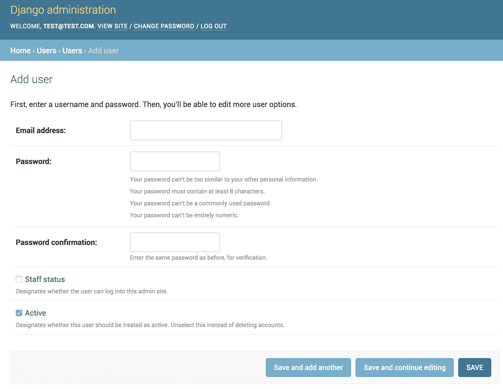

# 在 Django 中创建定制用户模型

> 原文：<https://testdriven.io/blog/django-custom-user-model/>

对于 Django 认证，我如何将用户名字段完全替换为电子邮件字段？

本文一步一步地解释了如何在 Django 中创建一个定制的[用户模型](https://docs.djangoproject.com/en/4.1/ref/contrib/auth/#user-model)，这样就可以使用电子邮件地址作为主要的用户标识符，而不是用户名来进行身份验证。

> 请记住，本文中概述的过程需要对数据库模式进行重大更改。正因为如此，它只推荐给新项目。如果您正在处理一个现有的遗留项目，您将需要遵循一组不同的步骤。有关这方面的更多信息，请查看 Django 文章中的[迁移到定制用户模型中期项目。](/blog/django-custom-user-model-migration/)

## 目标

完成本文后，您应该能够:

1.  描述`AbstractUser`和`AbstractBaseUser`的区别
2.  解释为什么在开始一个新的 Django 项目时应该建立一个定制的用户模型
3.  使用定制用户模型开始一个新的 Django 项目
4.  使用电子邮件地址作为主要用户标识符，而不是用户名进行身份验证
5.  在实现定制用户模型时，实践测试优先开发

## AbstractUser vs AbstractBaseUser

Django 中的默认用户模型使用用户名在身份验证期间惟一地标识用户。如果您更愿意使用电子邮件地址，那么您需要通过子类化`AbstractUser`或`AbstractBaseUser`来创建一个定制的用户模型。

选项:

1.  `AbstractUser`:如果您对用户模型上的现有字段满意，并且只想删除用户名字段，请使用此选项。
2.  如果你想从头开始创建你自己的，全新的用户模型，使用这个选项。

> 在本文中，我们将研究这两个选项，`AbstractUser`和`AbstractBaseUser`。

每个的步骤都相同:

1.  创建自定义用户模型和管理器
2.  更新 *settings.py*
3.  自定义`UserCreationForm`和`UserChangeForm`表单
4.  更新管理员

> 在开始一个新的 Django 项目时，[强烈建议](https://docs.djangoproject.com/en/4.1/topics/auth/customizing/#using-a-custom-user-model-when-starting-a-project)建立一个自定义用户模型。如果没有它，您将需要创建另一个模型(如`UserProfile`)并使用`OneToOneField`将其链接到 Django 用户模型，如果您想要向用户模型添加新的字段的话。

## 项目设置

首先创建一个新的 Django 项目和一个用户应用程序:

```py
`$ mkdir django-custom-user-model && cd django-custom-user-model
$ python3 -m venv env
$ source env/bin/activate

(env)$ pip install Django==4.1.5
(env)$ django-admin startproject hello_django .
(env)$ python manage.py startapp users` 
```

> 你可以随意把 virtualenv 和 Pip 换成诗歌[或](https://python-poetry.org) [Pipenv](https://github.com/pypa/pipenv) 。更多信息，请查看[现代 Python 环境](/blog/python-environments/)。

不要应用迁移。记住:您必须在应用第一次迁移之前创建定制用户模型。

将新应用添加到 *settings.py* 中的`INSTALLED_APPS`列表:

```py
`INSTALLED_APPS = [
    "django.contrib.admin",
    "django.contrib.auth",
    "django.contrib.contenttypes",
    "django.contrib.sessions",
    "django.contrib.messages",
    "django.contrib.staticfiles",

    "users",  # new
]` 
```

## 试验

让我们采用测试优先的方法:

```py
`from django.contrib.auth import get_user_model
from django.test import TestCase

class UsersManagersTests(TestCase):

    def test_create_user(self):
        User = get_user_model()
        user = User.objects.create_user(email="[[email protected]](/cdn-cgi/l/email-protection)", password="foo")
        self.assertEqual(user.email, "[[email protected]](/cdn-cgi/l/email-protection)")
        self.assertTrue(user.is_active)
        self.assertFalse(user.is_staff)
        self.assertFalse(user.is_superuser)
        try:
            # username is None for the AbstractUser option
            # username does not exist for the AbstractBaseUser option
            self.assertIsNone(user.username)
        except AttributeError:
            pass
        with self.assertRaises(TypeError):
            User.objects.create_user()
        with self.assertRaises(TypeError):
            User.objects.create_user(email="")
        with self.assertRaises(ValueError):
            User.objects.create_user(email="", password="foo")

    def test_create_superuser(self):
        User = get_user_model()
        admin_user = User.objects.create_superuser(email="[[email protected]](/cdn-cgi/l/email-protection)", password="foo")
        self.assertEqual(admin_user.email, "[[email protected]](/cdn-cgi/l/email-protection)")
        self.assertTrue(admin_user.is_active)
        self.assertTrue(admin_user.is_staff)
        self.assertTrue(admin_user.is_superuser)
        try:
            # username is None for the AbstractUser option
            # username does not exist for the AbstractBaseUser option
            self.assertIsNone(admin_user.username)
        except AttributeError:
            pass
        with self.assertRaises(ValueError):
            User.objects.create_superuser(
                email="[[email protected]](/cdn-cgi/l/email-protection)", password="foo", is_superuser=False)` 
```

将规格添加到 *users/tests.py* 中，然后确保测试失败。

## 模型经理

首先，我们需要通过子类化`BaseUserManager`来添加一个定制的[管理器](https://docs.djangoproject.com/en/4.1/topics/db/managers/)，它使用电子邮件作为唯一标识符，而不是用户名。

在“用户”目录下创建一个 *managers.py* 文件:

```py
`from django.contrib.auth.base_user import BaseUserManager
from django.utils.translation import gettext_lazy as _

class CustomUserManager(BaseUserManager):
    """
 Custom user model manager where email is the unique identifiers
 for authentication instead of usernames.
 """
    def create_user(self, email, password, **extra_fields):
        """
 Create and save a user with the given email and password.
 """
        if not email:
            raise ValueError(_("The Email must be set"))
        email = self.normalize_email(email)
        user = self.model(email=email, **extra_fields)
        user.set_password(password)
        user.save()
        return user

    def create_superuser(self, email, password, **extra_fields):
        """
 Create and save a SuperUser with the given email and password.
 """
        extra_fields.setdefault("is_staff", True)
        extra_fields.setdefault("is_superuser", True)
        extra_fields.setdefault("is_active", True)

        if extra_fields.get("is_staff") is not True:
            raise ValueError(_("Superuser must have is_staff=True."))
        if extra_fields.get("is_superuser") is not True:
            raise ValueError(_("Superuser must have is_superuser=True."))
        return self.create_user(email, password, **extra_fields)` 
```

## 用户模型

决定你想使用哪个选项:子类化`AbstractUser`或`AbstractBaseUser`。

### 抽象用户

更新 *users/models.py* :

```py
`from django.contrib.auth.models import AbstractUser
from django.db import models
from django.utils.translation import gettext_lazy as _

from .managers import CustomUserManager

class CustomUser(AbstractUser):
    username = None
    email = models.EmailField(_("email address"), unique=True)

    USERNAME_FIELD = "email"
    REQUIRED_FIELDS = []

    objects = CustomUserManager()

    def __str__(self):
        return self.email` 
```

在此，我们:

1.  创建了一个名为`CustomUser`的新类，它是`AbstractUser`的子类
2.  删除了`username`字段
3.  使`email`字段成为必填且唯一的
4.  将定义`User`型号唯一标识符的`USERNAME_FIELD`设置为`email`
5.  指定该类的所有对象都来自`CustomUserManager`

### AbstractBaseUser

更新 *users/models.py* :

```py
`from django.contrib.auth.models import AbstractBaseUser, PermissionsMixin
from django.db import models
from django.utils import timezone
from django.utils.translation import gettext_lazy as _

from .managers import CustomUserManager

class CustomUser(AbstractBaseUser, PermissionsMixin):
    email = models.EmailField(_("email address"), unique=True)
    is_staff = models.BooleanField(default=False)
    is_active = models.BooleanField(default=True)
    date_joined = models.DateTimeField(default=timezone.now)

    USERNAME_FIELD = "email"
    REQUIRED_FIELDS = []

    objects = CustomUserManager()

    def __str__(self):
        return self.email` 
```

在此，我们:

1.  创建了一个名为`CustomUser`的新类，它是`AbstractBaseUser`的子类
2.  增加了`email`、`is_staff`、`is_active`和`date_joined`的字段
3.  将定义`User`型号唯一标识符的`USERNAME_FIELD`设置为`email`
4.  指定该类的所有对象都来自`CustomUserManager`

## 设置

将下面一行添加到 *settings.py* 文件中，以便 Django 知道使用新的定制用户类:

```py
`AUTH_USER_MODEL = "users.CustomUser"` 
```

现在，您可以创建并应用迁移，这将创建一个使用定制用户模型的新数据库。在我们这样做之前，让我们看看在没有创建迁移文件的情况下*的实际迁移情况，以及 [-预演](https://docs.djangoproject.com/en/4.1/ref/django-admin/#cmdoption-makemigrations-dry-run)标志:*

```py
`(env)$ python manage.py makemigrations --dry-run --verbosity 3` 
```

您应该会看到类似如下的内容:

```py
`# Generated by Django 4.1.5 on 2023-01-21 20:36

from django.db import migrations, models
import django.utils.timezone

class Migration(migrations.Migration):

    initial = True

    dependencies = [
        ('auth', '0012_alter_user_first_name_max_length'),
    ]

    operations = [
        migrations.CreateModel(
            name='CustomUser',
            fields=[
                ('id', models.BigAutoField(auto_created=True, primary_key=True, serialize=False, verbose_name='ID')),
                ('password', models.CharField(max_length=128, verbose_name='password')),
                ('last_login', models.DateTimeField(blank=True, null=True, verbose_name='last login')),
                ('is_superuser', models.BooleanField(default=False, help_text='Designates that this user has all permissions without explicitly assigning them.', verbose_name='superuser status')),
                ('first_name', models.CharField(blank=True, max_length=150, verbose_name='first name')),
                ('last_name', models.CharField(blank=True, max_length=150, verbose_name='last name')),
                ('is_staff', models.BooleanField(default=False, help_text='Designates whether the user can log into this admin site.', verbose_name='staff status')),
                ('is_active', models.BooleanField(default=True, help_text='Designates whether this user should be treated as active. Unselect this instead of deleting accounts.', verbose_name='active')),
                ('date_joined', models.DateTimeField(default=django.utils.timezone.now, verbose_name='date joined')),
                ('email', models.EmailField(max_length=254, unique=True, verbose_name='email address')),
                ('groups', models.ManyToManyField(blank=True, help_text='The groups this user belongs to. A user will get all permissions granted to each of their groups.', related_name='user_set', related_query_name='user', to='auth.group', verbose_name='groups')),
                ('user_permissions', models.ManyToManyField(blank=True, help_text='Specific permissions for this user.', related_name='user_set', related_query_name='user', to='auth.permission', verbose_name='user permissions')),
            ],
            options={
                'verbose_name': 'user',
                'verbose_name_plural': 'users',
                'abstract': False,
            },
        ),
    ]` 
```

> 如果您走的是`AbstractBaseUser`路线，您将没有`first_name`或`last_name`字段。为什么？

确保迁移不包括`username`字段。然后，创建并应用迁移:

```py
`(env)$ python manage.py makemigrations
(env)$ python manage.py migrate` 
```

查看模式:

```py
`$ sqlite3 db.sqlite3

SQLite version 3.28.0 2019-04-15 14:49:49
Enter ".help" for usage hints.

sqlite> .tables

auth_group                         django_migrations
auth_group_permissions             django_session
auth_permission                    users_customuser
django_admin_log                   users_customuser_groups
django_content_type                users_customuser_user_permissions

sqlite> .schema users_customuser

CREATE TABLE IF NOT EXISTS "users_customuser" (
  "id" integer NOT NULL PRIMARY KEY AUTOINCREMENT,
  "password" varchar(128) NOT NULL,
  "last_login" datetime NULL,
  "is_superuser" bool NOT NULL,
  "first_name" varchar(150) NOT NULL,
  "last_name" varchar(150) NOT NULL,
  "is_staff" bool NOT NULL,
  "is_active" bool NOT NULL,
  "date_joined" datetime NOT NULL,
  "email" varchar(254) NOT NULL UNIQUE
);` 
```

> 如果你走的是`AbstractBaseUser`路线，为什么`last_login`是模型的一部分？

现在，您可以使用`get_user_model()`或`settings.AUTH_USER_MODEL`来引用用户模型。更多信息请参考[参考官方文件中的用户模型](https://docs.djangoproject.com/en/4.1/topics/auth/customizing/#referencing-the-user-model)。

此外，当您创建超级用户时，应该提示您输入电子邮件而不是用户名:

```py
`(env)$ python manage.py createsuperuser

Email address: [[email protected]](/cdn-cgi/l/email-protection)
Password:
Password (again):
Superuser created successfully.` 
```

确保测试通过:

```py
`(env)$ python manage.py test

Creating test database for alias 'default'...
System check identified no issues (0 silenced).
..
----------------------------------------------------------------------
Ran 2 tests in 0.282s

OK
Destroying test database for alias 'default'...` 
```

## 形式

接下来，让我们子类化`UserCreationForm`和`UserChangeForm`表单，以便它们使用新的`CustomUser`模型。

在“用户”中创建一个名为 *forms.py* 的新文件:

```py
`from django.contrib.auth.forms import UserCreationForm, UserChangeForm

from .models import CustomUser

class CustomUserCreationForm(UserCreationForm):

    class Meta:
        model = CustomUser
        fields = ("email",)

class CustomUserChangeForm(UserChangeForm):

    class Meta:
        model = CustomUser
        fields = ("email",)` 
```

## 管理

通过在 *users/admin.py* 中子类化`UserAdmin`来告诉管理员使用这些表单:

```py
`from django.contrib import admin
from django.contrib.auth.admin import UserAdmin

from .forms import CustomUserCreationForm, CustomUserChangeForm
from .models import CustomUser

class CustomUserAdmin(UserAdmin):
    add_form = CustomUserCreationForm
    form = CustomUserChangeForm
    model = CustomUser
    list_display = ("email", "is_staff", "is_active",)
    list_filter = ("email", "is_staff", "is_active",)
    fieldsets = (
        (None, {"fields": ("email", "password")}),
        ("Permissions", {"fields": ("is_staff", "is_active", "groups", "user_permissions")}),
    )
    add_fieldsets = (
        (None, {
            "classes": ("wide",),
            "fields": (
                "email", "password1", "password2", "is_staff",
                "is_active", "groups", "user_permissions"
            )}
        ),
    )
    search_fields = ("email",)
    ordering = ("email",)

admin.site.register(CustomUser, CustomUserAdmin)` 
```

就是这样。运行服务器并登录到管理站点。您应该能够像平常一样添加和更改用户。



## 结论

在本文中，我们研究了如何创建自定义用户模型，以便电子邮件地址可以用作主要用户标识符，而不是用于身份验证的用户名。

你可以在[django-custom-user-model](https://github.com/testdrivenio/django-custom-user-model)repo 中找到两个选项`AbstractUser`和`AbstractBaseUser`的最终代码。最后的代码示例还包括用户认证所需的模板、视图和 URL。

想了解更多关于定制 Django 用户模型的信息吗？查看以下资源:

1.  [选项&对象:定制 Django 用户模型](https://medium.com/agatha-codes/options-objects-customizing-the-django-user-model-6d42b3e971a4)
2.  [如何扩展 Django 用户模型](https://simpleisbetterthancomplex.com/tutorial/2016/07/22/how-to-extend-django-user-model.html)
3.  [充分利用 Django 的用户模式](https://www.youtube.com/watch?v=sXZ3ntGp_Xc)(视频)
4.  [在 Django 中定制认证](https://docs.djangoproject.com/en/4.1/topics/auth/customizing/)