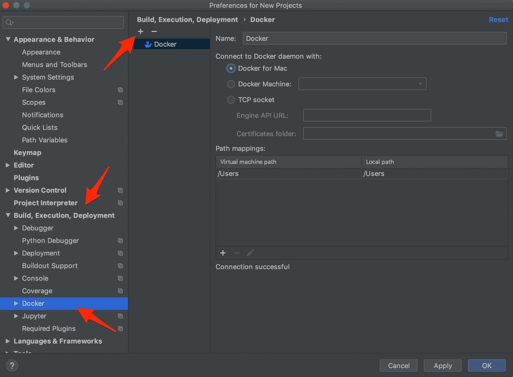
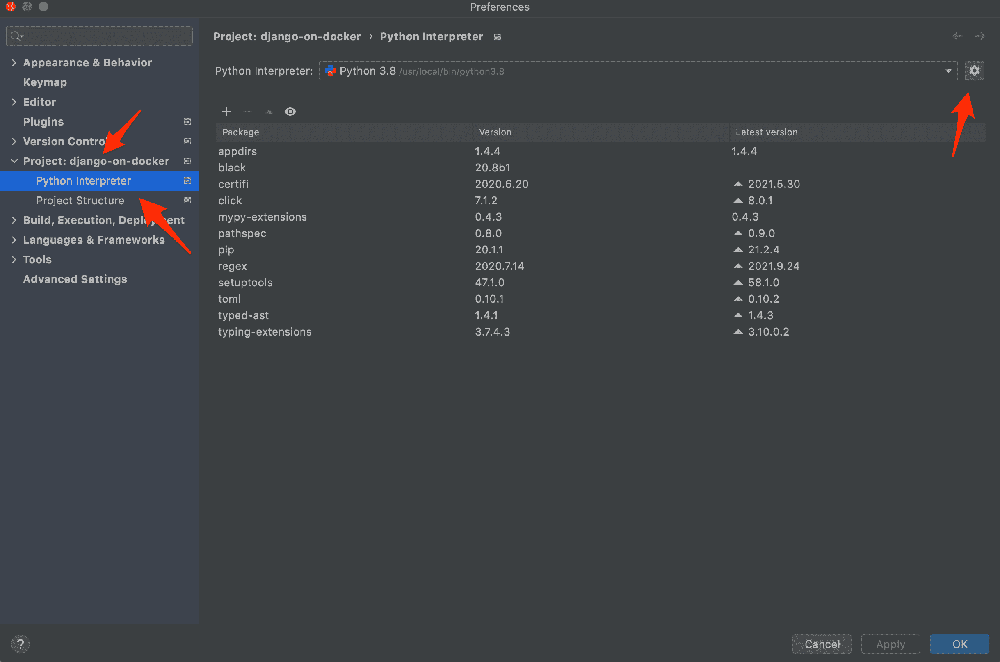
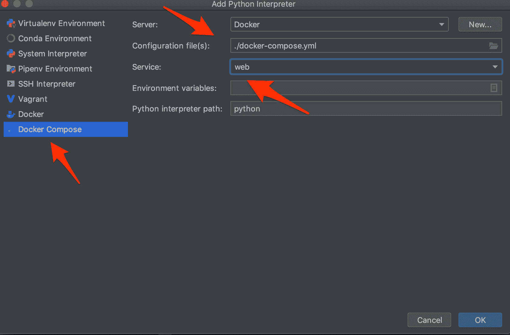
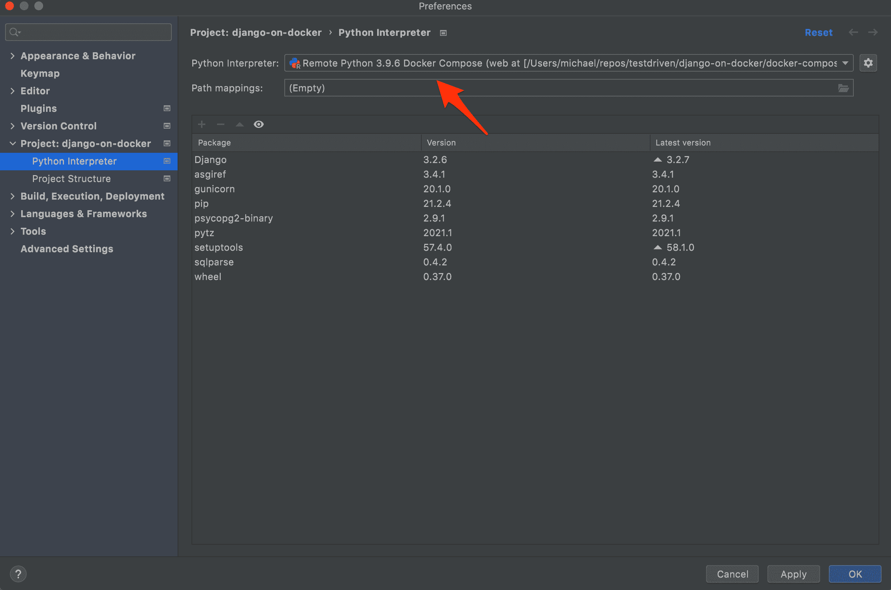
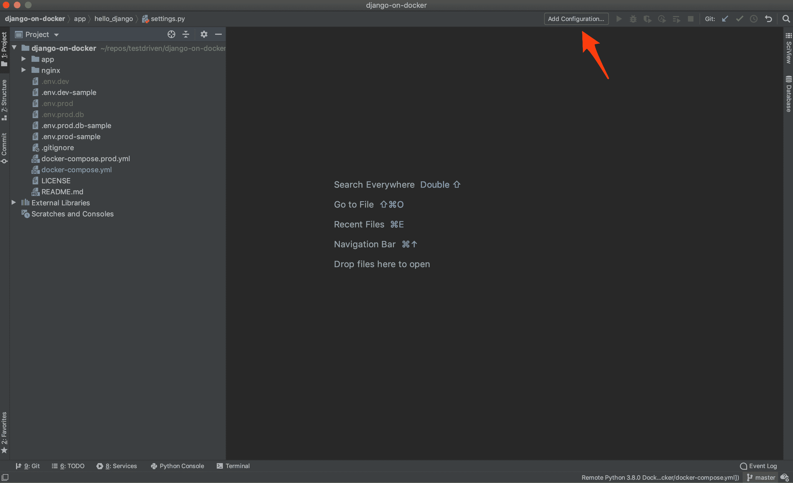
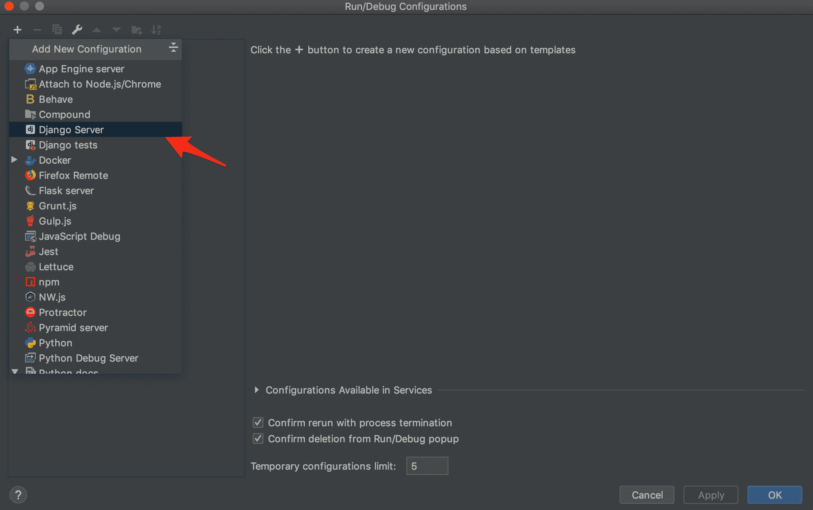
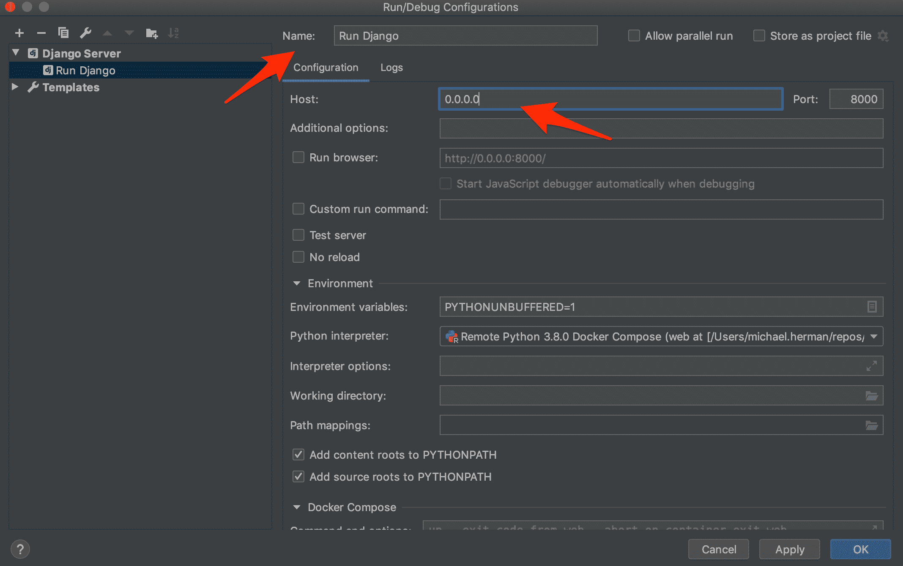
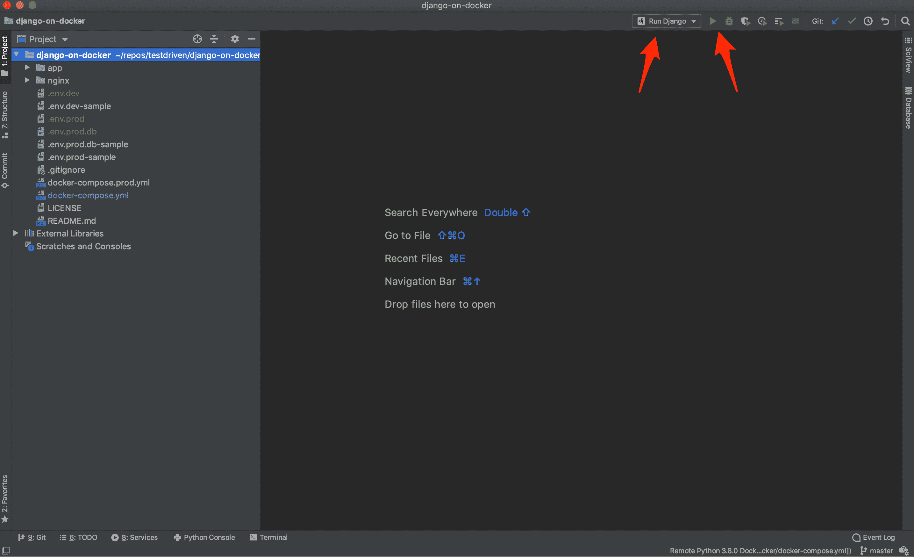
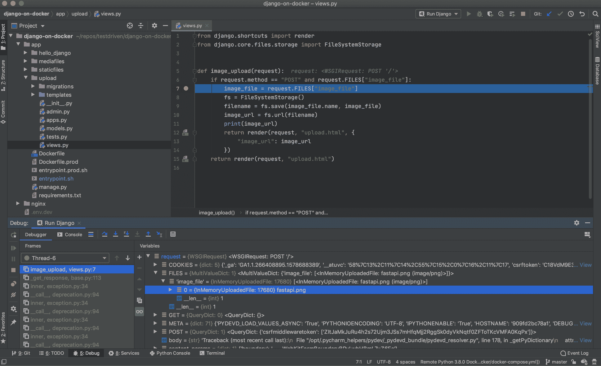

# 在 PyCharm 中调试容器化的 Django 应用程序

> 原文：<https://testdriven.io/blog/django-debugging-pycharm/>

在 Docker 中开发你的 Django 应用会非常方便。你不必安装额外的服务，如 Postgres、Nginx 和 Redis 等。在你自己的机器上。这也使得新开发人员更容易快速上手并运行。

然而，草并不总是更绿。在 Docker 中运行 Django 会产生一些问题，让原本简单的事情变得困难。例如，如何在代码中设置断点并进行调试？

在这个快速教程中，我们将了解 PyCharm 如何通过其远程解释器和 Docker 集成来帮助调试容器化的 Django 应用程序。

> 本帖使用的是 [PyCharm 专业版](https://www.jetbrains.com/pycharm/) v2021.2.2，关于 PyCharm 专业版和社区(免费)版的区别，请看一下[专业版与社区版对比指南](https://www.jetbrains.com/pycharm/features/editions_comparison_matrix.html)。

## 目标

在本教程结束时，您应该能够在 PyCharm 中执行以下操作:

1.  配置 Docker 设置
2.  设置远程解释器
3.  创建一个运行/调试配置来调试 Docker 中运行的 Django 应用程序

## PyCharm 中的坞站设置

我们需要做的第一步是告诉 PyCharm 如何连接 Docker。为此，打开 PyCharm 设置(`PyCharm > Preferences`用于 Mac 用户，或者`File > Settings`用于 Windows 和 Linux 用户)，然后展开“构建、执行、部署”设置。单击“Docker ”,然后单击“+”按钮创建新的 Docker 配置。



对于 Mac，选择`Docker for Mac`选项。然后应用更改。

## 配置远程解释器

现在我们已经设置了 Docker 配置，是时候将 Docker Compose 配置为远程解释器了。假设你已经打开了一个项目，再次打开设置，展开“项目:`<your-project-name>`”设置，点击“Python 解释器”。单击齿轮图标，然后选择“添加”。



在下一个对话框中，在左窗格中选择“Docker Compose ”,并在“Server”字段中选择您在前面步骤中创建的 Docker 配置。“配置文件”字段应该指向 Docker 合成文件，而“服务”字段应该指向 Docker 合成文件中的 web 应用程序服务。

例如，如果您的 Docker Compose 文件如下所示，那么您会希望指向`web`服务:

```
`version:  '3.7' services: web: build:  ./app command:  python manage.py runserver 0.0.0.0:8000 volumes: -  ./app/:/usr/src/app/ ports: -  8008:8000 env_file: -  ./.env.dev depends_on: -  db db: image:  postgres:12.0-alpine volumes: -  postgres_data:/var/lib/postgresql/data/ environment: -  POSTGRES_USER=hello_django -  POSTGRES_PASSWORD=hello_django -  POSTGRES_DB=hello_django_dev volumes: postgres_data:` 
```

调试器专门附加到 web 服务。当我们稍后在 PyCharm 中运行配置时，Docker Compose 文件中的所有其他服务都将启动



单击“确定”应用更改。

回到“Python 解释器”设置对话框，你现在应该看到项目有正确的远程解释器。



关闭设置。

## 创建运行/调试配置

既然我们已经将 PyCharm 配置为能够连接到 Docker，并基于 Docker Compose 文件创建了一个远程解释器配置，那么我们就可以创建一个运行/调试配置了。

点击“添加配置...”PyCharm 窗口顶部的按钮。



接下来点击“+”按钮并选择“Django 服务器”。



为配置命名。在这个配置对话框中，重要的是将“主机”字段设置为`0.0.0.0`。



单击“确定”保存配置。我们现在可以在 PyCharm 窗口的顶部看到运行/调试配置，以及运行、调试等按钮。)已启用。



如果现在在 Django 应用程序中设置断点，并按下运行/调试配置旁边的调试按钮，就可以调试 Docker 容器中运行的 Django 应用程序了。



## 结论

在本教程中，我们向您展示了如何配置 PyCharm 来调试运行在 Docker 中的 Django 应用程序。有了它，您现在不仅可以调试您的视图和模型等等，还可以设置断点和调试您的模板代码。

> 提示:想进一步增强您的调试能力吗？PyCharm 还允许您设置[条件断点](https://www.jetbrains.com/pycharm/guide/tips/conditional-breakpoints/)！