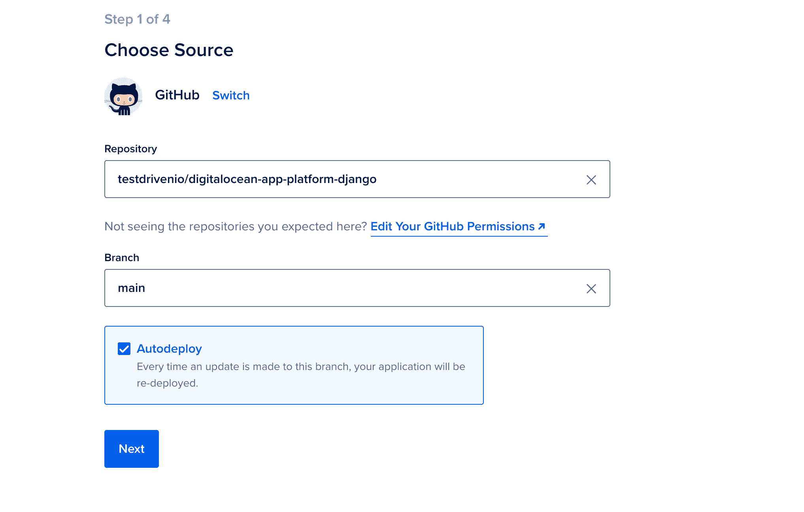
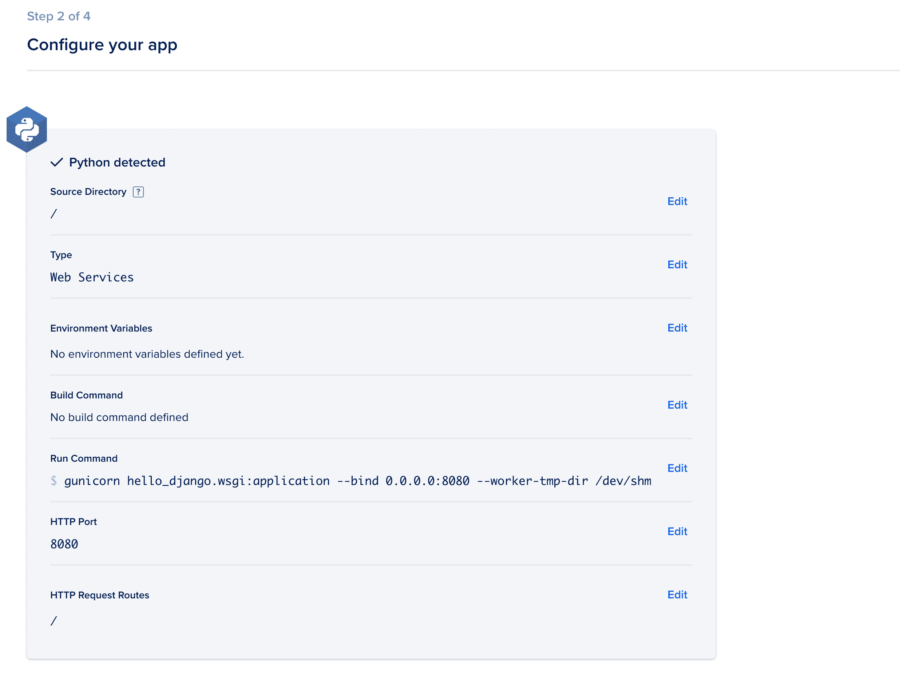
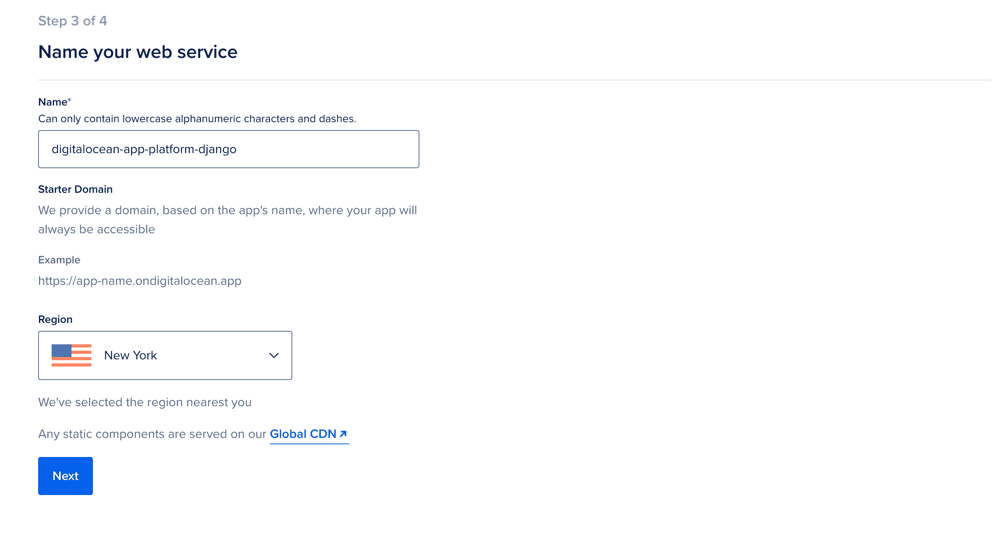
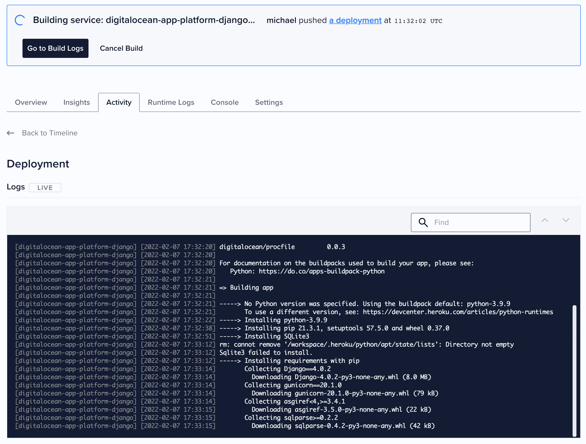
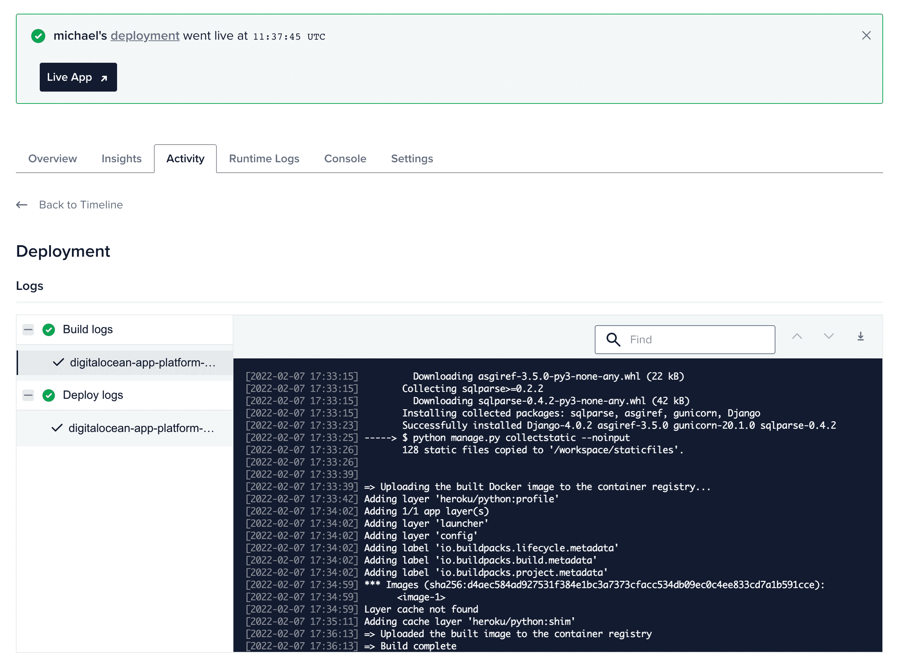
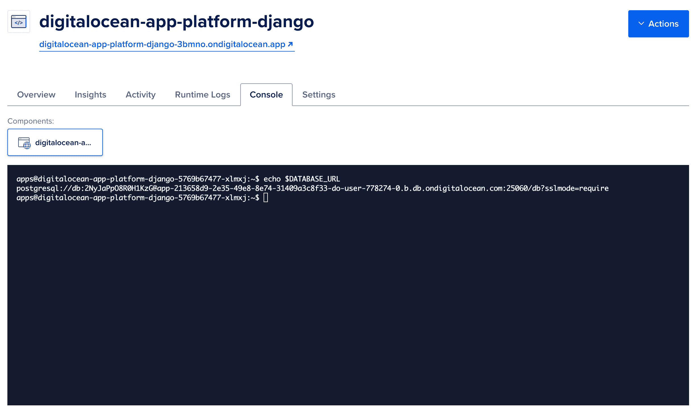
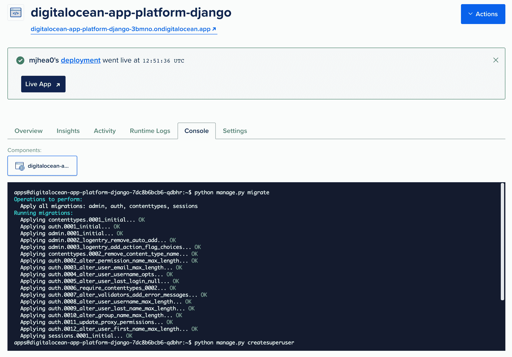
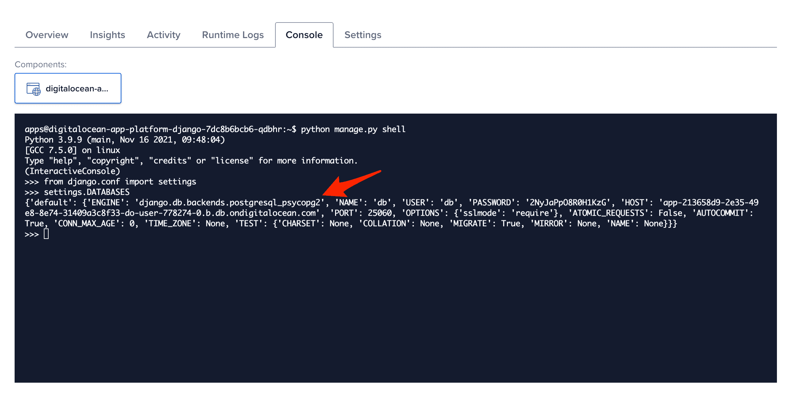
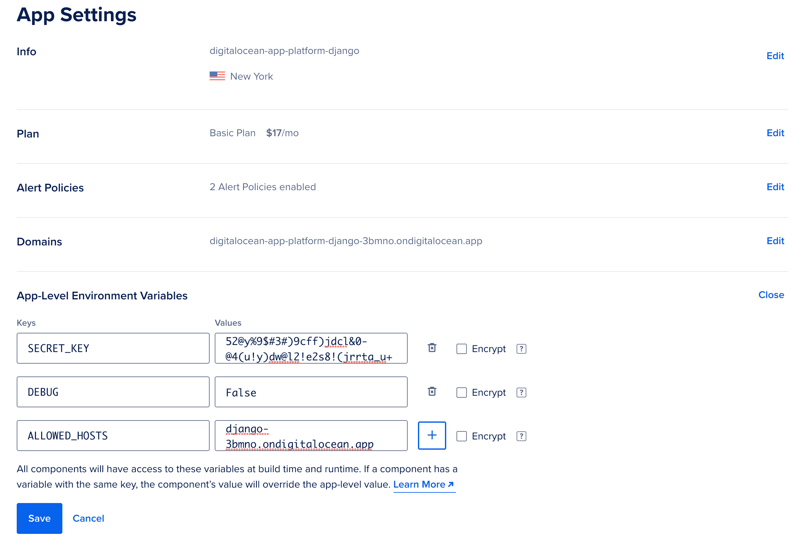
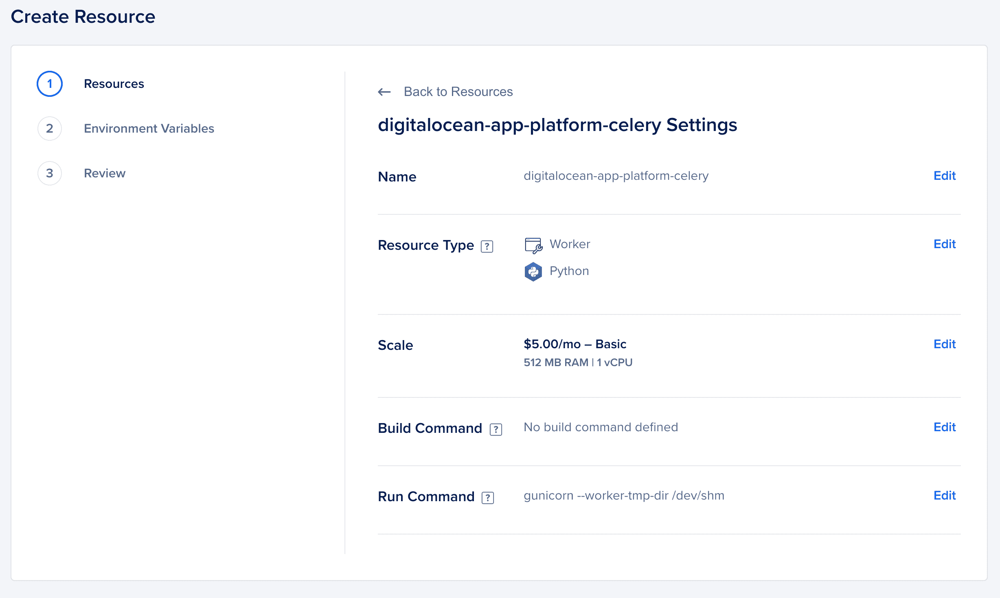

# 在 DigitalOcean 的应用平台上运行 Django

> 原文：<https://testdriven.io/blog/django-digitalocean-app-platform/>

DigitalOcean 的 [App Platform](https://www.digitalocean.com/products/app-platform) 是一个平台即服务(PaaS)产品，它(很像 Heroku)允许你从 git 库部署应用程序。

本文着眼于如何将 Django 应用程序部署到 DigitalOcean 的应用程序平台。

## 为什么要用 DigitalOcean 的 App 平台？

DigitalOcean 的应用程序平台的目标是简化部署，以便您可以专注于应用程序开发，而不是管理基础架构。它非常适合日常的 Django 应用程序，使用 Postgres(或 MySQL)实现持久性，使用 Redis 实现芹菜消息代理。也就是说，如果你的应用确实需要你访问底层基础设施，你可能会想避开应用平台，转而使用基础设施即服务(IaaS)解决方案，如 DigitalOcean [Droplet](https://www.digitalocean.com/products/droplets/) 。

积极方面:

1.  不可变部署
2.  零停机部署
3.  内置持续部署
4.  默认情况下，Cloudflare CDN
5.  垂直和水平缩放(还没有自动缩放[和](https://www.digitalocean.com/blog/introducing-digitalocean-app-platform-reimagining-paas-to-make-it-simpler-for-you-to-build-deploy-and-scale-apps/))
6.  支持 Docker

底片:

1.  [文档](https://www.digitalocean.com/docs/app-platform/)需要改进(自从这篇文章最初发表以来，它已经变得好多了)
2.  与 Heroku 相比，它几乎没有扩展(比如日志和监控服务)

是的，它比 IaaS 解决方案更贵，但是如果您的应用没有复杂的基础架构要求，那么您将节省时间和金钱，因为您不需要雇用运营工程师。

## 项目设置

我们将部署一个基本的 Django 应用程序。如果你想跟进，你可以使用预先创建的演示应用程序或你自己的应用程序。

### 演示应用程序

请随意从[数字海洋-应用程序-平台-django](https://github.com/testdrivenio/digitalocean-app-platform-django) repo 的 [v1](https://github.com/testdrivenio/digitalocean-app-platform-django/releases/tag/v1) 分支中克隆演示应用程序:

```
`$ git clone https://github.com/testdrivenio/digitalocean-app-platform-django --branch v1
$ cd digitalocean-app-platform-django
$ git checkout -b main` 
```

确保创建一个新的 GitHub repo，并将代码推送到主分支。

### 你的应用

如果您有自己想要部署的 Django 应用程序，为了简单起见，请更新您的 *settings.py* 文件中的以下配置:

```
`SECRET_KEY = 'please-change-me'
DEBUG = True
ALLOWED_HOSTS = ['*']` 
```

在初始部署之后，我们将了解如何更改其中的每一项，以便您的应用程序更加安全。

另外，添加以下静态资产配置:

```
`STATIC_URL = '/static/'
STATIC_ROOT = Path(BASE_DIR).joinpath('staticfiles')
STATICFILES_DIRS = (Path(BASE_DIR).joinpath('static'),)` 
```

## 数字海洋

让我们设置 DigitalOcean 来使用我们的应用程序。

首先，你需要[注册](https://m.do.co/c/d8f211a4b4c2)一个[数字海洋](https://www.digitalocean.com/)账户(如果你还没有的话)。接下来，从[数字海洋仪表盘](https://cloud.digitalocean.com/)，点击侧边栏中的“应用”链接，点击“创建应用”，然后链接你的 GitHub 账户。您可能希望只授予对本文前面创建的单个回购的访问权限，而不是对所有回购的访问权限:


完成后，选择该存储库，保持选中“自动部署”以进行连续部署，然后单击“下一步”:



在应用配置页面上，DigitalOcean 应该已经检测到该应用是基于 Python 的(基于 *requirements.txt* 文件的存在)。

> 在幕后，DigitalOcean 使用[云原生构建包](https://docs.digitalocean.com/glossary/buildpack/)来运行您的应用程序。

将运行命令改为`gunicorn hello_django.wsgi:application --bind 0.0.0.0:8080 --worker-tmp-dir /dev/shm`，点击“下一步”:



为您的应用程序命名并选择地区。请继续使用默认值，分别是回购名称和纽约。

点击“下一步”。



坚持“基本”计划，启动应用程序。

在下一个屏幕上，单击“转到构建日志”按钮查看实时部署日志:



构建和部署应该需要几分钟时间。完成后，单击 splash 消息中的“Live App”链接，在新的浏览器选项卡中打开您正在运行的应用程序:



您应该看到:

## 数据库ˌ资料库

接下来，让我们配置 Postgres，而不是使用 SQLite。

从您的应用程序的仪表板中，单击“操作”下拉菜单，然后选择“创建/附加数据库”。坚持使用名为“db”的默认“开发数据库”。单击“创建并附加”。

这将自动配置一个`DATABASE_URL`环境变量并重新部署应用程序。这大约需要 10 分钟，因为需要配置数据库。部署完成后，您可以从控制台查看环境变量:



将以下变量添加到设置文件中，以读取环境变量:

```
`DATABASE_URL = os.getenv('DATABASE_URL', None)` 
```

接下来，像这样更新数据库配置以使用`DATABASE_URL`(如果它存在)并配置 Postgres:

```
`if not DATABASE_URL:
    DATABASES = {
        'default': {
            'ENGINE': 'django.db.backends.sqlite3',
            'NAME': BASE_DIR / 'db.sqlite3',
        }
    }
else:
    db_info = urlparse(DATABASE_URL)
    DATABASES = {
        'default': {
            'ENGINE': 'django.db.backends.postgresql_psycopg2',
            'NAME': 'db',
            'USER': db_info.username,
            'PASSWORD': db_info.password,
            'HOST': db_info.hostname,
            'PORT': db_info.port,
            'OPTIONS': {'sslmode': 'require'},
        }
    }` 
```

将适当的导入添加到顶部:

```
`import os
from urllib.parse import urlparse` 
```

将 psycopg2 添加到需求中:

确保它在本地有效。将您的代码提交并推送到 GitHub 以触发新的部署。

最后，部署完成后，跳回“控制台”应用您的迁移(通过`python manage.py migrate`)并创建一个超级用户(通过`python manage.py createsuperuser`):



您还可以验证正在使用 Postgres 配置:



```
`$ python manage.py shell

>>> from django.conf import settings
>>> settings.DATABASES` 
```

## 环境变量

接下来，让我们通过环境变量配置以下[设置](https://docs.djangoproject.com/en/4.0/ref/settings/)来加强应用程序:

1.  `SECRET_KEY`
2.  `DEBUG`
3.  `ALLOWED_HOSTS`

更新 *settings.py* 中的以下变量:

```
`SECRET_KEY = os.getenv('SECRET_KEY', 'please-change-me')
DEBUG = os.getenv('DEBUG', 'False') == 'True'
ALLOWED_HOSTS = os.getenv('ALLOWED_HOSTS', '127.0.0.1,localhost').split(',')` 
```

再次提交您的代码，并将其推送到 GitHub，以触发另一个新的部署。

部署完成后，单击“操作”下拉菜单，然后单击“管理环境变量”。然后，在“应用程序级环境变量”部分添加以下变量:

1.  `SECRET_KEY` - `[[email protected]](/cdn-cgi/l/email-protection)%9$#3#)9cff)jdcl&[[email protected]](/cdn-cgi/l/email-protection)(u!y)[[email protected]](/cdn-cgi/l/email-protection)!e2s8!(jrrta_u+`
2.  `DEBUG` - `False`
3.  `ALLOWED_HOSTS` - `digitalocean-app-platform-django-3bmno.ondigitalocean.app`

> 请务必生成一个新的密钥，并用您的域替换`digitalocean-app-platform-django-3bmno.ondigitalocean.app`。



更新后，应用程序会自动重新部署。

## 静态文件

我们将使用[whiten noise](http://whitenoise.evans.io/)管理静态资产。

将其添加到 *requirements.txt* 文件中:

更新 *settings.py* 中的`MIDDLEWARE`列表:

```
`MIDDLEWARE = [
    'django.middleware.security.SecurityMiddleware',
    'whitenoise.middleware.WhiteNoiseMiddleware',  # new
    'django.contrib.sessions.middleware.SessionMiddleware',
    'django.middleware.common.CommonMiddleware',
    'django.middleware.csrf.CsrfViewMiddleware',
    'django.contrib.auth.middleware.AuthenticationMiddleware',
    'django.contrib.messages.middleware.MessageMiddleware',
    'django.middleware.clickjacking.XFrameOptionsMiddleware',
]` 
```

然后，要启用压缩和缓存支持，请添加:

```
`STATICFILES_STORAGE = 'whitenoise.storage.CompressedManifestStaticFilesStorage'` 
```

提交。推送至 GitHub。一旦部署完成，确保静态资产在管理页面上工作。

## 芹菜

虽然在这篇文章中我们不会演示如何设置 [Celery](https://docs.celeryq.dev/) ，但是 DigitalOcean 使配置 [Redis](https://digitalocean.com/products/managed-databases-redis/) 变得很容易，它可以被用作你的消息代理和结果后端。然后，您可以通过“操作”-“T4”-“创建资源”，将芹菜工人设置为“工人”组件:



## 开发工作流程

启用 autodeploy 后，任何时候对主分支的更改被添加到 GitHub 上的源代码控制中，应用程序都会自动重新部署。默认情况下启用零停机，终端用户在重新部署时不会经历任何停机。

最好使用某种风格的[功能分支](https://www.atlassian.com/git/tutorials/comparing-workflows/feature-branch-workflow)工作流，这样你就可以在主分支之外的另一个分支上将代码签入 GitHub，这样你就可以在修改投入生产之前测试你的应用程序。

示例:

1.  创建新分支
2.  对代码进行更改
3.  通过 [GitHub 动作](https://github.com/features/actions)将您的代码提交并推送到 GitHub 以触发 CI 构建
4.  针对主要分支机构打开一个 PR
5.  CI 构建完成后进行合并，以更新生产

## 结论

这篇文章简要介绍了如何在 DigitalOcean 的应用平台上运行 Django 应用程序。

总的来说，App Platform 是一个强大的 PaaS 解决方案，您应该为您的 Django 应用程序以及其他解决方案进行评估，例如:

1.  [Heroku](https://heroku.com)
2.  [PythonAnywhere](https://www.pythonanywhere.com/)
3.  [AWS 弹性豆茎](https://aws.amazon.com/elasticbeanstalk/)
4.  [谷歌应用引擎](https://cloud.google.com/appengine)
5.  [渲染](https://render.com/)

在这一点上，App Platform 的主要缺点是它缺少一些其他 PaaS 解决方案提供的功能和扩展。也就是说，根据[这篇文章](https://www.digitalocean.com/blog/introducing-digitalocean-app-platform-reimagining-paas-to-make-it-simpler-for-you-to-build-deploy-and-scale-apps/)的说法，有许多新功能正在开发中，比如计划作业、部署预览、VPC 集成和部署回滚。

如果您决定使用 App 平台，请确保:

1.  回顾如何利用[垂直和水平缩放](https://www.digitalocean.com/docs/app-platform/how-to/scale-app/)
2.  配置基于 HTTP 的[健康检查](https://docs.digitalocean.com/glossary/health-check/)
3.  建立生产级[托管数据库](https://digitalocean.com/docs/app-platform/how-to/manage-databases/)以及 [Redis](https://digitalocean.com/products/managed-databases-redis/)

确保删除你的 Django 应用和数据库，这样你就不会产生任何额外的费用。

你可以在[digital ocean-app-platform-django](https://github.com/testdrivenio/digitalocean-app-platform-django)repo 中找到最终代码。