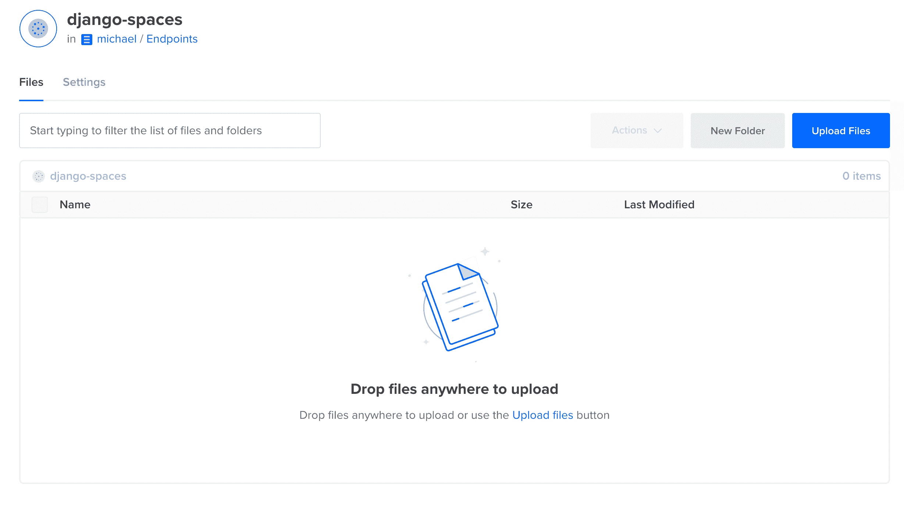
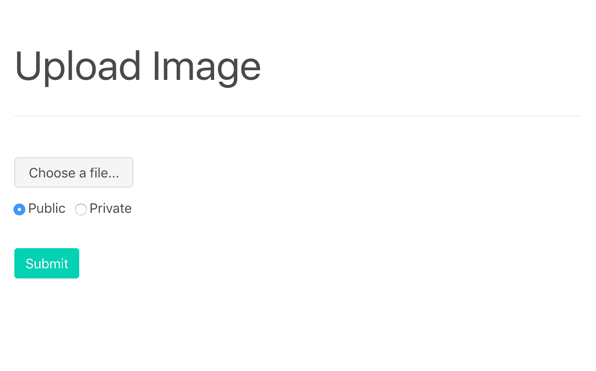
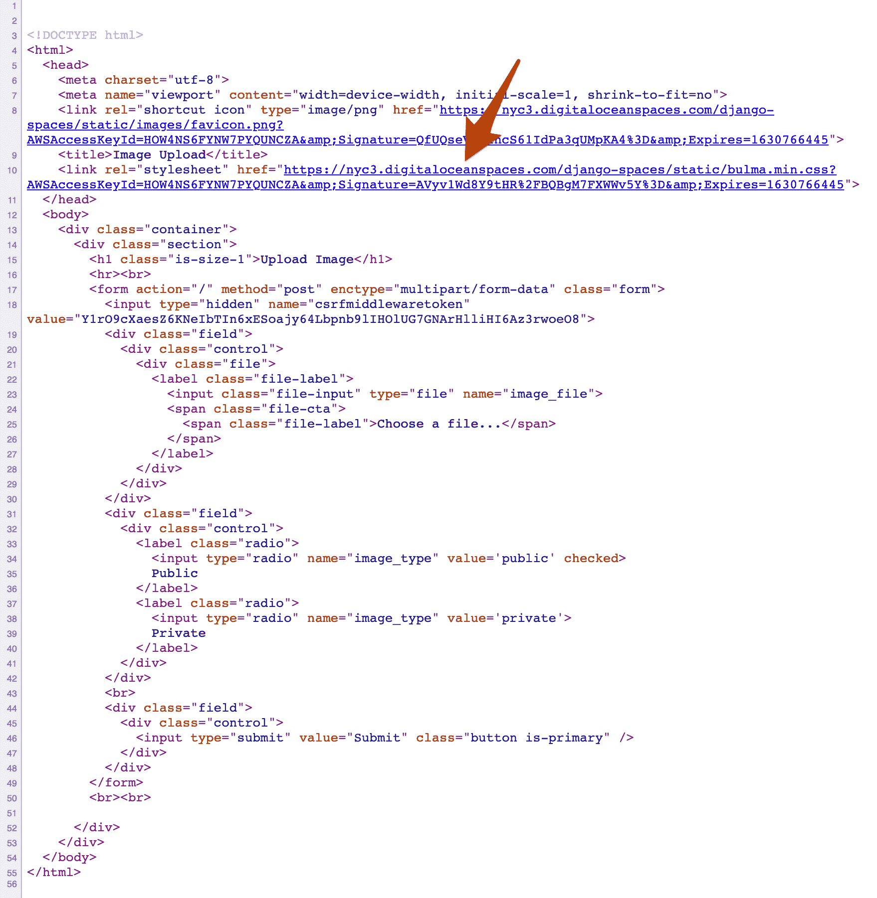
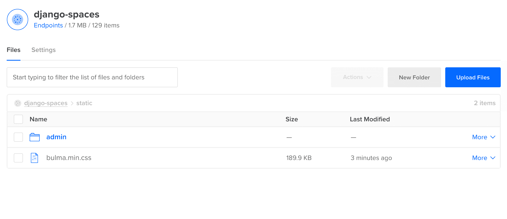
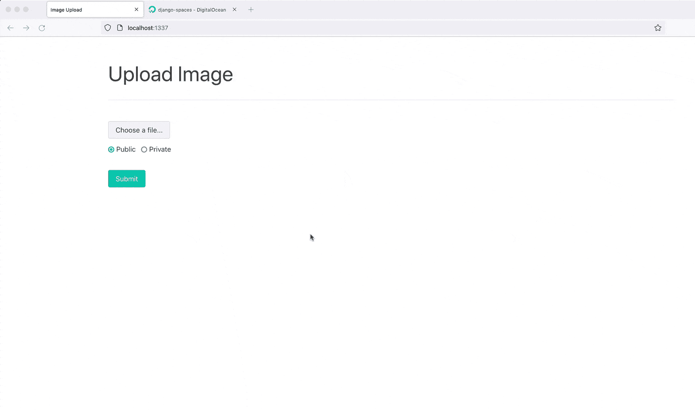
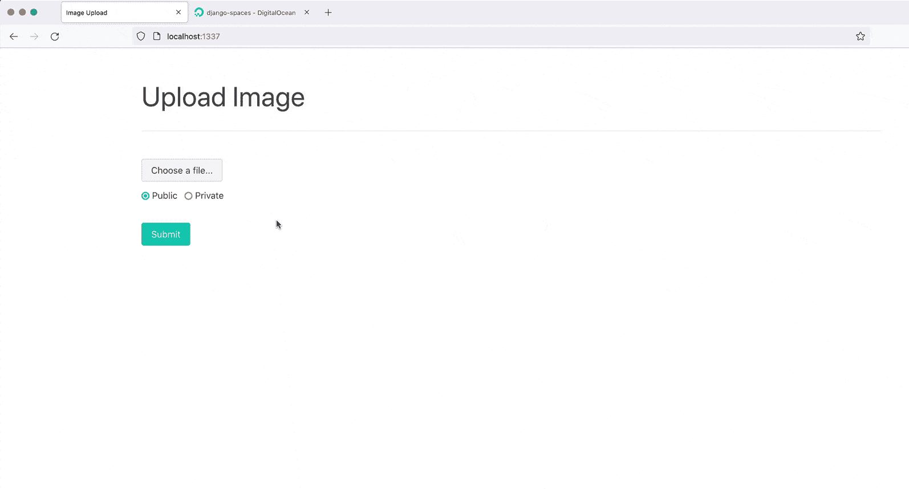

# 在数字海洋空间存储 Django 静态和媒体文件

> 原文：<https://testdriven.io/blog/django-digitalocean-spaces/>

数字海洋[空间](https://www.digitalocean.com/products/spaces/)是一个 S3 兼容的对象存储服务，内置了[内容交付网络](https://en.wikipedia.org/wiki/Content_delivery_network) (CDN)。像亚马逊 [S3](https://aws.amazon.com/s3/) 一样，它提供了一种简单、划算的方式来存储静态文件。

本教程展示了如何配置 Django，通过 DigitalOcean Spaces 加载和提供静态和用户上传的公共和私有媒体文件。

> 更喜欢用 S3？查看亚马逊 S3 上存储的 Django 静态和媒体文件。

## 数字海洋空间

### 数字海洋空间 vs S3 自动气象站？

如前所述，数字海洋空间是一种对象存储服务。与 S3 相比，数字海洋空间:

1.  更容易使用
2.  具有更简单、更可预测的定价模式
3.  有更好的文档

也就是说，DigitalOcean Spaces 没有 S3 灵活，区域也少得多。

数字海洋空间比 S3 更容易建立和使用。添加 CDN 需要在用户界面上点击几下按钮。另外，它和 S3 一样对开发者友好。如果你已经在使用 DigitalOcean，你一定要使用它。

### 入门指南

首先，你需要[注册](https://m.do.co/c/d8f211a4b4c2)一个[数字海洋](https://www.digitalocean.com/)账户(如果你还没有的话)，然后[生成](https://docs.digitalocean.com/products/spaces/how-to/manage-access/#access-keys)空间访问密钥，这样你就可以访问[数字海洋空间 API](https://docs.digitalocean.com/reference/api/spaces-api/) 。

继续创建密钥。您应该有一个访问密钥 ID 和一个秘密访问密钥。有了它们，您可以使用 [Boto3](https://boto3.readthedocs.io/) 与 Spaces API 进行交互。

示例:

```
`import boto3

# configure session and client
session = boto3.session.Session()
client = session.client(
    's3',
    region_name='nyc3',
    endpoint_url='https://nyc3.digitaloceanspaces.com',
    aws_access_key_id='YOUR_ACCESS_KEY_ID',
    aws_secret_access_key='YOUR_SECRET_ACCESS_KEY',
)

# create new bucket
client.create_bucket(Bucket='your-bucket-name')

# upload file
with open('test.txt', 'rb') as file_contents:
    client.put_object(
        Bucket='your-bucket-name',
        Key='test.txt',
        Body=file_contents,
    )

# download file
client.download_file(
    Bucket='your-bucket-name',
    Key='test.txt',
    Filename='tmp/test.txt',
)` 
```

> 更多示例，请查看[使用数字海洋空间和自动气象站 S3 软件开发套件](https://docs.digitalocean.com/products/spaces/resources/s3-sdk-examples/)。

接下来，从[数字海洋控制面板](https://cloud.digitalocean.com/)，点击右上角的“创建”，然后点击下拉菜单中的“空间”。选择一个地区，启用一个 [CDN](https://docs.digitalocean.com/products/spaces/how-to/enable-cdn/) ，选择“限制文件列表”，为您的存储桶创建一个唯一的名称。然后，创建桶。

您应该会看到类似如下的内容:



## Django 项目

从 GitHub 上的[django-digital ocean-spaces](https://github.com/testdrivenio/django-digitalocean-spaces)repo 中克隆基础项目:

```
`$ git clone -b base https://github.com/testdrivenio/django-digitalocean-spaces
$ cd django-digitalocean-spaces` 
```

从项目根目录，创建映像并启动 Docker 容器:

```
`$ docker-compose up -d --build` 
```

构建完成后，收集静态文件:

```
`$ docker-compose exec web python manage.py collectstatic` 
```

然后，导航到 [http://localhost:1337](http://localhost:1337) :



您应该能够上传一个图像，然后在[http://localhost:1337/media/IMAGE _ FILE _ NAME](http://localhost:1337/media/IMAGE_FILE_NAME)查看该图像。

> 公共与私有的单选按钮不起作用。我们将在本教程的后面添加这个功能。暂时忽略它们。

在继续之前，快速浏览一下项目结构:

```
`├── .gitignore
├── LICENSE
├── README.md
├── app
│   ├── Dockerfile
│   ├── hello_django
│   │   ├── __init__.py
│   │   ├── asgi.py
│   │   ├── settings.py
│   │   ├── urls.py
│   │   └── wsgi.py
│   ├── manage.py
│   ├── mediafiles
│   ├── requirements.txt
│   ├── static
│   │   └── bulma.min.css
│   ├── staticfiles
│   └── upload
│       ├── __init__.py
│       ├── admin.py
│       ├── apps.py
│       ├── migrations
│       │   └── __init__.py
│       ├── models.py
│       ├── templates
│       │   └── upload.html
│       ├── tests.py
│       └── views.py
├── docker-compose.yml
└── nginx
    ├── Dockerfile
    └── nginx.conf` 
```

> 想学习如何构建这个项目吗？查看 Postgres、Gunicorn 和 Nginx 的博客文章。

## Django 仓库

接下来，让我们安装 [django-storages](https://django-storages.readthedocs.io) ，这样我们就可以使用 Spaces 作为主要的 django 存储后端，以及 [boto3](https://boto3.readthedocs.io/) ，以便与 Spaces API 进行交互。

更新需求文件:

```
`boto3==1.18.36
Django==3.2
django-storages==1.11.1
gunicorn==20.1.0` 
```

将`storages`添加到*设置. py* 中的`INSTALLED_APPS`中:

```
`INSTALLED_APPS = [
    'django.contrib.admin',
    'django.contrib.auth',
    'django.contrib.contenttypes',
    'django.contrib.sessions',
    'django.contrib.messages',
    'django.contrib.staticfiles',
    'upload',
    'storages',
]` 
```

更新图像并旋转新容器:

```
`$ docker-compose up -d --build` 
```

## 静态文件

接下来，我们需要更新对 *settings.py* 中静态文件的处理:

```
`STATIC_URL = '/static/'
STATIC_ROOT = BASE_DIR / 'staticfiles'
STATICFILES_DIRS = (BASE_DIR / 'static',)

MEDIA_URL = '/media/'
MEDIA_ROOT = BASE_DIR / 'mediafiles'` 
```

用以下内容替换这些设置:

```
`USE_SPACES = os.getenv('USE_SPACES') == 'TRUE'

if USE_SPACES:
    # settings
    AWS_ACCESS_KEY_ID = os.getenv('AWS_ACCESS_KEY_ID')
    AWS_SECRET_ACCESS_KEY = os.getenv('AWS_SECRET_ACCESS_KEY')
    AWS_STORAGE_BUCKET_NAME = os.getenv('AWS_STORAGE_BUCKET_NAME')
    AWS_DEFAULT_ACL = 'public-read'
    AWS_S3_ENDPOINT_URL = 'https://nyc3.digitaloceanspaces.com'
    AWS_S3_OBJECT_PARAMETERS = {'CacheControl': 'max-age=86400'}
    # static settings
    AWS_LOCATION = 'static'
    STATIC_URL = f'https://{AWS_S3_ENDPOINT_URL}/{AWS_LOCATION}/'
    STATICFILES_STORAGE = 'storages.backends.s3boto3.S3Boto3Storage'
else:
    STATIC_URL = '/static/'
    STATIC_ROOT = BASE_DIR / 'staticfiles'

STATICFILES_DIRS = (BASE_DIR / 'static',)

MEDIA_URL = '/media/'
MEDIA_ROOT = BASE_DIR / 'mediafiles'` 
```

> 如果您使用的是不同于`NYC3`的[地区](https://docs.digitalocean.com/products/spaces/#regional-availability)，请务必更新`AWS_S3_ENDPOINT_URL`。

注意`USE_SPACES`和`STATICFILES_STORAGE`:

1.  `USE_SPACES`环境变量用于打开(值为`TRUE`)和关闭(值为`FALSE`)空间存储。因此，您可以配置两个 Docker 合成文件:一个用于开发，不带空格，另一个用于生产，带空格。
2.  `STATICFILES_STORAGE` [设置](https://django-storages.readthedocs.io/en/latest/backends/amazon-S3.html?highlight=STATICFILES_STORAGE)配置 Django 在运行`collectstatic`命令时自动将静态文件添加到 Spaces 桶中。

> 查看关于数字海洋和亚马逊 S3 的 django-storages 官方文档，了解更多关于上述设置和配置的信息。

向 *docker-compose.yml* 文件中的`web`服务添加适当的环境变量:

```
`web: build:  ./app command:  bash -c 'while !</dev/tcp/db/5432; do sleep 1; done; gunicorn hello_django.wsgi:application --bind 0.0.0.0:8000' volumes: -  ./app/:/usr/src/app/ -  static_volume:/usr/src/app/staticfiles -  media_volume:/usr/src/app/mediafiles expose: -  8000 environment: -  SECRET_KEY=please_change_me -  SQL_ENGINE=django.db.backends.postgresql -  SQL_DATABASE=postgres -  SQL_USER=postgres -  SQL_PASSWORD=postgres -  SQL_HOST=db -  SQL_PORT=5432 -  DATABASE=postgres -  USE_SPACES=TRUE -  AWS_ACCESS_KEY_ID=UPDATE_ME -  AWS_SECRET_ACCESS_KEY=UPDATE_ME -  AWS_STORAGE_BUCKET_NAME=UPDATE_ME depends_on: -  db` 
```

> 不要忘记用您刚刚创建的用户密钥和`AWS_STORAGE_BUCKET_NAME`一起更新`AWS_ACCESS_KEY_ID`和`AWS_SECRET_ACCESS_KEY`。

要测试、重新构建和运行容器:

```
`$ docker-compose down -v
$ docker-compose up -d --build` 
```

收集静态文件:

```
`$ docker-compose exec web python manage.py collectstatic` 
```

由于文件正在被上传到共享空间存储桶，所以这将花费比以前长得多的时间。

[http://localhost:1337](http://localhost:1337) 应该仍能正确渲染:


查看页面源代码以确保 CSS 样式表是从 Spaces 桶中提取的:



验证静态文件可以在数字海洋控制面板的“静态”子文件夹中看到:



> 媒体上传仍然会影响本地文件系统，因为我们只为静态文件配置了空间。我们将很快处理媒体上传。

最后，将`USE_SPACES`的值更新为`FALSE`并重新构建映像，以确保 Django 使用本地文件系统来存储静态文件。完成后，将`USE_SPACES`变回`TRUE`。

为了防止用户覆盖现有的静态文件，媒体文件上传应该放在桶中不同的子文件夹中。我们将通过为每种类型的存储创建自定义存储类来解决这个问题。

将名为 *storage_backends.py* 的新文件添加到“app/hello_django”文件夹中:

```
`from django.conf import settings
from storages.backends.s3boto3 import S3Boto3Storage

class StaticStorage(S3Boto3Storage):
    location = 'static'
    default_acl = 'public-read'

class PublicMediaStorage(S3Boto3Storage):
    location = 'media'
    default_acl = 'public-read'
    file_overwrite = False` 
```

对 *settings.py* 进行以下更改:

```
`USE_SPACES = os.getenv('USE_SPACES') == 'TRUE'

if USE_SPACES:
    # settings
    AWS_ACCESS_KEY_ID = os.getenv('AWS_ACCESS_KEY_ID')
    AWS_SECRET_ACCESS_KEY = os.getenv('AWS_SECRET_ACCESS_KEY')
    AWS_STORAGE_BUCKET_NAME = os.getenv('AWS_STORAGE_BUCKET_NAME')
    AWS_DEFAULT_ACL = 'public-read'
    AWS_S3_ENDPOINT_URL = 'https://nyc3.digitaloceanspaces.com'
    AWS_S3_OBJECT_PARAMETERS = {'CacheControl': 'max-age=86400'}
    # static settings
    AWS_LOCATION = 'static'
    STATIC_URL = f'https://{AWS_S3_ENDPOINT_URL}/{AWS_LOCATION}/'
    STATICFILES_STORAGE = 'storages.backends.s3boto3.S3Boto3Storage'
    # public media settings
    PUBLIC_MEDIA_LOCATION = 'media'
    MEDIA_URL = f'https://{AWS_S3_ENDPOINT_URL}/{PUBLIC_MEDIA_LOCATION}/'
    DEFAULT_FILE_STORAGE = 'hello_django.storage_backends.PublicMediaStorage'
else:
    STATIC_URL = '/static/'
    STATIC_ROOT = BASE_DIR / 'staticfiles'
    MEDIA_URL = '/media/'
    MEDIA_ROOT = BASE_DIR / 'mediafiles'

STATICFILES_DIRS = (BASE_DIR / 'static',)` 
```

随着`DEFAULT_FILE_STORAGE` [设置](https://django-storages.readthedocs.io/en/latest/backends/amazon-S3.html?highlight=DEFAULT_FILE_STORAGE)现在被设置，所有的[文件域](https://docs.djangoproject.com/en/3.0/ref/models/fields/#filefield)将他们的内容上传到空间桶。继续之前，请检查其余设置。

接下来，让我们对`upload`应用程序做一些修改。

*app/upload/models.py* :

```
`from django.db import models

class Upload(models.Model):
    uploaded_at = models.DateTimeField(auto_now_add=True)
    file = models.FileField()` 
```

*app/upload/views.py* :

```
`from django.conf import settings
from django.core.files.storage import FileSystemStorage
from django.shortcuts import render

from .models import Upload

def image_upload(request):
    if request.method == 'POST':
        image_file = request.FILES['image_file']
        image_type = request.POST['image_type']
        if settings.USE_SPACES:
            upload = Upload(file=image_file)
            upload.save()
            image_url = upload.file.url
        else:
            fs = FileSystemStorage()
            filename = fs.save(image_file.name, image_file)
            image_url = fs.url(filename)
        return render(request, 'upload.html', {
            'image_url': image_url
        })
    return render(request, 'upload.html')` 
```

创建新的迁移文件，然后构建新的映像:

```
`$ docker-compose exec web python manage.py makemigrations
$ docker-compose down -v
$ docker-compose up -d --build
$ docker-compose exec web python manage.py migrate` 
```

测试一下！在 [http://localhost:1337](http://localhost:1337) 上传一张图片。图像应该上传到空间(到媒体子文件夹)和`image_url`应该包括 S3 网址:



向 *storage_backends.py* 中添加一个新类:

```
`class PrivateMediaStorage(S3Boto3Storage):
    location = 'private'
    default_acl = 'private'
    file_overwrite = False
    custom_domain = False` 
```

添加适当的设置:

```
`USE_SPACES = os.getenv('USE_SPACES') == 'TRUE'

if USE_SPACES:
    # settings
    AWS_ACCESS_KEY_ID = os.getenv('AWS_ACCESS_KEY_ID')
    AWS_SECRET_ACCESS_KEY = os.getenv('AWS_SECRET_ACCESS_KEY')
    AWS_STORAGE_BUCKET_NAME = os.getenv('AWS_STORAGE_BUCKET_NAME')
    AWS_DEFAULT_ACL = 'public-read'
    AWS_S3_ENDPOINT_URL = 'https://nyc3.digitaloceanspaces.com'
    AWS_S3_OBJECT_PARAMETERS = {'CacheControl': 'max-age=86400'}
    # static settings
    AWS_LOCATION = 'static'
    STATIC_URL = f'https://{AWS_S3_ENDPOINT_URL}/{AWS_LOCATION}/'
    STATICFILES_STORAGE = 'storages.backends.s3boto3.S3Boto3Storage'
    # public media settings
    PUBLIC_MEDIA_LOCATION = 'media'
    MEDIA_URL = f'https://{AWS_S3_ENDPOINT_URL}/{PUBLIC_MEDIA_LOCATION}/'
    DEFAULT_FILE_STORAGE = 'hello_django.storage_backends.PublicMediaStorage'
    # private media settings
    PRIVATE_MEDIA_LOCATION = 'private'
    PRIVATE_FILE_STORAGE = 'hello_django.storage_backends.PrivateMediaStorage'
else:
    STATIC_URL = '/static/'
    STATIC_ROOT = BASE_DIR / 'staticfiles'
    MEDIA_URL = '/media/'
    MEDIA_ROOT = BASE_DIR / 'mediafiles'

STATICFILES_DIRS = (BASE_DIR / 'static',)` 
```

在 *app/upload/models.py* 中创建新模型:

```
`from django.db import models

from hello_django.storage_backends import PublicMediaStorage, PrivateMediaStorage

class Upload(models.Model):
    uploaded_at = models.DateTimeField(auto_now_add=True)
    file = models.FileField(storage=PublicMediaStorage())

class UploadPrivate(models.Model):
    uploaded_at = models.DateTimeField(auto_now_add=True)
    file = models.FileField(storage=PrivateMediaStorage())` 
```

然后，更新视图:

```
`from django.conf import settings
from django.core.files.storage import FileSystemStorage
from django.shortcuts import render

from .models import Upload, UploadPrivate

def image_upload(request):
    if request.method == 'POST':
        image_file = request.FILES['image_file']
        image_type = request.POST['image_type']
        if settings.USE_SPACES:
            if image_type == 'private':
                upload = UploadPrivate(file=image_file)
            else:
                upload = Upload(file=image_file)
            upload.save()
            image_url = upload.file.url
        else:
            fs = FileSystemStorage()
            filename = fs.save(image_file.name, image_file)
            image_url = fs.url(filename)
        return render(request, 'upload.html', {
            'image_url': image_url
        })
    return render(request, 'upload.html')` 
```

同样，创建迁移文件，重新构建映像，并启动新容器:

```
`$ docker-compose exec web python manage.py makemigrations
$ docker-compose down -v
$ docker-compose up -d --build
$ docker-compose exec web python manage.py migrate` 
```

为了测试，在 [http://localhost:1337](http://localhost:1337) 上传一个私有镜像。像公共图像一样，图像应该上传到 Spaces(私有子文件夹)中，并且`image_url`应该包括 Spaces URL 以及以下查询字符串参数:

1.  AWSAccessKeyId
2.  签名
3.  期满

本质上，我们创建了一个临时的、已签名的 URL，用户可以在特定的时间段内访问它。没有参数，您将无法直接访问它。



## 结论

这篇文章向您展示了如何在 DigitalOcean Spaces 上创建一个 bucket，并设置 Django 向 Spaces 上传和提供静态文件和媒体上传。

通过使用空格，您可以:

1.  增加静态文件和媒体文件的可用空间
2.  减轻您自己的服务器的压力，因为它不再需要提供文件
3.  可以限制对特定文件的访问
4.  可以利用 CDN

如果我们遗漏了什么，或者您有任何其他提示和技巧，请告诉我们。你可以在 django-digital ocean-spacesrepo 中找到最终代码。