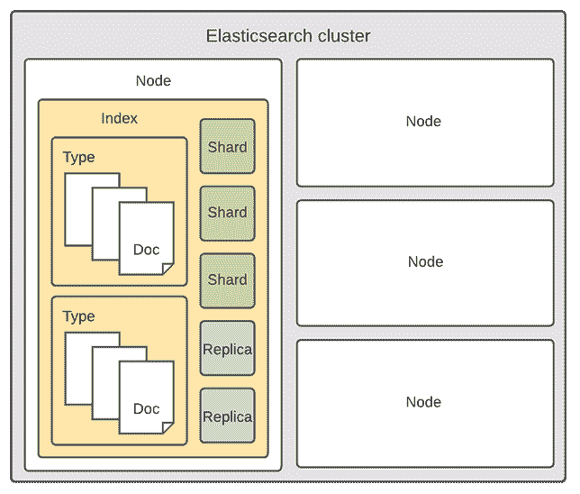

# Django REST 框架和 Elasticsearch

> 原文：<https://testdriven.io/blog/django-drf-elasticsearch/>

在本教程中，我们将看看如何集成 [Django REST 框架](https://www.django-rest-framework.org/) (DRF)和 [Elasticsearch](https://www.elastic.co/elasticsearch/) 。我们将使用 Django 对数据建模，使用 DRF 对数据进行序列化和服务。最后，我们将使用 Elasticsearch 索引数据，并使其可搜索。

## 什么是 Elasticsearch？

Elasticsearch 是一个分布式、免费和开放的搜索和分析引擎，适用于所有类型的数据，包括文本、数字、地理空间、结构化和非结构化数据。它以其简单的 RESTful APIs、分布式特性、速度和可伸缩性而闻名。Elasticsearch 是 [Elastic Stack](https://www.elastic.co/elastic-stack/) (也称为 [ELK Stack](https://www.elastic.co/what-is/elk-stack) )的核心组件，这是一套用于数据摄取、丰富、存储、分析和可视化的免费开放工具。

其使用案例包括:

1.  网站搜索和应用程序搜索
2.  监控和可视化您的系统指标
3.  安全和业务分析
4.  日志记录和日志分析

> 要了解更多关于 Elasticsearch 的信息，请查看[什么是 Elasticsearch？](https://www.elastic.co/guide/en/elasticsearch/reference/current/elasticsearch-intro.html)来自[官方文件](https://www.elastic.co/guide/index.html)。

## 弹性搜索结构和概念

在使用 Elasticsearch 之前，我们应该熟悉基本的 Elasticsearch 概念。这些从大到小排列如下:

1.  **集群**是一个或多个节点的集合。
2.  **节点**是运行 Elasticsearch 的单个服务器实例。在与集群通信时，它:
    1.  存储和索引您的数据
    2.  提供搜索
3.  **索引**用于将文档存储在对应于字段数据类型的专用数据结构中(类似于 SQL 数据库)。每个索引都有一个或多个碎片和副本。
4.  **Type** 是文档的集合，它们有一些共同点(类似于 SQL 表)。
5.  **Shard** 是一个 [Apache Lucene](https://lucene.apache.org/) 索引。它用于拆分索引并保持大量数据的可管理性。
6.  副本是一个安全机制，基本上是你的索引碎片的副本。
7.  **文档**是可以被索引的基本信息单元(类似于 SQL 行)。它用 [JSON](https://en.wikipedia.org/wiki/JSON) 来表示，这是一种无处不在的互联网数据交换格式。
8.  **字段**是 Elasticsearch 中最小的数据单元(类似于 SQL 列)。

Elasticsearch 集群具有以下结构:



好奇关系数据库概念如何与 Elasticsearch 概念相关联？

| 关系数据库 | 弹性搜索 |
| --- | --- |
| 串 | 串 |
| RDBMS 实例 | 结节 |
| 桌子 | 索引 |
| 排 | 文件 |
| 圆柱 | 田 |

> 查看[跨 SQL 和 Elasticsearch 映射概念](https://www.elastic.co/guide/en/elasticsearch/reference/current/_mapping_concepts_across_sql_and_elasticsearch.html)，了解 SQL 和 Elasticsearch 中的概念如何相互关联的更多信息。

## Elasticsearch 与 PostgreSQL 全文搜索

关于全文搜索，Elasticsearch 和 [PostgreSQL](https://www.postgresql.org/) 各有利弊。在选择它们时，您应该考虑速度、查询复杂性和预算。

PostgreSQL 的优势:

1.  Django 支持
2.  更快、更容易设置
3.  不需要维护

弹性搜索优势:

1.  仅为搜索而优化
2.  电子搜索更快(尤其是当记录数量增加时)
3.  支持不同的查询类型(叶、复合、模糊、正则表达式等等)

如果你正在做一个简单的项目，速度并不重要，你应该选择 PostgreSQL。如果性能很重要，并且您想编写复杂的查找，请选择 Elasticsearch。

> 关于 Django 和 Postgres 全文搜索的更多信息，请查看文章[使用 Django 和 Postgres 进行基本和全文搜索](/blog/django-search/)。

## 项目设置

我们将构建一个简单的博客应用程序。我们的项目将由多个模型组成，这些模型将通过 [Django REST 框架](https://www.django-rest-framework.org/)进行序列化和服务。集成 Elasticsearch 后，我们将创建一个端点，允许我们查找不同的作者、类别和文章。

为了保持代码的整洁和模块化，我们将把项目分成以下两个应用:

1.  对于我们的 Django 模型、序列化器和视图集
2.  `search` -用于弹性搜索文档、索引和查询

首先创建一个新目录，并建立一个新的 Django 项目:

```py
`$ mkdir django-drf-elasticsearch && cd django-drf-elasticsearch
$ python3.9 -m venv env
$ source env/bin/activate

(env)$ pip install django==3.2.6
(env)$ django-admin.py startproject core .` 
```

之后，创建一个名为`blog`的新应用:

```py
`(env)$ python manage.py startapp blog` 
```

在`INSTALLED_APPS`下的 *core/settings.py* 中注册 app:

```py
`# core/settings.py

INSTALLED_APPS = [
    'django.contrib.admin',
    'django.contrib.auth',
    'django.contrib.contenttypes',
    'django.contrib.sessions',
    'django.contrib.messages',
    'django.contrib.staticfiles',
    'blog.apps.BlogConfig', # new
]` 
```

## 数据库模型

接下来，在*博客/models.py* 中创建`Category`和`Article`模型:

```py
`# blog/models.py

from django.contrib.auth.models import User
from django.db import models

class Category(models.Model):
    name = models.CharField(max_length=32)
    description = models.TextField(null=True, blank=True)

    class Meta:
        verbose_name_plural = 'categories'

    def __str__(self):
        return f'{self.name}'

ARTICLE_TYPES = [
    ('UN', 'Unspecified'),
    ('TU', 'Tutorial'),
    ('RS', 'Research'),
    ('RW', 'Review'),
]

class Article(models.Model):
    title = models.CharField(max_length=256)
    author = models.ForeignKey(to=User, on_delete=models.CASCADE)
    type = models.CharField(max_length=2, choices=ARTICLE_TYPES, default='UN')
    categories = models.ManyToManyField(to=Category, blank=True, related_name='categories')
    content = models.TextField()
    created_datetime = models.DateTimeField(auto_now_add=True)
    updated_datetime = models.DateTimeField(auto_now=True)

    def __str__(self):
        return f'{self.author}: {self.title} ({self.created_datetime.date()})'` 
```

注意事项:

1.  代表一个文章类别——例如，编程、Linux、测试。
2.  `Article`代表单篇文章。每篇文章可以有多个类别。文章有特定的类型- `Tutorial`、`Research`、`Review`或`Unspecified`。
3.  作者由默认的 Django 用户模型表示。

### 运行迁移

进行迁移，然后应用它们:

```py
`(env)$ python manage.py makemigrations
(env)$ python manage.py migrate` 
```

在 *blog/admin.py* 中注册模型:

```py
`# blog/admin.py

from django.contrib import admin

from blog.models import Category, Article

admin.site.register(Category)
admin.site.register(Article)` 
```

### 填充数据库

在进入下一步之前，我们需要一些数据来处理。我创建了一个简单的命令，可以用来填充数据库。

在“博客”中创建一个名为“管理”的新文件夹，然后在该文件夹中创建另一个名为“命令”的文件夹。在“commands”文件夹中，创建一个名为 *populate_db.py* 的新文件。

```py
`management
└── commands
    └── populate_db.py` 
```

从 [populate_db.py](https://github.com/testdrivenio/django-drf-elasticsearch/blob/main/blog/management/commands/populate_db.py) 中复制文件内容，粘贴到您的 *populate_db.py* 中。

运行以下命令来填充数据库:

```py
`(env)$ python manage.py populate_db` 
```

如果一切顺利，你应该会在控制台上看到一条`Successfully populated the database.`消息，并且你的数据库中应该会有一些文章。

## Django REST 框架

现在让我们使用 pip 安装`djangorestframework`:

```py
`(env)$ pip install djangorestframework==3.12.4` 
```

在我们的 *settings.py* 中注册，就像这样:

```py
`# core/settings.py

INSTALLED_APPS = [
    'django.contrib.admin',
    'django.contrib.auth',
    'django.contrib.contenttypes',
    'django.contrib.sessions',
    'django.contrib.messages',
    'django.contrib.staticfiles',
    'blog.apps.BlogConfig',
    'rest_framework', # new
]` 
```

添加以下设置:

```py
`# core/settings.py

REST_FRAMEWORK = {
    'DEFAULT_PAGINATION_CLASS': 'rest_framework.pagination.LimitOffsetPagination',
    'PAGE_SIZE': 25
}` 
```

我们将需要这些设置来实现分页。

### 创建序列化程序

为了序列化我们的 Django 模型，我们需要为每个模型创建一个序列化器。创建依赖于 Django 模型的序列化器的最简单方法是使用`ModelSerializer`类。

*blog/serializer . py*:

```py
`# blog/serializers.py

from django.contrib.auth.models import User
from rest_framework import serializers

from blog.models import Article, Category

class UserSerializer(serializers.ModelSerializer):
    class Meta:
        model = User
        fields = ('id', 'username', 'first_name', 'last_name')

class CategorySerializer(serializers.ModelSerializer):
    class Meta:
        model = Category
        fields = '__all__'

class ArticleSerializer(serializers.ModelSerializer):
    author = UserSerializer()
    categories = CategorySerializer(many=True)

    class Meta:
        model = Article
        fields = '__all__'` 
```

注意事项:

1.  `UserSerializer`和`CategorySerializer`相当简单:我们只是提供了想要序列化的字段。
2.  在`ArticleSerializer`中，我们需要处理好关系，以确保它们也被序列化。这就是为什么我们提供了`UserSerializer`和`CategorySerializer`。

> 想了解更多关于 DRF 连载？使用 Django REST 框架序列化器有效地检查[。](/blog/drf-serializers/)

### 创建浏览器

让我们在 *blog/views.py* 中为我们的每个模型创建一个视图集:

```py
`# blog/views.py

from django.contrib.auth.models import User
from rest_framework import viewsets

from blog.models import Category, Article
from blog.serializers import CategorySerializer, ArticleSerializer, UserSerializer

class UserViewSet(viewsets.ModelViewSet):
    serializer_class = UserSerializer
    queryset = User.objects.all()

class CategoryViewSet(viewsets.ModelViewSet):
    serializer_class = CategorySerializer
    queryset = Category.objects.all()

class ArticleViewSet(viewsets.ModelViewSet):
    serializer_class = ArticleSerializer
    queryset = Article.objects.all()` 
```

在这段代码中，我们通过为每个视图集提供`serializer_class`和`queryset`来创建视图集。

### 定义 URL

为视图集创建应用程序级别的 URL:

```py
`# blog/urls.py

from django.urls import path, include
from rest_framework import routers

from blog.views import UserViewSet, CategoryViewSet, ArticleViewSet

router = routers.DefaultRouter()
router.register(r'user', UserViewSet)
router.register(r'category', CategoryViewSet)
router.register(r'article', ArticleViewSet)

urlpatterns = [
    path('', include(router.urls)),
]` 
```

然后，将应用程序 URL 连接到项目 URL:

```py
`# core/urls.py

from django.contrib import admin
from django.urls import path, include

urlpatterns = [
    path('blog/', include('blog.urls')),
    path('admin/', admin.site.urls),
]` 
```

我们的应用程序现在有以下网址:

1.  `/blog/user/`列出所有用户
2.  `/blog/user/<USER_ID>/`获取特定用户
3.  `/blog/category/`列出所有类别
4.  `/blog/category/<CATEGORY_ID>/`获取特定类别
5.  `/blog/article/`列出所有文章
6.  `/blog/article/<ARTICLE_ID>/`获取特定的文章

### 测试

现在我们已经注册了 URL，我们可以测试端点，看看是否一切正常。

运行开发服务器:

```py
`(env)$ python manage.py runserver` 
```

然后，在您选择的浏览器中，导航到[http://127 . 0 . 0 . 1:8000/blog/article/](http://127.0.0.1:8000/blog/article/)。响应应该如下所示:

```py
`{ "count":  4, "next":  null, "previous":  null, "results":  [ { "id":  1, "author":  { "id":  3, "username":  "jess_", "first_name":  "Jess", "last_name":  "Brown" }, "categories":  [ { "id":  2, "name":  "SEO optimization", "description":  null } ], "title":  "How to improve your Google rating?", "type":  "TU", "content":  "Firstly, add the correct SEO tags...", "created_datetime":  "2021-08-12T17:34:31.271610Z", "updated_datetime":  "2021-08-12T17:34:31.322165Z" }, { "id":  2, "author":  { "id":  4, "username":  "johnny", "first_name":  "Johnny", "last_name":  "Davis" }, "categories":  [ { "id":  4, "name":  "Programming", "description":  null } ], "title":  "Installing latest version of Ubuntu", "type":  "TU", "content":  "In this tutorial, we'll take a look at how to setup the latest version of Ubuntu. Ubuntu (/ʊˈbʊntuː/ is a Linux distribution based on Debian and composed mostly of free and open-source software. Ubuntu is officially released in three editions: Desktop, Server, and Core for Internet of things devices and robots.", "created_datetime":  "2021-08-12T17:34:31.540628Z", "updated_datetime":  "2021-08-12T17:34:31.592555Z" }, ... ] }` 
```

手动测试其他端点。

## 弹性搜索设置

首先在后台安装并运行 Elasticsearch。

> 需要帮助启动和运行 Elasticsearch 吗？查看[安装弹性搜索](https://www.elastic.co/guide/en/elasticsearch/reference/current/install-elasticsearch.html)指南。如果你熟悉 Docker，你可以简单地运行下面的命令来拉取[的官方图片](https://www.docker.elastic.co/r/elasticsearch)，并旋转一个运行着 Elasticsearch 的容器:
> 
> ```py
> `$ docker run -p 9200:9200 -p 9300:9300 -e "discovery.type=single-node" docker.elastic.co/elasticsearch/elasticsearch:7.14.0` 
> ```

要将 Elasticsearch 与 Django 集成，我们需要安装以下软件包:

1.  [elasticsearch](https://elasticsearch-py.readthedocs.io/en/7.x/) -用于 elasticsearch 的官方低级 Python 客户端
2.  用于编写和运行针对 elasticsearch 的查询的高级库
3.  django-elasticsearch-dsl -围绕 elasticsearch-dsl-py 的包装器，允许在 elasticsearch 中索引 django 模型

安装:

```py
`(env)$ pip install elasticsearch==7.14.0
(env)$ pip install elasticsearch-dsl==7.4.0
(env)$ pip install django-elasticsearch-dsl==7.2.0` 
```

启动一个名为`search`的新应用，它将保存我们的弹性搜索文档、索引和查询:

```py
`(env)$ python manage.py startapp search` 
```

在`INSTALLED_APPS`下的 *core/settings.py* 中注册`search`和`django_elasticsearch_dsl`:

```py
`# core/settings.py

INSTALLED_APPS = [
    'django.contrib.admin',
    'django.contrib.auth',
    'django.contrib.contenttypes',
    'django.contrib.sessions',
    'django.contrib.messages',
    'django.contrib.staticfiles',
    'django_elasticsearch_dsl', # new
    'blog.apps.BlogConfig',
    'search.apps.SearchConfig', # new
    'rest_framework',
]` 
```

现在我们需要让 Django 知道 Elasticsearch 在哪里运行。为此，我们将以下内容添加到我们的 *core/settings.py* 文件中:

```py
`# core/settings.py

# Elasticsearch
# https://django-elasticsearch-dsl.readthedocs.io/en/latest/settings.html

ELASTICSEARCH_DSL = {
    'default': {
        'hosts': 'localhost:9200'
    },
}` 
```

> 如果您的 Elasticsearch 在不同的端口上运行，请确保相应地更改上述设置。

我们可以通过启动服务器来测试 Django 是否可以连接到 Elasticsearch:

```py
`(env)$ python manage.py runserver` 
```

如果您的 Django 服务器出现故障，Elasticsearch 可能无法正常工作。

## 创建文档

在创建文档之前，我们需要确保所有的数据都以正确的格式保存。我们在文章`type`中使用`CharField(max_length=2)`，这本身没有多大意义。这就是为什么我们将它转换成人类可读的文本。

我们将通过在模型中添加一个`type_to_string()`方法来实现这一点，如下所示:

```py
`# blog/models.py

class Article(models.Model):
    title = models.CharField(max_length=256)
    author = models.ForeignKey(to=User, on_delete=models.CASCADE)
    type = models.CharField(max_length=2, choices=ARTICLE_TYPES, default='UN')
    categories = models.ManyToManyField(to=Category, blank=True, related_name='categories')
    content = models.TextField()
    created_datetime = models.DateTimeField(auto_now_add=True)
    updated_datetime = models.DateTimeField(auto_now=True)

    # new
    def type_to_string(self):
        if self.type == 'UN':
            return 'Unspecified'
        elif self.type == 'TU':
            return 'Tutorial'
        elif self.type == 'RS':
            return 'Research'
        elif self.type == 'RW':
            return 'Review'

    def __str__(self):
        return f'{self.author}: {self.title} ({self.created_datetime.date()})'` 
```

如果没有`type_to_string()`,我们的模型将会连载成这样:

```py
`{ "title":  "This is my article.", "type":  "TU", ... }` 
```

在实现`type_to_string()`之后，我们的模型被序列化成这样:

```py
`{ "title":  "This is my article.", "type":  "Tutorial", ... }` 
```

现在让我们创建文档。每个文档需要有一个`Index`和`Django`类。在`Index`类中，我们需要提供指标名称和[弹性搜索指标设置](https://www.elastic.co/guide/en/elasticsearch/reference/current/indices-update-settings.html)。在`Django`类中，我们告诉文档与哪个 Django 模型相关联，并提供我们想要索引的字段。

*博客/documents.py* :

```py
`# blog/documents.py

from django.contrib.auth.models import User
from django_elasticsearch_dsl import Document, fields
from django_elasticsearch_dsl.registries import registry

from blog.models import Category, Article

@registry.register_document
class UserDocument(Document):
    class Index:
        name = 'users'
        settings = {
            'number_of_shards': 1,
            'number_of_replicas': 0,
        }

    class Django:
        model = User
        fields = [
            'id',
            'first_name',
            'last_name',
            'username',
        ]

@registry.register_document
class CategoryDocument(Document):
    id = fields.IntegerField()

    class Index:
        name = 'categories'
        settings = {
            'number_of_shards': 1,
            'number_of_replicas': 0,
        }

    class Django:
        model = Category
        fields = [
            'name',
            'description',
        ]

@registry.register_document
class ArticleDocument(Document):
    author = fields.ObjectField(properties={
        'id': fields.IntegerField(),
        'first_name': fields.TextField(),
        'last_name': fields.TextField(),
        'username': fields.TextField(),
    })
    categories = fields.ObjectField(properties={
        'id': fields.IntegerField(),
        'name': fields.TextField(),
        'description': fields.TextField(),
    })
    type = fields.TextField(attr='type_to_string')

    class Index:
        name = 'articles'
        settings = {
            'number_of_shards': 1,
            'number_of_replicas': 0,
        }

    class Django:
        model = Article
        fields = [
            'title',
            'content',
            'created_datetime',
            'updated_datetime',
        ]` 
```

注意事项:

1.  为了转换文章类型，我们向`ArticleDocument`添加了`type`属性。
2.  因为我们的`Article`模型与`Category`是多对多(M:N)关系，与`User`是多对一(N:1)关系，所以我们需要处理好这些关系。我们通过添加`ObjectField`属性做到了这一点。

### 填充弹性搜索

要创建和填充 Elasticsearch 索引和映射，使用`search_index`命令:

```py
`(env)$ python manage.py search_index --rebuild

Deleting index 'users'
Deleting index 'categories'
Deleting index 'articles'
Creating index 'users'
Creating index 'categories'
Creating index 'articles'
Indexing 3 'User' objects
Indexing 4 'Article' objects
Indexing 4 'Category' objects` 
```

> 每次更改索引设置时，都需要运行此命令。

django-elasticsearch-dsl 创建了适当的数据库信号，这样每次创建、删除或编辑模型实例时，您的 elasticsearch 存储都会得到更新。

## 弹性搜索查询

在创建适当的视图之前，让我们看看 Elasticsearch 查询是如何工作的。

我们首先必须获得`Search`实例。我们通过调用文档中的`search()`来实现，如下所示:

```py
`from blog.documents import ArticleDocument

search = ArticleDocument.search()` 
```

> 您可以在 Django shell 中随意运行这些查询。

一旦我们有了`Search`实例，我们就可以将查询传递给`query()`方法并获取响应:

```py
`from elasticsearch_dsl import Q
from blog.documents import ArticleDocument

# Looks up all the articles that contain `How to` in the title.
query = 'How to'
q = Q(
     'multi_match',
     query=query,
     fields=[
         'title'
     ])
search = ArticleDocument.search().query(q)
response = search.execute()

# print all the hits
for hit in search:
    print(hit.title)` 
```

我们还可以像这样组合多个 Q 语句:

```py
`from elasticsearch_dsl import Q
from blog.documents import ArticleDocument

"""
Looks up all the articles that:
1) Contain 'language' in the 'title'
2) Don't contain 'ruby' or 'javascript' in the 'title'
3) And contain the query either in the 'title' or 'description'
"""
query = 'programming'
q = Q(
     'bool',
     must=[
         Q('match', title='language'),
     ],
     must_not=[
         Q('match', title='ruby'),
         Q('match', title='javascript'),
     ],
     should=[
         Q('match', title=query),
         Q('match', description=query),
     ],
     minimum_should_match=1)
search = ArticleDocument.search().query(q)
response = search.execute()

# print all the hits
for hit in search:
    print(hit.title)` 
```

使用 Elasticsearch 查询的另一个重要因素是模糊性。模糊查询是允许我们处理错别字的查询。他们使用 [Levenshtein 距离算法](https://en.wikipedia.org/wiki/Levenshtein_distance)来计算数据库中的结果和查询之间的距离。

让我们看一个例子。

通过运行下面的查询，我们不会得到任何结果，因为用户拼错了“django”。

```py
`from elasticsearch_dsl import Q
from blog.documents import ArticleDocument

query = 'djengo'  # notice the typo
q = Q(
     'multi_match',
     query=query,
     fields=[
         'title'
     ])
search = ArticleDocument.search().query(q)
response = search.execute()

# print all the hits
for hit in search:
    print(hit.title)` 
```

如果我们像这样启用模糊性:

```py
`from elasticsearch_dsl import Q
from blog.documents import ArticleDocument

query = 'djengo'  # notice the typo
q = Q(
     'multi_match',
     query=query,
     fields=[
         'title'
     ],
     fuzziness='auto')
search = ArticleDocument.search().query(q)
response = search.execute()

# print all the hits
for hit in search:
    print(hit.title)` 
```

用户将得到正确的结果。

> [全文搜索](https://www.elastic.co/guide/en/elasticsearch/reference/current/full-text-queries.html)和[精确匹配](https://www.elastic.co/guide/en/elasticsearch/reference/current/query-dsl-term-query.html)的区别在于，全文搜索会在文本被索引到 Elasticsearch 之前对其进行分析。文本被分解成不同的记号，这些记号被转换成它们的根形式(例如，reading - > read)。这些令牌然后被保存到[倒排索引](https://www.elastic.co/blog/found-elasticsearch-from-the-bottom-up#inverted-indexes-and-index-terms)中。因此，全文搜索会产生更多的结果，但需要更长的处理时间。

Elasticsearch 有许多附加功能。要熟悉 API，请尝试实现:

1.  自己的[分析仪](https://www.elastic.co/guide/en/elasticsearch/reference/current/analysis-custom-analyzer.html)。
2.  [完成提示器](https://www.elastic.co/guide/en/elasticsearch/reference/6.8/search-suggesters-completion.html) -当用户查询‘j’时，你的应用程序应该提示‘johny’或‘Jess _’。
3.  [高亮显示](https://www.elastic.co/guide/en/elasticsearch/reference/current/highlighting.html) -当用户打错字时，高亮显示(如 Linux->*Linux*)。

你可以在这里看到所有的 [Elasticsearch 搜索 API](https://www.elastic.co/guide/en/elasticsearch/reference/current/search.html)。

## 搜索视图

这样，让我们创建一些视图。为了让我们的代码更加简洁，我们可以在 *search/views.py* 中使用下面的抽象类:

```py
`# search/views.py

import abc

from django.http import HttpResponse
from elasticsearch_dsl import Q
from rest_framework.pagination import LimitOffsetPagination
from rest_framework.views import APIView

class PaginatedElasticSearchAPIView(APIView, LimitOffsetPagination):
    serializer_class = None
    document_class = None

    @abc.abstractmethod
    def generate_q_expression(self, query):
        """This method should be overridden
 and return a Q() expression."""

    def get(self, request, query):
        try:
            q = self.generate_q_expression(query)
            search = self.document_class.search().query(q)
            response = search.execute()

            print(f'Found {response.hits.total.value} hit(s) for query: "{query}"')

            results = self.paginate_queryset(response, request, view=self)
            serializer = self.serializer_class(results, many=True)
            return self.get_paginated_response(serializer.data)
        except Exception as e:
            return HttpResponse(e, status=500)` 
```

注意事项:

1.  要使用这个类，我们必须提供我们的`serializer_class`和`document_class`并覆盖`generate_q_expression()`。
2.  该类除了运行`generate_q_expression()`查询、获取响应、分页并返回序列化数据之外什么也不做。

所有的视图现在都应该继承自`PaginatedElasticSearchAPIView`:

```py
`# search/views.py

import abc

from django.http import HttpResponse
from elasticsearch_dsl import Q
from rest_framework.pagination import LimitOffsetPagination
from rest_framework.views import APIView

from blog.documents import ArticleDocument, UserDocument, CategoryDocument
from blog.serializers import ArticleSerializer, UserSerializer, CategorySerializer

class PaginatedElasticSearchAPIView(APIView, LimitOffsetPagination):
    serializer_class = None
    document_class = None

    @abc.abstractmethod
    def generate_q_expression(self, query):
        """This method should be overridden
 and return a Q() expression."""

    def get(self, request, query):
        try:
            q = self.generate_q_expression(query)
            search = self.document_class.search().query(q)
            response = search.execute()

            print(f'Found {response.hits.total.value} hit(s) for query: "{query}"')

            results = self.paginate_queryset(response, request, view=self)
            serializer = self.serializer_class(results, many=True)
            return self.get_paginated_response(serializer.data)
        except Exception as e:
            return HttpResponse(e, status=500)

# views

class SearchUsers(PaginatedElasticSearchAPIView):
    serializer_class = UserSerializer
    document_class = UserDocument

    def generate_q_expression(self, query):
        return Q('bool',
                 should=[
                     Q('match', username=query),
                     Q('match', first_name=query),
                     Q('match', last_name=query),
                 ], minimum_should_match=1)

class SearchCategories(PaginatedElasticSearchAPIView):
    serializer_class = CategorySerializer
    document_class = CategoryDocument

    def generate_q_expression(self, query):
        return Q(
                'multi_match', query=query,
                fields=[
                    'name',
                    'description',
                ], fuzziness='auto')

class SearchArticles(PaginatedElasticSearchAPIView):
    serializer_class = ArticleSerializer
    document_class = ArticleDocument

    def generate_q_expression(self, query):
        return Q(
                'multi_match', query=query,
                fields=[
                    'title',
                    'author',
                    'type',
                    'content'
                ], fuzziness='auto')` 
```

### 定义 URL

最后，让我们为视图创建 URL:

```py
`# search.urls.py

from django.urls import path

from search.views import SearchArticles, SearchCategories, SearchUsers

urlpatterns = [
    path('user/<str:query>/', SearchUsers.as_view()),
    path('category/<str:query>/', SearchCategories.as_view()),
    path('article/<str:query>/', SearchArticles.as_view()),
]` 
```

然后，将应用程序 URL 连接到项目 URL:

```py
`# core/urls.py

from django.contrib import admin
from django.urls import path, include

urlpatterns = [
    path('blog/', include('blog.urls')),
    path('search/', include('search.urls')), # new
    path('admin/', admin.site.urls),
]` 
```

### 测试

我们的 web 应用程序完成了。我们可以通过访问以下 URL 来测试我们的搜索端点:

> 注意第四个请求的错别字。我们拼写了“progreming ”,但由于模糊性，仍然得到了正确的结果。

## 替代库

我们选择的道路并不是整合 Django 和 Elasticsearch 的唯一途径。还有一些其他的图书馆你可能想去看看:

1.  django-elasicsearch-dsl-drf 是围绕 Elasticsearch 和 Django REST 框架的一个包装器。它提供了视图、序列化器、过滤器后端、分页等等。它工作得很好，但是对于较小的项目来说可能有些矫枉过正。如果你需要高级的弹性搜索功能，我推荐你使用它。
2.  [Haystack](https://haystacksearch.org/) 是一些搜索后端的包装器，比如 Elasticsearch、 [Solr](http://lucene.apache.org/solr/) 和 [Whoosh](https://github.com/mchaput/whoosh/) 。它允许您编写一次搜索代码，并在不同的搜索后端重用它。它非常适合实现一个简单的搜索框。因为 Haystack 是另一个抽象层，所以会涉及更多的开销，所以如果性能真的很重要或者如果您正在处理大量数据，就不应该使用它。这也需要一些配置。
3.  Django REST 框架的 Haystack 是一个小库，它试图简化 Haystack 与 Django REST 框架的集成。在撰写本文时，该项目有点过时，他们的文档也写得很糟糕。我花了相当多的时间试图让它工作，但运气不好。

## 结论

在本教程中，您学习了使用 Django REST 框架和 Elasticsearch 的基础知识。您现在知道如何集成它们，创建 Elasticsearch 文档和查询，并通过 RESTful API 提供数据。

> 在将你的项目投入生产之前，考虑使用一个托管的 Elasticsearch 服务，比如 [Elastic Cloud](https://www.elastic.co/pricing/) 、[亚马逊 Elasticsearch 服务](https://aws.amazon.com/elasticsearch-service/)或 [Elastic on Azure](https://azure.microsoft.com/en-us/overview/linux-on-azure/elastic/) 。使用托管服务的成本将高于管理您自己的集群，但它们提供了部署、保护和运行 Elasticsearch 集群所需的所有基础设施。此外，他们将处理版本更新、定期备份和扩展。

从 GitHub 上的[django-drf-elastic search](https://github.com/testdrivenio/django-drf-elasticsearch)repo 中抓取代码。