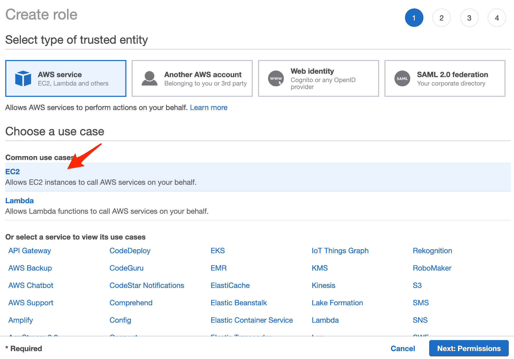
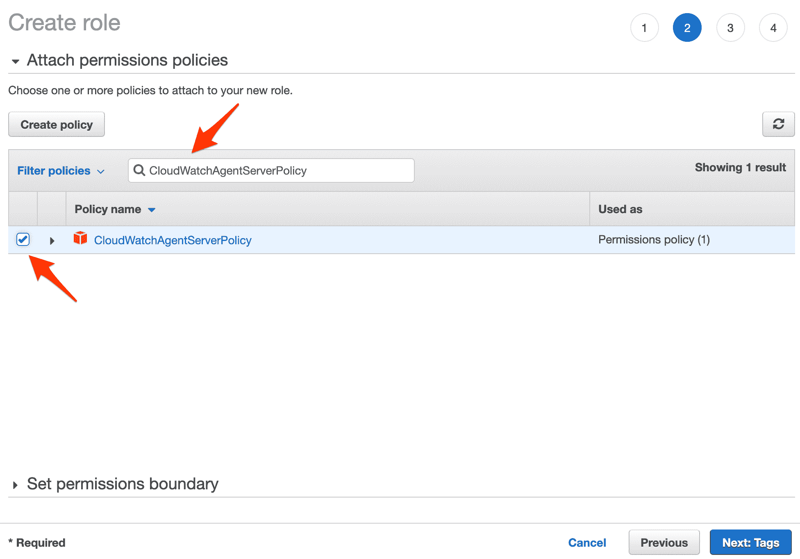
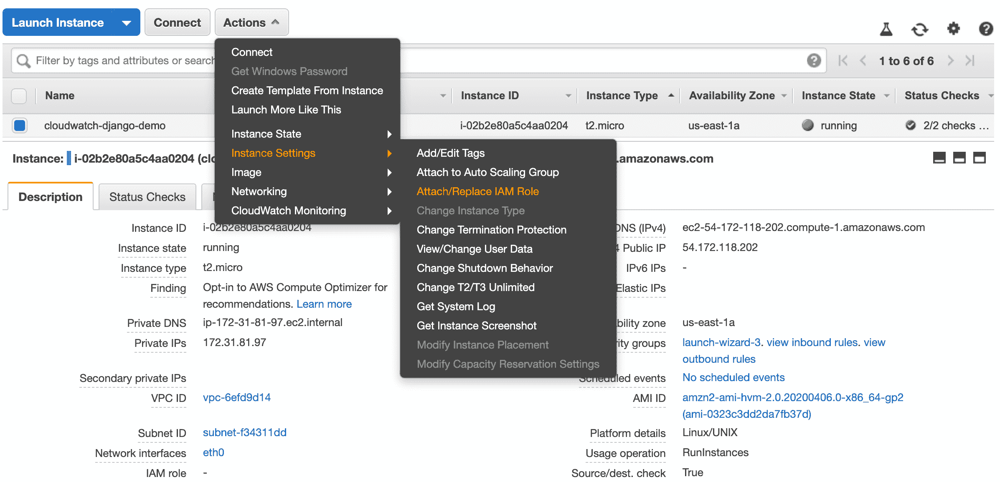

# 使用 Django、Docker 和 CloudWatch 进行集中日志记录

> 原文：<https://testdriven.io/blog/django-logging-cloudwatch/>

让我们看看如何配置运行在 EC2 实例上的容器化 Django 应用程序，以便将日志发送到 [Amazon CloudWatch](https://aws.amazon.com/cloudwatch/) 。

*步骤*:

1.  创建 IAM 角色
2.  将 IAM 角色附加到 EC2 实例
3.  创建云观察日志组
4.  在 EC2 实例上安装 CloudWatch 日志代理
5.  配置 Django 日志记录
6.  复合更新坞站

## 创建 IAM 角色

首先创建一个新的 IAM 角色，并附加[CloudWatchAgentServerPolicy](https://github.com/SummitRoute/aws_managed_policies/blob/master/policies/CloudWatchAgentServerPolicy)策略，供 Docker 守护进程用来写入 CloudWatch。

从 [IAM 控制台](https://console.aws.amazon.com/iam)中，选择“角色”并点击“创建角色”。在“常见用例”下选择“EC2”服务:



单击下一步按钮。

在“权限”页面上，搜索“CloudWatchAgentServerPolicy”策略，并选中复选框以附加它:



单击几次“下一步”。在审查页面上，输入一个角色名称-即`CloudWatchAgentRole` -然后创建该角色。

## 附加 IAM 角色

要将角色附加到 EC2 实例，导航到 [EC2 仪表板](https://console.aws.amazon.com/ec2)并选择实例。单击“操作”下拉菜单，选择“实例设置”，然后单击“附加/替换 IAM 角色”:



搜索并选择您刚刚创建的 IAM 角色，然后单击“应用”。

> 您也可以从命令行附加角色，如下所示:
> 
> ```
> $ aws ec2 associate-iam-instance-profile \
>     --instance-id <YOUR_INSTANCE_ID> \
>     --iam-instance-profile Name=CloudWatchAgentRole 
> ```

## 创建云观察日志组

既然 Docker 守护进程已经获得了写入 CloudWatch 的权限，那么让我们创建一个要写入的日志组。在 [CloudWatch 控制台](https://console.aws.amazon.com/cloudwatch/)内，创建一个新的日志组。向新创建的组中添加一个新的日志流。

## 安装云观察日志代理

SSH 到 EC2 实例，直接从 S3 下载并安装 CloudWatch 日志代理。

示例:

```
`# download
$ curl https://s3.amazonaws.com/amazoncloudwatch-agent/ubuntu/amd64/latest/amazon-cloudwatch-agent.deb

# install
$ sudo dpkg -i -E ./amazon-cloudwatch-agent.deb` 
```

## 配置 Django 日志记录

因为 Docker 容器向 stdout 和 stderr 输出流发出日志，所以您需要配置 Django 日志记录，通过 [StreamHandler](https://docs.python.org/3/library/logging.handlers.html#logging.StreamHandler) 将所有内容记录到 stderr。

例如:

```
`LOGGING = {
    'version': 1,
    'disable_existing_loggers': False,
    'handlers': {
        'console': {
            'class': 'logging.StreamHandler'
        },
    },
    'loggers': {
        '': {
            'handlers': ['console'],
            'level': 'DEBUG',
        },
    },
}` 
```

## 复合更新坞站

最后，我们可以在单个容器中使用 Docker 的 [awslogs](https://docs.docker.com/config/containers/logging/awslogs/) 日志驱动程序。

例如:

```
`version:  "3.8" services: api: build:  ./project command:  gunicorn core.wsgi:application --bind 0.0.0.0:8000 --log-level=debug logging: driver:  "awslogs" options: awslogs-region:  "us-east-1" awslogs-group:  "your-log-group" awslogs-stream:  "your-log-stream"` 
```

不使用 compose？假设您已经构建并标记了图像，像这样旋转容器:

```
`$ docker run \
    --log-driver="awslogs" \
    --log-opt awslogs-region="use-east-1" \
    --log-opt awslogs-group="your-log-group" \
    --log-opt awslogs-stream="your-log-group" \
    your-image-tag` 
```