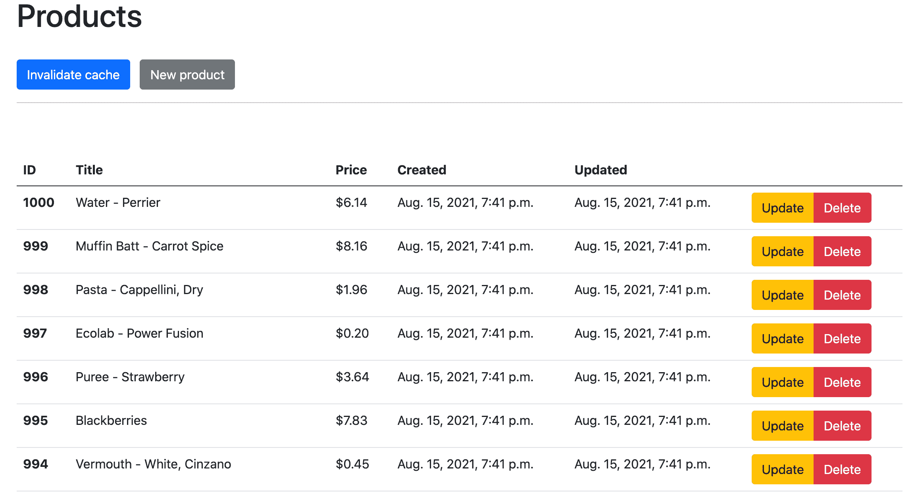
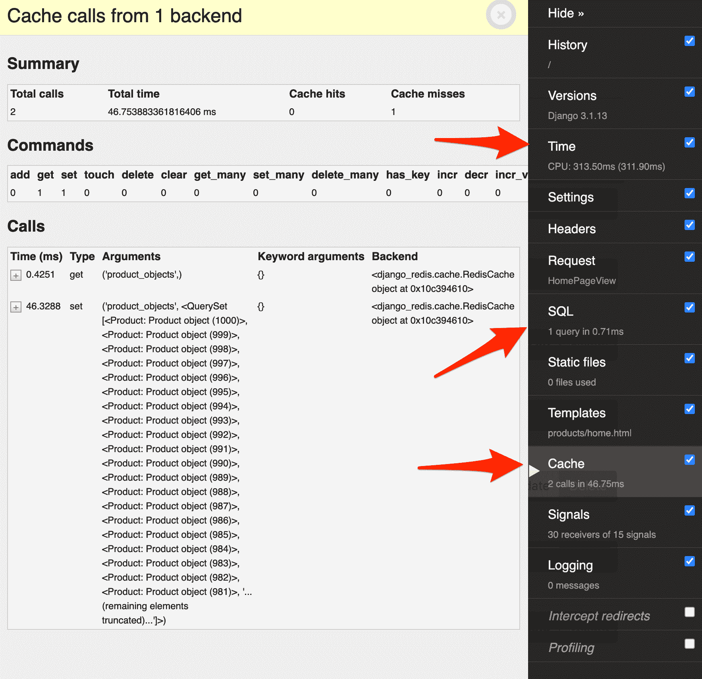
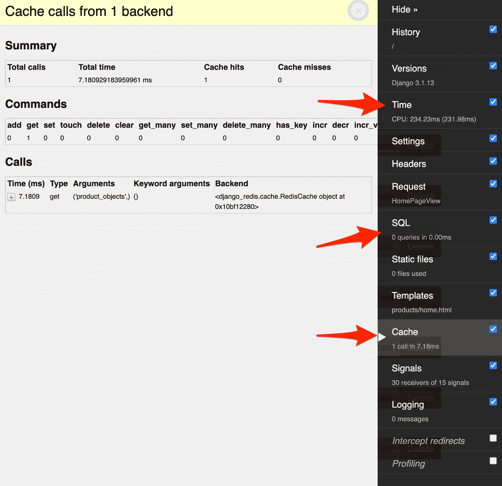

# Django 中的低级缓存 API

> 原文：<https://testdriven.io/blog/django-low-level-cache/>

在之前的文章中，我们查看了 Django 中缓存的概述，并深入研究了如何缓存 Django 视图以及使用不同的缓存后端。本文更深入地研究了 Django 中的低级缓存 API。

--

**Django 缓存文章:**

1.  [Django 中的缓存](/blog/django-caching/)
2.  [Django 中的低级缓存 API](/blog/django-low-level-cache/)(本文！)

## 目标

完成本文后，您应该能够:

1.  将 Redis 设置为 Django 缓存后端
2.  使用 Django 的低级缓存 API 来缓存模型
3.  使用 Django 数据库信号使缓存无效
4.  利用 Django 生命周期简化缓存失效
5.  与低级缓存 API 交互

## Django 低级高速缓存

Django 中的缓存可以在不同的层次上实现(或者站点的不同部分)。您可以缓存整个站点或不同粒度级别的特定部分(按粒度降序排列):

> 有关 Django 中不同缓存级别的更多信息，请参考 Django 文章中的[缓存。](/blog/django-caching/#django-caching-levels)

如果 Django 的每站点或每视图缓存不够精细，无法满足您的应用程序需求，那么您可能希望利用[低级](https://docs.djangoproject.com/en/3.2/topics/cache/#the-low-level-cache-api)缓存 API 来管理对象级的缓存。

如果您需要缓存不同的:

1.  对以不同间隔变化的对象进行建模
2.  登录用户的数据相互分离
3.  计算负载繁重的外部资源
4.  外部 API 调用

所以，当你需要更多的粒度和对缓存的控制时，Django 的低级缓存是很好的。它可以存放任何可以安全腌制的物品。要使用低级缓存，你可以使用内置的`django.core.cache.caches`，或者，如果你只是想使用在 *settings.py* 文件中定义的默认缓存，通过`django.core.cache.cache`。

## 项目设置

从 GitHub 上的[django-低级缓存](https://github.com/testdrivenio/django-low-level-cache) repo 中克隆基础项目:

```
`$ git clone -b base https://github.com/testdrivenio/django-low-level-cache
$ cd django-low-level-cache` 
```

创建(并激活)虚拟环境，并满足以下要求:

```
`$ python3.9 -m venv venv
$ source venv/bin/activate
(venv)$ pip install -r requirements.txt` 
```

应用 Django 迁移，将一些产品数据加载到数据库中，并启动服务器:

```
`(venv)$ python manage.py migrate
(venv)$ python manage.py seed_db
(venv)$ python manage.py runserver` 
```

在您的浏览器中导航到 [http://127.0.0.1:8000](http://127.0.0.1:8000) 以检查一切是否按预期工作。



## 缓存后端

我们将使用 [Redis](https://redis.io) 作为缓存后端。

[下载](https://redis.io/download)并安装 Redis。

> 如果你用的是 Mac，我们建议用[家酿](https://brew.sh/)安装 Redis:

安装完成后，在新的终端窗口[中启动 Redis 服务器](https://redis.io/topics/quickstart#starting-redis)并确保它运行在默认端口 6379 上。当我们告诉 Django 如何与 Redis 通信时，端口号将非常重要。

对于 Django 使用 Redis 作为缓存后端，需要 django-redis 依赖关系。它已经安装好了，所以你只需要将自定义后端添加到 *settings.py* 文件中:

```
`CACHES = {
    'default': {
        'BACKEND': 'django_redis.cache.RedisCache',
        'LOCATION': 'redis://127.0.0.1:6379/1',
        'OPTIONS': {
            'CLIENT_CLASS': 'django_redis.client.DefaultClient',
        }
    }
}` 
```

现在，当您再次运行服务器时，Redis 将被用作缓存后端:

```
`(venv)$ python manage.py runserver` 
```

翻到代码。 *products/views.py* 中的`HomePageView`视图简单地列出了数据库中的所有产品:

```
`class HomePageView(View):
    template_name = 'products/home.html'

    def get(self, request):
        product_objects = Product.objects.all()

        context = {
            'products': product_objects
        }

        return render(request, self.template_name, context)` 
```

让我们为产品对象添加对低级缓存 API 的支持。

首先，将导入添加到 *products/views.py* 的顶部:

```
`from django.core.cache import cache` 
```

然后，向视图添加用于缓存产品的代码:

```
`class HomePageView(View):
    template_name = 'products/home.html'

    def get(self, request):
        product_objects = cache.get('product_objects')      # NEW

        if product_objects is None:                         # NEW
            product_objects = Product.objects.all()
            cache.set('product_objects', product_objects)   # NEW

        context = {
            'products': product_objects
        }

        return render(request, self.template_name, context)` 
```

这里，我们首先检查默认缓存中是否有名为`product_objects`的缓存对象:

*   如果是这样，我们只是将它返回给模板，而没有进行数据库查询。
*   如果在我们的缓存中没有找到，我们查询数据库并用键`product_objects`将结果添加到缓存中。

服务器运行时，在浏览器中导航至 [http://127.0.0.1:8000](http://127.0.0.1:8000) 。点击 [Django 调试工具栏](https://django-debug-toolbar.readthedocs.io/)右侧菜单中的“缓存”。您应该会看到类似如下的内容:



有两个缓存调用:

1.  第一个调用试图获取名为`product_objects`的缓存对象，由于该对象不存在，导致缓存未命中。
2.  第二个调用使用相同的名称设置缓存对象，结果是所有产品的 queryset。

还有一个 SQL 查询。总的来说，页面加载大约需要 313 毫秒。

在浏览器中刷新页面:



这一次，您应该看到一个缓存命中，它获得名为`product_objects`的缓存对象。此外，没有 SQL 查询，页面加载大约需要 234 毫秒。

尝试添加新产品、更新现有产品和删除产品。您将不会在 [http://127.0.0.1:8000](http://127.0.0.1:8000) 看到任何更改，直到您通过按下“Invalidate cache”按钮手动使缓存无效。

## 使缓存失效

接下来让我们看看如何自动使缓存失效。在[之前的文章](/blog/django-caching/)中，我们研究了如何在一段时间(TTL)后使缓存失效。在本文中，我们将研究如何在模型发生变化时使缓存失效——例如，当一个产品被添加到 products 表中时，或者当一个现有产品被更新或删除时。

### 使用姜戈信号

对于这个任务，我们可以使用数据库[信号](https://docs.djangoproject.com/en/3.2/topics/signals/):

> Django 包括一个“信号调度程序”，当框架中的其他地方发生动作时，它可以帮助解耦的应用程序得到通知。简而言之，信号允许某些发送者通知一组接收者某个动作已经发生。当许多代码可能对相同的事件感兴趣时，它们特别有用。

### 保存和删除

要设置处理缓存失效的信号，首先更新 *products/apps.py* ，如下所示:

```
`from django.apps import AppConfig

class ProductsConfig(AppConfig):
    name = 'products'

    def ready(self):                # NEW
        import products.signals     # NEW` 
```

接下来，在“产品”目录中创建一个名为 *signals.py* 的文件:

```
`from django.core.cache import cache
from django.db.models.signals import post_delete, post_save
from django.dispatch import receiver

from .models import Product

@receiver(post_delete, sender=Product, dispatch_uid='post_deleted')
def object_post_delete_handler(sender, **kwargs):
     cache.delete('product_objects')

@receiver(post_save, sender=Product, dispatch_uid='posts_updated')
def object_post_save_handler(sender, **kwargs):
    cache.delete('product_objects')` 
```

这里，我们使用来自`django.dispatch`的`receiver`装饰器来装饰两个函数，当添加或删除产品时，这两个函数分别被调用。让我们来看看论点:

1.  第一个参数是修饰函数绑定到的信号事件，可以是`save`或`delete`。
2.  我们还指定了一个发送者，即接收信号的`Product`模型。
3.  最后，我们传递了一个字符串作为`dispatch_uid`到[防止重复信号](https://docs.djangoproject.com/en/3.2/topics/signals/#preventing-duplicate-signals)。

因此，当针对`Product`模型进行保存或删除时，缓存对象上的`delete`方法被调用来删除`product_objects`缓存的内容。

要查看实际效果，请启动或重启服务器，并在浏览器中导航到 [http://127.0.0.1:8000](http://127.0.0.1:8000) 。打开 Django 调试工具栏中的“缓存”标签。您应该会看到一次缓存未命中。刷新，您应该没有缓存未命中和一个缓存命中。关闭调试工具栏页面。然后，单击“新产品”按钮添加新产品。单击“保存”后，您应该会被重定向回主页。这一次，您应该看到一次缓存未命中，这表明信号起作用了。此外，你的新产品应该出现在产品列表的顶部。

### 更新

更新一下怎么样？

如果您像这样更新一个项目，就会触发`post_save`信号:

```
`product = Product.objects.get(id=1)
product.title = 'A new title'
product.save()` 
```

但是，如果您通过`QuerySet`对模型执行`update`，则`post_save`不会被触发:

```
`Product.objects.filter(id=1).update(title='A new title')` 
```

记下`ProductUpdateView`:

```
`class ProductUpdateView(UpdateView):
    model = Product
    fields = ['title', 'price']
    template_name = 'products/product_update.html'

    # we overrode the post method for testing purposes
    def post(self, request, *args, **kwargs):
        self.object = self.get_object()
        Product.objects.filter(id=self.object.id).update(
            title=request.POST.get('title'),
            price=request.POST.get('price')
        )
        return HttpResponseRedirect(reverse_lazy('home'))` 
```

因此，为了触发`post_save`，让我们覆盖 queryset `update()`方法。首先创建一个自定义`QuerySet`和一个自定义`Manager`。在 *products/models.py* 的顶部，添加以下几行:

```
`from django.core.cache import cache             # NEW
from django.db import models
from django.db.models import QuerySet, Manager  # NEW
from django.utils import timezone               # NEW` 
```

接下来，让我们将下面的代码添加到 *products/models.py* 的`Product`类的正上方:

```
`class CustomQuerySet(QuerySet):
    def update(self, **kwargs):
        cache.delete('product_objects')
        super(CustomQuerySet, self).update(updated=timezone.now(), **kwargs)

class CustomManager(Manager):
    def get_queryset(self):
        return CustomQuerySet(self.model, using=self._db)` 
```

这里，我们创建了一个自定义`Manager`，它只有一个任务:返回我们的自定义`QuerySet`。在我们的定制`QuerySet`中，我们重写了`update()`方法，首先删除缓存键，然后执行常规的`QuerySet`更新。

为了让我们的代码使用它，您还需要像这样更新`Product`:

```
`class Product(models.Model):
    title = models.CharField(max_length=200, blank=False)
    price = models.CharField(max_length=20, blank=False)
    created = models.DateTimeField(auto_now_add=True)
    updated = models.DateTimeField(auto_now=True)

    objects = CustomManager()           # NEW

    class Meta:
        ordering = ['-created']` 
```

完整文件:

```
`from django.core.cache import cache
from django.db import models
from django.db.models import QuerySet, Manager
from django.utils import timezone

class CustomQuerySet(QuerySet):
    def update(self, **kwargs):
        cache.delete('product_objects')
        super(CustomQuerySet, self).update(updated=timezone.now(), **kwargs)

class CustomManager(Manager):
    def get_queryset(self):
        return CustomQuerySet(self.model, using=self._db)

class Product(models.Model):
    title = models.CharField(max_length=200, blank=False)
    price = models.CharField(max_length=20, blank=False)
    created = models.DateTimeField(auto_now_add=True)
    updated = models.DateTimeField(auto_now=True)

    objects = CustomManager()

    class Meta:
        ordering = ['-created']` 
```

测试一下。

### 使用 Django 生命周期

您可以不使用数据库信号，而是使用一个名为 [Django Lifecycle](https://rsinger86.github.io/django-lifecycle/) 的第三方包，这有助于使缓存失效更容易、更易读:

> 这个项目提供了一个@hook 装饰器以及一个基本模型和 mixin 来为 Django 模型添加生命周期挂钩。Django 提供生命周期挂钩的内置方法是 Signals。然而，我的团队经常发现信号引入了不必要的间接性，并且与 Django 的“胖模型”方法不一致。

要切换到使用 Django 生命周期，关闭服务器，然后像这样更新 *products/app.py* :

```
`from django.apps import AppConfig

class ProductsConfig(AppConfig):
    name = 'products'` 
```

接下来，将 Django 生命周期添加到 *requirements.txt* :

```
`Django==3.1.13 django-debug-toolbar==3.2.1 django-lifecycle==0.9.1  # NEW django-redis==5.0.0 redis==3.5.3` 
```

安装新要求:

```
`(venv)$ pip install -r requirements.txt` 
```

要使用生命周期挂钩，请像这样更新 *products/models.py* :

```
`from django.core.cache import cache
from django.db import models
from django.db.models import QuerySet, Manager
from django_lifecycle import LifecycleModel, hook, AFTER_DELETE, AFTER_SAVE   # NEW
from django.utils import timezone

class CustomQuerySet(QuerySet):
    def update(self, **kwargs):
        cache.delete('product_objects')
        super(CustomQuerySet, self).update(updated=timezone.now(), **kwargs)

class CustomManager(Manager):
    def get_queryset(self):
        return CustomQuerySet(self.model, using=self._db)

class Product(LifecycleModel):              # NEW
    title = models.CharField(max_length=200, blank=False)
    price = models.CharField(max_length=20, blank=False)
    created = models.DateTimeField(auto_now_add=True)
    updated = models.DateTimeField(auto_now=True)

    objects = CustomManager()

    class Meta:
        ordering = ['-created']

    @hook(AFTER_SAVE)                       # NEW
    @hook(AFTER_DELETE)                     # NEW
    def invalidate_cache(self):             # NEW
       cache.delete('product_objects')      # NEW` 
```

在上面的代码中，我们:

1.  首先从 Django 生命周期中导入必要的对象
2.  然后继承自`LifecycleModel`而不是`django.db.models`
3.  创建了一个删除`product_object`缓存键的`invalidate_cache`方法
4.  使用了`@hook`decorator 来指定我们想要“挂钩”的事件

通过以下方式在您的浏览器中进行测试-

1.  导航到 [http://127.0.0.1:8000](http://127.0.0.1:8000)
2.  在调试工具栏中刷新并验证是否有缓存命中
3.  添加产品并验证现在是否存在缓存缺失

与`django signals`一样，如果我们像前面提到的例子那样通过`QuerySet`更新，钩子不会触发:

```
`Product.objects.filter(id=1).update(title="A new title")` 
```

在这种情况下，我们仍然需要创建一个自定义的`Manager`和`QuerySet`，就像我们之前展示的那样。

测试编辑和删除产品。

## 低级高速缓存 API 方法

到目前为止，我们已经使用了`cache.get`、`cache.set`和`cache.delete`方法来获取、设置和删除(无效)缓存中的对象。让我们从`django.core.cache.cache`中来看看一些[更多的方法](https://docs.djangoproject.com/en/3.2/topics/cache/#basic-usage)。

### cache.get_or_set

获取指定的键(如果存在)。如果它不存在，它设置关键点。

**语法**

`cache.get_or_set(key, default, timeout=DEFAULT_TIMEOUT, version=None)`

`timeout`参数用于设置缓存的有效时间(以秒为单位)。将其设置为`None`将永久缓存该值。省略它将使用在`CACHES`设置中的`setting.py`中设置的超时(如果有的话)

许多缓存方法还包括一个`version`参数。使用此参数，您可以设置或访问同一缓存键的不同版本。

**例子**

```
`>>> from django.core.cache import cache
>>> cache.get_or_set('my_key', 'my new value')
'my new value'` 
```

我们可以在视图中使用它，而不是使用 if 语句:

```
`# current implementation
product_objects = cache.get('product_objects')

if product_objects is None:
    product_objects = Product.objects.all()
    cache.set('product_objects', product_objects)

# with get_or_set
product_objects = cache.get_or_set('product_objects', product_objects)` 
```

### cache.set_many

用于通过传递一个键值对字典来一次设置多个键。

**语法**

`cache.set_many(dict, timeout)`

**例子**

```
`>>> cache.set_many({'my_first_key': 1, 'my_second_key': 2, 'my_third_key': 3})` 
```

### cache.get_many

用于一次获取多个缓存对象。它返回一个字典，其中的键被指定为方法的参数，只要它们存在并且没有过期。

**语法**

`cache.get_many(keys, version=None)`

**例子**

```
`>>> cache.get_many(['my_key', 'my_first_key', 'my_second_key', 'my_third_key'])
OrderedDict([('my_key', 'my new value'), ('my_first_key', 1), ('my_second_key', 2), ('my_third_key', 3)])` 
```

### cache.touch

如果您想要更新某个密钥的到期时间，可以使用此方法。超时值以秒为单位在超时参数中设置。

**语法**

`cache.touch(key, timeout=DEFAULT_TIMEOUT, version=None)`

**例子**

```
`>>> cache.set('sample', 'just a sample', timeout=120)
>>> cache.touch('sample', timeout=180)` 
```

### cache.incr 和 cache.decr

这两种方法可以用来增加或减少一个已经存在的键值。如果在不存在的缓存键上使用这些方法，它将返回一个`ValueError`。

在未指定 delta 参数的情况下，该值将增加/减少 1。

**语法**

```
`cache.incr(key, delta=1, version=None)

cache.decr(key, delta=1, version=None)` 
```

**例子**

```
`>>> cache.set('my_first_key', 1)
>>> cache.incr('my_first_key')
2
>>>
>>> cache.incr('my_first_key', 10)
12` 
```

### cache.close()

要关闭到缓存的连接，可以使用`close()`方法。

**语法**

`cache.close()`

**例子**

`cache.close()`

### cache.clear

要一次删除缓存中的所有键，可以使用这个方法。请记住，这将从缓存中删除所有的东西，而不仅仅是你的应用程序设置的键。

**语法**

`cache.clear()`

**例子**

`cache.clear()`

## 结论

在本文中，我们研究了 Django 中的低级缓存 API。我们扩展了一个演示项目以使用低级缓存，并且使用 Django 的数据库信号和 Django 生命周期钩子第三方包使缓存无效。

我们还提供了 Django 低级缓存 API 中所有可用方法的概述，以及如何使用它们的示例。

你可以在[django-低级缓存](https://github.com/testdrivenio/django-low-level-cache) repo 中找到最终代码。

--

**Django 缓存文章:**

1.  [Django 中的缓存](/blog/django-caching/)
2.  [Django 中的低级缓存 API](/blog/django-low-level-cache/)(本文！)