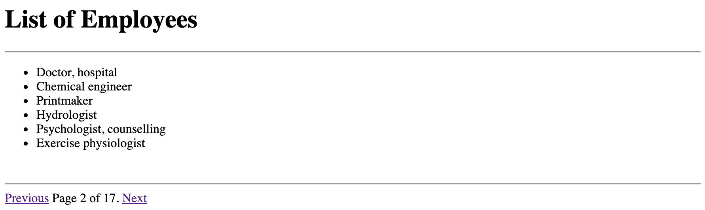
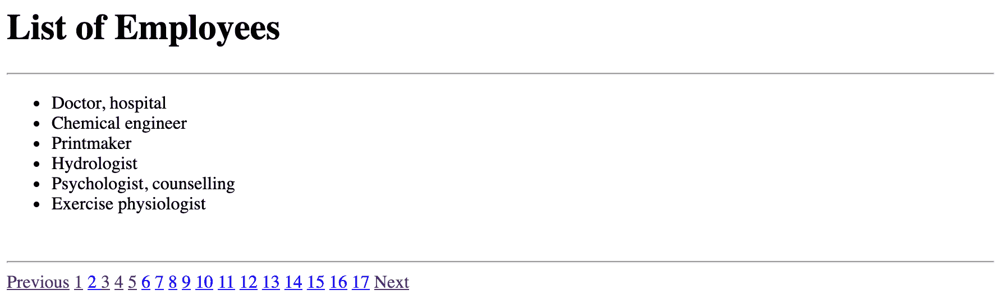
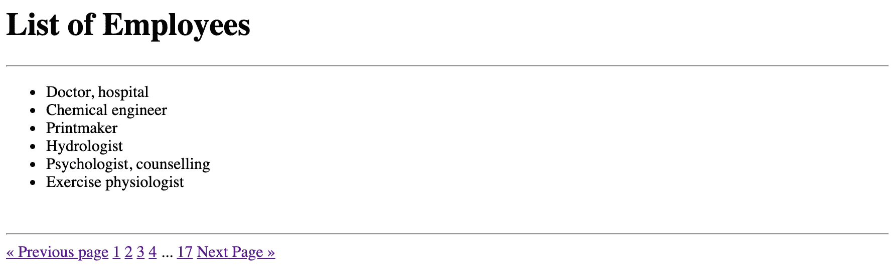

# Django 中的分页

> 原文：<https://testdriven.io/blog/django-pagination/>

分页是将大量数据分割成多个独立网页的过程。您可以定义希望每页显示的单个记录的数量，然后发送回与用户请求的页面相对应的数据，而不是将所有数据都转储给用户。

使用这种技术的优点是它改善了用户体验，尤其是当有数千条记录需要检索时。在 Django 中实现分页相当容易，因为 Django 提供了一个 [Paginator](https://docs.djangoproject.com/en/4.0/ref/paginator/#paginator-class) 类，您可以使用它将内容分组到不同的页面上。

根据开发人员的配置方式，分页可以有不同的风格。也就是说，在本文中，我们将研究如何使用三种不同的 UI 风格将分页与基于函数和基于类的视图结合起来。

> 示例项目可以在 GitHub 上的[django-pagination-example](https://github.com/testdrivenio/django-pagination-example)repo 中找到。

## 目标

完成本文后，您将能够:

1.  解释什么是分页，以及为什么你可能想使用它。
2.  使用 Django 的`Paginator`类和`Page`对象。
3.  用函数和基于类的视图在 Django 中实现分页。

## Django 建筑

在 Django 中实现分页时，您将使用以下结构，而不是重新发明分页所需的逻辑:

1.  [分页器](https://docs.djangoproject.com/en/4.0/ref/paginator/#paginator-class)——将 Django 查询集或列表分割成大块的`Page`对象。
2.  [Page](https://docs.djangoproject.com/en/4.0/ref/paginator/#page-class)——保存实际的分页数据以及分页元数据。

让我们看一些简单的例子。

### 分页器

```
`from django.contrib.auth.models import User

for num in range(43):
    User.objects.create(username=f"{num}")` 
```

这里，我们创建了 43 个用户对象。

接下来，我们将导入`Paginator`类并创建一个新实例:

```
`from django.contrib.auth.models import User
from django.core.paginator import Paginator

users = User.objects.all()

paginator = Paginator(users, 10)

print(paginator.num_pages)  # => 5` 
```

`Paginator`类有四个参数:

1.  `object_list` -任何具有`count()`或`__len__()`方法的对象，如列表、元组或查询集
2.  `per_page` -一页中包含的最大项目数
3.  `orphans`(可选)-用于防止最后一页项目很少，默认为`0`
4.  `allow_empty_first_page`(可选)——顾名思义，如果您通过将参数设置为`False`，默认为`True`，不允许首页为空，那么您可以引发一个`EmtpyPage`错误

因此，在上面的例子中，我们将用户分成十个页面(或块)。前四页将有十个用户，而最后一页将有三个用户。

`Paginator`类具有以下[属性](https://docs.djangoproject.com/en/4.0/ref/paginator/#attributes):

1.  `count` -物体总数
2.  `num_pages` -总页数
3.  `page_range` -页码范围迭代器

> 为了获得一致的分页结果，应该对查询集或模型进行排序。

如果您不希望在最后一个页面上只有三个用户，您可以像这样使用[孤儿](https://docs.djangoproject.com/en/4.0/ref/paginator/#django.core.paginator.Paginator.orphans)参数来将最后三个用户添加到前一个页面:

```
`from django.contrib.auth.models import User
from django.core.paginator import Paginator

users = User.objects.all()

paginator = Paginator(users, 10, orphans=3)

print(paginator.num_pages)  # => 4` 
```

因此，当最后一页剩余对象的数量小于或等于`orphans`的值时，这些对象将被添加到前一页。

### 页

在 Django 查询集被分解成`Page`个对象之后。然后我们可以使用`page()`方法通过传递页码来访问每个页面的数据:

```
`from django.contrib.auth.models import User
from django.core.paginator import Paginator

users = User.objects.all()

paginator = Paginator(users, 10)

page_obj = paginator.page(1)

print(page_obj)  # => <Page 1 of 5>` 
```

这里，`page_obj`给了我们一个 page 对象，表示结果的第一页。这可以在你的模板中使用。

> 注意，我们并没有真的创建一个`Page`实例。相反，我们从 Paginator 类获得了实例。

如果页面不存在会怎么样？

```
`from django.contrib.auth.models import User
from django.core.paginator import Paginator

users = User.objects.all()

paginator = Paginator(users, 10)

page_obj = paginator.page(99)` 
```

您应该看到:

```
 `raise EmptyPage(_('That page contains no results'))
django.core.paginator.EmptyPage: That page contains no results` 
```

因此，像这样捕捉一个`EmptyPage`异常是一个好主意:

```
`from django.contrib.auth.models import User
from django.core.paginator import EmptyPage, Paginator

users = User.objects.all()

paginator = Paginator(users, 10)

try:
    page_obj = paginator.page(99)
except EmptyPage:
    # Do something
    pass` 
```

您可能还想捕捉一个`PageNotAnInteger`异常。

> 有关这方面的更多信息，请查看分页器文档中的[异常](https://docs.djangoproject.com/en/4.0/ref/paginator/#exceptions)部分。

也就是说，如果您不想显式处理`EmptyPage`或`PageNotAnInteger`异常，您可以使用 [get_page()](https://docs.djangoproject.com/en/4.0/ref/paginator/#django.core.paginator.Paginator.get_page) 方法来代替`page()`:

```
`from django.contrib.auth.models import User
from django.core.paginator import Paginator

users = User.objects.all()

paginator = Paginator(users, 10)

page_obj = paginator.get_page(99)

print(page_obj)  # => <Page 5 of 5>` 
```

所以，即使数字`99`超出范围，也将返回最后一页。

同样，如果页面不是一个有效的数字，默认情况下`get_page()`将返回第一页:

```
`from django.contrib.auth.models import User
from django.core.paginator import Paginator

users = User.objects.all()

paginator = Paginator(users, 10)

page_obj = paginator.get_page('foo')

print(page_obj)  # => <Page 1 of 5>` 
```

因此，`page()`或`get_page()`这两种方法都可以根据您的喜好使用。本文中展示的例子将使用`page()`。

`Page`对象有几个[属性](https://docs.djangoproject.com/en/4.0/ref/paginator/#id2)和[方法](https://docs.djangoproject.com/en/4.0/ref/paginator/#id1)，可以在构建模板时使用:

1.  `number` -显示给定页面的页码
2.  `paginator` -显示相关的`Paginator`对象
3.  `has_next()` -如果有下一页，返回`True`
4.  `has_previous()` - -如果有上一页，返回`True`
5.  `next_page_number()` -返回下一页的页码
6.  `previous_page_number()` -返回上一页的页码

## 基于功能的视图

接下来，让我们看看如何在基于函数的视图中使用分页:

```
`from django.core.paginator import Paginator, EmptyPage, PageNotAnInteger
from django.shortcuts import render

from . models import Employee

def index(request):
    object_list = Employee.objects.all()
    page_num = request.GET.get('page', 1)

    paginator = Paginator(object_list, 6) # 6 employees per page

    try:
        page_obj = paginator.page(page_num)
    except PageNotAnInteger:
        # if page is not an integer, deliver the first page
        page_obj = paginator.page(1)
    except EmptyPage:
        # if the page is out of range, deliver the last page
        page_obj = paginator.page(paginator.num_pages)

    return render(request, 'index.html', {'page_obj': page_obj})` 
```

在此，我们:

1.  从 URL 定义了一个`page_num`变量。
2.  实例化了`Paginator`类，向其传递所需的参数、`employees` QuerySet 和每页包含的雇员数。
3.  生成了一个名为`page_obj`的页面对象，它包含分页的员工数据以及用于导航到上一页和下一页的元数据。

[https://github . com/testdrivenio/django-pagination-example/blob/main/employees/views . py](https://github.com/testdrivenio/django-pagination-example/blob/main/employees/views.py)

## 基于类的视图

在基于类的视图中实现分页的示例:

```
`from django.views.generic import ListView

from . models import Employee

class Index(ListView):
    model = Employee
    context_object_name = 'employees'
    paginate_by = 6
    template_name = 'index.html'` 
```

[https://github . com/testdrivenio/django-pagination-example/blob/main/employees/views . py](https://github.com/testdrivenio/django-pagination-example/blob/main/employees/views.py)

## 模板

在模板中使用分页开始变得有趣起来，因为有几种不同的实现。在本文中，我们将研究三种不同的实现，每一种都展示了导航到上一页和下一页的不同方式。

> 你可以在 GitHub 的[django-pagination-example](https://github.com/testdrivenio/django-pagination-example)repo 上的 [templates](https://github.com/testdrivenio/django-pagination-example/tree/main/employees/templates) 文件夹中找到每个例子的代码。

### 风味 1

这是实现分页 UI 的第一种风格。



因此，在本例中，我们有“上一页”和“下一页”链接，最终用户可以单击这些链接在页面之间移动。

*index.html*:

```
`<!doctype html>
<html lang="en">
  <head>
    <meta charset="utf-8">
    <meta name="viewport" content="width=device-width, initial-scale=1">
    <link href="https://cdn.jsdelivr.net/npm/[[email protected]](/cdn-cgi/l/email-protection)/dist/css/bootstrap.min.css">
    <title>Pagination in Django</title>
  </head>
  <body>
    <div class="container">
      <h1 class="text-center">List of Employees</h1>
      <hr>

      <ul class="list-group list-group-flush">
        
          <li class="list-group-item">{{ employee }}</li>
        
      </ul>

      <br><hr>

     
    </div>
  </body>
</html>` 
```

*pagination.html*:

```
`<div>
  <span>
    
      <a href="?page={{ page_obj.previous_page_number }}">Previous</a>
    
    <span>
      Page {{ page_obj.number }} of {{ page_obj.paginator.num_pages }}.
    </span>
    
      <a href="?page={{ page_obj.next_page_number }}">Next</a>
    
  </span>
</div>` 
```

请记住，*pagination.html*模板可以跨许多模板重用。

### 风味 2



*pagination.html*:

```
`
 <a href="?page={{ page_obj.previous_page_number }}">Previous</a>

  <a>Previous</a>



  
    <a href="#">{{ i }} </a>
  
    <a href="?page={{ i }}">{{ i }}</a>
  



  <a href="?page={{ page_obj.next_page_number }}">Next</a>

  <a>Next</a>
` 
```

这种风格在 UI 中显示所有的页码，使得导航到不同的页面更加容易。

### 风味 3



*pagination.html*:

```
`
  <a href="?page={{ page_obj.previous_page_number }}">« Previous page</a>

  
    <a href="?page=1">1</a>
    
      <span>...</span>
    
  



  
    <a href="?page={{ num }}">{{ num }}</a>
  
    <a href="?page={{ num }}">{{ num }}</a>
  



  
    <span>...</span>
    <a href="?page={{ page_obj.paginator.num_pages }}">{{ page_obj.paginator.num_pages }}</a>
  
    <a href="?page={{ page_obj.paginator.num_pages }}">{{ page_obj.paginator.num_pages }}</a>
  

  <a href="?page={{ page_obj.next_page_number }}">Next Page »</a>
` 
```

如果你有大量的页面，你可能想看看这第三种也是最后一种风格。

## 结论

关于在 Django 中实现分页的文章到此结束。以下是需要记住的要点:

1.  在 Django 中实现分页非常容易，因为有现成的`Paginator`和`Page`助手类。
2.  一旦创建了视图，您只需传回带有分页数据的 page 对象，以便在模板中使用。