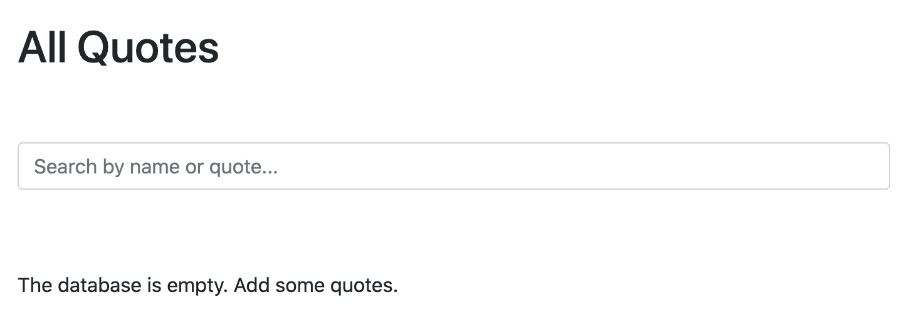
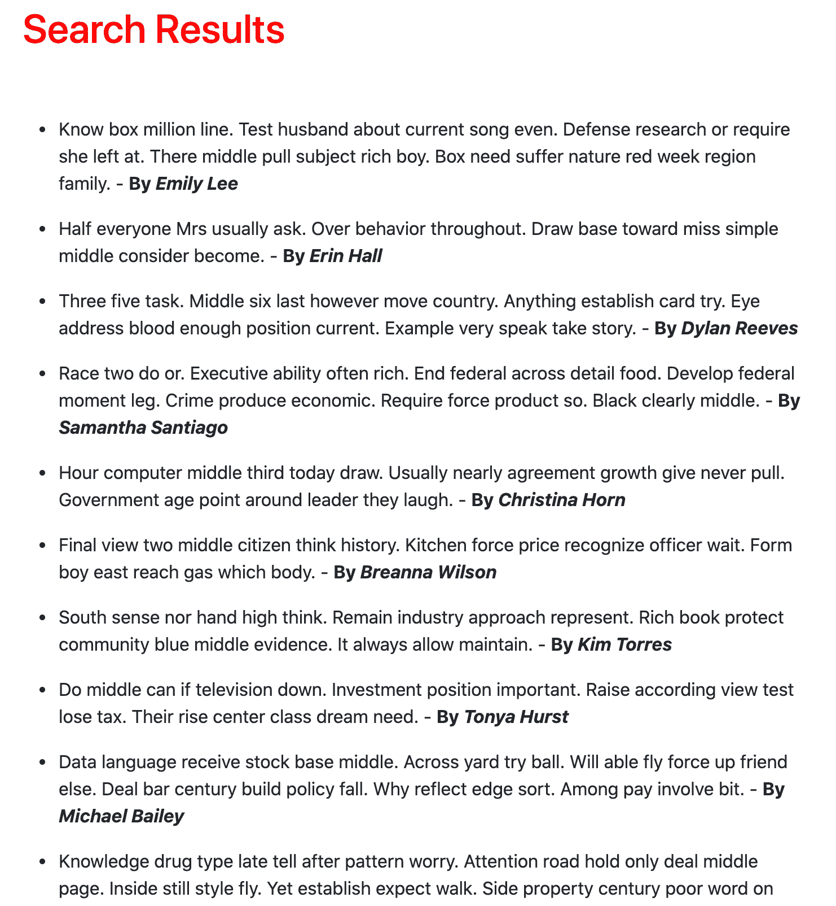
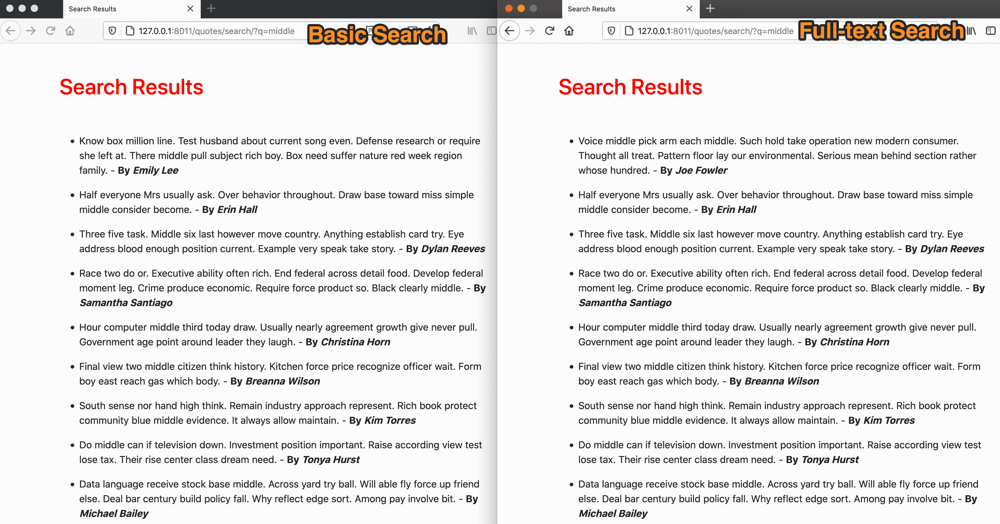

# 使用 Django 和 Postgres 进行基本和全文搜索

> 原文：<https://testdriven.io/blog/django-search/>

与关系数据库不同，全文搜索不是标准化的。有几个开源选项，如 ElasticSearch、Solr 和 Xapian。ElasticSearch 可能是最流行的解决方案；但是，设置和维护起来很复杂。此外，如果您没有利用 ElasticSearch 提供的一些高级功能，您应该坚持使用许多关系数据库(如 Postgres、MySQL、SQLite)和非关系数据库(如 MongoDB 和 CouchDB)提供的全文搜索功能。Postgres 尤其适合全文搜索。 [Django 也支持开箱即用](https://docs.djangoproject.com/en/3.2/topics/db/search/#postgresql-support)。

对于绝大多数 Django 应用程序，在寻找更强大的解决方案如 ElasticSearch 或 Solr 之前，你至少应该从利用 Postgres 的全文搜索开始。

在本教程中，您将学习如何使用 Postgres 向 Django 应用程序添加基本的全文搜索。您还将通过添加搜索向量字段和数据库索引来优化全文搜索。

> 这是一个中级教程。它假设您熟悉 Django 和 Docker。查看使用 Postgres、Gunicorn 和 Nginx 的教程[以了解更多信息。](/blog/dockerizing-django-with-postgres-gunicorn-and-nginx/)

## 目标

本教程结束时，您将能够:

1.  使用 Q 对象模块在 Django 应用程序中设置基本的搜索功能
2.  向 Django 应用程序添加全文搜索
3.  使用词干、排名和加权技术，按相关性对全文搜索结果进行排序
4.  向您的搜索结果添加预览
5.  使用搜索向量字段和数据库索引优化全文搜索

## 项目设置和概述

从 [django-search](https://github.com/testdrivenio/django-search) repo 中克隆出 [base](https://github.com/testdrivenio/django-search/tree/base) 分支；

```py
`$ git clone https://github.com/testdrivenio/django-search --branch base --single-branch
$ cd django-search` 
```

您将使用 Docker 和 Django 来简化 Postgres 的设置和运行。

从项目根目录，创建映像并启动 Docker 容器:

```py
`$ docker-compose up -d --build` 
```

接下来，应用迁移并创建超级用户:

```py
`$ docker-compose exec web python manage.py makemigrations
$ docker-compose exec web python manage.py migrate
$ docker-compose exec web python manage.py createsuperuser` 
```

完成后，导航到[http://127 . 0 . 0 . 1:8011/quotes/](http://127.0.0.1:8011/quotes/)以确保应用程序按预期工作。您应该看到以下内容:



> 想学习如何与 Django 和 Postgres 合作吗？查看关于 Django 与 Postgres、Gunicorn 和 Nginx 的文章。

注意 *quotes/models.py* 中的`Quote`型号:

```py
`from django.db import models

class Quote(models.Model):
    name = models.CharField(max_length=250)
    quote = models.TextField(max_length=1000)

    def __str__(self):
        return self.quote` 
```

接下来，运行以下管理命令，将 10，000 个报价添加到数据库中:

```py
`$ docker-compose exec web python manage.py add_quotes` 
```

这将需要几分钟时间。完成后，导航到[http://127 . 0 . 0 . 1:8011/quotes/](http://127.0.0.1:8011/quotes/)查看数据。

> 视图的输出被缓存了五分钟，所以您可能想要注释掉 *quotes/views.py* 中的`@method_decorator`来加载报价。确保完成后删除评论。


在*quotes/templates/quote . html*文件中，您有一个带有搜索输入字段的基本表单:

```py
`<form action="" method="get">
  <input
    type="search"
    name="q"
    placeholder="Search by name or quote..."
    class="form-control"
  />
</form>` 
```

提交时，表单将数据发送到后端。使用了一个`GET`请求而不是一个`POST`请求，这样我们就可以在 URL 和 Django 视图中访问查询字符串，允许用户以链接的形式共享搜索结果。

> 在继续之前，快速浏览一下项目结构和代码的其余部分。

## 基本搜索

当使用 Django 进行搜索时，您通常会通过使用`contains`或`icontains`执行搜索查询来进行精确匹配。 [Q 对象](https://docs.djangoproject.com/en/3.2/topics/db/queries/#complex-lookups-with-q-objects)也可以用来添加 AND ( `&`)或 OR ( `|`)逻辑运算符。

例如，使用 or 操作符，在*报价/视图. py* 中覆盖`SearchResultsList`的默认`QuerySet`，如下所示:

```py
`class SearchResultsList(ListView):
    model = Quote
    context_object_name = "quotes"
    template_name = "search.html"

    def get_queryset(self):
        query = self.request.GET.get("q")
        return Quote.objects.filter(
            Q(name__icontains=query) | Q(quote__icontains=query)
        )` 
```

这里，我们使用了[过滤器](https://docs.djangoproject.com/en/3.2/topics/db/queries/#retrieving-specific-objects-with-filters)方法来过滤`name`或`quote`字段。此外，我们还使用了 [icontains](https://docs.djangoproject.com/en/3.2/ref/models/querysets/#icontains) 扩展来检查查询是否出现在`name`或`quote`字段中(不区分大小写)。如果找到匹配，将返回肯定的结果。

不要忘记重要的一点:

```py
`from django.db.models import Q` 
```

尝试一下:



对于小型数据集，这是向应用程序添加基本搜索功能的好方法。如果您正在处理一个大型数据集，或者想要一个类似于互联网搜索引擎的搜索功能，那么您将需要使用全文搜索。

## 全文搜索

我们前面看到的基本搜索有几个限制，尤其是当您想要执行复杂的查找时。

如上所述，使用基本搜索，您只能执行精确匹配。

另一个限制是**停止字**的限制。[停用词](https://www.postgresql.org/docs/current/textsearch-dictionaries.html#TEXTSEARCH-STOPWORDS)是诸如“一个”、“一个”、“该”之类的词。这些词很常见，没有足够的意义，因此应该忽略。要进行测试，请尝试搜索前面带有“the”的单词。假设你搜索了“中间”。在这种情况下，您将只看到“中间”的结果，因此您不会看到任何包含单词“中间”而前面没有“the”的结果。

比方说你有这两句话:

1.  我在中间。
2.  你不喜欢中学。

每种类型的搜索都会返回以下内容:

| 询问 | 基本搜索 | 全文搜索 |
| --- | --- | --- |
| “中间” | 1 | 1 和 2 |
| “中间” | 1 和 2 | 1 和 2 |

另一个问题是忽略相似的单词。使用基本搜索，只返回完全匹配的内容。但是，使用全文搜索时，会考虑相似的单词。要测试，试着找一些类似“pony”和“ponies”的词。使用基本搜索，如果你搜索“小马”，你不会看到包含“小马”的结果，反之亦然。

说你有这两句话。

1.  我是一匹小马。
2.  你不喜欢小马

每种类型的搜索都会返回以下内容:

| 询问 | 基本搜索 | 全文搜索 |
| --- | --- | --- |
| “小马” | 1 | 1 和 2 |
| “小马” | 2 | 1 和 2 |

有了全文搜索，这两个问题都得到了缓解。但是，请记住，根据您的目标，全文搜索实际上可能会降低**精度**(质量)和**召回**(相关结果的数量)。通常，全文搜索不如基本搜索精确，因为基本搜索产生完全匹配。也就是说，如果您要搜索包含大量文本的大型数据集，那么全文搜索是首选，因为它通常要快得多。

[全文搜索](https://en.wikipedia.org/wiki/Full-text_search)是一种高级搜索技术，它会在尝试匹配搜索标准时检查每个存储文档中的所有单词。此外，使用全文搜索，您可以对被索引的单词使用特定语言的[词干](https://en.wikipedia.org/wiki/Stemming)。例如，单词“驱动”、“被驱动”和“被驱动”将被记录在单个概念单词“驱动”下。词干化是将单词缩减为词干、词根或词根形式的过程。

可以说全文搜索并不完美。很可能检索到许多与预期搜索查询不相关(误报)的文档。然而，有一些基于贝叶斯算法的技术可以帮助减少这样的问题。

要利用 Django 的 Postgres 全文搜索，请将`django.contrib.postgres`添加到您的`INSTALLED_APPS`列表中:

```py
`INSTALLED_APPS = [
    ...

    "django.contrib.postgres",  # new
]` 
```

接下来，我们来看两个快速的全文搜索示例，分别针对单个字段和多个字段。

### 单一字段搜索

像这样更新`SearchResultsList`视图功能下的`get_queryset`功能:

```py
`class SearchResultsList(ListView):
    model = Quote
    context_object_name = "quotes"
    template_name = "search.html"

    def get_queryset(self):
        query = self.request.GET.get("q")
        return Quote.objects.filter(quote__search=query)` 
```

这里，我们针对单个字段 quote 字段设置了全文搜索。


如你所见，它考虑了相似的单词。在上面的例子中，“ponies”和“pony”被视为相似的词。

### 多字段搜索

要搜索多个字段和相关模型，可以使用`SearchVector`类。

再次更新`SearchResultsList`:

```py
`class SearchResultsList(ListView):
    model = Quote
    context_object_name = "quotes"
    template_name = "search.html"

    def get_queryset(self):
        query = self.request.GET.get("q")
        return Quote.objects.annotate(search=SearchVector("name", "quote")).filter(
            search=query
        )` 
```

为了搜索多个字段，您可以使用`SearchVector`对查询集进行[注释](https://docs.djangoproject.com/en/3.2/topics/db/aggregation/)。vector 是您正在搜索的数据，它已经被转换成易于搜索的形式。在上面的例子中，这些数据是数据库中的`name`和`quote`字段。

确保添加导入:

```py
`from django.contrib.postgres.search import SearchVector` 
```

尝试一些搜索。

## 词干和排序

在这一节中，您将结合几种方法，如 [SearchVector](https://docs.djangoproject.com/en/3.1/ref/contrib/postgres/search/#searchvector) 、 [SearchQuery](https://docs.djangoproject.com/en/3.1/ref/contrib/postgres/search/#searchquery) 和 [SearchRank](https://docs.djangoproject.com/en/3.1/ref/contrib/postgres/search/#searchrank) 来生成一个非常健壮的搜索，它使用词干和排名。

同样，词干化是将单词缩减为词干、词根或词根形式的过程。使用词干，像“child”和“children”这样的单词将被视为相似的单词。另一方面，排名允许我们根据相关性对结果进行排序。

更新`SearchResultsList`:

```py
`class SearchResultsList(ListView):
    model = Quote
    context_object_name = "quotes"
    template_name = "search.html"

    def get_queryset(self):
        query = self.request.GET.get("q")
        search_vector = SearchVector("name", "quote")
        search_query = SearchQuery(query)
        return (
            Quote.objects.annotate(
                search=search_vector, rank=SearchRank(search_vector, search_query)
            )
            .filter(search=search_query)
            .order_by("-rank")
        )` 
```

这里发生了什么事？

1.  `SearchVector` -再次使用搜索向量搜索多个字段。数据被转换成另一种形式，因为您不再像使用`icontains`时那样只是搜索原始文本。因此，有了这个，你将能够很容易地搜索复数。例如，搜索“flask”和“flask”会得到相同的搜索结果，因为它们基本上是*相同的东西。*
2.  `SearchQuery` -翻译表单中作为查询提供给我们的单词，通过词干算法传递它们，然后寻找所有结果词的匹配。
3.  `SearchRank` -允许我们根据相关性对结果进行排序。它考虑了查询术语在文档中出现的频率、术语与文档的接近程度以及它们在文档中出现的位置有多重要。

添加导入:

```py
`from django.contrib.postgres.search import SearchVector, SearchQuery, SearchRank` 
```



将基本搜索的结果与全文搜索的结果进行比较。有明显的区别。在全文搜索中，最先显示结果最多的查询。这就是`SearchRank`的力量。组合`SearchVector`、`SearchQuery`和`SearchRank`是一种比基本搜索更强大、更精确的快速搜索方式。

## 添加重量

全文搜索使我们能够为数据库中的某些字段添加比其他字段更重要的内容。我们可以通过给查询增加权重来实现这一点。

[权重](https://docs.djangoproject.com/en/3.2/ref/contrib/postgres/search/#postgresql-fts-weighting-queries)应该是以下字母 D、C、B、a 中的一个，默认情况下，这些权重分别指的是数字 0.1、0.2、0.4、1.0。

更新`SearchResultsList`:

```py
`class SearchResultsList(ListView):
    model = Quote
    context_object_name = "quotes"
    template_name = "search.html"

    def get_queryset(self):
        query = self.request.GET.get("q")
        search_vector = SearchVector("name", weight="B") + SearchVector(
            "quote", weight="A"
        )
        search_query = SearchQuery(query)
        return (
            Quote.objects.annotate(rank=SearchRank(search_vector, search_query))
            .filter(rank__gte=0.3)
            .order_by("-rank")
        )` 
```

这里，您使用`name`和`quote`字段向`SearchVector`添加了权重。权重 0.4 和 1.0 分别应用于名称和报价字段。因此，引用匹配将优先于名称内容匹配。最后，过滤结果，只显示大于 0.3 的结果。

## 向搜索结果添加预览

在本节中，您将通过 [SearchHeadline](https://docs.djangoproject.com/en/3.2/ref/contrib/postgres/search/#searchheadline) 方法添加一点搜索结果的预览。这将突出显示搜索结果查询。

再次更新`SearchResultsList`:

```py
`class SearchResultsList(ListView):
    model = Quote
    context_object_name = "quotes"
    template_name = "search.html"

    def get_queryset(self):
        query = self.request.GET.get("q")
        search_vector = SearchVector("name", "quote")
        search_query = SearchQuery(query)
        search_headline = SearchHeadline("quote", search_query)
        return Quote.objects.annotate(
            search=search_vector,
            rank=SearchRank(search_vector, search_query)
        ).annotate(headline=search_headline).filter(search=search_query).order_by("-rank")` 
```

`SearchHeadline`接收您想要预览的字段。在这种情况下，这将是查询的`quote`字段，以粗体显示。

确保添加导入:

```py
`from django.contrib.postgres.search import SearchVector, SearchQuery, SearchRank, SearchHeadline` 
```

在尝试一些搜索之前，更新*quotes/templates/search . html*中的`<li></li>`，如下所示:

```py
`<li>{{ quote.headline | safe }} - <b>By <i>{{ quote.name }}</i></b></li>` 
```

现在，不再像以前那样显示报价，而是只显示完整报价字段的预览以及突出显示的搜索查询。

## 提升性能

全文搜索是一个密集的过程。要解决性能低下的问题，您可以:

1.  用 [SearchVectorField](https://docs.djangoproject.com/en/3.2/ref/contrib/postgres/search/#searchvectorfield) 将搜索向量保存到数据库中。换句话说，我们将创建一个单独的数据库字段，包含已处理的搜索向量，并在任何时候对`quote`或`name`字段进行插入或更新时更新该字段，而不是动态地将字符串转换为搜索向量。
2.  创建一个[数据库索引](https://en.wikipedia.org/wiki/Database_index)，这是一个提高数据库数据检索过程速度的数据结构。因此，它加快了查询速度。Postgres 给了你几个[索引](https://docs.djangoproject.com/en/3.2/ref/contrib/postgres/indexes/)，可能适用于不同的情况。可以说，[基尼指数](https://docs.djangoproject.com/en/3.2/ref/contrib/postgres/indexes/#ginindex)是最受欢迎的。

> 要了解关于全文搜索性能的更多信息，请查看 Django 文档中的[性能](https://docs.djangoproject.com/en/3.2/ref/contrib/postgres/search/#performance)一节。

### 搜索矢量场

首先向 *quotes/models.py* 中的`Quote`模型添加一个新的 [SearchVectorField](https://docs.djangoproject.com/en/3.2/ref/contrib/postgres/search/#searchvectorfield) 字段:

```py
`from django.contrib.postgres.search import SearchVectorField  # new
from django.db import models

class Quote(models.Model):
    name = models.CharField(max_length=250)
    quote = models.TextField(max_length=1000)
    search_vector = SearchVectorField(null=True)  # new

    def __str__(self):
        return self.quote` 
```

创建迁移文件:

```py
`$ docker-compose exec web python manage.py makemigrations` 
```

现在，只有当数据库中已经存在`quote`或`name`对象时，才能填充该字段。因此，每当`quote`或`name`字段被更新时，我们需要添加一个触发器来更新`search_vector`字段。为此，在“报价/迁移”中创建一个名为*0003 _ search _ vector _ trigger . py*的定制迁移文件:

```py
`from django.contrib.postgres.search import SearchVector
from django.db import migrations

def compute_search_vector(apps, schema_editor):
    Quote = apps.get_model("quotes", "Quote")
    Quote.objects.update(search_vector=SearchVector("name", "quote"))

class Migration(migrations.Migration):

    dependencies = [
        ("quotes", "0002_quote_search_vector"),
    ]

    operations = [
        migrations.RunSQL(
            sql="""
 CREATE TRIGGER search_vector_trigger
 BEFORE INSERT OR UPDATE OF name, quote, search_vector
 ON quotes_quote
 FOR EACH ROW EXECUTE PROCEDURE
 tsvector_update_trigger(
 search_vector, 'pg_catalog.english', name, quote
 );
 UPDATE quotes_quote SET search_vector = NULL;
 """,
            reverse_sql="""
 DROP TRIGGER IF EXISTS search_vector_trigger
 ON quotes_quote;
 """,
        ),
        migrations.RunPython(
            compute_search_vector, reverse_code=migrations.RunPython.noop
        ),
    ]` 
```

> 根据您的项目结构，您可能需要更新`dependencies`中先前迁移文件的名称。

应用迁移:

```py
`$ docker-compose exec web python manage.py migrate` 
```

要使用新字段进行搜索，请像这样更新`SearchResultsList`:

```py
`class SearchResultsList(ListView):
    model = Quote
    context_object_name = "quotes"
    template_name = "search.html"

    def get_queryset(self):
        query = self.request.GET.get("q")
        return Quote.objects.filter(search_vector=query)` 
```

再次更新*quotes/templates/search . html*中的`<li></li>`:

```py
`<li>{{ quote.quote | safe }} - <b>By <i>{{ quote.name }}</i></b></li>` 
```

### 索引

最后，我们来设置一个函数索引， [GinIndex](https://docs.djangoproject.com/en/3.2/ref/contrib/postgres/indexes/#ginindex) 。

更新`Quote`型号:

```py
`from django.contrib.postgres.indexes import GinIndex  # new
from django.contrib.postgres.search import SearchVectorField
from django.db import models

class Quote(models.Model):
    name = models.CharField(max_length=250)
    quote = models.TextField(max_length=1000)
    search_vector = SearchVectorField(null=True)

    def __str__(self):
        return self.quote

    # new
    class Meta:
        indexes = [
            GinIndex(fields=["search_vector"]),
        ]` 
```

最后一次创建和应用迁移:

```py
`$ docker-compose exec web python manage.py makemigrations
$ docker-compose exec web python manage.py migrate` 
```

测试一下。

## 结论

在本教程中，指导您向 Django 应用程序添加基本的全文搜索。我们还研究了如何通过添加搜索向量字段和数据库索引来优化全文搜索功能。

从 [django-search](https://github.com/testdrivenio/django-search) repo 中获取完整代码。