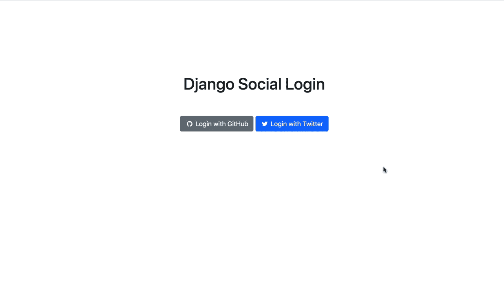
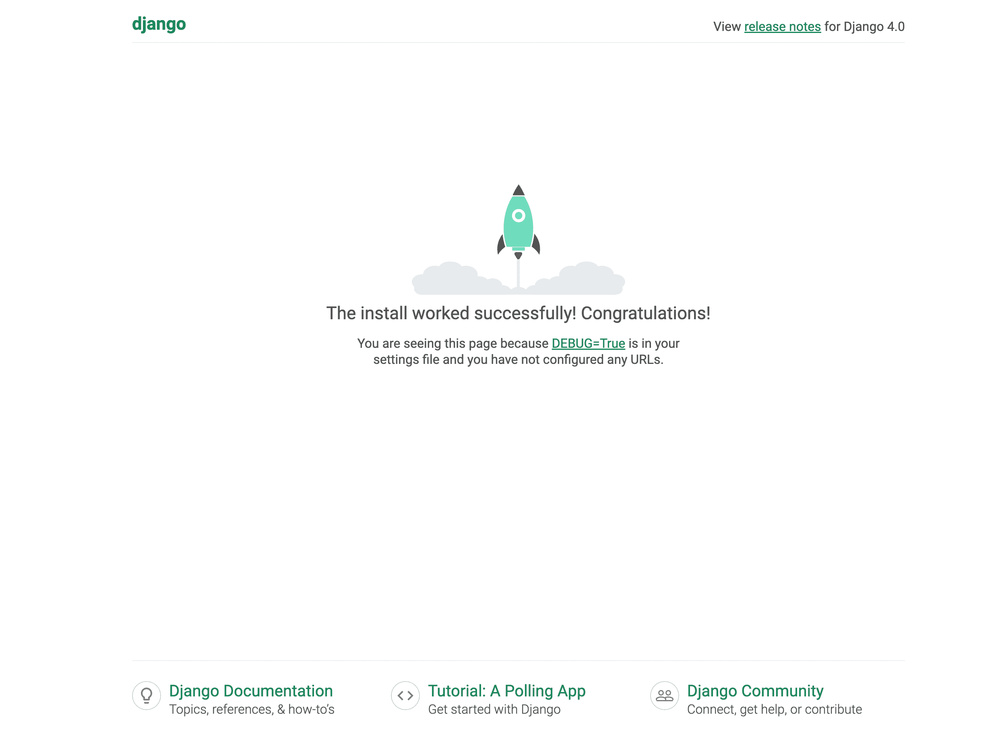
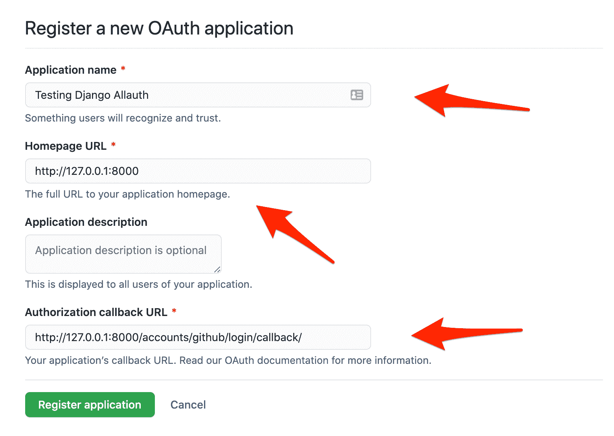
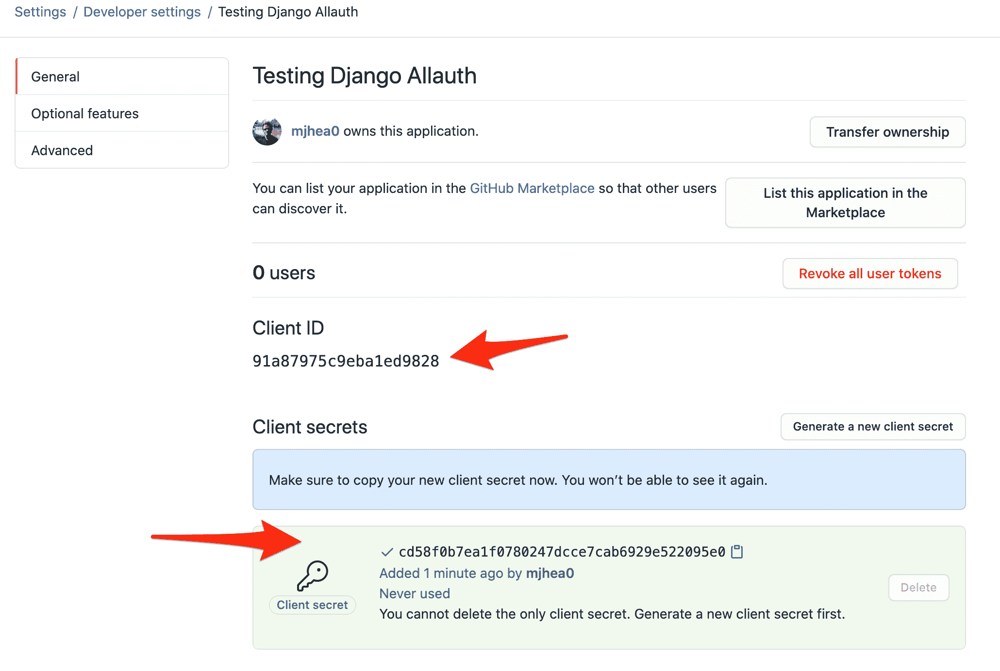
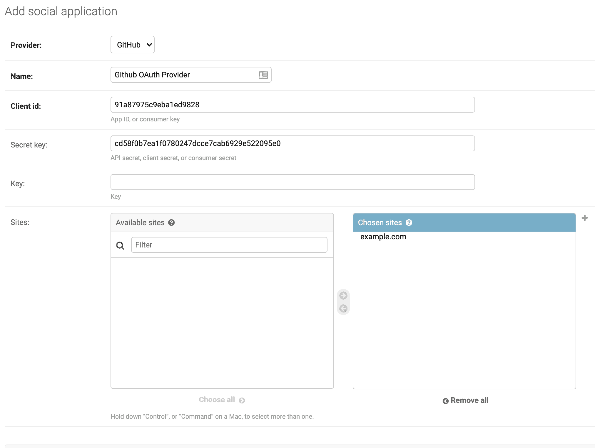
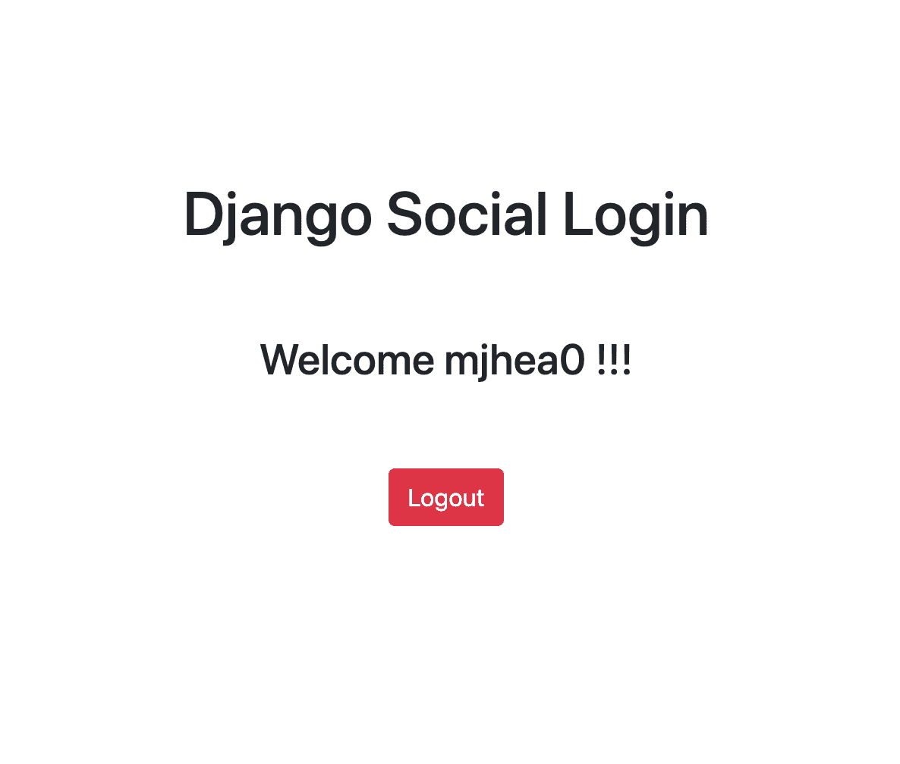
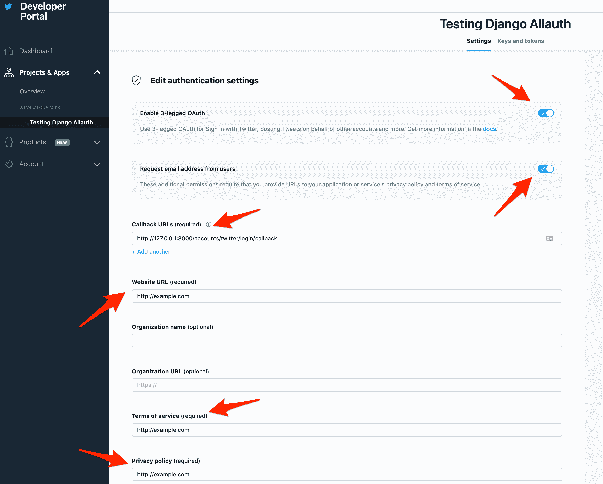
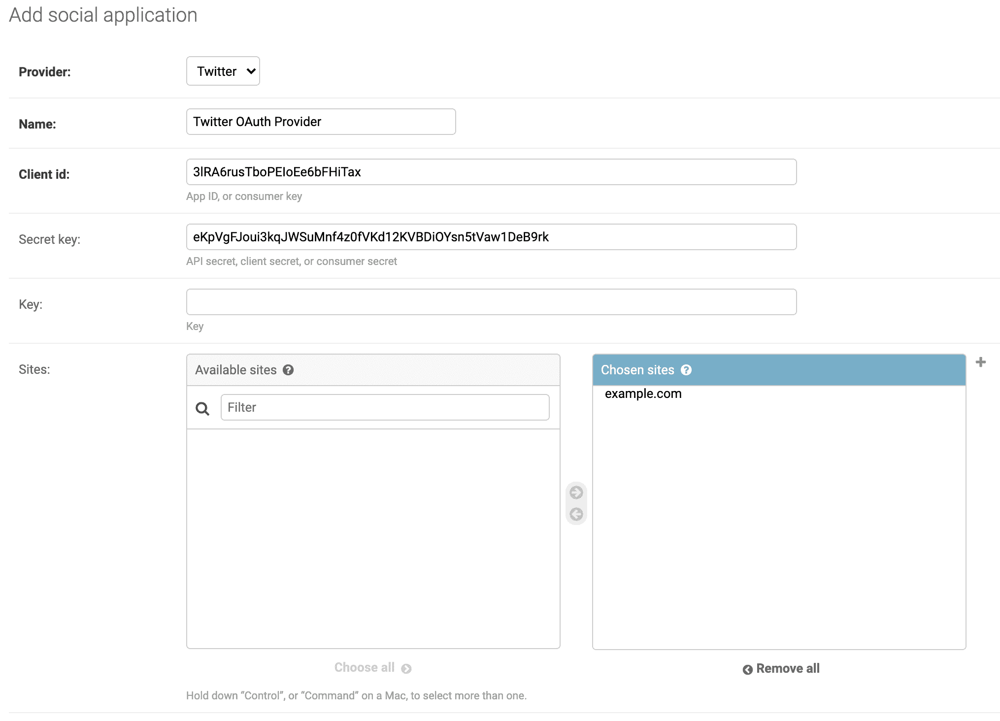

# 向 Django 添加社会认证

> 原文：<https://testdriven.io/blog/django-social-auth/>

本教程着眼于如何使用 [Django Allauth](https://github.com/pennersr/django-allauth) 向 Django 应用程序添加社交认证(也称为社交登录或社交登录)。您还将配置 GitHub 和 Twitter 认证，以及带有用户名和密码的常规认证。

> 社交登录是一种单点登录形式，使用脸书、推特或谷歌等社交网络服务的现有信息登录第三方网站，而不是专门为该网站创建新的登录帐户。它旨在简化最终用户的登录，并为 web 开发人员提供更可靠的人口统计信息。
> - [维基百科](https://en.wikipedia.org/wiki/Social_login)

使用社交认证有其优势。您不需要为您的 web 应用程序设置 auth，因为它是由第三方 [OAuth 提供者](https://en.wikipedia.org/wiki/List_of_OAuth_providers)处理的。此外，由于像谷歌、脸书和 GitHub 这样的提供商执行广泛的检查来防止对其服务的未经授权的访问，利用社交认证而不是滚动您自己的认证机制可以提高您的应用程序的安全性。



## OAuth

社交认证通常是通过 OAuth 来实现的，OAuth 是一种开放的标准认证协议，由第三方认证提供商来验证用户的身份。

典型流程:

1.  用户试图使用第三方身份验证提供商的帐户登录您的应用程序
2.  它们被重定向到身份验证提供者进行验证
3.  验证后，它们会被重定向回你的应用程序
4.  然后他们登录，这样他们就可以访问受保护的资源

> 有关 OAuth 的更多信息，请查看[OAuth 2 的介绍](https://www.digitalocean.com/community/tutorials/an-introduction-to-oauth-2)。

为什么要利用 OAuth 而不是滚动自己的 Auth 呢？

**优点**:

1.  提高安全性。
2.  由于无需创建和记住用户名或密码，登录流程更加简单快捷。
3.  在安全漏洞的情况下，不会发生第三方损害，因为认证是无密码的。

**缺点**:

1.  您的应用程序现在依赖于您控制之外的另一个应用程序。如果提供商关闭，用户将无法登录。
2.  人们往往会忽略 OAuth 提供者请求的权限。
3.  在您配置的提供商中没有帐户的用户将无法访问您的应用程序。最好的方法是同时实现用户名、密码和社交认证，让用户自己选择。

## django Allauth vs . Python Social Auth

Django Allauth 和 [Python Social Auth](https://python-social-auth.readthedocs.io/en/latest/) 是在 Django 中实现社会认证的两个最流行的包。你应该用哪一个？

### 姜戈·阿劳斯

**优点**:

1.  Django Allauth 是最受欢迎的 Django 包之一。
2.  它支持 50 多个身份验证提供商(例如 GitHub、Twitter、Google)。
3.  除了社交认证，它还提供常规的用户名和密码认证。
4.  Django Allauth 使得定制授权流程中使用的表单变得很容易。

**缺点**:

1.  尽管这个包很受欢迎，但是文档结构很差，不适合初学者。
2.  注册 OAuth 提供者需要相当多的初始设置，这对初学者来说可能很困难。
3.  GitHub 上有 310 多个问题(截至发稿时)。

### Python 社交认证

**优点**:

1.  Python Social Auth 提供了对几个 Python web 框架的支持，如 Django、Flask、Webpy、Pyramid 和 Tornado。
2.  它支持近 50 个 OAuth 提供者。
3.  它支持 Django ORM 和 [MongoEngine](http://mongoengine.org/) ODM。
4.  它提供了一个存储接口，允许用户添加更多的 ORM。

    > 例如，要了解如何使用存储接口来处理 SQLAlchemy ORM，请在这里查看代码。查看[官方文档](https://python-social-auth.readthedocs.io/en/latest/storage.html#storage-interface)，了解更多关于如何使用存储接口的信息。

**缺点**:

1.  文档稍微简单一点，但是仍然需要做一些与组织相关的工作。
2.  同样，注册 OAuth 提供者需要相当多的初始设置，这对初学者来说可能很困难。
3.  GitHub 上有将近 125 个未解决的问题(截至发稿时)。

这两种包装都有其起伏。然而，本教程主要关注 Django Allauth，因为它更受欢迎，并且支持通过用户名和密码进行社交认证和常规认证。

## Django Setup

让我们创建一个新的 Django 项目并配置 Django Allauth。

### 创建新的 Django 项目

首先创建一个虚拟环境并安装 Django:

```
`$ mkdir django-social-auth && cd django-social-auth
$ python3.11 -m venv .venv
$ source .venv/bin/activate
(.venv)$ pip install Django==4.1.3` 
```

> 随意把 venv 和 Pip 换成[诗歌](https://python-poetry.org)或 [Pipenv](https://github.com/pypa/pipenv) 。更多信息，请查看[现代 Python 环境](/blog/python-environments/)。

现在创建一个新项目，应用迁移，并运行服务器:

```
`(.venv)$ django-admin startproject social_app .
(.venv)$ python manage.py migrate
(.venv)$ python manage.py runserver` 
```

导航到 [http://127.0.0.1:8000](http://127.0.0.1:8000) 。您应该会看到以下屏幕:



### Configure Django Allauth

接下来，让我们为 Django 应用程序设置 Django Allauth。

```
`(.venv)$ pip install django-allauth==0.51.0` 
```

为了让 Django Allauth 使用我们的 Django 应用程序，更新 *settings.py* 文件中的`INSTALLED_APPS`,如下所示:

```
`# social_app/settings.py

INSTALLED_APPS = [
    "django.contrib.admin",
    "django.contrib.auth",
    "django.contrib.contenttypes",
    "django.contrib.sessions",
    "django.contrib.messages",
    "django.contrib.staticfiles",
    "django.contrib.sites",  # new
    # 3rd party
    "allauth", # new
    "allauth.account", # new
    "allauth.socialaccount", # new
    # social providers
    "allauth.socialaccount.providers.github", # new
    "allauth.socialaccount.providers.twitter", # new
]` 
```

首先，我们添加了 [Django“站点”框架](https://docs.djangoproject.com/en/4.1/ref/contrib/sites/)，这是 Allauth 正常工作所必需的。然后我们添加了核心的 Allauth 应用程序:`allauth`、`allauth.account`和`allauth.socialaccount`。

现在将以下内容添加到 *settings.py* 的底部:

```
`# social_app/settings.py

AUTHENTICATION_BACKENDS = (
    "allauth.account.auth_backends.AuthenticationBackend",
)

SITE_ID = 1
ACCOUNT_EMAIL_VERIFICATION = "none"
LOGIN_REDIRECT_URL = "home"
ACCOUNT_LOGOUT_ON_GET = True` 
```

这里，我们定义了以下内容:

*   我们添加了`allauth`作为认证后端。所有登录和退出(通过 OAuth 或常规用户名和密码)现在将由 Allauth 处理。
*   `SITE_ID`，Django Allauth 需要它才能运行。
*   `ACCOUNT_EMAIL_VERIFICATION = "none"`关闭验证邮件。Django 自动建立了一个电子邮件验证工作流程。我们现在不需要这个功能。
*   成功登录后，将用户重定向到主页。
*   `ACCOUNT_LOGOUT_ON_GET = True`当通过 GET 请求点击注销按钮时，直接将用户注销。这跳过了[确认注销页面](https://django-allauth.readthedocs.io/en/latest/views.html#logout-account-logout)。

更新 *urls.py* 以包含 Django Allauth:

```
`from django.contrib import admin
from django.urls import path, include # new

urlpatterns = [
    path("admin/", admin.site.urls),
    path("accounts/", include("allauth.urls")), # new
]` 
```

应用与 Django Allauth 相关的迁移文件:

```
`(.venv)$ python manage.py migrate` 
```

> 迁移在这里很重要，因为 Allauth 需要大量新表。别忘了这一步！

创建超级用户:

```
`(.venv)$ python manage.py createsuperuser` 
```

### 模板

新建一个名为“templates”的文件夹，添加两个名为 *_base.html* 和【home.html】T2 的文件:

```
`(.venv)$ mkdir templates && cd templates
(.venv)$ touch _base.html home.html` 
```

更新 *settings.py* 中的`TEMPLATES`，以便 Django 知道在哪里可以找到模板:

```
`# social_app/settings.py

TEMPLATES = [
    {
        ...
        "DIRS": [str(BASE_DIR.joinpath("templates"))],
        ...
    },
]` 
```

*templates/_base.html* :

```
`<!DOCTYPE html>
<html lang="en">
  <head>
    <meta charset="UTF-8" />
    <link
      href="https://cdn.jsdelivr.net/npm/[[email protected]](/cdn-cgi/l/email-protection)/dist/css/bootstrap.min.css"
      rel="stylesheet"
    />
    <link
      rel="stylesheet"
      href="https://stackpath.bootstrapcdn.com/font-awesome/4.7.0/css/font-awesome.min.css"
    />
    <meta name="viewport" content="width=device-width, initial-scale=1.0" />
    <title>Django Social Login</title>
  </head>
  <body>
     
  </body>
</html>` 
```

*templates/home.html*

```
` 



<div class="container" style="text-align: center; padding-top: 10%;">
  <h1>Django Social Login</h1>

  <br /><br />

  
    <h3>Welcome {{ user.username }} !!!</h3>
    <br /><br />
    <a href="" class="btn btn-danger">Logout</a>
  
</div>

` 
```

创建一个视图来提供*home.html*模板:

```
`# social_app/views.py

from django.views.generic import TemplateView

class Home(TemplateView):
    template_name = "home.html"` 
```

添加新的 URL:

```
`# social_app/urls.py

from django.contrib import admin
from django.urls import path, include

from .views import Home # new

urlpatterns = [
    path("admin/", admin.site.urls),
    path("accounts/", include("allauth.urls")),
    path("", Home.as_view(), name="home"), # new
]` 
```

就是这样！Django Allauth 已配置好，可以测试了。现在，您应该能够通过用户名和密码登录。运行服务器。导航到[http://127 . 0 . 0 . 1:8000/accounts/log in/](http://127.0.0.1:8000/accounts/login/)。确保您可以使用超级用户凭据登录。

> 您可能想要覆盖默认模板来应用 CSS 样式等等。查看官方文档中的[模板](https://django-allauth.readthedocs.io/en/latest/templates.html)页面了解更多信息。

## GitHub 提供商

现在 Django 和 Django Allauth 都准备好了，让我们连接我们的第一个社会认证提供者:GitHub。

### 应用

首先，我们需要创建一个 OAuth 应用程序，并从 GitHub 获取 OAuth 密钥。登录你的 GitHub 账户，然后导航到[https://github.com/settings/applications/new](https://github.com/settings/applications/new)创建一个新的 [OAuth 应用](https://docs.github.com/en/free-pro-team@latest/developers/apps/authorizing-oauth-apps):

```
`Application name: Testing Django Allauth
Homepage URL: http://127.0.0.1:8000
Callback URL: http://127.0.0.1:8000/accounts/github/login/callback` 
```



点击“注册申请”。你将被重定向至你的应用。记下客户端 ID 和客户端密码:



> 如果没有生成客户端密码，请点按“生成新的客户端密码”。

接下来，我们需要在 Django 管理面板中添加 GitHub 提供者。

运行服务器:

```
`(.venv)$ python manage.py runserver` 
```

在[http://127 . 0 . 0 . 1:8000/admin](http://127.0.0.1:8000/admin)登录管理员。然后，在“社交应用”下，点击“添加社交应用”:

*   选择 GitHub 作为提供商
*   添加姓名
*   将先前获得的客户端 ID 和客户端秘密添加到秘密密钥中
*   将 example.com 添加为所选地点之一



我们已经成功地将 GitHub 整合为一个社交认证提供商。现在，让我们更新一下 *templates/home.html* 模板来测试一下:

```
` 



<div class="container" style="text-align: center; padding-top: 10%;">
  <h1>Django Social Login</h1>

  <br /><br />

  
    <h3>Welcome {{ user.username }} !!!</h3>
    <br /><br />
    <a href="" class="btn btn-danger">Logout</a>
  
    <!-- GitHub button starts here -->
    <a href="" class="btn btn-secondary">
      <i class="fa fa-github fa-fw"></i>
      <span>Login with GitHub</span>
    </a>
    <!-- GitHub button ends here -->
  
</div>

` 
```

运行应用程序。你现在应该可以通过 GitHub 登录了。



登录后，您应该会在[http://127 . 0 . 0 . 1:8000/admin/auth/user/](http://127.0.0.1:8000/admin/auth/user/)看到用户，以及在[http://127 . 0 . 0 . 1:8000/admin/socialaccount/socialaccount/](http://127.0.0.1:8000/admin/socialaccount/socialaccount/)看到关联的社交账户。如果你查看社交账户，你会看到与 GitHub 账户相关的所有公开数据。这些数据(称为[范围](https://oauth.net/2/scope/))可以用于你在 Django 上的用户资料。为此，建议使用定制的[用户模型](https://docs.djangoproject.com/en/4.1/ref/contrib/auth/#user-model)。更多信息，请查看[在 Django](/blog/django-custom-user-model/) 中创建定制用户模型。

> 您是否需要对 Allauth 默认范围之外的用户信息进行读写访问？从官方文件中查看[变更提供商范围](https://django-allauth.readthedocs.io/en/latest/advanced.html#changing-provider-scopes)。

设置 Twitter 提供者类似于 GitHub:

1.  在 Twitter 上创建 OAuth 应用程序
2.  在 Django admin 中注册提供者
3.  更新*home.html*模板

从[申请一个 Twitter 开发者账户](https://developer.twitter.com/en/portal/dashboard)开始。创建完成后，导航至[项目和应用](https://developer.twitter.com/en/portal/projects-and-apps)，点击“创建应用”。

为应用程序命名，并记下 API 密钥和 API 密钥。然后，在“认证设置”下，打开“启用 3 脚 OAuth”和“向用户请求电子邮件地址”。添加回拨、网站、服务条款和隐私政策 URL:

```
`Callback URL: http://127.0.0.1:8000/accounts/twitter/login/callback
Website URL: http://example.com
Terms of service: http://example.com
Privacy policy: http://example.com` 
```



让我们在 Django 管理中添加提供者。

运行服务器:

```
`(.venv)$ python manage.py runserver` 
```

在[http://127 . 0 . 0 . 1:8000/admin](http://127.0.0.1:8000/admin)登录管理员。然后，在“社交应用”下，点击“添加社交应用”:

*   选择 Twitter 作为提供商
*   添加姓名
*   将先前获得的 API 密钥(添加到客户端 id)和 API 秘密密钥(添加到秘密密钥)
*   将 example.com 添加为所选地点之一



> 记住保护您的 API 密钥和令牌。

最后，在 *templates/home.html* 中添加一个“用 Twitter 登录”按钮:

```
` 



<div class="container" style="text-align: center; padding-top: 10%;">
  <h1>Django Social Login</h1>

  <br /><br />

  
    <h3>Welcome {{ user.username }} !!!</h3>
    <br /><br />
    <a href="" class="btn btn-danger">Logout</a>
  

    ...

    <!-- Twitter button starts here -->
      </a>
      <a href="" class="btn btn-primary">
        <i class="fa fa-twitter fa-fw"></i>
        <span>Login with Twitter</span>
      </a>
    <!-- Twitter button ends here -->
  
</div>

` 
```

导航到 [http://127.0.0.1:8000](http://127.0.0.1:8000) 以测试身份验证工作流。

## 结论

本教程详细介绍了如何用 Django 和 Django Allauth 设置社交认证。现在，您应该对如何连接新的社交认证提供商有了深入的了解:

1.  将适当的 Allauth 应用程序添加到设置文件中的`INSTALLED_APPS`
2.  在提供商的开发人员站点上创建一个 OAuth 应用程序，并记录令牌/密钥/秘密
3.  在 Django 管理中注册应用程序
4.  将 URL 添加到模板中

尽管本教程关注的是 Django Allauth，但这并不意味着它应该在每种情况下都用于 Python Social Auth。探索这两个包。尝试实现自定义表单并链接多个社交帐户。

从 GitHub 上的 [django-social-auth](https://github.com/testdrivenio/django-social-auth) 库获取代码。