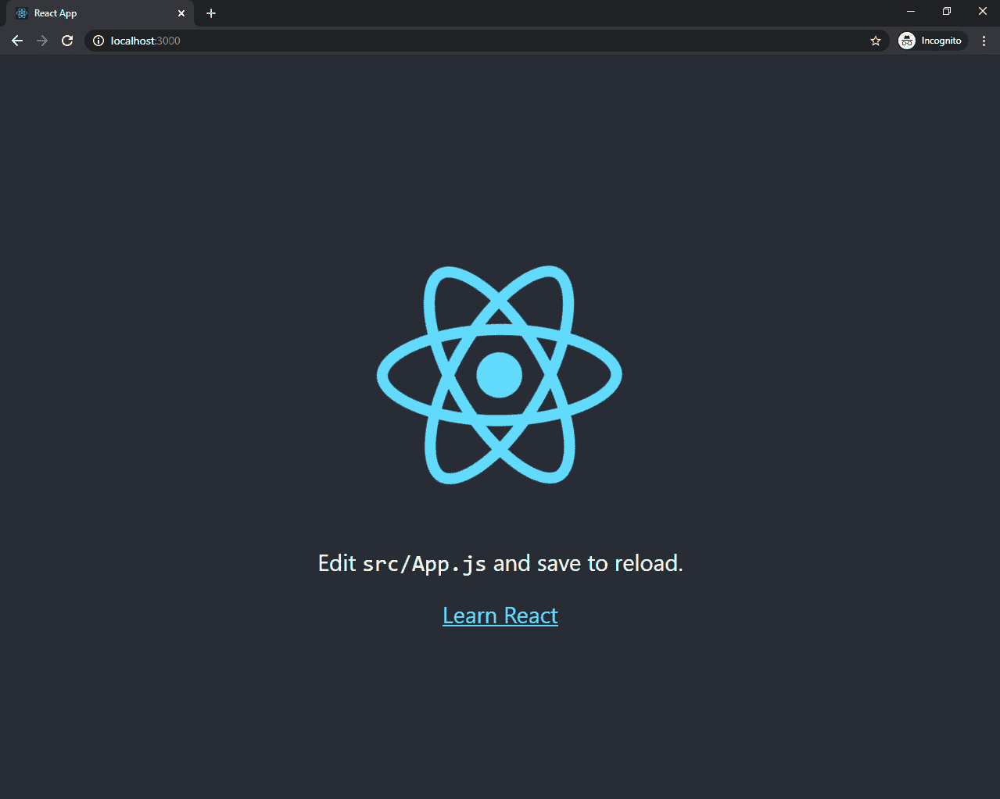
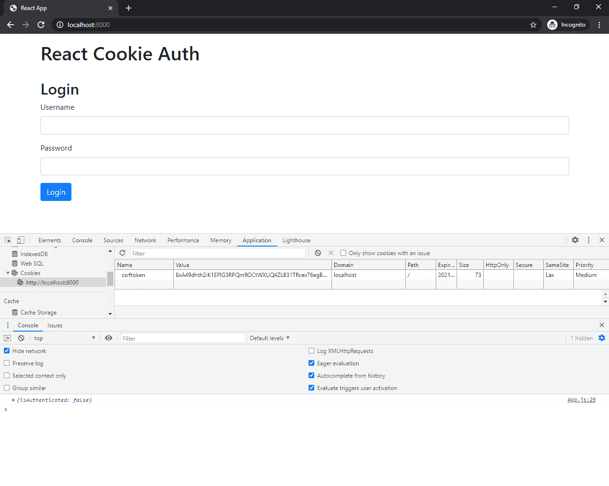
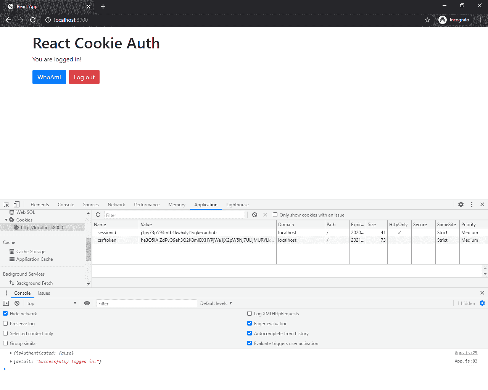

# Django 基于会话的单页应用授权

> 原文：<https://testdriven.io/blog/django-spa-auth/>

在本文中，我们将看看如何使用基于会话的认证来认证[单页面应用程序](https://en.wikipedia.org/wiki/Single-page_application) (SPAs)。我们将使用 [Django](https://www.djangoproject.com/) 作为后端，而前端将使用 [React](https://reactjs.org/) 构建，这是一个为构建用户界面而设计的 JavaScript 库。

> 请随意将 React 替换为不同的工具，如 Angular、Vue 或 Svelte。

## 会话与基于令牌的身份验证

### 它们是什么？

使用基于会话的身份验证，会生成一个会话，并将 ID 存储在 cookie 中。

登录后，服务器会验证凭据。如果有效，它生成一个会话，存储它，然后将会话 id 发送回浏览器。浏览器将会话 ID 存储为 cookie，每当向服务器发出请求时，就会发送该 cookie。


基于会话的身份验证是有状态的。每当客户端请求服务器时，服务器必须在内存中定位会话，以便将会话 ID 绑定到相关用户。

另一方面，与基于会话的身份验证相比，基于令牌的身份验证相对较新。随着水疗和 RESTful APIs 的兴起，它获得了牵引力。

登录后，服务器验证凭据，如果有效，则创建一个签名令牌并发送回浏览器。大多数情况下，令牌存储在 localStorage 中。然后，当向服务器发出请求时，客户端会将令牌添加到报头中。假设请求来自授权来源，服务器解码令牌并检查其有效性。


令牌是对用户信息进行编码的字符串。

例如:

```
`// token header { "alg":  "HS256", "typ":  "JWT" } // token payload { "sub":  "1234567890", "name":  "John Doe", "iat":  1516239022 }` 
```

令牌可以被验证和信任，因为它是使用秘密密钥或公钥/私钥对进行数字签名的。最常见的令牌类型是 [JSON Web 令牌](https://jwt.io/) (JWT)。

由于令牌包含服务器验证用户身份所需的所有信息，因此基于令牌的身份验证是无状态的。

> 有关会话和令牌的更多信息，请查看 Stack Exchange 中的[会话认证与令牌认证](https://security.stackexchange.com/questions/81756/session-authentication-vs-token-authentication)。

### 安全漏洞

如前所述，基于会话的身份验证在 cookie 中维护客户端的状态。虽然 JWT 可以存储在 localStorage 或 cookie 中，但是大多数基于令牌的 auth 实现都将 JWT 存储在 localStorage 中。这两种方法都存在潜在的安全问题:

CSRF 是一种针对 web 应用程序的攻击，攻击者试图欺骗经过身份验证的用户执行恶意操作。大多数 CSRF 攻击的目标是使用基于 cookie 的身份验证的 web 应用程序，因为 web 浏览器包括与每个请求的特定域相关联的所有 cookie。因此，当发出恶意请求时，攻击者可以很容易地利用存储的 cookies。

> 要了解更多关于 CSRF 和如何在烧瓶中预防它，请查看烧瓶中的 [CSRF 保护](/blog/csrf-flask/)文章。

XSS 攻击是一种注入类型，恶意脚本被注入客户端，通常是为了绕过浏览器的同源策略。在 localStorage 中存储令牌的 Web 应用程序容易受到 XSS 攻击。打开浏览器并导航到任何站点。在开发者工具中打开控制台，输入`JSON.stringify(localStorage)`。按回车键。这应该以 JSON 序列化的形式打印 localStorage 元素。脚本访问 localStorage 就是这么容易。

> 关于在哪里存储 jwt 的更多信息，请查看[在哪里存储 jwt——cookie 与 HTML5 Web 存储](https://stormpath.com/blog/where-to-store-your-jwts-cookies-vs-html5-web-storage)。

## 设置基于会话的身份验证

本教程涵盖了以下将 Django 与前端库或框架相结合的方法:

1.  通过 Django 模板提供框架
2.  在同一个域上独立于 Django 提供框架
3.  与 Django 分开提供框架，Django REST 框架在同一个域中
4.  在不同的域上独立于 Django 提供框架

> 同样，你也可以随意替换 React 作为你选择的前端——例如，棱角分明的，脆弱的，苗条的。

## Django 提供前台服务

使用这种方法，我们将直接从 Django 提供 React 应用程序。这种方法是最容易建立的。

### 后端

让我们首先为我们的项目创建一个新目录。在目录中，我们将创建并激活一个新的虚拟环境，安装 Django，并创建一个新的 Django 项目:

```
`$ mkdir django_react_templates && cd django_react_templates
$ python3.9 -m venv env
$ source env/bin/activate

(env)$ pip install django==3.1.4
(env)$ django-admin.py startproject djangocookieauth .` 
```

之后，创建一个名为`api`的新应用:

```
`(env)$ python manage.py startapp api` 
```

在`INSTALLED_APPS`下的*djangookieauth/settings . py*中注册 app:

```
`# djangocookieauth/settings.py

INSTALLED_APPS = [
    'django.contrib.admin',
    'django.contrib.auth',
    'django.contrib.contenttypes',
    'django.contrib.sessions',
    'django.contrib.messages',
    'django.contrib.staticfiles',
    'api.apps.ApiConfig', # new
]` 
```

我们的应用将拥有以下 API 端点:

1.  `/api/login/`允许用户通过提供用户名和密码登录
2.  `/api/logout/`注销用户
3.  `/api/session/`检查会话是否存在
4.  `/api/whoami/`获取已验证用户的用户数据

对于视图，在这里获取完整的代码[，并将其添加到 *api/views.py* 文件中。](https://github.com/duplxey/django-spa-cookie-auth/blob/master/django_react_templates/api/views.py)

向“api”添加一个 *urls.py* 文件，并定义以下 URL:

```
`# api/urls.py

from django.urls import path

from . import views

urlpatterns = [
    path('login/', views.login_view, name='api-login'),
    path('logout/', views.logout_view, name='api-logout'),
    path('session/', views.session_view, name='api-session'),
    path('whoami/', views.whoami_view, name='api-whoami'),
]` 
```

现在，让我们将我们的应用程序 URL 注册到基础项目:

```
`# djangocookieauth/urls.py

from django.contrib import admin
from django.shortcuts import render
from django.urls import path, include  # new import

urlpatterns = [
    path('admin/', admin.site.urls),
    path('api/', include('api.urls')),  # new
]` 
```

我们后端的代码现在差不多完成了。运行 migrate 命令并创建一个超级用户以供将来测试:

```
`(env)$ python manage.py migrate
(env)$ python manage.py createsuperuser` 
```

最后，更新*djangookieauth/settings . py*中的以下安全设置:

```
`CSRF_COOKIE_SAMESITE = 'Strict'
SESSION_COOKIE_SAMESITE = 'Strict'
CSRF_COOKIE_HTTPONLY = False  # False since we will grab it via universal-cookies
SESSION_COOKIE_HTTPONLY = True

# PROD ONLY
# CSRF_COOKIE_SECURE = True
# SESSION_COOKIE_SECURE = True` 
```

注意事项:

1.  将`CSRF_COOKIE_SAMESITE`和`SESSION_COOKIE_SAMESITE`设置为`True`可以防止任何外部请求发送 cookies 和 CSRF 令牌。
2.  将`CSRF_COOKIE_HTTPONLY`和`SESSION_COOKIE_HTTPONLY`设置为`True`会阻止客户端 JavaScript 访问 CSRF 和会话 cookies。我们将`CSRF_COOKIE_HTTPONLY`设置为`False`，因为我们将通过 JavaScript 访问 cookie。

> 如果你在制作中，你应该通过 HTTPS 服务你的网站并启用`CSRF_COOKIE_SECURE`和`SESSION_COOKIE_SECURE`，这将只允许 cookies 通过 HTTPS 发送。

### 前端

在你开始前端工作之前，确保你已经安装了 [Node.js](https://nodejs.org/en/) 和 [npm](https://www.npmjs.com/) (或者 [Yarn](https://yarnpkg.com/) )。

我们将使用 [Create React App](https://create-react-app.dev/) 来搭建一个新的 React 项目:

```
`$ npx create-react-app frontend
$ cd frontend
$ npm start` 
```

这将在端口 3000 上启动我们的应用程序。访问 [http://localhost:3000](http://localhost:3000) 以确保其工作正常:



您可以通过删除所有文件和文件夹来简化前端，除了:

```
`├── README.md
├── node_modules
├── package-lock.json
├── package.json
├── public
│   ├── favicon.ico
│   ├── index.html
│   ├── manifest.json
│   └── robots.txt
└── src
    ├── App.js
    ├── index.css
    └── index.js` 
```

接下来，让我们添加 Bootstrap*frontend/public/index . html*:

```
`<!-- frontend/public/index.html -->

<!DOCTYPE html>
<html lang="en">
  <head>
    <meta charset="utf-8" />
    <link rel="icon" href="%PUBLIC_URL%/favicon.ico" />
    <meta name="viewport" content="width=device-width, initial-scale=1" />
    <meta name="theme-color" content="#000000" />
    <meta
      name="description"
      content="Web site created using create-react-app"
    />
    <link rel="apple-touch-icon" href="%PUBLIC_URL%/logo192.png" />
    <link rel="manifest" href="%PUBLIC_URL%/manifest.json" />
    <title>React App</title>
    <!-- new -->
    <link rel="stylesheet" href="https://stackpath.bootstrapcdn.com/bootstrap/4.5.2/css/bootstrap.min.css" crossorigin="anonymous">
    <!-- end of new -->
  </head>
  <body>
    <noscript>You need to enable JavaScript to run this app.</noscript>
    <div id="root"></div>
  </body>
</html>` 
```

接下来，我们将使用 [universal-cookie](https://github.com/reactivestack/cookies/tree/master/packages/universal-cookie) 将 cookie 加载到 React 应用程序中。

从“前端”文件夹安装它:

```
`$ npm install universal-cookie` 
```

抓取`App`组件的完整代码[在这里](https://github.com/duplxey/django-spa-cookie-auth/blob/master/django_react_templates/frontend/src/App.js)，并将其添加到 *frontend/src/App.js* 文件中。

这只是一个简单的带有表单的前端应用程序，由 React state 处理。在页面加载时，`compontentDidMount()`被调用，它获取会话并将`isAuthenticated`设置为`true`或`false`。

我们使用`universal-cookie`获得了 CSRF 令牌，并在我们的请求中将其作为报头传递给了`X-CSRFToken`:

```
`import  Cookies  from  "universal-cookie"; const  cookies  =  new  Cookies(); login  =  (event)  =>  { event.preventDefault(); fetch("/api/login/",  { method:  "POST", headers:  { "Content-Type":  "application/json", "X-CSRFToken":  cookies.get("csrftoken"), }, credentials:  "same-origin", body:  JSON.stringify({username:  this.state.username,  password:  this.state.password}), }) .then(this.isResponseOk) .then((data)  =>  { console.log(data); this.setState({isAuthenticated:  true,  username:  "",  password:  "",  error:  ""}); }) .catch((err)  =>  { console.log(err); this.setState({error:  "Wrong username or password."}); }); }` 
```

请注意，对于每个请求，我们都使用了`credentials: same-origin`。这是必需的，因为如果 URL 与调用脚本来源相同，我们希望浏览器在每个 HTTP 请求中传递 cookies。

更新 *frontend/src/index.js* :

```
`// frontend/src/index.js import  React  from  "react"; import  ReactDOM  from  "react-dom"; import  App  from  "./App.js"; import  "./index.css"; ReactDOM.render( <React.StrictMode> <App  /> </React.StrictMode>, document.getElementById("root") );` 
```

### 上菜反应

首先，构建前端应用程序:

这个命令将生成“build”文件夹，我们的后端将使用它来提供 React 应用程序。

接下来，我们必须让 Django 知道我们的 React 应用程序在哪里:

```
`# djangocookieauth/settings.py

TEMPLATES = [
    {
        'BACKEND': 'django.template.backends.django.DjangoTemplates',
        'DIRS': [BASE_DIR.joinpath('frontend')],  # new
        'APP_DIRS': True,
        'OPTIONS': {
            'context_processors': [
                'django.template.context_processors.debug',
                'django.template.context_processors.request',
                'django.contrib.auth.context_processors.auth',
                'django.contrib.messages.context_processors.messages',
            ],
        },
    },
]

...

STATIC_URL = '/static/'

STATICFILES_DIRS = (
    BASE_DIR.joinpath('frontend', 'build', 'static'),  # new
)` 
```

> 如果你使用的是 Django 的旧版本，确保导入`os`并使用 [os.path.join](https://docs.python.org/3/library/os.path.html#os.path.join) 而不是 [joinpath](https://docs.python.org/3/library/pathlib.html#pathlib.PurePath.joinpath) 。

让我们为我们的应用程序创建索引视图:

```
`# djangocookieauth/urls.py

from django.contrib import admin
from django.shortcuts import render
from django.urls import path, include

# new
def index_view(request):
    return render(request, 'build/index.html')

urlpatterns = [
    path('admin/', admin.site.urls),
    path('api/', include('api.urls')),
    path('', index_view, name='index'),  # new
]` 
```

因为 Django 最终提供前端服务，所以 CSRF cookie 将被自动设置。

从项目根目录，使用`runserver`命令运行 Django 服务器，如下所示:

```
`(env)$ python manage.py runserver` 
```

打开浏览器，导航到 [https://localhost:8000/](https://localhost:8000) 。您的 React 应用程序现在通过 Django 模板提供服务。



在加载时，设置 CSRF cookie，用于后续的 AJAX 请求。如果用户输入了正确的用户名和密码，它会对他们进行身份验证，并将`sessionid` cookie 保存到他们的浏览器中。



您可以用之前创建的超级用户来测试它。

从 GitHub 获取该方法的完整代码: [django_react_templates](https://github.com/duplxey/django-spa-cookie-auth/tree/master/django_react_templates) 。

## 单独提供前端服务(同一域)

使用这种方法，我们将构建前端，并在同一个域中独立于 Django 应用程序提供它。我们将使用 Docker 和 Nginx 在本地同一域上提供这两个应用程序。

模板方法和这种方法的主要区别在于，我们必须在加载时手动获取 CSRF 令牌。

首先创建一个项目目录:

```
`$ mkdir django_react_same_origin && cd django_react_same_origin` 
```

### 后端

首先，为 Django 项目创建一个名为“backend”的新目录:

```
`$ mkdir backend && cd backend` 
```

接下来，创建并激活一个新的虚拟环境，安装 Django，并创建一个新的 Django 项目:

```
`$ python3.9 -m venv env
$ source env/bin/activate

(env)$ pip install django==3.1.4
(env)$ django-admin.py startproject djangocookieauth .` 
```

之后，创建一个名为`api`的新应用:

```
`(env)$ python manage.py startapp api` 
```

在`INSTALLED_APPS`下的*djangookieauth/settings . py*中注册 app:

```
`# backend/djangocookieauth/settings.py

INSTALLED_APPS = [
    'django.contrib.admin',
    'django.contrib.auth',
    'django.contrib.contenttypes',
    'django.contrib.sessions',
    'django.contrib.messages',
    'django.contrib.staticfiles',
    'api.apps.ApiConfig', # new
]` 
```

我们的应用将拥有以下 API 端点:

1.  将生成一个 CSRF 令牌并以 JSON 的形式返回
2.  `/api/login/`允许用户通过提供用户名和密码登录
3.  `/api/logout/`注销用户
4.  `/api/session/`检查会话是否存在
5.  `/api/whoami/`获取已验证用户的用户数据

对于视图，在这里获取完整代码[，并将其添加到*后端/api/views.py* 文件中。](https://github.com/duplxey/django-spa-cookie-auth/blob/master/django_react_same_origin/backend/api/views.py)

向“后端/api”添加一个 *urls.py* 文件，并定义以下特定于应用程序的 URL:

```
`# backend/api/urls.py

from django.urls import path

from . import views

urlpatterns = [
    path('csrf/', views.get_csrf, name='api-csrf'),
    path('login/', views.login_view, name='api-login'),
    path('logout/', views.logout_view, name='api-logout'),
    path('session/', views.session_view, name='api-session'),
    path('whoami/', views.whoami_view, name='api-whoami'),
]` 
```

现在，让我们将我们的应用程序 URL 注册到基础项目:

```
`# backend/djangocookieauth/urls.py

from django.contrib import admin
from django.shortcuts import render
from django.urls import path, include  # new import

urlpatterns = [
    path('admin/', admin.site.urls),
    path('api/', include('api.urls')),  # new
]` 
```

让我们更改一下*back end/djangookieauth/settings . py*中的一些安全设置:

```
`CSRF_COOKIE_SAMESITE = 'Strict'
SESSION_COOKIE_SAMESITE = 'Strict'
CSRF_COOKIE_HTTPONLY = True
SESSION_COOKIE_HTTPONLY = True

# PROD ONLY
# CSRF_COOKIE_SECURE = True
# SESSION_COOKIE_SECURE = True` 
```

注意事项:

1.  启用`CSRF_COOKIE_SAMESITE`和`SESSION_COOKIE_SAMESITE`可防止任何外部请求发送 cookies 和 CSRF 令牌。
2.  启用`CSRF_COOKIE_HTTPONLY`和`SESSION_COOKIE_HTTPONLY`会阻止客户端 JavaScript 访问 CSRF 和会话 cookies。

> 如果你在制作中，你应该通过 HTTPS 服务你的网站并启用`CSRF_COOKIE_SECURE`和`SESSION_COOKIE_SECURE`，这将只允许 cookies 通过 HTTPS 发送。

创建一个*后端/需求. txt* 文件:

### 前端

在你开始前端工作之前，确保你已经安装了 [Node.js](https://nodejs.org/en/) 和 [npm](https://www.npmjs.com/) (或者 [Yarn](https://yarnpkg.com/) )。

我们将使用 [Create React App](https://create-react-app.dev/) 来搭建一个新的 React 项目。

从项目根目录运行:

```
`$ npx create-react-app frontend
$ cd frontend
$ npm start` 
```

这将在端口 3000 上启动我们的应用程序。访问 [http://localhost:3000](http://localhost:3000) 以确保其工作正常:


您可以通过删除所有文件和文件夹来简化前端，除了:

```
`├── README.md
├── node_modules
├── package-lock.json
├── package.json
├── public
│   ├── favicon.ico
│   ├── index.html
│   ├── manifest.json
│   └── robots.txt
└── src
    ├── App.js
    ├── index.css
    └── index.js` 
```

接下来，让我们添加 Bootstrap*frontend/public/index . html*:

```
`<!-- frontend/public/index.html -->

<!DOCTYPE html>
<html lang="en">
  <head>
    <meta charset="utf-8" />
    <link rel="icon" href="%PUBLIC_URL%/favicon.ico" />
    <meta name="viewport" content="width=device-width, initial-scale=1" />
    <meta name="theme-color" content="#000000" />
    <meta
      name="description"
      content="Web site created using create-react-app"
    />
    <link rel="apple-touch-icon" href="%PUBLIC_URL%/logo192.png" />
    <link rel="manifest" href="%PUBLIC_URL%/manifest.json" />
    <title>React App</title>
    <!-- new -->
    <link rel="stylesheet" href="https://stackpath.bootstrapcdn.com/bootstrap/4.5.2/css/bootstrap.min.css" crossorigin="anonymous">
    <!-- end of new -->
  </head>
  <body>
    <noscript>You need to enable JavaScript to run this app.</noscript>
    <div id="root"></div>
  </body>
</html>` 
```

抓取`App`组件的完整代码[在这里](https://github.com/duplxey/django-spa-cookie-auth/blob/master/django_react_same_origin/frontend/src/App.js)，并将其添加到 *frontend/src/App.js* 文件中。

这只是一个简单的带有表单的前端应用程序，由 React state 处理。在页面加载时，`compontentDidMount()`被调用，它执行两个 API 调用:

1.  首先，它通过调用`/api/session/`检查用户是否被认证，并将`isAuthenticated`设置为`true`或`false`。
2.  如果用户没有通过认证，它从`/api/csrf/`获取 CSRF 令牌，并将其保存到状态。

请注意，对于每个请求，我们都使用了`credentials: same-origin`。这是必需的，因为如果 URL 与调用脚本来源相同，我们希望浏览器在每个 HTTP 请求中传递 cookies。

更新 *frontend/src/index.js* :

```
`// frontend/src/index.js import  React  from  "react"; import  ReactDOM  from  "react-dom"; import  App  from  "./App.js"; import  "./index.css"; ReactDOM.render( <React.StrictMode> <App  /> </React.StrictMode>, document.getElementById("root") );` 
```

### 码头工人

接下来，让我们对两个应用程序进行 Dockerize。

#### 后端

```
`# backend/Dockerfile

# pull official base image
FROM  python:3.9.0-slim-buster

# set working directory
WORKDIR  /usr/src/app

# set environment variables
ENV  PYTHONDONTWRITEBYTECODE 1
ENV  PYTHONUNBUFFERED 1

# install dependencies
RUN  pip install --upgrade pip
COPY  ./requirements.txt .
RUN  pip install -r requirements.txt

# add app
COPY  . .

# start app
CMD  ["python",  "manage.py",  "runserver",  "0.0.0.0:8000"]` 
```

#### 前端

```
`# frontend/Dockerfile

# pull official base image
FROM  node:15.2.0-alpine

# set working directory
WORKDIR  /usr/src/app

# add `/usr/src/app/node_modules/.bin` to $PATH
ENV  PATH /usr/src/app/node_modules/.bin:$PATH

# install and cache app dependencies
COPY  package.json .
COPY  package-lock.json .
RUN  npm ci
RUN  npm install [[email protected]](/cdn-cgi/l/email-protection) -g --silent

# start app
CMD  ["npm",  "start"]` 
```

#### Nginx

为了在同一个域上运行这两个应用程序，让我们为 Nginx 添加一个作为反向代理的容器。在项目根目录下创建一个名为“nginx”的新文件夹。

```
`# nginx/Dockerfile

FROM  nginx:latest
COPY  ./nginx.conf /etc/nginx/nginx.conf` 
```

同样添加一个 *nginx/nginx.conf* 配置文件。你可以在这里找到它的代码。

注意两个[位置](https://nginx.org/en/docs/http/ngx_http_core_module.html#location)块:

```
`#  nginx/nginx.conf location  /api  { proxy_pass  http://backend:8000; ... } location  /  { proxy_pass  http://frontend:8000; ... }` 
```

对`/`的请求将被转发到 http://frontend:8000 (frontend 是 Docker Compose 文件中服务的名称，我们稍后将添加它)，而对`/api`的请求将被转发到 http://backend:8000 (backend 是 Docker Compose 文件中服务的名称)。

#### 复合坞站

在项目根目录中创建一个 *docker-compose.yml* 文件，并添加以下内容:

```
`# docker-compose.yml version:  '3.8' services: backend: build:  ./backend volumes: -  ./backend:/usr/src/app expose: -  8000 frontend: stdin_open:  true build:  ./frontend volumes: -  ./frontend:/usr/src/app -  /usr/src/app/node_modules expose: -  3000 environment: -  NODE_ENV=development depends_on: -  backend reverse_proxy: build:  ./nginx ports: -  81:80 depends_on: -  backend -  frontend` 
```

您的项目结构现在应该如下所示:

```
`├── backend
│   ├── Dockerfile
│   ├── api
│   │   ├── __init__.py
│   │   ├── admin.py
│   │   ├── apps.py
│   │   ├── migrations
│   │   │   └── __init__.py
│   │   ├── models.py
│   │   ├── tests.py
│   │   ├── urls.py
│   │   └── views.py
│   ├── djangocookieauth
│   │   ├── __init__.py
│   │   ├── asgi.py
│   │   ├── settings.py
│   │   ├── urls.py
│   │   └── wsgi.py
│   ├── manage.py
│   └── requirements.txt
├── docker-compose.yml
├── frontend
│   ├── Dockerfile
│   ├── README.md
│   ├── package-lock.json
│   ├── package.json
│   ├── public
│   │   ├── favicon.ico
│   │   ├── index.html
│   │   ├── manifest.json
│   │   └── robots.txt
│   └── src
│       ├── App.js
│       ├── index.css
│       └── index.js
└── nginx
    ├── Dockerfile
    └── nginx.conf` 
```

### 使用 Docker 运行

构建图像并旋转容器:

```
`$ docker-compose up -d --build` 
```

> 如果你遇到“服务前端构建失败”，你的 *package-lock.json* 可能会丢失。移动到*前端*文件夹，运行`npm install --package-lock`生成。

运行迁移并创建超级用户:

```
`$ docker-compose exec backend python manage.py makemigrations
$ docker-compose exec backend python manage.py migrate
$ docker-compose exec backend python manage.py createsuperuser` 
```

您的应用程序应该可以在: [http://localhost:81](http://localhost:81) 访问。通过使用您刚刚创建的超级用户登录来测试它。

从 GitHub 获取该方法的完整代码: [django_react_same_origin](https://github.com/duplxey/django-spa-cookie-auth/tree/master/django_react_same_origin) 。

## 姜戈 DRF +前端分开服务(同一域)

这种方法或多或少与前面的方法“前端分开服务(同一个域)”相同。下面列出了一些小的区别。

当使用这种方法时，你必须使用 pip 安装`djangorestframework`或将其添加到 *requirements.txt* (如果用 Docker 构建)。安装后，你需要在*设置中的`INSTALLED_APPS`下注册它。*

```
`# djangocookieauth/settings.py

INSTALLED_APPS = [
    'django.contrib.admin',
    'django.contrib.auth',
    'django.contrib.contenttypes',
    'django.contrib.sessions',
    'django.contrib.messages',
    'django.contrib.staticfiles',
    'api.apps.ApiConfig',
    'rest_framework', # new
]` 
```

要启用`SessionAuthentication`，您必须将以下内容添加到您的*设置中。py* :

```
`# backend/djangocookieauth/settings.py

# Django REST framework
# https://www.django-rest-framework.org/api-guide/settings/

REST_FRAMEWORK = {
    'DEFAULT_RENDERER_CLASSES': [
        'rest_framework.renderers.JSONRenderer',
    ],
    'DEFAULT_AUTHENTICATION_CLASSES': [
        'rest_framework.authentication.SessionAuthentication',
    ],
}` 
```

> 还建议将`JSONRenderer`设置为`DEFAULT_RENDERER_CLASSES`来禁用 DRF 导航和那个花哨的显示。

创建 session 和 whoami 视图时，使用从`rest_framework`导入的`APIView`，并显式设置`authentication_classes`和`permission_classes`:

```
`# backend/api/views.py

from django.http import JsonResponse
from rest_framework.authentication import SessionAuthentication, BasicAuthentication
from rest_framework.permissions import IsAuthenticated
from rest_framework.views import APIView

class SessionView(APIView):
    authentication_classes = [SessionAuthentication, BasicAuthentication]
    permission_classes = [IsAuthenticated]

    @staticmethod
    def get(request, format=None):
        return JsonResponse({'isAuthenticated': True})

class WhoAmIView(APIView):
    authentication_classes = [SessionAuthentication, BasicAuthentication]
    permission_classes = [IsAuthenticated]

    @staticmethod
    def get(request, format=None):
        return JsonResponse({'username': request.user.username})` 
```

注册 URL 时，请像这样注册:

```
`# backend/api/urls.py

from django.urls import path

from . import views

urlpatterns = [
    path('csrf/', views.get_csrf, name='api-csrf'),
    path('login/', views.login_view, name='api-login'),
    path('logout/', views.logout_view, name='api-logout'),
    path('session/', views.SessionView.as_view(), name='api-session'),  # new
    path('whoami/', views.WhoAmIView.as_view(), name='api-whoami'),  # new
]` 
```

从 GitHub 获取该方法的完整代码:[django _ react _ drf _ same _ origin](https://github.com/duplxey/django-spa-cookie-auth/tree/master/django_react_drf_same_origin)。

## 单独提供前端服务(跨域)

使用这种方法，我们将构建前端，并在不同的域上独立于 Django 应用程序提供它。我们将不得不通过使用 [django-cors-headers](https://pypi.org/project/django-cors-headers/) 允许来自前端的跨域请求来稍微放宽安全性。

首先创建一个项目目录:

```
`$ mkdir django_react_cross_origin && cd django_react_cross_origin` 
```

### 后端

首先，为 Django 项目创建一个名为“backend”的新目录:

```
`$ mkdir backend && cd backend` 
```

接下来，创建并激活一个新的虚拟环境，安装 Django，并创建一个新的 Django 项目:

```
`$ python3.9 -m venv env
$ source env/bin/activate

(env)$ pip install django==3.1.4
(env)$ django-admin.py startproject djangocookieauth .` 
```

之后，创建一个名为`api`的新应用:

```
`(env)$ python manage.py startapp api` 
```

在`INSTALLED_APPS`下的*back end/djangookieauth/settings . py*中注册 app:

```
`# backend/djangocookieauth/settings.py

INSTALLED_APPS = [
    'django.contrib.admin',
    'django.contrib.auth',
    'django.contrib.contenttypes',
    'django.contrib.sessions',
    'django.contrib.messages',
    'django.contrib.staticfiles',
    'api.apps.ApiConfig', # new
]` 
```

我们的应用将拥有以下 API 端点:

1.  将生成一个 CSRF 令牌并以 JSON 的形式返回
2.  `/api/login/`允许用户通过提供用户名和密码登录
3.  `/api/logout/`注销用户
4.  `/api/session/`检查会话是否存在
5.  `/api/whoami/`获取已验证用户的用户数据

对于视图，在这里获取完整代码[，并将其添加到*后端/api/views.py* 文件中。](https://github.com/duplxey/django-spa-cookie-auth/blob/master/django_react_cross_origin/backend/api/views.py)

向“api”添加一个 *urls.py* 文件，并定义以下 URL:

```
`# backend/api/urls.py

from django.urls import path

from . import views

urlpatterns = [
    path('csrf/', views.get_csrf, name='api-csrf'),
    path('login/', views.login_view, name='api-login'),
    path('logout/', views.logout_view, name='api-logout'),
    path('session/', views.session_view, name='api-session'),
    path('whoami/', views.whoami_view, name='api-whoami'),
]` 
```

现在，让我们将我们的应用程序 URL 注册到基础项目:

```
`# backend/djangocookieauth/urls.py

from django.contrib import admin
from django.shortcuts import render
from django.urls import path, include  # new import

urlpatterns = [
    path('admin/', admin.site.urls),
    path('api/', include('api.urls')),  # new
]` 
```

现在，我们必须放松一些安全设置，以便我们的请求能够通过。让我们首先在*back end/djangookieauth/settings . py*中设置我们的 cookie 设置:

```
`CSRF_COOKIE_SAMESITE = 'Lax'
SESSION_COOKIE_SAMESITE = 'Lax'
CSRF_COOKIE_HTTPONLY = True
SESSION_COOKIE_HTTPONLY = True

# PROD ONLY
# CSRF_COOKIE_SECURE = True
# SESSION_COOKIE_SECURE = True` 
```

注意事项:

1.  将`CSRF_COOKIE_SAMESITE`和`SESSION_COOKIE_SAMESITE`设置为`Lax`允许我们在外部请求中发送 CSRF cookie。
2.  启用`CSRF_COOKIE_HTTPONLY`和`SESSION_COOKIE_HTTPONLY`会阻止客户端 JavaScript 访问 CSRF 和会话 cookies。

> 如果你在制作中，你应该通过 HTTPS 服务你的网站并启用`CSRF_COOKIE_SECURE`和`SESSION_COOKIE_SECURE`，这将只允许 cookies 通过 HTTPS 发送。

为了允许跨源 cookie 保存，我们还需要更改一些 CORS 设置。为此我们将使用`django-cors-headers`。让我们从使用以下命令安装它开始:

```
`(env)$ pip install django-cors-headers==3.5.0` 
```

将它添加到您已安装的应用程序中，并添加一个新的中间件类:

```
`# backend/djangocookieauth/settings.py

INSTALLED_APPS = [
    'django.contrib.admin',
    'django.contrib.auth',
    'django.contrib.contenttypes',
    'django.contrib.sessions',
    'django.contrib.messages',
    'django.contrib.staticfiles',
    'api.apps.ApiConfig',
    'corsheaders',  # new
]

MIDDLEWARE = [
    'corsheaders.middleware.CorsMiddleware',  # new
    'django.middleware.security.SecurityMiddleware',
    'django.contrib.sessions.middleware.SessionMiddleware',
    'django.middleware.common.CommonMiddleware',
    'django.middleware.csrf.CsrfViewMiddleware',
    'django.contrib.auth.middleware.AuthenticationMiddleware',
    'django.contrib.messages.middleware.MessageMiddleware',
    'django.middleware.clickjacking.XFrameOptionsMiddleware',
]` 
```

配置 CORS:

```
`# backend/djangocookieauth/settings.py

CORS_ALLOWED_ORIGINS = [
    'http://localhost:3000',
    'http://127.0.0.1:3000',
]
CORS_EXPOSE_HEADERS = ['Content-Type', 'X-CSRFToken']
CORS_ALLOW_CREDENTIALS = True` 
```

注意事项:

1.  我们在`CORS_ALLOWED_ORIGINS`列表中设置了允许的原点。值得注意的是，出于测试目的，不使用`CORS_ALLOWED_ORIGINS`设置，而是将`CORS_ALLOW_ALL_ORIGIN`设置为`True`，以便允许任何来源发出请求。但是不要在生产中使用它。
2.  `CORS_EXPOSE_HEADERS`是暴露给浏览器的 HTTP 头列表。
3.  将`CORS_ALLOW_CREDENTIALS`设置为`True`允许 cookies 随跨来源请求一起发送。

我们后端的代码现在差不多完成了。让我们运行 migrate 命令并创建一个超级用户，以便将来进行测试:

```
`(env)$ python manage.py migrate
(env)$ python manage.py createsuperuser` 
```

### 前端

在你开始前端工作之前，确保你已经安装了 [Node.js](https://nodejs.org/en/) 和 [npm](https://www.npmjs.com/) (或者 [Yarn](https://yarnpkg.com/) )。

我们将使用 [Create React App](https://create-react-app.dev/) 来搭建一个新的 React 项目。

从项目根目录运行:

```
`$ npx create-react-app frontend
$ cd frontend
$ npm start` 
```

这将在端口 3000 上启动我们的应用程序。访问 [http://localhost:3000](http://localhost:3000) 以确保其工作正常:


您可以通过删除所有文件和文件夹来简化前端，除了:

```
`├── README.md
├── node_modules
├── package-lock.json
├── package.json
├── public
│   ├── favicon.ico
│   ├── index.html
│   ├── manifest.json
│   └── robots.txt
└── src
    ├── App.js
    ├── index.css
    └── index.js` 
```

接下来，让我们添加 Bootstrap*frontend/public/index . html*:

```
`<!-- frontend/public/index.html -->

<!DOCTYPE html>
<html lang="en">
  <head>
    <meta charset="utf-8" />
    <link rel="icon" href="%PUBLIC_URL%/favicon.ico" />
    <meta name="viewport" content="width=device-width, initial-scale=1" />
    <meta name="theme-color" content="#000000" />
    <meta
      name="description"
      content="Web site created using create-react-app"
    />
    <link rel="apple-touch-icon" href="%PUBLIC_URL%/logo192.png" />
    <link rel="manifest" href="%PUBLIC_URL%/manifest.json" />
    <title>React App</title>
    <!-- new -->
    <link rel="stylesheet" href="https://stackpath.bootstrapcdn.com/bootstrap/4.5.2/css/bootstrap.min.css" crossorigin="anonymous">
    <!-- end of new -->
  </head>
  <body>
    <noscript>You need to enable JavaScript to run this app.</noscript>
    <div id="root"></div>
  </body>
</html>` 
```

抓取`App`组件的完整代码[在这里](https://github.com/duplxey/django-spa-cookie-auth/blob/master/django_react_cross_origin/frontend/src/App.js)，并将其添加到 *frontend/src/App.js* 文件中。

这只是一个简单的带有表单的前端应用程序，由 React state 处理。在页面加载时，`compontentDidMount()`被调用，它执行两个 API 调用:

1.  首先，它通过调用`/api/session/`检查用户是否被认证，并将`isAuthenticated`设置为`true`或`false`。
2.  如果用户没有通过认证，它从`/api/csrf/`获取 CSRF 令牌，并将其保存到状态。

请注意，对于每个请求，我们都使用了`credentials: include`。这是必需的，因为我们希望浏览器通过每个 HTTP 请求传递 cookies，即使 URL 与调用脚本的来源不同。请记住，我们在后端更改了一些 CORS 设置以允许这样做。

更新 *frontend/src/index.js* :

```
`// frontend/src/index.js import  React  from  "react"; import  ReactDOM  from  "react-dom"; import  App  from  "./App.js"; import  "./index.css"; ReactDOM.render( <React.StrictMode> <App  /> </React.StrictMode>, document.getElementById("root") );` 
```

### 运行应用程序

移动到您的*后端*文件夹，使用以下命令运行 Django:

```
`(env)$ python manage.py runserver` 
```

您的后端应该可以访问: [http://localhost:8000](http://localhost:8000) 。

打开一个新的终端窗口，导航到“frontend”文件夹并启动 React with npm:

您应该能够在 [http://localhost:3000](http://localhost:3000) 访问您的应用程序。

通过使用您之前创建的超级用户登录来测试您的应用程序。

从 GitHub 获取该方法的完整代码: [django_react_same_origin](https://github.com/duplxey/django-spa-cookie-auth/tree/master/django_react_cross_origin/)

## 结论

本文详细介绍了如何使用 Django 和 React 为单页面应用程序设置基于会话的身份验证。无论您使用会话 cookie 还是令牌，当客户端是浏览器时，最好使用 cookie 进行身份验证。虽然最好从同一个域提供这两个应用程序，但您可以通过放宽跨域安全设置，在不同的域上提供它们。

我们研究了将 Django 与前端框架结合起来处理基于会话的授权的四种不同方法:

| 方法 | 前端 | 后端 |
| --- | --- | --- |
| Django 提供前台服务 | 使用`universal-cookies`获取 CSRF 令牌，并在请求中使用`credentials: "same-origin"`。 | 将`CSRF_COOKIE_SAMESITE`、`SESSION_COOKIE_SAMESITE`设置为`"Strict"`。启用`SESSION_COOKIE_HTTPONLY`，禁用`CSRF_COOKIE_HTTPONLY`。 |
| 单独提供前端服务(同一域) | 获取 CSRF 令牌并在获取请求中使用`credentials: "same-origin"`。 | 添加一个路由处理程序，用于生成在响应头中设置的 CSRF 令牌。将`SESSION_COOKIE_HTTPONLY`、`CSRF_COOKIE_HTTPONLY`设置为`True`，将`SESSION_COOKIE_SAMESITE`、`CSRF_COOKIE_SAMESITE`设置为`"Strict"`。 |
| 前端与 DRF 分开服务(同一域) | 获取 CSRF 令牌并在获取请求中使用`credentials: "same-origin"`。 | 添加一个路由处理程序，用于生成在响应头中设置的 CSRF 令牌。将`SESSION_COOKIE_HTTPONLY`、`CSRF_COOKIE_HTTPONLY`设置为`True`，将`SESSION_COOKIE_SAMESITE`、`CSRF_COOKIE_SAMESITE`设置为`"Strict"`。 |
| 单独提供前端服务(跨来源) | 获取 CSRF 令牌并在获取请求中使用`credentials: "include"`。 | 启用 CORS 并添加路由处理程序，以生成在响应标头中设置的 CSRF 令牌。将`SESSION_COOKIE_HTTPONLY`、`CSRF_COOKIE_HTTPONLY`设置为`True`，将`SESSION_COOKIE_SAMESITE`、`CSRF_COOKIE_SAMESITE`设置为`"Lax"`。添加 django-cors-headers 包并配置`CORS_ALLOWED_ORIGINS`、`CORS_EXPOSE_HEADERS`和`CORS_ALLOW_CREDENTIALS`设置。 |

从 [django-spa-cookie-auth](https://github.com/duplxey/django-spa-cookie-auth) 存储库中获取代码。