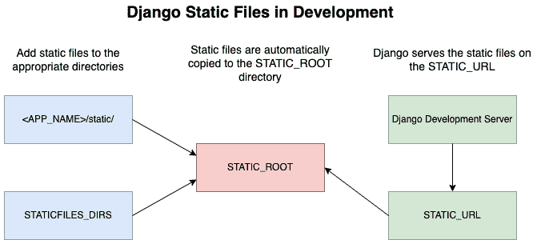

# 在 Django 中使用静态和媒体文件

> 原文：<https://testdriven.io/blog/django-static-files/>

本文着眼于如何在 Django 项目中，在本地和生产中处理静态和媒体文件。

## 目标

完成本文后，您将能够:

1.  描述你通常会在 Django 项目中找到的三种不同类型的文件
2.  解释静态文件和媒体文件的区别
3.  在本地和生产中处理静态和媒体文件

## 文件类型

Django 是一个固执己见的全栈 web 应用框架。它配有许多[电池](https://docs.djangoproject.com/en/4.0/ref/contrib/)，你可以用它们来构建一个全功能的网络应用，包括静态和媒体文件管理。

在我们看*如何*之前，我们先来看一些定义。

*什么是静态和媒体文件？*

首先，您通常会在 Django 项目中找到这三种类型的文件:

1.  **源代码**:这些是组成每个 Django 项目的核心 Python 模块和 HTML 文件，您可以在其中定义模型、视图和模板。
2.  静态文件:这些是你的 CSS 样式表、JavaScript 文件、字体和图片。由于不涉及任何处理，这些文件非常节能，因为它们可以按原样提供。它们也更容易缓存。
3.  **媒体文件**:这些是用户上传的文件。

本文主要关注静态和媒体文件。尽管名称不同，但两者都表示常规文件。最大的区别是静态文件保存在版本控制中，并在部署过程中与源代码文件一起发布。另一方面，媒体文件是您的最终用户(内部和外部)上传或由您的应用程序动态创建的文件(通常是一些用户操作的副作用)。

*为什么要区别对待静态文件和媒体文件？*

1.  您不能信任最终用户上传的文件，因此媒体文件需要区别对待。
2.  您可能需要对用户上传的媒体文件进行处理，以便更好地提供服务，例如，您可以优化上传的图像以支持不同的设备。
3.  您不希望用户上传的文件意外地替换了静态文件。

> 附加说明:
> 
> 1.  静态和媒体文件有时被称为静态和媒体资产。
> 2.  Django admin 附带了一些静态文件，它们存储在 [GitHub](https://github.com/django/django/tree/main/django/contrib/admin/static/admin) 的版本控制中。
> 3.  更容易混淆静态文件和媒体文件的是，Django 文档本身并没有很好地区分这两者。

## 静态文件

Django 为处理静态文件提供了强大的功能，被恰当地命名为 [staticfiles](https://docs.djangoproject.com/en/4.0/ref/contrib/staticfiles/) 。

如果您是 staticfiles 应用程序的新手，请快速浏览 Django 文档中的[如何管理静态文件(例如，图像、JavaScript、CSS)](https://docs.djangoproject.com/en/4.0/howto/static-files/) 指南。

Django 的 staticfiles 应用程序提供了以下核心组件:

1.  设置
2.  管理命令
3.  存储类别
4.  模板标签

### 设置

根据您的环境，您*可能*需要配置许多[设置](https://docs.djangoproject.com/en/4.0/ref/settings/#settings-staticfiles):

1.  [STATIC_URL](https://docs.djangoproject.com/en/4.0/ref/settings/#static-url) :用户可以在浏览器中访问您的静态文件的 URL。默认值是`/static/`，这意味着您的文件将在开发模式下的`http://127.0.0.1:8000/static/`可用——例如`http://127.0.0.1:8000/static/css/main.css`。
2.  [STATIC _ ROOT](https://docs.djangoproject.com/en/4.0/ref/settings/#static-root):Django 应用程序服务静态文件的目录的绝对路径。当您运行 [collectstatic](https://docs.djangoproject.com/en/4.0/ref/contrib/staticfiles/#django-admin-collectstatic) 管理命令时(稍后会有更多介绍)，它会找到所有静态文件并将它们复制到这个目录中。
3.  [STATICFILES_DIRS](https://docs.djangoproject.com/en/4.0/ref/settings/#staticfiles-dirs) :默认情况下，静态文件在`<APP_NAME>/static/`存储在 app 级。collectstatic 命令将在这些目录中查找静态文件。您还可以用`STATICFILES_DIRS`告诉 Django 在其他位置寻找静态文件。
4.  [STATICFILES_STORAGE](https://docs.djangoproject.com/en/4.0/ref/settings/#staticfiles-storage) :您想要使用的文件存储类，它控制静态文件的存储和访问方式。文件通过[静态文件存储](https://docs.djangoproject.com/en/4.0/ref/contrib/staticfiles/#staticfilesstorage)存储在文件系统中。
5.  [STATICFILES_FINDERS](https://docs.djangoproject.com/en/4.0/ref/settings/#std:setting-STATICFILES_FINDERS) :该设置定义了用于自动查找静态文件的文件查找器后端。默认情况下，使用`FileSystemFinder`和`AppDirectoriesFinder`查找器:
    *   `FileSystemFinder` -使用`STATICFILES_DIRS`设置查找文件。
    *   `AppDirectoriesFinder` -在项目内的每个 Django 应用程序的“静态”文件夹中查找文件。

### 管理命令

staticfiles 应用程序提供了以下[管理命令](https://docs.djangoproject.com/en/4.0/ref/contrib/staticfiles/#management-commands):

1.  `collectstatic`是一个管理命令，从不同的位置收集静态文件-即`<APP_NAME>/static/`和在`STATICFILES_DIRS`设置中找到的目录-并将它们复制到`STATIC_ROOT`目录。
2.  `findstatic`是调试时使用的一个非常有用的命令，因此您可以确切地看到特定文件的来源
3.  启动一个轻量级的开发服务器来运行开发中的 Django 应用程序。

注意事项:

1.  不要将任何静态文件放在`STATIC_ROOT`目录中。运行`collectstatic`后，静态文件会自动复制到那里。相反，总是将它们放在与`STATICFILES_DIRS`设置或`<APP_NAME>/static/`相关的目录中。
2.  不要在生产中使用开发服务器。请改用生产级的 WSGI 应用服务器。稍后会有更多内容。

> **`findstatic`命令的快速示例:**
> 
> 假设你有两个 Django 应用，`app1`和`app2`。每个应用程序都有一个名为“静态”的文件夹，在每个文件夹中，都有一个名为 *app.css* 的文件。来自 *settings.py* 的相关设置:
> 
> ```
> `STATIC_ROOT = 'staticfiles'
> 
> INSTALLED_APPS = [
>     ...
>     'app1',
>     'app2',
> ]` 
> ```
> 
> 运行`python manage.py collectstatic`时，将创建“staticfiles”目录，并将适当的静态文件复制到其中:
> 
> ```
> `$ ls staticfiles/
> 
> admin   app.css` 
> ```
> 
> 只有一个 *app.css* 文件，因为当存在多个同名文件时，staticfiles finder 将使用第一个找到的文件。要查看哪个文件被复制，您可以使用`findstatic`命令:
> 
> ```
> `$ python manage.py findstatic app.css
> 
> Found 'app.css' here:
>   /app1/static/app.css
>   /app2/static/app.css` 
> ```
> 
> 由于只收集第一个遇到的文件，要检查复制到“staticfiles”目录的 *app.css* 的源代码，请运行:
> 
> ```
> `$ python manage.py findstatic app.css --first
> 
> Found 'app.css' here:
>   /app1/static/app.css` 
> ```

### 存储类别

当运行`collectstatic`命令时，Django 使用存储类来决定如何存储和访问静态文件。同样，这是通过 [STATICFILES_STORAGE](https://docs.djangoproject.com/en/4.0/ref/settings/#staticfiles-storage) 设置来配置的。

默认的存储类是[静态文件存储](https://docs.djangoproject.com/en/4.0/ref/contrib/staticfiles/#staticfilesstorage)。在后台，`StaticFilesStorage`使用 [FileSystemStorage](https://docs.djangoproject.com/en/4.0/ref/files/storage/#the-filesystemstorage-class) 类在本地文件系统上存储文件。

您可能希望在生产中偏离默认设置。例如， [django-storages](https://django-storages.readthedocs.io/en/latest/) 为不同的云/CDN 提供商提供了一些定制的存储类。您还可以使用[文件存储 API](https://docs.djangoproject.com/en/4.0/ref/files/storage/) 编写自己的存储类。查看[云服务或 CDN](https://docs.djangoproject.com/en/4.0/howto/static-files/deployment/#serving-static-files-from-a-cloud-service-or-cdn) 提供的静态文件，了解更多相关信息。

存储类可用于执行后处理任务，如[缩小](https://developer.mozilla.org/en-US/docs/Glossary/minification)。

要在模板文件中加载静态文件，您需要:

1.  将``添加到模板文件的顶部
2.  然后，为您想要链接的每个文件添加``模板标签

例如:

```
`

<link rel="stylesheet" href="">` 
```

这些标签共同生成一个完整的 URL——例如，`/static/base.css`——基于 *settings.py* 文件中的静态文件配置。

您应该总是以这种方式加载静态文件，而不是直接硬编码 URL，这样您就可以更改您的静态文件配置并指向不同的`STATIC_URL`，而不必手动更新每个模板。

> 关于这些模板标签的更多信息，请查看[内置模板标签和过滤器](https://docs.djangoproject.com/en/4.0/ref/templates/builtins/)中的[静态](https://docs.djangoproject.com/en/4.0/ref/templates/builtins/#static)部分。

## 开发模式下的静态文件

在开发过程中，只要你将`DEBUG`设置为`TRUE`并且使用 [staticfiles](https://docs.djangoproject.com/en/4.0/ref/contrib/staticfiles/) 应用，你就可以使用 Django 的开发服务器提供静态文件。你甚至不需要运行`collecstatic`命令。

典型开发配置:

```
`# settings.py
STATIC_URL = '/static/'
STATIC_ROOT = BASE_DIR / 'staticfiles'
STATICFILES_DIRS = [BASE_DIR / 'static',]
STATICFILES_STORAGE = 'django.contrib.staticfiles.storage.StaticFilesStorage'` 
```



## 生产中的静态文件

在生产中处理静态文件并不像您的开发环境那样容易，因为您将使用 WSGI(如 [Gunicorn](https://gunicorn.org/) )或 ASGI(如 [Uvicorn](https://www.uvicorn.org/) )兼容的 web 应用服务器，它们用于提供动态内容——即您的 Django 源代码文件。

在生产中有许多不同的方法来处理静态文件，但是最流行的两种方法是:

1.  使用像 [Nginx](https://www.nginx.com) 这样的 web 服务器将静态文件的流量直接路由到静态根目录(通过`STATIC_ROOT`配置)
2.  使用[whiten noise](https://whitenoise.evans.io/en/stable/)直接从 WSGI 或 ASGI web 应用服务器提供静态文件

不管选择哪一种，您可能都希望利用一个 [CDN](https://en.wikipedia.org/wiki/Content_delivery_network) 。

> 有关这些选项的更多信息，请查看[如何部署静态文件](https://docs.djangoproject.com/en/4.0/howto/static-files/deployment/)。

### Nginx

Nginx 配置示例:

```
`upstream  hello_django  { server  web:8000; } server  { listen  80; location  /  { proxy_pass  http://hello_django; proxy_set_header  X-Forwarded-For  $proxy_add_x_forwarded_for; proxy_set_header  Host  $host; proxy_redirect  off; } location  /static/  { alias  /home/app/web/staticfiles/; } }` 
```

简而言之，当一个请求被发送到`/static/`——例如`/static/base.css`——Nginx 将尝试从“/home/app/web/staticfiles/”文件夹中提供文件。

> 好奇上面的 Nginx 配置是如何工作的？查看使用 Postgres、Gunicorn 和 Nginx 的教程。

其他资源:

1.  更喜欢把你的静态文件存储在亚马逊 S3 上？查看在亚马逊 S3 上存储 Django 静态和媒体文件的[。](/blog/storing-django-static-and-media-files-on-amazon-s3/)
2.  更喜欢将您的静态文件存储在[数字海洋空间](https://www.digitalocean.com/products/spaces)上？查看[在数字海洋空间](/blog/django-digitalocean-spaces/)存储 Django 静态和媒体文件。

### 白噪声

您可以使用[whiten noise](http://whitenoise.evans.io/en/stable/)从 WSGI 或 ASGI web 应用服务器提供静态文件。

最基本的设置很简单。安装完软件包后，将 WhiteNoise 添加到除了`django.middleware.security.SecurityMiddleware`之外的所有其他中间件之上的`MIDDLEWARE`列表中:

```
`MIDDLEWARE = [
    'django.middleware.security.SecurityMiddleware',
    'whitenoise.middleware.WhiteNoiseMiddleware',  # <---- WhiteNoise!
    'django.contrib.sessions.middleware.SessionMiddleware',
    'django.middleware.common.CommonMiddleware',
    'django.middleware.csrf.CsrfViewMiddleware',
    'django.contrib.auth.middleware.AuthenticationMiddleware',
    'django.contrib.messages.middleware.MessageMiddleware',
    'django.middleware.clickjacking.XFrameOptionsMiddleware',
]` 
```

然后，为了支持压缩和缓存，像这样更新`STATICFILES_STORAGE`:

```
`STATICFILES_STORAGE = 'whitenoise.storage.CompressedManifestStaticFilesStorage'` 
```

就是这样！关闭调试模式，运行`collectstatic`命令，然后运行 WSGI 或 ASGI web 应用服务器。

> 有关配置 WhiteNoise 与 Django 配合使用的更多信息，请参考[结合 Django 使用 white noise](http://whitenoise.evans.io/en/stable/django.html)指南。

同样，[媒体文件](https://docs.djangoproject.com/en/4.0/topics/files/)是您的最终用户(内部和外部)上传或由您的应用程序动态创建的文件(通常是一些用户操作的副作用)。它们通常不在版本控制中。

几乎总是，与[文件字段](https://docs.djangoproject.com/en/4.0/ref/models/fields/#filefield)或[图像字段](https://docs.djangoproject.com/en/4.0/ref/models/fields/#imagefield)模型字段相关联的文件应该被视为媒体文件。

与静态文件一样，媒体文件的处理在 *settings.py* 文件中配置。

处理媒体文件的基本配置设置:

1.  [MEDIA_URL](https://docs.djangoproject.com/en/4.0/ref/settings/#media-url) :类似于`STATIC_URL`，这是用户可以访问媒体文件的 URL。
2.  [MEDIA _ ROOT](https://docs.djangoproject.com/en/4.0/ref/settings/#media-root):Django 应用程序提供媒体文件的目录的绝对路径。
3.  [DEFAULT_FILE_STORAGE](https://docs.djangoproject.com/en/4.0/ref/settings/#default-file-storage) :您想要使用的文件存储类，它控制媒体文件的存储和访问方式。默认为[文件系统存储](https://docs.djangoproject.com/en/4.0/ref/files/storage/#django.core.files.storage.FileSystemStorage)。

> 参考[设置](https://docs.djangoproject.com/en/4.0/ref/settings/)中的[文件上传](https://docs.djangoproject.com/en/4.0/ref/settings/#file-uploads)部分了解更多配置设置。

典型开发配置:

```
`MEDIA_URL = '/media/'
MEDIA_ROOT = BASE_DIR / 'uploads'` 
```

不幸的是，Django 开发服务器默认不提供媒体文件。幸运的是，有一个非常简单的解决方法:您可以将媒体根作为静态路径添加到项目级 URL 中的`ROOT_URLCONF`。

示例:

```
`from django.conf import settings
from django.conf.urls.static import static
from django.contrib import admin
from django.urls import path, include

urlpatterns = [
    path('admin/', admin.site.urls),
    # ... the rest of your URLconf goes here ...
]

if settings.DEBUG:
    urlpatterns += static(settings.MEDIA_URL, document_root=settings.MEDIA_ROOT)` 
```

当涉及到在生产中处理媒体文件时，您的选择比静态文件少，因为您[不能使用 WhiteNoise 来提供媒体文件](https://whitenoise.evans.io/en/stable/django.html#serving-media-files)。因此，你通常会希望使用 Nginx 和 [django-storages](https://django-storages.readthedocs.io/en/latest/) 来存储本地文件系统之外的媒体文件，应用程序在本地文件系统中运行。

Nginx 配置示例:

```
`upstream  hello_django  { server  web:8000; } server  { listen  80; location  /  { proxy_pass  http://hello_django; proxy_set_header  X-Forwarded-For  $proxy_add_x_forwarded_for; proxy_set_header  Host  $host; proxy_redirect  off; } location  /media/  { alias  /home/app/web/mediafiles/; } }` 
```

因此，当一个请求被发送到`/media/`——例如`/media/upload.png`——Nginx 将尝试从“/home/app/web/mediafiles/”文件夹中提供文件。

> 好奇上面的 Nginx 配置是如何工作的？查看使用 Postgres、Gunicorn 和 Nginx 的教程。

其他资源:

1.  更喜欢把你的媒体文件储存在亚马逊 S3 上？查看在亚马逊 S3 上存储 Django 静态和媒体文件的[。](/blog/storing-django-static-and-media-files-on-amazon-s3/)
2.  更喜欢将您的媒体文件存储在 [DigitalOcean Spaces](https://www.digitalocean.com/products/spaces) 上？查看[在数字海洋空间](/blog/django-digitalocean-spaces/)存储 Django 静态和媒体文件。

## 结论

静态文件和媒体文件是不同的，为了安全起见，必须区别对待。

在本文中，您看到了如何在开发和生产中提供静态和媒体文件的示例。此外，文章还涵盖了:

1.  两种类型文件的不同设置
2.  Django 如何用最少的配置处理它们

您可以在这里找到一个简单的 Django 项目，其中包含为开发和生产中的静态文件以及开发中的媒体文件提供服务的示例。

本文只带您了解如何在 Django 中处理静态和媒体文件。它没有讨论静态文件的预处理/后处理，如缩小和捆绑。对于这样的任务，你必须使用像 [Rollup](https://rollupjs.org/) 、[packet](https://parceljs.org/)或者 [webpack](https://webpack.js.org/) 这样的工具来建立复杂的构建过程。