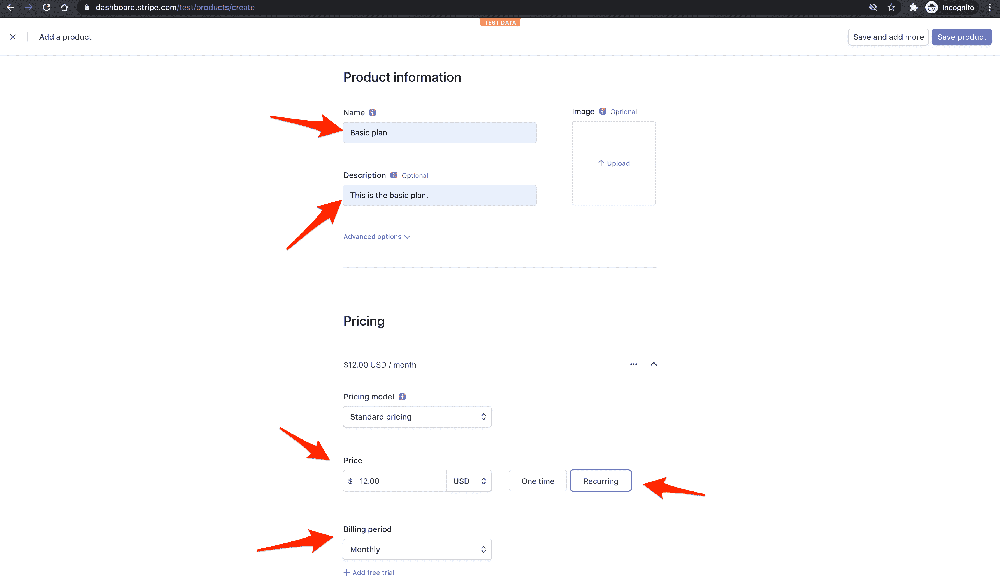
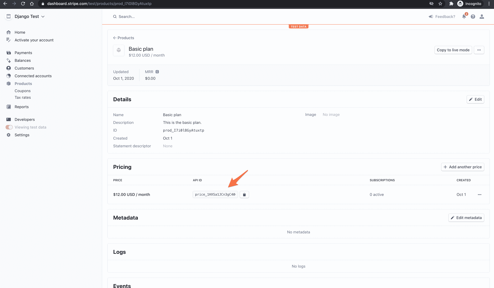
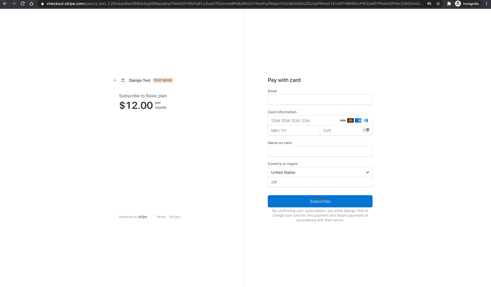

# Django 条纹订阅

> 原文：<https://testdriven.io/blog/django-stripe-subscriptions/>

本教程着眼于如何用 Django 和 [Stripe](https://stripe.com/) 处理订阅支付。

> 需要接受一次性付款？查看 [Django 条纹教程](/blog/django-stripe-tutorial/)。

## 条带订阅支付选项

有多种方法可以实现和处理条带订阅，但最常见的两种方法是:

1.  [固定价格订阅](https://stripe.com/docs/billing/subscriptions/fixed-price)
2.  [未来付款](https://stripe.com/docs/payments/save-and-reuse#checkout)

在这两种情况下，您都可以使用 [Stripe Checkout](https://stripe.com/payments/checkout) (这是一个 Stripe 托管的 Checkout 页面)或 [Stripe Elements](https://stripe.com/payments/elements) (这是一组用于构建支付表单的定制 UI 组件)。如果您不介意将您的用户重定向到 Stripe 托管的页面，并希望 Stripe 为您处理大部分支付流程(例如，创建客户和支付意向等)，请使用 Stripe Checkout。)，否则使用条纹元素。

固定价格方法更容易建立，但是你不能完全控制计费周期和支付。通过使用这种方法，Stripe 将在成功结账后的每个结算周期自动开始向您的客户收费。

固定价格步骤:

1.  将用户重定向至条带检验(使用`mode=subscription`)
2.  创建一个监听`checkout.session.completed`的网络钩子
3.  调用 webhook 后，将相关数据保存到数据库中

未来付款方式更难设置，但这种方式可以让您完全控制订阅。您提前收集客户详细信息和付款信息，并在未来某个日期向客户收费。这种方法还允许您同步计费周期，以便您可以在同一天向所有客户收费。

未来付款步骤:

1.  将用户重定向到条带结帐(使用`mode=setup`)以收集支付信息
2.  创建一个监听`checkout.session.completed`的网络钩子
3.  调用 webhook 后，将相关数据保存到数据库中
4.  从那里，您可以在将来使用[付款意向 API](https://stripe.com/docs/payments/payment-intents) 对付款方式收费

在本教程中，我们将使用带条纹结帐的固定价格方法。

## 计费周期

在开始之前，值得注意的是 Stripe 没有默认的计费频率。每个条带订阅的记账日期由以下两个因素决定:

1.  计费周期锚点(订阅创建的时间戳)
2.  重复间隔(每天、每月、每年等。)

例如，每月订阅设置为在每月 2 日循环的客户将始终在 2 日计费。

如果一个月没有锚定日，订阅将在该月的最后一天计费。例如，从 1 月 31 日开始的订阅在 2 月 28 日(或闰年的 2 月 29 日)计费，然后是 3 月 31 日、4 月 30 日等等。

> 要了解有关计费周期的更多信息，请参考 Stripe 文档中的[设置订阅计费周期日期](https://stripe.com/docs/billing/subscriptions/billing-cycle)页面。

## 项目设置

让我们首先为我们的项目创建一个新目录。在目录中，我们将创建并激活一个新的虚拟环境，安装 Django，并使用 django-admin 创建一个新的 Django 项目:

```
`$ mkdir django-stripe-subscriptions && cd django-stripe-subscriptions
$ python3.10 -m venv env
$ source env/bin/activate

(env)$ pip install django
(env)$ django-admin startproject djangostripe .` 
```

之后，创建一个名为`subscriptions`的新应用:

```
`(env)$ python manage.py startapp subscriptions` 
```

在`INSTALLED_APPS`下的 *djangostripe/settings.py* 中注册 app:

```
`# djangostripe/settings.py

INSTALLED_APPS = [
    'django.contrib.admin',
    'django.contrib.auth',
    'django.contrib.contenttypes',
    'django.contrib.sessions',
    'django.contrib.messages',
    'django.contrib.staticfiles',
    'subscriptions.apps.SubscriptionsConfig', # new
]` 
```

创建一个名为`home`的新视图，它将作为我们的主索引页面:

```
`# subscriptions/views.py

from django.shortcuts import render

def home(request):
    return render(request, 'home.html')` 
```

通过向 *subscriptions/urls.py* 添加以下内容，为视图分配一个 URL:

```
`# subscriptions/urls.py

from django.urls import path
from . import views

urlpatterns = [
    path('', views.home, name='subscriptions-home'),
]` 
```

现在，让我们告诉 Django，`subscriptions`应用程序在主应用程序中有自己的 URL:

```
`# djangostripe/urls.py

from django.contrib import admin
from django.urls import path, include # new

urlpatterns = [
    path('admin/', admin.site.urls),
    path('', include('subscriptions.urls')), # new
]` 
```

最后，在名为“模板”的新文件夹中创建一个名为*home.html*的新模板。将以下 HTML 添加到模板中:

```
`<!-- templates/home.html -->

<!DOCTYPE html>
<html lang="en">
  <head>
    <meta charset="utf-8">
    <meta name="viewport" content="width=device-width, initial-scale=1">
    <title>Django + Stripe Subscriptions</title>
    <script src="https://code.jquery.com/jquery-3.5.1.min.js" integrity="sha256-9/aliU8dGd2tb6OSsuzixeV4y/faTqgFtohetphbbj0=" crossorigin="anonymous"></script>
    <link rel="stylesheet" href="https://stackpath.bootstrapcdn.com/bootstrap/4.5.2/css/bootstrap.min.css" integrity="sha384-JcKb8q3iqJ61gNV9KGb8thSsNjpSL0n8PARn9HuZOnIxN0hoP+VmmDGMN5t9UJ0Z" crossorigin="anonymous">
    <script src="https://stackpath.bootstrapcdn.com/bootstrap/4.5.2/js/bootstrap.min.js" integrity="sha384-B4gt1jrGC7Jh4AgTPSdUtOBvfO8shuf57BaghqFfPlYxofvL8/KUEfYiJOMMV+rV" crossorigin="anonymous"></script>
  </head>
  <body>
    <div class="container mt-5">
      <button type="submit" class="btn btn-primary" id="submitBtn">Subscribe</button>
    </div>
  </body>
</html>` 
```

确保更新 *settings.py* 文件，以便 Django 知道要查找“模板”文件夹:

```
`# djangostripe/settings.py

TEMPLATES = [
    {
        'BACKEND': 'django.template.backends.django.DjangoTemplates',
        'DIRS': ['templates'], # new
        ...` 
```

最后运行`migrate`来同步数据库，运行`runserver`来启动 Django 的本地 web 服务器。

```
`(env)$ python manage.py migrate
(env)$ python manage.py runserver` 
```

在您选择的浏览器中访问 [http://localhost:8000/](http://localhost:8000/) 。您应该看到“Subscribe”按钮，我们稍后将使用该按钮将客户重定向到 Stripe Checkout 页面。

## 添加条纹

准备好基础项目后，让我们添加 Stripe。安装最新版本:

```
`(env)$ pip install stripe` 
```

接下来，[注册一个 Stipe 账户的](https://dashboard.stripe.com/register)(如果你还没有注册的话)并导航到[仪表板](https://dashboard.stripe.com/test/dashboard)。单击“Developers ”,然后从左侧栏的列表中单击“API keys ”:


每个条带帐户有四个 [API 密钥](https://stripe.com/docs/keys):两个用于测试，两个用于生产。每一对都有一个“秘密密钥”和一个“可公开密钥”。不要向任何人透露密钥；可发布的密钥将被嵌入到任何人都可以看到的页面上的 JavaScript 中。

目前右上角的“查看测试数据”开关表示我们正在使用测试键。这就是我们想要的。

在你的 *settings.py* 文件的底部，添加下面两行，包括你自己的测试秘密和可发布的密钥。确保在实际的键周围包含`''`字符。

```
`# djangostripe/settings.py

STRIPE_PUBLISHABLE_KEY = '<enter your stripe publishable key>'
STRIPE_SECRET_KEY = '<enter your stripe secret key>'` 
```

最后，您需要在[https://dashboard.stripe.com/settings/account](https://dashboard.stripe.com/settings/account)的“帐户设置”中指定一个“帐户名称”。

## 创造产品

接下来，让我们创建一个要销售的订阅产品。

单击“产品”，然后单击“添加产品”。

添加产品名称和描述，输入价格，然后选择“重复”:



点击“保存产品”。

接下来，获取价格的 API ID:



将 ID 保存在 *settings.py* 文件中，如下所示:

```
`# djangostripe/settings.py

STRIPE_PRICE_ID = '<enter your stripe price id>'` 
```

## 证明

为了将 Django 用户与 Stripe 客户相关联，并在将来实现订阅管理，我们需要在允许客户订阅服务之前强制执行用户身份验证。我们可以通过向所有需要认证的视图添加一个`@login_required`装饰器来实现这一点。

先来保护一下`home`视图:

```
`# subscriptions/views.py

from django.contrib.auth.decorators import login_required  # new
from django.shortcuts import render

@login_required  # new
def home(request):
    return render(request, 'home.html')` 
```

现在，当未经认证的用户试图访问`home`视图时，他们将被重定向到 *settings.py* 中定义的`LOGIN_REDIRECT_URL`。

如果您有首选的身份验证系统，现在就设置并配置`LOGIN_REDIRECT_URL`，否则跳到下一部分安装 [django-allauth](https://github.com/pennersr/django-allauth) 。

### django-allauth(可选)

django-allauth 是最流行的 django 包之一，用于解决认证、注册、帐户管理和第三方帐户认证。我们将使用它来配置一个简单的注册/登录系统。

首先，安装软件包:

```
`(env)$ pip install django-allauth` 
```

像这样更新 *djangostripe/settings.py* 中的`INSTALLED_APPS`:

```
`# djangostripe/settings.py

INSTALLED_APPS = [
    'django.contrib.admin',
    'django.contrib.auth',
    'django.contrib.contenttypes',
    'django.contrib.sessions',
    'django.contrib.messages',
    'django.contrib.staticfiles',
    'django.contrib.sites', # new
    'allauth', # new
    'allauth.account', # new
    'allauth.socialaccount', # new
    'subscriptions.apps.SubscriptionsConfig',
]` 
```

接下来，将以下 django-allauth 配置添加到 *djangostripe/settings.py* :

```
`# djangostripe/settings.py

AUTHENTICATION_BACKENDS = [
    # Needed to login by username in Django admin, regardless of `allauth`
    'django.contrib.auth.backends.ModelBackend',

    # `allauth` specific authentication methods, such as login by e-mail
    'allauth.account.auth_backends.AuthenticationBackend',
]

# We have to set this variable, because we enabled 'django.contrib.sites'
SITE_ID = 1

# User will be redirected to this page after logging in
LOGIN_REDIRECT_URL = '/'

# If you don't have an email server running yet add this line to avoid any possible errors.
EMAIL_BACKEND = 'django.core.mail.backends.console.EmailBackend'` 
```

注册 allauth URLs:

```
`# djangostripe/urls.py

from django.contrib import admin
from django.urls import path, include

urlpatterns = [
    path('admin/', admin.site.urls),
    path('', include('subscriptions.urls')),
    path('accounts/', include('allauth.urls')),  # new
]` 
```

应用迁移:

```
`(env)$ python manage.py migrate` 
```

通过运行服务器并导航到[http://localhost.com:8000/](http://localhost.com:8000/)来测试 auth。您应该会被重定向到注册页面。创建一个帐户，然后登录。

## 数据库模型

为了正确处理客户和订阅，我们需要在数据库中存储一些信息。让我们创建一个名为`StripeCustomer`的新模型，它将存储 Stripe 的`customerId`和`subscriptionId`，并将其关联回 Django auth 用户。这将允许我们从 Stripe 获取我们的客户和订阅数据。

> 理论上，我们可以在每次需要时从 Stripe 中获取`customerId`和`subscriptionId`，但这将极大地增加我们被 Stripe 限制[速率](https://stripe.com/docs/rate-limits)的机会。

让我们在 *subscriptions/models.py* 中创建我们的模型:

```
`# subscriptions/models.py

from django.contrib.auth.models import User
from django.db import models

class StripeCustomer(models.Model):
    user = models.OneToOneField(to=User, on_delete=models.CASCADE)
    stripeCustomerId = models.CharField(max_length=255)
    stripeSubscriptionId = models.CharField(max_length=255)

    def __str__(self):
        return self.user.username` 
```

在 *subscriptions/admin.py* 中向管理员注册:

```
`# subscriptions/admin.py

from django.contrib import admin
from subscriptions.models import StripeCustomer

admin.site.register(StripeCustomer)` 
```

创建和应用迁移:

```
`(env)$ python manage.py makemigrations && python manage.py migrate` 
```

## 获取可发布密钥

### JavaScript 静态文件

首先创建一个新的静态文件来保存我们所有的 JavaScript:

```
`(env)$ mkdir static
(env)$ touch static/main.js` 
```

向新的 *main.js* 文件添加快速健全检查:

```
`// static/main.js console.log("Sanity check!");` 
```

然后更新 *settings.py* 文件，这样 Django 就知道在哪里可以找到静态文件:

```
`# djangostripe/settings.py

STATIC_URL = 'static/'

# for django >= 3.1
STATICFILES_DIRS = [Path(BASE_DIR).joinpath('static')]  # new

# for django < 3.1
# STATICFILES_DIRS = [os.path.join(BASE_DIR, 'static')]  # new` 
```

在 HTML 模板中添加静态模板标签和新的脚本标签:

```
`<!-- templates/home.html -->

 <!-- new -->

<!DOCTYPE html>
<html lang="en">
  <head>
    <meta charset="utf-8">
    <meta name="viewport" content="width=device-width, initial-scale=1">
    <title>Django + Stripe Subscriptions</title>
    <script src="https://js.stripe.com/v3/"></script>  <!-- new -->
    <script src=""></script> <!-- new -->
    <script src="https://code.jquery.com/jquery-3.5.1.min.js" integrity="sha256-9/aliU8dGd2tb6OSsuzixeV4y/faTqgFtohetphbbj0=" crossorigin="anonymous"></script>
    <link rel="stylesheet" href="https://stackpath.bootstrapcdn.com/bootstrap/4.5.2/css/bootstrap.min.css" integrity="sha384-JcKb8q3iqJ61gNV9KGb8thSsNjpSL0n8PARn9HuZOnIxN0hoP+VmmDGMN5t9UJ0Z" crossorigin="anonymous">
    <script src="https://stackpath.bootstrapcdn.com/bootstrap/4.5.2/js/bootstrap.min.js" integrity="sha384-B4gt1jrGC7Jh4AgTPSdUtOBvfO8shuf57BaghqFfPlYxofvL8/KUEfYiJOMMV+rV" crossorigin="anonymous"></script>
  </head>
  <body>
    <div class="container mt-5">
      <button type="submit" class="btn btn-primary" id="submitBtn">Subscribe</button>
    </div>
  </body>
</html>` 
```

再次运行开发服务器。导航到 [http://localhost:8000/](http://localhost:8000/) ，打开 JavaScript 控制台。您应该会看到控制台内部的健全性检查。

### 视角

接下来，向 *subscriptions/views.py* 添加一个新视图来处理 AJAX 请求:

```
`# subscriptions/views.py

from django.conf import settings # new
from django.contrib.auth.decorators import login_required
from django.http.response import JsonResponse # new
from django.shortcuts import render
from django.views.decorators.csrf import csrf_exempt # new

@login_required
def home(request):
    return render(request, 'home.html')

# new
@csrf_exempt
def stripe_config(request):
    if request.method == 'GET':
        stripe_config = {'publicKey': settings.STRIPE_PUBLISHABLE_KEY}
        return JsonResponse(stripe_config, safe=False)` 
```

也添加一个新的 URL:

```
`# subscriptions/urls.py

from django.urls import path
from . import views

urlpatterns = [
    path('', views.home, name='subscriptions-home'),
    path('config/', views.stripe_config),  # new
]` 
```

### AJAX 请求

接下来，使用[获取 API](https://developer.mozilla.org/en-US/docs/Web/API/Fetch_API) 向 *static/main.js* 中的新`/config/`端点发出 AJAX 请求:

```
`// static/main.js console.log("Sanity check!"); // new // Get Stripe publishable key fetch("/config/") .then((result)  =>  {  return  result.json();  }) .then((data)  =>  { // Initialize Stripe.js const  stripe  =  Stripe(data.publicKey); });` 
```

来自`fetch`请求的响应是一个[可读流](https://developer.mozilla.org/en-US/docs/Web/API/ReadableStream)。`result.json()`返回一个承诺，我们将它解析为一个 JavaScript 对象——即`data`。然后我们使用点符号来访问`publicKey`以获得可发布的密钥。

## 创建签出会话

接下来，我们需要将一个事件处理程序附加到按钮的 click 事件，该事件将向服务器发送另一个 AJAX 请求，以生成一个新的结帐会话 ID。

### 视角

首先，添加新视图:

```
`# subscriptions/views.py

@csrf_exempt
def create_checkout_session(request):
    if request.method == 'GET':
        domain_url = 'http://localhost:8000/'
        stripe.api_key = settings.STRIPE_SECRET_KEY
        try:
            checkout_session = stripe.checkout.Session.create(
                client_reference_id=request.user.id if request.user.is_authenticated else None,
                success_url=domain_url + 'success?session_id={CHECKOUT_SESSION_ID}',
                cancel_url=domain_url + 'cancel/',
                payment_method_types=['card'],
                mode='subscription',
                line_items=[
                    {
                        'price': settings.STRIPE_PRICE_ID,
                        'quantity': 1,
                    }
                ]
            )
            return JsonResponse({'sessionId': checkout_session['id']})
        except Exception as e:
            return JsonResponse({'error': str(e)})` 
```

这里，如果请求方法是`GET`，我们定义了一个`domain_url`，将条带密钥分配给`stripe.api_key`(因此当我们请求创建一个新的签出会话时，它将被自动发送)，创建了签出会话，并在响应中发回了 ID。注意`success_url`和`cancel_url`。在成功支付或取消的情况下，用户将分别被重定向回这些 URL。我们将很快设置这些视图。

不要忘记重要的一点:

完整的文件现在应该如下所示:

```
`# subscriptions/views.py

import stripe
from django.conf import settings
from django.contrib.auth.decorators import login_required
from django.http.response import JsonResponse
from django.shortcuts import render
from django.views.decorators.csrf import csrf_exempt

@login_required
def home(request):
    return render(request, 'home.html')

@csrf_exempt
def stripe_config(request):
    if request.method == 'GET':
        stripe_config = {'publicKey': settings.STRIPE_PUBLISHABLE_KEY}
        return JsonResponse(stripe_config, safe=False)

@csrf_exempt
def create_checkout_session(request):
    if request.method == 'GET':
        domain_url = 'http://localhost:8000/'
        stripe.api_key = settings.STRIPE_SECRET_KEY
        try:
            checkout_session = stripe.checkout.Session.create(
                client_reference_id=request.user.id if request.user.is_authenticated else None,
                success_url=domain_url + 'success?session_id={CHECKOUT_SESSION_ID}',
                cancel_url=domain_url + 'cancel/',
                payment_method_types=['card'],
                mode='subscription',
                line_items=[
                    {
                        'price': settings.STRIPE_PRICE_ID,
                        'quantity': 1,
                    }
                ]
            )
            return JsonResponse({'sessionId': checkout_session['id']})
        except Exception as e:
            return JsonResponse({'error': str(e)})` 
```

### AJAX 请求

注册结帐会话 URL:

```
`# subscriptions/urls.py

from django.urls import path
from . import views

urlpatterns = [
    path('', views.home, name='subscriptions-home'),
    path('config/', views.stripe_config),
    path('create-checkout-session/', views.create_checkout_session),  # new
]` 
```

将事件处理程序和后续 AJAX 请求添加到 *static/main.js* :

```
`// static/main.js console.log("Sanity check!"); // Get Stripe publishable key fetch("/config/") .then((result)  =>  {  return  result.json();  }) .then((data)  =>  { // Initialize Stripe.js const  stripe  =  Stripe(data.publicKey); // new // Event handler let  submitBtn  =  document.querySelector("#submitBtn"); if  (submitBtn  !==  null)  { submitBtn.addEventListener("click",  ()  =>  { // Get Checkout Session ID fetch("/create-checkout-session/") .then((result)  =>  {  return  result.json();  }) .then((data)  =>  { console.log(data); // Redirect to Stripe Checkout return  stripe.redirectToCheckout({sessionId:  data.sessionId}) }) .then((res)  =>  { console.log(res); }); }); } });` 
```

在这里，在解析了`result.json()`承诺之后，我们调用了 [redirectToCheckout](https://stripe.com/docs/js/checkout/redirect_to_checkout) ,其中的结帐会话 ID 来自解析的承诺。

导航到 [http://localhost:8000/](http://localhost:8000/) 。点击按钮后，您将被重定向到一个 Stripe Checkout 实例(一个 Stripe 托管页面，用于安全收集支付信息),其中包含订阅信息:



我们可以使用 Stripe 提供的几个[测试卡号](https://stripe.com/docs/testing#cards)中的一个来测试表单。还是用`4242 4242 4242 4242`吧。请确保到期日期在未来。为 CVC 添加任意 3 个数字，为邮政编码添加任意 5 个数字。输入任何电子邮件地址和名称。如果一切顺利，付款应该被处理，您应该订阅，但重定向将失败，因为我们还没有设置`/success/` URL。

## 用户重定向

接下来，我们将创建成功和取消视图，并在结帐后将用户重定向到适当的页面。

视图:

```
`# subscriptions/views.py

@login_required
def success(request):
    return render(request, 'success.html')

@login_required
def cancel(request):
    return render(request, 'cancel.html')` 
```

创建*success.html*和*cancel.html*模板。

成功:

```
`<!-- templates/success.html -->



<!DOCTYPE html>
<html lang="en">
  <head>
    <meta charset="utf-8">
    <meta name="viewport" content="width=device-width, initial-scale=1">
    <title>Django + Stripe Subscriptions</title>
    <script src="https://code.jquery.com/jquery-3.5.1.min.js" integrity="sha256-9/aliU8dGd2tb6OSsuzixeV4y/faTqgFtohetphbbj0=" crossorigin="anonymous"></script>
    <link rel="stylesheet" href="https://stackpath.bootstrapcdn.com/bootstrap/4.5.2/css/bootstrap.min.css" integrity="sha384-JcKb8q3iqJ61gNV9KGb8thSsNjpSL0n8PARn9HuZOnIxN0hoP+VmmDGMN5t9UJ0Z" crossorigin="anonymous">
    <script src="https://stackpath.bootstrapcdn.com/bootstrap/4.5.2/js/bootstrap.min.js" integrity="sha384-B4gt1jrGC7Jh4AgTPSdUtOBvfO8shuf57BaghqFfPlYxofvL8/KUEfYiJOMMV+rV" crossorigin="anonymous"></script>
  </head>
  <body>
    <div class="container mt-5">
      <p>You have successfully subscribed!</p>
      <p><a href="">Return to the dashboard</a></p>
    </div>
  </body>
</html>` 
```

取消:

```
`<!-- templates/cancel.html -->



<!DOCTYPE html>
<html lang="en">
  <head>
    <meta charset="utf-8">
    <meta name="viewport" content="width=device-width, initial-scale=1">
    <title>Django + Stripe Subscriptions</title>
    <script src="https://code.jquery.com/jquery-3.5.1.min.js" integrity="sha256-9/aliU8dGd2tb6OSsuzixeV4y/faTqgFtohetphbbj0=" crossorigin="anonymous"></script>
    <link rel="stylesheet" href="https://stackpath.bootstrapcdn.com/bootstrap/4.5.2/css/bootstrap.min.css" integrity="sha384-JcKb8q3iqJ61gNV9KGb8thSsNjpSL0n8PARn9HuZOnIxN0hoP+VmmDGMN5t9UJ0Z" crossorigin="anonymous">
    <script src="https://stackpath.bootstrapcdn.com/bootstrap/4.5.2/js/bootstrap.min.js" integrity="sha384-B4gt1jrGC7Jh4AgTPSdUtOBvfO8shuf57BaghqFfPlYxofvL8/KUEfYiJOMMV+rV" crossorigin="anonymous"></script>
  </head>
  <body>
    <div class="container mt-5">
      <p>You have cancelled the checkout.</p>
      <p><a href="">Return to the dashboard</a></p>
    </div>
  </body>
</html>` 
```

在 *subscriptions/urls.py* 中注册新视图:

```
`# subscriptions/urls.py

from django.urls import path
from . import views

urlpatterns = [
    path('', views.home, name='subscriptions-home'),
    path('config/', views.stripe_config),
    path('create-checkout-session/', views.create_checkout_session),
    path('success/', views.success),  # new
    path('cancel/', views.cancel),  # new
]` 
```

如果支付成功，用户将被重定向到`/success`，如果支付失败，用户将被重定向到`cancel/`。测试一下。

## 条纹网钩

我们的应用程序在这一点上运行良好，但我们仍然不能以编程方式确认付款。我们也没有在客户成功订阅时向`StripeCustomer`模型添加新客户。我们已经在用户结帐后将他们重定向到成功页面，但我们不能只依赖该页面(作为确认)，因为支付确认是异步发生的。

> 一般来说，在条带和编程中有两种类型的事件。同步事件，具有即时的效果和结果(例如，创建一个客户)，异步事件，没有即时的结果(例如，确认付款)。因为支付确认是异步完成的，用户可能会在他们的支付被确认之前*和*我们收到他们的资金之前*被重定向到成功页面。*

当付款通过时，最简单的通知方法之一是使用回调或所谓的 Stripe webhook。我们需要在应用程序中创建一个简单的端点，每当事件发生时(例如，当用户订阅时)，Stripe 将调用这个端点。通过使用 webhooks，我们可以绝对肯定支付成功。

为了使用 webhooks，我们需要:

1.  设置 webhook 端点
2.  使用[条带 CLI](https://stripe.com/docs/stripe-cli) 测试端点
3.  用条带注册端点

### 端点

创建一个名为`stripe_webhook`的新视图，每次有人订阅我们的服务时都会创建一个新的`StripeCustomer`:

```
`# subscriptions/views.py

@csrf_exempt
def stripe_webhook(request):
    stripe.api_key = settings.STRIPE_SECRET_KEY
    endpoint_secret = settings.STRIPE_ENDPOINT_SECRET
    payload = request.body
    sig_header = request.META['HTTP_STRIPE_SIGNATURE']
    event = None

    try:
        event = stripe.Webhook.construct_event(
            payload, sig_header, endpoint_secret
        )
    except ValueError as e:
        # Invalid payload
        return HttpResponse(status=400)
    except stripe.error.SignatureVerificationError as e:
        # Invalid signature
        return HttpResponse(status=400)

    # Handle the checkout.session.completed event
    if event['type'] == 'checkout.session.completed':
        session = event['data']['object']

        # Fetch all the required data from session
        client_reference_id = session.get('client_reference_id')
        stripe_customer_id = session.get('customer')
        stripe_subscription_id = session.get('subscription')

        # Get the user and create a new StripeCustomer
        user = User.objects.get(id=client_reference_id)
        StripeCustomer.objects.create(
            user=user,
            stripeCustomerId=stripe_customer_id,
            stripeSubscriptionId=stripe_subscription_id,
        )
        print(user.username + ' just subscribed.')

    return HttpResponse(status=200)` 
```

`stripe_webhook`现在作为我们的 webhook 端点。这里，我们只寻找每当结帐成功时调用的`checkout.session.completed`事件，但是您可以对其他[条带事件](https://stripe.com/docs/api/events)使用相同的模式。

对导入进行以下更改:

```
`# subscriptions/views.py

import stripe
from django.conf import settings
from django.contrib.auth.decorators import login_required
from django.contrib.auth.models import User  # new
from django.http.response import JsonResponse, HttpResponse  # updated
from django.shortcuts import render
from django.views.decorators.csrf import csrf_exempt

from subscriptions.models import StripeCustomer  # new` 
```

要使端点可访问，剩下唯一要做的事情就是在 *urls.py* 中注册它:

```
`# subscriptions/urls.py

from django.urls import path
from . import views

urlpatterns = [
    path('', views.home, name='subscriptions-home'),
    path('config/', views.stripe_config),
    path('create-checkout-session/', views.create_checkout_session),
    path('success/', views.success),
    path('cancel/', views.cancel),
    path('webhook/', views.stripe_webhook),  # new
]` 
```

### 测试 webhook

我们将使用 [Stripe CLI](https://stripe.com/docs/stripe-cli) 来测试 webhook。

一旦[下载并安装了](https://stripe.com/docs/stripe-cli#install)，在新的终端窗口中运行以下命令，登录到您的 Stripe 帐户:

此命令应生成一个配对代码:

```
`Your pairing code is: peach-loves-classy-cozy
This pairing code verifies your authentication with Stripe.
Press Enter to open the browser (^C to quit)` 
```

通过按 Enter，CLI 将打开您的默认 web 浏览器，并请求访问您的帐户信息的权限。请继续并允许访问。回到您的终端，您应该看到类似于以下内容的内容:

```
`> Done! The Stripe CLI is configured for Django Test with account id acct_<ACCOUNT_ID>

Please note: this key will expire after 90 days, at which point you'll need to re-authenticate.` 
```

接下来，我们可以开始侦听条带事件，并使用以下命令将它们转发到我们的端点:

```
`$ stripe listen --forward-to localhost:8000/webhook/` 
```

这也将生成一个 webhook 签名密码:

```
`> Ready! Your webhook signing secret is whsec_xxxxxxxxxxxxxxxxxxxxxxxxxxxxxx (^C to quit)` 
```

为了初始化端点，将秘密添加到 *settings.py* 文件中:

```
`# djangostribe/settings.py

STRIPE_ENDPOINT_SECRET = '<your webhook signing secret here>'` 
```

Stripe 现在会将事件转发到我们的端点。要测试，通过`4242 4242 4242 4242`运行另一个测试支付。在您的终端中，您应该会看到`<USERNAME> just subscribed.`消息。

一旦完成，停止`stripe listen --forward-to localhost:8000/webhook/`过程。

### 注册端点

最后，在部署你的应用程序后，你可以在 Stripe 仪表板中注册端点，在[开发者> Webhooks](https://dashboard.stripe.com/test/webhooks) 下。这将生成一个 webhook 签名密码，用于您的生产应用程序。

例如:


## 获取订阅数据

我们的应用程序现在允许用户订阅我们的服务，但我们仍然没有办法获取他们的订阅数据并显示出来。

更新`home`视图:

```
`# subscriptions/views.py

@login_required
def home(request):
    try:
        # Retrieve the subscription & product
        stripe_customer = StripeCustomer.objects.get(user=request.user)
        stripe.api_key = settings.STRIPE_SECRET_KEY
        subscription = stripe.Subscription.retrieve(stripe_customer.stripeSubscriptionId)
        product = stripe.Product.retrieve(subscription.plan.product)

        # Feel free to fetch any additional data from 'subscription' or 'product'
        # https://stripe.com/docs/api/subscriptions/object
        # https://stripe.com/docs/api/products/object

        return render(request, 'home.html', {
            'subscription': subscription,
            'product': product,
        })

    except StripeCustomer.DoesNotExist:
        return render(request, 'home.html')` 
```

这里，如果存在一个`StripeCustomer`，我们使用`subscriptionId`从 Stripe API 获取客户的订阅和产品信息。

修改*home.html*模板，向订阅用户显示当前计划；

```
`<!-- templates/home.html -->



<!DOCTYPE html>
<html lang="en">
  <head>
    <meta charset="utf-8">
    <meta name="viewport" content="width=device-width, initial-scale=1">
    <title>Django + Stripe Subscriptions</title>
    <script src="https://js.stripe.com/v3/"></script>
    <script src="https://code.jquery.com/jquery-3.5.1.min.js" integrity="sha256-9/aliU8dGd2tb6OSsuzixeV4y/faTqgFtohetphbbj0=" crossorigin="anonymous"></script>
    <link rel="stylesheet" href="https://stackpath.bootstrapcdn.com/bootstrap/4.5.2/css/bootstrap.min.css" integrity="sha384-JcKb8q3iqJ61gNV9KGb8thSsNjpSL0n8PARn9HuZOnIxN0hoP+VmmDGMN5t9UJ0Z" crossorigin="anonymous">
    <script src="https://stackpath.bootstrapcdn.com/bootstrap/4.5.2/js/bootstrap.min.js" integrity="sha384-B4gt1jrGC7Jh4AgTPSdUtOBvfO8shuf57BaghqFfPlYxofvL8/KUEfYiJOMMV+rV" crossorigin="anonymous"></script>
    <script src=""></script>
  </head>
  <body>
    <div class="container mt-5">
      
        <h4>Your subscription:</h4>
        <div class="card" style="width: 18rem;">
          <div class="card-body">
            <h5 class="card-title">{{ product.name }}</h5>
            <p class="card-text">
              {{ product.description }}
            </p>
          </div>
        </div>
      
        <button type="submit" class="btn btn-primary" id="submitBtn">Subscribe</button>
      
    </div>
  </body>
</html>` 
```

我们的订阅客户现在将看到他们当前的订阅计划，而其他人仍将看到订阅按钮:


### 限制用户访问

如果您想要将对特定视图的访问限制为只有订阅的用户，那么您可以像我们在上一步中所做的那样获取订阅，并检查`subscription.status == "active"`。通过执行这项检查，您将确保订阅仍然有效，这意味着它已经支付，并没有被取消。

> 其他可能的[订阅状态](https://stripe.com/docs/billing/subscriptions/overview#subscription-statuses)有`incomplete`、`incomplete_expired`、`trialing`、`active`、`past_due`、`canceled`或`unpaid`。

## 结论

我们已经成功地创建了一个 Django web 应用程序，允许用户订阅我们的服务并查看他们的计划。我们的客户也将每月自动计费。

这只是最基本的。您仍然需要:

*   允许用户管理/取消其当前计划
*   处理未来的付款失败

您还想为`domain_url`、API 密钥和 webhook 签名密码使用环境变量，而不是硬编码它们。

从 GitHub 上的[django-stripe-subscriptions](https://github.com/duplxey/django-stripe-subscriptions)repo 中获取代码。