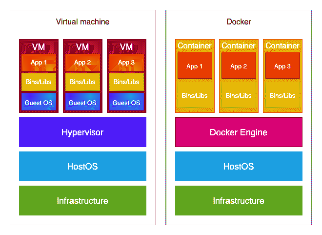
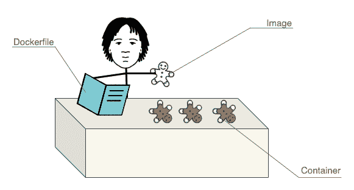

# 初学者码头工人

> 原文：<https://testdriven.io/blog/docker-for-beginners/>

Docker 是开发者用来简化开发和发布应用程序的工具。

根据 Stack Overflow 的 2021 年开发者调查，它是最受欢迎的开发工具之一。

本文将带您了解 Docker 的基础知识，重点关注:

1.  核心 Docker 概念和组件
2.  docker 文件是什么样子，它最常见的指令是做什么的
3.  什么是图像和容器，它们是如何创建的，以及如何管理它们

> 这篇文章可以是只读的。但是，如果您想继续学习，我提供了一个基本的 [HelloWorld 应用程序](https://github.com/testdrivenio/docker-for-beginners)，您可以使用它自己尝试所有的命令。在阅读本文的过程中，您可以随意将其复制下来并运行命令。
> 
> 虽然容器和图像命令独立于应用程序的语言，但 docker 文件中通常有特定于语言的结构。也就是说，尽管所提供的例子是基于 Python 的，但是您可以很容易地将新学到的知识应用到其他语言中。

## 目标

完成本文后，您应该能够:

1.  解释 Docker 是什么以及它是如何工作的
2.  描述并区分以下概念和组件:Docker 引擎、Docker 桌面、Docker 文件、Docker 映像和 Docker 容器
3.  跟随使用 Docker 的更复杂的教程

## 容器和虚拟机

在进入 Docker 之前，理解容器和虚拟机之间的区别是很重要的。

容器和虚拟机是相似的，因为它们允许多个应用程序在同一服务器上运行，具有不同的软件需求——例如，不同的 Python 版本、不同的库等。它们的主要区别在于操作系统。虽然 containers 使用主机的操作系统，但是每个虚拟机在主机操作系统之上都有自己的客户操作系统。

在这张现在几乎很出名的图片中，您可以看到 Docker 与虚拟机的对比:



因此，如果您有一个需要在不同操作系统上运行的应用程序，那么虚拟机是一个不错的选择。但是如果这不是一个要求，Docker 比虚拟机有多种优势:

1.  重量较轻
2.  构建速度更快
3.  可以很容易地跨不同平台移植
4.  资源密集度较低
5.  放大和复制更容易

所有这些优势都是由于 Docker 容器不需要自己的操作系统。

## 码头工人

### 码头引擎

当人们提到 Docker 时，他们通常指的是 [Docker 引擎](https://docs.docker.com/engine/)。

Docker Engine 是用于构建、管理和运行容器化应用程序的底层开源容器化技术。它是一个客户端-服务器应用程序，具有以下组件:

1.  [Docker 守护进程](https://docs.docker.com/engine/reference/commandline/dockerd/)(称为*Docker*)是一个在后台运行的服务，它监听 Docker 引擎 API 请求并管理 Docker 对象，如图像和容器。
2.  Docker 引擎 API 是一个 RESTful API，用于与 Docker 守护进程交互。
3.  [Docker 客户端](https://docs.docker.com/get-started/overview/#the-docker-client)(称为 *docker* )是用于与 Docker 守护进程交互的命令行接口。因此，当您使用类似于`docker build`的命令时，您正在使用 Docker 客户端，它反过来利用 Docker 引擎 API 与 Docker 守护进程进行通信。

### Docker 桌面

这些天，当你试图安装 Docker 时，你会遇到 [Docker 桌面](https://www.docker.com/products/docker-desktop/)。虽然 Docker Engine 包含在 Docker Desktop 中，但重要的是要理解 Docker Desktop 与 Docker Engine 是*而非*相同的。Docker 桌面是 Docker 容器的集成开发环境。它使您的操作系统配置为使用 Docker 变得更加容易。

如果您还没有安装 Docker Desktop，请继续安装:

### Docker 概念

Docker 的核心有三个核心概念:

1.  docker file——一个文本文件，作为你的容器的蓝图。在其中，您定义了 Docker 用来构建映像的指令列表。
2.  [Image](https://docs.docker.com/glossary/#image)-docker file 的只读实现。它由[层](https://docs.docker.com/glossary/#layer)组成——每一层对应 docker 文件中的一行指令。
3.  运行 Docker 映像会产生一个容器，它是应用程序的受控环境。如果我们把它与面向对象编程相提并论，容器就是 Docker 映像的一个实例。



Docker 文件用于创建 Docker 图像，然后用于创建(多个)Docker 容器。

在接下来的几节中，我们将详细研究这三个核心概念。

> 强烈建议在继续之前通读 [Docker 概述](https://docs.docker.com/get-started/overview/)。

## Dockerfile

同样， [Dockerfile](https://docs.docker.com/glossary/#dockerfile) 是一个文本文件，包含 Docker 如何构建映像的指令。默认情况下，Dockerfile 没有扩展名，但是如果需要多个扩展名，您可以添加一个——例如， *Dockerfile.prod* 。

下面是一个非常简单的 Dockerfile 文件的例子:

```
`FROM  python:3.10-slim-buster

WORKDIR  /usr/src/app

ENV  PYTHONDONTWRITEBYTECODE 1
ENV  PYTHONUNBUFFERED 1

RUN  pip install --upgrade pip
COPY  ./requirements.txt .
RUN  pip install -r requirements.txt

COPY  . .

CMD  uvicorn main:app --reload --host 0.0.0.0 --port 8000` 
```

> 这个例子非常简单，所以你很容易理解。它并不遵循[最佳实践](/blog/docker-best-practices/)，但是你应该在你的 does 文件中尝试遵循它们。

Dockerfile 本质上是一个由以下形式的[命令](https://docs.docker.com/engine/reference/builder)组成的列表:`INSTRUCTION arguments`。大多数最广泛使用的命令可以在上面的 Dockerfile 文件中看到。让我们详细看一下每一个...

### 从

所有 docker 文件都包含一个父映像/基础映像，新映像将在此基础上构建。您使用来自指令的[来定义父图像:](https://docs.docker.com/engine/reference/builder/#from)

```
`FROM  python:3.10-slim-buster` 
```

一个有效的 Dockerfile 总是包含一个`FROM`指令。

> 虽然*父*和*基*映像术语有时会互换使用，但它们之间还是有区别的。父映像有自己的父映像。同时，基础映像没有父映像；从`FROM scratch`开始。
> 
> [Alpine image](https://github.com/alpinelinux/docker-alpine/blob/adebcfd075c83ef788b5f071678dcfb8ea118bb3/x86_64/Dockerfile) 是基本图像， [Python:alpine](https://github.com/docker-library/python/blob/9fd031d91ced6ddc1bf1f0f34b893ad82fa0d010/3.11-rc/alpine3.16/Dockerfile) 是父图像(其父(基本)图像实际上是 Alpine 图像)。
> 
> 您可以在自己的上创建一个[基础映像，但是您需要自己的映像的可能性很小。](https://docs.docker.com/develop/develop-images/baseimages/)

您可以在 [Docker Hub](https://docs.docker.com/docker-hub/) 上找到父映像，这是 Docker 的 Docker 映像库/注册表。你可以把它想象成 Docker 图片的 GitHub。你可能会想要使用[官方图片](https://docs.docker.com/docker-hub/official_images/)或来自可靠来源的验证图片，因为它们更可能符合 [Docker 最佳实践](https://docs.docker.com/develop/develop-images/dockerfile_best-practices/)并包含最新的安全修复。

在上面的例子中，我们使用了官方的 [Python 父映像](https://hub.docker.com/_/python)，具体来说就是`python:3.10-slim-buster`。

关于`python:3.10-slim-buster`的说明:

*   这个数字告诉你这个映像使用了哪个版本的技术(例如，`python:3.11.0a5`映像使用 Python 版本 *3.11.0a5* ，而`node:18.9.0`使用节点版本 *18.9.0* )。你可能想要避免任何带有`rc`的版本(例如`python:3.11.0rc2`，因为 rc 意味着*发布候选*。
*   像*巴斯特*、*牛眼*或 *alpine* 这样的名字告诉你这个映像使用了哪些 OS 映像(*巴斯特*和*牛眼*指的是 Debian 版本，而 *alpine* 是一个轻量级 Linux 发行版)。此外，还有像`slim`和`slim-buster`这样的标签，它们使用完整图像的浅色版本。

> 查看[使用小型 Docker 基本映像](/blog/docker-best-practices/#use-small-docker-base-images)了解使用哪种基本映像的最佳实践。

### 奔跑

[RUN](https://docs.docker.com/engine/reference/builder/#run) 指令在当前图像之上的新层中执行任何命令，并提交结果。

示例:

```
`RUN  mkdir /home/app/web

RUN  python manage.py collectstatic --noinput` 
```

### 包封/包围（动词 envelop 的简写）

您使用 [ENV](https://docs.docker.com/engine/reference/builder/#env) 指令来设置一个环境变量。该变量将在所有后续指令中可用。

示例:

```
`ENV  TZ=UTC

ENV  HOME=/home/app` 
```

### CMD 和入口点

有些 Docker 指令非常相似，很难理解为什么需要这两个命令。这些“夫妇”中的一对是 [CMD](https://docs.docker.com/engine/reference/builder/#cmd) 和 [ENTRYPOINT](https://docs.docker.com/engine/reference/builder/#entrypoint) 。

首先，对于相似之处:

*   `CMD`和`ENTRYPOINT`都指定了运行容器时将执行的命令/可执行文件。与立即执行命令的`RUN`不同(结果用于图像层)，编译中的`CMD` / `ENTRYPOINT`命令指定了仅在容器启动时使用的命令。
*   一个 docker 文件中只能有一条`CMD` / `ENTRYPOINT`指令，但它可以指向一个更复杂的可执行文件。

这些指令之间实际上只有一个区别:

*   可以从 Docker CLI 轻松覆盖。

如果您想在启动容器时根据需要灵活地运行不同的可执行文件，那么您应该使用`CMD`。如果您想清楚地传达命令不应该被覆盖并防止意外更改它，请使用`ENTRYPOINT`。

你可能会用其中的一个。如果你不使用它，容器会立即停止，因为它没有存在的理由(如果你也在使用 Docker Compose 的话例外)。

您也可以在同一个 docker 文件中同时使用`CMD`和`ENTRYPOINT`，在这种情况下，`CMD`将作为`ENTRYPOINT`的默认参数。

一个 docker 文件中只能有一个`CMD`指令，但是它可以指向一个更复杂的可执行文件。如果有多个`CMD`，只有最后一个`CMD`会生效。这同样适用于`ENTRYPOINT`指令。

`CMD`指令使用示例:

```
`CMD  gunicorn core.wsgi:application --bind 0.0.0.0:$PORT` 
```

您很有可能将`ENTRYPOINT`参数视为可执行文件，因为应该执行的命令通常不止一行。

`ENTRYPOINT`作为可执行文件使用的例子:

```
`ENTRYPOINT ["./entrypoint.sh"]` 
```

这就是 *entrypoint.sh* 文件的样子:

```
`#!/bin/sh

python manage.py migrate
python manage.py collectstatic --noinput` 
```

> 理解`CMD`和`ENTRYPOINT`的区别很重要。更多信息，请查看[了解 ENTRYPOINT 和 CMD](/blog/docker-best-practices/#understand-the-difference-between-entrypoint-and-cmd) 的区别以及[官方文件](https://docs.docker.com/engine/reference/builder/#understand-how-cmd-and-entrypoint-interact)。

### 添加并复制

另一对相似的是[添加](https://docs.docker.com/engine/reference/builder/#add)和[复制](https://docs.docker.com/engine/reference/builder/#copy)。

这两条指令都将新文件或目录从<src>路径复制到位于<dest>路径的镜像文件系统:</dest></src>

```
`ADD  <src> <dest>
COPY  <src> <dest>` 
```

此外，`ADD`可以从远程文件 URL(例如，它允许直接向映像添加 git 存储库)和直接从压缩的归档文件中复制(`ADD`会自动将内容解压缩到给定的位置)。

你应该[更喜欢 COPY 而不是 ADD](/blog/docker-best-practices/#prefer-copy-over-add) ,除非你特别需要 ADD 的两个附加特性中的一个——例如，下载示例文件或解压压缩文件

`ADD`和`COPY`指令用法示例:

```
`# copy local files on the host to the destination
COPY  /source/path  /destination/path
COPY  ./requirements.txt .

# download external file and copy to the destination
ADD  http://external.file/url  /destination/path
ADD  --keep-git-dir=true https://github.com/moby/buildkit.git#v0.10.1 /buildkit

# copy and extract local compresses files
ADD  source.file.tar.gz /destination/path` 
```

## 图像

一个[图像](https://docs.docker.com/glossary/#image)可能是三个概念中最令人困惑的。您创建了一个 Dockerfile，然后使用了一个容器，但是在这两者之间有一个图像。

因此，图像是 Docker 文件的只读实现，用于创建 Docker 容器。它由[层](https://docs.docker.com/glossary/#layer)组成——docker 文件中的每一行构成一层。你不能直接改变一个图像；你可以通过改变 Dockerfile 文件来改变它。你也不直接使用图像；您使用从图像创建的容器。

最重要的图像相关任务有:

1.  **从 docker 文件构建**图像
2.  **列出**所有构建的图像
3.  **删除**图像

> [从 2017 年](https://github.com/docker/docker.github.io/issues/3031)开始，Docker 从更短的命令(即`docker <command>`)切换到更具描述性的格式(即`docker <top-level command> <command>`)。尽管 Docker 用户被鼓励使用新版本，甚至[官方教程](https://docs.docker.com/get-started/02_our_app/)也使用更短的版本。到目前为止，旧版本仍然有效，我还没有找到任何旧命令被弃用的证据。更重要的是，人们(甚至[文档](https://docs.docker.com/engine/reference/commandline/create/#description))开始称它为“速记”。
> 
> 使用新版本的优点是，您将更好地理解命令处理的是三个概念中的哪一个。这些命令也更容易在文档中找到。旧版本的优点是它更短，文档更全面。
> 
> 在本文中，我将使用命令的描述形式。在本文的结尾，您可以找到所有命令及其简写版本。
> 
> 在这里，你可以找到所有处理图像的新命令。

### 建筑物

要从 docker 文件构建映像，您可以使用 [docker 映像构建](https://docs.docker.com/engine/reference/commandline/image_build/)命令。该命令需要一个参数:上下文的路径或 URL。

此图像将使用当前目录作为上下文:

你可以提供许多[选项](https://docs.docker.com/engine/reference/commandline/image_build/#options)。例如，`-f`用于当您有多个 Dockerfile(如`Dockerfile.prod`)或者`Dockerfile`不在当前目录中(如`docker image build . -f docker/Dockerfile.prod`)时指定一个具体的 docker file。

可能最重要的是用于命名/标记图像的`-t`标签。

当您构建一个映像时，它会被分配一个 ID。与您预期的相反，id 并不是唯一的。如果你想能够方便地引用你的图片，你应该命名/标记它。使用`-t`，你可以给它指定一个名字*和一个标签*。

这里有一个创建三个图像的例子:一个没有使用`-t`，一个指定了名称，一个指定了名称和标签。

```
`$ docker image build .
$ docker image build . -t hello_world
$ docker image build . -t hello_world:67d19c27b60bd782c9d3600ae914604a94bddfd4

$ docker image ls
REPOSITORY           TAG       IMAGE ID       CREATED          SIZE
REPOSITORY    TAG                                        IMAGE ID       CREATED          SIZE
hello_world   67d19c27b60bd782c9d3600ae914604a94bddfd4   e03784993f22   25 minutes ago   181MB
hello_world   latest                                     e03784993f22   26 minutes ago   181MB
<none>        <none>                                     7a615d108866   29 minutes ago   181MB` 
```

注意事项:

1.  对于构建时没有名称或标签的图像，您只能通过其图像 ID 来引用它。不仅很难记住，而且，它可能不是唯一的(如上所述)。你应该避免这种情况。
2.  对于只有名称(`-t hello_world`)的图像，标签自动设置为`latest`。你也应该避免这种情况。更多信息，请查看[版本 Docker 图片](/blog/docker-best-practices/#version-docker-images)。

### 列表

[docker image ls](https://docs.docker.com/engine/reference/commandline/image_ls/) 命令列出了所有构建的图像。

示例:

```
`$ docker image ls

REPOSITORY      TAG       IMAGE ID       CREATED         SIZE
hello_world     latest    c50405e84d39   9 minutes ago   245MB
<none>          <none>    2700a62cd8f1   42 hours ago    245MB
alpine/git      latest    692618a0d74d   2 weeks ago     43.4MB
todo_app        test      999740882932   3 weeks ago     1.03GB` 
```

### 消除

移除图像有两种使用情形:

1.  您想要删除一个或多个选定的图像
2.  您希望删除所有未使用的图像(您不关心具体是哪些图像)

对于第一种情况，你用`docker image rm`；对于第二种情况，您使用`docker image prune`。

#### 去除

[docker image rm](https://docs.docker.com/engine/reference/commandline/image_rm/) 删除并取消标记所选图像。它需要一个参数:对要删除的图像的引用。您可以通过名称或短/长 ID 来引用它。

如果你回想一下图像标记的解释...可以有多个名称不同但 ID 相同的图像。如果您试图通过图像 ID 删除图像，并且存在多个具有该 ID 的图像，您将得到一个`image is referenced in multiple repositories`错误。在这种情况下，您必须通过名称引用来删除它。如果您希望删除具有相同 ID 的所有图像，您可以使用`-f`标志。

不成功和成功的图像移除示例:

```
`$ docker image ls

REPOSITORY   TAG       IMAGE ID       CREATED          SIZE
test1        latest    4659ba97837b   41 seconds ago   245MB
test2        latest    4659ba97837b   41 seconds ago   245MB
test         latest    4659ba97837b   41 seconds ago   245MB

$ docker rmi 4659ba97837b

Error response from daemon: conflict: unable to delete 4659ba97837b (must be forced) - image is referenced in multiple repositories

$ docker rmi test2
Untagged: test2:latest

$ docker image ls

REPOSITORY   TAG       IMAGE ID       CREATED         SIZE
test1        latest    4659ba97837b   4 minutes ago   245MB
test         latest    4659ba97837b   4 minutes ago   245MB` 
```

#### 减少

[docker 图像修剪](https://docs.docker.com/engine/reference/commandline/image_prune/)移除悬空图像。因为`prune`是一个可以用来清理容器、映像、卷和网络的命令，所以这个命令没有更短的版本。如果使用`-a`标志，所有未使用的图像将被删除(即`docker image prune -a`)。

> 悬挂图像是一种未被标记且未被任何容器引用的图像。
> 
> 未使用的图像是与至少一个容器没有关联的图像。

示例:

```
`$ docker image prune

WARNING! This will remove all dangling images.
Are you sure you want to continue? [y/N]

Deleted Images:
deleted: sha256:c9a6625eb29593463ea43aab4053090427bf29cc59bc97917b3298fda6a94e8a
deleted: sha256:284f940f39c3ef5be09440e23fdefdb00df0791344db5c340a9d11979a98039e
deleted: sha256:1934187bf17ccf4e754842a4ceeacf5c14aaa63ba7a04c0c520f53946426c902` 
```

> 还有一些额外的命令，但是您可能不会经常使用它们；在[官方文档](https://docs.docker.com/engine/reference/commandline/image/)中可以看到所有与图像相关的命令。

## 容器

您需要理解的第三个概念是一个[容器](https://docs.docker.com/glossary/#container)，它是您的应用程序的受控环境。当图像在 Docker 引擎上运行时，它就变成了一个容器。这是最终目标:使用 Docker，这样您就可以为您的应用程序提供一个容器。

您可以对容器执行的主要操作有

1.  **运行**一个容器
2.  **列出**所有的容器
3.  **停止**集装箱
4.  **移除**一个容器

> 您可以在[正式文档](https://docs.docker.com/engine/reference/commandline/container/)中看到与容器相关的所有命令。

### 运转

你可以创建一个新的图像容器并运行它，或者你可以 T2 启动一个已经停止的容器。

#### 奔跑

[docker 容器运行](https://docs.docker.com/engine/reference/commandline/container_run/)命令实际上结合了另外两个命令， [docker 容器创建](https://docs.docker.com/engine/reference/commandline/container_create/)和 [docker 容器启动](https://docs.docker.com/engine/reference/commandline/container_start/)。

因此，下面的内容基本上给出了相同的结果:

```
`$ docker container run my_image

# the same as:

$ docker container create my_image
88ce9c60aeabbb970012b5f8dbae6f34581fa61ec20bd6d87c6831fbb5999263
$ docker container start 88ce9c60aeabbb970012b5f8dbae6f34581fa61ec20bd6d87c6831fbb5999263` 
```

您需要提供一个参数:您希望用于容器的图像。

运行 run 命令时，Docker 会在指定的图像上创建一个可写的容器层，然后使用指定的命令(Docker 文件中的`CMD` / `ENTRYPOINT`)启动它。

> 除非存储容器，否则在可写层中所做的更改在删除容器后不会持续。Docker 有两个[选项用于存储数据](https://docs.docker.com/storage/)。

因为您可以覆盖许多默认值，所以有许多选项。你可以在[官方文件](https://docs.docker.com/engine/reference/commandline/run/#options)中看到它们。最重要的选项是`--publish` / `-p`，用于对外发布端口。尽管在技术上可以运行没有端口的容器，但这并不是很有用，因为在容器内部运行的服务在容器外部是不可访问的。创建和运行命令都可以使用`--publish` / `-p`:

下面是一个例子:

```
`$ docker container run -p 8000:8000 my_image` 
```

> 您可以在[官方文档](https://docs.docker.com/config/containers/container-networking/#published-ports)中了解更多关于港口发布的信息。

您可以使用`--detach` / `-d`在分离模式下运行您的容器，这允许您继续使用终端。

如果在分离模式下运行容器，Docker 将只返回容器 ID:

```
`$ docker container run -p 8000:8000 -d my_image

0eb20b715f42bc5a053dc7878b3312c761058a25fc1efaffb7920b3b4e48df03` 
```

默认情况下，您的容器有一个独特、古怪的名称，但是您可以指定自己的名称:

```
`$ docker container run -p 8000:8000 --name my_great_container my_image` 
```

#### 开始

要启动一个停止的或刚刚创建的容器，可以使用 [docker 容器启动](https://docs.docker.com/engine/reference/commandline/container_start/)命令。因为使用这个命令，您将启动一个现有的容器，所以您必须指定*容器*，而不是*图像*(与`docker container run`一样)。

与`docker container run`的另一个区别是`docker container start`默认以分离模式运行容器。你可以用`--attach` / `-a`(与`docker container run -d`相反)来连接它。

示例:

```
`$ docker container start -a reverent_sammet` 
```

### 列表

你可以用 [docker 容器 ls](https://docs.docker.com/engine/reference/commandline/container_ls/) 列出所有正在运行的容器。

示例:

```
`$ docker container ls

CONTAINER ID   IMAGE          COMMAND                  CREATED         STATUS         PORTS                    NAMES
0f21395ec96c   9973e9c65229   "/bin/sh -c 'gunicor…"   6 minutes ago   Up 6 minutes   0.0.0.0:80->8000/tcp     shopping
73bd69d041ae   my_image       "/bin/sh -c 'uvicorn…"   2 hours ago     Up 2 hours     0.0.0.0:8000->8000/tcp   my_great_container` 
```

如果您还想查看停止的集装箱，您可以添加`-a`标志:

```
`$ docker container ls -a

CONTAINER ID   IMAGE          COMMAND                  CREATED              STATUS                     PORTS                    NAMES
0f21395ec96c   9973e9c65229   "/bin/sh -c 'gunicor…"   About a minute ago   Up About a minute          0.0.0.0:80->8000/tcp     shopping
73bd69d041ae   my_image       "/bin/sh -c 'uvicorn…"   2 hours ago          Up 2 hours                 0.0.0.0:8000->8000/tcp   my_great_container
0eb20b715f42   my_image       "/bin/sh -c 'uvicorn…"   2 hours ago          Exited (137) 2 hours ago                            agitated_gagarin
489a02b8cfac   my_image       "/bin/sh -c 'uvicorn…"   2 hours ago          Created                                             vigorous_poincare` 
```

让我们来看看以下各项的输出:

```
`CONTAINER ID   IMAGE          COMMAND                  CREATED         STATUS         PORTS                    NAMES
73bd69d041ae   my_image       "/bin/sh -c 'uvicorn…"   2 hours ago     Up 2 hours     0.0.0.0:8000->8000/tcp   my_great_container` 
```

1.  `CONTAINER ID` ( `73bd69d041ae`)和它的`NAMES` ( `my_great_container`)都是唯一的，所以你可以用它们来访问容器。
2.  `IMAGE` ( `my_image`)告诉您哪个图像用于运行容器。
3.  `CREATED`是不言自明的:当容器被创建时(`2 hours ago`)。
4.  我们已经讨论了为启动容器指定命令的必要性...`COMMAND`告诉你使用了哪个命令(`"/bin/sh -c 'uvicorn…"`)。
5.  当你不知道为什么你的容器不工作时，`STATUS`是有用的(`Up 2 hours`意味着你的容器正在运行，`Exited`或`Created`意味着它不工作)

> 一些信息被截断了。如果想要未截断的版本，添加`--no-trunc`。

### 填料

要停止集装箱，使用[码头集装箱停止](https://docs.docker.com/engine/reference/commandline/container_stop/)。然后返回停止的容器的名称或 ID。

示例:

```
`$ docker container stop my_great_container
my_great_container

$ docker container stop 73bd69d041ae
73bd69d041ae` 
```

> 可以用`docker container start`再次启动容器。

### 消除

与图像类似，要删除容器，您可以:

1.  通过[码头集装箱 rm](https://docs.docker.com/engine/reference/commandline/container_rm/) 移除一个或多个选定的集装箱。
2.  通过 [docker 容器修剪](https://docs.docker.com/engine/reference/commandline/container_prune/)移除所有停止的容器

`docker container rm`的例子:

```
`$ docker container rm festive_euclid
festive_euclid` 
```

`docker container prune`的例子:

```
`$ docker container prune

WARNING! This will remove all stopped containers.
Are you sure you want to continue? [y/N] y
Deleted Containers:
0f21395ec96c28b443bad8aac40197fe0468d24e0eed49e5f56011de1c81b589
80c693693f3d99999925eae5f4bbfc03236cde670db509797d83f50e732fcf31
0eb20b715f42bc5a053dc7878b3312c761058a25fc1efaffb7920b3b4e48df03
1273cf44c551f8ab9302e6d090e3c4e135ca6f7e1ab3d90a62bcbf5e83ba9342` 
```

## 命令

在本文中，我们讨论了相当多的命令。为了帮助你浏览你读到的内容，我准备了一个表格，列出了我们遇到的所有命令。该表包括描述性命令以及速记别名。

| 命令 | 别名 | 使用 |
| --- | --- | --- |
| docker 映像构建 | 码头工人建造 | 从 Dockerfile 文件构建映像 |
| ls 图像坞站 | docker 图像 | 列出图像 |
| docker 图像室 | rmi 坞站 | 移除选定的图像 |
| docker 图像修剪 | 不适用的 | 移除未使用的图像 |
| 码头集装箱运输 | 码头运行 | 创建容器并启动它 |
| 码头集装箱开始 | 码头开始 | 启动现有容器 |
| ls 容器对接器 | docker ps | 列出所有容器 |
| 码头集装箱停靠站 | 码头停车 | 拦住集装箱 |
| 码头集装箱室 | 码头工人室 | 移走容器 |
| 码头集装箱修剪 | 不适用的 | 移除所有停止的容器 |

## 结论

总而言之，Docker 中最基本的概念是 Dockerfile、image 和 container。

使用 Dockerfile 文件作为蓝图，构建一个映像。然后，可以使用这些图像构建其他图像，并且可以在 Docker Hub 上找到这些图像。运行映像会为您的应用程序产生一个受控的环境，称为容器。

这篇文章的目的是向你解释 Docker 的基础知识。如果你想阅读更多的实践教程，你可以查看我们与 Docker 相关的[文章的广泛列表。如果你是一名 Python 开发者，一定要看看](/blog/topics/docker/) [Docker 针对 Python 开发者的最佳实践](/blog/docker-best-practices/)。

### 下一步是什么？

Docker 是一个复杂的系统。这篇文章只是触及了皮毛。在使用 Docker 时，您仍然需要学习大量的概念、特性和工具。这里有一些你可能会很快遇到的:

1.  和 git 一样，Docker 也有一个名为[的忽略文件。dockerignore](https://docs.docker.com/engine/reference/builder/#dockerignore-file) 在这里你可以定义哪些文件和文件夹你不想添加到图像(由于安全，大小等原因。).
2.  正如我在文章中提到的，如果容器被移除，来自容器可写层的数据就不会持久。您可以使用[卷](https://docs.docker.com/storage/volumes/)或[绑定挂载](https://docs.docker.com/storage/bind-mounts/)在主机上存储文件。
3.  如果您的应用程序需要多个容器(例如，如果您的 Django 应用程序使用 Postgres)，您可以使用 [Docker Compose](https://docs.docker.com/compose/) 来简化它们的生命周期。