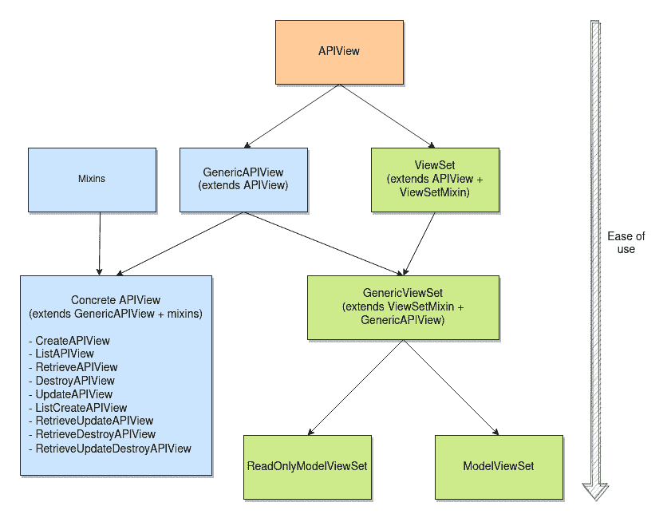

# Django REST 框架视图- APIViews

> 原文：<https://testdriven.io/blog/drf-views-part-1/>

Django REST 框架(DRF)从 Django 的`View`类继承了自己的视图风格。这个由三部分组成的系列深入探讨了 DRF 视图的所有可能性——从一个简单的视图(您需要自己做很多工作)到`ModelViewSet`(您只需几行代码就可以让视图运行起来)。因为视图是建立在彼此之上的，所以本系列也解释了它们是如何交织在一起的。

在这篇文章中，我们看看 DRF 的观点是如何工作的，并了解最基本的观点。

--

**Django REST 框架视图系列:**

1.  [APIViews](/blog/drf-views-part-1/) (本文！)
2.  [通用视图](/blog/drf-views-part-2/)
3.  [视图集](/blog/drf-views-part-3/)

## 目标

完成本文后，您应该能够:

1.  解释 DRF 观点是如何工作的
2.  解释`APIView`类的用途以及它与 Django 的`View`类有何不同
3.  使用基于函数和类的视图
4.  利用策略装饰器(对于基于函数的视图)和策略属性(对于基于类的视图)

## DRF 观点

DRF 视图的基本组件是`APIView`类，它是 Django 的`View`类的子类。

class 是您可能选择在 DRF 应用程序中使用的所有视图的基础。

不管是-

*   基于功能的视图
*   基于类的视图
*   混合蛋白
*   通用视图类
*   viewster

-他们都使用`APIView`类。

正如你从下面的图片中所看到的，你所拥有的关于 DRF 风景的选项相互交织，相互延伸。您可以将视图视为构成更大构建块的构建块。这样，您可能会比其他人更多地使用一些构建块，如 APIViews、concrete views 和(只读)ModelViewSets，如 mixins 和 GenericViewSets。当然，这完全取决于您特定应用的需求。



扩展提供了最大的自由，但也给你留下了更多的工作。如果您需要控制视图的每个方面，或者如果您有非常复杂的视图，这是一个很好的选择。

使用通用视图类，您可以更快地开发，并且仍然对 API 端点有相当多的控制。

使用`ModelViewSet` s，你可以用五行代码得到一个 API(三行用于你的视图，两行用于 URL)。

上面提到的所有视图也可以定制。

至于用什么没有正确的答案。你甚至不用在单个 app 中使用相同的视图类型；你可以随意混合搭配组合。也就是说，可预测是好的，所以只有在绝对必要的时候才偏离视图类型。

> 文档中的 DRF 视图分为三个部分。本系列的文章遵循相同的组织结构。
> 
> 1.  【APIViews 的文档(本系列的第 1 部分)
> 2.  [通用视图的文档](https://www.django-rest-framework.org/api-guide/generic-views/)(本系列的第 2 部分)
> 3.  [视图集的文档](https://www.django-rest-framework.org/api-guide/viewsets/)(本系列的第 3 部分)
> 
> 值得注意的是，官方文档将每个视图视为一个单独的章节，而不是如您所料，从单个*视图*章节的子章节。
> 
> 除了 API 指南，还有涵盖所有三种视图的官方教程:
> 
> 1.  [使用 APIViews 的教程](https://www.django-rest-framework.org/tutorial/2-requests-and-responses/#pulling-it-all-together)
> 2.  [使用通用视图的教程](https://www.django-rest-framework.org/tutorial/3-class-based-views/)
> 3.  [使用视图集的教程](https://www.django-rest-framework.org/tutorial/6-viewsets-and-routers/)

让我们从最基本的视图`APIView`开始，然后解释视图是如何工作的。

## 基于类的视图

[基于类的视图](https://www.django-rest-framework.org/api-guide/views/#class-based-views)扩展了`APIView`类。通过它们，您可以决定如何处理请求，以及您将使用哪些策略属性。

例如，假设您的购物清单 API 有一个`Item`类:

```py
`class Item(models.Model):
    id = models.UUIDField(primary_key=True, default=uuid.uuid4)
    name = models.CharField(max_length=100)
    done = models.BooleanField()` 
```

这是一个允许用户一次删除所有项目的视图:

```py
`from rest_framework.response import Response
from rest_framework.views import APIView

class DeleteAllItems(APIView):

    def delete(self, request):

        Item.objects.all().delete()

        return Response(status=status.HTTP_204_NO_CONTENT)` 
```

这是一个列出所有项目的视图:

```py
`from rest_framework.response import Response
from rest_framework.views import APIView

class ListItems(APIView):

    def get(self, request):
        items = Item.objects.all()
        serializer = ItemSerializer(items, many=True)
        return Response(serializer.data)` 
```

如您所见，对数据库的调用是在处理函数内部完成的。它们是根据请求的 HTTP 方法选择的(例如，GET -> get，DELETE -> delete)。

我们稍后将深入讨论这些视图是如何工作的。

> 正如您所看到的，我们已经在第二个视图中设置了一个序列化程序。序列化程序负责将复杂的数据(例如，查询和模型实例)转换为本机 Python 数据类型，然后再将其呈现为 JSON、XML 或其他内容类型。
> 
> 您可以在有效使用 Django REST 框架序列化程序的文章中了解更多关于 DRF 序列化程序的信息。

### 策略属性

如果您想覆盖基于类的视图的默认设置，您可以使用[策略属性](https://www.django-rest-framework.org/api-guide/views/#api-policy-attributes)。

可以设置的策略属性有:

| 属性 | 使用 | 例子 |
| --- | --- | --- |
| `renderer_classes` | 已确定响应返回的媒体类型 | `JSONRenderer`，`BrowsableAPIRenderer` |
| `parser_classes` | 确定允许不同媒体类型的哪些数据分析器 | `JSONParser`，`FileUploadParser` |
| `authentication_classes` | 确定允许使用哪些身份验证模式来识别用户 | `TokenAuthentication`，`SessionAuthentication` |
| `throttle_classes` | 根据请求率确定是否应该授权请求 | `AnonRateThrottle`，`UserRateThrottle` |
| `permission_classes` | 确定是否应根据用户凭据授权请求 | `IsAuthenticated`，`DjangoModelPermissions` |
| `content_negotiation_class` | 选择资源的多种可能表示形式之一返回给客户机(不太可能需要设置它) | 仅自定义内容协商类 |

> 请务必阅读 Django REST Framework 文章中的[自定义权限类，以了解关于权限类的更多信息。](/blog/custom-permission-classes-drf/)

在下面的示例中，我们使用`permission_classes`和`renderer_classes`策略属性更改了权限以及响应的呈现方式:

```py
`from rest_framework.permissions import IsAuthenticated
from rest_framework.renderers import JSONRenderer
from rest_framework.response import Response
from rest_framework.views import APIView

class ItemsNotDone(APIView):

    permission_classes = [IsAuthenticated]  # policy attribute
    renderer_classes = [JSONRenderer]       # policy attribute

    def get(self, request):

        user_count = Item.objects.filter(done=False).count()
        content = {'not_done': user_count}

        return Response(content)` 
```

## 基于功能的视图

直接实现`APIView`有两种方式:用函数或者用类。如果您正在以函数的形式编写视图，您将需要使用`@api_view`装饰器。

`@api_view`是一个装饰器，它将一个[基于函数的视图](https://www.django-rest-framework.org/api-guide/views/#function-based-views)转换成一个`APIView`子类(从而提供了`Response`和`Request`类)。它将视图允许的方法列表作为参数。

> 好奇 DRF 是如何将基于函数的视图转换成 APIView 子类的吗？
> 
> ```py
> `# https://github.com/encode/django-rest-framework/blob/3.12.4/rest_framework/decorators.py#L16
> 
> def api_view(http_method_names=None):
>     http_method_names = ['GET'] if (http_method_names is None) else http_method_names
>     def decorator(func):
>         WrappedAPIView = type(
>             'WrappedAPIView',
>             (APIView,),
>             {'__doc__': func.__doc__}
>         )
> 
>         # ...
> 
>         return WrappedAPIView.as_view()` 
> ```

这是一个基于函数的视图，与之前编写的基于类的视图一样，用于删除所有项目:

```py
`from rest_framework.decorators import api_view
from rest_framework.response import Response

@api_view(['DELETE'])
def delete_all_items(request):
    Item.objects.all().delete()
    return Response(status=status.HTTP_200_OK)` 
```

这里，我们用`@api_view`装饰器将`delete_all_items`转换成了一个`APIView`子类。只允许使用`DELETE`方法。其他方法将响应“不允许 405 方法”。

忽略类和函数编写方式的差异，我们可以访问相同的属性，因此两个代码片段可以获得相同的结果。

### 政策装饰者

如果想要覆盖基于函数的视图的默认设置，可以使用[策略装饰器](https://www.django-rest-framework.org/api-guide/views/#api-policy-decorators)。您可以使用以下一个或多个选项:

*   `@renderer_classes`
*   `@parser_classes`
*   `@authentication_classes`
*   `@throttle_classes`
*   `@permission_classes`

那些装饰器对应于 APIView 子类。因为`@api_view`装饰器检查是否使用了以下任何一个装饰器，所以需要将它们添加到`api_view`装饰器的下面的**。**

如果我们使用与策略属性相同的例子，我们可以像这样实现装饰器，以获得相同的结果:

```py
`from rest_framework.decorators import api_view, permission_classes, renderer_classes
from rest_framework.permissions import IsAuthenticated
from rest_framework.renderers import JSONRenderer
from rest_framework.response import Response

@api_view(['GET'])
@permission_classes([IsAuthenticated])  # policy decorator
@renderer_classes([JSONRenderer])       # policy decorator
def items_not_done(request):
    user_count = Item.objects.filter(done=False).count()
    content = {'not_done': user_count}

    return Response(content)` 
```

## DRF 观点是如何工作的？

当一个请求命中一个视图时，视图首先初始化一个[请求](https://www.django-rest-framework.org/api-guide/requests/)对象，这是 Django 的一个 DRF 增强的`HttpRequest`。

与 Django 的`HttpRequest`相比，它具有以下优势:

1.  内容根据`Content-Type`头自动解析，并作为`request.data`提供。
2.  它支持上传和修补方法(包括文件上传)。( [Django 只支持`GET`和`POST`方法](https://groups.google.com/g/django-developers/c/dxI4qVzrBY4/m/m_9IiNk_p7UJ)。)
3.  通过临时重写请求上的方法，它根据其他 HTTP 方法检查权限。

在创建了`Request`实例之后，视图使用提供的(或默认的)内容协商器和呈现器将接受的信息存储在请求中。之后，视图执行身份验证，然后检查权限和任何限制。

身份验证本身不会返回任何错误。它只是确定请求的用户是谁。权限和节流检查需要该信息。在检查权限时，如果认证不成功，则引发`NotAuthenticated`异常。如果请求不被允许，就会产生一个`PermissionDenied`异常。在检查节流时，如果请求被节流，就会引发`Throttled`异常，并通知用户需要等待多长时间请求才能被允许。

权限检查实际上有两部分:`check_permissions`和`check_object_permissions`。

在执行视图处理程序之前，调用覆盖一般权限的`check_permissions`。如果你只是扩展`APIView`，`check_object_permissions`，**不会被执行**，除非你明确地调用它。如果您正在使用通用视图或视图集，则为详细视图调用`check_object_permissions`。

> 有关 DRF 权限的更多信息，请查看 Django REST 框架文章中的[权限。](/blog/drf-permissions/)

在身份验证、授权/许可和限制检查之后，视图检查请求方法是否是以下方法之一:

*   得到
*   邮政
*   放
*   修补
*   删除
*   头
*   选择权
*   找到；查出

如果是，它检查请求方法是否对应于视图中的方法并执行它。如果其中一个方法不被允许或者没有在被调用的视图中定义，就会引发`MethodNotAllowed`异常。

`APIView`类中的`dispatch`方法检查方法并根据方法名选择一个处理程序:

```py
`# https://github.com/encode/django-rest-framework/blob/3.12.4/rest_framework/views.py#L485

class APIView(View):

    # ...

    def dispatch(self, request, *args, **kwargs):

        # ...

        try:
            self.initial(request, *args, **kwargs)

            # Get the appropriate handler method
            if request.method.lower() in self.http_method_names:
                handler = getattr(self, request.method.lower(),
                                  self.http_method_not_allowed)
            else:
                handler = self.http_method_not_allowed

            response = handler(request, *args, **kwargs)` 
```

允许的方法在 DRF 没有定义，但取自 Django:

```py
`# https://github.com/django/django/blob/stable/3.2.x/django/views/generic/base.py#L36

class View:
    http_method_names = ['get', 'post', 'put', 'patch', 'delete', 'head', 'options', 'trace']` 
```

最后，返回的不是 Django 的`HttpResponse`，[响应](https://www.django-rest-framework.org/api-guide/responses/)对象。Django 的`HttpResponse`和 DRF 的`Response`的区别在于`Response`是用未呈现的数据初始化的，允许根据客户端请求将内容呈现为多种内容类型。

## 结论

在 DRF 有多种类型的观点。最广泛使用的有:

1.  扩展了`APIView`类的基于类的视图
2.  具体的观点
3.  `ModelViewSet`

它们在可定制性和易用性方面有所不同。对于基于类的视图，您可以在视图内部设置策略(即节流、权限)，对于基于函数的视图，您可以使用 decorators 来设置策略。

扩展`APIView`给了你最大的自由来定制视图本身。

**深入了解 Django REST 框架视图系列:**

1.  [APIViews](/blog/drf-views-part-1/) (本文！)
2.  [通用视图](/blog/drf-views-part-2/)
3.  [视图集](/blog/drf-views-part-3/)