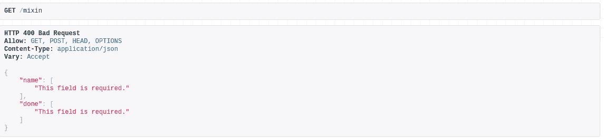
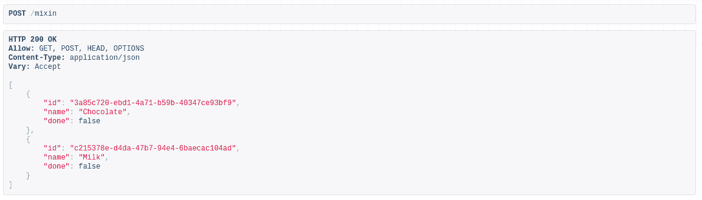
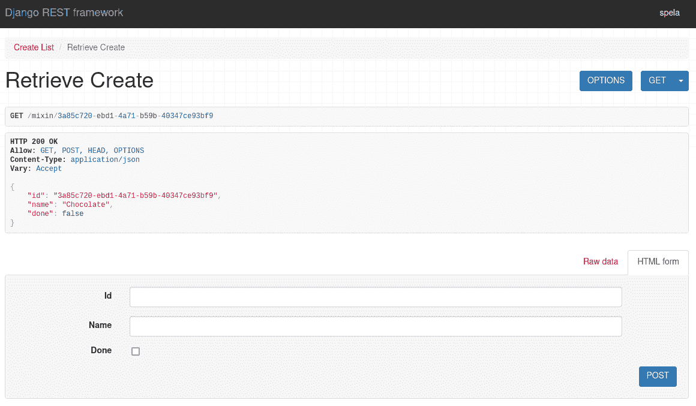
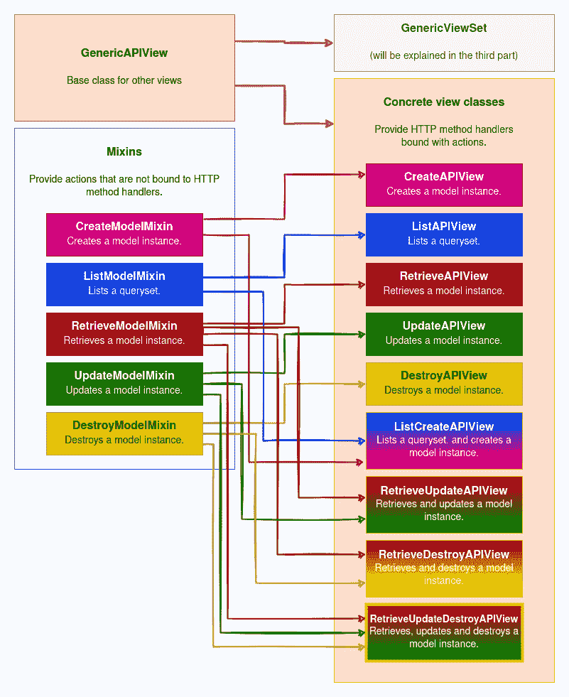

# Django REST 框架视图-通用视图

> 原文：<https://testdriven.io/blog/drf-views-part-2/>

与数据库模型密切相关的常用视图(比如创建一个模型实例、删除它、列出实例等。)已经预先构建在 Django REST 框架视图(DRF)中。这些可重用的行为被称为[通用视图](https://www.django-rest-framework.org/api-guide/generic-views/)。

您可以使用通用视图作为构建块- `GenericAPIView`和 mixins -来创建您自己的视图。或者您可以使用已经结合了`GenericAPIView`和适当的 mixins 的即插即用具体视图。

--

**Django REST 框架视图系列:**

1.  [观点](/blog/drf-views-part-1/)
2.  [通用观点](/blog/drf-views-part-2/)(本文！)
3.  [视图集](/blog/drf-views-part-3/)

## 目标

在本文结束时，你应该能够解释:

1.  什么是混合，以及它们是如何一起创建具体视图的
2.  你使用哪种混音，它们能做什么
3.  如何创建自定义 mixin 以及如何使用它
4.  您可以使用哪些通用视图以及它们的作用

## 通用视图

通用视图是一组常用的模式。

它们构建在`APIView`类的基础上，我们在本系列的[上一篇](/blog/drf-views-part-1/)文章中介绍过这个类。

它们的目的是让您快速构建与您的数据库模型紧密对应的 API 视图，而无需重复自己的工作。

它们由`GenericAPIView`、混合和具体视图组成:

1.  `GenericAPIView`是`APIView`的更加载版本。它本身并不真正有用，但是可以用来创建可重用的动作。
2.  混合是一些常见的行为。没有`GenericAPIView`他们就没用了。
3.  具体视图将`GenericAPIView`与适当的 mixins 结合起来，创建 API 中经常使用的视图。

> DRF 对具体观点使用不同的名称。在文档和代码注释中，它们可以被发现为*具体视图类*、*具体通用视图*或*具体视图*。
> 
> 由于名字如此相似，很容易把它们混淆。通用视图是一个既代表混合视图又代表具体视图的词。当使用通用视图时，**具体视图**可能是您将要使用的级别。

## genericapixivw

[generic piview](https://www.django-rest-framework.org/api-guide/generic-views/#genericapiview)是所有其他通用视图的基类。它提供了[方法](https://www.django-rest-framework.org/api-guide/generic-views/#methods)，如`get_object` / `get_queryset`和`get_serializer`。尽管它被设计为与 mixins 结合使用(因为它是在通用视图中使用的)，但它也可以单独使用:

```py
`from rest_framework.generics import GenericAPIView
from rest_framework.response import Response

class RetrieveDeleteItem(GenericAPIView):

    serializer_class = ItemSerializer
    queryset = Item.objects.all()

    def get(self, request, *args, **kwargs):
        instance = self.get_object()
        serializer = self.get_serializer(instance)
        return Response(serializer.data)

    def delete(self, request, *args, **kwargs):
        instance = self.get_object()
        instance.delete()
        return Response(status=status.HTTP_204_NO_CONTENT)` 
```

延伸`GenericAPIView`时，必须设置`queryset`和`serializer_class`。或者，你可以覆盖`get_queryset()` / `get_serializer_class()`。

因为有几个 mixins 可以和`GenericAPIView`一起使用，所以我不建议单独使用它来重新发明轮子。

## 混合蛋白

[Mixins](https://www.django-rest-framework.org/api-guide/generic-views/#mixins) 提供了一些常见的行为。它们不能单独使用；它们必须与`GenericAPIView`成对出现，以构成功能视图。虽然 mixin 类提供了创建/检索/更新/删除动作，但是您仍然需要将适当的动作绑定到方法上。

可用混音:

| 米欣 | 使用 |
| --- | --- |
| `CreateModelMixin` | 创建模型实例 |
| `ListModelMixin` | 列出查询集 |
| `RetrieveModelMixin` | 检索模型实例 |
| `UpdateModelMixin` | 更新模型实例 |
| `DestroyModelMixin` | 删除模型实例 |

您可以只使用其中的一种，也可以将它们组合起来以达到预期的效果。

下面是一个 mixin 看起来像什么的例子:

```py
`class RetrieveModelMixin:
    """
 Retrieve a model instance.
 """
    def retrieve(self, request, *args, **kwargs):
        instance = self.get_object()
        serializer = self.get_serializer(instance)
        return Response(serializer.data)` 
```

如您所见，`RetrieveModelMixin`提供了一个名为`retrieve`的函数(一个动作),它从数据库中检索一个对象，并以序列化的形式返回它。

### ListModelMixin 和 CreateModelMixin

[ListModelMixin](https://www.django-rest-framework.org/api-guide/generic-views/#listmodelmixin) 实现一个动作，返回 queryset 的序列化表示(可选分页)。

[CreateModelMixin](https://www.django-rest-framework.org/api-guide/generic-views/#createmodelmixin) 实现了一个创建并保存新模型实例的动作。

通常，它们一起用于创建一个列表创建 API 端点:

```py
`from rest_framework import mixins
from rest_framework.generics import GenericAPIView

class CreateListItems(mixins.ListModelMixin, mixins.CreateModelMixin, GenericAPIView):

    serializer_class = ItemSerializer
    queryset = Item.objects.all()

    def get(self, request, *args, **kwargs):
        return self.list(request, *args, **kwargs)

    def post(self, request, *args, **kwargs):
        return self.create(request, *args, **kwargs)` 
```

在`CreateListItems`中，我们使用了`GenericAPIView`提供的`serializer_class`和`queryset`。

我们自己定义了`get`和`post`方法，它们使用了 mixins 提供的`list`和`create`动作:

*   `CreateModelMixin`提供了一个`create`动作
*   `ListModelMixin`提供了一个`list`动作

#### 将操作绑定到方法

你负责将动作绑定到方法上。

理论上来说，这意味着你可以将 POST 方法与 list 动作绑定，将 GET 方法与 create 动作绑定，这样事情就“有点”正常了。

例如:

```py
`from rest_framework import mixins
from rest_framework.generics import GenericAPIView

class CreateList(mixins.ListModelMixin, mixins.CreateModelMixin, GenericAPIView):

    serializer_class = ItemSerializer
    queryset = Item.objects.all()

    def get(self, request, *args, **kwargs):
        return self.create(request, *args, **kwargs)

    def post(self, request, *args, **kwargs):
       return self.list(request, *args, **kwargs)` 
```

这将产生以下结果...

使用 GET 方法:



使用 POST 方法:



**免责声明**:仅仅因为这是可能的，并不意味着我建议你这么做。这样做的唯一目的是向您展示绑定方法和操作是如何工作的。

### RetrieveModelMixin、UpdateModelMixin 和 DestroyModelMixin

[RetrieveModelMixin](https://www.django-rest-framework.org/api-guide/generic-views/#retrievemodelmixin) 、 [UpdateModelMixin](https://www.django-rest-framework.org/api-guide/generic-views/#updatemodelmixin) 和 [DestroyModelMixin](https://www.django-rest-framework.org/api-guide/generic-views/#destroymodelmixin) 都处理单个模型实例。

`RetrieveModelMixin`和`UpdateModelMixin`都返回对象的序列化表示，而`DestroyModelMixin`在成功的情况下返回`HTTP_204_NO_CONTENT`。

你可以使用其中的一种，也可以根据自己的需要组合使用。

在本例中，我们将所有三者结合成一个端点，用于详细视图的每个可能的操作:

```py
`from rest_framework import mixins
from rest_framework.generics import GenericAPIView

class RetrieveUpdateDeleteItem(
    mixins.RetrieveModelMixin,
    mixins.UpdateModelMixin,
    mixins.DestroyModelMixin,
    GenericAPIView
):

    serializer_class = ItemSerializer
    queryset = Item.objects.all()

    def get(self, request, *args, **kwargs):
        return self.retrieve(request, *args, **kwargs)

    def put(self, request, *args, **kwargs):
        return self.update(request, *args, **kwargs)

    def patch(self, request, *args, **kwargs):
        return self.partial_update(request, *args, **kwargs)

    def delete(self, request, *args, **kwargs):
        return self.destroy(request, *args, **kwargs)` 
```

提供的行动:

*   `RetrieveModelMixin`提供了一个`retrieve`动作
*   `UpdateModelMixin`提供`update`和`partial_update`动作
*   `DestroyModelMixin`提供了一个`destroy`动作

因此，使用`RetrieveUpdateDeleteItem`端点，用户可以检索、更新或删除单个项目。

您还可以将视图限制为特定操作:

```py
`from rest_framework import mixins
from rest_framework.generics import GenericAPIView

class RetrieveUpdateItem(mixins.RetrieveModelMixin, mixins.UpdateModelMixin, GenericAPIView):

    serializer_class = ItemSerializer
    queryset = Item.objects.all()

    def get(self, request, *args, **kwargs):
        return self.retrieve(request, *args, **kwargs)

    def put(self, request, *args, **kwargs):
        return self.update(request, *args, **kwargs)` 
```

在这个例子中，我们省略了`DestroyModelMixin`，只使用了来自`UpdateModelMixin`的`update`动作。

#### 分组混合

最好用一个视图来处理所有实例——列出所有实例并添加一个新实例——用另一个视图来处理单个实例——检索、更新和删除单个实例。

也就是说，你可以按照你认为合适的方式组合混音。例如，你*可以*组合`RetrieveModelMixin`和`CreateModelMixin`混音:

```py
`from rest_framework import mixins
from rest_framework.generics import GenericAPIView

class RetrieveCreate(mixins.RetrieveModelMixin, mixins.CreateModelMixin, GenericAPIView):

    serializer_class = ItemSerializer
    queryset = Item.objects.all()

    def get(self, request, *args, **kwargs):
        return self.retrieve(request, *args, **kwargs)

    def post(self, request, *args, **kwargs):
        return self.create(request, *args, **kwargs)` 
```

这会产生一个端点，用于检索单个实例和添加新实例:



**免责声明**:同样，仅仅因为这是可能的，并不意味着这是一个好主意。上述示例仅用于教育目的。我不建议在生产代码中使用它。

### 自定义混音

在现实生活中的应用程序中，您很可能需要一些自定义行为，并且您会希望它出现在不止一个地方。您可以创建一个定制的 mixin，这样您就不需要重复您的代码并将其包含在您的视图类中。

假设您希望根据请求方法使用不同的序列化程序。您可以向视图中添加一些 if 语句，但是这很快就会引起混乱。此外，两个月后，您将添加另一个模型，您需要再次做类似的事情。

在这种情况下，创建一个[自定义 mixin](https://www.django-rest-framework.org/api-guide/generic-views/#creating-custom-mixins) 来将序列化器映射到请求方法是一个好主意:

```py
`class SerializerByMethodMixin:
    def get_serializer_class(self, *args, **kwargs):

        return self.serializer_map.get(self.request.method, self.serializer_class)` 
```

这里，我们重写了来自`GenericAPIView`类的`get_serializer_class`方法。

也许你想覆盖其他方法，比如`get_queryset`或`get_object`？看一看[generic piview](https://github.com/encode/django-rest-framework/blob/3.12.4/rest_framework/generics.py#L24)类中的代码，DRF 的创建者在那里指定了您可能想要覆盖的方法。

现在您只需要将`SerializerByMethodMixin`添加到您的视图中，并设置`serializer_map`属性:

```py
`class ListCreateItems(SerializerByMethodMixin, ListCreateAPIView):

    queryset = Item.objects.all()
    serializer_map = {
        'GET': GetItemSerializer,
        'POST': PostItemSerializer,
    }` 
```

> 确保将 mixin 作为第一个参数，这样它的方法就不会被覆盖(高优先级优先)。

### 自定义基类

如果您多次对同一类型的视图使用 mixin，您甚至可以创建一个[自定义基类](https://www.django-rest-framework.org/api-guide/generic-views/#creating-custom-base-classes)。

例如:

```py
`class BaseCreateListView((MixinSingleOrListSerializer, ListCreateAPIView)):
    pass` 
```

## 具体的观点

[具体观点](https://www.django-rest-framework.org/api-guide/generic-views/#concrete-view-classes)使用`APIView`完成了大部分我们需要自己完成的工作。他们使用 mixins 作为基本的构建模块，将构建模块与`GenericAPIView`结合起来，并将动作绑定到方法上。

快速看一下其中一个具体视图类的代码，`ListCreateAPIView`:

```py
`# https://github.com/encode/django-rest-framework/blob/3.12.4/rest_framework/generics.py#L232

class ListCreateAPIView(mixins.ListModelMixin,
                        mixins.CreateModelMixin,
                        GenericAPIView):

    def get(self, request, *args, **kwargs):
        return self.list(request, *args, **kwargs)

    def post(self, request, *args, **kwargs):
        return self.create(request, *args, **kwargs)` 
```

正如您所看到的，它相当简单，看起来非常类似于我们在使用 mixins 时自己创建的东西。它们扩展了适当的 mixins 和`GenericAPIView`。它们还定义了每个相关的方法，并将适当的操作绑定到这些方法上。

除非你需要高度定制的行为，否则如果你使用的是通用视图，这是一个合适的视图。

共有九个类，每个类都提供了您可能需要的行为组合:

| 班级 | 使用 | 方法处理程序 | 扩展混合 |
| --- | --- | --- | --- |
| `CreateAPIView` | 仅创建 | `post` | `CreateModelMixin` |
| `ListAPIView` | 对于多个实例为只读 | `get` | `ListModelMixin` |
| `RetrieveAPIView` | 对于单个实例为只读 | `get` | `RetrieveModelMixin` |
| `DestroyAPIView` | 删除-仅用于单个实例 | `delete` | `DestroyModelMixin` |
| `UpdateAPIView` | 仅更新单个实例 | `put`，`patch` | `UpdateModelMixin` |
| `ListCreateAPIView` | 多个实例的读写 | `get`，`post` | `CreateModelMixin`，`ListModelMixin` |
| `RetrieveUpdateAPIView` | 单个实例的读取-更新 | `get`、`put`、`patch` | `RetrieveModelMixin`，`UpdateModelMixin` |
| `RetrieveDestroyAPIView` | 单个实例的读-删除 | `get`，`delete` | `RetrieveModelMixin`，`DestroyModelMixin` |
| `RetrieveUpdateDestroyAPIView` | 单个实例的读取-更新-删除 | `get`、`put`、`patch`、`delete` | `RetrieveModelMixin`、`UpdateModelMixin`、`DestroyModelMixin` |

下面是另一个有用的表格，显示了特定的方法处理程序映射回哪个类:

| 班级 | `get` | `post` | `put` / `patch` | `delete` |
| --- | --- | --- | --- | --- |
| `CreateAPIView` |  | ✓ |  |  |
| `ListAPIView` | ✓ |  |  |  |
| `RetrieveAPIView` | ✓ |  |  |  |
| `DestroyAPIView` |  |  |  | ✓ |
| `UpdateAPIView` |  |  | ✓ |  |
| `ListCreateAPIView` | ✓ | ✓ |  |  |
| `RetrieveUpdateAPIView` | ✓ |  | ✓ |  |
| `RetrieveDestroyAPIView` | ✓ |  |  | ✓ |
| `RetrieveUpdateDestroyAPIView` | ✓ |  | ✓ | ✓ |

所有从具体视图扩展的类都需要:

*   查询集
*   序列化类

此外，您可以提供策略属性，如本系列的第一篇[文章](/blog/drf-views-part-1/)中所述。

接下来，我们将看看 9 个具体视图中每一个的实例。

### CreateAPIView

在这里，通过扩展`CreateAPIView`，我们创建了一个端点，用户可以在这里创建一个新项目:

```py
`from rest_framework.generics import CreateAPIView
from rest_framework.permissions import IsAdminUser

class CreateItem(CreateAPIView):
    permission_classes = [IsAdminUser]

    queryset = Item.objects.all()
    serializer_class = ItemSerializer` 
```

我们添加了一个策略属性，以便只有管理员才能访问端点。

### listapixivw

这里，我们扩展了`ListAPIView`来创建一个端点，其中列出了所有“未完成”的项目:

```py
`from rest_framework.generics import ListAPIView

class ItemsNotDone(ListAPIView):

    queryset = Item.objects.all().filter(done=False)
    serializer_class = ItemSerializer` 
```

我们的 queryset 是基于`done`字段过滤的。它不包含任何附加策略，因此任何用户都可以访问它。

请记住，这些视图中的每一个都需要单独包含在 URL 中:

```py
`# urls.py

from django.urls import path
from .views import ListItems

urlpatterns = [
   path('all-items', ListItems.as_view())
]` 
```

### retrieveapixivw

当`ListAPIView`返回所有项目的列表时，`RetrieveAPIView`用于检索单个项目:

```py
`from rest_framework.generics import RetrieveAPIView

class SingleItem(RetrieveAPIView):

    queryset = Item.objects.all()
    serializer_class = ItemSerializer` 
```

`RetrieveAPIView`的示例 *urls.py* (以及单个实例的其他视图):

```py
`from django.urls import path
from .views import SingleItem
>
urlpatterns = [
   path('items/<pk>', SingleItem.as_view())
]` 
```

### 毁灭视图

扩展`DestroyAPIView`创建一个端点，唯一的目的是删除一个条目:

```py
`from rest_framework.generics import DestroyAPIView
from rest_framework.permissions import IsAuthenticated

class DeleteItem(DestroyAPIView):
    permission_classes = [IsAuthenticated]

    queryset = Item.objects.all()
    serializer_class = ItemSerializer` 
```

只有经过认证的用户才能访问。

### updateapixivw

用于更新单个项目的端点:

```py
`from rest_framework.generics import UpdateAPIView
from rest_framework.permissions import IsAuthenticated
from rest_framework.throttling import UserRateThrottle

class UpdateItem(UpdateAPIView):

    permission_classes = [IsAuthenticated]
    throttle_classes = [UserRateThrottle]

    queryset = Item.objects.all()
    serializer_class = ItemSerializer` 
```

这里，使用策略属性，我们限制了请求的数量，并将端点限制为经过身份验证的用户。

### listcreateapixivw

`ListCreateAPIView`是第一个具有多个责任的具体视图类，列出了所有项目**和**创建一个新项目:

```py
`from rest_framework.generics import ListCreateAPIView

class ListCreateItems(ListCreateAPIView):

    authentication_classes = [TokenAuthentication]

    queryset = Item.objects.all()
    serializer_class = ItemSerializer` 
```

在本例中，用户使用令牌进行身份验证。

### retrieveupdateapixivw

扩展`RetrieveUpdateAPIView`为检索**和更新单个项目的**创建一个端点:

```py
`from rest_framework.generics import RetrieveUpdateAPIView

class RetrieveUpdateItem(RetrieveUpdateAPIView):
    renderer_classes = [JSONRenderer]

    queryset = Item.objects.all()
    serializer_class = ItemSerializer` 
```

这里，我们使用策略属性以 JSON 格式返回数据。

### 检索 DestroyAPIView

在这里，通过扩展`RetrieveDestroyAPIView`，我们创建了一个端点来检索**和删除单个项目的**:

```py
`from rest_framework.generics import RetrieveDestroyAPIView

class RetrieveDeleteItem(RetrieveDestroyAPIView):

    queryset = Item.objects.all()
    serializer_class = ItemSerializer` 
```

### RetrieveUpdateDestroyAPIView

这里，通过扩展`RetrieveUpdateDestroyAPIView`，我们创建了一个端点，在这里可以访问单个项目的所有可能的操作:检索、(部分)更新和删除。

```py
`from rest_framework.generics import RetrieveUpdateDestroyAPIView

class RetrieveUpdateDeleteItem(RetrieveUpdateDestroyAPIView):

    queryset = Item.objects.all()
    serializer_class = ItemSerializer` 
```

## 结论

通用视图提供了各种预构建的解决方案。

如果你没有特别的要求，具体的观点(即`RetrieveDestroyAPIView`)是一个很好的方法。如果您需要不太严格的东西，您可以使用具体的类作为构建块- `GenericAPIView`和 mixins(例如，`UpdateModelMixin`)。这仍然会比仅仅使用`APIView`类节省一些工作。



**Django REST 框架视图系列:**

1.  [观点](/blog/drf-views-part-1/)
2.  [通用观点](/blog/drf-views-part-2/)(本文！)
3.  [视图集](/blog/drf-views-part-3/)