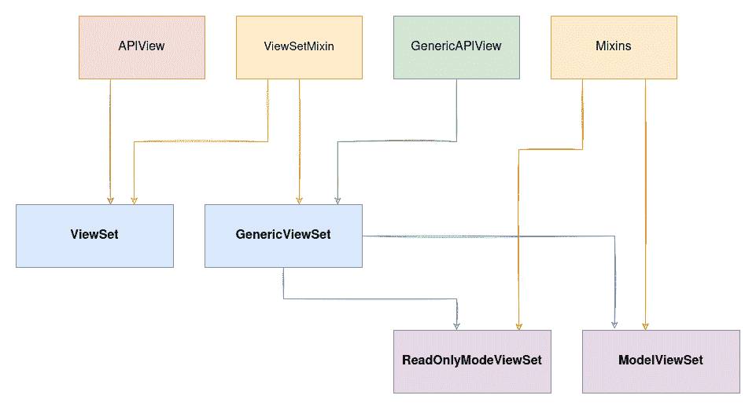
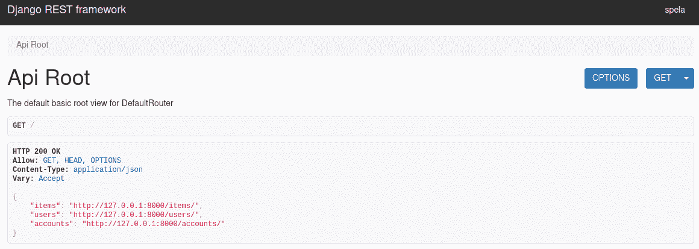

# Django REST 框架视图-视图集

> 原文：<https://testdriven.io/blog/drf-views-part-3/>

到目前为止，我们已经介绍了使用 [APIViews](/blog/drf-views-part-1/) 和[通用视图](/blog/drf-views-part-2/)创建单独的视图。通常，将一组相关视图的视图逻辑合并到一个类中是有意义的。这可以在 Django REST 框架(DRF)中通过扩展一个[视图集](https://www.django-rest-framework.org/api-guide/viewsets/)类来实现。

视图集类消除了对额外代码行的需求，当与[路由器](https://www.django-rest-framework.org/api-guide/routers/)结合使用时，有助于保持 URL 的一致性。

--

**Django REST 框架视图系列:**

1.  [观点](/blog/drf-views-part-1/)
2.  [通用视图](/blog/drf-views-part-2/)
3.  [ViewSets](/blog/drf-views-part-3/) (本文！)

## viewster

[视图集](https://www.django-rest-framework.org/api-guide/viewsets/#viewsets)是一种基于类的视图。

它不像`.get()`和`.post()`那样提供方法处理程序，而是提供动作，像`.list()`和`.create()`。

视图集最显著的优点是 URL 构造是自动处理的(使用路由器类)。这有助于整个 API 中 URL 约定的一致性，并最小化您需要编写的代码量。

从最基本到最强大，共有四种类型的视图集:

1.  视图集
2.  GenericViewSet
3.  ReadOnlyModelViewSet
4.  模型视图集

它们大多是基于您在本系列的前一篇[文章](/blog/drf-views-part-2/)中了解的类构建的:



是一个所有“奇迹发生”的班级。这是所有四个视图集共享的唯一一个类。它覆盖了`as_view`方法，并将该方法与适当的动作相结合。

| 方法 | 列表/详细信息 | 行动 |
| --- | --- | --- |
| `post` | 目录 | `create` |
| `get` | 目录 | `list` |
| `get` | 详述 | `retrieve` |
| `put` | 详述 | `update` |
| `patch` | 详述 | `partial_update` |
| `delete` | 详述 | `destroy` |

## 视图集类

`ViewSet`类利用了`APIView`类的优势。默认情况下，它不提供任何操作，但是您可以使用它来创建自己的视图集:

```
`from django.shortcuts import get_object_or_404
from rest_framework.response import Response
from rest_framework.viewsets import ViewSet

class ItemViewSet(ViewSet):
    queryset = Item.objects.all()

    def list(self, request):
        serializer = ItemSerializer(self.queryset, many=True)
        return Response(serializer.data)

    def retrieve(self, request, pk=None):
        item = get_object_or_404(self.queryset, pk=pk)
        serializer = ItemSerializer(item)
        return Response(serializer.data)` 
```

这个视图集提供了`GET` HTTP 方法，映射到一个`list`动作(用于列出所有实例)和一个`retrieve`动作(用于检索单个实例)。

### 行动

默认情况下，路由器类[处理以下动作](https://www.django-rest-framework.org/api-guide/viewsets/#viewset-actions):

1.  `list`
2.  `create`
3.  `retrieve`(需要 pk)
4.  `update`(需要 pk)
5.  `partial_update`(需要 pk)
6.  `destroy`(需要 pk)

您还可以用`@action`装饰器创建定制动作。

例如:

```
`from django.shortcuts import get_object_or_404
from rest_framework.response import Response
from rest_framework.viewsets import ViewSet

class ItemsViewSet(ViewSet):

    queryset = Item.objects.all()

    def list(self, request):
        serializer = ItemSerializer(self.queryset, many=True)
        return Response(serializer.data)

    def retrieve(self, request, pk=None):
        item = get_object_or_404(self.queryset, pk=pk)
        serializer = ItemSerializer(item)
        return Response(serializer.data)

    @action(detail=False, methods=['get'])
    def items_not_done(self, request):
        user_count = Item.objects.filter(done=False).count()

        return Response(user_count)` 
```

这里，我们定义了一个名为`items_not_done`的定制动作。

允许的 HTTP 方法是 GET。

> 我们已经在这里显式地设置了它，但是缺省情况下允许 GET。

`methods`参数是可选的，而`detail`参数不是。如果动作针对单个对象，则`detail`参数应设置为`True`，如果针对所有对象，则应设置为`False`。

默认情况下，可通过以下 URL 访问此操作:`/items_not_done`。要更改这个 URL，您可以在装饰器中设置`url_path`参数。

> 如果你已经使用视图集有一段时间了，你可能会记得`@list_route`和`@detail_route`装饰器而不是`@action`。从[3.9 版](https://www.django-rest-framework.org/community/3.8-announcement/#action-decorator-replaces-list_route-and-detail_route)开始，这些已经被弃用。

## 处理 URL

尽管可以像映射其他视图一样映射视图集的 URL，但这不是视图集的重点。

视图集没有使用 Django 的 [urlpatterns](https://docs.djangoproject.com/en/3.2/topics/http/urls/#syntax-of-the-urlpatterns-variable) ，而是附带了一个路由器类，可以自动生成 URL 配置。

DRF 有两个开箱即用的路由器:

1.  [简单路由器](https://www.django-rest-framework.org/api-guide/routers/#simplerouter)
2.  [默认路由器](https://www.django-rest-framework.org/api-guide/routers/#defaultrouter)

它们之间的主要区别是 DefaultRouter 包括一个默认的 API 根视图:



默认的 API 根视图列出了超链接列表视图，这使得在应用程序中导航更加容易。

> 也可以创建一个[定制路由器](https://www.django-rest-framework.org/api-guide/routers/#custom-routers)。

路由器也可以与 urlpatterns 结合使用:

```
`# urls.py

from django.urls import path, include
from rest_framework import routers

from .views import ChangeUserInfo, ItemsViewSet

router = routers.DefaultRouter()
router.register(r'custom-viewset', ItemsViewSet)

urlpatterns = [
    path('change-user-info', ChangeUserInfo.as_view()),
    path('', include(router.urls)),
]` 
```

这里，我们创建了一个路由器(使用 DefaultRouter，因此我们获得了默认的 API 视图)并向它注册了`ItemsViewSet`。创建路由器时，必须提供两个参数:

1.  视图的 URL 前缀
2.  视图集本身

然后，我们把路由器包含在`urlpatterns`里面。

> 这不是包含路由器的唯一方式。更多选项请参考[路由器](https://www.django-rest-framework.org/api-guide/routers/)文档。

在开发过程中，在`http://127.0.0.1:8000/custom-viewset/`可以访问项目列表，在`http://127.0.0.1:8000/custom-viewset/{id}/`可以访问单个项目。

因为我们只在我们的`ItemsViewSet`中定义了`list`和`retrieve`动作，所以唯一允许的方法是 GET。

我们的自定义操作将在`http://127.0.0.1:8000/custom-viewset/items_not_done/`可用。

路由器是如何将方法映射到操作的:

```
`# https://github.com/encode/django-rest-framework/blob/3.12.4/rest_framework/routers.py#L83

routes = [
        # List route.
        Route(
            url=r'^{prefix}{trailing_slash}$',
            mapping={
                'get': 'list',
                'post': 'create'
            },
            name='{basename}-list',
            detail=False,
            initkwargs={'suffix': 'List'}
        ),
        # Dynamically generated list routes. Generated using
        # @action(detail=False) decorator on methods of the viewset.
        DynamicRoute(
            url=r'^{prefix}/{url_path}{trailing_slash}$',
            name='{basename}-{url_name}',
            detail=False,
            initkwargs={}
        ),
        # Detail route.
        Route(
            url=r'^{prefix}/{lookup}{trailing_slash}$',
            mapping={
                'get': 'retrieve',
                'put': 'update',
                'patch': 'partial_update',
                'delete': 'destroy'
            },
            name='{basename}-detail',
            detail=True,
            initkwargs={'suffix': 'Instance'}
        ),
        # Dynamically generated detail routes. Generated using
        # @action(detail=True) decorator on methods of the viewset.
        DynamicRoute(
            url=r'^{prefix}/{lookup}/{url_path}{trailing_slash}$',
            name='{basename}-{url_name}',
            detail=True,
            initkwargs={}
        ),
    ]` 
```

## GenericViewSet

当`ViewSet`延伸`APIView`时，`GenericViewSet`延伸`GenericAPIView`。

[GenericViewSet](https://www.django-rest-framework.org/api-guide/viewsets/#genericviewset) 类提供了通用视图行为的基本集合以及`get_object`和`get_queryset`方法。

这就是`ViewSet`和`GenericViewSet`类的创建方式:

```
`# https://github.com/encode/django-rest-framework/blob/3.12.4/rest_framework/viewsets.py#L210
class ViewSet(ViewSetMixin, views.APIView):
   pass

# https://github.com/encode/django-rest-framework/blob/3.12.4/rest_framework/viewsets.py#L217
class GenericViewSet(ViewSetMixin, generics.GenericAPIView):
   pass` 
```

如你所见，它们都扩展了`ViewSetMixin`和`APIView`或`GenericAPIView`。除此之外，没有额外的代码。

要使用一个`GenericViewSet`类，您需要覆盖该类，或者使用 mixin 类，或者显式定义动作实现，以获得想要的结果。

### 将 GenericViewSet 与 Mixins 一起使用

```
`from rest_framework import mixins, viewsets

class ItemViewSet(mixins.ListModelMixin, mixins.RetrieveModelMixin, viewsets.GenericViewSet):

    serializer_class = ItemSerializer
    queryset = Item.objects.all()` 
```

这个`GenericViewSet`与`ListModelMixin`和`RetrieveModelMixin`混音组合在一起。因为这是一个视图集，路由器负责 URL 映射，mixins 为列表和细节视图提供动作。

### 通过显式操作实现使用 genericviewset

使用 mixins 时，只需要提供`serializer_class`和`queryset`属性；否则，您将需要自己实现这些操作。

为了强调`GenericViewSet`相对于`ViewSet`的优势，我们将使用一个稍微复杂一点的例子:

```
`from rest_framework import status
from rest_framework.permissions import DjangoObjectPermissions
from rest_framework.response import Response
from rest_framework.viewsets import GenericViewSet

class ItemViewSet(GenericViewSet):
    serializer_class = ItemSerializer
    queryset = Item.objects.all()
    permission_classes = [DjangoObjectPermissions]

    def create(self, request, *args, **kwargs):
        serializer = self.get_serializer(data=request.data)
        serializer.is_valid(raise_exception=True)
        serializer.save(serializer)

        return Response(serializer.data, status=status.HTTP_201_CREATED)

    def list(self, request):
        serializer = self.get_serializer(self.get_queryset(), many=True)
        return self.get_paginated_response(self.paginate_queryset(serializer.data))

    def retrieve(self, request, pk):
        item = self.get_object()
        serializer = self.get_serializer(item)
        return Response(serializer.data)

    def destroy(self, request):
        item = self.get_object()
        item.delete()
        return Response(status=status.HTTP_204_NO_CONTENT)` 
```

这里，我们创建了一个允许`create`、`list`、`retrieve`和`destroy`动作的视图集。

由于我们延长了`GenericViewSet`，我们:

1.  使用了`DjangoObjectPermissions`并且不需要自己检查对象权限
2.  返回了分页的响应

## 模型视图集

[ModelViewSet](https://www.django-rest-framework.org/api-guide/viewsets/#modelviewset) 提供了默认的`create`、`retrieve`、`update`、`partial_update`、`destroy`和`list`动作，因为它使用了`GenericViewSet`和所有可用的混音。

`ModelViewSet`是所有视图中最容易使用的。您只需要三行代码:

```
`class ItemModelViewSet(ModelViewSet):
    serializer_class = ItemSerializer
    queryset = Item.objects.all()` 
```

然后，在您将视图注册到路由器之后，您就可以开始了！

```
`# urls.py

from django.urls import path, include
from rest_framework import routers

from .views import ChangeUserInfo, ItemsViewSet, ItemModelViewSet

router = routers.DefaultRouter()
router.register(r'custom-viewset', ItemsViewSet)
router.register(r'model-viewset', ItemModelViewSet) # newly registered ViewSet

urlpatterns = [
    path('change-user-info', ChangeUserInfo.as_view()),
    path('', include(router.urls)),
]` 
```

现在，您可以:

1.  创建一个项目并列出所有项目
2.  检索、更新和删除单个项目

## ReadOnlyModelViewSet

[ReadOnlyModelViewSet](https://www.django-rest-framework.org/api-guide/viewsets/#readonlymodelviewset) 是一个视图集，通过将`GenericViewSet`与`RetrieveModelMixin`和`ListModelMixin`混合在一起，只提供`list`和`retrieve`动作。

像`ModelViewSet`，`ReadOnlyModelViewSet`只需要`queryset`和`serializer_class`属性就可以工作:

```
`from rest_framework.viewsets import ReadOnlyModelViewSet

class ItemReadOnlyViewSet(ReadOnlyModelViewSet):

    serializer_class = ItemSerializer
    queryset = Item.objects.all()` 
```

## API 视图、通用视图和视图集摘要

系列摘要:

*   第一篇[第二篇]((/blog/drf-views-part-1/))[第二篇]((/blog/drf-views-part-2/))文章分别介绍了如何通过扩展`APIView`和通用视图来创建 API 视图。
*   在本文中，我们介绍了如何用视图集创建 API 视图。

为了深入理解这些视图，我们覆盖了所有的构建模块；但是，在现实生活中，您最有可能使用以下方法之一:

1.  `APIView`
2.  具体的观点
3.  `ModelViewSet` / `ReadOnlyModelViewSet`

为了快速看出它们之间的区别，让我们来看一下这三者实现相同目标的例子。

三个端点:

1.  列出所有项目
2.  创建新项目
3.  检索、更新和删除单个项目

以下是如何通过扩展 **APIView** 来实现这一点:

```
`class ItemsList(APIView):

    def get(self, request, format=None):
        items = Item.objects.all()
        serializer = ItemSerializer(items, many=True)
        return Response(serializer.data)

    def post(self, request, format=None):
        serializer = ItemSerializer(data=request.data)
        if serializer.is_valid():
            serializer.save()
            return Response(serializer.data, status=status.HTTP_201_CREATED)
        return Response(serializer.errors, status=status.HTTP_400_BAD_REQUEST)

class ItemDetail(APIView):

    def get(self, request, pk, format=None):
        item = get_object_or_404(Item.objects.all(), pk=pk)
        serializer = ItemSerializer(item)

        return Response(serializer.data)

    def put(self, request, pk, format=None):
        item = get_object_or_404(Item.objects.all(), pk=pk)
        serializer = ItemSerializer(item, data=request.data)
        if serializer.is_valid():
            serializer.save()
            return Response(serializer.data)
        return Response(serializer.errors, status=status.HTTP_400_BAD_REQUEST)

    def delete(self, request, pk, format=None):
        item = get_object_or_404(Item.objects.all(), pk=pk)
        item.delete()
        return Response(status=status.HTTP_204_NO_CONTENT)` 
```

下面是你如何用**具体的通用视图**做同样的事情:

```
`class ItemsListGeneric(ListCreateAPIView):
    queryset = Item.objects.all()
    serializer_class = ItemSerializer

class ItemDetailGeneric(RetrieveUpdateDestroyAPIView):
    queryset = Item.objects.all()
    serializer_class = ItemSerializer` 
```

以下是您需要使用`ModelViewSet`的代码行:

```
`class ItemsViewSet(ModelViewSet):
    serializer_class = ItemSerializer
    queryset = Item.objects.all()` 
```

最后，下面是各个 URL 配置的样子:

```
`# APIView

from django.urls import path
from views import ItemsList, ItemDetail

urlpatterns = [
    path('api-view', ItemsList.as_view()),
    path('api-view/<pk>', ItemDetail.as_view()),
]

# generic views

from django.urls import path,
from views import ItemsListGeneric, ItemDetailGeneric

urlpatterns = [
    path('generic-view', ItemsListGeneric.as_view()),
    path('generic-view/<pk>', ItemDetailGeneric.as_view()),
]

# ViewSet

from django.urls import path, include
from rest_framework import routers
from views import ItemsViewSet

router = routers.DefaultRouter()
router.register(r'viewset', ItemsViewSet)

urlpatterns = [
    path('', include(router.urls)),
]` 
```

## 结论

DRF 的观点是一张复杂纠结的网:


使用它们有三种核心方法，并有几种子可能性:

1.  扩展`APIView`类
    *   装饰器也可以使用基于函数的视图
2.  使用通用视图
    *   `GenericAPIView`是基地
    *   `GenericAPIView`可与一种或多种 mixins 结合
    *   具体视图类已经涵盖了以所有广泛使用的方式将`GenericAPIView`与 mixins 结合起来
3.  将所有可能的动作组合成一个类
    *   `GenericViewSet`比基础`ViewSet`更强大
    *   `ModelViewSet`和`ReadOnlyModelViewSet`用最少的代码提供最多的功能

以上所有这些都提供了允许轻松定制的挂钩。

大多数时候，您会发现自己在使用`APIView`(一个具体的视图类)或`(ReadOnly)ModelViewSet`。也就是说，当您试图开发一个定制的解决方案时，理解视图是如何构建的以及祖先的优点是很有帮助的。

**Django REST 框架视图系列:**

1.  [观点](/blog/drf-views-part-1/)
2.  [通用视图](/blog/drf-views-part-2/)
3.  [ViewSets](/blog/drf-views-part-3/) (本文！)