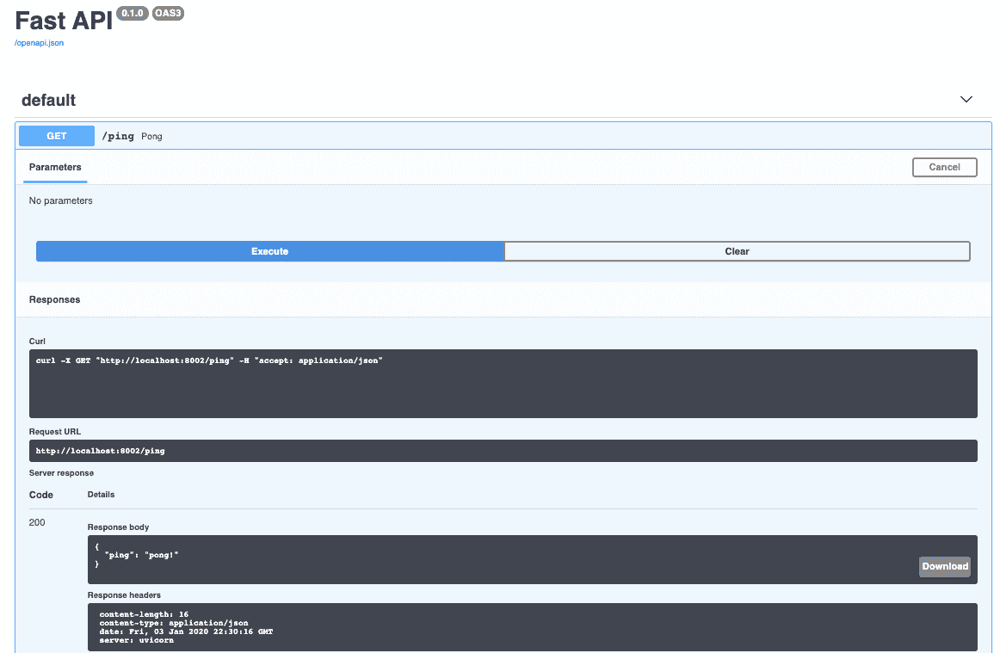

# 用 FastAPI 和 Pytest 开发和测试异步 API

> 原文：<https://testdriven.io/blog/fastapi-crud/>

本教程着眼于如何使用[测试驱动开发](/test-driven-development/) (TDD)用 FastAPI、Postgres、pytest 和 Docker 开发和测试一个异步 API。我们还将使用 Databases 包与 Postgres 进行异步交互。

*依赖关系*:

1.  FastAPI v0.88.0
2.  文档 v20.10.21
3.  python 3 . 11 . 0 版
4.  pytest v7.2.0
5.  数据库版本 0.6.2

## 目标

学完本教程后，您应该能够:

1.  用 Python 和 FastAPI 开发异步 RESTful API
2.  实践测试驱动的开发
3.  用 pytest 测试 FastAPI 应用程序
4.  与 Postgres 数据库异步交互
5.  将 FastAPI 和 Postgres 封装到 Docker 容器中
6.  用 pytest 参数化测试函数和测试中的模拟功能
7.  用 Swagger/OpenAPI 记录 RESTful API

## FastAPI

FastAPI 是一个现代的、高性能的、内置电池的 Python web 框架，非常适合构建 RESTful APIs。它可以处理同步和异步请求，并内置了对数据验证、JSON 序列化、身份验证和授权以及 [OpenAPI](https://swagger.io/docs/specification/about/) (撰写本文时版本为 [3.0.2](https://github.com/tiangolo/fastapi/blob/0.88.0/fastapi/applications.py#L106) )文档的支持。

亮点:

1.  受 Flask 的启发，它有一种轻量级微框架的感觉，支持类似 Flask 的 route decorators。
2.  它利用 Python 类型提示进行参数声明，支持数据验证(通过 [Pydantic](https://pydantic-docs.helpmanual.io/) )和 OpenAPI/Swagger 文档。
3.  它建立在 [Starlette](https://www.starlette.io/) 之上，支持异步 API 的开发。
4.  它很快。由于 async 比传统的同步线程模型更有效，所以在性能方面它可以与 Node 和 Go 竞争。

> 查看官方文档中的[功能](https://fastapi.tiangolo.com/features/)指南，了解更多信息。我们也鼓励大家回顾一下[的替代方案、灵感和比较](https://fastapi.tiangolo.com/alternatives/)，其中详细介绍了 FastAPI 与其他 web 框架和技术的比较。

## 项目设置

首先创建一个名为“fastapi-crud”的文件夹来保存您的项目。然后，向项目根目录添加一个 *docker-compose.yml* 文件和一个“src”文件夹。在“src”文件夹中，添加一个 *Dockerfile* 、 *requirements.txt* 文件，以及一个“app”文件夹。最后，将以下文件添加到“app”文件夹: *__init__。py* 和 *main.py* 。

> 以下命令将创建项目结构:
> 
> ```py
> `$ mkdir fastapi-crud && \
>     cd fastapi-crud && \
>     touch docker-compose.yml && \
>     mkdir src && \
>     cd src && \
>     touch Dockerfile && \
>     touch requirements.txt && \
>     mkdir app && \
>     cd app && \
>     touch __init__.py && \
>     touch main.py` 
> ```

您现在应该已经:

```py
`fastapi-crud
    ├── docker-compose.yml
    └── src
        ├── Dockerfile
        ├── app
        │   ├── __init__.py
        │   └── main.py
        └── requirements.txt` 
```

与 Django 或 Flask 不同，FastAPI 没有内置的开发服务器。因此，我们将使用[uvicon](https://www.uvicorn.org/)，一个 [ASGI](https://asgi.readthedocs.io/en/latest/) 服务器，来提供 FastAPI。

> 不熟悉 ASGI？通读优秀的[ASGI 简介:异步 Python Web 生态系统的出现](https://florimond.dev/blog/articles/2019/08/introduction-to-asgi-async-python-web/)文章。

将 FastAPI 和 Uvicorn 添加到需求文件中:

```py
`fastapi==0.88.0
uvicorn==0.20.0` 
```

> 在我看来，FastAPI 没有附带开发服务器的事实既是一个优点，也是一个缺点。一方面，在开发模式下提供应用程序确实需要更多的时间。另一方面，这有助于从概念上将 web 框架与 web 服务器分开，这对于初学者来说常常是一个困惑的来源，当一个 web 框架从开发进入生产时，它确实有一个内置的开发服务器(像 Django 或 Flask)。

然后，在 *main.py* 中，创建一个新的 FastAPI 实例，并设置一个健全性检查路径:

```py
`from fastapi import FastAPI

app = FastAPI()

@app.get("/ping")
def pong():
    return {"ping": "pong!"}` 
```

安装 [Docker](https://docs.docker.com/install/) ，如果你还没有的话，然后更新“src”目录下的 *Dockerfile* :

```py
`# pull official base image
FROM  python:3.11.0-alpine

# set work directory
WORKDIR  /usr/src/app

# set environment variables
ENV  PYTHONDONTWRITEBYTECODE 1
ENV  PYTHONUNBUFFERED 1

# copy requirements file
COPY  ./requirements.txt /usr/src/app/requirements.txt

# install dependencies
RUN  set -eux \
    && apk add --no-cache --virtual .build-deps build-base \
         openssl-dev libffi-dev gcc musl-dev python3-dev \
    && pip install --upgrade pip setuptools wheel \
    && pip install -r /usr/src/app/requirements.txt \
    && rm -rf /root/.cache/pip

# copy project
COPY  . /usr/src/app/` 
```

所以，我们从 Python 3.11.0 的基于 [Alpine](https://github.com/gliderlabs/docker-alpine) 的 [Docker 镜像](https://hub.docker.com/_/python/)开始。然后我们设置一个[工作目录](https://docs.docker.com/engine/reference/builder/#workdir)以及两个环境变量:

1.  `PYTHONDONTWRITEBYTECODE`:防止 Python 将 pyc 文件写入磁盘(相当于`python -B` [选项](https://docs.python.org/3/using/cmdline.html#cmdoption-B)
2.  `PYTHONUNBUFFERED`:防止 Python 缓冲 stdout 和 stderr(相当于`python -u` [选项](https://docs.python.org/3/using/cmdline.html#cmdoption-u)

最后，我们复制了 *requirements.txt* 文件，安装了一些系统级的依赖项，更新了 Pip，安装了需求，并复制了 FastAPI 应用程序本身。

> 查看 [Docker 针对 Python 开发人员的最佳实践](/blog/docker-best-practices/)，了解更多关于构造 Docker 文件的信息，以及为基于 Python 的开发配置 Docker 的一些最佳实践。

接下来，将以下内容添加到项目根目录下的 *docker-compose.yml* 文件中:

```py
`version:  '3.8' services: web: build:  ./src command:  uvicorn app.main:app --reload --workers 1 --host 0.0.0.0 --port 8000 volumes: -  ./src/:/usr/src/app/ ports: -  8002:8000` 
```

因此，当容器旋转起来时，Uvicorn 将按照以下[设置](https://www.uvicorn.org/settings/)运行:

1.  `--reload`启用自动重新加载，这样服务器将在对代码库进行更改后重新启动。
2.  `--workers 1`提供单个工作进程。
3.  `--host 0.0.0.0`定义托管服务器的地址。
4.  `--port 8000`定义托管服务器的端口。

`app.main:app`告诉 Uvicorn 在哪里可以找到 FastAPI ASGI 应用程序——例如，“在‘app’模块中，您会在‘main . py’文件中找到 ASGI 应用程序`app = FastAPI()`。

> 有关 Docker 合成文件配置的更多信息，请查看[合成文件参考](https://docs.docker.com/compose/compose-file/)。

构建映像并旋转容器:

```py
`$ docker-compose up -d --build` 
```

导航到[http://localhost:8002/ping](http://localhost:8002/ping)。您应该看到:

您还可以在[http://localhost:8002/docs](http://localhost:8002/docs)上查看由 [Swagger UI](https://github.com/swagger-api/swagger-ui) 支持的交互式 API 文档:



## 测试设置

在“src”中创建一个“tests”文件夹，然后添加一个 *__init__。py* 文件与一个 *test_main.py* 文件一起“测试”:

```py
`from starlette.testclient import TestClient

from app.main import app

client = TestClient(app)

def test_ping():
    response = client.get("/ping")
    assert response.status_code == 200
    assert response.json() == {"ping": "pong!"}` 
```

这里，我们导入了 Starlette 的 [TestClient](https://www.starlette.io/testclient/) ，它使用 [httpx](https://github.com/encode/httpx) 库对 FastAPI 应用程序发出请求。

将 pytest 和 httpx 添加到 *requirements.txt* :

```py
`fastapi==0.88.0
uvicorn==0.20.0

# dev
pytest==7.2.0
httpx==0.23.1` 
```

更新图像，然后运行测试:

```py
`$ docker-compose up -d --build
$ docker-compose exec web pytest .` 
```

您应该看到:

```py
`=============================== test session starts ===============================
platform linux -- Python 3.11.0, pytest-7.2.0, pluggy-1.0.0
rootdir: /usr/src/app
plugins: anyio-3.6.2
collected 1 item

tests/test_main.py .                                                        [100%]

================================ 1 passed in 0.31s ================================` 
```

在继续之前，添加一个`test_app` pytest [fixture](https://docs.pytest.org/en/latest/how-to/fixtures.html) 到一个名为 *src/tests/conftest.py* 的新文件中:

```py
`import pytest
from starlette.testclient import TestClient

from app.main import app

@pytest.fixture(scope="module")
def test_app():
    client = TestClient(app)
    yield client  # testing happens here` 
```

更新测试文件，以便它使用 fixture:

```py
`def test_ping(test_app):
    response = test_app.get("/ping")
    assert response.status_code == 200
    assert response.json() == {"ping": "pong!"}` 
```

您的项目结构现在应该如下所示:

```py
`fastapi-crud
    ├── docker-compose.yml
    └── src
        ├── Dockerfile
        ├── app
        │   ├── __init__.py
        │   └── main.py
        ├── requirements.txt
        └── tests
            ├── __init__.py
            ├── conftest.py
            └── test_main.py` 
```

## 异步处理程序

让我们将同步处理程序转换成异步处理程序。

FastAPI 使异步交付路线变得很容易，而不必经历创建任务队列(如 Celery 或 RQ)或利用线程的麻烦。只要处理程序中没有任何阻塞的 I/O 调用，就可以简单地通过添加关键字`async`将处理程序声明为异步的，如下所示:

```py
`@app.get("/ping")
async def pong():
    # some async operation could happen here
    # example: `notes = await get_all_notes()`
    return {"ping": "pong!"}` 
```

就是这样。更新代码中的处理程序，然后确保测试仍然通过:

```py
`=============================== test session starts ===============================
platform linux -- Python 3.11.0, pytest-7.2.0, pluggy-1.0.0
rootdir: /usr/src/app
plugins: anyio-3.6.2
collected 1 item

tests/test_main.py .                                                        [100%]

================================ 1 passed in 0.06s ================================` 
```

> 查看[并发和异步/等待](https://fastapi.tiangolo.com/async/)指南，深入了解异步技术。

## 路线

接下来，让我们按照 RESTful 最佳实践设置基本的 CRUD 路径:

| 端点 | HTTP 方法 | CRUD 方法 | 结果 |
| --- | --- | --- | --- |
| /备注/ | 得到 | 阅读 | 获取所有笔记 |
| /notes/:id/ | 得到 | 阅读 | 得到一个音符 |
| /备注/ | 邮政 | 创造 | 添加注释 |
| /notes/:id/ | 放 | 更新 | 更新注释 |
| /notes/:id/ | 删除 | 删除 | 删除便笺 |

对于每条路线，我们将:

1.  写一个测试
2.  运行测试，确保失败(**红色**)
3.  编写足够通过测试的代码(**绿色**)
4.  **重构**(如有必要)

在开始之前，让我们添加一些结构，以便用 FastAPI 的 [APIRouter](https://fastapi.tiangolo.com/tutorial/bigger-applications/#apirouter) 更好地组织 CRUD 路由。

> 您可以分解和模块化更大的项目，并使用`APIRouter`将版本控制应用到您的 API。如果你熟悉 Flask，它相当于一个[蓝图](https://flask.palletsprojects.com/blueprints/)。

首先，在“app”文件夹中添加一个名为“api”的新文件夹。添加一个 *__init__。py* 文件到新创建的文件夹中。

现在我们可以将`/ping`路径移动到一个名为 *src/app/api/ping.py* 的新文件中:

```py
`from fastapi import APIRouter

router = APIRouter()

@router.get("/ping")
async def pong():
    # some async operation could happen here
    # example: `notes = await get_all_notes()`
    return {"ping": "pong!"}` 
```

然后，像这样更新 *main.py* 以删除旧路由，并将路由器连接到我们的主应用程序:

```py
`from fastapi import FastAPI

from app.api import ping

app = FastAPI()

app.include_router(ping.router)` 
```

将 *test_main.py* 重命名为 *test_ping.py* 。

确保[http://localhost:8002/ping](http://localhost:8002/ping)和[http://localhost:8002/docs](http://localhost:8002/docs)仍然工作。此外，在继续之前，确保测试仍然通过。

```py
`fastapi-crud
    ├── docker-compose.yml
    └── src
        ├── Dockerfile
        ├── app
        │   ├── __init__.py
        │   ├── api
        │   │   ├── __init__.py
        │   │   └── ping.py
        │   └── main.py
        ├── requirements.txt
        └── tests
            ├── __init__.py
            ├── conftest.py
            └── test_ping.py` 
```

## Postgres 设置

要配置 Postgres，我们需要向 *docker-compose.yml* 文件添加一个新服务，添加适当的环境变量，并安装 [asyncpg](https://github.com/MagicStack/asyncpg) 。

首先，向 *docker-compose.yml* 添加一个名为`db`的新服务:

```py
`version:  '3.8' services: web: build:  ./src command:  | bash -c 'while !</dev/tcp/db/5432; do sleep 1; done; uvicorn app.main:app --reload --workers 1 --host 0.0.0.0 --port 8000' volumes: -  ./src/:/usr/src/app/ ports: -  8002:8000 environment: -  DATABASE_URL=postgresql://hello_fastapi:[[email protected]](/cdn-cgi/l/email-protection)/hello_fastapi_dev db: image:  postgres:15.1-alpine volumes: -  postgres_data:/var/lib/postgresql/data/ expose: -  5432 environment: -  POSTGRES_USER=hello_fastapi -  POSTGRES_PASSWORD=hello_fastapi -  POSTGRES_DB=hello_fastapi_dev volumes: postgres_data:` 
```

为了在容器的生命周期之外保存数据，我们配置了一个卷。这个配置将把`postgres_data`绑定到容器中的“/var/lib/postgresql/data/”目录。

我们还添加了一个环境键来定义默认数据库的名称，并设置用户名和密码。

> 查看 [Postgres Docker Hub 页面](https://hub.docker.com/_/postgres)的“环境变量”部分了解更多信息。

更新 docker 文件以安装 asyncpg 所需的适当软件包:

```py
`# pull official base image
FROM  python:3.11.0-alpine

# set work directory
WORKDIR  /usr/src/app

# set environment variables
ENV  PYTHONDONTWRITEBYTECODE 1
ENV  PYTHONUNBUFFERED 1

# copy requirements file
COPY  ./requirements.txt /usr/src/app/requirements.txt

# install dependencies
RUN  set -eux \
    && apk add --no-cache --virtual .build-deps build-base \
         openssl-dev libffi-dev gcc musl-dev python3-dev \
        postgresql-dev bash \
    && pip install --upgrade pip setuptools wheel \
    && pip install -r /usr/src/app/requirements.txt \
    && rm -rf /root/.cache/pip

# copy project
COPY  . /usr/src/app/` 
```

将 asyncpg 添加到 *src/requirements.txt* :

```py
`asyncpg==0.27.0
fastapi==0.88.0
uvicorn==0.20.0

# dev
pytest==7.2.0
httpx==0.23.1` 
```

接下来，在“src/app”中添加一个 *db.py* 文件:

```py
`import os

from databases import Database
from sqlalchemy import create_engine, MetaData

DATABASE_URL = os.getenv("DATABASE_URL")

# SQLAlchemy
engine = create_engine(DATABASE_URL)
metadata = MetaData()

# databases query builder
database = Database(DATABASE_URL)` 
```

这里，使用我们刚刚在 Docker Compose 文件中配置的数据库 URI 和凭证，我们创建了一个 SQLAlchemy [引擎](https://docs.sqlalchemy.org/en/14/core/engines.html)(用于与数据库通信)以及一个[元数据](https://docs.sqlalchemy.org/en/14/core/metadata.html)实例(用于创建数据库模式)。我们还从[数据库](https://www.encode.io/databases/)中创建了一个新的[数据库](https://github.com/encode/databases/blob/0.6.2/databases/core.py#L38)实例。

[数据库](https://www.encode.io/databases/)是一个异步 SQL 查询构建器，它工作在 [SQLAlchemy 核心](https://docs.sqlalchemy.org/en/latest/core/)表达式语言之上。它支持以下方法:

1.  `database.fetch_all(query)`
2.  `database.fetch_one(query)`
3.  `database.iterate(query)`
4.  `database.execute(query)`
5.  `database.execute_many(query)`

> 查看[异步 SQL(关系)数据库](https://fastapi.tiangolo.com/advanced/async-sql-databases/)指南和 [Starlette 数据库](https://www.starlette.io/database)文档，了解关于异步使用数据库的更多细节。

更新要求:

```py
`asyncpg==0.27.0 databases[postgresql]==0.6.2 fastapi==0.88.0 psycopg2-binary==2.9.5 SQLAlchemy==1.4.41 uvicorn==0.20.0 #  dev pytest==7.2.0 httpx==0.23.1` 
```

> 我们正在安装 [Psycopg](https://www.psycopg.org/) ，因为我们将使用 [create_all](https://docs.sqlalchemy.org/en/14/core/metadata.html#sqlalchemy.schema.MetaData.create_all) ，这是一个同步 SQLAlchemy 函数。

## 模型

### SQLAlchemy 模型

给 *src/app/db.py* 添加一个`notes`模型:

```py
`import os

from sqlalchemy import (
    Column,
    DateTime,
    Integer,
    MetaData,
    String,
    Table,
    create_engine
)
from sqlalchemy.sql import func

from databases import Database

DATABASE_URL = os.getenv("DATABASE_URL")

# SQLAlchemy
engine = create_engine(DATABASE_URL)
metadata = MetaData()
notes = Table(
    "notes",
    metadata,
    Column("id", Integer, primary_key=True),
    Column("title", String(50)),
    Column("description", String(50)),
    Column("created_date", DateTime, default=func.now(), nullable=False),
)

# databases query builder
database = Database(DATABASE_URL)` 
```

连接数据库和 *main.py* 中的模型，添加[启动和关闭事件处理程序](https://fastapi.tiangolo.com/advanced/events/)，用于连接和断开数据库；

```py
`from fastapi import FastAPI

from app.api import ping
from app.db import engine, database, metadata

metadata.create_all(engine)

app = FastAPI()

@app.on_event("startup")
async def startup():
    await database.connect()

@app.on_event("shutdown")
async def shutdown():
    await database.disconnect()

app.include_router(ping.router)` 
```

构建新的映像并旋转两个容器:

```py
`$ docker-compose up -d --build` 
```

确保`notes`表已创建:

```py
`$ docker-compose exec db psql --username=hello_fastapi --dbname=hello_fastapi_dev

psql (15.1)
Type "help" for help.

hello_fastapi_dev=# \l
                                            List of databases
       Name        |     Owner     | Encoding |  Collate   |   Ctype    |        Access privileges
-------------------+---------------+----------+------------+------------+---------------------------------
 hello_fastapi_dev | hello_fastapi | UTF8     | en_US.utf8 | en_US.utf8 |
 postgres          | hello_fastapi | UTF8     | en_US.utf8 | en_US.utf8 |
 template0         | hello_fastapi | UTF8     | en_US.utf8 | en_US.utf8 | =c/hello_fastapi               +
                   |               |          |            |            | hello_fastapi=CTc/hello_fastapi
 template1         | hello_fastapi | UTF8     | en_US.utf8 | en_US.utf8 | =c/hello_fastapi               +
                   |               |          |            |            | hello_fastapi=CTc/hello_fastapi
(4 rows)

hello_fastapi_dev=# \c hello_fastapi_dev
You are now connected to database "hello_fastapi_dev" as user "hello_fastapi".

hello_fastapi_dev=# \dt
           List of relations
 Schema | Name  | Type  |     Owner
--------+-------+-------+---------------
 public | notes | table | hello_fastapi
(1 row)

hello_fastapi_dev=# \q` 
```

### Pydantic 模型

> 第一次使用 Pydantic？查看官方文档中的[概述](https://pydantic-docs.helpmanual.io/)指南。

在“src/app/api”中一个名为 *models.py* 的新文件中创建一个`NoteSchema` Pydantic [模型](https://pydantic-docs.helpmanual.io/usage/models/)，其中有两个必填字段`title`和`description`:

```py
`from pydantic import BaseModel

class NoteSchema(BaseModel):
    title: str
    description: str` 
```

`NoteSchema`将用于验证创建和更新便笺的有效负载。

## 邮寄路线

让我们打破第一条路由的正常 TDD 流程，以建立我们将用于其余路由的编码模式。

### 密码

在“src/app/api”文件夹中创建一个名为 *notes.py* 的新文件:

```py
`from fastapi import APIRouter, HTTPException

from app.api import crud
from app.api.models import NoteDB, NoteSchema

router = APIRouter()

@router.post("/", response_model=NoteDB, status_code=201)
async def create_note(payload: NoteSchema):
    note_id = await crud.post(payload)

    response_object = {
        "id": note_id,
        "title": payload.title,
        "description": payload.description,
    }
    return response_object` 
```

在这里，我们定义了一个处理程序，它需要一个有效负载`payload: NoteSchema`，带有一个标题和一个描述。

本质上，当路由遇到 POST 请求时，FastAPI 将读取请求的主体并验证数据:

*   如果有效，数据将在`payload`参数中可用。FastAPI 还生成 [JSON 模式](https://json-schema.org/)定义，然后用于自动生成 OpenAPI 模式和 API 文档。
*   如果无效，将立即返回错误。

> 查看[请求正文](https://fastapi.tiangolo.com/tutorial/body/)文档了解更多信息。

值得注意的是，我们在这里使用了`async`声明，因为数据库通信将是异步的。换句话说，在处理程序中没有阻塞的 I/O 操作。

接下来，在“src/app/api”文件夹中创建一个名为 *crud.py* 的新文件:

```py
`from app.api.models import NoteSchema
from app.db import notes, database

async def post(payload: NoteSchema):
    query = notes.insert().values(title=payload.title, description=payload.description)
    return await database.execute(query=query)` 
```

我们添加了一个名为`post`的实用函数，用于创建新的 notes，它接受一个有效载荷对象，然后:

1.  创建一个 SQLAlchemy [insert](https://docs.sqlalchemy.org/en/13/core/tutorial.html#insert-expressions) 对象表达式查询
2.  执行查询并返回生成的 ID

接下来，我们需要定义一个新的 Pydantic 模型作为 [response_model](https://fastapi.tiangolo.com/tutorial/response-model/) :

```py
`@router.post("/", response_model=NoteDB, status_code=201)` 
```

更新 *models.py* 这样:

```py
`from pydantic import BaseModel

class NoteSchema(BaseModel):
    title: str
    description: str

class NoteDB(NoteSchema):
    id: int` 
```

`NoteDB`模型继承了`NoteSchema`模型，增加了一个`id`字段。

在 *main.py* 中连接新路由器:

```py
`from fastapi import FastAPI

from app.api import notes, ping
from app.db import database, engine, metadata

metadata.create_all(engine)

app = FastAPI()

@app.on_event("startup")
async def startup():
    await database.connect()

@app.on_event("shutdown")
async def shutdown():
    await database.disconnect()

app.include_router(ping.router)
app.include_router(notes.router, prefix="/notes", tags=["notes"])` 
```

注意前缀 URL 和`"notes"` [标签](https://fastapi.tiangolo.com/tutorial/path-operation-configuration/#tags)，它们将应用于 OpenAPI 模式(用于[分组操作](https://swagger.io/docs/specification/grouping-operations-with-tags/))。

用 curl 或 [HTTPie](https://httpie.org/) 测试一下:

```py
`$ http --json POST http://localhost:8002/notes/ title=foo description=bar` 
```

您应该看到:

```py
`HTTP/1.1 201 Created
content-length: 42
content-type: application/json
date: Wed, 23 Nov 2022 18:14:51 GMT
server: uvicorn

{
    "description": "bar",
    "id": 1,
    "title": "foo"
}` 
```

还可以在[http://localhost:8002/docs](http://localhost:8002/docs)与端点进行交互。

### 试验

将以下测试添加到名为 *src/tests/test_notes.py* 的新测试文件中:

```py
`import json

import pytest

from app.api import crud

def test_create_note(test_app, monkeypatch):
    test_request_payload = {"title": "something", "description": "something else"}
    test_response_payload = {"id": 1, "title": "something", "description": "something else"}

    async def mock_post(payload):
        return 1

    monkeypatch.setattr(crud, "post", mock_post)

    response = test_app.post("/notes/", content=json.dumps(test_request_payload),)

    assert response.status_code == 201
    assert response.json() == test_response_payload

def test_create_note_invalid_json(test_app):
    response = test_app.post("/notes/", content=json.dumps({"title": "something"}))
    assert response.status_code == 422` 
```

这个测试使用 pytest [monkeypatch](https://docs.pytest.org/en/latest/how-to/monkeypatch.html) 夹具来模拟`crud.post`函数。然后，我们断言端点用预期的状态代码和响应体进行响应。

```py
`$ docker-compose exec web pytest .

=============================== test session starts ===============================
platform linux -- Python 3.11.0, pytest-7.2.0, pluggy-1.0.0
rootdir: /usr/src/app
plugins: anyio-3.6.2
collected 3 items

tests/test_notes.py ..                                                      [ 66%]
tests/test_ping.py .                                                        [100%]

================================ 3 passed in 0.08s ================================` 
```

这样，我们就可以使用测试驱动开发来配置剩余的 CRUD 路径。

```py
`fastapi-crud
    ├── docker-compose.yml
    └── src
        ├── Dockerfile
        ├── app
        │   ├── __init__.py
        │   ├── api
        │   │   ├── __init__.py
        │   │   ├── crud.py
        │   │   ├── models.py
        │   │   ├── notes.py
        │   │   └── ping.py
        │   ├── db.py
        │   └── main.py
        ├── requirements.txt
        └── tests
            ├── __init__.py
            ├── conftest.py
            ├── test_notes.py
            └── test_ping.py` 
```

## 获取路线

### 试验

将以下测试添加到 *src/tests/test_notes.py* 中:

```py
`def test_read_note(test_app, monkeypatch):
    test_data = {"id": 1, "title": "something", "description": "something else"}

    async def mock_get(id):
        return test_data

    monkeypatch.setattr(crud, "get", mock_get)

    response = test_app.get("/notes/1")
    assert response.status_code == 200
    assert response.json() == test_data

def test_read_note_incorrect_id(test_app, monkeypatch):
    async def mock_get(id):
        return None

    monkeypatch.setattr(crud, "get", mock_get)

    response = test_app.get("/notes/999")
    assert response.status_code == 404
    assert response.json()["detail"] == "Note not found"` 
```

他们应该失败:

```py
`=============================== test session starts ===============================
platform linux -- Python 3.11.0, pytest-7.2.0, pluggy-1.0.0
rootdir: /usr/src/app
plugins: anyio-3.6.2
collected 5 items

tests/test_notes.py ..FF                                                    [ 80%]
tests/test_ping.py .                                                        [100%]

==================================== FAILURES =====================================
_________________________________ test_read_note __________________________________

test_app = <starlette.testclient.TestClient object at 0x7f29072dc390>
monkeypatch = <_pytest.monkeypatch.MonkeyPatch object at 0x7f290734d5d0>

    def test_read_note(test_app, monkeypatch):
        test_data = {"id": 1, "title": "something", "description": "something else"}

        async def mock_get(id):
            return test_data

>       monkeypatch.setattr(crud, "get", mock_get)
E       AttributeError: <module 'app.api.crud' from '/usr/src/app/app/api/crud.py'> has no attribute 'get'

tests/test_notes.py:35: AttributeError
___________________________ test_read_note_incorrect_id ___________________________

test_app = <starlette.testclient.TestClient object at 0x7f29072dc390>
monkeypatch = <_pytest.monkeypatch.MonkeyPatch object at 0x7f290729ead0>

    def test_read_note_incorrect_id(test_app, monkeypatch):
        async def mock_get(id):
            return None

>       monkeypatch.setattr(crud, "get", mock_get)
E       AttributeError: <module 'app.api.crud' from '/usr/src/app/app/api/crud.py'> has no attribute 'get'

tests/test_notes.py:46: AttributeError
============================= short test summary info =============================
FAILED tests/test_notes.py::test_read_note - AttributeError: <module 'app.api.crud' from '/usr/src/app/app/api/crud.py'> ha...
FAILED tests/test_notes.py::test_read_note_incorrect_id - AttributeError: <module 'app.api.crud' from '/usr/src/app/app/api/crud.py'> ha...
=========================== 2 failed, 3 passed in 0.11s ===========================` 
```

### 密码

将处理函数添加到 *src/app/api/notes.py* :

```py
`@router.get("/{id}/", response_model=NoteDB)
async def read_note(id: int):
    note = await crud.get(id)
    if not note:
        raise HTTPException(status_code=404, detail="Note not found")
    return note` 
```

这里，处理程序需要一个来自路径的整数`id`,而不是一个有效载荷——例如/notes/5/。

将`get`实用函数添加到 *crud.py* 中:

```py
`async def get(id: int):
    query = notes.select().where(id == notes.c.id)
    return await database.fetch_one(query=query)` 
```

在继续之前，确保测试通过，并使用 curl 或 HTTPie 和/或通过 API 文档在浏览器中手动测试新端点。

### 试验

接下来，添加一个阅读所有笔记的测试:

```py
`def test_read_all_notes(test_app, monkeypatch):
    test_data = [
        {"title": "something", "description": "something else", "id": 1},
        {"title": "someone", "description": "someone else", "id": 2},
    ]

    async def mock_get_all():
        return test_data

    monkeypatch.setattr(crud, "get_all", mock_get_all)

    response = test_app.get("/notes/")
    assert response.status_code == 200
    assert response.json() == test_data` 
```

同样，确保测试失败。

### 密码

将处理函数添加到 *src/app/api/notes.py* :

```py
`@router.get("/", response_model=List[NoteDB])
async def read_all_notes():
    return await crud.get_all()` 
```

从 Python 的类型模块导入[列表](https://docs.python.org/3/library/typing.html#typing.List):

`response_model`是一个带有`NoteDB`子类型的`List`。

添加 CRUD 实用程序:

```py
`async def get_all():
    query = notes.select()
    return await database.fetch_all(query=query)` 
```

确保自动化测试通过。也手动测试这个端点。

## 放置路线

### 试验

```py
`def test_update_note(test_app, monkeypatch):
    test_update_data = {"title": "someone", "description": "someone else", "id": 1}

    async def mock_get(id):
        return True

    monkeypatch.setattr(crud, "get", mock_get)

    async def mock_put(id, payload):
        return 1

    monkeypatch.setattr(crud, "put", mock_put)

    response = test_app.put("/notes/1/", content=json.dumps(test_update_data))
    assert response.status_code == 200
    assert response.json() == test_update_data

@pytest.mark.parametrize(
    "id, payload, status_code",
    [
        [1, {}, 422],
        [1, {"description": "bar"}, 422],
        [999, {"title": "foo", "description": "bar"}, 404],
    ],
)
def test_update_note_invalid(test_app, monkeypatch, id, payload, status_code):
    async def mock_get(id):
        return None

    monkeypatch.setattr(crud, "get", mock_get)

    response = test_app.put(f"/notes/{id}/", content=json.dumps(payload),)
    assert response.status_code == status_code` 
```

这个测试使用 pytest [参数化](https://docs.pytest.org/en/latest/how-to/parametrize.html)装饰器来参数化`test_update_note_invalid`函数的参数。

### 密码

处理人:

```py
`@router.put("/{id}/", response_model=NoteDB)
async def update_note(id: int, payload: NoteSchema):
    note = await crud.get(id)
    if not note:
        raise HTTPException(status_code=404, detail="Note not found")

    note_id = await crud.put(id, payload)

    response_object = {
        "id": note_id,
        "title": payload.title,
        "description": payload.description,
    }
    return response_object` 
```

实用工具:

```py
`async def put(id: int, payload: NoteSchema):
    query = (
        notes
        .update()
        .where(id == notes.c.id)
        .values(title=payload.title, description=payload.description)
        .returning(notes.c.id)
    )
    return await database.execute(query=query)` 
```

## 删除路线

### 试验

```py
`def test_remove_note(test_app, monkeypatch):
    test_data = {"title": "something", "description": "something else", "id": 1}

    async def mock_get(id):
        return test_data

    monkeypatch.setattr(crud, "get", mock_get)

    async def mock_delete(id):
        return id

    monkeypatch.setattr(crud, "delete", mock_delete)

    response = test_app.delete("/notes/1/")
    assert response.status_code == 200
    assert response.json() == test_data

def test_remove_note_incorrect_id(test_app, monkeypatch):
    async def mock_get(id):
        return None

    monkeypatch.setattr(crud, "get", mock_get)

    response = test_app.delete("/notes/999/")
    assert response.status_code == 404
    assert response.json()["detail"] == "Note not found"` 
```

### 密码

处理人:

```py
`@router.delete("/{id}/", response_model=NoteDB)
async def delete_note(id: int):
    note = await crud.get(id)
    if not note:
        raise HTTPException(status_code=404, detail="Note not found")

    await crud.delete(id)

    return note` 
```

实用工具:

```py
`async def delete(id: int):
    query = notes.delete().where(id == notes.c.id)
    return await database.execute(query=query)` 
```

确保所有测试都通过:

```py
`=============================== test session starts ===============================
platform linux -- Python 3.11.0, pytest-7.2.0, pluggy-1.0.0
rootdir: /usr/src/app
plugins: anyio-3.6.2
collected 12 items

tests/test_notes.py ...........                                             [ 91%]
tests/test_ping.py .                                                        [100%]

=============================== 12 passed in 0.13s ================================` 
```

## 附加验证

让我们为路由添加一些额外的验证，检查:

1.  对于读取单个笔记、更新笔记和删除笔记，`id`大于 0
2.  来自请求有效负载的`title`和`description`字段必须具有长度> = 3 和< = 50，以便添加和更新注释

### 得到

更新`test_read_note_incorrect_id`测试:

```py
`def test_read_note_incorrect_id(test_app, monkeypatch):
    async def mock_get(id):
        return None

    monkeypatch.setattr(crud, "get", mock_get)

    response = test_app.get("/notes/999")
    assert response.status_code == 404
    assert response.json()["detail"] == "Note not found"

    response = test_app.get("/notes/0")
    assert response.status_code == 422` 
```

测试应该会失败:

```py
`>       assert response.status_code == 422
E       assert 404 == 422
E        +  where 404 = <Response [404]>.status_code` 
```

更新处理程序:

```py
`@router.get("/{id}/", response_model=NoteDB)
async def read_note(id: int = Path(..., gt=0),):
    note = await crud.get(id)
    if not note:
        raise HTTPException(status_code=404, detail="Note not found")
    return note` 
```

确保导入`Path`:

```py
`from fastapi import APIRouter, HTTPException, Path` 
```

因此，我们向带有路径的参数[添加了以下元数据:](https://fastapi.tiangolo.com/tutorial/path-params-numeric-validations/)

1.  `...` -该值是必需的([省略号](https://docs.python.org/3/library/constants.html#Ellipsis))
2.  `gt` -该值必须大于 0 的

测试应该会通过。也尝试一下 API 文档:


### 邮政

更新`test_create_note_invalid_json`测试:

```py
`def test_create_note_invalid_json(test_app):
    response = test_app.post("/notes/", content=json.dumps({"title": "something"}))
    assert response.status_code == 422

    response = test_app.post("/notes/", content=json.dumps({"title": "1", "description": "2"}))
    assert response.status_code == 422` 
```

为了让测试通过，像这样更新`NoteSchema`模型:

```py
`class NoteSchema(BaseModel):
    title: str = Field(..., min_length=3, max_length=50)
    description: str = Field(..., min_length=3, max_length=50)` 
```

在这里，我们用[字段](https://fastapi.tiangolo.com/tutorial/body-fields/)向 Pydantic 模型添加了额外的验证。它的工作原理和`Path`一样。

添加导入:

```py
`from pydantic import BaseModel, Field` 
```

### 放

向`test_update_note_invalid`添加三个场景:

```py
`@pytest.mark.parametrize(
    "id, payload, status_code",
    [
        [1, {}, 422],
        [1, {"description": "bar"}, 422],
        [999, {"title": "foo", "description": "bar"}, 404],
        [1, {"title": "1", "description": "bar"}, 422],
        [1, {"title": "foo", "description": "1"}, 422],
        [0, {"title": "foo", "description": "bar"}, 422],
    ],
)
def test_update_note_invalid(test_app, monkeypatch, id, payload, status_code):
    async def mock_get(id):
        return None

    monkeypatch.setattr(crud, "get", mock_get)

    response = test_app.put(f"/notes/{id}/", content=json.dumps(payload),)
    assert response.status_code == status_code` 
```

处理人:

```py
`@router.put("/{id}/", response_model=NoteDB)
async def update_note(payload: NoteSchema, id: int = Path(..., gt=0),):
    note = await crud.get(id)
    if not note:
        raise HTTPException(status_code=404, detail="Note not found")

    note_id = await crud.put(id, payload)

    response_object = {
        "id": note_id,
        "title": payload.title,
        "description": payload.description,
    }
    return response_object` 
```

### 删除

测试:

```py
`def test_remove_note_incorrect_id(test_app, monkeypatch):
    async def mock_get(id):
        return None

    monkeypatch.setattr(crud, "get", mock_get)

    response = test_app.delete("/notes/999/")
    assert response.status_code == 404
    assert response.json()["detail"] == "Note not found"

    response = test_app.delete("/notes/0/")
    assert response.status_code == 422` 
```

处理人:

```py
`@router.delete("/{id}/", response_model=NoteDB)
async def delete_note(id: int = Path(..., gt=0)):
    note = await crud.get(id)
    if not note:
        raise HTTPException(status_code=404, detail="Note not found")

    await crud.delete(id)

    return note` 
```

测试应该通过:

```py
`=============================== test session starts ===============================
platform linux -- Python 3.11.0, pytest-7.2.0, pluggy-1.0.0
rootdir: /usr/src/app
plugins: anyio-3.6.2
collected 15 items

tests/test_notes.py ..............                                          [ 93%]
tests/test_ping.py .                                                        [100%]

=============================== 15 passed in 0.14s ================================` 
```

## 同步示例

我们为这个 API 构建了一个同步版本，因此您可以比较这两个模型。您可以从 [fastapi-crud-sync](https://github.com/testdrivenio/fastapi-crud-sync) repo 中获取代码。尝试用 [ApacheBench](https://en.wikipedia.org/wiki/ApacheBench) 对这两个版本进行一些性能测试。

## 结论

在本教程中，我们介绍了如何使用测试驱动开发，用 FastAPI、Postgres、pytest 和 Docker 开发和测试异步 API。

凭借 Flask 般的简单性、Django 般的电池和 Go/Node 般的性能，FastAPI 是一个强大的框架，使构建 RESTful APIs 变得简单而有趣。通过回顾本教程开头的目标和下面的每个挑战来检查你的理解。

想要更多的挑战吗？

1.  复习官方[教程](https://fastapi.tiangolo.com/tutorial/)。这本书很长，但很值得一读。
2.  实现[异步后台任务](https://fastapi.tiangolo.com/tutorial/background-tasks/)、[数据库迁移](https://fastapi.tiangolo.com/tutorial/sql-databases/#migrations)和[授权](https://fastapi.tiangolo.com/tutorial/security/simple-oauth2/)。
3.  将应用程序配置提取到单独的文件中。
4.  在生产环境中，您可能想让 Gunicorn 来管理 Uvicorn。查看[与 Gunicorn](https://www.uvicorn.org/#running-with-gunicorn) 一起运行和[部署](https://fastapi.tiangolo.com/deployment/)指南了解更多信息。看看官方的[uvicon-guni corn-fastapi](https://github.com/tiangolo/uvicorn-gunicorn-fastapi-docker)Docker 图片。
5.  最后，查看[测试驱动开发与 FastAPI 和 Docker](/courses/tdd-fastapi/) 课程以及我们的其他 [FastAPI 课程](/courses/topics/fastapi/)了解更多！

您可以在 [fastapi-crud-async](https://github.com/testdrivenio/fastapi-crud-async) repo 中找到源代码。感谢阅读！