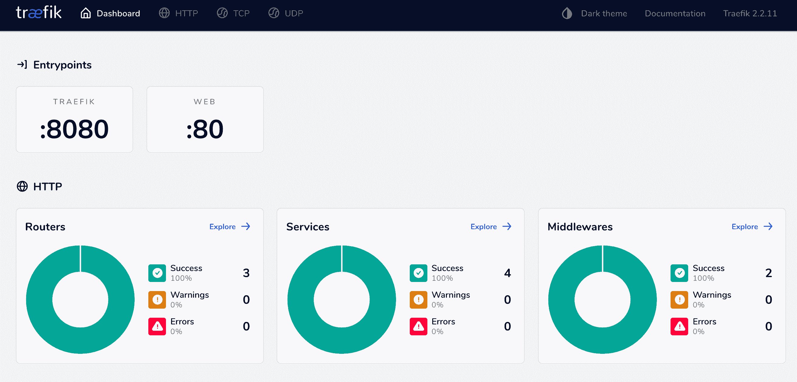

# 用 Postgres、Uvicorn 和 Traefik 对 FastAPI 进行 Dockerizing

> 原文：<https://testdriven.io/blog/fastapi-docker-traefik/>

在本教程中，我们将看看如何用 Postgres、Uvicorn 和 Docker 设置 FastAPI。对于生产环境，我们将添加 Gunicorn、Traefik，并进行加密。

## 项目设置

首先创建一个项目目录:

```py
`$ mkdir fastapi-docker-traefik && cd fastapi-docker-traefik
$ python3.11 -m venv venv
$ source venv/bin/activate` 
```

> 你可以随意把 virtualenv 和 Pip 换成诗歌[或](https://python-poetry.org) [Pipenv](https://github.com/pypa/pipenv) 。更多信息，请查看[现代 Python 环境](/blog/python-environments/)。

然后，创建以下文件和文件夹:

```py
`├── app
│   ├── __init__.py
│   └── main.py
└── requirements.txt` 
```

> 以下命令将创建项目结构:
> 
> ```py
> `$ mkdir app && \
>   touch app/__init__.py app/main.py requirements.txt` 
> ```

将 ASGI 服务器 [FastAPI](https://fastapi.tiangolo.com/) 和[uvicon](https://www.uvicorn.org/)添加到 *requirements.txt* :

```py
`fastapi==0.89.1
uvicorn==0.20.0` 
```

安装它们:

```py
`(venv)$ pip install -r requirements.txt` 
```

接下来，让我们在 *app/main.py* 中创建一个简单的 FastAPI 应用程序:

```py
`# app/main.py

from fastapi import FastAPI

app = FastAPI(title="FastAPI, Docker, and Traefik")

@app.get("/")
def read_root():
    return {"hello": "world"}` 
```

运行应用程序:

```py
`(venv)$ uvicorn app.main:app` 
```

导航至 [127.0.0.1:8000](http://127.0.0.1:8000) 。您应该看到:

一旦完成就杀死服务器。退出，然后也删除虚拟环境。

## 码头工人

安装 [Docker](https://docs.docker.com/install/) ，如果你还没有的话，那么添加一个 *Dockerfile* 到项目根目录:

```py
`# Dockerfile

# pull the official docker image
FROM  python:3.11.1-slim

# set work directory
WORKDIR  /app

# set env variables
ENV  PYTHONDONTWRITEBYTECODE 1
ENV  PYTHONUNBUFFERED 1

# install dependencies
COPY  requirements.txt .
RUN  pip install -r requirements.txt

# copy project
COPY  . .` 
```

所以，我们从 Python 3.11.1 的`slim` [Docker 镜像](https://hub.docker.com/_/python/)开始。然后我们设置了一个[工作目录](https://docs.docker.com/engine/reference/builder/#workdir)以及两个环境变量:

1.  `PYTHONDONTWRITEBYTECODE`:防止 Python 将 pyc 文件写入磁盘(相当于`python -B` [选项](https://docs.python.org/3/using/cmdline.html#cmdoption-B)
2.  `PYTHONUNBUFFERED`:防止 Python 缓冲 stdout 和 stderr(相当于`python -u` [选项](https://docs.python.org/3/using/cmdline.html#cmdoption-u)

最后，我们复制了 *requirements.txt* 文件，安装了依赖项，并复制了项目。

> 查看 [Docker 针对 Python 开发人员的最佳实践](/blog/docker-best-practices/)，了解更多关于构造 Docker 文件的信息，以及为基于 Python 的开发配置 Docker 的一些最佳实践。

接下来，将一个 *docker-compose.yml* 文件添加到项目根:

```py
`# docker-compose.yml version:  '3.8' services: web: build:  . command:  uvicorn app.main:app --host 0.0.0.0 volumes: -  .:/app ports: -  8008:8000` 
```

> 查看[合成文件参考](https://docs.docker.com/compose/compose-file/)，了解该文件如何工作的信息。

建立形象:

构建映像后，运行容器:

导航到 [http://localhost:8008](http://localhost:8008) 再次查看 hello world 健全性检查。

> 如果这不起作用，通过`docker-compose logs -f`检查日志中的错误。

## Postgres

要配置 Postgres，我们需要在 *docker-compose.yml* 文件中添加一个新服务，设置一个 ORM，并安装 [asyncpg](https://github.com/MagicStack/asyncpg) 。

首先，向 *docker-compose.yml* 添加一个名为`db`的新服务:

```py
`# docker-compose.yml version:  '3.8' services: web: build:  . command:  bash -c 'while !</dev/tcp/db/5432; do sleep 1; done; uvicorn app.main:app --host 0.0.0.0' volumes: -  .:/app ports: -  8008:8000 environment: -  DATABASE_URL=postgresql://fastapi_traefik:[[email protected]](/cdn-cgi/l/email-protection):5432/fastapi_traefik depends_on: -  db db: image:  postgres:15-alpine volumes: -  postgres_data:/var/lib/postgresql/data/ expose: -  5432 environment: -  POSTGRES_USER=fastapi_traefik -  POSTGRES_PASSWORD=fastapi_traefik -  POSTGRES_DB=fastapi_traefik volumes: postgres_data:` 
```

为了在容器的生命周期之外保存数据，我们配置了一个卷。这个配置将把`postgres_data`绑定到容器中的“/var/lib/postgresql/data/”目录。

我们还添加了一个环境键来定义默认数据库的名称，并设置用户名和密码。

> 查看 [Postgres Docker Hub 页面](https://hub.docker.com/_/postgres)的“环境变量”部分了解更多信息。

注意`web`服务中的新命令:

```py
`bash -c 'while !</dev/tcp/db/5432; do sleep 1; done; uvicorn app.main:app --host 0.0.0.0'` 
```

将持续到 Postgres 完成。一旦启动，`uvicorn app.main:app --host 0.0.0.0`就会运行。

接下来，将一个名为 *config.py* 的新文件添加到“app”目录中，在这里我们将定义特定于环境的[配置](https://fastapi.tiangolo.com/advanced/settings/)变量:

```py
`# app/config.py

import os

from pydantic import BaseSettings, Field

class Settings(BaseSettings):
    db_url: str = Field(..., env='DATABASE_URL')

settings = Settings()` 
```

这里，我们用一个`db_url`属性定义了一个`Settings`类。来自 pydantic 的 [BaseSettings](https://pydantic-docs.helpmanual.io/usage/settings/) 验证数据，这样当我们创建一个`Settings`的实例时，`db_url`将自动从环境变量中加载。

> 我们本来可以使用`os.getenv()`，但是随着环境变量数量的增加，这变得非常重复。通过使用`BaseSettings`，您可以指定环境变量名，它将被自动加载。
> 
> 你可以在这里了解更多关于 pydantic 设置管理[。](https://pydantic-docs.helpmanual.io/usage/settings/)

我们将使用 ormar 与数据库通信。

在 *requirements.txt* 中添加 [ormar](https://collerek.github.io/ormar/) ，一个 Python 的异步迷你 ORM，以及 asyncpg 和 psycopg2:

```py
`asyncpg==0.27.0
fastapi==0.89.1
ormar==0.12.1
psycopg2-binary==2.9.5
uvicorn==0.20.0` 
```

> 请随意将 ormar 换成您选择的 ORM。寻找一些异步选项？看看[令人敬畏的 FastAPI repo](https://github.com/mjhea0/awesome-fastapi#databases) 和[这个 Twitter 帖子](https://twitter.com/testdrivenio/status/1383457727003783173)。

接下来，创建一个 *app/db.py* 文件来建立一个模型:

```py
`# app/db.py

import databases
import ormar
import sqlalchemy

from .config import settings

database = databases.Database(settings.db_url)
metadata = sqlalchemy.MetaData()

class BaseMeta(ormar.ModelMeta):
    metadata = metadata
    database = database

class User(ormar.Model):
    class Meta(BaseMeta):
        tablename = "users"

    id: int = ormar.Integer(primary_key=True)
    email: str = ormar.String(max_length=128, unique=True, nullable=False)
    active: bool = ormar.Boolean(default=True, nullable=False)

engine = sqlalchemy.create_engine(settings.db_url)
metadata.create_all(engine)` 
```

这将创建一个 pydanic 模型和一个 SQLAlchemy 表。

ormar 使用 [SQLAlchemy](https://www.sqlalchemy.org/) 创建数据库/表格并构建数据库查询，使用[数据库](https://github.com/encode/databases)异步执行查询，使用 [pydantic](https://pydantic-docs.helpmanual.io/) 进行数据验证。注意，每个`ormar.Model`也是一个`pydantic.BaseModel`，所以所有的 pydantic 方法在一个模型上也是可用的。由于这些表是使用 SQLAlchemy(在幕后)创建的，所以可以通过 [Alembic](https://alembic.sqlalchemy.org/en/latest/) 进行数据库迁移。

> 查看官方 ormar 文档中的 [Alembic 用法](https://collerek.github.io/ormar/models/migrations/#alembic-usage)，了解更多关于使用 Alembic 和 ormar 的信息。

接下来，更新 *app/main.py* 以连接到数据库并添加一个虚拟用户:

```py
`# app/main.py

from fastapi import FastAPI

from app.db import database, User

app = FastAPI(title="FastAPI, Docker, and Traefik")

@app.get("/")
async def read_root():
    return await User.objects.all()

@app.on_event("startup")
async def startup():
    if not database.is_connected:
        await database.connect()
    # create a dummy entry
    await User.objects.get_or_create(email="[[email protected]](/cdn-cgi/l/email-protection)")

@app.on_event("shutdown")
async def shutdown():
    if database.is_connected:
        await database.disconnect()` 
```

这里，我们使用 FastAPI 的[事件处理程序](https://fastapi.tiangolo.com/advanced/events/)来创建一个数据库连接。`@app.on_event("startup")`在应用程序启动前创建数据库连接池。

一旦建立了连接，startup 事件中的上面一行就会向我们的表中添加一个虚拟条目。确保条目仅在不存在时才被创建。

shutdown 事件关闭所有与数据库的连接。我们还添加了一条路由来显示`users`表中的所有条目。

构建新的映像并旋转两个容器:

```py
`$ docker-compose up -d --build` 
```

确保`users`表已创建:

```py
`$ docker-compose exec db psql --username=fastapi_traefik --dbname=fastapi_traefik

psql (15.1)
Type "help" for help.

fastapi_traefik=# \l
                                              List of databases
      Name       |      Owner      | Encoding |  Collate   |   Ctype    |          Access privileges
-----------------+-----------------+----------+------------+------------+-------------------------------------
 fastapi_traefik | fastapi_traefik | UTF8     | en_US.utf8 | en_US.utf8 |
 postgres        | fastapi_traefik | UTF8     | en_US.utf8 | en_US.utf8 |
 template0       | fastapi_traefik | UTF8     | en_US.utf8 | en_US.utf8 | =c/fastapi_traefik                 +
                 |                 |          |            |            | fastapi_traefik=CTc/fastapi_traefik
 template1       | fastapi_traefik | UTF8     | en_US.utf8 | en_US.utf8 | =c/fastapi_traefik                 +
                 |                 |          |            |            | fastapi_traefik=CTc/fastapi_traefik
(4 rows)

fastapi_traefik=# \c fastapi_traefik
You are now connected to database "fastapi_traefik" as user "fastapi_traefik".

fastapi_traefik=# \dt
            List of relations
 Schema | Name  | Type  |      Owner
--------+-------+-------+-----------------
 public | users | table | fastapi_traefik
(1 row)

fastapi_traefik=# \q` 
```

您也可以通过运行以下命令来检查该卷是否已创建:

```py
`$ docker volume inspect fastapi-docker-traefik_postgres_data` 
```

您应该会看到类似如下的内容:

```py
`[
    {
        "CreatedAt": "2023-01-31T15:59:10Z",
        "Driver": "local",
        "Labels": {
            "com.docker.compose.project": "fastapi-docker-traefik",
            "com.docker.compose.version": "2.12.2",
            "com.docker.compose.volume": "postgres_data"
        },
        "Mountpoint": "/var/lib/docker/volumes/fastapi-docker-traefik_postgres_data/_data",
        "Name": "fastapi-docker-traefik_postgres_data",
        "Options": null,
        "Scope": "local"
    }
]` 
```

导航至 [127.0.0.1:8008](http://127.0.0.1:8008) 。您应该看到:

## 生产文档

为了部署我们的应用程序，我们需要添加一个 WSGI 服务器 [Gunicorn](https://gunicorn.org/) ，以生成 Uvicorn 的实例。我们不用编写自己的产品 *Dockerfile* ，我们可以利用[uvicon-gunicorn](https://github.com/tiangolo/uvicorn-gunicorn-docker)，这是一个预建的 Docker 映像，包含 uvicon 和 guni corn，用于由核心 FastAPI 作者维护的高性能 web 应用程序。

创建一个名为 *Dockerfile.prod* 的新 Dockerfile，用于生产构建:

```py
`# Dockerfile.prod

FROM  tiangolo/uvicorn-gunicorn:python3.11-slim

COPY  requirements.txt .
RUN  pip install -r requirements.txt

COPY  . .` 
```

就是这样。`tiangolo/uvicorn-gunicorn:python3.11.1-slim` [图像](https://github.com/tiangolo/uvicorn-gunicorn-docker/blob/0.7.0/docker-images/python3.11-slim.dockerfile)为我们做了很多工作。我们只是复制了 *requirements.txt* 文件，安装了依赖项，然后复制了所有的项目文件。

接下来，为生产创建一个名为 *docker-compose.prod.yml* 的新合成文件:

```py
`# docker-compose.prod.yml version:  '3.8' services: web: build: context:  . dockerfile:  Dockerfile.prod ports: -  8009:80 environment: -  DATABASE_URL=postgresql://fastapi_traefik_prod:[[email protected]](/cdn-cgi/l/email-protection):5432/fastapi_traefik_prod depends_on: -  db db: image:  postgres:15-alpine volumes: -  postgres_data_prod:/var/lib/postgresql/data/ expose: -  5432 environment: -  POSTGRES_USER=fastapi_traefik_prod -  POSTGRES_PASSWORD=fastapi_traefik_prod -  POSTGRES_DB=fastapi_traefik_prod volumes: postgres_data_prod:` 
```

将这个文件与 *docker-compose.yml* 进行比较。有什么不同？

我们使用的`uvicorn-gunicorn` Docker 映像使用一个 [prestart.sh](https://github.com/tiangolo/uvicorn-gunicorn-docker/tree/0.7.0#custom-appprestartsh) 脚本在应用程序启动前运行命令。我们可以用这个来等待 Postgres。

修改 *Dockerfile.prod* 如下:

```py
`# Dockerfile.prod

FROM  tiangolo/uvicorn-gunicorn:python3.11-slim

RUN  apt-get update && apt-get install -y netcat

COPY  requirements.txt .
RUN  pip install -r requirements.txt

COPY  . .` 
```

然后，将一个 *prestart.sh* 文件添加到项目的根目录:

```py
`# prestart.sh

echo "Waiting for postgres connection"

while ! nc -z db 5432; do
    sleep 0.1
done

echo "PostgreSQL started"

exec "[[email protected]](/cdn-cgi/l/email-protection)"` 
```

在本地更新文件权限:

将[下放到](https://docs.docker.com/compose/reference/down/)开发容器(以及带有`-v`标志的相关卷):

然后，构建生产映像并启动容器:

```py
`$ docker-compose -f docker-compose.prod.yml up -d --build` 
```

测试 [127.0.0.1:8009](http://127.0.0.1:8009) 是否工作。

## Traefik

接下来，让我们添加 [Traefik](https://traefik.io/traefik/) ，一个[反向代理](https://www.cloudflare.com/learning/cdn/glossary/reverse-proxy/)。

> 刚接触 Traefik？查看官方[入门](https://doc.traefik.io/traefik/getting-started/concepts/)指南。
> 
> **Traefik vs Nginx** : Traefik 是一个现代的、HTTP 反向代理和负载平衡器。它经常被比作 [Nginx](https://www.nginx.com) ，一个网络服务器和反向代理。由于 Nginx 主要是一个网络服务器，它可以用来提供网页，也可以作为一个反向代理和负载平衡器。总的来说，Traefik 的启动和运行更简单，而 Nginx 的功能更丰富。
> 
> **Traefik** :
> 
> 1.  反向代理和负载平衡器
> 2.  通过开箱即用的[让我们加密](https://letsencrypt.org/)，自动发布和更新 SSL 证书
> 3.  将 Traefik 用于简单的、基于 Docker 的微服务
> 
> **Nginx** :
> 
> 1.  Web 服务器、反向代理和负载平衡器
> 2.  比 trafik 稍快
> 3.  对复杂的服务使用 Nginx

添加一个名为 *traefik.dev.toml* 的新文件:

```py
`# traefik.dev.toml # listen on port 80 [entryPoints] [entryPoints.web] address  =  ":80" # Traefik dashboard over http [api] insecure  =  true [log] level  =  "DEBUG" [accessLog] # containers are not discovered automatically [providers] [providers.docker] exposedByDefault  =  false` 
```

在这里，由于我们不想公开`db`服务，我们将 [exposedByDefault](https://doc.traefik.io/traefik/providers/docker/#exposedbydefault) 设置为`false`。要手动公开服务，我们可以将`"traefik.enable=true"`标签添加到 Docker 组合文件中。

接下来，更新 *docker-compose.yml* 文件，以便 Traefik 发现我们的`web`服务并添加一个新的`traefik`服务:

```py
`# docker-compose.yml version:  '3.8' services: web: build:  . command:  bash -c 'while !</dev/tcp/db/5432; do sleep 1; done; uvicorn app.main:app --host 0.0.0.0' volumes: -  .:/app expose:  # new -  8000 environment: -  DATABASE_URL=postgresql://fastapi_traefik:[[email protected]](/cdn-cgi/l/email-protection):5432/fastapi_traefik depends_on: -  db labels:  # new -  "traefik.enable=true" -  "traefik.http.routers.fastapi.rule=Host(`fastapi.localhost`)" db: image:  postgres:15-alpine volumes: -  postgres_data:/var/lib/postgresql/data/ expose: -  5432 environment: -  POSTGRES_USER=fastapi_traefik -  POSTGRES_PASSWORD=fastapi_traefik -  POSTGRES_DB=fastapi_traefik traefik:  # new image:  traefik:v2.9.6 ports: -  8008:80 -  8081:8080 volumes: -  "./traefik.dev.toml:/etc/traefik/traefik.toml" -  "/var/run/docker.sock:/var/run/docker.sock:ro" volumes: postgres_data:` 
```

首先，`web`服务只对端口`8000`上的其他容器公开。我们还为`web`服务添加了以下标签:

1.  `traefik.enable=true`使 Traefik 能够发现服务
2.  `traefik.http.routers.fastapi.rule=Host(`fastapi.localhost`)`当请求有`Host=fastapi.localhost`时，请求被重定向到该服务

记下`traefik`服务中的卷:

1.  将本地配置文件映射到容器中的配置文件，以便保持设置同步
2.  `/var/run/docker.sock:/var/run/docker.sock:ro`使 Traefik 能够发现其他容器

要进行测试，首先取下任何现有的容器:

```py
`$ docker-compose down -v
$ docker-compose -f docker-compose.prod.yml down -v` 
```

构建新的开发映像并启动容器:

```py
`$ docker-compose up -d --build` 
```

导航到[http://fastapi.localhost:8008/](http://fastapi.localhost:8008/)您应该看到:

您也可以通过 cURL 进行测试:

```py
`$ curl -H Host:fastapi.localhost http://0.0.0.0:8008` 
```

接下来，在 [fastapi.localhost:8081](http://fastapi.localhost:8081) 查看[仪表盘](https://doc.traefik.io/traefik/operations/dashboard/):



完成后，将容器和体积拿下来:

## 让我们加密

我们已经在开发模式下成功地创建了 FastAPI、Docker 和 Traefik 的工作示例。对于生产，您需要配置 Traefik 来通过 Let's Encrypt 管理 TLS 证书。简而言之，Traefik 将自动联系证书颁发机构来颁发和续订证书。

因为 Let's Encrypt 不会为`localhost`颁发证书，所以你需要在云计算实例(比如 [DigitalOcean](https://m.do.co/c/d8f211a4b4c2) droplet 或 AWS EC2 实例)上运行你的生产容器。您还需要一个有效的域名。如果你没有，你可以在 [Freenom](https://www.freenom.com/) 创建一个免费域名。

> 我们使用一个 [DigitalOcean](https://m.do.co/c/d8f211a4b4c2) droplet 为 Docker 提供一个计算实例，并部署生产容器来测试 Traefik 配置。

假设您配置了一个计算实例并设置了一个自由域，那么现在就可以在生产模式下设置 Traefik 了。

首先将 Traefik 配置的生产版本添加到名为 *traefik.prod.toml* 的文件中:

```py
`# traefik.prod.toml [entryPoints] [entryPoints.web] address  =  ":80" [entryPoints.web.http] [entryPoints.web.http.redirections] [entryPoints.web.http.redirections.entryPoint] to  =  "websecure" scheme  =  "https" [entryPoints.websecure] address  =  ":443" [accessLog] [api] dashboard  =  true [providers] [providers.docker] exposedByDefault  =  false [certificatesResolvers.letsencrypt.acme] email  =  "[[email protected]](/cdn-cgi/l/email-protection)" storage  =  "/certificates/acme.json" [certificatesResolvers.letsencrypt.acme.httpChallenge] entryPoint  =  "web"` 
```

> 确保用您的实际电子邮件地址替换`[[email protected]](/cdn-cgi/l/email-protection)`。

这里发生了什么:

1.  将我们不安全的 HTTP 应用程序的入口点设置为端口 80
2.  将我们的安全 HTTPS 应用程序的入口点设置为端口 443
3.  将所有不安全的请求重定向到安全端口
4.  `exposedByDefault = false`取消所有服务
5.  `dashboard = true`启用监控仪表板

最后，请注意:

```py
`[certificatesResolvers.letsencrypt.acme] email  =  "[[email protected]](/cdn-cgi/l/email-protection)" storage  =  "/certificates/acme.json" [certificatesResolvers.letsencrypt.acme.httpChallenge] entryPoint  =  "web"` 
```

这是让我们加密配置的地方。我们定义了证书将被存储在哪里以及[验证类型](https://doc.traefik.io/traefik/https/acme/#the-different-acme-challenges)，这是一个 [HTTP 挑战](https://letsencrypt.org/docs/challenge-types/#http-01-challenge)。

接下来，假设您更新了域名的 DNS 记录，创建两个新的 A 记录，它们都指向您的计算实例的公共 IP:

1.  `fastapi-traefik.your-domain.com` -用于网络服务
2.  `dashboard-fastapi-traefik.your-domain.com` -用于 Traefik 仪表板

> 确保用您的实际域名替换`your-domain.com`。

接下来，像这样更新 *docker-compose.prod.yml* :

```py
`# docker-compose.prod.yml version:  '3.8' services: web: build: context:  . dockerfile:  Dockerfile.prod expose:  # new -  80 environment: -  DATABASE_URL=postgresql://fastapi_traefik_prod:[[email protected]](/cdn-cgi/l/email-protection):5432/fastapi_traefik_prod depends_on: -  db labels:  # new -  "traefik.enable=true" -  "traefik.http.routers.fastapi.rule=Host(`fastapi-traefik.your-domain.com`)" -  "traefik.http.routers.fastapi.tls=true" -  "traefik.http.routers.fastapi.tls.certresolver=letsencrypt" db: image:  postgres:15-alpine volumes: -  postgres_data_prod:/var/lib/postgresql/data/ expose: -  5432 environment: -  POSTGRES_USER=fastapi_traefik_prod -  POSTGRES_PASSWORD=fastapi_traefik_prod -  POSTGRES_DB=fastapi_traefik_prod traefik:  # new build: context:  . dockerfile:  Dockerfile.traefik ports: -  80:80 -  443:443 volumes: -  "/var/run/docker.sock:/var/run/docker.sock:ro" -  "./traefik-public-certificates:/certificates" labels: -  "traefik.enable=true" -  "traefik.http.routers.dashboard.rule=Host(`dashboard-fastapi-traefik.your-domain.com`)  &&  (PathPrefix(`/`)" -  "traefik.http.routers.dashboard.tls=true" -  "traefik.http.routers.dashboard.tls.certresolver=letsencrypt" -  "[[email protected]](/cdn-cgi/l/email-protection)" -  "traefik.http.routers.dashboard.middlewares=auth" -  "traefik.http.middlewares.auth.basicauth.users=testuser:$$apr1$$jIKW.bdS$$eKXe4Lxjgy/rH65wP1iQe1" volumes: postgres_data_prod: traefik-public-certificates:` 
```

> 同样，确保用您的实际域名替换`your-domain.com`。

这里有什么新鲜事？

在`web`服务中，我们添加了以下标签:

1.  `traefik.http.routers.fastapi.rule=Host(`fastapi-traefik.your-domain.com`)`将主机更改为实际的域
2.  `traefik.http.routers.fastapi.tls=true`启用 HTTPS
3.  `traefik.http.routers.fastapi.tls.certresolver=letsencrypt`将证书颁发者设置为让我们加密

接下来，对于`traefik`服务，我们为证书目录添加了适当的端口和一个卷。该卷确保即使容器关闭，证书仍然有效。

至于标签:

1.  `traefik.http.routers.dashboard.rule=Host(`dashboard-fastapi-traefik.your-domain.com`)`定义仪表板主机，因此可以在`$Host/dashboard/`访问
2.  `traefik.http.routers.dashboard.tls=true`启用 HTTPS
3.  `traefik.http.routers.dashboard.tls.certresolver=letsencrypt`将证书解析器设置为“让我们加密”
4.  `traefik.http.routers.dashboard.middlewares=auth`启用`HTTP BasicAuth`中间件
5.  `traefik.http.middlewares.auth.basicauth.users`定义用于登录的用户名和散列密码

您可以使用 htpasswd 实用程序创建新的密码哈希:

```py
`# username: testuser
# password: password

$ echo $(htpasswd -nb testuser password) | sed -e s/\\$/\\$\\$/g
testuser:$$apr1$$jIKW.bdS$$eKXe4Lxjgy/rH65wP1iQe1` 
```

随意使用一个`env_file`来存储用户名和密码作为环境变量

```py
`USERNAME=testuser
HASHED_PASSWORD=$$apr1$$jIKW.bdS$$eKXe4Lxjgy/rH65wP1iQe1` 
```

最后，添加一个名为 *Dockerfile.traefik* 的新 Dockerfile:

```py
`# Dockerfile.traefik

FROM  traefik:v2.9.6

COPY  ./traefik.prod.toml ./etc/traefik/traefik.toml` 
```

接下来，旋转新容器:

```py
`$ docker-compose -f docker-compose.prod.yml up -d --build` 
```

确保这两个 URL 有效:

1.  [https://fastapi-traefik.your-domain.com](https://fastapi-traefik.your-domain.com)
2.  [https://dashboard-fastapi-traefik.your-domain.com/dashboard](https://dashboard-fastapi-traefik.your-domain.com/dashboard)

此外，请确保当您访问上述网址的 HTTP 版本时，您会被重定向到 HTTPS 版本。

最后，让我们加密有效期为 [90 天](https://letsencrypt.org/2015/11/09/why-90-days.html)的证书。Treafik 将在后台自动为您处理证书更新，这样您就少了一件担心的事情！

## 结论

在本教程中，我们介绍了如何用 Postgres 容器化一个 FastAPI 应用程序进行开发。我们还创建了一个生产就绪的 Docker Compose 文件，设置了 Traefik 和让我们加密，以便通过 HTTPS 为应用程序提供服务，并启用了一个安全的仪表板来监控我们的服务。

就生产环境的实际部署而言，您可能希望使用:

1.  完全托管的数据库服务——像 [RDS](https://aws.amazon.com/rds/) 或[云 SQL](https://cloud.google.com/sql/)——而不是在一个容器中管理你自己的 Postgres 实例。
2.  服务的非根用户

您可以在[fastapi-docker-traefik](https://github.com/testdrivenio/fastapi-docker-traefik)repo 中找到代码。