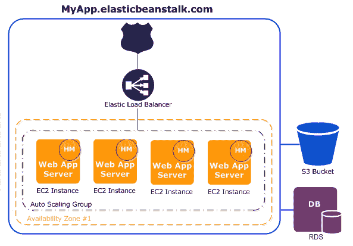
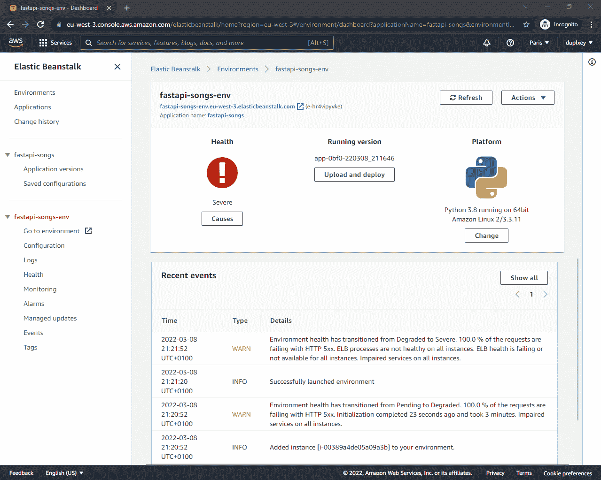
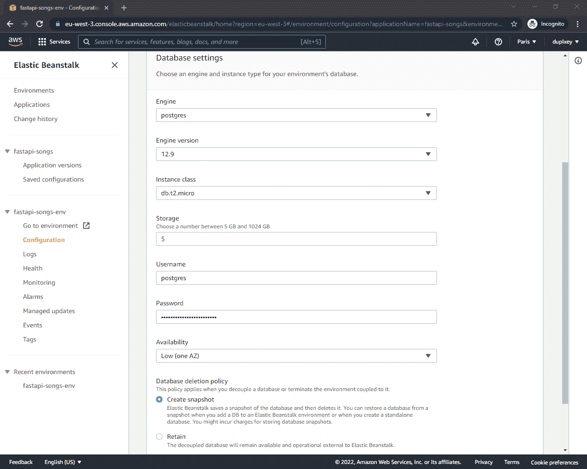
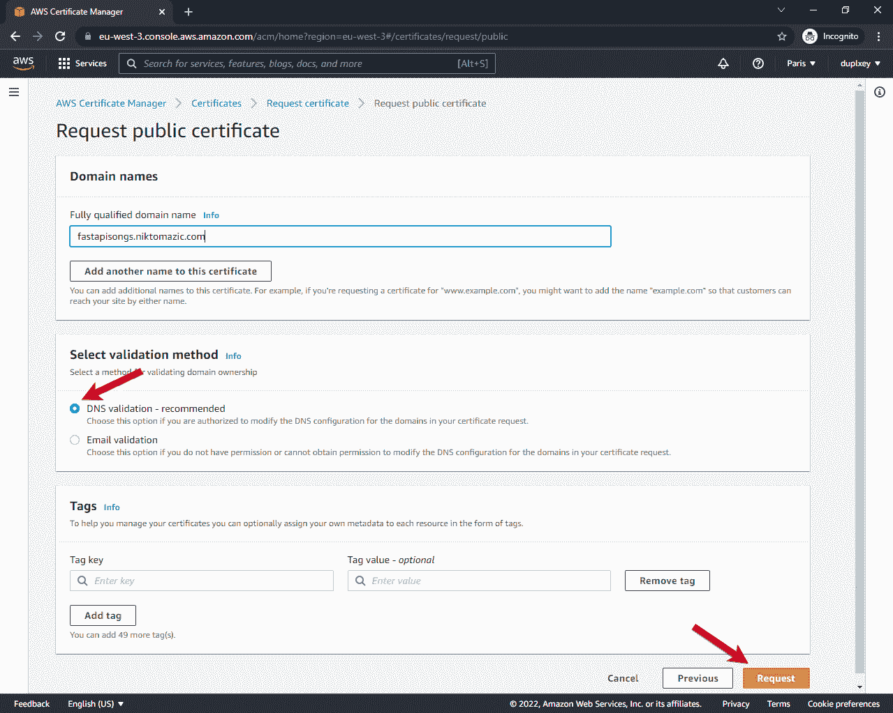
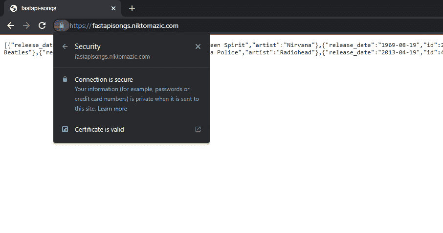
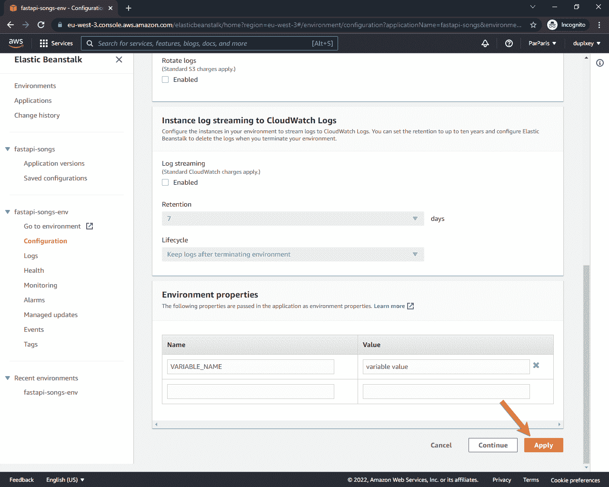

# 将 FastAPI 应用程序部署到 Elastic Beanstalk

> 原文：<https://testdriven.io/blog/fastapi-elastic-beanstalk/>

在本教程中，我们将逐步完成将 [FastAPI](https://fastapi.tiangolo.com/) 应用程序部署到 [AWS Elastic Beanstalk](https://aws.amazon.com/elasticbeanstalk/) 的过程。

## 目标

本教程结束时，您将能够:

1.  解释什么是弹性豆茎
2.  初始化和配置弹性豆茎
3.  对运行在 Elastic Beanstalk 上的应用程序进行故障排除
4.  将弹性豆茎与 RDS 结合
5.  通过 AWS 证书管理器获取 SSL 证书
6.  使用 SSL 证书在 HTTPS 上提供您的应用程序

## 什么是弹性豆茎？

AWS Elastic Beanstalk (EB)是一个易于使用的服务，用于部署和扩展 web 应用程序。它连接多个 AWS 服务，例如计算实例( [EC2](https://aws.amazon.com/ec2/) )、数据库( [RDS](https://aws.amazon.com/rds/) )、负载平衡器([应用负载平衡器](https://docs.aws.amazon.com/elasticloadbalancing/latest/application/introduction.html))和文件存储系统( [S3](https://aws.amazon.com/s3/) )，等等。EB 允许您快速开发和部署 web 应用程序，而无需考虑底层基础设施。它[支持用 Go、Java、.NET、Node.js、PHP、Python 和 Ruby。如果您需要配置自己的软件栈或部署用 EB 目前不支持的语言(或版本)开发的应用程序，EB 也支持 Docker。](https://docs.aws.amazon.com/elasticbeanstalk/latest/platforms/platforms-supported.html)

典型的弹性豆茎设置:



AWS 弹性豆茎不另收费。您只需为应用程序消耗的资源付费。

> 要了解更多关于弹性豆茎的信息，请查看[什么是 AWS 弹性豆茎？](https://docs.aws.amazon.com/elasticbeanstalk/latest/dg/Welcome.html)来自[官方 AWS 弹性豆茎文档](https://docs.aws.amazon.com/elastic-beanstalk/index.html)。

### 弹性豆茎概念

在开始学习教程之前，让我们先来看看与 Elastic Beanstalk 相关的几个关键概念:

1.  一个 **[应用](https://docs.aws.amazon.com/elasticbeanstalk/latest/dg/concepts.html#concepts-application)** 是弹性 Beanstalk 组件的逻辑集合，包括环境、版本和环境配置。一个应用程序可以有多个[版本](https://docs.aws.amazon.com/elasticbeanstalk/latest/dg/concepts.html#concepts-version)。
2.  一个 **[环境](https://docs.aws.amazon.com/elasticbeanstalk/latest/dg/concepts.html#concepts-environment)** 是运行一个应用版本的 AWS 资源的集合。
3.  一个 **[平台](https://docs.aws.amazon.com/elasticbeanstalk/latest/dg/concepts.html#concepts-platform)** 是操作系统、编程语言运行时、web 服务器、应用服务器和弹性 Beanstalk 组件的组合。

这些术语将在整个教程中使用。

## 项目设置

在本教程中，我们将部署一个简单的 [FastAPI](https://fastapi.tiangolo.com/) 应用程序，名为 [fastapi-songs](https://github.com/duplxey/fastapi-songs) 。

> 按照教程进行操作时，通过部署您自己的应用程序来检查您的理解。

首先，从 GitHub 上的[库获取代码:](https://github.com/duplxey/fastapi-songs)

创建新的虚拟环境并激活它:

```
`$ python3 -m venv venv && source venv/bin/activate` 
```

安装需求并初始化数据库:

```
`(venv)$ pip install -r requirements.txt
(venv)$ python init_db.py` 
```

运行服务器:

```
`(venv)$ uvicorn main:app --reload` 
```

打开您最喜欢的 web 浏览器，导航至:

1.  http://localhost:8000 -应该显示“fastapi-songs”文本
2.  http://localhost:8000/songs-应该显示歌曲列表

## 弹性豆茎 CLI

> 在继续之前，请务必在[注册一个 AWS 帐户](https://portal.aws.amazon.com/billing/signup#/start)。通过创建一个账户，你可能也有资格加入 [AWS 免费等级](https://aws.amazon.com/free/)。

[Elastic Beanstalk 命令行界面](https://docs.aws.amazon.com/elasticbeanstalk/latest/dg/eb-cli3.html) (EB CLI)允许您执行各种操作来部署和管理您的 Elastic Beanstalk 应用程序和环境。

有两种安装 EB CLI 的方法:

1.  通过 [EB CLI 安装程序](https://github.com/aws/aws-elastic-beanstalk-cli-setup#2-quick-start)
2.  与 [pip (awsebcli)](https://pypi.org/project/awsebcli/)

> 建议使用安装程序(第一个选项)全局安装 EB CLI(任何特定虚拟环境之外),以避免可能的依赖冲突。更多详情请参考[本解释](https://github.com/aws/aws-elastic-beanstalk-cli-setup#51-for-the-experienced-python-developer-whats-the-advantage-of-this-mode-of-installation-instead-of-regular-pip-inside-a-virtualenv)。

安装 EB CLI 后，您可以通过运行以下命令来检查版本:

```
`$ eb --version

EB CLI 3.20.3 (Python 3.10.)` 
```

如果该命令不起作用，您可能需要将 EB CLI 添加到`$PATH`中。

> EB CLI 命令列表及其描述可在 [EB CLI 命令参考](https://docs.aws.amazon.com/elasticbeanstalk/latest/dg/eb3-cmd-commands.html)中找到。

## 初始化弹性豆茎

一旦我们运行了 EB CLI，我们就可以开始与 Elastic Beanstalk 交互了。让我们初始化一个新项目和一个 EB 环境。

### 初始化

在项目根目录(“fastapi-songs”)中，运行:

你会被提示一些问题。

#### 默认区域

您的弹性 Beanstalk 环境的 AWS 区域(和资源)。如果您不熟悉不同的 AWS 区域，请查看 [AWS 区域和可用区域](https://aws.amazon.com/about-aws/global-infrastructure/regions_az/)。一般来说，你应该选择离你的客户最近的地区。请记住，资源价格因地区而异。

#### 应用程序名称

这是您的弹性 Beanstalk 应用程序的名称。我建议按下回车键，使用默认设置:“fastapi-songs”。

#### 平台和平台分支

EB CLI 将检测到您正在使用 Python 环境。之后，它会给你不同的 Python 版本和 Amazon Linux 版本供你使用。选择“运行在 64 位亚马逊 Linux 2 上的 Python 3.8”。

#### 代码提交

CodeCommit 是一个安全的、高度可伸缩的、托管的源代码控制服务，托管私有的 Git 存储库。我们不会使用它，因为我们已经在使用 GitHub 进行源代码控制。所以说“不”。

#### 嘘

为了稍后连接到 EC2 实例，我们需要设置 SSH。出现提示时，说“是”。

#### 密钥对

为了连接到 EC2 实例，我们需要一个 RSA 密钥对。继续生成一个，它将被添加到您的“~/”中。ssh”文件夹。

回答完所有问题后，您会注意到项目根目录下有一个隐藏的目录，名为。elasticbeanstalk”。该目录应该包含一个 *config.yml* 文件，其中包含您刚才提供的所有数据。

```
`.elasticbeanstalk
└── config.yml` 
```

该文件应包含类似以下内容:

```
`branch-defaults: master: environment:  null group_suffix:  null global: application_name:  fastapi-songs branch:  null default_ec2_keyname:  aws-eb default_platform:  Python 3.8 running on 64bit Amazon Linux 2 default_region:  us-west-2 include_git_submodules:  true instance_profile:  null platform_name:  null platform_version:  null profile:  eb-cli repository:  null sc:  git workspace_type:  Application` 
```

### 创造

接下来，让我们创建弹性 Beanstalk 环境并部署应用程序:

同样，系统会提示您几个问题。

#### 环境名称

这表示 EB 环境的名称。我建议坚持使用默认值:“fastapi-songs-env”。

> 将`└-env`或`└-dev`后缀添加到您的环境中被认为是一种很好的做法，这样您就可以很容易地将 EB 应用程序与环境区分开来。

#### DNS CNAME 前缀

您的 web 应用程序将在`%cname%.%region%.elasticbeanstalk.com`可访问。同样，使用默认值。

#### 负载平衡

负载平衡器在您的环境实例之间分配流量。选择“应用程序”。

> 如果您想了解不同的负载平衡器类型，请查看适用于您的弹性 Beanstalk 环境的[负载平衡器。](https://docs.aws.amazon.com/elasticbeanstalk/latest/dg/using-features.managing.elb.html)

#### 现货车队请求

[Spot Fleet](https://docs.aws.amazon.com/AWSEC2/latest/UserGuide/spot-fleet.html) 请求允许您根据自己的标准按需启动实例。我们不会在本教程中使用它们，所以说“不”。

--

有了它，环境将会旋转起来:

1.  你的代码将被压缩并上传到一个新的 S3 桶。
2.  之后，将创建各种 AWS 资源，如负载平衡器、安全和自动伸缩组以及 EC2 实例。

还将部署一个新的应用程序。

这将需要大约三分钟，所以请随意拿一杯咖啡。

部署完成后，EB CLI 将修改*。elasticbeanstalk/config.yml* 。

您的项目结构现在应该如下所示:

```
`|-- .elasticbeanstalk
|   └-- config.yml
|-- .gitignore
|-- README.md
|-- database.py
|-- default.db
|-- init_db.py
|-- main.py
|-- models.py
└-- requirements.txt` 
```

### 状态

部署应用后，您可以通过运行以下命令来检查其状态:

```
`$ eb status

Environment details for: fastapi-songs-env
  Application name: fastapi-songs
  Region: us-west-2
  Deployed Version: app-82fb-220311_171256090207
  Environment ID: e-nsizyek74z
  Platform: arn:aws:elasticbeanstalk:us-west-2::platform/Python 3.8 running on 64bit Amazon Linux 2/3.3.11
  Tier: WebServer-Standard-1.0
  CNAME: fastapi-songs-env.us-west-2.elasticbeanstalk.com
  Updated: 2022-03-11 23:16:03.822000+00:00
  Status: Launching
  Health: Red` 
```

您可以看到我们环境的当前健康状况是`Red`，这意味着出现了问题。暂时不要担心这个问题，我们将在接下来的步骤中解决它。

您还可以看到，AWS 为我们分配了一个 CNAME，这是我们的 EB 环境的域名。我们可以通过打开浏览器并导航到 CNAME 来访问 web 应用程序。

### 打开

此命令将打开您的默认浏览器并导航到 CNAME 域。你会看到`502 Bad Gateway`，我们很快会在这里修复它。

### 安慰

该命令将在您的默认浏览器中打开 Elastic Beanstalk 控制台:



同样，您可以看到环境的健康状况是“严重的”，我们将在下一步中解决这个问题。

## 配置环境

在上一步中，我们尝试访问我们的应用程序，它返回了`502 Bad Gateway`。背后有三个原因:

1.  Python 需要`PYTHONPATH`来在我们的应用程序中找到模块。
2.  默认情况下，Elastic Beanstalk 试图从不存在的 *application.py* 启动 WSGI 应用程序。
3.  如果没有特别说明，Elastic Beanstalk 会尝试使用 [Gunicorn](https://gunicorn.org/) 为 Python 应用程序提供服务。Gunicorn 本身[与 FastAPI](https://fastapi.tiangolo.com/deployment/server-workers/#gunicorn-with-uvicorn-workers) 不兼容，因为 FastAPI 使用最新的 ASGI 标准。

让我们修复这些错误。

在项目根目录下创建一个名为“”的新文件夹。ebextensions”。在新创建的文件夹中创建一个名为 *01_fastapi.config* 的文件:

```
`# .ebextensions/01_fastapi.config option_settings: aws:elasticbeanstalk:application:environment: PYTHONPATH:  "/var/app/current:$PYTHONPATH" aws:elasticbeanstalk:container:python: WSGIPath:  "main:app"` 
```

注意事项:

1.  我们将`PYTHONPATH`设置为 EC2 实例上的 Python 路径( [docs](https://docs.python.org/3/using/cmdline.html#envvar-PYTHONPATH) )。
2.  我们将`WSGIPath`更改为我们的 WSGI 应用程序( [docs](https://docs.aws.amazon.com/elasticbeanstalk/latest/dg/command-options-specific.html#command-options-python) )。

> EB 如何*。config* 文件管用吗？
> 
> 1.  你想要多少就有多少。
> 2.  它们按以下顺序加载:01_x、02_x、03_x 等。
> 3.  您不必记住这些设置；您可以通过运行`eb config`列出您的所有环境设置。
> 
> 如果您想了解更多关于高级环境定制的信息，请查看[带有配置文件的高级环境定制](https://docs.aws.amazon.com/elasticbeanstalk/latest/dg/ebextensions.html)。

由于 FastAPI 本身不支持 Gunicorn，我们将不得不修改我们的`web` process 命令来使用一个 [Uvicorn 工人类](https://www.uvicorn.org/#running-with-gunicorn)。

> [uvicon](https://www.uvicorn.org/)是 FastAPI 推荐的 ASGI web 应用服务器。

在项目根目录下创建一个名为 *Procfile* 的新文件:

```
`# Procfile

web: gunicorn main:app --workers=4 --worker-class=uvicorn.workers.UvicornWorker` 
```

> 如果您正在部署自己的应用程序，请确保将`uvicorn`作为依赖项添加到 *requirements.txt* 中。
> 
> 有关 Procfile 的更多信息，请查看[用 Procfile](https://docs.aws.amazon.com/elasticbeanstalk/latest/dg/python-configuration-procfile.html) 配置 WSGI 服务器。

最后，我们必须告诉 Elastic Beanstalk 在部署新的应用程序版本时初始化数据库。将以下内容添加到*的末尾。EB extensions/01 _ fastapi . config*:

```
`# .ebextensions/01_fastapi.config container_commands: 01_initdb: command:  "source /var/app/venv/*/bin/activate && python3 init_db.py" leader_only:  true` 
```

现在，每当我们部署一个新的应用程序版本时，EB 环境都会执行上面的命令。我们使用了`leader_only`，所以只有第一个 EC2 实例执行它们(以防我们的 EB 环境运行多个 EC2 实例)。

> 弹性 Beanstalk 配置支持两个不同的命令部分，[命令](https://docs.aws.amazon.com/elasticbeanstalk/latest/dg/customize-containers-ec2.html#linux-commands)和[容器 _ 命令](https://docs.aws.amazon.com/elasticbeanstalk/latest/dg/customize-containers-ec2.html#linux-container-commands)。它们之间的主要区别在于它们在部署过程中的运行时间:
> 
> 1.  `commands`在设置应用程序和 web 服务器以及提取应用程序版本文件之前运行。
> 2.  `container_commands`在应用程序和 web 服务器已设置且应用程序版本存档已提取之后，但在应用程序版本部署之前(在文件从暂存文件夹移动到其最终位置之前)运行。

此时，您的项目结构应该如下所示:

```
`|-- .ebextensions
|   └-- 01_fastapi.config
|-- .elasticbeanstalk
|   └-- config.yml
|-- .gitignore
|-- Procfile
|-- README.md
|-- database.py
|-- default.db
|-- init_db.py
|-- main.py
|-- models.py
`-- requirements.txt` 
```

将更改提交给 git 并部署:

```
`$ git add .
$ git commit -m "updates for eb"

$ eb deploy` 
```

> 您会注意到，如果您不提交，Elastic Beanstalk 不会检测到这些变化。这是因为 EB 与 git 集成，并且只检测提交的(更改的)文件。

部署完成后，运行`eb open`看看是否一切正常。之后，将`/songs`追加到 URL，看看歌曲是否还能显示。

耶！我们的应用程序的第一个版本现已部署。

## 配置 RDS

如果你正在部署 [fastapi-songs](https://github.com/duplxey/fastapi-songs) ，你会注意到它默认使用一个 [SQLite](https://www.sqlite.org/index.html) 数据库。虽然这对于开发来说是完美的，但是对于生产来说，您通常会希望迁移到更健壮的数据库，比如 Postgres 或 MySQL。让我们看看如何将 SQLite 替换为 [Postgres](https://www.postgresql.org/) 。

### 本地邮政汇票

首先，让 Postgres 在本地运行。您可以从 [PostgreSQL Downloads](https://www.postgresql.org/download/) 下载它，或者启动 Docker 容器:

```
`$ docker run --name fastapi-songs-postgres -p 5432:5432 \
    -e POSTGRES_USER=fastapi-songs -e POSTGRES_PASSWORD=complexpassword123 \
    -e POSTGRES_DB=fastapi-songs -d postgres` 
```

检查容器是否正在运行:

```
`$ docker ps -f name=fastapi-songs-postgres

CONTAINER ID   IMAGE      COMMAND                  CREATED              STATUS              PORTS                    NAMES
c05621dac852   postgres   "docker-entrypoint.s…"   About a minute ago   Up About a minute   0.0.0.0:5432->5432/tcp   fastapi-songs-postgres` 
```

现在，让我们尝试用 FastAPI 应用程序连接到它。

在 *database.py* 里面把`DATABASE_URL`改成这样:

```
`# database.py

DATABASE_URL = \
    'postgresql://{username}:{password}@{host}:{port}/{database}'.format(
        username='fastapi-songs',
        password='complexpassword123',
        host='localhost',
        port='5432',
        database='fastapi-songs',
    )` 
```

之后，从`create_engine`中删除`connect_args`，因为`check_same_thread`是[仅在 SQLite](https://docs.sqlalchemy.org/en/14/dialects/sqlite.html#uri-connections) 中需要。

```
`# database.py

engine = create_engine(
    DATABASE_URL,
)` 
```

接下来，安装 Postgres 所需的 [psycopg2-binary](https://pypi.org/project/psycopg2-binary/) :

```
`(venv)$ pip install psycopg2-binary==2.9.3` 
```

添加到 *requirements.txt* :

```
`fastapi==0.75.0 psycopg2-binary==2.9.3 SQLAlchemy==1.4.32 uvicorn[standard]==0.17.6` 
```

删除现有数据库 *default.db* ，然后初始化新数据库:

```
`(venv)$ python init_db.py` 
```

运行服务器:

```
`(venv)$ uvicorn main:app --reload` 
```

通过查看[http://localhost:8000/songs](http://localhost:8000/songs)，确保歌曲仍然可以正确播放。

### AWS RDS Postgres

要为生产设置 Postgres，首先运行以下命令打开 AWS 控制台:

单击左侧栏上的“配置”，向下滚动到“数据库”，然后单击“编辑”。

使用以下设置创建一个数据库，然后单击“应用”:

*   引擎:postgres
*   引擎版本:12.9(自 db.t2.micro 以来的旧 Postgres 版本在 13.1+版本中不可用)
*   实例类:db.t2.micro
*   存储:5 GB(应该绰绰有余)
*   用户名:选择一个用户名
*   密码:选择一个强密码

> 如果你想留在 [AWS 免费层](https://aws.amazon.com/free/)内，确保你选择 db.t2.micro. RDS 价格会根据你选择的实例类呈指数增长。如果你不想和`micro`一起去，一定要复习 [AWS PostgreSQL 定价](https://aws.amazon.com/rds/postgresql/pricing/)。



环境更新完成后，EB 会自动将以下数据库凭证传递给我们的 FastAPI 应用程序:

```
`RDS_DB_NAME
RDS_USERNAME
RDS_PASSWORD
RDS_HOSTNAME
RDS_PORT` 
```

我们现在可以在 *database.py* 中使用这些变量来连接我们的数据库。将`DATABASE_URL`替换为以下内容:

```
`if 'RDS_DB_NAME' in os.environ:
    DATABASE_URL = \
        'postgresql://{username}:{password}@{host}:{port}/{database}'.format(
            username=os.environ['RDS_USERNAME'],
            password=os.environ['RDS_PASSWORD'],
            host=os.environ['RDS_HOSTNAME'],
            port=os.environ['RDS_PORT'],
            database=os.environ['RDS_DB_NAME'],
        )
else:
    DATABASE_URL = \
        'postgresql://{username}:{password}@{host}:{port}/{database}'.format(
            username='fastapi-songs',
            password='complexpassword123',
            host='localhost',
            port='5432',
            database='fastapi-songs',
        )` 
```

不要忘记导入 *database.py* 顶部的`os`包:

你最终的 *database.py* 文件应该看起来像[这个](https://github.com/testdrivenio/fastapi-elastic-beanstalk/blob/master/database.py)。

将更改提交给 git 并部署:

```
`$ git add .
$ git commit -m "updates for eb"

$ eb deploy` 
```

等待部署完成。完成后，运行`eb open`在新的浏览器标签中打开你的应用。通过在`/songs`列出歌曲来确保一切正常运行。

## HTTPS 与证书管理器

教程的这一部分要求您有一个域名。

> 需要一个便宜的域名来练习？几个域名注册商有特殊优惠。“xyz”域。或者，您可以在 [Freenom](https://www.freenom.com/) 创建一个免费域名。如果你没有域名，但仍然想使用 HTTPS，你可以[创建并签署一个 X509 证书](https://docs.aws.amazon.com/elasticbeanstalk/latest/dg/configuring-https-ssl.html)。

要通过 HTTPS 为您的申请提供服务，我们需要:

1.  请求并验证 SSL/TLS 证书
2.  把你的域名指向你的 EB CNAME
3.  修改负载平衡器以服务于 HTTPS
4.  修改您的应用程序设置

### 请求并验证 SSL/TLS 证书

导航到 [AWS 证书管理器控制台](https://console.aws.amazon.com/acm/)。单击“申请证书”。将证书类型设置为“公共”，然后单击“下一步”。在表单输入中输入您的[全限定域名](https://docs.aws.amazon.com/acm/latest/userguide/setup-domain.html)，设置“验证方式”为“DNS 验证”，点击“请求”。



然后，您将被重定向到一个页面，在那里您可以看到您的所有证书。您刚刚创建的证书应该具有“待验证”状态。

为了让 AWS 颁发证书，你首先必须证明你是这个域名的所有者。在表中，单击证书以查看“证书详细信息”。注意“CNAME 的名字”和“CNAME 的价值”。要验证域的所有权，您需要在域的 DNS 设置中创建“CNAME 记录”。为此使用“CNAME 名称”和“CNAME 价值”。一旦完成，Amazon 将需要几分钟的时间来获取域更改并颁发证书。状态应该从“等待验证”更改为“已发布”。

### 将域名指向 EB CNAME

接下来，您需要将您的域(或子域)指向您的 EB 环境 CNAME。回到您域名的 DNS 设置，添加另一个 CNAME 记录，其值为您的 EB CNAME -例如，`fastapi-songs-dev.us-west-2.elasticbeanstalk.com`。

等待几分钟，让您的 DNS 刷新，然后在浏览器中测试您的域名的`http://`风格。

### 修改负载平衡器以服务于 HTTPS

回到弹性豆茎控制台，点击“配置”。然后，在“负载平衡器”类别中，单击“编辑”。单击“添加监听程序”并使用以下详细信息创建监听程序:

1.  端口- 443
2.  议定书- HTTPS
3.  SSL 证书-选择您刚刚创建的证书

点击“添加”。然后，滚动到页面底部，单击“应用”。环境更新需要几分钟时间。

### 修改您的应用程序设置

接下来，我们需要对 FastAPI 应用程序进行一些更改。

我们需要将所有流量从 HTTP 重定向到 HTTPS。有多种方法可以做到这一点，但最简单的方法是将 [Apache](https://httpd.apache.org/) 设置为代理主机。我们可以通过在*中的`option_settings`末尾添加以下内容来编程实现这一点。EB extensions/01 _ fastapi . config*:

```
`# .ebextensions/01_fastapi.config

option_settings:
  # ...
  aws:elasticbeanstalk:environment:proxy:  # new
    ProxyServer: apache                    # new` 
```

您最终的 *01_fastapi.config* 文件现在应该是这样的:

```
`# .ebextensions/01_fastapi.config option_settings: aws:elasticbeanstalk:application:environment: PYTHONPATH:  "/var/app/current:$PYTHONPATH" aws:elasticbeanstalk:container:python: WSGIPath:  "main:app" aws:elasticbeanstalk:environment:proxy: ProxyServer:  apache container_commands: 01_initdb: command:  "source /var/app/venv/*/bin/activate && python3 init_db.py" leader_only:  true` 
```

接下来，创建一个”。平台"文件夹中，并添加以下文件和文件夹:

```
`└-- .platform
    └-- httpd
        └-- conf.d
            └-- ssl_rewrite.conf` 
```

*ssl_rewrite.conf* :

```
`# .platform/httpd/conf.d/ssl_rewrite.conf

RewriteEngine On
<If "-n '%{HTTP:X-Forwarded-Proto}' && %{HTTP:X-Forwarded-Proto} != 'https'">
RewriteRule (.*) https://%{HTTP_HOST}%{REQUEST_URI} [R,L]
</If>` 
```

您的项目结构现在应该如下所示:

```
`|-- .ebextensions
|   └-- 01_fastapi.config
|-- .elasticbeanstalk
|   └-- config.yml
|-- .gitignore
├── .platform
│   └── httpd
│       └── conf.d
│           └── ssl_rewrite.conf
|-- Procfile
|-- README.md
|-- database.py
|-- default.db
|-- init_db.py
|-- main.py
|-- models.py
└-- requirements.txt` 
```

将更改提交给 git 并部署:

```
`$ git add .
$ git commit -m "updates for eb"

$ eb deploy` 
```

现在，在你的浏览器中，你的应用程序的`https://`风格应该工作了。试试去`http://`味的。你应该被重定向到`https://`风味。确保证书也正确加载:



## 环境变量

在生产中，[最好将特定于环境的配置存储在环境变量](https://12factor.net/config)中。使用 Elastic Beanstalk，您可以用两种不同的方式设置自定义环境变量。

### 通过 EB CLI 的环境变量

您可以执行一个命令来设置它们，如下所示:

```
`$ eb setenv VARIABLE_NAME='variable value'` 
```

> 您可以用一个命令设置多个环境变量，用空格分隔它们。这是推荐的方法，因为它只需要对 EB 环境进行一次更新。

然后，您可以通过`os.environ`在您的 Python 环境中访问这些变量。

例如:

```
`VARIABLE_NAME = os.environ['VARIABLE_NAME']` 
```

### 通过 EB 控制台的环境变量

通过`eb open`进入弹性豆茎控制台。导航至“配置”>“软件”>“编辑”。然后，向下滚动到“环境属性”。



完成后，单击“应用”,您的环境将会更新。

同样，您可以通过`os.environ`访问 Python 中的环境变量。

## 调试弹性豆茎

当使用 Elastic Beanstalk 时，如果您不知道如何访问日志文件，那么找出问题所在会非常令人沮丧。在本节中，我们将研究这一点。

有两种方法可以访问日志:

1.  弹性 Beanstalk CLI 或控制台
2.  SSH 到 EC2 实例

> 从个人经验来看，我已经能够用第一种方法解决所有问题。

### 弹性 Beanstalk CLI 或控制台

CLI:

该命令将从以下文件中获取最后 100 行:

```
`/var/log/web.stdout.log /var/log/eb-hooks.log /var/log/nginx/access.log /var/log/nginx/error.log /var/log/eb-engine.log` 
```

> 运行`eb logs`相当于登录 EB 控制台，导航到“日志”。

我建议将日志传送到 [CloudWatch](https://aws.amazon.com/cloudwatch/) 。运行以下命令来启用此功能:

```
`$ eb logs --cloudwatch-logs enable` 
```

您通常会在 */var/log/web.stdout.log* 或 */var/log/eb-engine.log* 中找到 FastAPI 错误。

> 要了解更多关于弹性 Beanstalk 日志的信息，请查看来自 Amazon EC2 实例的日志。

### SSH 到 EC2 实例

要连接到运行 FastAPI 应用程序的 EC2 实例，请运行:

第一次会提示您将主机添加到已知主机。答应吧。这样，您现在就可以完全访问 EC2 实例了。请随意检查上一节中提到的一些日志文件。

> 请记住，Elastic Beanstalk 会自动伸缩和部署新的 EC2 实例。您在这个特定 EC2 实例上所做的更改不会反映在新启动的 EC2 实例上。一旦这个特定的 EC2 实例被替换，您的更改将被清除。

## 结论

在本教程中，我们介绍了将 FastAPI 应用程序部署到 AWS Elastic Beanstalk 的过程。到目前为止，您应该对弹性豆茎的工作原理有了一个大致的了解。通过回顾本教程开头的目标，快速进行自我检查。

后续步骤:

1.  你应该考虑创建两个独立的 EB 环境(`dev`和`production`)。
2.  查看用于您的弹性 Beanstalk 环境的自动伸缩组,了解如何配置触发器来自动伸缩您的应用程序。

要删除我们在整个教程中创建的所有 AWS 资源，首先要终止 Elastic Beanstalk 环境:

您需要手动删除 SSL 证书。

最后，你可以在 GitHub 上的[fastapi-elastic-beanstalk](https://github.com/testdrivenio/fastapi-elastic-beanstalk)repo 中找到代码的最终版本。