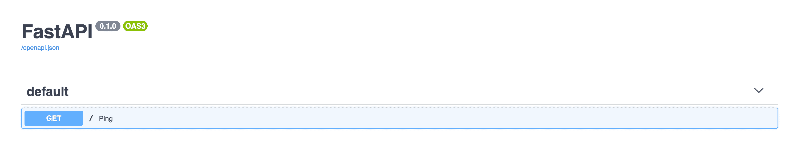
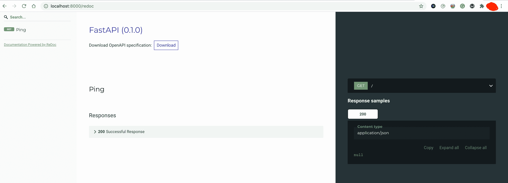
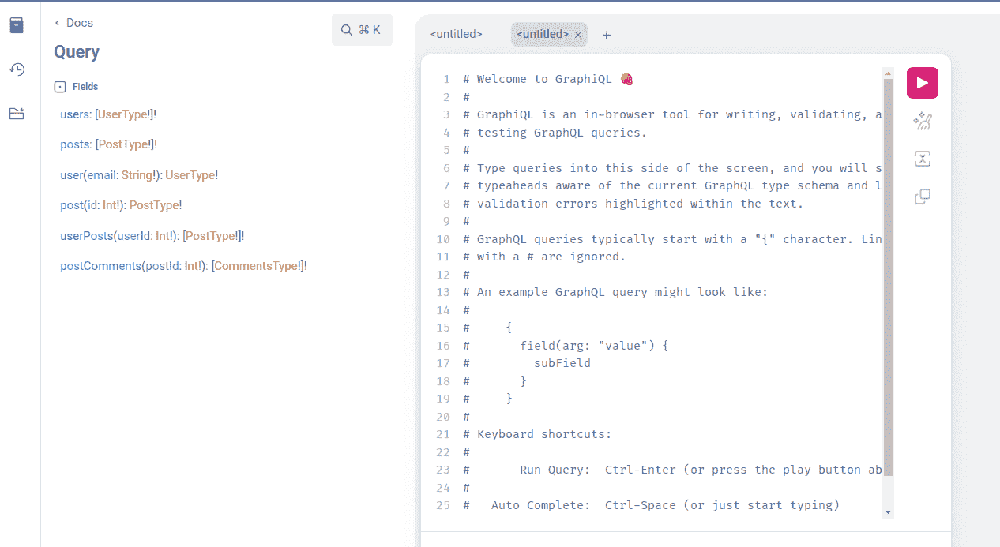

# 用 FastAPI 和 GraphQL 开发 API

> 原文：<https://testdriven.io/blog/fastapi-graphql/>

在本教程中，你将学习如何用 [FastAPI](https://fastapi.tiangolo.com/) 、 [GraphQL](https://graphql.org/) 和 [Masonite ORM](https://orm.masoniteproject.com/) 构建 CRUD 应用。

## 目标

本教程结束时，您将能够:

1.  解释为什么你可能想使用 GraphQL 而不是 REST
2.  使用 Masonite ORM 与 Postgres 数据库进行交互
3.  描述 GraphQL 中有哪些模式、变异和查询
4.  使用石墨烯将 GraphQL 集成到 FastAPI 应用程序中
5.  用 Graphene 和 pytest 测试 GraphQL API

## 为什么是 GraphQL？

(为什么 GraphQL 优于传统的 REST？)

REST 是构建 web APIs 的事实上的标准。使用 REST，每个 CRUD 操作都有多个端点:GET、POST、PUT、DELETE。通过访问多个端点来收集数据。

例如，如果您想获得特定用户的个人资料信息以及他们的帖子和相关评论，您需要调用四个不同的端点:

1.  `/users/<id>`返回初始用户数据
2.  `/users/<id>/posts`返回给定用户的所有帖子
3.  `/users/<post_id>/comments`返回每篇文章的评论列表
4.  `/users/<id>/comments`返回每个用户的评论列表

这可能导致请求[过度提取](https://stackoverflow.com/a/44568365)，因为你可能不得不获取比你需要的多得多的数据。

此外，由于一个客户的需求可能与其他客户的需求大相径庭，请求过度提取和提取不足在 REST 中是很常见的。

同时，GraphQL 是一种用于从 API 中检索数据的查询语言。GraphQL 不是有多个端点，而是围绕单个端点构建，其*返回值取决于客户端想要什么，而不是端点返回什么*。

在 GraphQL 中，您可以像这样构建一个查询来获取用户的个人资料、帖子和评论:

```py
`query {
  User(userId: 2){
    name
    posts {
      title
      comments {
        body
      }
    }
    comments {
      body
    }
  }
}` 
```

瞧啊。您可以在一个请求中获得所有数据，而不会过度提取，因为我们确切地指定了我们想要的数据。

> FastAPI 通过 [Starlette](https://www.starlette.io/graphql) 和 [Graphene](https://graphene-python.org/) 支持 GraphQL。当您不使用异步请求处理程序时，Starlette 默认在单独的线程中执行 GraphQL 查询！

## 为什么选择 Masonite ORM？

Masonite ORM 是一个干净的、易于使用的对象关系映射库，它是为 [Masonite](https://docs.masoniteproject.com/) web 框架构建的。它基于[演说家 ORM](https://orator-orm.com/) ，一个[活动记录 ORM](https://www.quora.com/Is-there-something-for-Python-like-ActiveRecord-in-Ruby-Rails/answer/Michael-Herman-3)。

Masonite ORM 被开发出来作为 astorator ORM 的[替代品](https://github.com/sdispater/orator/issues/369#issuecomment-633591842),因为 astorator 不再接收更新和错误修复。

它类似于其他流行的活动记录实现，如 Django 的 [ORM](https://www.fullstackpython.com/django-orm.html) ，Laravel 的[雄辩](https://laravel.com/docs/eloquent)，adon isjs’[Lucid](https://adonisjs.com/docs/4.0/lucid)，以及 Ruby On Rails 中的[活动记录](https://guides.rubyonrails.org/active_record_basics.html)。由于支持 MySQL、Postgres 和 SQLite，它强调[约定胜于配置](https://en.wikipedia.org/wiki/Convention_over_configuration)，这使得创建模型变得容易，因为您不必显式定义每个方面。关系是一件轻而易举的事，也很容易处理。

尽管 Masonite ORM 是为 Masonite web 项目设计的，但是您也可以将 mason ite ORM 用于其他 Python web 框架或项目。

> 有关 Masonite ORM 以及如何使用 FastAPI 的更多信息，请查看[mason ite ORM 与 FastAPI 的集成](/blog/masonite-orm-fastapi/)。

## 项目设置

创建一个目录来保存名为“fastapi-graphql”的项目:

```py
`$ mkdir fastapi-graphql
$ cd fastapi-graphql` 
```

创建虚拟环境并激活它:

```py
`$ python3.11 -m venv env
$ source env/bin/activate

(env)$` 
```

> 你可以随意把 virtualenv 和 Pip 换成诗歌[或](https://python-poetry.org) [Pipenv](https://github.com/pypa/pipenv) 。更多信息，请查看[现代 Python 环境](/blog/python-environments/)。

在“fastapi-graphql”目录中创建以下文件:

将以下要求添加到 *requirements.txt* 文件中:

```py
`fastapi==0.92.0
uvicorn==0.20.0` 
```

[uvicon](http://www.uvicorn.org/)是一个 [ASGI](https://asgi.readthedocs.io/en/latest/) (异步服务器网关接口)兼容的服务器，将用于站立 FastAPI。

安装依赖项:

```py
`(env)$ pip install -r requirements.txt` 
```

在 *main.py* 文件中，添加以下行来启动服务器:

```py
`from fastapi import FastAPI

app = FastAPI()

@app.get("/")
def ping():
    return {"ping": "pong"}` 
```

要启动服务器，请打开终端，导航到项目目录，然后输入以下命令:

```py
`(env)$ uvicorn main:app --reload` 
```

在您选择的浏览器中导航到 [http://localhost:8000](http://localhost:8000) 。您应该会看到响应:

您已经成功启动了一个简单的 FastAPI 服务器。要查看 FastAPI 为我们准备的漂亮的[文档](https://fastapi.tiangolo.com/features/#automatic-docs)，请导航至[http://localhost:8000/docs](http://localhost:8000/docs):



以及[http://localhost:8000/redoc](http://localhost:8000/redoc):



## Masonite ORM

将以下需求添加到 *requirements.txt* 文件中:

```py
`masonite-orm==2.18.6
psycopg2-binary==2.9.5` 
```

安装新的依赖项:

```py
`(env)$ pip install -r requirements.txt` 
```

创建以下文件夹:

```py
`models
databases/migrations
config` 
```

“models”文件夹将包含我们的模型文件，“databases/migrations”文件夹将包含我们的迁移文件，“config”文件夹将保存我们的 Masonite 数据库配置文件。

### 数据库配置

在“config”文件夹中，创建一个 *database.py* 文件。Masonite ORM 需要这个文件，因为这是我们声明数据库配置的地方。

> 欲了解更多信息，请访问[文档](https://orm.masoniteproject.com/installation#configuration)。

在 *database.py* 文件中，我们需要添加`DATABASE`变量和一些连接信息，从`masonite-orm.connections`导入`ConnectionResolver`，并注册连接细节:

```py
`# config/database.py

from masoniteorm.connections import ConnectionResolver

DATABASES = {
  "default": "postgres",
  "mysql": {
    "host": "127.0.0.1",
    "driver": "mysql",
    "database": "masonite",
    "user": "root",
    "password": "",
    "port": 3306,
    "log_queries": False,
    "options": {
      #
    }
  },
  "postgres": {
    "host": "127.0.0.1",
    "driver": "postgres",
    "database": "test",
    "user": "test",
    "password": "test",
    "port": 5432,
    "log_queries": False,
    "options": {
      #
    }
  },
  "sqlite": {
    "driver": "sqlite",
    "database": "db.sqlite3",
  }
}

DB = ConnectionResolver().set_connection_details(DATABASES)` 
```

这里，我们定义了三种不同的数据库设置:

1.  关系型数据库
2.  Postgres
3.  SQLite

我们将默认连接设置为 Postgres。

> 注意:确保您已经启动并运行了 Postgres 数据库。请随意更改默认的数据库连接。

### Masonite 型号

要创建一个新的样板文件 [Masonite 模型](https://orm.masoniteproject.com/models#creating-a-model)，从终端的项目根文件夹中运行下面的`masonite-orm`命令:

```py
`(env)$ masonite-orm model User --directory models` 
```

您应该会看到一条成功消息:

```py
`Model created: models/User.py` 
```

因此，该命令应该在“models”目录中创建一个包含以下内容的 *User.py* 文件:

```py
`""" User Model """

from masoniteorm.models import Model

class User(Model):
    """User Model"""

    pass` 
```

> 如果您收到一个`FileNotFoundError`，检查以确保“模型”文件夹存在。

对帖子和评论模型运行相同的命令:

```py
`(env)$ masonite-orm model Post --directory models
> Model created: models/Post.py

(env)$ masonite-orm model Comment --directory models
> Model created: models/Comment.py` 
```

接下来，我们可以创建初始迁移:

```py
`(env)$ masonite-orm migration migration_for_user_table --create users` 
```

我们添加了`--create`标志来告诉 Masonite 将要创建的迁移文件是针对我们的`users`表的，并且应该在迁移运行时创建数据库表。

在“数据库/迁移”文件夹中，应该已经创建了一个新文件:

`<timestamp>_migration_for_user_table.py`

内容:

```py
`"""MigrationForUserTable Migration."""

from masoniteorm.migrations import Migration

class MigrationForUserTable(Migration):
    def up(self):
        """
 Run the migrations.
 """
        with self.schema.create("users") as table:
            table.increments("id")

            table.timestamps()

    def down(self):
        """
 Revert the migrations.
 """
        self.schema.drop("users")` 
```

创建剩余的迁移文件:

```py
`(env)$ masonite-orm migration migration_for_post_table --create posts
> Migration file created: databases/migrations/2022_05_04_084820_migration_for_post_table.py

(env)$ masonite-orm migration migration_for_comment_table --create comments
> Migration file created: databases/migrations/2022_05_04_084833_migration_for_comment_table.py` 
```

### 数据库表

`users`表应该有以下字段:

1.  名字
2.  电子邮件(唯一)
3.  地址(可选)
4.  电话号码(可选)
5.  性别(可选)

将与用户模型相关联的迁移文件更改为:

```py
`"""MigrationForUserTable Migration."""

from masoniteorm.migrations import Migration

class MigrationForUserTable(Migration):
    def up(self):
        """
 Run the migrations.
 """
        with self.schema.create("users") as table:
            table.increments("id")
            table.string("name")
            table.string("email").unique()
            table.text("address").nullable()
            table.string("phone_number", 11).nullable()
            table.enum("sex", ["male", "female"]).nullable()
            table.timestamps()

    def down(self):
        """
 Revert the migrations.
 """
        self.schema.drop("users")` 
```

> 有关表方法和列类型的更多信息，请查看文档中的[模式&迁移](https://orm.masoniteproject.com/schema-and-migrations)。

接下来，更新帖子和评论模型的字段，注意这些字段。

帖子:

```py
`"""MigrationForPostTable Migration."""

from masoniteorm.migrations import Migration

class MigrationForPostTable(Migration):
    def up(self):
        """
 Run the migrations.
 """
        with self.schema.create("posts") as table:
            table.increments("id")
            table.integer("user_id").unsigned()
            table.foreign("user_id").references("id").on("users")
            table.string("title")
            table.text("body")
            table.timestamps()

    def down(self):
        """
 Revert the migrations.
 """
        self.schema.drop("posts")` 
```

评论:

```py
`"""MigrationForCommentTable Migration."""

from masoniteorm.migrations import Migration

class MigrationForCommentTable(Migration):
    def up(self):
        """
 Run the migrations.
 """
        with self.schema.create("comments") as table:
            table.increments("id")
            table.integer("user_id").unsigned().nullable()
            table.foreign("user_id").references("id").on("users")
            table.integer("post_id").unsigned().nullable()
            table.foreign("post_id").references("id").on("posts")
            table.text("body")
            table.timestamps()

    def down(self):
        """
 Revert the migrations.
 """
        self.schema.drop("comments")` 
```

注意到:

```py
`table.integer("user_id").unsigned()
table.foreign("user_id").references("id").on("users")` 
```

上面几行创建了一个从`posts` / `comments`表到`users`表的外键。`user_id`列引用`users`表上的`id`列

要应用迁移，请在终端中运行以下命令:

```py
`(env)$ masonite-orm migrate` 
```

您应该会看到关于每个迁移的成功消息:

```py
`Migrating: 2022_05_04_084807_migration_for_user_table
Migrated: 2022_05_04_084807_migration_for_user_table (0.08s)
Migrating: 2022_05_04_084820_migration_for_post_table
Migrated: 2022_05_04_084820_migration_for_post_table (0.04s)
Migrating: 2022_05_04_084833_migration_for_comment_table
Migrated: 2022_05_04_084833_migration_for_comment_table (0.02s)` 
```

到目前为止，我们已经在表中添加并引用了外键，这些外键是在数据库中创建的。但是，我们仍然需要告诉 Masonite 每个模型之间的关系类型。

### 表关系

为了定义一对多的关系，我们需要从*模型/User.py* 中的`masoniteorm.relationships`导入`has_many`，并将其作为装饰者添加到我们的函数中:

```py
`# models/User.py

from masoniteorm.models import Model
from masoniteorm.relationships import has_many

class User(Model):
    """User Model"""

    @has_many("id", "user_id")
    def posts(self):
        from .Post import Post

        return Post

    @has_many("id", "user_id")
    def comments(self):
        from .Comment import Comment

        return Comment` 
```

请注意，`has_many`有两个参数:

1.  将在另一个表中引用的主表上的主键列的名称
2.  将作为外键引用的列的名称

在`users`表中，`id`是主键列，而`user_id`是引用`users`表记录的`posts`表中的列。

对*型号/Post.py* 进行同样的操作:

```py
`# models/Post.py

from masoniteorm.models import Model
from masoniteorm.relationships import has_many

class Post(Model):
    """Post Model"""

    @has_many("id", "post_id")
    def comments(self):
        from .Comment import Comment

        return Comment` 
```

## GraphQL

虽然有许多 [GraphQL 库](https://fastapi.tiangolo.com/advanced/graphql/#graphql-libraries)可以与 FastAPI 一起工作，但是 [Strawberry](https://strawberry.rocks/docs/integrations/fastapi) 是[推荐的](https://fastapi.tiangolo.com/advanced/graphql/#graphql-with-strawberry)库，因为它利用了与 FastAPI 非常相似的数据类和类型提示。

将`strawberry-graphql[fastapi]`添加到您的 *requirement.txt* 文件中:

```py
`strawberry-graphql[fastapi]==0.158.0` 
```

安装:

```py
`(env)$ pip install -r requirements.txt` 
```

接下来，像这样更新 *main.py* 文件:

```py
`import strawberry  # new
from fastapi import FastAPI
from strawberry.fastapi import GraphQLRouter  # new

# new
@strawberry.type
class Query:
  @strawberry.field
  def hello(self) -> str:
    return "Hello World"

schema = strawberry.Schema(Query)  # new
graphql_app = GraphQLRouter(schema)  # new
app = FastAPI()
app.include_router(graphql_app, prefix="/graphql")  # new

@app.get("/")
def ping():
    return {"ping": "pong"}` 
```

启动您的服务器:

```py
`(env)$ uvicorn main:app --reload` 
```

导航到[http://localhost:8000/graph QL](http://localhost:8000/graphql)。你应该去看看 [GraphQL 游乐场](https://github.com/graphql/graphql-playground):



键入一个快速查询以确保一切正常:

您应该看到:

```py
`{
  "data": {
    "hello": "Hello World"
  }
}` 
```

## (计划或理论的)纲要

一个[模式](https://docs.graphene-python.org/en/latest/types/schema/)是每个 GraphQL 应用程序的构建块。GraphQL 服务器使用它们来描述数据的形状。它充当应用程序的核心，将所有其他部分粘合在一起，如突变和查询。

在项目根目录下创建以下三个新文件:

1.  这个文件将保存我们的草莓类型。Strawberry 支持代码优先的[模式](https://strawberry.rocks/docs/general/schema-basics)，这看起来很像 Python 数据类。
2.  *controller . py*——将保存我们执行数据库操作的所有逻辑。这个文件中定义的函数将在我们稍后创建突变和查询时充当我们的解析器。
3.  *core . py*——会把所有东西绑在一起。在这里，我们将为读写操作定义*查询*和*变异*类，然后我们的 GraphQL 服务器可以执行这些操作。

在 *schema.py* 文件中，让我们定义我们的类型:

```py
`import strawberry

from typing import List, Optional

@strawberry.type
class CommentsType:
    id: int
    user_id: int
    post_id: int
    body: str

@strawberry.type
class PostType:
    id: int
    user_id: int
    title: str
    body: str
    comments: Optional[List[CommentsType]]

@strawberry.type
class UserType:
    id: int
    name: str
    address: str
    phone_number: str
    sex: str
    posts: Optional[List[PostType]]
    comments: Optional[List[CommentsType]]` 
```

至此，让我们添加创建、读取、更新和删除数据库中的用户、帖子和评论的基本 CRUD 操作。

## 突变

[突变](https://docs.graphene-python.org/en/latest/types/mutations/)在 GraphQL 中用于修改数据——即创建、更新和删除数据。我们将使用一个变异来创建`User`、`Post`和`Comment`对象，并将它们保存在数据库中。

### 输入类型

在我们创建变异之前，我们将创建一些草莓输入类型。输入类型使我们更容易定义希望用作输入的字段，而不是在函数中将它们作为参数传递。要定义输入类型，可以使用`strawberry.input`装饰器。

将以下输入类型添加到 *schema.py* 文件中:

```py
`@strawberry.input
class UserInput:
    name: str
    email: str
    address: str
    phone_number: str
    sex: str

@strawberry.input
class PostInput:
    user_id: int
    title: str
    body: str

@strawberry.input
class CommentInput:
    user_id: int
    post_id: int
    body: str` 
```

### 添加用户突变

现在，在我们的*控制器. py* 类中，让我们添加添加用户的逻辑。创建一个 mutate 类，并在该类中包含一个`add_user`方法，该方法接受一个类型为`UserInput`的参数:

```py
`from models.User import User
from schema import UserInput

class CreateMutation:

    def add_user(self, user_data: UserInput):
        user = User.where("email", user_data.email).get()
        if user:
            raise Exception("User already exists")

        user = User()

        user.name = user_data.name
        user.email = user_data.email
        user.address = user_data.address
        user.phone_number = user_data.phone_number
        user.sex = user_data.sex

        user.save()

        return user` 
```

现在，为了将这个类绑定到我们的变异中，将以下内容添加到 *core.py* :

```py
`import strawberry

from controller import CreateMutation
from schema import UserType, PostType, CommentsType

@strawberry.type
class Mutation:
    add_user: UserType = strawberry.mutation(resolver=CreateMutation.add_user)` 
```

现在，我们只需将我们的突变添加到`strawberry.Schema`实例化中。打开 *main.py* 文件，更改模式实例化，如下所示:

```py
`schema = strawberry.Schema(query=Query, mutation=Mutation)` 
```

不要忘记重要的一点:

```py
`from core import Mutation` 
```

### 剩余突变

将其他 mutate 方法添加到 *controller.py* 文件中:

```py
`from models.Comment import Comment
from models.Post import Post
from models.User import User
from schema import CommentInput, PostInput, UserInput

class CreateMutation:

    def add_user(self, user_data: UserInput):
        user = User.where("email", user_data.email).get()
        if user:
            raise Exception("User already exists")

        user = User()

        user.name = user_data.name
        user.email = user_data.email
        user.address = user_data.address
        user.phone_number = user_data.phone_number
        user.sex = user_data.sex

        user.save()

        return user

    def add_post(self, post_data: PostInput):
        user = User.find(post_data.user_id)
        if not user:
            raise Exception("User not found")
        post = Post()
        post.title = post_data.title
        post.body = post_data.body
        post.user_id = post_data.user_id
        post.save()

        user.attach("posts", post)

        return post

    def add_comment(self, comment_data: CommentInput):
        post = Post.find(comment_data.post_id)
        if not post:
            raise Exception("Post not found")
        user = User.find(comment_data.user_id)
        if not user:
            raise Exception("User not found")

        comment = Comment()
        comment.body = comment_data.body
        comment.user_id = comment_data.user_id
        comment.post_id = comment_data.post_id

        comment.save()

        user.attach("comments", comment)
        post.attach("comments", comment)

        return comment` 
```

同时更新 *core.py* :

```py
`@strawberry.type
class Mutation:
    add_user: UserType = strawberry.mutation(resolver=CreateMutation.add_user)
    add_post: PostType = strawberry.mutation(resolver=CreateMutation.add_post)
    add_comment: CommentsType = strawberry.mutation(resolver=CreateMutation.add_comment)` 
```

### 测试

再次点燃 Uvicorn。重新加载您的浏览器，在 GraphQL Playground 的[http://localhost:8000/graph QL](http://localhost:8000/graphql)，执行`addUser`突变:

```py
`mutation {
  addUser(userData:{
    name: "John Doe",
    email: "[[email protected]](/cdn-cgi/l/email-protection)",
    address: "My home address",
    phoneNumber: "1234567890",
    sex: "male"
  }){
    id
    name
    address
  }
}` 
```

您应该得到这样一个用户对象:

```py
`{
  "data": {
    "addUser": {
      "id": 1,
      "name": "John Doe",
      "address": "My home address"
    }
  }
}` 
```

尝试使用相同的电子邮件再次添加相同的用户，现在应该会显示一个错误列表，其中数据键为空:

```py
`{
  "data": null,
  "errors": [
    {
      "message": "User already exists",
      "locations": [
        {
          "line": 2,
          "column": 3
        }
      ],
      "path": [
        "addUser"
      ]
    }
  ]
}` 
```

执行`addPost`突变也是为了创建一个新帖子:

```py
`mutation addPost {
  addPost(postData: {
    userId: 1,
    title: "My first Post",
    body: "This is a Post about myself"
  })
  {
    id
  }
}` 
```

您应该看到:

```py
`{
  "data": {
    "addPost": {
      "id": 1
    }
  }
}` 
```

最后，执行`createComment`变异来创建一个新的注释:

```py
`mutation createComment {
  addComment(commentData: {
    userId: 1,
    postId: 1,
    body: "Another Comment"
  })
  {
    id
    body
  }
}` 
```

## 问题

为了检索数据，我们需要创建一个[查询](https://strawberry.rocks/docs/general/queries)类，然后我们可以将它传递给 *main.py* 文件中的模式实例化。

在 *controller.py* 中，添加一个查询类，其中所有函数都将是我们的查询解析器:

```py
`class Queries:

    def get_all_users(self) -> List[UserType]:
        return User.all()` 
```

更新顶部的导入:

```py
`from typing import List

from models.Comment import Comment
from models.Post import Post
from models.User import User
from schema import CommentInput, CommentsType, PostInput, PostType, UserInput, UserType` 
```

我们已经定义了模式和解析器。

现在，让我们通过更新 *core.py* 将它们联系起来，如下所示:

```py
`from typing import List, Optional  # new

import strawberry

from controller import CreateMutation, Queries  # updated
from schema import UserType, PostType, CommentsType

@strawberry.type
class Mutation:
    add_user: UserType = strawberry.mutation(resolver=CreateMutation.add_user)
    add_post: PostType = strawberry.mutation(resolver=CreateMutation.add_post)
    add_comment: CommentsType = strawberry.mutation(resolver=CreateMutation.add_comment)

# new
@strawberry.type
class Query:
    users: List[UserType] = strawberry.field(resolver=Queries.get_all_users)` 
```

更新 *main.py* :

```py
`import strawberry
from fastapi import FastAPI
from strawberry.fastapi import GraphQLRouter

from core import Mutation, Query  # updated

schema = strawberry.Schema(query=Query, mutation=Mutation)
graphql_app = GraphQLRouter(schema)
app = FastAPI()
app.include_router(graphql_app, prefix="/graphql")

@app.get("/")
def ping():
    return {"ping": "pong"}` 
```

启动您的服务器:

```py
`(env)$ uvicorn main:app --reload` 
```

再次导航到[http://localhost:8000/graph QL](http://localhost:8000/graphql)，并执行以下查询以返回用户列表:

```py
`query getAllUsers {
  users{
    id
    name
    posts {
      title
    }
  }
}` 
```

结果:

```py
`{
  "data": {
    "users": [
      {
        "id": 1,
        "name": "John Doe",
        "posts": [
          {
            "title": "My first Post"
          }
        ]
      }
    ]
  }
}` 
```

要检索单个用户，再次更新`Queries`类，添加以下解析器方法:

```py
`class Queries:

    def get_all_users(self) -> List[UserType]:
        return User.all()

    # new
    def get_single_user(self, user_id: int) -> UserType:
        user = User.find(user_id)
        if not user:
            raise Exception("User not found")
        return user` 
```

接下来，像这样更新 *core.py* 中的`Query`类:

```py
`@strawberry.type
class Query:
    users: List[UserType] = strawberry.field(resolver=Queries.get_all_users)
    get_single_user: UserType = strawberry.field(resolver=Queries.get_single_user)  # new` 
```

尝试一下:

```py
`query getUser {
  getSingleUser(userId: 1) {
    name
    posts {
      title
      comments {
        body
      }
    }
    comments {
      body
    }
  }
}` 
```

该查询应该返回一个帖子列表，该列表又应该包含每个帖子对象的评论列表:

```py
`{
  "data": {
    "getSingleUser": {
      "name": "John Doe",
      "posts": [
        {
          "title": "My first Post",
          "comments": [
            {
              "body": "Another Comment"
            }
          ]
        }
      ],
      "comments": [
        {
          "body": "Another Comment"
        }
      ]
    }
  }
}` 
```

如果不需要帖子或评论，可以从查询中删除帖子和评论块:

```py
`query getUser {
  getSingleUser(userId: 1) {
    name
  }
}` 
```

结果:

```py
`{
  "data": {
    "getSingleUser": {
      "name": "John Doe"
    }
  }
}` 
```

尝试使用不正确的用户 ID:

```py
`query getUser {
  getSingleUser(userId: 5999) {
    name
  }
}` 
```

它应该会返回一个错误:

```py
`{
  "data": null,
  "errors": [
    {
      "message": "User not found",
      "locations": [
        {
          "line": 2,
          "column": 3
        }
      ],
      "path": [
        "getSingleUser"
      ]
    }
  ]
}` 
```

注意异常是如何被设计成消息的。

## 试验

Graphene 提供了一个[测试客户端](https://docs.graphene-python.org/en/latest/testing/#test-client)，用于创建测试 Graphene 应用程序的虚拟 GraphQL 客户端。

我们将使用 pytest，因此将依赖项添加到您的需求文件中:

我们还需要 HTTPX 库，因为 FastAPI 的 TestClient 是基于它的。也将其添加到需求文件中:

安装:

```py
`(env)$ pip install -r requirements.txt` 
```

接下来，让我们为测试创建一个单独的配置文件，这样我们就不会覆盖主开发数据库中的数据。在“config”文件夹中，创建一个名为 test_config.py 的新文件:

```py
`from masoniteorm.connections import ConnectionResolver

DATABASES = {
  "default": "sqlite",
  "sqlite": {
    "driver": "sqlite",
    "database": "db.sqlite3",
  }
}

DB = ConnectionResolver().set_connection_details(DATABASES)` 
```

接下来，创建一个“tests”文件夹，并在该文件夹中添加一个 *conftest.py* 文件:

```py
`import pytest
from masoniteorm.migrations import Migration

@pytest.fixture(autouse=True)
def setup_database():
    config_path = "config/test_config.py"

    migrator = Migration(config_path=config_path)
    migrator.create_table_if_not_exists()

    migrator.refresh()` 
```

接下来，添加用于创建用户、帖子和评论的装置:

```py
`@pytest.fixture(scope="function")
def user():
    user = User()
    user.name = "John Doe"
    user.address = "United States of Nigeria"
    user.phone_number = 123456789
    user.sex = "male"
    user.email = "[[email protected]](/cdn-cgi/l/email-protection)"
    user.save()

    return user

@pytest.fixture(scope="function")
def post(user):
    post = Post()
    post.title = "Test Title"
    post.body = "this is the post body and can be as long as possible"
    post.user_id = user.id
    post.save()

    user.attach("posts", post)
    return post

@pytest.fixture(scope="function")
def comment(user, post):
    comment = Comment()
    comment.body = "This is a comment body"
    comment.user_id = user.id
    comment.post_id = post.id

    comment.save()

    user.attach("comments", comment)
    post.attach("comments", comment)

    return comment` 
```

不要忘记模型导入:

```py
`from models.Comment import Comment
from models.Post import Post
from models.User import User` 
```

您的 *conftest.py* 文件现在应该是这样的:

```py
`import pytest
from masoniteorm.migrations import Migration

from models.Comment import Comment
from models.Post import Post
from models.User import User

@pytest.fixture(autouse=True)
def setup_database():
    config_path = "config/test_config.py"

    migrator = Migration(config_path=config_path)
    migrator.create_table_if_not_exists()

    migrator.refresh()

@pytest.fixture(scope="function")
def user():
    user = User()
    user.name = "John Doe"
    user.address = "United States of Nigeria"
    user.phone_number = 123456789
    user.sex = "male"
    user.email = "[[email protected]](/cdn-cgi/l/email-protection)"
    user.save()

    return user

@pytest.fixture(scope="function")
def post(user):
    post = Post()
    post.title = "Test Title"
    post.body = "this is the post body and can be as long as possible"
    post.user_id = user.id
    post.save()

    user.attach("posts", post)
    return post

@pytest.fixture(scope="function")
def comment(user, post):
    comment = Comment()
    comment.body = "This is a comment body"
    comment.user_id = user.id
    comment.post_id = post.id

    comment.save()

    user.attach("comments", comment)
    post.attach("comments", comment)

    return comment` 
```

现在，我们可以开始添加一些测试。

创建一个名为 *test_query.py* 的测试文件。

首先创建一个`TestClient`的实例:

```py
`from fastapi.testclient import TestClient

from main import app  # => FastAPI app created in our main.py file

client = TestClient(app)` 
```

现在，我们将测试添加到:

1.  添加用户
2.  获取所有用户
3.  使用用户 ID 获取单个用户

测试:

```py
`def test_create_user():
    query = """
 mutation {
 addUser(userData: {
 name: "Test User",
 email: "[[email protected]](/cdn-cgi/l/email-protection)",
 sex: "male",
 address: "My Address",
 phoneNumber: "123456789",
 })
 {
 id
 name
 address
 }
 }
 """

    response = client.post("/graphql", json={"query": query})
    assert response is not None
    assert response.status_code == 200

    result = response.json()
    assert result["data"]["addUser"]["name"] == "Test User"
    assert result["data"]["addUser"]["address"] == "My Address"

def test_get_user_list(user):
    query = """
 query {
 users {
 name
 address
 }
 }
 """

    response = client.post("/graphql", json={"query": query})
    assert response is not None
    assert response.status_code == 200

    result = response.json()
    assert type(result['data']['users']) == list
    assert result["data"]["users"][0]["name"] == user.name

def test_get_single_user(user):
    query = """
 query {
 getSingleUser(userId: %s) {
 name
 address
 }
 }
 """ % user.id

    response = client.post("/graphql", json={"query": query})
    assert response is not None
    assert response.status_code == 200

    result = response.json()
    assert type(result['data']['getSingleUser']) == dict
    assert result["data"]["getSingleUser"]["name"] == user.name` 
```

运行测试:

这将执行所有的测试。它们都应该通过:

```py
`=============================== test session starts ===============================
platform darwin -- Python 3.10.3, pytest-7.2.1, pluggy-1.0.0
rootdir: /Users/michael/repos/testdriven/fastapi-graphql
plugins: anyio-3.6.2, Faker-13.16.0
collected 3 items

tests/test_query.py ...                                                     [100%]

================================ 3 passed in 0.47s ================================` 
```

遵循同样的模式，自己为`Post`和`Comment`编写测试。

## 结论

在本教程中，我们介绍了如何使用 FastAPI、Strawberry、Masonite ORM 和 pytest 开发和测试 GraphQL API。我们讨论了如何创建 GraphQL 模式、查询和变异。最后，我们用 pytest 测试了我们的 GraphQL API。

从 [fastapi-graphql](https://github.com/testdrivenio/fastapi-graphql) repo 中获取代码。