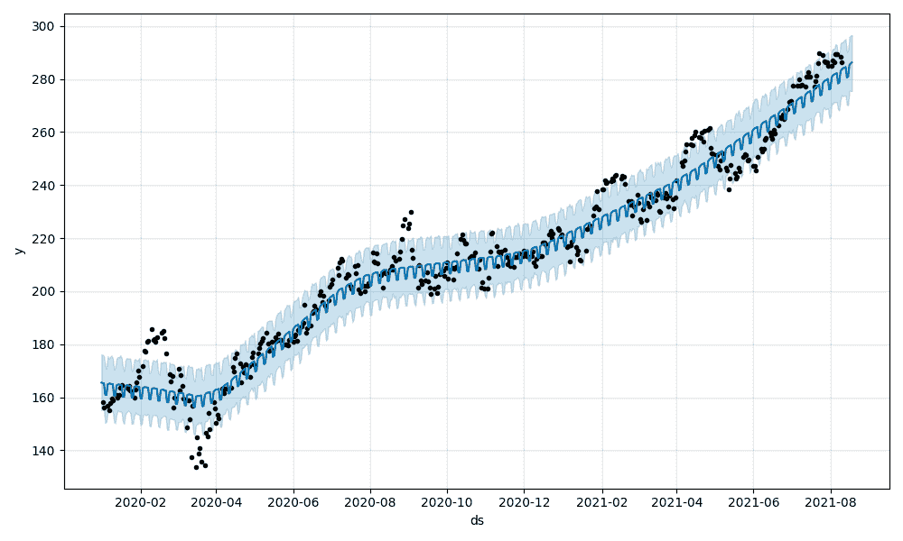
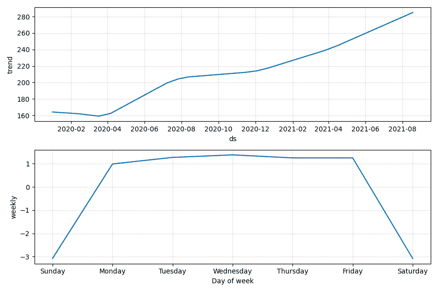

# 使用 FastAPI 和 Heroku 部署和托管机器学习模型

> 原文：<https://testdriven.io/blog/fastapi-machine-learning/>

假设你是一名数据科学家。按照典型的机器学习工作流程，您将根据业务需求定义问题陈述以及目标。然后，您将开始查找和清理数据，接着分析收集的数据并构建和训练您的模型。一旦训练完毕，你将评估结果。这个查找和清理数据、训练模型以及评估结果的过程将会继续，直到您对结果满意为止。然后，您将重构代码，并将其与依赖项一起打包到一个模块中，为测试和部署做准备。

接下来会发生什么？您会将模型交给另一个团队来测试和部署吗？还是要自己处理？无论哪种方式，理解部署模型时会发生什么都很重要。有一天你可能不得不自己部署这个模型。或者你可能有一个副业项目，你只是想站在生产，并提供给最终用户。

在本教程中，我们将看看如何使用 [FastAPI](https://fastapi.tiangolo.com/) 在 Heroku 上将预测股票价格的机器学习模型作为 RESTful API 部署到生产中。

## 目标

在这篇文章结束时，你应该能够:

1.  用 Python 和 FastAPI 开发 RESTful API
2.  建立一个基本的机器学习模型来预测股票价格
3.  将 FastAPI 应用程序部署到 Heroku
4.  使用 Heroku 容器注册中心将 Docker 部署到 Heroku

## FastAPI

FastAPI 是一个现代的、高性能的、内置电池的 Python web 框架，非常适合构建 RESTful APIs。它可以处理同步和异步请求，并内置了对数据验证、JSON 序列化、认证和授权以及 [OpenAPI](https://swagger.io/docs/specification/about/) 的支持。

亮点:

1.  受 Flask 的启发，它有一种轻量级微框架的感觉，支持类似 Flask 的 route decorators。
2.  它利用 Python 类型提示进行参数声明，支持数据验证(通过 [pydantic](https://pydantic-docs.helpmanual.io/) )和 OpenAPI/Swagger 文档。
3.  它建立在 [Starlette](https://www.starlette.io/) 之上，支持异步 API 的开发。
4.  它很快。由于 async 比传统的同步线程模型更有效，所以在性能方面它可以与 Node 和 Go 竞争。

> 查看官方文档中的[功能](https://fastapi.tiangolo.com/features/)指南，了解更多信息。我们也鼓励大家回顾一下[的替代方案、灵感和比较](https://fastapi.tiangolo.com/alternatives/)，其中详细介绍了 FastAPI 与其他 web 框架和技术的比较。

## 项目设置

创建一个名为“fastapi-ml”的项目文件夹:

```py
`$ mkdir fastapi-ml
$ cd fastapi-ml` 
```

然后，创建并激活新的虚拟环境:

```py
`$ python3.8 -m venv env
$ source env/bin/activate
(env)$` 
```

增加两个新文件: *requirements.txt* 和 *main.py* 。

与 Django 或 Flask 不同，FastAPI 没有内置的开发服务器。因此，我们将使用[uvicon](https://www.uvicorn.org/)，一个 [ASGI](https://asgi.readthedocs.io/en/latest/) 服务器，来提供 FastAPI。

> 不熟悉 ASGI？通读精彩的 ASGI 简介:异步 Python Web 生态系统的出现。

将 FastAPI 和 Uvicorn 添加到需求文件中:

```py
`fastapi==0.68.0
uvicorn==0.14.0` 
```

安装依赖项:

```py
`(env)$ pip install -r requirements.txt` 
```

然后，在 *main.py* 中，创建一个新的 FastAPI 实例，并设置一个快速测试路径:

```py
`from fastapi import FastAPI

app = FastAPI()

@app.get("/ping")
def pong():
    return {"ping": "pong!"}` 
```

启动应用程序:

```py
`(env)$ uvicorn main:app --reload --workers 1 --host 0.0.0.0 --port 8008` 
```

因此，我们为 Uvicorn 定义了以下[设置](https://www.uvicorn.org/settings/):

1.  `--reload`启用自动重新加载，这样服务器将在对代码库进行更改后重新启动。
2.  `--workers 1`提供单个工作进程。
3.  `--host 0.0.0.0`定义托管服务器的地址。
4.  `--port 8008`定义托管服务器的端口。

`main:app`告诉 Uvicorn 在哪里可以找到 FastAPI ASGI 应用程序——例如，“在‘main . py’文件中，您会找到 ASGI 应用程序，`app = FastAPI()`。

导航到[http://localhost:8008/ping](http://localhost:8008/ping)。您应该看到:

## ML 模型

我们将部署的模型使用 [Prophet](https://facebook.github.io/prophet/) 来预测股票市场价格。

添加以下函数来训练模型并生成一个预测到名为 *model.py* 的新文件中:

```py
`import datetime
from pathlib import Path

import joblib
import pandas as pd
import yfinance as yf
from fbprophet import Prophet

BASE_DIR = Path(__file__).resolve(strict=True).parent
TODAY = datetime.date.today()

def train(ticker="MSFT"):
    # data = yf.download("^GSPC", "2008-01-01", TODAY.strftime("%Y-%m-%d"))
    data = yf.download(ticker, "2020-01-01", TODAY.strftime("%Y-%m-%d"))
    data.head()
    data["Adj Close"].plot(title=f"{ticker} Stock Adjusted Closing Price")

    df_forecast = data.copy()
    df_forecast.reset_index(inplace=True)
    df_forecast["ds"] = df_forecast["Date"]
    df_forecast["y"] = df_forecast["Adj Close"]
    df_forecast = df_forecast[["ds", "y"]]
    df_forecast

    model = Prophet()
    model.fit(df_forecast)

    joblib.dump(model, Path(BASE_DIR).joinpath(f"{ticker}.joblib"))

def predict(ticker="MSFT", days=7):
    model_file = Path(BASE_DIR).joinpath(f"{ticker}.joblib")
    if not model_file.exists():
        return False

    model = joblib.load(model_file)

    future = TODAY + datetime.timedelta(days=days)

    dates = pd.date_range(start="2020-01-01", end=future.strftime("%m/%d/%Y"),)
    df = pd.DataFrame({"ds": dates})

    forecast = model.predict(df)

    model.plot(forecast).savefig(f"{ticker}_plot.png")
    model.plot_components(forecast).savefig(f"{ticker}_plot_components.png")

    return forecast.tail(days).to_dict("records")

def convert(prediction_list):
    output = {}
    for data in prediction_list:
        date = data["ds"].strftime("%m/%d/%Y")
        output[date] = data["trend"]
    return output` 
```

这里，我们定义了三个函数:

1.  `train`用 [yfinance](https://github.com/ranaroussi/yfinance) 下载历史股票数据，创建一个新的 Prophet 模型，将模型拟合到股票数据，然后将模型序列化保存为 [Joblib 文件](https://joblib.readthedocs.io/en/latest/generated/joblib.dump.html)。
2.  `predict`加载并反序列化保存的模型，生成新的预测，创建预测图和预测组件的图像，并以字典列表的形式返回预测中包含的日期。
3.  `convert`从`predict`获取字典列表，并输出日期和预测值的字典(即`{"07/02/2020": 200}`)。

> 这个模型是由安德鲁·克拉克开发的。

更新需求文件:

```py
`# pystan must be installed before prophet
# you may need to pip install it on it's own
# before installing the remaining requirements
# pip install pystan==2.19.1.1

pystan==2.19.1.1

fastapi==0.68.0
uvicorn==0.14.0

fbprophet==0.7.1
joblib==1.0.1
pandas==1.3.1
plotly==5.1.0
yfinance==0.1.63` 
```

安装新的依赖项:

```py
`(env)$ pip install -r requirements.txt` 
```

> 如果在你的机器上安装依赖项有问题，你可以使用 Docker 来代替。有关如何使用 Docker 运行应用程序的说明，请查看 GitHub 上的 [fastapi-ml](https://github.com/testdrivenio/fastapi-ml) repo 上的自述文件。

要进行测试，请打开一个新的 Python shell 并运行以下命令:

```py
`(env)$ python

>>> from model import train, predict, convert
>>> train()
>>> prediction_list = predict()
>>> convert(prediction_list)` 
```

您应该会看到类似如下的内容:

```py
`{
    '08/12/2021': 282.99012951691776,
    '08/13/2021': 283.31354121099446,
    '08/14/2021': 283.63695290507127,
    '08/15/2021': 283.960364599148,
    '08/16/2021': 284.2837762932248,
    '08/17/2021': 284.6071879873016,
    '08/18/2021': 284.93059968137834
}` 
```

这是微软公司(MSFT)未来七天的预测价格。记下保存的 *MSFT.joblib* 模型以及两个图像:





继续训练更多的模型来工作。例如:

```py
`>>> train("GOOG")
>>> train("AAPL")
>>> train("^GSPC")` 
```

退出外壳。

至此，让我们连接我们的 API。

## 路线

通过更新 *main.py* 添加一个`/predict`端点，如下所示:

```py
`from fastapi import FastAPI, HTTPException
from pydantic import BaseModel

from model import convert, predict

app = FastAPI()

# pydantic models

class StockIn(BaseModel):
    ticker: str

class StockOut(StockIn):
    forecast: dict

# routes

@app.get("/ping")
async def pong():
    return {"ping": "pong!"}

@app.post("/predict", response_model=StockOut, status_code=200)
def get_prediction(payload: StockIn):
    ticker = payload.ticker

    prediction_list = predict(ticker)

    if not prediction_list:
        raise HTTPException(status_code=400, detail="Model not found.")

    response_object = {"ticker": ticker, "forecast": convert(prediction_list)}
    return response_object` 
```

因此，在新的`get_prediction`视图函数中，我们向模型的`predict`函数传递了一个 ticker，然后使用`convert`函数为响应对象创建输出。我们还利用 pydantic [模式](https://pydantic-docs.helpmanual.io/usage/schema/)将 JSON 有效负载转换为`StockIn`对象模式。这提供了自动类型验证。响应对象使用`StockOut`模式对象将 Python dict - `{"ticker": ticker, "forecast": convert(prediction_list)}` -转换为 JSON，并再次进行验证。

对于 web 应用程序，我们只需在 JSON 中输出预测。注释掉`predict`中的以下几行:

```py
`# model.plot(forecast).savefig(f"{ticker}_plot.png")
# model.plot_components(forecast).savefig(f"{ticker}_plot_components.png")` 
```

全功能:

```py
`def predict(ticker="MSFT", days=7):
    model_file = Path(BASE_DIR).joinpath(f"{ticker}.joblib")
    if not model_file.exists():
        return False

    model = joblib.load(model_file)

    future = TODAY + datetime.timedelta(days=days)

    dates = pd.date_range(start="2020-01-01", end=future.strftime("%m/%d/%Y"),)
    df = pd.DataFrame({"ds": dates})

    forecast = model.predict(df)

    # model.plot(forecast).savefig(f"{ticker}_plot.png")
    # model.plot_components(forecast).savefig(f"{ticker}_plot_components.png")

    return forecast.tail(days).to_dict("records")` 
```

运行应用程序:

```py
`(env)$ uvicorn main:app --reload --workers 1 --host 0.0.0.0 --port 8008` 
```

然后，在新的终端窗口中，使用 curl 测试端点:

```py
`$ curl \
  --header "Content-Type: application/json" \
  --request POST \
  --data '{"ticker":"MSFT"}' \
  http://localhost:8008/predict` 
```

您应该会看到类似这样的内容:

```py
`{ "ticker":"MSFT", "forecast":{ "08/12/2021":  282.99012951691776, "08/13/2021":  283.31354121099446, "08/14/2021":  283.63695290507127, "08/15/2021":  283.960364599148, "08/16/2021":  284.2837762932248, "08/17/2021":  284.6071879873016, "08/18/2021":  284.93059968137834 } }` 
```

如果 ticker 模型不存在会怎么样？

```py
`$ curl \
  --header "Content-Type: application/json" \
  --request POST \
  --data '{"ticker":"NONE"}' \
  http://localhost:8008/predict

{
  "detail": "Model not found."
}` 
```

## Heroku 部署

Heroku 是一个平台即服务(PaaS ),为网络应用提供托管服务。它们提供了抽象的环境，您无需管理底层基础设施，从而轻松管理、部署和扩展 web 应用程序。只需几次点击，您就可以启动并运行您的应用程序，准备接收流量。

注册一个 Heroku 账号(如果你还没有的话)，然后安装 [Heroku CLI](https://devcenter.heroku.com/articles/heroku-cli) (如果你还没有的话)。

接下来，通过 CLI 登录您的 Heroku 帐户:

系统会提示您按任意键打开 web 浏览器以完成登录。

在 Heroku 上创建一个新应用程序:

您应该会看到类似如下的内容:

```py
`Creating app... done, ⬢ tranquil-cliffs-74287
https://tranquil-cliffs-74287.herokuapp.com/ | https://git.heroku.com/tranquil-cliffs-74287.git` 
```

接下来，我们将使用 Heroku 的[容器注册表](https://devcenter.heroku.com/articles/container-registry-and-runtime)来部署带有 [Docker](https://www.docker.com/) 的应用程序。简单地说，通过容器注册中心，您可以将预构建的 Docker 映像部署到 Heroku。

> 为什么是 Docker？我们希望最小化生产和开发环境之间的差异。这对于这个项目尤其重要，因为它依赖于许多具有非常具体的系统要求的数据科学依赖项。

登录 Heroku 容器注册表，向 Heroku 表明我们想要使用容器运行时:

向项目根目录添加一个 *Dockerfile* 文件:

```py
`FROM  python:3.8

WORKDIR  /app

RUN  apt-get -y update  && apt-get install -y \
  python3-dev \
  apt-utils \
  python-dev \
  build-essential \
&& rm -rf /var/lib/apt/lists/*

RUN  pip install --upgrade setuptools
RUN  pip install \
    cython==0.29.24 \
    numpy==1.21.1 \
    pandas==1.3.1 \
    pystan==2.19.1.1

COPY  requirements.txt .
RUN  pip install -r requirements.txt

COPY  . .

CMD  gunicorn -w 3 -k uvicorn.workers.UvicornWorker main:app --bind 0.0.0.0:$PORT` 
```

在这里，在提取 Python 3.8 基础映像后，我们安装了适当的依赖项，复制了应用程序，并运行了生产级 WSGI 应用服务器 [Gunicorn](https://gunicorn.org/) ，以管理具有三个工作进程的 Uvicorn。这种配置利用了并发性(通过 Uvicorn)和并行性(通过 Gunicorn workers)。

将 Gunicorn 添加到 *requirements.txt* 文件中:

```py
`# pystan must be installed before prophet
# you may need to pip install it on it's own
# before installing the remaining requirements
# pip install pystan==2.19.1.1

pystan==2.19.1.1

fastapi==0.68.0
gunicorn==20.1.0
uvicorn==0.14.0

fbprophet==0.7.1
joblib==1.0.1
pandas==1.3.1
plotly==5.1.0
yfinance==0.1.63` 
```

加一个*。dockerignore* 文件也一样:

构建 Docker 映像，并用以下格式对其进行标记:

```py
`registry.heroku.com/<app>/<process-type>` 
```

确保将`<app>`替换为您刚刚创建的 Heroku 应用程序的名称，将`<process-type>`替换为`web`，因为这将用于 [web 流程](https://devcenter.heroku.com/articles/procfile#the-web-process-type)。

例如:

```py
`$ docker build -t registry.heroku.com/tranquil-cliffs-74287/web .` 
```

安装`fbprophet`需要几分钟时间。耐心点。你应该看到它挂在这里一段时间:

```py
`Running setup.py install for fbprophet: started` 
```

完成后，您可以像这样运行映像:

```py
`$ docker run --name fastapi-ml -e PORT=8008 -p 8008:8008 -d registry.heroku.com/tranquil-cliffs-74287/web:latest` 
```

确保[http://localhost:8008/ping](http://localhost:8008/ping)按预期工作。完成后，停止并移除容器:

```py
`$ docker stop fastapi-ml
$ docker rm fastapi-ml` 
```

将图像推送到注册表:

```py
`$ docker push registry.heroku.com/tranquil-cliffs-74287/web` 
```

发布图像:

```py
`$ heroku container:release -a tranquil-cliffs-74287 web` 
```

这将运行容器。您现在应该可以查看您的应用程序了。确保测试`/predict`终点:

```py
`$ curl \
  --header "Content-Type: application/json" \
  --request POST \
  --data '{"ticker":"MSFT"}' \
  https://<YOUR_HEROKU_APP_NAME>.herokuapp.com/predict` 
```

最后，查看 FastAPI 在`https://<YOUR_HEROKU_APP_NAME>.herokuapp.com/docs`自动生成的交互式 API 文档:


## 结论

本教程介绍了如何在 Heroku 上使用 FastAPI 将一个用于预测股票价格的机器学习模型作为 RESTful API 部署到生产中。

下一步是什么？

1.  建立数据库以保存预测结果
2.  创建一个生产 Docker 文件，该文件使用多级 Docker 构建来减小生产映像的大小
3.  添加日志记录和监控
4.  将视图函数和模型预测函数转换为异步函数
5.  将预测作为后台任务运行，以防止阻塞
6.  添加测试
7.  将训练好的模型存储到 AWS S3，在 Heroku 的[短暂文件系统](https://devcenter.heroku.com/articles/dynos#ephemeral-filesystem)之外

查看以下资源以获得上述内容的帮助:

1.  [使用 FastAPI 和 Pytest 开发和测试异步 API](https://testdriven.io/blog/fastapi-crud/)
2.  [用 FastAPI 和 Docker 进行测试驱动开发](https://testdriven.io/courses/tdd-fastapi/)

如果您正在部署一个非平凡的模型，我建议添加模型版本控制和对反事实分析的支持以及模型监控(模型和特性漂移，偏差检测)。查看 [Monitaur](https://monitaur.ai/) 平台以获得这些方面的帮助。

您可以在 [fastapi-ml](https://github.com/testdrivenio/fastapi-ml) repo 中找到代码。