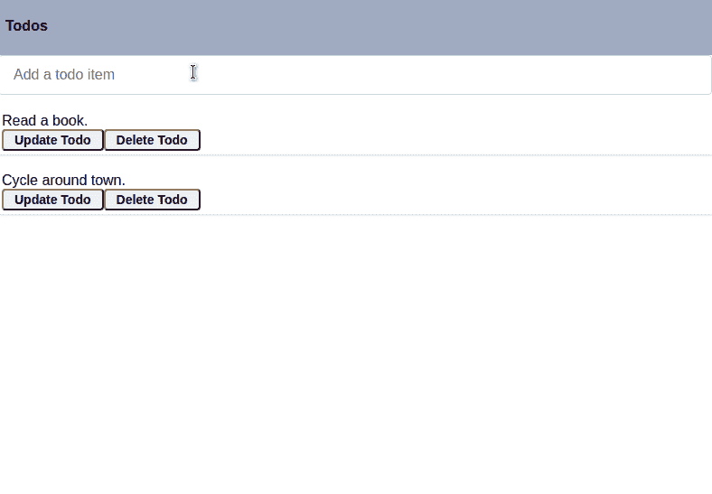
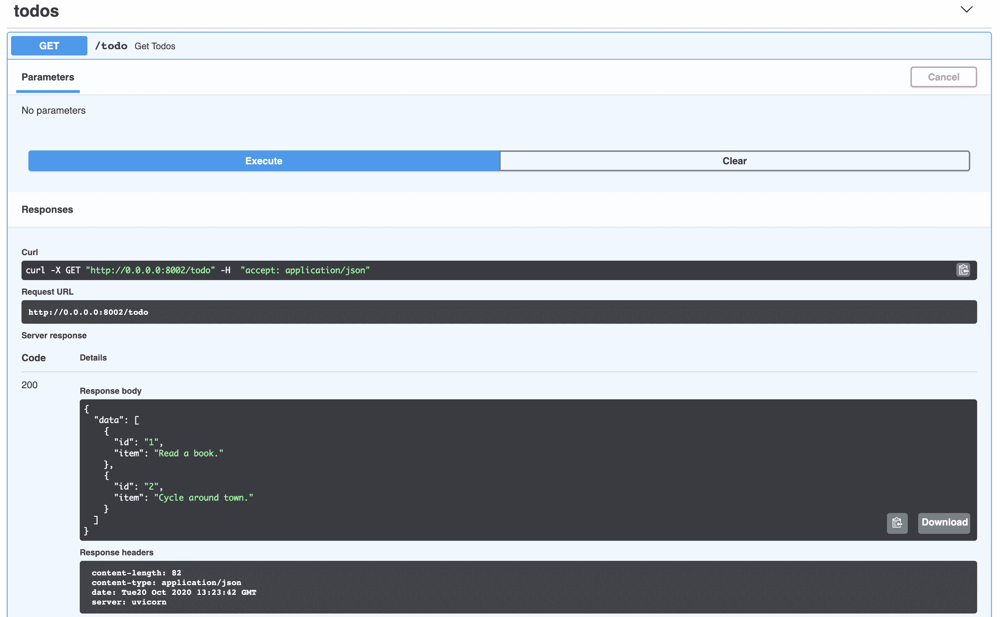
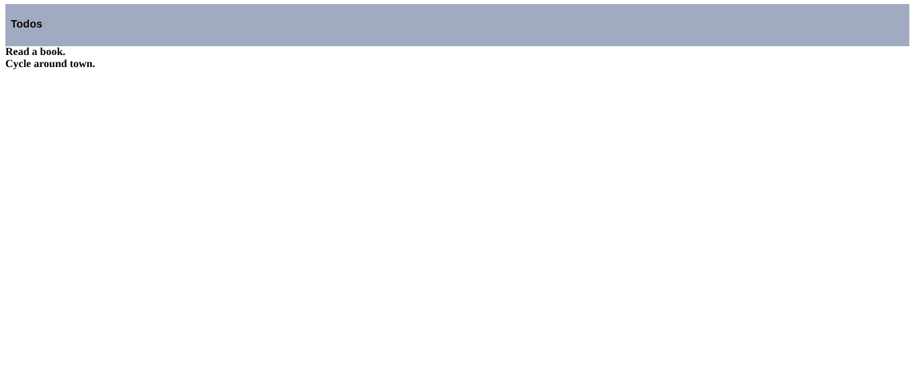
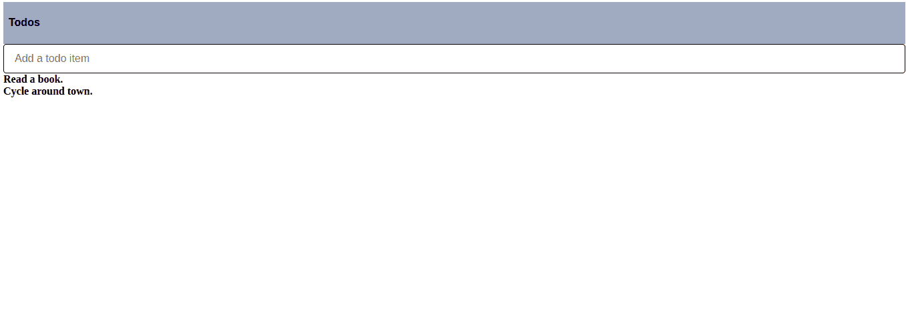
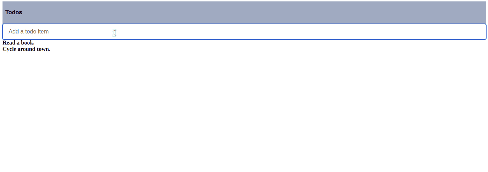
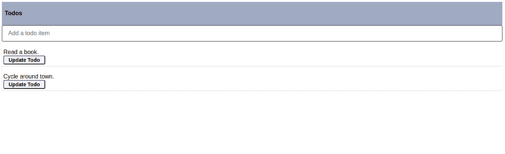
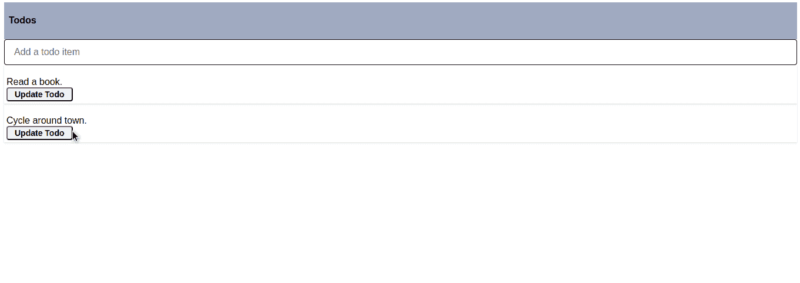
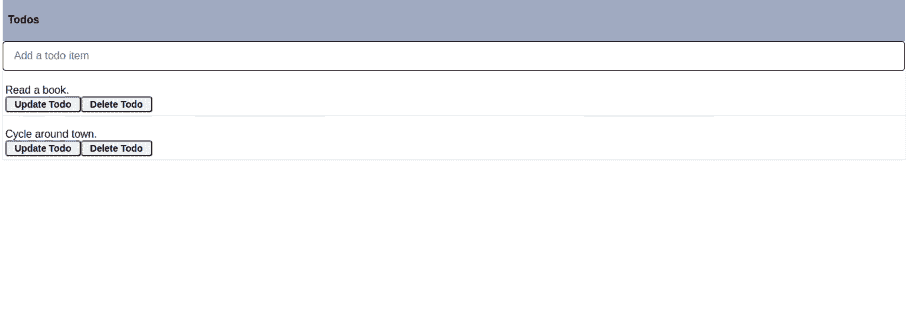
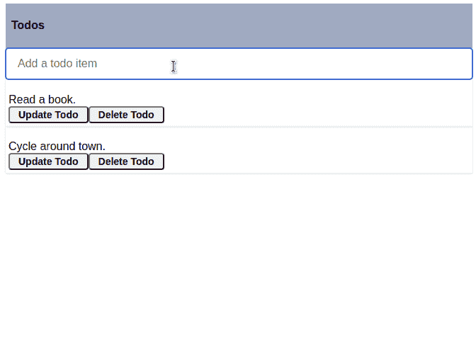

# 使用 FastAPI 和 React 开发单页面应用程序

> 原文：<https://testdriven.io/blog/fastapi-react/>

在本教程中，你将使用 [FastAPI](https://fastapi.tiangolo.com/) 和 [React](https://reactjs.org/) 构建一个 CRUD 应用。在用 FastAPI 构建后端 RESTful API 之前，我们将首先用 [Create React app](https://create-react-app.dev/) CLI 搭建一个新的 React App。最后，我们将开发后端 CRUD 路径以及前端 React 组件。

*最终应用*:



*依赖关系:*

*   React v18.1.0
*   创建 React 应用版本 5.0.1
*   节点 v18.2.0
*   npm 版本 8.9.0
*   npx v8.9.0
*   FastAPI v0.78.0
*   Python v3.10 版

> 在开始本教程之前，您应该熟悉 React 是如何工作的。要快速复习 React，请查看[主要概念](https://reactjs.org/docs/hello-world.html)指南或[React 简介](https://reactjs.org/tutorial/tutorial.html)教程。

## 目标

本教程结束时，您将能够:

1.  用 Python 和 FastAPI 开发 RESTful API
2.  使用创建 React 应用程序搭建 React 项目
3.  用 React 上下文 API 和钩子管理状态操作
4.  在浏览器中创建并渲染 React 组件
5.  将 React 应用程序连接到 FastAPI 后端

## 什么是 FastAPI？

FastAPI 是一个 Python web 框架，旨在构建快速高效的后端 API。它处理同步和异步操作，并内置了对数据验证、认证和由 OpenAPI 驱动的交互式 API 文档的支持。

有关 FastAPI 的更多信息，请查看以下资源:

1.  [正式文件](https://fastapi.tiangolo.com/)
2.  [FastAPI 教程](/blog/topics/fastapi/)

## 什么是反应？

React 是一个开源的、基于组件的 JavaScript UI 库，用于构建前端应用程序。

更多信息，请查看官方文档中的[入门指南](https://reactjs.org/docs/getting-started.html)。

## 设置 FastAPI

首先创建一个新文件夹来保存名为“fastapi-react”的项目:

```
`$ mkdir fastapi-react
$ cd fastapi-react` 
```

在“fastapi-react”文件夹中，创建一个新文件夹来存放后端:

```
`$ mkdir backend
$ cd backend` 
```

接下来，创建并激活虚拟环境:

```
`$ python3.10 -m venv venv
$ source venv/bin/activate
$ export PYTHONPATH=$PWD` 
```

> 你可以随意把 venv 和 Pip 换成[诗歌](https://python-poetry.org)或 [Pipenv](https://github.com/pypa/pipenv) 。更多信息，请查看[现代 Python 环境](/blog/python-environments/)。

Install FastAPI:

```
`(venv)$ pip install fastapi==0.78.0 uvicorn==0.17.6` 
```

[uvicon](http://www.uvicorn.org/)是一个 [ASGI](https://asgi.readthedocs.io/en/latest/) (异步服务器网关接口)兼容服务器，将用于支持后端 API。

接下来，在“后端”文件夹中创建以下文件和文件夹:

```
`└── backend
    ├── main.py
    └── app
        ├── __init__.py
        └── api.py` 
```

在 *main.py* 文件中，定义运行应用程序的入口点:

```
`import uvicorn

if __name__ == "__main__":
    uvicorn.run("app.api:app", host="0.0.0.0", port=8000, reload=True)` 
```

在这里，我们指示该文件在端口 8000 上运行一个 Uvicorn 服务器，并在每次文件更改时重新加载。

在通过入口点文件启动服务器之前，在 *backend/app/api.py* 中创建一个基本路由:

```
`from fastapi import FastAPI
from fastapi.middleware.cors import CORSMiddleware

app = FastAPI()

origins = [
    "http://localhost:3000",
    "localhost:3000"
]

app.add_middleware(
    CORSMiddleware,
    allow_origins=origins,
    allow_credentials=True,
    allow_methods=["*"],
    allow_headers=["*"]
)

@app.get("/", tags=["root"])
async def read_root() -> dict:
    return {"message": "Welcome to your todo list."}` 
```

为什么我们需要[中间件](https://fastapi.tiangolo.com/tutorial/cors/#use-corsmiddleware)？为了进行跨来源请求——即来自不同协议、IP 地址、域名或端口的请求——您需要启用[跨来源资源共享](https://en.wikipedia.org/wiki/Cross-origin_resource_sharing) (CORS)。FastAPI 的内置`CORSMiddleware`为我们处理这个问题。

上述配置将允许来自我们前端域和端口的跨来源请求，这些请求将在`localhost:3000`运行。

> 关于 FastAPI 中 CORS 处理的更多信息，请查看官方[文档](https://fastapi.tiangolo.com/tutorial/cors/)。

从控制台运行入口点文件:

在浏览器中导航至 [http://localhost:8000](http://localhost:8000) 。您应该看到:

```
`{ "message":  "Welcome to your todo list." }` 
```

## 设置 React

同样，我们将使用 [Create React App](https://create-react-app.dev/) CLI 工具通过 [npx](https://docs.npmjs.com/cli/v9/commands/npx) 搭建一个新的 React 应用。

在新的终端窗口中，导航到项目目录，然后生成新的 React 应用程序:

> 如果这是您第一次使用 Create React App 工具搭建 React 应用程序，请查看[文档](https://create-react-app.dev/docs/getting-started)。

为了简单起见，删除“src”文件夹中除了 *index.js* 文件之外的所有文件。 *index.js* 是我们的基础组件。

接下来，安装一个名为 [Chakra UI](http://chakra-ui.com/) 的 UI 组件库:

安装完成后，在“src”文件夹中创建一个名为“components”的新文件夹，用于存放应用程序的组件，以及两个组件， *Header.jsx* 和 *Todos.jsx* :

```
`$ cd src
$ mkdir components
$ cd components
$ touch {Header,Todos}.jsx` 
```

我们将从 *Header.jsx* 文件中的`Header`组件开始:

```
`import React from "react";
import { Heading, Flex, Divider } from "@chakra-ui/react";

const Header = () => {
  return (
    <Flex
      as="nav"
      align="center"
      justify="space-between"
      wrap="wrap"
      padding="0.5rem"
      bg="gray.400"
    >
      <Flex align="center" mr={5}>
        <Heading as="h1" size="sm">Todos</Heading>
        <Divider />
      </Flex>
    </Flex>
  );
};

export default Header;` 
```

从 Chakra UI 导入 React 和 [Heading](https://chakra-ui.com/heading) 、 [Flex](https://chakra-ui.com/flex) 和 [Divider](https://chakra-ui.com/divider) 组件后，我们定义了一个组件来呈现一个基本的 header。然后，该元件被导出以用于基础元件。

接下来，让我们重写 *index.js* 中的基本组件。将前面的代码替换为:

```
`import React from "react";
import { render } from 'react-dom';
import { ChakraProvider } from "@chakra-ui/react";

import Header from "./components/Header";

function App() {
  return (
    <ChakraProvider>
      <Header />
    </ChakraProvider>
  )
}

const rootElement = document.getElementById("root")
render(<App />, rootElement)` 
```

[ChakraProvider](https://chakra-ui.com/theme) ，从 Chakra UI 库中导入，作为使用 Chakra UI 的其他组件的父组件。它通过 React 的[上下文 API](https://reactjs.org/docs/context.html) 为所有子组件(本例中为`Header`)提供一个主题。

从终端启动 React 应用程序:

这将在您的默认浏览器中打开 React 应用程序，位于 [http://localhost:3000](http://localhost:3000) 。您应该看到:


## 我们在建造什么？

在本教程的剩余部分，您将构建一个 todo CRUD 应用程序来创建、读取、更新和删除 todo。最终，您的应用程序将如下所示:


## 获取路线

### 后端

首先将待办事项列表添加到 *backend/app/api.py* :

```
`todos = [
    {
        "id": "1",
        "item": "Read a book."
    },
    {
        "id": "2",
        "item": "Cycle around town."
    }
]` 
```

> 上面的列表只是本教程使用的虚拟数据。这些数据只是简单地表示了各个 todos 的结构。请随意连接数据库并在那里存储 todos。

然后，添加路由处理程序:

```
`@app.get("/todo", tags=["todos"])
async def get_todos() -> dict:
    return { "data": todos }` 
```

在[http://localhost:8000/todo](http://localhost:8000/todo)手动测试新路由。也可以在[http://localhost:8000/docs](http://localhost:8000/docs)查看交互文档:



### 前端

在 *Todos.jsx* 组件中，首先导入 React、`useState()`和`useEffect()`钩子，以及一些 Chakra UI 组件:

```
`import  React,  {  useEffect,  useState  }  from  "react"; import  { Box, Button, Flex, Input, InputGroup, Modal, ModalBody, ModalCloseButton, ModalContent, ModalFooter, ModalHeader, ModalOverlay, Stack, Text, useDisclosure }  from  "@chakra-ui/react";` 
```

`useState`钩子负责管理我们的应用程序的本地状态，而`useEffect`钩子允许我们执行数据获取等操作。

> 关于 React 钩子的更多信息，请查阅 React 钩子的入门教程和官方文档中的介绍钩子的 T2 教程。

接下来，创建一个跨所有组件管理全局状态活动的上下文:

```
`const  TodosContext  =  React.createContext({ todos:  [],  fetchTodos:  ()  =>  {} })` 
```

在上面的代码块中，我们通过 [createContext](https://reactjs.org/docs/context.html#reactcreatecontext) 定义了一个上下文对象，它接受两个提供者值:`todos`和`fetchTodos`。`fetchTodos`函数将在下一个代码块中定义。

> 想了解更多关于使用 React 上下文 API 管理状态的信息吗？查看 [React 上下文 API:轻松管理状态](https://auth0.com/blog/react-context-api-managing-state-with-ease/)文章。

接下来，添加`Todos`组件:

```
`export  default  function  Todos()  { const  [todos,  setTodos]  =  useState([]) const  fetchTodos  =  async  ()  =>  { const  response  =  await  fetch("http://localhost:8000/todo") const  todos  =  await  response.json() setTodos(todos.data) } }` 
```

这里，我们创建了一个空的状态变量数组`todos`和一个状态方法`setTodos`，因此我们可以更新状态变量。接下来，我们定义了一个名为`fetchTodos`的函数，从后端异步检索 todos，并在函数结束时更新`todo`状态变量。

接下来，在`Todos`组件中，使用`fetchTodos`函数检索 todos，并通过迭代 todos 状态变量来呈现数据:

```
`useEffect(()  =>  { fetchTodos() },  []) return  ( <TodosContext.Provider  value={{todos,  fetchTodos}}> <Stack  spacing={5}> {todos.map((todo)  =>  ( <b>{todo.item}</b> ))} </Stack> </TodosContext.Provider> )` 
```

*Todos.jsx* 现在应该是这样的:

```
`import React, { useEffect, useState } from "react";
import {
    Box,
    Button,
    Flex,
    Input,
    InputGroup,
    Modal,
    ModalBody,
    ModalCloseButton,
    ModalContent,
    ModalFooter,
    ModalHeader,
    ModalOverlay,
    Stack,
    Text,
    useDisclosure
} from "@chakra-ui/react";

const TodosContext = React.createContext({
  todos: [], fetchTodos: () => {}
})

export default function Todos() {
  const [todos, setTodos] = useState([])
  const fetchTodos = async () => {
    const response = await fetch("http://localhost:8000/todo")
    const todos = await response.json()
    setTodos(todos.data)
  }
  useEffect(() => {
    fetchTodos()
  }, [])
  return (
    <TodosContext.Provider value={{todos, fetchTodos}}>
      <Stack spacing={5}>
        {todos.map((todo) => (
          <b>{todo.item}</b>
        ))}
      </Stack>
    </TodosContext.Provider>
  )
}` 
```

导入 *index.js* 文件中的`Todos`组件并渲染:

```
`import React from "react";
import { render } from 'react-dom';
import { ChakraProvider } from "@chakra-ui/react";

import Header from "./components/Header";
import Todos from "./components/Todos";  // new

function App() {
  return (
    <ChakraProvider>
      <Header />
      <Todos />  {/* new */}
    </ChakraProvider>
  )
}

const rootElement = document.getElementById("root")
render(<App />, rootElement)` 
```

您在 [http://localhost:3000](http://localhost:3000) 的应用程序现在应该是这样的:



尝试在 *backend/app/api.py* 中的`todos`列表中添加一个新的 todo。刷新浏览器。您应该会看到新的 todo。这样，我们就完成了检索所有 todos 的 GET 请求。

## 邮寄路线

### 后端

首先添加一个新的路由处理程序来处理向 *backend/app/api.py* 添加新 todo 的 POST 请求:

```
`@app.post("/todo", tags=["todos"])
async def add_todo(todo: dict) -> dict:
    todos.append(todo)
    return {
        "data": { "Todo added." }
    }` 
```

随着后端的运行，您可以使用`curl`在新的终端选项卡中测试 POST 路由:

```
`$ curl -X POST http://localhost:8000/todo -d \
    '{"id": "3", "item": "Buy some testdriven courses."}' \
    -H 'Content-Type: application/json'` 
```

您应该看到:

```
`{ "data: [
 "Todo  added."
 ]" }` 
```

您还应该在来自[http://localhost:8000/todo](http://localhost:8000/todo)端点以及 [http://localhost:3000](http://localhost:3000) 的响应中看到新的 todo。

> 作为练习，实现一个检查来防止添加重复的 todo 项。

### 前端

首先添加用于向*frontend/src/components/todos . jsx*添加新 todo 的 shell:

```
`function  AddTodo()  { const  [item,  setItem]  =  React.useState("") const  {todos,  fetchTodos}  =  React.useContext(TodosContext) }` 
```

这里，我们创建了一个新的状态变量来保存表单中的值。我们还检索了上下文值，`todos`和`fetchTodos`。

接下来，向`AddTodo`添加从表单获取输入和处理表单提交的函数:

```
`const  handleInput  =  event  =>  { setItem(event.target.value) } const  handleSubmit  =  (event)  =>  { const  newTodo  =  { "id":  todos.length  +  1, "item":  item } fetch("http://localhost:8000/todo",  { method:  "POST", headers:  {  "Content-Type":  "application/json"  }, body:  JSON.stringify(newTodo) }).then(fetchTodos) }` 
```

在`handleSubmit`函数中，我们添加了一个 POST 请求，并用 todo 信息将数据发送到服务器。然后我们调用`fetchTodos`来更新`todos`。

就在`handleSubmit`函数之后，返回要呈现的表单:

```
`return (
  <form onSubmit={handleSubmit}>
    <InputGroup size="md">
      <Input
        pr="4.5rem"
        type="text"
        placeholder="Add a todo item"
        aria-label="Add a todo item"
        onChange={handleInput}
      />
    </InputGroup>
  </form>
)` 
```

在上面的代码块中，我们将表单`onSubmit`事件监听器设置为我们之前创建的`handleSubmit`函数。通过`onChange`监听器，当输入值改变时，todo 项值也会更新。

完整的`AddTodo`组件现在应该看起来像这样:

```
`function AddTodo() {
  const [item, setItem] = React.useState("")
  const {todos, fetchTodos} = React.useContext(TodosContext)

  const handleInput = event  => {
    setItem(event.target.value)
  }

  const handleSubmit = (event) => {
    const newTodo = {
      "id": todos.length + 1,
      "item": item
    }

    fetch("http://localhost:8000/todo", {
      method: "POST",
      headers: { "Content-Type": "application/json" },
      body: JSON.stringify(newTodo)
    }).then(fetchTodos)
  }

  return (
    <form onSubmit={handleSubmit}>
      <InputGroup size="md">
        <Input
          pr="4.5rem"
          type="text"
          placeholder="Add a todo item"
          aria-label="Add a todo item"
          onChange={handleInput}
        />
      </InputGroup>
    </form>
  )
}` 
```

接下来，将`AddTodo`组件添加到`Todos`组件，如下所示:

```
`export default function Todos() {
  const [todos, setTodos] = useState([])
  const fetchTodos = async () => {
    const response = await fetch("http://localhost:8000/todo")
    const todos = await response.json()
    setTodos(todos.data)
  }
  useEffect(() => {
    fetchTodos()
  }, [])
  return (
    <TodosContext.Provider value={{todos, fetchTodos}}>
      <AddTodo />  {/* new */}
      <Stack spacing={5}>
        {todos.map((todo) => (
          <b>{todo.item}</b>
        ))}
      </Stack>
    </TodosContext.Provider>
  )
}` 
```

前端应用程序应该如下所示:



通过添加 todo 来测试表单:



## 放置路线

### 后端

添加更新路由:

```
`@app.put("/todo/{id}", tags=["todos"])
async def update_todo(id: int, body: dict) -> dict:
    for todo in todos:
        if int(todo["id"]) == id:
            todo["item"] = body["item"]
            return {
                "data": f"Todo with id {id} has been updated."
            }

    return {
        "data": f"Todo with id {id} not found."
    }` 
```

因此，我们检查 ID 与所提供的 ID 相匹配的 todo，如果找到，就用来自请求体的值更新 todo 的项目。

### 前端

首先在*frontend/src/components/todos . jsx*中定义组件`UpdateTodo`，并向其传递两个属性值`item`和`id`:

```
`function  UpdateTodo({item,  id})  { const  {isOpen,  onOpen,  onClose}  =  useDisclosure() const  [todo,  setTodo]  =  useState(item) const  {fetchTodos}  =  React.useContext(TodosContext) }` 
```

上面的状态变量是用于模态的，我们将很快创建它，并保存要更新的 todo 值。还导入了`fetchTodos`上下文值，用于在做出更改后更新`todos`。

现在，让我们编写负责发送 PUT 请求的函数。在`UpdateTodo`组件主体中，在状态和上下文变量之后，添加以下内容:

```
`const  updateTodo  =  async  ()  =>  { await  fetch(`http://localhost:8000/todo/${id}`,  { method:  "PUT", headers:  {  "Content-Type":  "application/json"  }, body:  JSON.stringify({  item:  todo  }) }) onClose() await  fetchTodos() }` 
```

在上面的异步函数中，一个 PUT 请求被发送到后端，然后调用`onClose()`方法来关闭模态。然后调用`fetchTodos()`。

接下来，渲染模态:

```
`return (
  <>
    <Button h="1.5rem" size="sm" onClick={onOpen}>Update Todo</Button>
    <Modal isOpen={isOpen} onClose={onClose}>
      <ModalOverlay/>
      <ModalContent>
        <ModalHeader>Update Todo</ModalHeader>
        <ModalCloseButton/>
        <ModalBody>
          <InputGroup size="md">
            <Input
              pr="4.5rem"
              type="text"
              placeholder="Add a todo item"
              aria-label="Add a todo item"
              value={todo}
              onChange={event => setTodo(event.target.value)}
            />
          </InputGroup>
        </ModalBody>

        <ModalFooter>
          <Button h="1.5rem" size="sm" onClick={updateTodo}>Update Todo</Button>
        </ModalFooter>
      </ModalContent>
    </Modal>
  </>
)` 
```

在上面的代码中，我们使用 Chakra UI 的[模态](https://chakra-ui.com/modal)组件创建了一个模态。在模态体中，我们监听对文本框的更改，并更新了状态对象`todo`。最后，当点击按钮“Update Todo”时，函数`updateTodo()`被调用，我们的 Todo 被更新。

完整的组件现在应该看起来像这样:

```
`function UpdateTodo({item, id}) {
  const {isOpen, onOpen, onClose} = useDisclosure()
  const [todo, setTodo] = useState(item)
  const {fetchTodos} = React.useContext(TodosContext)

  const updateTodo = async () => {
    await fetch(`http://localhost:8000/todo/${id}`, {
      method: "PUT",
      headers: { "Content-Type": "application/json" },
      body: JSON.stringify({ item: todo })
    })
    onClose()
    await fetchTodos()
  }

  return (
    <>
      <Button h="1.5rem" size="sm" onClick={onOpen}>Update Todo</Button>
      <Modal isOpen={isOpen} onClose={onClose}>
        <ModalOverlay/>
        <ModalContent>
          <ModalHeader>Update Todo</ModalHeader>
          <ModalCloseButton/>
          <ModalBody>
            <InputGroup size="md">
              <Input
                pr="4.5rem"
                type="text"
                placeholder="Add a todo item"
                aria-label="Add a todo item"
                value={todo}
                onChange={e => setTodo(e.target.value)}
              />
            </InputGroup>
          </ModalBody>

          <ModalFooter>
            <Button h="1.5rem" size="sm" onClick={updateTodo}>Update Todo</Button>
          </ModalFooter>
        </ModalContent>
      </Modal>
    </>
  )
}` 
```

在将组件添加到`Todos`组件之前，让我们添加一个用于渲染 todos 的助手组件来稍微清理一下:

```
`function TodoHelper({item, id, fetchTodos}) {
  return (
    <Box p={1} shadow="sm">
      <Flex justify="space-between">
        <Text mt={4} as="div">
          {item}
          <Flex align="end">
            <UpdateTodo item={item} id={id} fetchTodos={fetchTodos}/>
          </Flex>
        </Text>
      </Flex>
    </Box>
  )
}` 
```

在上面的组件中，我们呈现了传递给组件的 todo，并为其附加了一个 update 按钮。

替换`Todos`组件内`return`块中的代码:

```
`return (
  <TodosContext.Provider value={{todos, fetchTodos}}>
    <AddTodo />
    <Stack spacing={5}>
      {
        todos.map((todo) => (
          <TodoHelper item={todo.item} id={todo.id} fetchTodos={fetchTodos} />
        ))
      }
    </Stack>
  </TodosContext.Provider>
)` 
```

浏览器应该有一个刷新的外观:



验证它是否工作:



## 删除路线

### 后端

最后，添加删除路径:

```
`@app.delete("/todo/{id}", tags=["todos"])
async def delete_todo(id: int) -> dict:
    for todo in todos:
        if int(todo["id"]) == id:
            todos.remove(todo)
            return {
                "data": f"Todo with id {id} has been removed."
            }

    return {
        "data": f"Todo with id {id} not found."
    }` 
```

### 前端

让我们编写一个用于删除 todo 的组件，它将在`TodoHelper`组件中使用:

```
`function DeleteTodo({id}) {
  const {fetchTodos} = React.useContext(TodosContext)

  const deleteTodo = async () => {
    await fetch(`http://localhost:8000/todo/${id}`, {
      method: "DELETE",
      headers: { "Content-Type": "application/json" },
      body: { "id": id }
    })
    await fetchTodos()
  }

  return (
    <Button h="1.5rem" size="sm" onClick={deleteTodo}>Delete Todo</Button>
  )
}` 
```

这里，我们从调用全局状态对象的`fetchTodos`函数开始。接下来，我们创建了一个异步函数，它向服务器发送一个删除请求，然后通过再次调用`fetchTodos`来更新 todos 列表。最后，我们渲染了一个按钮，当点击时，触发`deleteTodo()`。

接下来，将`DeleteTodo`组件添加到`TodoHelper`中:

```
`function TodoHelper({item, id, fetchTodos}) {
  return (
    <Box p={1} shadow="sm">
      <Flex justify="space-between">
        <Text mt={4} as="div">
          {item}
          <Flex align="end">
            <UpdateTodo item={item} id={id} fetchTodos={fetchTodos}/>
            <DeleteTodo id={id} fetchTodos={fetchTodos}/>  {/* new */}
          </Flex>
        </Text>
      </Flex>
    </Box>
  )
}` 
```

客户端应用程序应该自动更新:



现在，测试删除按钮:



## 结论

本教程讲述了使用 FastAPI 和 React 设置 CRUD 应用程序的基础知识。

通过回顾本教程开头的目标来检查您的理解。您可以在 [fastapi-react](https://github.com/testdrivenio/fastapi-react) repo 中找到源代码。感谢阅读。

寻找一些挑战？

1.  使用本[指南](https://www.netlify.com/blog/2016/07/22/deploy-react-apps-in-less-than-30-seconds/)将 React 应用程序部署到 Netlify，并在后端更新 CORS 对象，以便使用环境变量对其进行动态配置。
2.  将后端 API 服务器部署到 Heroku，并替换前端的连接 URL。同样，为此使用一个[环境变量](https://create-react-app.dev/docs/adding-custom-environment-variables/)。你可以从[用 FastAPI 和 Heroku 部署和托管机器学习模型](/blog/fastapi-machine-learning/)教程中学习将 FastAPI 部署到 Heroku 的基础知识。如果想了解更多的基础知识，可以去看看[的测试驱动开发与 FastAPI 和 Docker](/courses/tdd-fastapi/) 课程。
3.  用 pytest 为后端设置单元和集成测试，用 React 测试库为前端设置测试。使用 FastAPI 和 Docker 的[测试驱动开发](/courses/tdd-fastapi/)课程涵盖了如何使用 pytest 测试 FastAPI，而使用 Flask、React 和 Docker 的[认证](/courses/auth-flask-react/)详细介绍了如何使用 Jest 和 React 测试库测试 React 应用。