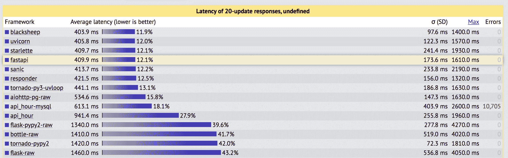
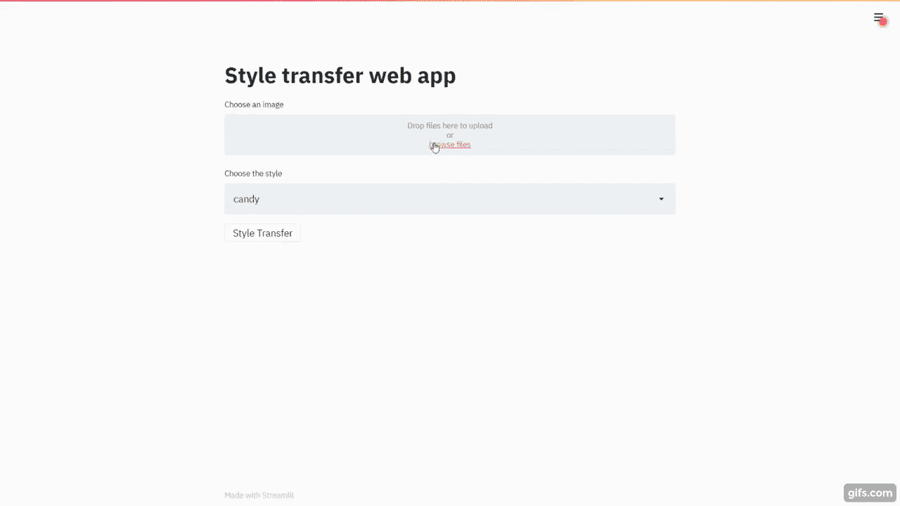

# 使用 FastAPI 和 Streamlit 为机器学习模型提供服务

> 原文：<https://testdriven.io/blog/fastapi-streamlit/>

机器学习是目前的热门话题。随着科技公司朝着人工智能和机器学习的方向发展，以尽早兑现，该领域已经变得非常大。这些公司中的许多都创建了自己的机器学习解决方案，并使用基于订阅的模式将其出售给其他人。

由于大多数机器学习模型都是用 Python 开发的，因此为它们提供服务的 web 框架通常也是基于 Python 的。很长一段时间，Flask 这个微框架就是 goto 框架。但这种情况正在改变。一个旨在弥补 Flask 几乎所有不足的新框架正变得越来越流行。它叫做 [FastAPI](https://fastapi.tiangolo.com/) 。

FastAPI 比 Flask 快，因为它将异步函数处理程序带到了表中:



来源: [TechEmpower Web 框架基准](https://www.techempower.com/benchmarks/#section=data-r19&hw=ph&test=fortune)

从上图可以看出，FastAPI 几乎比 Flask 快 3 倍。

> 第三个位置由[小明星](https://www.starlette.io/)担任，FastAPI 就是建立在这个位置上的。

FastAPI 还支持通过 [pydantic](https://pydantic-docs.helpmanual.io/) 和[自动 API 文档](https://fastapi.tiangolo.com/features/#automatic-docs)进行数据验证。

> 查看官方文档中的[功能](https://fastapi.tiangolo.com/features/)指南，了解更多信息。我们也鼓励大家回顾一下[的替代方案、灵感和比较](https://fastapi.tiangolo.com/alternatives/)，其中详细介绍了 FastAPI 与其他 web 框架和技术的比较。

与此同时，Streamlit 是一个应用程序框架，使数据科学家和机器学习工程师可以轻松创建与机器学习模型交互的强大用户界面。

> 虽然 Streamlit 可以用于生产，但它最适合快速原型制作。通过使用 FastAPI 提供模型，在原型获得批准后，您可以使用 Dash 或 React 快速转移到生产就绪的 UI。

这样，我们将基于实时风格转换的[感知损失和超分辨率](https://cs.stanford.edu/people/jcjohns/eccv16/)论文以及[贾斯廷·约翰逊](https://web.eecs.umich.edu/~justincj/)的[预训练模型](https://github.com/jcjohnson/fast-neural-style)构建一个[风格转换](https://en.wikipedia.org/wiki/Neural_Style_Transfer)应用程序。我们将使用 FastAPI 作为后端来服务我们的预测，Streamlit 用于用户界面，而 [OpenCV](https://en.wikipedia.org/wiki/OpenCV) 用于进行实际的预测。Docker 也将被使用。

> OpenCV 的深度神经网络(DNN)模块的一个强大功能是，它可以从 Torch、TensorFlow 和 Caffe 加载训练好的模型，有效地节省了我们安装这些依赖项的麻烦。

## 目标

本教程结束时，您将能够:

1.  用 Python 和 FastAPI 开发异步 API
2.  用 FastAPI 提供机器学习模型
3.  使用 Streamlit 开发用户界面
4.  用 Docker 容器化 FastAPI 和简化 it
5.  利用 asyncio 在请求/响应流之外的后台执行代码

## 项目设置

创建名为“style-transfer”的项目文件夹:

```py
`$ mkdir style-transfer
$ cd style-transfer` 
```

然后，用“style-transfer”新建两个文件夹:

```py
`$ mkdir frontend
$ mkdir backend` 
```

添加 *__init__。py* 文件到每个文件夹。

## FastAPI Backend

向“后端”添加一个名为 *main.py* 的新文件:

```py
`# backend/main.py

import uuid

import cv2
import uvicorn
from fastapi import File
from fastapi import FastAPI
from fastapi import UploadFile
import numpy as np
from PIL import Image

import config
import inference

app = FastAPI()

@app.get("/")
def read_root():
    return {"message": "Welcome from the API"}

@app.post("/{style}")
def get_image(style: str, file: UploadFile = File(...)):
    image = np.array(Image.open(file.file))
    model = config.STYLES[style]
    output, resized = inference.inference(model, image)
    name = f"/storage/{str(uuid.uuid4())}.jpg"
    cv2.imwrite(name, output)
    return {"name": name}

if __name__ == "__main__":
    uvicorn.run("main:app", host="0.0.0.0", port=8080)` 
```

这是我们的服务器。FastAPI 创建了两个端点，一个是虚拟的(`"/"`)，另一个是为我们的预测服务的(`"/{style}"`)。服务端点接受一个名称作为 URL 参数。我们使用九个不同的训练模型来执行风格转换，因此 path 参数会告诉我们选择哪个模型。该图像通过 POST 请求作为文件被接受，并发送给`inference`函数。一旦推理完成，文件就存储在本地文件系统中，路径作为响应发送。

接下来，将以下配置添加到名为 *backend/config.py* 的新文件中:

```py
`# backend/config.py

MODEL_PATH = "./models/"

STYLES = {
    "candy": "candy",
    "composition 6": "composition_vii",
    "feathers": "feathers",
    "la_muse": "la_muse",
    "mosaic": "mosaic",
    "starry night": "starry_night",
    "the scream": "the_scream",
    "the wave": "the_wave",
    "udnie": "udnie",
}` 
```

引入时，风格转移是一个游戏改变者。唯一的缺点是，必须对图像进行训练以获得一种风格。这意味着，要得到一个有风格的图像，你需要在得到一个更好的结果之前多次运行原始图像。2016 年，[实时风格传输和超分辨率的感知损失](https://cs.stanford.edu/people/jcjohns/eccv16/)论文介绍了快速风格传输，这意味着你可以在一次通过中对任何图像进行风格化。我们将对作者提供的经过训练的模型使用相同的技术。

现在，我们需要下载模型。向名为 *download_models.sh* 的项目根目录添加一个脚本:

```py
`BASE_URL="https://cs.stanford.edu/people/jcjohns/fast-neural-style/models/"

mkdir -p backend/models/
cd backend/models/
curl -O "$BASE_URL/instance_norm/candy.t7"
curl -O "$BASE_URL/instance_norm/la_muse.t7"
curl -O "$BASE_URL/instance_norm/mosaic.t7"
curl -O "$BASE_URL/instance_norm/feathers.t7"
curl -O "$BASE_URL/instance_norm/the_scream.t7"
curl -O "$BASE_URL/instance_norm/udnie.t7"
curl -O "$BASE_URL/eccv16/the_wave.t7"
curl -O "$BASE_URL/eccv16/starry_night.t7"
curl -O "$BASE_URL/eccv16/la_muse.t7"
curl -O "$BASE_URL/eccv16/composition_vii.t7"` 
```

下载:

将`inference`函数添加到 *backend/inference.py* :

```py
`# backend/inference.py

import config
import cv2

def inference(model, image):
    model_name = f"{config.MODEL_PATH}{model}.t7"
    model = cv2.dnn.readNetFromTorch(model_name)

    height, width = int(image.shape[0]), int(image.shape[1])
    new_width = int((640 / height) * width)
    resized_image = cv2.resize(image, (new_width, 640), interpolation=cv2.INTER_AREA)

    # Create our blob from the image
    # Then perform a forward pass run of the network
    # The Mean values for the ImageNet training set are R=103.93, G=116.77, B=123.68

    inp_blob = cv2.dnn.blobFromImage(
        resized_image,
        1.0,
        (new_width, 640),
        (103.93, 116.77, 123.68),
        swapRB=False,
        crop=False,
    )

    model.setInput(inp_blob)
    output = model.forward()

    # Reshape the output Tensor,
    # add back the mean substruction,
    # re-order the channels
    output = output.reshape(3, output.shape[2], output.shape[3])
    output[0] += 103.93
    output[1] += 116.77
    output[2] += 123.68

    output = output.transpose(1, 2, 0)
    return output, resized_image` 
```

这里，我们加载了 Torch 模型，执行了大小调整，并将其转换为所需的 blob 格式。然后，我们将预处理后的图像传递到网络/模型中，并获得输出。后处理的图像和调整大小的图像作为输出返回。

最后，将依赖项添加到需求文件中:

```py
`# backend/requirements.txt

fastapi
numpy
opencv-python
pillow
python-multipart
uvicorn` 
```

后端到此为止。让我们配置 Docker，然后进行测试。

## Docker 设置

首先，将一个 *Dockerfile* 添加到“后端”文件夹:

```py
`# backend/Dockerfile

FROM  python:3.10.1-slim

WORKDIR  /app

RUN  apt-get update
RUN  apt-get install \
    'ffmpeg'\
    'libsm6'\
    'libxext6'  -y

COPY  requirements.txt .
RUN  pip install -r requirements.txt

COPY  . .

EXPOSE  8080

CMD  ["python",  "main.py"]` 
```

> OpenCV 需要 ffmpeg '，' libsm6 '和' libxext6 '。

从终端的“后端”文件夹中，构建映像:

```py
`$ docker build -t backend .` 
```

运行容器:

```py
`$ docker run -p 8080:8080 backend

INFO:     Started server process [1]
INFO:     Waiting for application startup.
INFO:     Application startup complete.
INFO:     Uvicorn running on http://0.0.0.0:8080 (Press CTRL+C to quit)` 
```

在浏览器中，导航至 [http://localhost:8080/](http://localhost:8080/) 。您应该看到:

```py
`{ "message":  "Welcome from the API" }` 
```

完成后杀死容器。

## 细流前端

对于 UI，添加一个 *main.py* 文件到“前端”文件夹:

```py
`# frontend/main.py

import requests
import streamlit as st
from PIL import Image

STYLES = {
    "candy": "candy",
    "composition 6": "composition_vii",
    "feathers": "feathers",
    "la_muse": "la_muse",
    "mosaic": "mosaic",
    "starry night": "starry_night",
    "the scream": "the_scream",
    "the wave": "the_wave",
    "udnie": "udnie",
}

# https://discuss.streamlit.io/t/version-0-64-0-deprecation-warning-for-st-file-uploader-decoding/4465
st.set_option("deprecation.showfileUploaderEncoding", False)

# defines an h1 header
st.title("Style transfer web app")

# displays a file uploader widget
image = st.file_uploader("Choose an image")

# displays the select widget for the styles
style = st.selectbox("Choose the style", [i for i in STYLES.keys()])

# displays a button
if st.button("Style Transfer"):
    if image is not None and style is not None:
        files = {"file": image.getvalue()}
        res = requests.post(f"http://backend:8080/{style}", files=files)
        img_path = res.json()
        image = Image.open(img_path.get("name"))
        st.image(image, width=500)` 
```

注意上面的代码注释。简而言之，我们创建了一个上传图像小部件和一个显示来自`STYLES`字典的每种样式的选择下拉列表。我们还添加了一个按钮，当按下该按钮时，会将图像作为 POST 请求负载发送到后端的`http://backend:8080/{style}`。在从后端接收到响应中的图像路径时，图像被打开并显示。

> 参考 Streamlit 的[入门](https://docs.streamlit.io/en/stable/getting_started.html)指南和 [API 参考](https://docs.streamlit.io/en/stable/api.html)以获得显示文本和数据以及添加与小部件的基本交互的帮助。

将 [Streamlit 依赖关系](https://pypi.org/project/streamlit/)添加到 *requirements.txt* 文件中:

```py
`# frontend/requirements.txt

streamlit==1.2.0` 
```

## 复合坞站

接下来，让我们对接前端，并用 Docker Compose 将两个容器连接在一起。

*前端/Dockerfile* :

```py
`# frontend/Dockerfile

FROM  python:3.10.1-slim

WORKDIR  /app

COPY  requirements.txt .
RUN  pip install -r requirements.txt

COPY  . .

EXPOSE  8501

CMD  ["streamlit",  "run",  "main.py"]` 
```

*码头-化合物. yml* :

```py
`version:  '3' services: frontend: build:  frontend ports: -  8501:8501 depends_on: -  backend volumes: -  ./storage:/storage backend: build:  backend ports: -  8080:8080 volumes: -  ./storage:/storage` 
```

这里最重要的是，我们将主机的存储映射到每个容器的存储。这对于共享路径很重要，对于在容器旋转时持久化数据也很重要。

因此，后端和前端都可以从同一个共享卷访问映像:

```py
`# backend
name = f"/storage/{str(uuid.uuid4())}.jpg"
cv2.imwrite(name, output)
return {"name": name}

# frontend
img_path = res.json()
image = Image.open(img_path.get("name"))` 
```

要进行测试，从项目根目录开始，构建映像并启动两个容器:

```py
`$ docker-compose up -d --build` 
```

导航到 [http://localhost:8501](http://localhost:8501) :



## 异步模型服务

既然您已经看到了如何使用 FastAPI、Streamlit 和 OpenCV 来执行样式转换，那么让我们做一个小实验。

FastAPI 最强大的特性之一是它支持异步函数。因此，让我们利用一个异步函数将输入图像转换成多种样式。我们将同步处理第一种样式，然后在后台处理其余模型时发回响应。

向 *backend/main.py* 添加以下函数:

```py
`# backend/main.py

async def generate_remaining_models(models, image, name: str):
    executor = ProcessPoolExecutor()
    event_loop = asyncio.get_event_loop()
    await event_loop.run_in_executor(
        executor, partial(process_image, models, image, name)
    )

def process_image(models, image, name: str):
    for model in models:
        output, resized = inference.inference(models[model], image)
        name = name.split(".")[0]
        name = f"{name.split('_')[0]}_{models[model]}.jpg"
        cv2.imwrite(name, output)` 
```

`generate_remaining_models`函数使用 [asyncio](https://docs.python.org/3/library/asyncio.html) 生成其余的每种风格。

> 查看[用并发性、并行性和 asyncio 加速 Python 的速度](/blog/concurrency-parallelism-asyncio/#asyncio)一文，了解关于 asyncio 的更多信息。

添加以下导入内容:

```py
`import asyncio

from concurrent.futures import ProcessPoolExecutor

from functools import partial` 
```

更新`get_image`函数，以便它在发送回响应之前创建异步任务:

```py
`# backend/main.py

@app.post("/{style}")
async def get_image(style: str, file: UploadFile = File(...)):
    image = np.array(Image.open(file.file))
    model = config.STYLES[style]
    start = time.time()
    output, resized = inference.inference(model, image)
    name = f"/storage/{str(uuid.uuid4())}.jpg"
    cv2.imwrite(name, output)
    models = config.STYLES.copy()
    del models[style]
    asyncio.create_task(generate_remaining_models(models, image, name))
    return {"name": name, "time": time.time() - start}` 
```

一旦做出第一个预测，我们将从原始样式的副本中删除该样式。然后将剩余的样式传递给`generate_remaining_models`。

添加导入:

接下来，更新 *frontend/main.py* 中下面的`if`语句块:

```py
`# frontend/main.py

if st.button("Style Transfer"):
    if image is not None and style is not None:
        files = {"file": image.getvalue()}
        res = requests.post(f"http://backend:8080/{style}", files=files)
        img_path = res.json()
        image = Image.open(img_path.get("name"))
        st.image(image)

        displayed_styles = [style]
        displayed = 1
        total = len(STYLES)

        st.write("Generating other models...")

        while displayed < total:
            for style in STYLES:
                if style not in displayed_styles:
                    try:
                        path = f"{img_path.get('name').split('.')[0]}_{STYLES[style]}.jpg"
                        image = Image.open(path)
                        st.image(image, width=500)
                        time.sleep(1)
                        displayed += 1
                        displayed_styles.append(style)
                    except:
                        pass` 
```

将导入添加到顶部:

因此，在显示了第一个样式之后，我们继续检查其余的样式，显示每一个样式，直到页面上显示了所有的九个样式。

更新容器并测试:

```py
`$ docker-compose up -d --build` 
```

现在，剩下的样式将异步显示，不会阻塞初始响应。

[](https://www.youtube.com/watch?v=XblrYvlXLnA "Style transfer demo")

## 结论

FastAPI 是 Flask 的一个现代异步替代方案。它有很多 Flask 没有的特性，而且比 Flask 快，因为它利用了 Starlette 并支持异步函数处理程序。FastAPI 有很多额外的特性，比如数据验证、自动化 API 文档、后台任务以及一个强大的依赖注入系统。此外，由于您最有可能利用 Python 类型提示(因此您可以利用数据验证)，由于编辑器自动完成和自动错误检查，您将能够更快地进行开发。

你可以在 GitHub 上的 [style-transfer](https://github.com/amalshaji/style-transfer) repo 中找到最终代码。