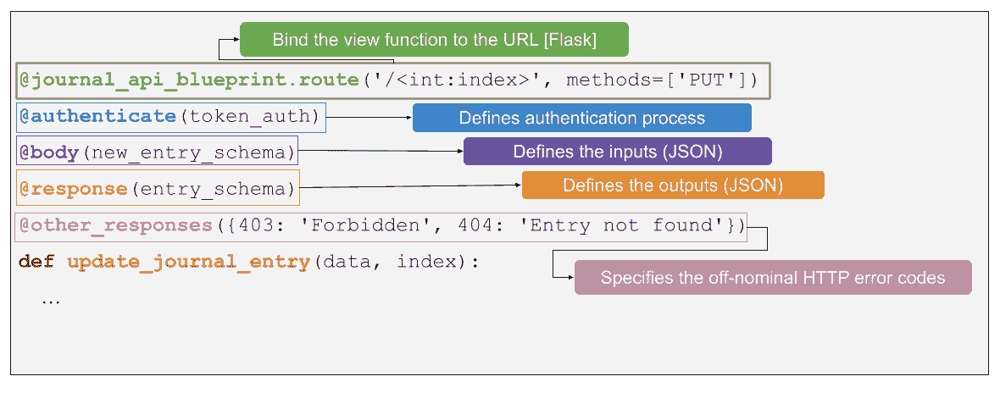
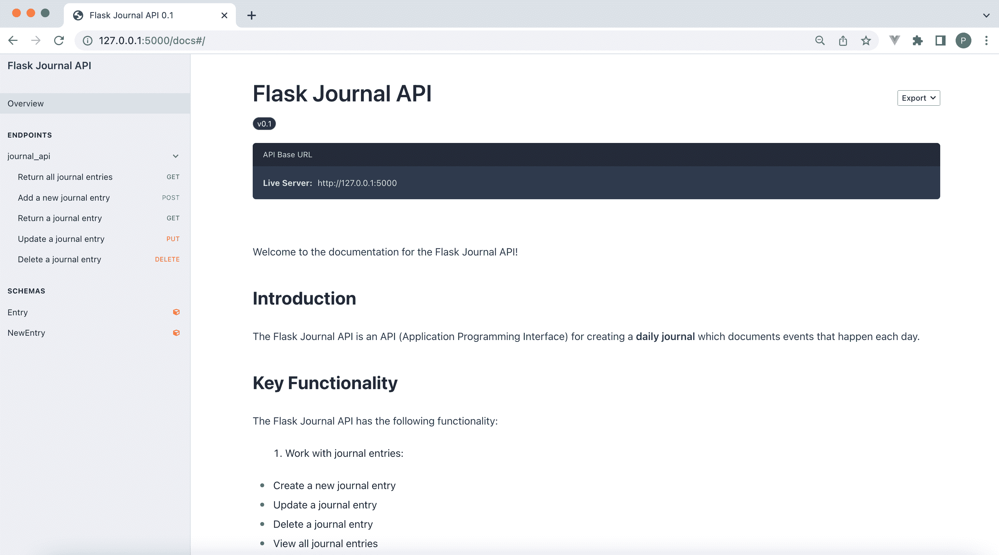
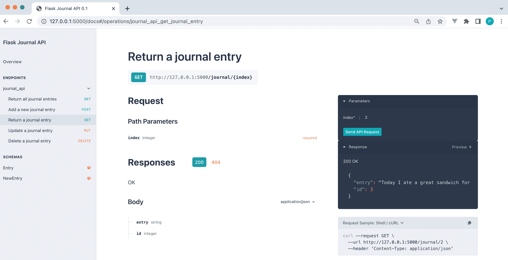
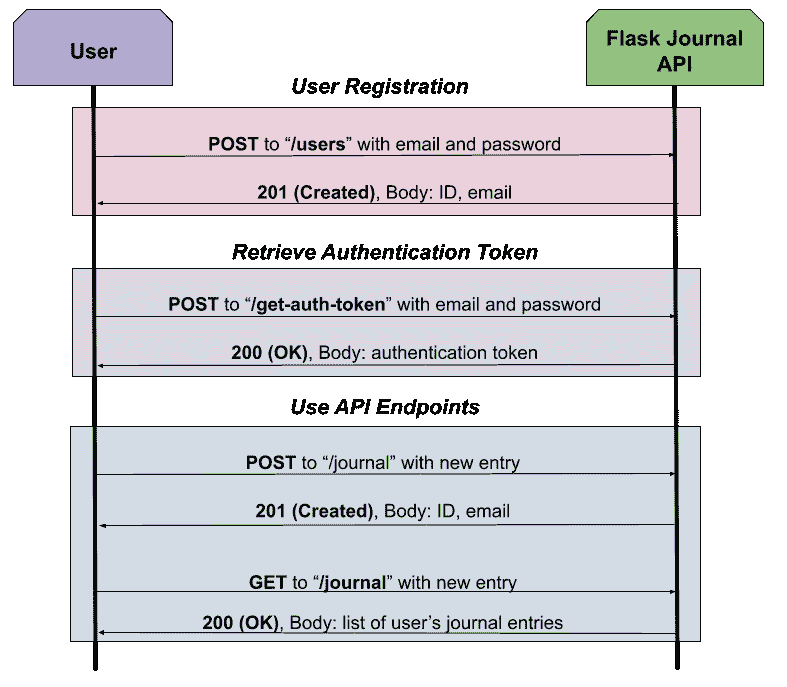

# 用 APIFairy 构建 Flask API

> 原文：<https://testdriven.io/blog/flask-apifairy/>

本教程演示了如何使用 [Flask](https://flask.palletsprojects.com/) 和 [APIFairy](https://apifairy.readthedocs.io/) 轻松创建 RESTful API。

## 目标

本教程结束时，您将能够:

1.  使用 APIFairy 提供的装饰器在 Flask 中创建 API 端点
2.  利用 Flask-Marshmallow 定义 API 端点的输入/输出模式
3.  使用 APIFairy 生成 API 文档
4.  将关系数据库与 API 端点集成在一起
5.  使用 Flask-HTTPAuth 实现基本和令牌认证

## 什么是蜂仙？

APIFairy 是一个由 T2 编写的 API 框架，允许用 Flask 轻松创建 API。

APIFairy 为在 Flask 中轻松创建 API 提供了四个关键组件:

1.  装修工
2.  计划
3.  证明
4.  证明文件

让我们详细探索每一个...

### 装修工

APIFairy 提供了一组[装饰器](https://apifairy.readthedocs.io/en/latest/decorators.html)，用于定义每个 API 端点的输入、输出和认证:



APIFairy 提供了五个核心装饰器:

1.  [@arguments](https://apifairy.readthedocs.io/en/latest/decorators.html#arguments) -指定 URL 的查询字符串中的输入参数
2.  [@body](https://apifairy.readthedocs.io/en/latest/decorators.html#body) -将输入的 JSON 主体指定为模式
3.  [@response](https://apifairy.readthedocs.io/en/latest/decorators.html#response) -将输出 JSON 主体指定为模式
4.  [@other_responses](https://apifairy.readthedocs.io/en/latest/decorators.html#other-responses) -指定可以返回的附加响应(通常是错误)(仅限*文档*)
5.  [@authenticate](https://apifairy.readthedocs.io/en/latest/decorators.html#authenticate) -指定认证过程

### 计划

API 端点的输入(使用`@body`装饰器)和输出(使用`@response`装饰器)被定义为模式:

```
`class EntrySchema(ma.Schema):
    """Schema defining the attributes in a journal entry."""
    id = ma.Integer()
    entry = ma.String()
    user_id = ma.Integer()` 
```

模式利用[棉花糖](https://marshmallow.readthedocs.io/)将数据类型定义为类。

### 证明

`@authenticate`装饰器用于检查每个 API 端点的 URL 请求中提供的认证头。身份验证方案是使用 [Flask-HTTPAuth](https://flask-httpauth.readthedocs.io/) 实现的，它也是由 Miguel Grinberg 创建的。

典型的 API 认证方法是定义[基本认证](https://flask-httpauth.readthedocs.io/#basic-authentication-examples)来保护获取认证令牌的路径:

```
`basic_auth = HTTPBasicAuth()

@basic_auth.verify_password
def verify_password(email, password):
    user = User.query.filter_by(email=email).first()
    if user.is_password_correct(password):
        return user` 
```

并且还定义了[令牌认证](https://flask-httpauth.readthedocs.io/en/latest/#token-authentication-example)，用于基于时间敏感认证令牌保护大多数路由:

```
`token_auth = HTTPTokenAuth()

@token_auth.verify_token
def verify_token(auth_token):
    return User.verify_auth_token(auth_token)` 
```

### 证明文件

APIFairy 的一个伟大特性是自动生成的漂亮的 API 文档:



文档是基于源代码中的文档字符串以及以下配置变量生成的:

1.  `APIFAIRY_TITLE` -项目名称
2.  `APIFAIRY_VERSION` -项目的版本字符串
3.  `APIFAIRY_UI`-API 文件的格式

对于`APIFAIRY_UI`，您可以从以下 OpenAPI 文档渲染器之一生成模板:

1.  [Swagger UI](https://swagger.io/tools/swagger-ui/)
2.  [ReDoc](https://github.com/Redocly/redoc)
3.  [RapiDoc](https://rapidocweb.com/)
4.  [元素](https://stoplight.io/open-source/elements)

> 有关可用配置变量的完整列表，请参考[配置](https://apifairy.readthedocs.io/en/latest/intro.html#configuration)文档。

## 我们在建造什么？

在本教程中，您将开发一个日志 API，允许用户每天记录事件。您可以在 GitLab 上的 [flask-journal-api](https://gitlab.com/patkennedy79/flask-journal-api) 资源库中找到完整的源代码。

使用的关键 Python 包:

1.  烧瓶:Python web 应用开发的微框架
2.  [API fairy](https://apifairy.readthedocs.io/):Flask 的 API 框架，使用-
3.  烧瓶的 ORM(对象关系映射器)

您将逐步开发 API:

1.  创建用于处理日记条目的 API 端点
2.  生成 API 文档
3.  添加一个关系数据库来存储日志条目
4.  添加身份验证以保护 API 端点

## API 端点

让我们开始使用 Flask 和 APIFairy 创建一个 API...

### 项目初始化

首先创建一个新的项目文件夹和一个虚拟环境:

```
`$ mkdir flask-journal-api
$ cd flask-journal-api
$ python3 -m venv venv
$ source venv/bin/activate
(venv)$` 
```

> 你可以随意把 virtualenv 和 Pip 换成诗歌[或](https://python-poetry.org) [Pipenv](https://github.com/pypa/pipenv) 。更多信息，请查看[现代 Python 环境](/blog/python-environments/)。

继续添加下列文件和文件夹:

```
`├── app.py
├── instance
│   └── .gitkeep
├── project
│   ├── __init__.py
│   └── journal_api
│       ├── __init__.py
│       └── routes.py
└── requirements.txt` 
```

接下来，为了安装必要的 Python 包，将依赖项添加到项目根目录下的 *requirements.txt* 文件中:

```
`apifairy==0.9.1
Flask==2.1.2
Flask-SQLAlchemy==2.5.1
marshmallow-sqlalchemy==0.28.0` 
```

安装:

```
`(venv)$ pip install -r requirements.txt` 
```

该烧瓶项目将利用烧瓶应用的两个最佳实践:

1.  [应用工厂](https://flask.palletsprojects.com/en/2.1.x/patterns/appfactories/) -用于在函数中创建 Flask 应用
2.  [蓝图](https://flask.palletsprojects.com/en/2.1.x/tutorial/views/#blueprints-and-views) -用于组织一组相关的视图

### 应用工厂

首先在*项目/__init__ 中定义应用工厂函数。py* :

```
`from apifairy import APIFairy
from flask import Flask, json
from flask_marshmallow import Marshmallow

# -------------
# Configuration
# -------------

# Create the instances of the Flask extensions in the global scope,
# but without any arguments passed in. These instances are not
# attached to the Flask application at this point.
apifairy = APIFairy()
ma = Marshmallow()

# ----------------------------
# Application Factory Function
# ----------------------------

def create_app():
    # Create the Flask application
    app = Flask(__name__)

    initialize_extensions(app)
    register_blueprints(app)
    return app

# ----------------
# Helper Functions
# ----------------

def initialize_extensions(app):
    # Since the application instance is now created, pass it to each Flask
    # extension instance to bind it to the Flask application instance (app)
    apifairy.init_app(app)
    ma.init_app(app)

def register_blueprints(app):
    # Import the blueprints
    from project.journal_api import journal_api_blueprint

    # Since the application instance is now created, register each Blueprint
    # with the Flask application instance (app)
    app.register_blueprint(journal_api_blueprint, url_prefix='/journal')` 
```

定义好应用工厂函数后，可以在项目顶层文件夹的 *app.py* 中调用:

```
`from project import create_app

# Call the application factory function to construct a Flask application
# instance using the development configuration
app = create_app()` 
```

### 蓝图

让我们定义一下`journal_api`蓝图。首先在*项目/journal_api/__init_ 中定义`journal_api`蓝图。py* :

```
`"""
The 'journal_api' blueprint handles the API for managing journal entries.
Specifically, this blueprint allows for journal entries to be added, edited,
and deleted.
"""
from flask import Blueprint

journal_api_blueprint = Blueprint('journal_api', __name__, template_folder='templates')

from . import routes` 
```

现在是时候在*project/journal _ API/routes . py*中为日志定义 API 端点了。

从必要的导入开始:

```
`from apifairy import body, other_responses, response
from flask import abort

from project import ma
from . import journal_api_blueprint` 
```

对于 Flask Journal API 的这个初始版本，数据库将是一个日志条目列表:

```
`# --------
# Database
# --------

messages = [
    dict(id=1, entry='The sun was shining when I woke up this morning.'),
    dict(id=2, entry='I tried a new fruit mixture in my oatmeal for breakfast.'),
    dict(id=3, entry='Today I ate a great sandwich for lunch.')
]` 
```

接下来，定义创建新日志条目和返回日志条目的模式:

```
`# -------
# Schemas
# -------

class NewEntrySchema(ma.Schema):
    """Schema defining the attributes when creating a new journal entry."""
    entry = ma.String(required=True)

class EntrySchema(ma.Schema):
    """Schema defining the attributes in a journal entry."""
    id = ma.Integer()
    entry = ma.String()

new_entry_schema = NewEntrySchema()
entry_schema = EntrySchema()
entries_schema = EntrySchema(many=True)` 
```

这两个模式类都继承自 [ma。图式](https://marshmallow.readthedocs.io/en/latest/api_reference.html#marshmallow.Schema)，由 Flask-Marshmallow 提供。创建这些模式的对象也是一个好主意，因为这允许您定义一个可以返回多个条目的模式(使用`many=True`参数)。

现在我们已经准备好定义 API 端点了！

### 路线

从检索所有日志条目开始:

```
`@journal_api_blueprint.route('/', methods=['GET'])
@response(entries_schema)
def journal():
    """Return all journal entries"""
    return messages` 
```

这个视图函数使用`@response`装饰器来定义返回多个条目。view 函数返回日志条目的完整列表(`return messages`)。

接下来，创建用于添加新日志条目的 API 端点:

```
`@journal_api_blueprint.route('/', methods=['POST'])
@body(new_entry_schema)
@response(entry_schema, 201)
def add_journal_entry(kwargs):
    """Add a new journal entry"""
    new_message = dict(**kwargs, id=messages[-1]['id']+1)
    messages.append(new_message)
    return new_message` 
```

这个视图函数使用`@body`装饰器来定义 API 端点的输入，使用`@response`装饰器来定义 API 端点的输出。

从`@body`装饰器解析的输入数据作为`kwargs`(**k**ey**w**ord**arg**uments)参数传递给`add_journal_entry()`视图函数。然后，该数据用于创建新的日志条目，并将其添加到数据库中:

```
`new_message = dict(**kwargs, id=messages[-1]['id']+1)
messages.append(new_message)` 
```

然后返回新创建的日志条目(`return new_message`)。注意`@response` decorator 如何将返回代码定义为 201 (Created ),以表示日志条目被添加到了数据库中。

创建用于检索特定日记条目的 API 端点:

```
`@journal_api_blueprint.route('/<int:index>', methods=['GET'])
@response(entry_schema)
@other_responses({404: 'Entry not found'})
def get_journal_entry(index):
    """Return a journal entry"""
    if index >= len(messages):
        abort(404)

    return messages[index]` 
```

这个视图函数使用`@other_responses`装饰器来指定非标准响应。

> 装饰器仅用于文档目的！它不提供任何返回错误代码的功能。

创建用于更新日记帐分录的 API 端点:

```
`@journal_api_blueprint.route('/<int:index>', methods=['PUT'])
@body(new_entry_schema)
@response(entry_schema)
@other_responses({404: 'Entry not found'})
def update_journal_entry(data, index):
    """Update a journal entry"""
    if index >= len(messages):
        abort(404)

    messages[index] = dict(data, id=index+1)
    return messages[index]` 
```

这个视图函数使用`@body`和`@response`装饰器来定义这个 API 端点的输入和输出。另外，如果没有找到日志条目，`@other_responses`装饰器定义了非标准响应。

最后，创建用于删除日志条目的 API 端点:

```
`@journal_api_blueprint.route('/<int:index>', methods=['DELETE'])
@other_responses({404: 'Entry not found'})
def delete_journal_entry(index):
    """Delete a journal entry"""
    if index >= len(messages):
        abort(404)

    messages.pop(index)
    return '', 204` 
```

这个视图函数不使用`@body`和`@response`装饰器，因为这个 API 端点没有输入或输出。如果日志条目被成功删除，则返回 204(无内容)状态代码，并且不包含任何数据。

### 运行烧瓶应用程序

为了进行测试，在一个终端窗口中，配置 Flask 应用程序并运行开发服务器:

```
`(venv) $ export FLASK_APP=app.py
(venv) $ export FLASK_ENV=development
(venv) $ flask run` 
```

然后，在不同的终端窗口中，您可以与 API 进行交互。在这里你可以随意使用你选择的工具，比如 cURL、 [HTTPie](https://httpie.io/) 、 [Requests](https://requests.readthedocs.io/) 或者 [Postman](https://www.postman.com/) 。

请求示例:

```
`$ python3

>>> import requests
>>>
>>> r = requests.get('http://127.0.0.1:5000/journal/')
>>> print(r.text)
>>>
>>> post_data = {'entry': "some message"}
>>> r = requests.post('http://127.0.0.1:5000/journal/', json=post_data)
>>> print(r.text)` 
```

> 想要更容易地测试 API 端点吗？查看这个脚本，它添加了 CLI 命令，用于与 API 端点进行交互，以检索、创建、更新和删除日志条目。

## 证明文件

APIFairy 的一个令人难以置信的特性是自动创建 API 文档！

配置 API 文档有三个关键方面:

1.  API 端点的文档字符串(即视图函数)
2.  整个 API 项目的 Docstring
3.  用于指定 API 文档外观的配置变量

我们已经在前一节中讨论了第一项，因为我们包括了每个视图函数的文档字符串。例如，`journal()`视图函数对这个 API 端点的用途有一个简短的描述:

```
`@journal_api_blueprint.route('/', methods=['GET'])
@response(entries_schema)
def journal():
    """Return all journal entries"""
    return messages` 
```

接下来，我们需要在*项目/__init__ 的顶部包含描述整个项目的 docstring。py* 文件:

```
`"""
Welcome to the documentation for the Flask Journal API!

## Introduction

The Flask Journal API is an API (Application Programming Interface) for creating a **daily journal** that documents events that happen each day.

## Key Functionality

The Flask Journal API has the following functionality:

1\. Work with journal entries:
 * Create a new journal entry
 * Update a journal entry
 * Delete a journal entry
 * View all journal entries
2\. <More to come!>

## Key Modules

This project is written using Python 3.10.1.

The project utilizes the following modules:

* **Flask**: micro-framework for web application development which includes the following dependencies:
 * **click**: package for creating command-line interfaces (CLI)
 * **itsdangerous**: cryptographically sign data
 * **Jinja2**: templating engine
 * **MarkupSafe**: escapes characters so text is safe to use in HTML and XML
 * **Werkzeug**: set of utilities for creating a Python application that can talk to a WSGI server
* **APIFairy**: API framework for Flask which includes the following dependencies:
 * **Flask-Marshmallow** - Flask extension for using Marshmallow (object serialization/deserialization library)
 * **Flask-HTTPAuth** - Flask extension for HTTP authentication
 * **apispec** - API specification generator that supports the OpenAPI specification
* **pytest**: framework for testing Python projects
"""
...` 
```

这个 docstring 用于描述整个项目，包括提供的关键功能和项目使用的关键 Python 包。

最后，需要定义一些配置变量来指定 API 文档的外观。更新*项目/__init__ 中的`create_app()`函数。py* :

```
`def create_app():
    # Create the Flask application
    app = Flask(__name__)

    # Configure the API documentation
    app.config['APIFAIRY_TITLE'] = 'Flask Journal API'
    app.config['APIFAIRY_VERSION'] = '0.1'
    app.config['APIFAIRY_UI'] = 'elements'

    initialize_extensions(app)
    register_blueprints(app)

    return app` 
```

准备好查看项目文档了吗？通过`flask run`启动 Flask 开发服务器，然后导航到[http://127 . 0 . 0 . 1:5000/docs](http://127.0.0.1:5000/docs)查看 APIFairy 创建的 API 文档:


在左侧窗格中，有一个针对`journal_api`蓝图的 API 端点列表。单击其中一个端点会显示该端点的所有详细信息:


这个 API 文档的惊人之处在于能够看到 API 端点是如何工作的(假设 Flask development server 正在运行)。在文档的右侧窗格中，输入日志条目索引，然后单击“发送 API 请求”。然后显示 API 响应:



这个交互式文档让用户很容易理解 API！

## 数据库ˌ资料库

出于演示目的，本教程将使用一个 SQLite 数据库。

### 配置

由于本教程开始时已经安装了 [Flask-SQLAlchemy](https://flask-sqlalchemy.palletsprojects.com/) ，我们需要在*项目/__init__ 中配置它。py* 文件。

首先在“配置”部分创建一个`SQLAlchemy()`对象:

```
`...

from apifairy import APIFairy
from flask import Flask, json
from flask_marshmallow import Marshmallow
from flask_sqlalchemy import SQLAlchemy  # <-- NEW!!

# -------------
# Configuration
# -------------

# Create the instances of the Flask extensions in the global scope,
# but without any arguments passed in. These instances are not
# attached to the Flask application at this point.
apifairy = APIFairy()
ma = Marshmallow()
database = SQLAlchemy()  # <-- NEW!!

...` 
```

接下来，更新`create_app()`函数以指定必要的配置变量:

```
`def create_app():
    # Create the Flask application
    app = Flask(__name__)

    # Configure the API documentation
    app.config['APIFAIRY_TITLE'] = 'Flask Journal API'
    app.config['APIFAIRY_VERSION'] = '0.1'
    app.config['APIFAIRY_UI'] = 'elements'

    # NEW!
    # Configure the SQLite database (intended for development only!)
    app.config['SQLALCHEMY_DATABASE_URI'] = f"sqlite:///{os.path.join(os.getcwd(), 'instance', 'app.db')}"
    app.config['SQLALCHEMY_TRACK_MODIFICATIONS'] = False

    initialize_extensions(app)
    register_blueprints(app)

    return app` 
```

将导入添加到顶部:

`SQLALCHEMY_DATABASE_URI`配置变量对于识别 SQLite 数据库的位置至关重要。对于本教程，数据库存储在 *instance/app.db* 中。

最后，更新`initialize_extensions()`函数来初始化 Flask-SQLAlchemy 对象:

```
`def initialize_extensions(app):
    # Since the application instance is now created, pass it to each Flask
    # extension instance to bind it to the Flask application instance (app)
    apifairy.init_app(app)
    ma.init_app(app)
    database.init_app(app)  # <-- NEW!!` 
```

> 想进一步了解这个 Flask 应用程序是如何连接在一起的吗？查看我关于如何构建、测试和部署 Flask 应用程序的课程:

### 数据库模型

创建一个新的 *project/models.py* 文件来定义数据库表以表示日志条目:

```
`from project import database

class Entry(database.Model):
    """Class that represents a journal entry."""
    __tablename__ = 'entries'

    id = database.Column(database.Integer, primary_key=True)
    entry = database.Column(database.String, nullable=False)

    def __init__(self, entry: str):
        self.entry = entry

    def update(self, entry: str):
        self.entry = entry

    def __repr__(self):
        return f'<Entry: {self.entry}>'` 
```

这个新类`Entry`指定`entries`数据库表将包含两个元素(目前！)来表示日志条目:

1.  `id` -表的主键(`primary_key=True`)，这意味着它是表中每个元素(行)的唯一标识符
2.  `entry` -用于存储日志条目文本的字符串

虽然 *models.py* 定义了数据库表，但它并不在 SQLite 数据库中创建表。要创建表，请在终端窗口中启动 Flask shell:

```
`(venv)$ flask shell

>>> from project import database
>>> database.drop_all()
>>> database.create_all()
>>> quit()

(venv)$` 
```

### 日志 API 更新

因为我们正在使用 SQLite 数据库，所以从删除在*project/journal _ API/routes . py*中定义的临时`database` (Python 列表)开始:

```
`# --------
# Database
# --------

messages = [
    dict(id=1, entry='The sun was shining when I woke up this morning.'),
    dict(id=2, entry='I tried a new fruit mixture in my oatmeal for breakfast.'),
    dict(id=3, entry='Today I ate a great sandwich for lunch.')
]` 
```

接下来，我们需要更新每个 API 端点(即视图函数)以利用 SQLite 数据库。

首先更新`journal()`视图功能:

```
`@journal_api_blueprint.route('/', methods=['GET'])
@response(entries_schema)
def journal():
    """Return all journal entries"""
    return Entry.query.all()` 
```

现在可以从 SQLite 数据库中检索日志条目的完整列表。注意这个视图函数的模式或装饰器不需要改变...只有改变用户的底层过程！

添加导入:

```
`from project.models import Entry` 
```

接下来，更新`add_journal_entry()`视图功能:

```
`@journal_api_blueprint.route('/', methods=['POST'])
@body(new_entry_schema)
@response(entry_schema, 201)
def add_journal_entry(kwargs):
    """Add a new journal entry"""
    new_message = Entry(**kwargs)
    database.session.add(new_message)
    database.session.commit()
    return new_message` 
```

该视图功能的输入由`new_entry_schema`指定:

```
`class NewEntrySchema(ma.Schema):
    """Schema defining the attributes when creating a new journal entry."""
    entry = ma.String(required=True)

new_entry_schema = NewEntrySchema()` 
```

`entry`字符串用于创建`Entry`类的一个新实例(在 *models.py* 中定义)，然后这个日志条目被添加到数据库中。

添加导入:

```
`from project import database` 
```

接下来，更新`get_journal_entry()`:

```
`@journal_api_blueprint.route('/<int:index>', methods=['GET'])
@response(entry_schema)
@other_responses({404: 'Entry not found'})
def get_journal_entry(index):
    """Return a journal entry"""
    entry = Entry.query.filter_by(id=index).first_or_404()
    return entry` 
```

该函数现在尝试查找指定的日志条目(基于`index`):

```
`entry = Entry.query.filter_by(id=index).first_or_404()` 
```

如果条目存在，则返回给用户。如果条目不存在，则返回 404(未找到)错误。

接下来，更新`update_journal_entry()`:

```
`@journal_api_blueprint.route('/<int:index>', methods=['PUT'])
@body(new_entry_schema)
@response(entry_schema)
@other_responses({404: 'Entry not found'})
def update_journal_entry(data, index):
    """Update a journal entry"""
    entry = Entry.query.filter_by(id=index).first_or_404()
    entry.update(data['entry'])
    database.session.add(entry)
    database.session.commit()
    return entry` 
```

`update_journal_entry()`视图功能现在试图检索指定的日志条目:

```
`entry = Entry.query.filter_by(id=index).first_or_404()` 
```

如果日记条目存在，则用新文本更新该条目，然后保存到数据库。

最后，更新`delete_journal_entry()`:

```
`@journal_api_blueprint.route('/<int:index>', methods=['DELETE'])
@other_responses({404: 'Entry not found'})
def delete_journal_entry(index):
    """Delete a journal entry"""
    entry = Entry.query.filter_by(id=index).first_or_404()
    database.session.delete(entry)
    database.session.commit()
    return '', 204` 
```

如果找到了指定的日记条目，则将其从数据库中删除。

运行开发服务器。测试每个端点以确保它们仍然工作。

### 错误处理

由于这个 Flask 项目是一个 API，错误代码应该以 JSON 格式返回，而不是典型的 HTML 格式。

在 Flask 项目中，这可以通过使用自定义错误处理程序来完成。在 *project/__init__。py* ，在文件底部定义一个新函数(`register_error_handlers()`):

```
`def register_error_handlers(app):
    @app.errorhandler(HTTPException)
    def handle_http_exception(e):
        """Return JSON instead of HTML for HTTP errors."""
        # Start with the correct headers and status code from the error
        response = e.get_response()
        # Replace the body with JSON
        response.data = json.dumps({
            'code': e.code,
            'name': e.name,
            'description': e.description,
        })
        response.content_type = 'application/json'
        return response` 
```

这个函数注册了一个新的错误处理程序，用于当一个`HTTPException`被引发时将输出转换成 JSON 格式。

添加导入:

```
`from werkzeug.exceptions import HTTPException` 
```

另外，更新应用程序工厂函数`create_app()`，以调用这个新函数:

```
`def create_app():
    # Create the Flask application
    app = Flask(__name__)

    # Configure the API documentation
    app.config['APIFAIRY_TITLE'] = 'Flask Journal API'
    app.config['APIFAIRY_VERSION'] = '0.1'
    app.config['APIFAIRY_UI'] = 'elements'

    # Configure the SQLite database (intended for development only!)
    app.config['SQLALCHEMY_DATABASE_URI'] = f"sqlite:///{os.path.join(os.getcwd(), 'instance', 'app.db')}"
    app.config['SQLALCHEMY_TRACK_MODIFICATIONS'] = False

    initialize_extensions(app)
    register_blueprints(app)
    register_error_handlers(app)  # NEW!!

    return app` 
```

## 证明

身份验证是验证试图访问系统的用户身份的过程，在本例中是 API。

> 另一方面，授权是验证特定用户应该访问哪些特定资源的过程。

APIFairy 利用 [Flask-HTTPAuth](https://flask-httpauth.readthedocs.io/) 进行认证支持。在本教程中，我们将以两种方式使用 Flask-HTTPAuth:

1.  [基本认证](https://flask-httpauth.readthedocs.io/en/latest/#basic-authentication-examples) -用于根据用户的电子邮件/密码生成令牌
2.  [令牌认证](https://flask-httpauth.readthedocs.io/en/latest/#token-authentication-example) -用于在所有其他 API 端点上认证用户

> 通过 Flask-HTTPAuth 使用的[令牌认证](https://stackoverflow.com/a/36279890/1799408)通常被称为无记名认证，因为该过程调用对令牌“无记名”的授权访问。令牌必须包含在授权头的 HTTP 头中，例如“授权:载体<token>”。</token>

下图说明了新用户如何与应用程序交互以检索身份验证令牌的典型流程:



### 配置

由于在本教程开始安装 APIFairy 时已经安装了 Flask-HTTPAuth，所以我们只需要在*项目/__init__ 中配置它。py* 文件。

首先为基本身份验证和令牌身份验证创建单独的对象:

```
`...

import os

from apifairy import APIFairy
from flask import Flask, json
from flask_httpauth import HTTPBasicAuth, HTTPTokenAuth  # NEW!!
from flask_marshmallow import Marshmallow
from flask_sqlalchemy import SQLAlchemy
from werkzeug.exceptions import HTTPException

# -------------
# Configuration
# -------------

# Create the instances of the Flask extensions in the global scope,
# but without any arguments passed in. These instances are not
# attached to the Flask application at this point.
apifairy = APIFairy()
ma = Marshmallow()
database = SQLAlchemy()
basic_auth = HTTPBasicAuth()  # NEW!!
token_auth = HTTPTokenAuth()  # NEW!!

...` 
```

在*项目/__init__ 中不需要进一步更新。py* 。

### 数据库模型

在 *project/models.py* 中，需要创建一个新的`User`模型来代表一个用户:

```
`class User(database.Model):
    __tablename__ = 'users'

    id = database.Column(database.Integer, primary_key=True)
    email = database.Column(database.String, unique=True, nullable=False)
    password_hashed = database.Column(database.String(128), nullable=False)
    entries = database.relationship('Entry', backref='user', lazy='dynamic')
    auth_token = database.Column(database.String(64), index=True)
    auth_token_expiration = database.Column(database.DateTime)

    def __init__(self, email: str, password_plaintext: str):
        """Create a new User object."""
        self.email = email
        self.password_hashed = self._generate_password_hash(password_plaintext)

    def is_password_correct(self, password_plaintext: str):
        return check_password_hash(self.password_hashed, password_plaintext)

    def set_password(self, password_plaintext: str):
        self.password_hashed = self._generate_password_hash(password_plaintext)

    @staticmethod
    def _generate_password_hash(password_plaintext):
        return generate_password_hash(password_plaintext)

    def generate_auth_token(self):
        self.auth_token = secrets.token_urlsafe()
        self.auth_token_expiration = datetime.utcnow() + timedelta(minutes=60)
        return self.auth_token

    @staticmethod
    def verify_auth_token(auth_token):
        user = User.query.filter_by(auth_token=auth_token).first()
        if user and user.auth_token_expiration > datetime.utcnow():
            return user

    def revoke_auth_token(self):
        self.auth_token_expiration = datetime.utcnow()

    def __repr__(self):
        return f'<User: {self.email}>'` 
```

添加导入:

```
`import secrets
from datetime import datetime, timedelta

from werkzeug.security import check_password_hash, generate_password_hash` 
```

`User`模型使用`werkzeug.security`在将用户密码存储到数据库之前对其进行哈希处理。

> 记住:不要将明文密码存储在数据库中！

`User`模型使用`secrets`为特定用户生成认证令牌。该令牌在`generate_auth_token()`方法中创建，包含未来 60 分钟的到期日期/时间:

```
`def generate_auth_token(self):
    self.auth_token = secrets.token_urlsafe()
    self.auth_token_expiration = datetime.utcnow() + timedelta(minutes=60)
    return self.auth_token` 
```

有一个静态方法`verify_auth_token()`，用于验证身份验证令牌(同时考虑到期时间)并从有效令牌返回用户:

```
`@staticmethod
def verify_auth_token(auth_token):
    user = User.query.filter_by(auth_token=auth_token).first()
    if user and user.auth_token_expiration > datetime.utcnow():
        return user` 
```

另一个有趣的方法是`revoke_auth_token()`，它用于撤销特定用户的认证令牌:

```
`def revoke_auth_token(self):
    self.auth_token_expiration = datetime.utcnow()` 
```

### 入门模型

为了在用户(“一”)和他们的条目(“多”)之间建立一对多的关系，需要更新`Entry`模型以将`entries`和`users`表链接在一起:

```
`class Entry(database.Model):
    """Class that represents a journal entry."""
    __tablename__ = 'entries'

    id = database.Column(database.Integer, primary_key=True)
    entry = database.Column(database.String, nullable=False)
    user_id = database.Column(database.Integer, database.ForeignKey('users.id'))  # <-- NEW!!

    def __init__(self, entry: str):
        self.entry = entry

    def update(self, entry: str):
        self.entry = entry

    def __repr__(self):
        return f'<Entry: {self.entry}>'` 
```

`User`模型已经包含了返回到`entries`表的链接:

```
`entries = database.relationship('Entry', backref='user', lazy='dynamic')` 
```

### 用户 API 蓝图

Flask 项目的用户管理功能将在名为`users_api_blueprint`的单独蓝图中定义。

首先在“project”中创建一个名为“users_api”的新目录。在该目录中创建一个 *__init__。py* 文件:

```
`from flask import Blueprint

users_api_blueprint = Blueprint('users_api', __name__)

from . import authentication, routes` 
```

这个新蓝图需要在*项目/__init__ 中用烧瓶`app`注册。`register_blueprints()`功能内的 py* :

```
`def register_blueprints(app):
    # Import the blueprints
    from project.journal_api import journal_api_blueprint
    from project.users_api import users_api_blueprint  # NEW!!

    # Since the application instance is now created, register each Blueprint
    # with the Flask application instance (app)
    app.register_blueprint(journal_api_blueprint, url_prefix='/journal')
    app.register_blueprint(users_api_blueprint, url_prefix='/users')  # NEW!!` 
```

### 认证功能

要使用 Flask-HTTPAuth，需要定义几个函数来检查用户凭证。

创建一个新的*项目/users _ API/authentic ation . py*文件来处理基本认证和令牌认证。

对于基本身份验证(检查用户的电子邮件和密码):

```
`from werkzeug.exceptions import Forbidden, Unauthorized

from project import basic_auth, token_auth
from project.models import User

@basic_auth.verify_password
def verify_password(email, password):
    user = User.query.filter_by(email=email).first()
    if user is None:
        return None

    if user.is_password_correct(password):
        return user

@basic_auth.error_handler
def basic_auth_error(status=401):
    error = (Forbidden if status == 403 else Unauthorized)()
    return {
        'code': error.code,
        'message': error.name,
        'description': error.description,
    }, error.code, {'WWW-Authenticate': 'Form'}` 
```

`verify_password()`功能用于检查用户是否存在以及他们的密码是否正确。当需要基本认证时，Flask-HTTPAuth 将使用这个函数来验证密码(感谢`@basic_auth.verify_password`装饰器)。)

此外，为基本身份验证定义了一个错误处理程序，它以 JSON 格式返回有关错误的信息。

对于令牌身份验证(处理令牌以确定用户是否有效):

```
`@token_auth.verify_token
def verify_token(auth_token):
    return User.verify_auth_token(auth_token)

@token_auth.error_handler
def token_auth_error(status=401):
    error = (Forbidden if status == 403 else Unauthorized)()
    return {
        'code': error.code,
        'message': error.name,
        'description': error.description,
    }, error.code` 
```

`verify_token()`函数用于检查认证令牌是否有效。当需要令牌认证时，Flask-HTTPAuth 将使用该函数来验证令牌(感谢`@token_auth.verify_token`装饰器)。)

此外，还为令牌身份验证定义了一个错误处理程序，它以 JSON 格式返回有关错误的信息。

### 用户路线

在`users_api_blueprint`中，会有两条路线:

1.  注册新用户
2.  检索身份验证令牌

首先，需要在*projects/users _ API/routes . py*中定义一组新的模式(使用 marshmallow):

```
`from project import ma

from . import users_api_blueprint

# -------
# Schemas
# -------

class NewUserSchema(ma.Schema):
    """Schema defining the attributes when creating a new user."""
    email = ma.String()
    password_plaintext = ma.String()

class UserSchema(ma.Schema):
    """Schema defining the attributes of a user."""
    id = ma.Integer()
    email = ma.String()

class TokenSchema(ma.Schema):
    """Schema defining the attributes of a token."""
    token = ma.String()

new_user_schema = NewUserSchema()
user_schema = UserSchema()
token_schema = TokenSchema()` 
```

这些模式将用于定义该文件中定义的视图函数的输入和输出。

#### 注册新用户

接下来，定义注册新用户的视图函数:

```
`@users_api_blueprint.route('/', methods=['POST'])
@body(new_user_schema)
@response(user_schema, 201)
def register(kwargs):
    """Create a new user"""
    new_user = User(**kwargs)
    database.session.add(new_user)
    database.session.commit()
    return new_user` 
```

添加导入:

```
`from apifairy import authenticate, body, other_responses, response

from project import basic_auth, database, ma
from project.models import User` 
```

这个 API 端点使用`new_user_schema`来指定电子邮件和密码是输入。

> 注意:由于电子邮件和密码被发送到这个 API 端点，现在应该记住在开发测试期间使用 HTTP 是可以接受的，但是在生产中应该始终使用 HTTPS(安全)。

然后，电子邮件和密码(定义为`kwargs` -关键字参数)被解包以创建一个新的`User`对象，该对象被保存到数据库:

```
`new_user = User(**kwargs)
database.session.add(new_user)
database.session.commit()` 
```

API 端点的输出由`user_schema`定义，它是新用户的 ID 和电子邮件。

#### 检索身份验证令牌

在*projects/users _ API/routes . py*中定义的另一个视图函数用于检索认证令牌:

```
`@users_api_blueprint.route('/get-auth-token', methods=['POST'])
@authenticate(basic_auth)
@response(token_schema)
@other_responses({401: 'Invalid username or password'})
def get_auth_token():
    """Get authentication token"""
    user = basic_auth.current_user()
    token = user.generate_auth_token()
    database.session.add(user)
    database.session.commit()
    return dict(token=token)` 
```

在本教程中第一次使用了`@authenticate` decorator，它指定了应该使用基本认证来保护这条路线:

```
`@authenticate(basic_auth)` 
```

当用户想要检索他们的身份验证令牌时，他们需要向这个 API 端点发送 POST 请求，并在“Authorization”头中嵌入电子邮件和密码。例如，可以对这个 API 端点使用以下使用 [Requests](https://requests.readthedocs.io/en/latest/user/authentication/#basic-authentication) 包的 Python 命令:

```
`>>> import requests
>>> r = requests.post(
    'http://127.0.0.1:5000/users/get-auth-token',
    auth=('[[email protected]](/cdn-cgi/l/email-protection)', 'FlaskIsAwesome123')
)` 
```

如果基本认证成功，view 函数使用 Flask-HTTPAuth 提供的`current_user()`方法检索当前用户:

```
`user = basic_auth.current_user()` 
```

将为该用户创建一个新的身份验证令牌:

```
`token = user.generate_auth_token()` 
```

并且该令牌被保存到数据库中，以便将来可以使用它来认证用户(至少在接下来的 60 分钟内！).

最后，为用户返回新的身份验证令牌，以便为所有后续 API 调用保存。

### API 端点更新

有了身份验证过程之后，是时候为现有的 API 端点添加一些保护措施，以确保只有合法用户才能访问应用程序。

这些更新是针对*projects/journal _ API/routes . py*中定义的视图函数的。

首先，更新`journal()`以便只返回当前用户的日志条目:

```
`@journal_api_blueprint.route('/', methods=['GET'])
@authenticate(token_auth)
@response(entries_schema)
def journal():
    """Return journal entries"""
    user = token_auth.current_user()
    return Entry.query.filter_by(user_id=user.id).all()` 
```

像这样更新顶部的导入:

```
`from apifairy import authenticate, body, other_responses, response
from flask import abort

from project import database, ma, token_auth
from project.models import Entry

from . import journal_api_blueprint` 
```

`@authenticate` decorator 指定在访问这个 API 端点时需要使用令牌认证。例如，下面的 GET 请求可以使用 Requests ( *在认证令牌被检索之后*):

```
`>>> import requests
>>> headers = {'Authorization': f'Bearer {auth_token}'}
>>> r = requests.get('http://127.0.0.1:5000/journal/', headers=headers)` 
```

用户通过身份验证后，将根据用户 ID 从数据库中检索日志条目的完整列表:

```
`user = token_auth.current_user()
return Entry.query.filter_by(user_id=user.id).all()` 
```

这个 API 端点的输出由`@response`装饰器定义，它是一个日志条目列表(ID、entry、user ID)。

接下来，更新`add_journal_entry()`:

```
`@journal_api_blueprint.route('/', methods=['POST'])
@authenticate(token_auth)
@body(new_entry_schema)
@response(entry_schema, 201)
def add_journal_entry(kwargs):
    """Add a new journal entry"""
    user = token_auth.current_user()
    new_message = Entry(user_id=user.id, **kwargs)
    database.session.add(new_message)
    database.session.commit()
    return new_message` 
```

与前面的视图函数一样，`@authenticate`装饰器用于指定在访问这个 API 端点时需要使用令牌认证。此外，现在通过指定应该与日记条目相关联的用户 ID 来添加日记条目:

```
`user = token_auth.current_user()
new_message = Entry(user_id=user.id, **kwargs)` 
```

新的日志条目被保存到数据库，并且日志条目被返回(由`@response`装饰器定义)。

接下来，更新`get_journal_entry()`:

```
`@journal_api_blueprint.route('/<int:index>', methods=['GET'])
@authenticate(token_auth)
@response(entry_schema)
@other_responses({403: 'Forbidden', 404: 'Entry not found'})
def get_journal_entry(index):
    """Return a journal entry"""
    user = token_auth.current_user()
    entry = Entry.query.filter_by(id=index).first_or_404()

    if entry.user_id != user.id:
        abort(403)
    return entry` 
```

添加`@authenticate`装饰器是为了指定访问这个 API 端点需要令牌认证。

当试图检索一个日志条目时，需要进行额外的检查，以确保试图访问该日志条目的用户是该条目的实际“所有者”。如果没有，那么通过函数`abort()`从 Flask 返回一个 403(禁止)错误代码:

```
`if entry.user_id != user.id:
        abort(403)` 
```

注意，这个 API 端点有两个由`@other_responses`装饰器指定的异常响应:

```
`@other_responses({403: 'Forbidden', 404: 'Entry not found'})` 
```

> 提醒:`@other_responses`装饰器仅用于文档；提出这些错误是视图函数的责任。

接下来，更新`update_journal_entry()`:

```
`@journal_api_blueprint.route('/<int:index>', methods=['PUT'])
@authenticate(token_auth)
@body(new_entry_schema)
@response(entry_schema)
@other_responses({403: 'Forbidden', 404: 'Entry not found'})
def update_journal_entry(data, index):
    """Update a journal entry"""
    user = token_auth.current_user()
    entry = Entry.query.filter_by(id=index).first_or_404()

    if entry.user_id != user.id:
        abort(403)

    entry.update(data['entry'])
    database.session.add(entry)
    database.session.commit()
    return entry` 
```

此视图功能的更新类似于本节中的其他视图功能:

1.  装饰者指定需要令牌认证来访问这个 API 端点
2.  只有“拥有”日志条目的用户才被允许更新该条目(否则，403(禁止))

最后，更新`delete_journal_entry()`:

```
`@journal_api_blueprint.route('/<int:index>', methods=['DELETE'])
@authenticate(token_auth)
@other_responses({403: 'Forbidden', 404: 'Entry not found'})
def delete_journal_entry(index):
    """Delete a journal entry"""
    user = token_auth.current_user()
    entry = Entry.query.filter_by(id=index).first_or_404()

    if entry.user_id != user.id:
        abort(403)

    database.session.delete(entry)
    database.session.commit()
    return '', 204` 
```

## 结论

本教程提供了如何使用 APIFairy 在 Flask 中轻松快速地构建 API 的演练。

装饰器是定义 API 端点的关键:

*   **输入**:
    *   `@arguments` -从 URL 的查询字符串中输入参数
    *   `@body`-JSON 请求的结构
*   **输出**:
    *   `@response`-JSON 响应的结构
*   **认证**:
    *   `@authenticate` -使用 Flask 的认证方法-HTTPAuth
*   **错误**:
    *   `@other_responses` -非正常响应，如 HTTP 错误代码

另外，APIFairy 生成的 API 文档非常优秀，为应用程序的用户提供了关键信息。

> 如果您有兴趣了解有关 Flask 的更多信息，请查看我关于如何构建、测试和部署 Flask 应用程序的课程: